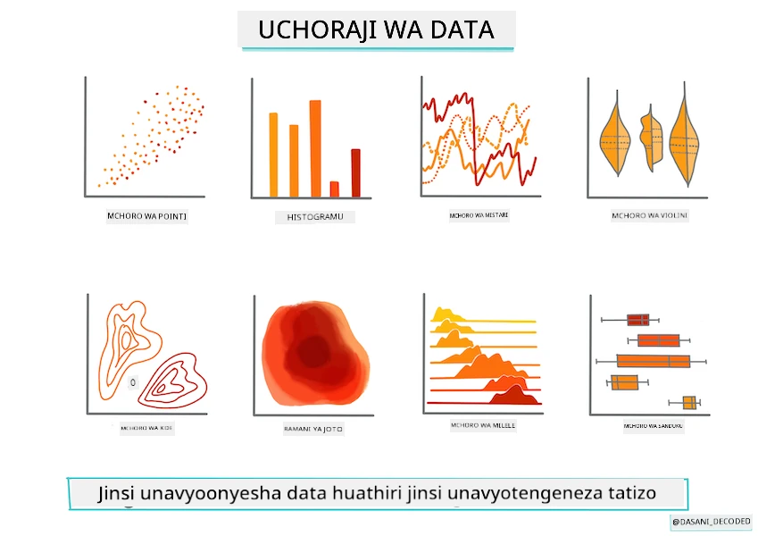
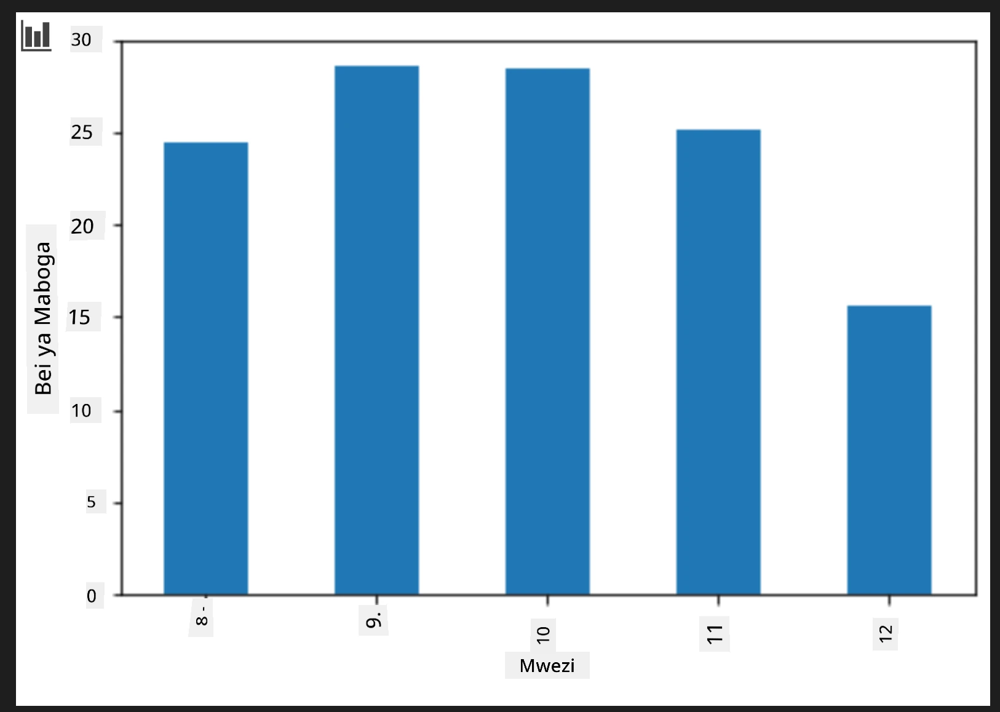
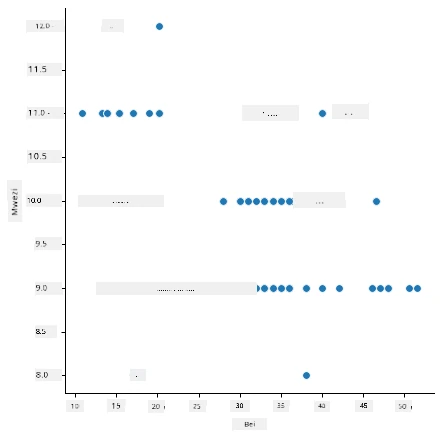
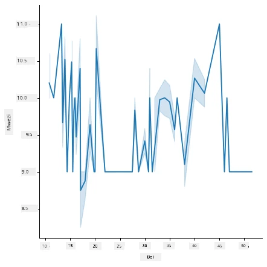
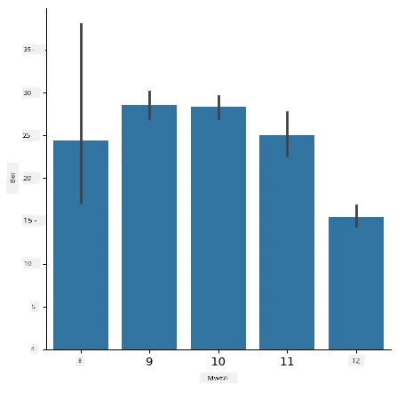
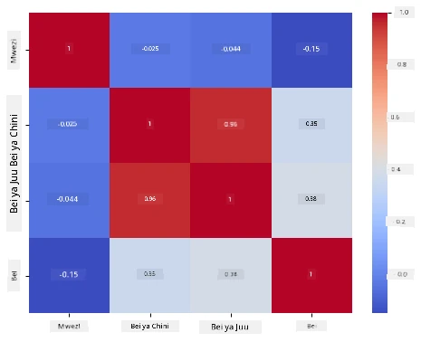

# Jenga mfano wa regresheni kwa kutumia Scikit-learn: andaa na onyesha data



Infographia na [Dasani Madipalli](https://twitter.com/dasani_decoded)

## [Mtihani kabla ya mihadhara](https://ff-quizzes.netlify.app/en/ml/)

> ### [Mafunzo haya yanapatikana katika R!](../../../../2-Regression/2-Data/solution/R/lesson_2.html)

## Utangulizi

Sasa umejiandaa na zana unazohitaji kuanza kujifunza ujenzi wa modeli ya kujifunza mashine kwa kutumia Scikit-learn, uko tayari kuanza kuuliza maswali kuhusu data yako. Unapofanya kazi na data na kutumia suluhisho za ML, ni muhimu sana kuelewa jinsi ya kuuliza swali sahihi ili kufungua vizuri uwezo wa dataset yako.

Katika somo hili, utajifunza:

- Jinsi ya kuandaa data yako kwa ajili ya ujenzi wa modeli.
- Jinsi ya kutumia Matplotlib kwa ajili ya uoneshaji data.
- Jinsi ya kutumia Seaborn kwa uoneshaji data wa kuelezea zaidi.

## Kuuliza swali sahihi la data yako

Swali unalohitaji kupata jibu litabainisha aina gani ya algoriti ya ML utakayotumia. Na ubora wa jibu utakayopata utategemea sana asili ya data yako.

Tazama [data](https://github.com/microsoft/ML-For-Beginners/blob/main/2-Regression/data/US-pumpkins.csv) iliyotolewa kwa somo hili. Unaweza kufungua faili hii ya .csv katika VS Code. Kuangalia kwa haraka kunaonyesha mara moja kuwa kuna maeneo yaliyo wazi na mchanganyiko wa mistari na data za nambari. Pia kuna safu ya ajabu iitwayo 'Package' ambapo data ni mchanganyiko kati ya 'sacks', 'bins' na thamani nyingine. Data, kwa kweli, ni machafuko kidogo.

[](https://youtu.be/5qGjczWTrDQ "ML kwa wakijifunza - Jinsi ya Kuchambua na Kusafisha Dataset")

> 🎥 Bonyeza picha hapo juu kwa video fupi ya kuonyesha jinsi ya kuandaa data kwa somo hili.

Kwa kweli, si kawaida kupewa dataset ambayo tayari iko tayari kabisa kwa kutumia kuunda modeli ya ML moja kwa moja. Katika somo hili, utajifunza jinsi ya kuandaa dataset ghafi kwa kutumia maktaba za kawaida za Python. Pia utajifunza mbinu mbalimbali za kuonesha data.

## Utafiti wa kesi: 'soko la malenge'

Katika folda hii utapata faili la .csv katika folda ya mizizi `data` iitwayo [US-pumpkins.csv](https://github.com/microsoft/ML-For-Beginners/blob/main/2-Regression/data/US-pumpkins.csv) linalojumuisha mistari 1757 ya data kuhusu soko la malenge, limepangwa kwa makundi kwa miji. Hii ni data ghafi iliyochukuliwa kutoka kwa [Ripoti za Viwango vya Masoko ya Mazao Maalum](https://www.marketnews.usda.gov/mnp/fv-report-config-step1?type=termPrice) zinazotolewa na Idara ya Kilimo ya Marekani.

### Kuandaa data

Data hii iko katika umma. Inaweza kupakuliwa katika faili nyingi tofauti, kwa kila jiji, kutoka kwa tovuti ya USDA. Kuepuka faili nyingi tofauti, tumeshanika data zote za miji kwenye spreadsheet moja, hivyo tumeshakuwa tume_anda_ data kidogo. Sasa, tuchunguze data kwa karibu zaidi.

### Data ya malenge - hitimisho la awali

Unaona nini kuhusu data hii? Tayari umeona kwamba kuna mchanganyiko wa mistari, nambari, sehemu zilizokotwa na thamani za ajabu unazohitaji kuelewa.

Swali gani unaweza kuuliza kuhusu data hii, ukitumia mbinu ya Regresheni? Vipi kuhusu "Tabiri bei ya malenge yanayouzwa wakati wa mwezi mmoja"? Kuangalia tena data, kuna mabadiliko unayohitaji kufanya ili kuunda muundo wa data unaohitajika kwa kazi hii.
## Zoefaa - chambua data ya malenge

Tumia [Pandas](https://pandas.pydata.org/), (jina linamaanisha `Python Data Analysis`) zana muhimu sana kwa kuunda data, kuchambua na kuandaa data hii ya malenge.

### Kwanza, angalia tarehe zinazokosekana

Kwanza utahitaji kuchukua hatua za kuangalia tarehe zilizokosekana:

1. Badilisha tarehe kuwa muundo wa mwezi (hizi ni tarehe za Marekani, hivyo muundo ni `MM/DD/YYYY`).
2. Chukua mwezi na weka kwenye safu mpya.

Fungua faili _notebook.ipynb_ katika Visual Studio Code na ingiza spreadsheet kwenye dataframe mpya ya Pandas.

1. Tumia kazi ya `head()` kuangalia mistari mitano ya kwanza.

    ```python
    import pandas as pd
    pumpkins = pd.read_csv('../data/US-pumpkins.csv')
    pumpkins.head()
    ```

    ✅ Ni kazi gani utakayotumia kuona mistari mitano ya mwisho?

1. Angalia ikiwa kuna data iliyokosekana katika dataframe ya sasa:

    ```python
    pumpkins.isnull().sum()
    ```

    Kuna data iliyokosekana, lakini labda haitakuwa na matokeo kwa kazi hii.

1. Ili kufanya dataframe yako iwe rahisi kufanya kazi nayo, chagua safu tu unazohitaji, ukitumia kazi ya `loc` ambayo huchukua kutoka kwa dataframe ya awali kundi la mistari (kama parameter ya kwanza) na safu (kama parameter ya pili). Kielelezo `:` katika mfano huu lina maana "mistari yote".

    ```python
    columns_to_select = ['Package', 'Low Price', 'High Price', 'Date']
    pumpkins = pumpkins.loc[:, columns_to_select]
    ```

### Pili, tambua bei ya wastani ya malenge

Fikiria jinsi ya kupata bei ya wastani ya malenge kwa mwezi fulani. Ni safu gani utachagua kwa kazi hii? Kuanza: utahitaji safu 3.

Suluhisho: chukua wastani wa safu za `Low Price` na `High Price` kujaza safu mpya ya Bei, na badilisha safu ya Tarehe kuonyesha tu mwezi. Kwa heri, kulingana na ukaguzi uliopita, hakuna data iliyokosekana kwa tarehe au bei.

1. Ili kuhesabu wastani, ongeza msimbo ufuatao:

    ```python
    price = (pumpkins['Low Price'] + pumpkins['High Price']) / 2

    month = pd.DatetimeIndex(pumpkins['Date']).month

    ```

   ✅ Huwezi kuchapisha data yoyote unayotaka kuangalia kwa kutumia `print(month)`.

2. Sasa, nakili data uliyoibadilisha ndani ya dataframe mpya ya Pandas:

    ```python
    new_pumpkins = pd.DataFrame({'Month': month, 'Package': pumpkins['Package'], 'Low Price': pumpkins['Low Price'],'High Price': pumpkins['High Price'], 'Price': price})
    ```

    Kuchapisha dataframe yako kutaonyesha dataset safi na nadhifu ambayo unaweza kutumia kujenga mfano wako mpya wa regresheni.

### Lakini subiri! Kuna jambo la kushangaza hapa

Ukitazama safu ya `Package`, malenge huuzwa kwa mipangilio tofauti. Baadhi huuzwa kwa vipimo vya '1 1/9 bushel', na baadhi kwa '1/2 bushel', baadhi kwa malenge moja moja, baadhi kwa pauni, na wengine katika masanduku makubwa ya upana tofauti.

> Malenge yanaonekana kuwa magumu kuyapima kwa usahihi

Ukichunguza data ya awali, ni ya kuvutia kuwa kitu chochote chenye `Unit of Sale` kinapokuwa sawa na 'EACH' au 'PER BIN' pia kina aina ya `Package` kwa inchi, kwa bin, au 'kila moja'. Malenge yanaonekana kuwa magumu kuyapima kwa usahihi, hivyo tuchujie kwa kuchagua malenge tu yenye maneno 'bushel' kwenye safu yao ya `Package`.

1. Ongeza kichujio juu ya faili, chini ya uingizaji wa .csv wa awali:

    ```python
    pumpkins = pumpkins[pumpkins['Package'].str.contains('bushel', case=True, regex=True)]
    ```

    Ikiwa uchapisha sasa data, utaona kuwa unapata mistari takriban 415 tu ya data ya malenge kwa bushel.

### Lakini subiri! Kuna jambo moja zaidi la kufanya

Umeona ikiwa kiasi cha bushel kinatofautiana kwa kila mstari? Unahitaji kurekebisha bei ili kuonyesha bei kwa bushel, basi fanya hesabu zozote za kuipanga sawa.

1. Ongeza mistari hii baada ya block ya kuunda dataframe ya new_pumpkins:

    ```python
    new_pumpkins.loc[new_pumpkins['Package'].str.contains('1 1/9'), 'Price'] = price/(1 + 1/9)

    new_pumpkins.loc[new_pumpkins['Package'].str.contains('1/2'), 'Price'] = price/(1/2)
    ```

✅ Kulingana na [The Spruce Eats](https://www.thespruceeats.com/how-much-is-a-bushel-1389308), uzito wa bushel unategemea aina ya mmea, kwa kuwa ni kipimo cha wingi. "Bushel ya nyanya, kwa mfano, inapaswa kuwa na uzito wa pauni 56... Majani na mboga huchukua nafasi zaidi kwa uzito mdogo, hivyo bushel ya spinachi ni pauni 20 tu." Ni jambo tata! Tusiweke juhudi za kubadilisha bushel kuwa pauni, badala yake tuchukulie bei kwa bushel. Utafiti huu wote wa bushel za malenge unaonyesha jinsi gani ni muhimu kuelewa asili ya data yako!

Sasa, unaweza kuchambua bei kwa kitengo kwa msingi wa kipimo chao cha bushel. Ikiwa uchapisha data mara moja zaidi, utaona jinsi ilivyo pangiliwa.

✅ Umeona malenge yanayouzwa kwa nusu-bushel ni ghali sana? Je, unaweza kupata sababu? Vidokezo: malenge madogo ni ghali zaidi kuliko makubwa, labda kwa sababu kuna mengi zaidi ndani ya bushel, ikizingatiwa nafasi isiyotumika na malenge makubwa ya aina ya pai.

## Mikakati ya Uoneshaji Data

Sehemu ya kazi ya mtaalamu wa data ni kuonyesha ubora na asili ya data wanayofanya kazi nayo. Kufanya hivi, mara nyingi huunda uoneshaji wa kuvutia, au michoro, grafu, na chati, zikionyesha nyanja tofauti za data. Kwa njia hii, wanaweza kuonyesha kwa macho uhusiano na mapengo ambayo vinginevyo ni vigumu kugundua.

[](https://youtu.be/SbUkxH6IJo0 "ML kwa wakijifunza - Jinsi ya Kuonesha Data kwa Matplotlib")

> 🎥 Bonyeza picha hapo juu kwa video fupi ya kuonyesha jinsi ya kuonesha data kwa somo hili.

Uoneshaji pia unaweza kusaidia kubainisha mbinu ya kujifunza mashine inayofaa zaidi kwa ajili ya data. Grosari ya pointi inayoonekana kufuata mstari, kwa mfano, inaonyesha kuwa data ni mzuri kwa mtihani wa regresheni ya mistari.

Maktaba moja ya uoneshaji data ambayo inafanya kazi vizuri katika vitabu vya Jupyter ni [Matplotlib](https://matplotlib.org/) (ambayo pia uliiona katika somo lililopita).

> Pata uzoefu zaidi wa uoneshaji data katika [mafunzo haya](https://docs.microsoft.com/learn/modules/explore-analyze-data-with-python?WT.mc_id=academic-77952-leestott).

## Zoefaa - jaribu Matplotlib

Jaribu kuunda michoro ya msingi kuonyesha dataframe mpya uliyounda. Mchoro wa mstari wa msingi utaonyesha nini?

1. Ingiza Matplotlib juu ya faili, chini ya uingizaji wa Pandas:

    ```python
    import matplotlib.pyplot as plt
    ```

1. Runia tena kitabu chote kwa ajili ya kufufua.
1. Chini ya kitabu, ongeza seli kuonyesha data kama sanduku:

    ```python
    price = new_pumpkins.Price
    month = new_pumpkins.Month
    plt.scatter(price, month)
    plt.show()
    ```

    

    Je, ni mchoro wenye maana? Kuna kitu chochote kinachokushangaza kuhusu?

    Haufaidiki sana kwa kuwa huchapisha data yako kama pointi zilizotawanyika katika mwezi fulani.

### Ifanye iwe na maana

Ili kupata chati zinazoshughulikia data muhimu, kawaida unahitaji kuunganya data kwa namna fulani. Tujaribu kuunda mchoro ambapo mhimili wa y unaonyesha miezi na data inaonesha usambazaji wa data.

1. Ongeza seli kuunda chati ya bawa iliyounganishwa:

    ```python
    new_pumpkins.groupby(['Month'])['Price'].mean().plot(kind='bar')
    plt.ylabel("Pumpkin Price")
    ```

    

    Hii ni uoneshaji wa data wenye maana zaidi! Inaonekana kuonyesha kuwa bei ya juu ya malenge hutokea Septemba na Oktoba. Je, hii inakidhi matarajio yako? Sababu ni gani au la?

## Zoefaa - jaribu Seaborn

Matplotlib ni yenye nguvu, lakini inaweza kuhitaji msimbo mwingi kufanya chati nzuri. [Seaborn](https://seaborn.pydata.org/) ni maktaba iliyojengwa _juu ya_ Matplotlib iliyoundwa kwa uoneshaji wa takwimu za data. Inafanya kazi moja kwa moja na dataframes za Pandas, inatumia mitindo ya kupendeza ya chaguo, na inakuwezesha kuunda michoro ya taarifa kwa msimbo mdogo zaidi. Kwa sababu Seaborn hurudisha vitu vya Matplotlib, bado unaweza kutumia kila kitu unachojua kuhusu Matplotlib kuboresha matokeo.

> Ikiwa bado huna Seaborn imewekwa, voila na `pip install seaborn`.

1. Ingiza Seaborn juu ya kitabu, chini ya uingizaji mwingine. Kwa kawaida huingizwa kama `sns`:

    ```python
    import seaborn as sns
    ```

### Michoro ya pointi kuonyesha uhusiano

Sehemu kubwa ya kuchunguza data kabla ya kujenga mfano ni kutafuta _uhusiano_ kati ya vigezo. [mchoro wa mkusanyiko wa pointi](https://en.wikipedia.org/wiki/Scatter_plot) ni chombo mojawapo bora kwa hili: kama pointi zinaonekana kufuata mstari, vigezo viwili vinaweza kuwa na uhusiano, jambo zuri la kuonyesha kuwa mfano wa regresheni ya mstari unaweza kufanya kazi.

1. Tengeneza upya mchoro wa bei kwa mwezi wa pointi uliofanya awali, huku kwa kutumia [`relplot()`](https://seaborn.pydata.org/generated/seaborn.relplot.html) ya Seaborn (mchoro wa uhusiano), ambayo hufanya kazi moja kwa moja na safu za dataframe yako:

    ```python
    sns.relplot(x="Price", y="Month", data=new_pumpkins)
    ```

    

    Unaona jinsi unavyopitisha _majina ya safu_ na dataframe, na Seaborn hutunza lebo za mhimili kwa niaba yako.

2. Unaweza kubadili kuwa mchoro wa mstari kwa kupitisha `kind="line"`. Seaborn pia huteka bendi yenye kivuli kuonyesha kiwango cha kujiamini karibu na mstari huo:

    ```python
    sns.relplot(x="Price", y="Month", kind="line", data=new_pumpkins)
    ```

    

    Hili data ni zenye kelele nyingi, hivyo mchoro wa mstari si chaguo bora hapa — lakini linaonyesha urahisi wa kubadilisha aina za chati katika Seaborn.

### Chati za bawa kuonyesha usambazaji


Hapo awali ulipanga data kwa mkono kuunda chati ya mawimbi kwa kutumia Matplotlib. Seaborn's [`catplot()`](https://seaborn.pydata.org/generated/seaborn.catplot.html) (kina chati cha makundi) inaweza kufanya upangaji na muhtasari kwa niaba yako. Kwa kawaida `kind="bar"` inaonyesha wastani wa kila kundi pamoja na mstari mweusi unaoashiria kikomo cha kujiamini.

1. Tengeneza chati ya mawimbi ya wastani wa bei kwa kila mwezi:

    ```python
    sns.catplot(x="Month", y="Price", data=new_pumpkins, kind="bar")
    ```

    

    Hii inathibitisha kile ulichoona na Matplotlib — bei huongezeka karibu na Septemba na Oktoba — lakini Seaborn pia inaonyesha jinsi bei _inavyotofautiana_ ndani ya kila mwezi.

### Ramani za joto kuonyesha uhusiano

Chati za alama hulinganisha vigezo viwili kwa wakati mmoja. Unapokuwa na safu kadhaa za nambari, [ramani ya joto](https://en.wikipedia.org/wiki/Heat_map) hukuwezesha kuona nguvu ya uhusiano kati ya jozi _kila_ la safu kwa wakati mmoja. Hii ni njia ya kawaida ya kugundua vipengele vilivyohusiana zaidi kabla ya kuchagua ni ipi yaingizwe kwenye modeli (na aina hiyo hiyo ya chati hutumika baadaye kuonyesha matrisi za mchanganyiko katika aina).

1. Tengeneza matriki ya uhusiano kwa kutumia Pandas, kisha chora kwa kutumia Seaborn's [`heatmap()`](https://seaborn.pydata.org/generated/seaborn.heatmap.html). Chaguo la `annot=True` linaandika thamani za uhusiano kila seli:

    ```python
    correlations = new_pumpkins[['Month', 'Low Price', 'High Price', 'Price']].corr()
    sns.heatmap(correlations, annot=True, cmap="coolwarm")
    ```

    

    Thamani karibu na `1` (au `-1`) zinamaanisha safu za nambari zina uhusiano _mwenye mstari_ mkali. Angalia jinsi `Bei ya Chini` na `Bei ya Juu` zinavyohusiana karibu kabisa. `Mwezi`, kwa upande mwingine, unaonyesha uhusiano wa mstari dhaifu na bei — ingawa chati ya mabawaba hapo juu ilionyesha kilele cha msimu wazi Septemba na Oktoba. Hiyo ni somo muhimu: mlinganyo wa uhusiano hupima tu uhusiano wa mstari mwelekeo moja, hivyo unaweza kupoteza mifumo ya msimu au mingine isiyo ya mstari. ✅ Ni kwa nini ni muhimu kuangalia ramani ya joto *na* chati kama chati ya mabawaba kabla ya kuamua ni safu gani zitumike?

### Matplotlib au Seaborn?

Maktaba zote mbili zinapaswa kujulikana:

- **Matplotlib** inakupa udhibiti wa kina juu ya kila kipengele cha chati na ni msingi wa karibu kila maktaba nyingine za kuchora Python.
- **Seaborn** hutoa kazi za ngazi ya juu na mipangilio ya kuvutia kwa chati za takwimu, hufanya kazi moja kwa moja na dataframes, na mara nyingi ni haraka zaidi kwa uchambuzi wa data wa uchunguzi.

Njia ya kawaida ni kutumia Seaborn kuchunguza data kwa haraka, kisha kurudi kwa Matplotlib unapohitaji kubinafsisha maelezo.

---

## 🚀Changamoto

Chunguza aina tofauti za uonyeshaji ambazo Matplotlib na Seaborn hutoa. Ni aina gani zinafaa zaidi kwa matatizo ya mregesho?

## [Mtihani baada ya mihadhara](https://ff-quizzes.netlify.app/en/ml/)

## Mapitio na Kujifunza Binafsi

Angalia njia nyingi za kuonyesha data. Tengeneza orodha ya maktaba mbalimbali zilizopo na angazia ni zipi zinafaa kwa aina za kazi mbalimbali, kwa mfano uonyeshaji wa 2D dhidi ya uonyeshaji wa 3D. Je, unagundua nini?

## Kazi ya Nyumbani

[Kuchunguza uonyeshaji](assignment.md)

---

<!-- CO-OP TRANSLATOR DISCLAIMER START -->
**Kionyozo**:
Hati hii imetafsiriwa kwa kutumia huduma ya tafsiri ya AI [Co-op Translator](https://github.com/Azure/co-op-translator). Ingawa tunajitahidi kupata usahihi, tafadhali fahamu kwamba tafsiri za kiotomatiki zinaweza kuwa na makosa au upungufu wa usahihi. Hati ya asili katika lugha yake halisi inapaswa kuchukuliwa kama chanzo cha mamlaka. Kwa taarifa muhimu, tafsiri ya kitaalamu inayofanywa na binadamu inapendekezwa. Hatutojibu kwa kuelewa vibaya au tafsiri potofu zinazotokea kutokana na matumizi ya tafsiri hii.
<!-- CO-OP TRANSLATOR DISCLAIMER END -->