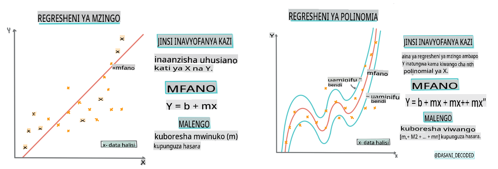

# Jenga modeli ya regression kwa kutumia Scikit-learn: regression kwa njia nne


> Picha ya taarifa na [Dasani Madipalli](https://twitter.com/dasani_decoded)
## [Quiz kabla ya somo](https://gray-sand-07a10f403.1.azurestaticapps.net/quiz/13/)

> ### [Somo hili linapatikana katika R!](../../../../2-Regression/3-Linear/solution/R/lesson_3.html)
### Utangulizi

Hadi sasa umechunguza regression ni nini kwa kutumia data za sampuli zilizokusanywa kutoka kwa seti ya data ya bei za malenge ambayo tutatumia katika somo hili lote. Pia umeweza kuiona kwa kutumia Matplotlib.

Sasa uko tayari kuingia zaidi kwenye regression kwa ML. Wakati visualization inakuruhusu kuelewa data, nguvu halisi ya Machine Learning inatoka kwenye _kufundisha mifano_. Mifano inafundishwa kwenye data za kihistoria ili kunasa moja kwa moja utegemezi wa data, na hukuruhusu kutabiri matokeo kwa data mpya, ambayo mfano haujaiona kabla.

Katika somo hili, utajifunza zaidi kuhusu aina mbili za regression: _basic linear regression_ na _polynomial regression_, pamoja na baadhi ya hisabati inayohusiana na mbinu hizi. Mifano hii itatuwezesha kutabiri bei za malenge kulingana na data tofauti za pembejeo.

[](https://youtu.be/CRxFT8oTDMg "ML kwa wanaoanza - Kuelewa Linear Regression")

> 🎥 Bofya picha hapo juu kwa muhtasari mfupi wa video kuhusu linear regression.

> Katika mtaala huu, tunadhania kuwa na maarifa ya chini ya hisabati, na tunalenga kuifanya ipatikane kwa wanafunzi wanaotoka katika nyanja nyingine, hivyo angalia maelezo, 🧮 callouts, michoro, na zana zingine za kujifunza kusaidia kuelewa.

### Mahitaji

Unapaswa kuwa na ufahamu sasa na muundo wa data ya malenge tunayochunguza. Unaweza kuipata ikiwa imepakiwa na kusafishwa katika faili ya _notebook.ipynb_ ya somo hili. Katika faili, bei ya malenge inaonyeshwa kwa bushel katika fremu mpya ya data. Hakikisha unaweza kuendesha hizi notebooks katika kernels katika Visual Studio Code.

### Maandalizi

Kama ukumbusho, unapakia data hii ili uweze kuuliza maswali yake.

- Ni wakati gani mzuri wa kununua malenge?
- Ninaweza kutarajia bei gani ya kasha la malenge madogo?
- Je, ninunue kwa vikapu vya nusu bushel au kwa sanduku la bushel 1 1/9?
Tuendelee kuchimba data hii.

Katika somo lililopita, uliunda fremu ya data ya Pandas na kuijaza na sehemu ya seti ya data ya awali, ukistandardisha bei kwa bushel. Kwa kufanya hivyo, hata hivyo, uliweza tu kukusanya takriban pointi 400 za data na kwa miezi ya msimu wa vuli tu.

Angalia data ambayo tulipakia katika notebook inayosindikiza somo hili. Data imepakiwa na scatterplot ya awali imechorwa kuonyesha data ya mwezi. Labda tunaweza kupata maelezo zaidi kuhusu asili ya data kwa kuisafisha zaidi.

## Mstari wa regression ya mstari

Kama ulivyojifunza katika Somo la 1, lengo la zoezi la regression ya mstari ni kuweza kuchora mstari ili:

- **Kuonyesha uhusiano wa vigezo**. Kuonyesha uhusiano kati ya vigezo
- **Kufanya utabiri**. Kufanya utabiri sahihi wa mahali ambapo pointi mpya ya data ingeingia kwa uhusiano na mstari huo.

Ni kawaida kwa **Least-Squares Regression** kuchora aina hii ya mstari. Neno 'least-squares' linamaanisha kwamba pointi zote za data zinazozunguka mstari wa regression zimetolewaz na kisha kuongezwa. Kwa hali nzuri, jumla ya mwisho ni ndogo iwezekanavyo, kwa sababu tunataka idadi ndogo ya makosa, au `least-squares`.

Tunafanya hivyo kwa sababu tunataka kuunda mstari ambao una umbali wa chini kabisa kutoka kwa pointi zote za data zetu. Pia tunazitoa maneno kabla ya kuyaongeza kwa sababu tunajali ukubwa wake badala ya mwelekeo wake.

> **🧮 Nionyeshe hisabati**
>
> Mstari huu, unaoitwa _line of best fit_ unaweza kuonyeshwa na [mchoro](https://en.wikipedia.org/wiki/Simple_linear_regression):
>
> ```
> Y = a + bX
> ```
>
> `X` is the 'explanatory variable'. `Y` is the 'dependent variable'. The slope of the line is `b` and `a` is the y-intercept, which refers to the value of `Y` when `X = 0`. 
>
>
>
> First, calculate the slope `b`. Infographic by [Jen Looper](https://twitter.com/jenlooper)
>
> In other words, and referring to our pumpkin data's original question: "predict the price of a pumpkin per bushel by month", `X` would refer to the price and `Y` would refer to the month of sale. 
>
>
>
> Calculate the value of Y. If you're paying around $4, it must be April! Infographic by [Jen Looper](https://twitter.com/jenlooper)
>
> The math that calculates the line must demonstrate the slope of the line, which is also dependent on the intercept, or where `Y` is situated when `X = 0`.
>
> You can observe the method of calculation for these values on the [Math is Fun](https://www.mathsisfun.com/data/least-squares-regression.html) web site. Also visit [this Least-squares calculator](https://www.mathsisfun.com/data/least-squares-calculator.html) to watch how the numbers' values impact the line.

## Correlation

One more term to understand is the **Correlation Coefficient** between given X and Y variables. Using a scatterplot, you can quickly visualize this coefficient. A plot with datapoints scattered in a neat line have high correlation, but a plot with datapoints scattered everywhere between X and Y have a low correlation.

A good linear regression model will be one that has a high (nearer to 1 than 0) Correlation Coefficient using the Least-Squares Regression method with a line of regression.

✅ Run the notebook accompanying this lesson and look at the Month to Price scatterplot. Does the data associating Month to Price for pumpkin sales seem to have high or low correlation, according to your visual interpretation of the scatterplot? Does that change if you use more fine-grained measure instead of `Month`, eg. *day of the year* (i.e. number of days since the beginning of the year)?

In the code below, we will assume that we have cleaned up the data, and obtained a data frame called `new_pumpkins`, similar to the following:

ID | Month | DayOfYear | Variety | City | Package | Low Price | High Price | Price
---|-------|-----------|---------|------|---------|-----------|------------|-------
70 | 9 | 267 | PIE TYPE | BALTIMORE | 1 1/9 bushel cartons | 15.0 | 15.0 | 13.636364
71 | 9 | 267 | PIE TYPE | BALTIMORE | 1 1/9 bushel cartons | 18.0 | 18.0 | 16.363636
72 | 10 | 274 | PIE TYPE | BALTIMORE | 1 1/9 bushel cartons | 18.0 | 18.0 | 16.363636
73 | 10 | 274 | PIE TYPE | BALTIMORE | 1 1/9 bushel cartons | 17.0 | 17.0 | 15.454545
74 | 10 | 281 | PIE TYPE | BALTIMORE | 1 1/9 bushel cartons | 15.0 | 15.0 | 13.636364

> The code to clean the data is available in [`notebook.ipynb`](../../../../2-Regression/3-Linear/notebook.ipynb). We have performed the same cleaning steps as in the previous lesson, and have calculated `DayOfYear` kwa kutumia usemi ufuatao:

```python
day_of_year = pd.to_datetime(pumpkins['Date']).apply(lambda dt: (dt-datetime(dt.year,1,1)).days)
```

Sasa kwa kuwa unaelewa hisabati nyuma ya regression ya mstari, hebu tuunde mfano wa Regression kuona kama tunaweza kutabiri ni kifurushi gani cha malenge kitakuwa na bei bora za malenge. Mtu anayenunua malenge kwa ajili ya shamba la malenge la likizo anaweza kutaka habari hii ili aweze kuboresha manunuzi yake ya vifurushi vya malenge kwa shamba hilo.

## Kutafuta Uhusiano

[](https://youtu.be/uoRq-lW2eQo "ML kwa wanaoanza - Kutafuta Uhusiano: Muhimu kwa Regression ya Mstari")

> 🎥 Bofya picha hapo juu kwa muhtasari mfupi wa video kuhusu uhusiano.

Kutoka somo lililopita labda umeona kuwa bei ya wastani kwa miezi tofauti inaonekana kama hii:


Hii inapendekeza kwamba kunaweza kuwa na uhusiano fulani, na tunaweza kujaribu kufundisha mfano wa regression ya mstari kutabiri uhusiano kati ya `Month` and `Price`, or between `DayOfYear` and `Price`. Here is the scatter plot that shows the latter relationship:

 

Let's see if there is a correlation using the `corr` kazi:

```python
print(new_pumpkins['Month'].corr(new_pumpkins['Price']))
print(new_pumpkins['DayOfYear'].corr(new_pumpkins['Price']))
```

Inaonekana kama uhusiano ni mdogo, -0.15 kwa `Month` and -0.17 by the `DayOfMonth`, but there could be another important relationship. It looks like there are different clusters of prices corresponding to different pumpkin varieties. To confirm this hypothesis, let's plot each pumpkin category using a different color. By passing an `ax` parameter to the `scatter` kazi ya kuchora tunaweza kuchora pointi zote kwenye grafu moja:

```python
ax=None
colors = ['red','blue','green','yellow']
for i,var in enumerate(new_pumpkins['Variety'].unique()):
    df = new_pumpkins[new_pumpkins['Variety']==var]
    ax = df.plot.scatter('DayOfYear','Price',ax=ax,c=colors[i],label=var)
```


Uchunguzi wetu unapendekeza kwamba aina ina athari zaidi kwenye bei ya jumla kuliko tarehe halisi ya kuuza. Tunaweza kuona hili kwa grafu ya bar:

```python
new_pumpkins.groupby('Variety')['Price'].mean().plot(kind='bar')
```


Tujikite kwa sasa kwenye aina moja tu ya malenge, 'aina ya pie', na tuone athari ya tarehe kwenye bei:

```python
pie_pumpkins = new_pumpkins[new_pumpkins['Variety']=='PIE TYPE']
pie_pumpkins.plot.scatter('DayOfYear','Price') 
```


Ikiwa sasa tutahesabu uhusiano kati ya `Price` and `DayOfYear` using `corr` function, we will get something like `-0.27` - ambayo inamaanisha kwamba kufundisha mfano wa kutabiri ina maana.

> Kabla ya kufundisha mfano wa regression ya mstari, ni muhimu kuhakikisha kuwa data yetu ni safi. Regression ya mstari haifanyi kazi vizuri na thamani zilizokosekana, hivyo ina maana kuondoa seli zote tupu:

```python
pie_pumpkins.dropna(inplace=True)
pie_pumpkins.info()
```

Njia nyingine itakuwa kujaza thamani hizo tupu na thamani za wastani kutoka kwenye safu inayolingana.

## Regression ya Mstari Rahisi

[](https://youtu.be/e4c_UP2fSjg "ML kwa wanaoanza - Regression ya Mstari na Polynomial kwa kutumia Scikit-learn")

> 🎥 Bofya picha hapo juu kwa muhtasari mfupi wa video kuhusu regression ya mstari na polynomial.

Ili kufundisha mfano wetu wa Regression ya Mstari, tutatumia maktaba ya **Scikit-learn**.

```python
from sklearn.linear_model import LinearRegression
from sklearn.metrics import mean_squared_error
from sklearn.model_selection import train_test_split
```

Tunanza kwa kutenganisha thamani za pembejeo (vipengele) na matokeo yanayotarajiwa (label) kwenye arrays tofauti za numpy:

```python
X = pie_pumpkins['DayOfYear'].to_numpy().reshape(-1,1)
y = pie_pumpkins['Price']
```

> Kumbuka kwamba tulilazimika kufanya `reshape` kwenye data ya pembejeo ili kifurushi cha Regression ya Mstari kiielewe kwa usahihi. Regression ya Mstari inatarajia array ya 2D kama pembejeo, ambapo kila safu ya array inalingana na vector ya vipengele vya pembejeo. Katika kesi yetu, kwa kuwa tuna pembejeo moja tu - tunahitaji array yenye umbo N×1, ambapo N ni saizi ya seti ya data.

Kisha, tunahitaji kugawanya data katika seti za mafunzo na majaribio, ili tuweze kuthibitisha mfano wetu baada ya mafunzo:

```python
X_train, X_test, y_train, y_test = train_test_split(X, y, test_size=0.2, random_state=0)
```

Hatimaye, kufundisha mfano halisi wa Regression ya Mstari kunachukua mistari miwili tu ya msimbo. Tunafafanua `LinearRegression` object, and fit it to our data using the `fit` njia:

```python
lin_reg = LinearRegression()
lin_reg.fit(X_train,y_train)
```

`LinearRegression` object after `fit`-ting contains all the coefficients of the regression, which can be accessed using `.coef_` property. In our case, there is just one coefficient, which should be around `-0.017`. It means that prices seem to drop a bit with time, but not too much, around 2 cents per day. We can also access the intersection point of the regression with Y-axis using `lin_reg.intercept_` - it will be around `21` katika kesi yetu, kuashiria bei mwanzoni mwa mwaka.

Ili kuona jinsi mfano wetu ulivyo sahihi, tunaweza kutabiri bei kwenye seti ya data ya majaribio, na kisha kupima jinsi utabiri wetu ulivyo karibu na thamani zinazotarajiwa. Hii inaweza kufanywa kwa kutumia metrics ya mean square error (MSE), ambayo ni wastani wa tofauti zote zilizotolewa kati ya thamani inayotarajiwa na inayotabiriwa.

```python
pred = lin_reg.predict(X_test)

mse = np.sqrt(mean_squared_error(y_test,pred))
print(f'Mean error: {mse:3.3} ({mse/np.mean(pred)*100:3.3}%)')
```

Kosa letu linaonekana kuwa karibu na pointi 2, ambayo ni ~17%. Sio nzuri sana. Kiashiria kingine cha ubora wa mfano ni **coefficient of determination**, ambayo inaweza kupatikana kama hii:

```python
score = lin_reg.score(X_train,y_train)
print('Model determination: ', score)
```
Ikiwa thamani ni 0, inamaanisha kwamba mfano hauzingatii data ya pembejeo, na hufanya kama *mtabiri mbaya zaidi wa mstari*, ambayo ni wastani wa thamani ya matokeo. Thamani ya 1 inamaanisha kwamba tunaweza kutabiri kwa usahihi matokeo yote yanayotarajiwa. Katika kesi yetu, coefficient ni karibu 0.06, ambayo ni ya chini kabisa.

Tunaweza pia kuchora data ya majaribio pamoja na mstari wa regression ili kuona vizuri jinsi regression inavyofanya kazi katika kesi yetu:

```python
plt.scatter(X_test,y_test)
plt.plot(X_test,pred)
```


## Regression ya Polynomial

Aina nyingine ya Regression ya Mstari ni Regression ya Polynomial. Wakati mwingine kuna uhusiano wa mstari kati ya vigezo - kadri malenge yanavyokuwa kubwa kwa ujazo, ndivyo bei inavyoongezeka - wakati mwingine uhusiano huu hauwezi kuchorwa kama ndege au mstari wa moja kwa moja.

✅ Hapa kuna [mifano zaidi](https://online.stat.psu.edu/stat501/lesson/9/9.8) ya data ambayo inaweza kutumia Regression ya Polynomial

Angalia tena uhusiano kati ya Tarehe na Bei. Je, scatterplot hii inaonekana kama inapaswa kuchambuliwa na mstari wa moja kwa moja? Je, bei haziwezi kubadilika? Katika kesi hii, unaweza kujaribu regression ya polynomial.

✅ Polynomials ni misemo ya hisabati ambayo inaweza kuwa na moja au zaidi ya vigezo na coefficients

Regression ya polynomial huunda mstari uliopinda ili kutoshea data isiyo ya mstari vizuri. Katika kesi yetu, ikiwa tutajumuisha variable ya `DayOfYear` iliyotolewa kwenye data ya pembejeo, tunapaswa kuweza kutoshea data yetu na curve ya parabolic, ambayo itakuwa na kiwango cha chini katika hatua fulani ndani ya mwaka.

Scikit-learn inajumuisha [API ya pipeline](https://scikit-learn.org/stable/modules/generated/sklearn.pipeline.make_pipeline.html?highlight=pipeline#sklearn.pipeline.make_pipeline) kusaidia kuunganisha hatua tofauti za usindikaji wa data pamoja. **Pipeline** ni mnyororo wa **estimators**. Katika kesi yetu, tutaunda pipeline ambayo kwanza inaongeza vipengele vya polynomial kwenye mfano wetu, na kisha kufundisha regression:

```python
from sklearn.preprocessing import PolynomialFeatures
from sklearn.pipeline import make_pipeline

pipeline = make_pipeline(PolynomialFeatures(2), LinearRegression())

pipeline.fit(X_train,y_train)
```

Kutumia `PolynomialFeatures(2)` means that we will include all second-degree polynomials from the input data. In our case it will just mean `DayOfYear`<sup>2</sup>, but given two input variables X and Y, this will add X<sup>2</sup>, XY and Y<sup>2</sup>. We may also use higher degree polynomials if we want.

Pipelines can be used in the same manner as the original `LinearRegression` object, i.e. we can `fit` the pipeline, and then use `predict` to get the prediction results. Here is the graph showing test data, and the approximation curve:


Using Polynomial Regression, we can get slightly lower MSE and higher determination, but not significantly. We need to take into account other features!

> You can see that the minimal pumpkin prices are observed somewhere around Halloween. How can you explain this? 

🎃 Congratulations, you just created a model that can help predict the price of pie pumpkins. You can probably repeat the same procedure for all pumpkin types, but that would be tedious. Let's learn now how to take pumpkin variety into account in our model!

## Categorical Features

In the ideal world, we want to be able to predict prices for different pumpkin varieties using the same model. However, the `Variety` column is somewhat different from columns like `Month`, because it contains non-numeric values. Such columns are called **categorical**.

[](https://youtu.be/DYGliioIAE0 "ML for beginners - Categorical Feature Predictions with Linear Regression")

> 🎥 Click the image above for a short video overview of using categorical features.

Here you can see how average price depends on variety:


To take variety into account, we first need to convert it to numeric form, or **encode** it. There are several way we can do it:

* Simple **numeric encoding** will build a table of different varieties, and then replace the variety name by an index in that table. This is not the best idea for linear regression, because linear regression takes the actual numeric value of the index, and adds it to the result, multiplying by some coefficient. In our case, the relationship between the index number and the price is clearly non-linear, even if we make sure that indices are ordered in some specific way.
* **One-hot encoding** will replace the `Variety` column by 4 different columns, one for each variety. Each column will contain `1` if the corresponding row is of a given variety, and `0` vinginevyo. Hii inamaanisha kwamba kutakuwa na coefficients nne katika regression ya mstari, moja kwa kila aina ya malenge, inayohusika na "bei ya kuanzia" (au badala "bei ya ziada") kwa aina hiyo maalum.

Msimbo hapa chini unaonyesha jinsi tunavyoweza one-hot encode aina:

```python
pd.get_dummies(new_pumpkins['Variety'])
```

 ID | FAIRYTALE | MINIATURE | MIXED HEIRLOOM VARIETIES | PIE TYPE
----|-----------|-----------|--------------------------|----------
70 | 0 | 0 | 0 | 1
71 | 0 | 0 | 0 | 1
... | ... | ... | ... | ...
1738 | 0 | 1 | 0 | 0
1739 | 0 | 1 | 0 | 0
1740 | 0 | 1 | 0 | 0
1741 | 0 | 1 | 0 | 0
1742 | 0 | 1 | 0 | 0

Ili kufundisha regression ya mstari kwa kutumia aina iliyowekwa one-hot encoded kama pembejeo, tunahitaji tu kuanzisha `X` and `y` data kwa usahihi:

```python
X = pd.get_dummies(new_pumpkins['Variety'])
y = new_pumpkins['Price']
```

Sehemu iliyobaki ya msimbo ni sawa na tuliyotumia hapo juu kufundisha Regression ya Mstari. Ikiwa utaijaribu, utaona kwamba mean square error ni karibu sawa, lakini tunapata coefficient ya juu zaidi ya determination (~77%). Ili kupata utabiri sahihi zaidi, tunaweza kuzingatia vipengele zaidi vya kategoria, pamoja na vipengele vya nambari, kama `Month` or `DayOfYear`. To get one large array of features, we can use `join`:

```python
X = pd.get_dummies(new_pumpkins['Variety']) \
        .join(new_pumpkins['Month']) \
        .join(pd.get_dummies(new_pumpkins['City'])) \
        .join(pd.get_dummies(new_pumpkins['Package']))
y = new_pumpkins['Price']
```

Hapa pia tunazingatia `City` and `Package` type, ambayo inatupa MSE 2.84 (10%), na determination 0.94!

## Kuweka yote pamoja

Ili kufanya mfano bora zaidi, tunaweza kutumia data iliyochanganywa (one-hot encoded categorical + numeric) kutoka mfano hapo juu pamoja na Regression ya Polynomial. Hapa kuna msimbo kamili kwa urahisi wako:

```python
# set up training data
X = pd.get_dummies(new_pumpkins['Variety']) \
        .join(new_pumpkins['Month']) \
        .join(pd.get_dummies(new_pumpkins['City'])) \
        .join(pd.get_dummies(new_pumpkins['Package']))
y = new_pumpkins['Price']

# make train-test split
X_train, X_test, y_train, y_test = train_test_split(X, y, test_size=0.2, random_state=0)

# setup and train the pipeline
pipeline = make_pipeline(PolynomialFeatures(2), LinearRegression())
pipeline.fit(X_train,y_train)

# predict results for test data
pred = pipeline.predict(X_test)

# calculate MSE and determination
mse = np.sqrt(mean_squared_error(y_test,pred))
print(f'Mean error: {mse:3.3} ({mse/np.mean(pred)*100:3.3}%)')

score = pipeline.score(X_train,y_train)
print('Model determination: ', score)
```

Hii inapaswa kutupa coefficient bora ya determination ya karibu 97%, na MSE=2.23 (~8% prediction error).

| Model | MSE | Determination |
|-------|-----|---------------|
| `DayOfYear` Linear | 2.77 (17.2%) | 0.07 |
| `DayOfYear` Polynomial | 2.73 (17.0%) | 0.08 |
| `Variety` Linear | 5.24 (19.7%) | 0.77 |
| All features Linear | 2.84 (10.5%) | 0.94 |
| All features Polynomial | 2.23 (8.25%) | 0.97 |

🏆 Umefanya vizuri! Umeunda mifano minne ya Regression katika somo moja, na kuboresha ubora wa mfano hadi 97%. Katika sehemu ya mwisho ya Regression, utajifunza kuhusu Logistic Regression ili kubaini kategoria.

---
## 🚀Changamoto

Jaribu vigezo tofauti kadhaa katika notebook hii kuona jinsi uhusiano unavyolingana na usahihi wa mfano.

## [Quiz baada ya somo](https://gray-sand-07a10f403.1.azurestaticapps.net/quiz/14/)

## Mapitio na Kujisomea

Katika somo hili tulijifunza kuhusu Regression ya Mstari. Kuna aina nyingine muhimu za Regression. Soma kuhusu mbinu za Stepwise, Ridge, Lasso na Elasticnet. Kozi nzuri ya kusoma kujifunza zaidi ni [Kozi ya Stanford ya Statistical Learning](https://online.stanford.edu/courses/sohs-ystatslearning-statistical-learning)

## Kazi

[Jenga Modeli](assignment.md)

**Kanusho**: 
Hati hii imetafsiriwa kwa kutumia huduma za tafsiri za AI za mashine. Ingawa tunajitahidi kwa usahihi, tafadhali fahamu kwamba tafsiri za kiotomatiki zinaweza kuwa na makosa au kutokuwa sahihi. Hati ya asili katika lugha yake ya kiasili inapaswa kuzingatiwa kama chanzo cha mamlaka. Kwa habari muhimu, tafsiri ya kibinadamu ya kitaalamu inapendekezwa. Hatutawajibika kwa kutoelewana au tafsiri zisizo sahihi zinazotokana na matumizi ya tafsiri hii.