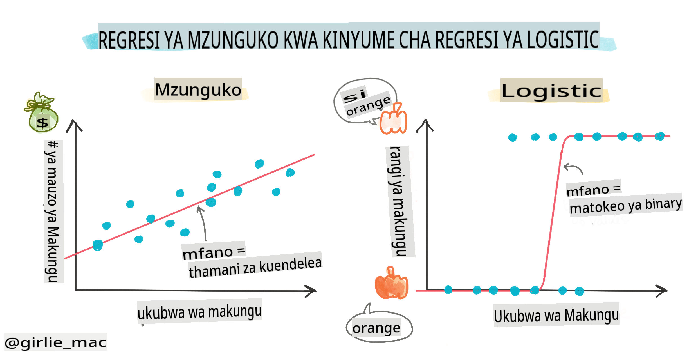
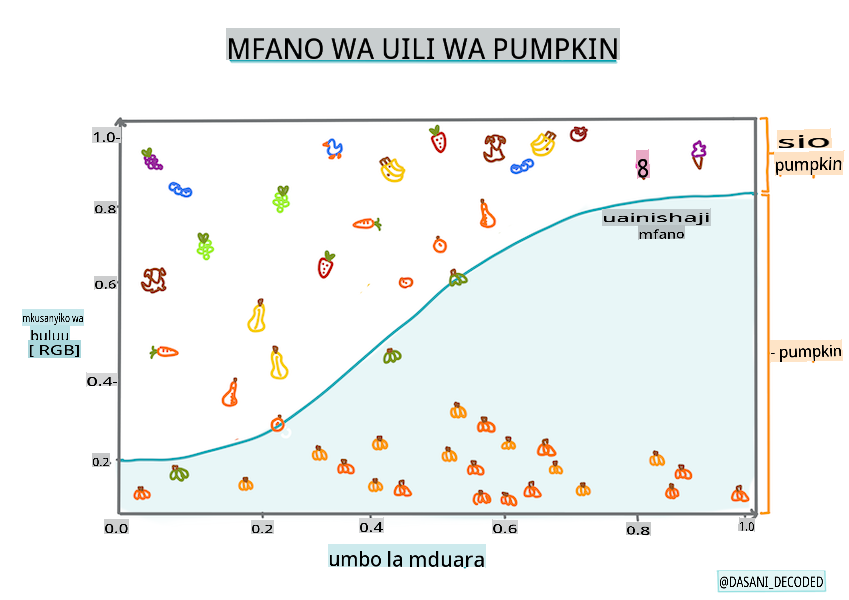
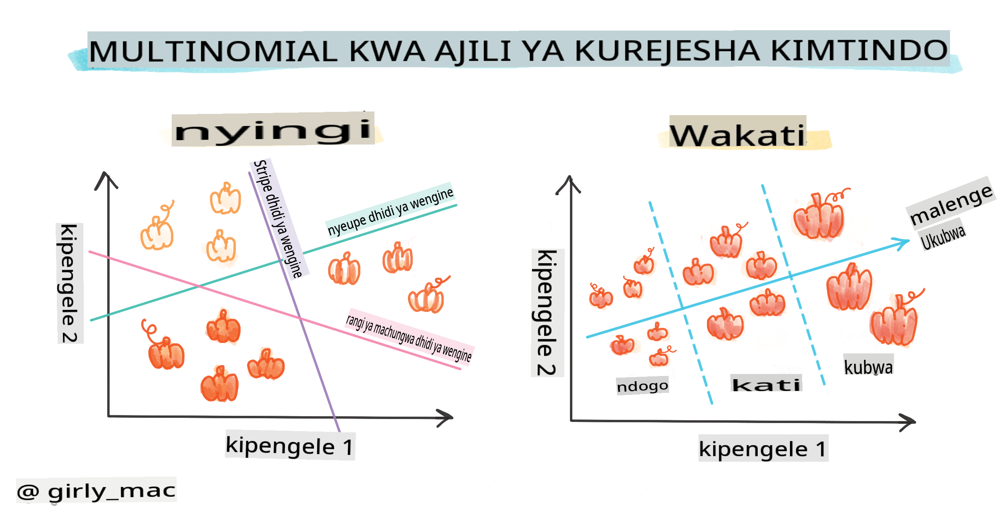
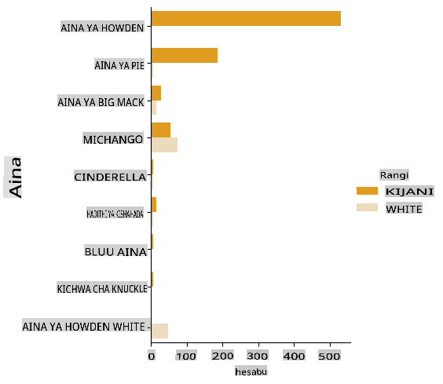
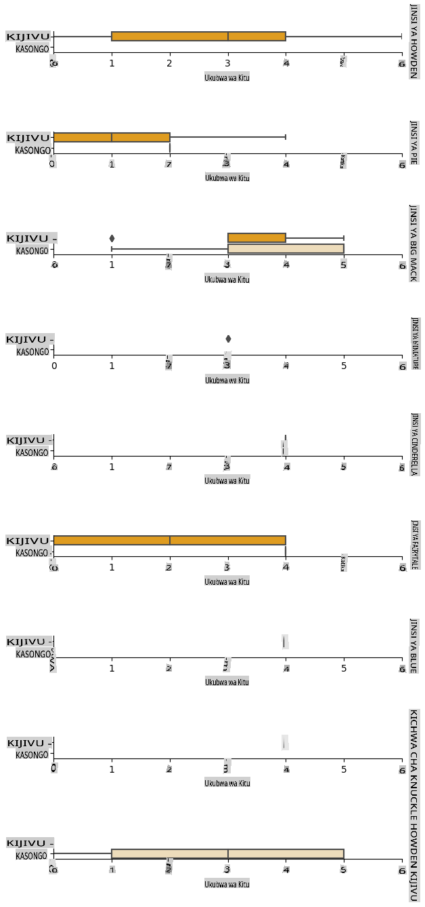
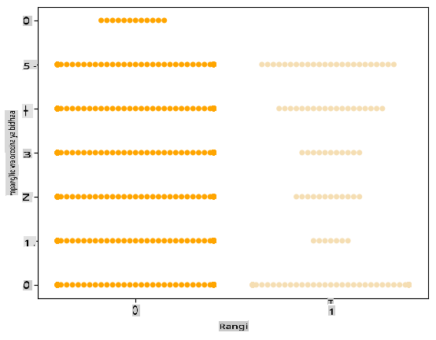
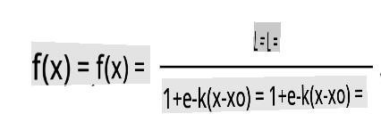
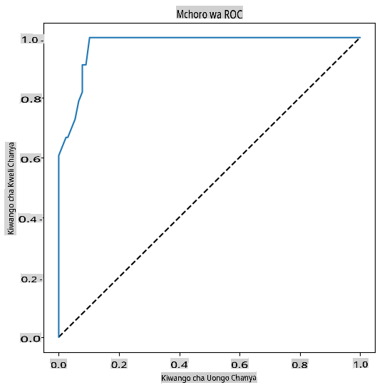

# Utabiri wa Logistic kutabiri makundi



## [Pre-lecture quiz](https://gray-sand-07a10f403.1.azurestaticapps.net/quiz/15/)

> ### [Somo hili linapatikana kwa R!](../../../../2-Regression/4-Logistic/solution/R/lesson_4.html)

## Utangulizi

Katika somo hili la mwisho kuhusu Regression, mojawapo ya mbinu za msingi za ML _classic_, tutachunguza Logistic Regression. Ungetumia mbinu hii kugundua mifumo ya kutabiri makundi mawili. Je, hii pipi ina chokoleti au la? Je, ugonjwa huu unaambukiza au la? Je, mteja huyu atachagua bidhaa hii au la?

Katika somo hili, utajifunza:

- Maktaba mpya kwa ajili ya kuona data
- Mbinu za logistic regression

✅ Pata uelewa wa kina wa kufanya kazi na aina hii ya regression katika [Learn module](https://docs.microsoft.com/learn/modules/train-evaluate-classification-models?WT.mc_id=academic-77952-leestott)

## Sharti

Baada ya kufanya kazi na data za malenge, sasa tunajua kwamba kuna kundi moja la binary ambalo tunaweza kufanya kazi nalo: `Color`.

Wacha tujenge mfano wa logistic regression kutabiri, kutokana na baadhi ya vigezo, _rangi ya malenge fulani inaweza kuwa_ (machungwa 🎃 au nyeupe 👻).

> Kwa nini tunazungumzia binary classification katika somo kuhusu regression? Ni kwa urahisi wa lugha tu, kwani logistic regression ni [kweli ni mbinu ya classification](https://scikit-learn.org/stable/modules/linear_model.html#logistic-regression), ingawa ni ya msingi wa linear. Jifunze kuhusu njia nyingine za kuainisha data katika kundi la somo linalofuata.

## Eleza swali

Kwa madhumuni yetu, tutasema hili kama binary: 'Nyeupe' au 'Sio Nyeupe'. Pia kuna kundi la 'striped' katika dataset yetu lakini kuna matukio machache tu ya hilo, kwa hivyo hatutalitumia. Linatoweka mara tu tunapoondoa thamani za null kutoka kwa dataset, hata hivyo.

> 🎃 Fun fact, wakati mwingine tunaita malenge nyeupe 'ghost' pumpkins. Hayachongwi kwa urahisi, kwa hivyo hayapendwi kama yale ya machungwa lakini yanaonekana baridi! Kwa hivyo tunaweza pia kuweka upya swali letu kama: 'Ghost' au 'Sio Ghost'. 👻

## Kuhusu logistic regression

Logistic regression inatofautiana na linear regression, ambayo ulijifunza hapo awali, kwa njia kadhaa muhimu.

[](https://youtu.be/KpeCT6nEpBY "ML for beginners - Kuelewa Logistic Regression kwa Machine Learning Classification")

> 🎥 Bofya picha hapo juu kwa muhtasari mfupi wa logistic regression.

### Binary classification

Logistic regression haitoi vipengele sawa na linear regression. Ya kwanza inatoa utabiri kuhusu kundi la binary ("nyeupe au sio nyeupe") ilhali ya pili inaweza kutabiri thamani zinazoendelea, kwa mfano kutokana na asili ya malenge na wakati wa mavuno, _bei yake itapanda kiasi gani_.


> Infographic by [Dasani Madipalli](https://twitter.com/dasani_decoded)

### Makundi mengine

Kuna aina nyingine za logistic regression, ikiwa ni pamoja na multinomial na ordinal:

- **Multinomial**, ambayo inahusisha kuwa na zaidi ya kundi moja - "Machungwa, Nyeupe, na Striped".
- **Ordinal**, ambayo inahusisha makundi yaliyopangwa, muhimu ikiwa tunataka kupanga matokeo yetu kwa mantiki, kama malenge yetu ambayo yamepangwa kwa idadi finyu ya ukubwa (mini,sm,med,lg,xl,xxl).



### Vigezo HAVIHITAJI kuhusiana

Kumbuka jinsi linear regression ilifanya kazi vizuri zaidi na vigezo vilivyohusiana zaidi? Logistic regression ni kinyume - vigezo havihitaji kuendana. Hiyo inafanya kazi kwa data hii ambayo ina uhusiano dhaifu kiasi.

### Unahitaji data nyingi safi

Logistic regression itatoa matokeo sahihi zaidi ikiwa utatumia data nyingi; dataset yetu ndogo si bora kwa kazi hii, kwa hivyo kumbuka hilo.

[](https://youtu.be/B2X4H9vcXTs "ML for beginners - Uchambuzi wa Data na Maandalizi kwa Logistic Regression")

> 🎥 Bofya picha hapo juu kwa muhtasari mfupi wa kuandaa data kwa linear regression

✅ Fikiria aina za data ambazo zingefaa kwa logistic regression

## Mazoezi - safisha data

Kwanza, safisha data kidogo, ukiondoa thamani za null na kuchagua baadhi tu ya safu:

1. Ongeza msimbo ufuatao:

    ```python
  
    columns_to_select = ['City Name','Package','Variety', 'Origin','Item Size', 'Color']
    pumpkins = full_pumpkins.loc[:, columns_to_select]

    pumpkins.dropna(inplace=True)
    ```

    Unaweza kila wakati kuangalia dataframe yako mpya:

    ```python
    pumpkins.info
    ```

### Visualization - categorical plot

Hadi sasa umechaji [starter notebook](../../../../2-Regression/4-Logistic/notebook.ipynb) na data za malenge tena na kuzisafisha ili kuhifadhi dataset inayojumuisha vigezo vichache, ikiwa ni pamoja na `Color`. Wacha tuone dataframe kwenye notebook kwa kutumia maktaba tofauti: [Seaborn](https://seaborn.pydata.org/index.html), ambayo imejengwa juu ya Matplotlib ambayo tulitumia awali.

Seaborn inatoa njia nzuri za kuona data yako. Kwa mfano, unaweza kulinganisha usambazaji wa data kwa kila `Variety` na `Color` katika categorical plot.

1. Unda plot kama hiyo kwa kutumia `catplot` function, using our pumpkin data `pumpkins`, na kubainisha ramani ya rangi kwa kila kundi la malenge (machungwa au nyeupe):

    ```python
    import seaborn as sns
    
    palette = {
    'ORANGE': 'orange',
    'WHITE': 'wheat',
    }

    sns.catplot(
    data=pumpkins, y="Variety", hue="Color", kind="count",
    palette=palette, 
    )
    ```

    

    Kwa kuchunguza data, unaweza kuona jinsi data ya Rangi inavyohusiana na Aina.

    ✅ Kwa kuzingatia plot ya kikundi, ni uchunguzi gani wa kuvutia unaweza kufikiria?

### Data pre-processing: feature and label encoding
Dataset yetu ya malenge ina thamani za string kwa safu zake zote. Kufanya kazi na data ya kikundi ni rahisi kwa wanadamu lakini si kwa mashine. Algorithimu za machine learning hufanya kazi vizuri na nambari. Ndiyo maana encoding ni hatua muhimu sana katika awamu ya pre-processing ya data, kwani inatuwezesha kubadilisha data ya kikundi kuwa data ya nambari, bila kupoteza habari yoyote. Encoding nzuri husababisha kujenga mfano mzuri.

Kwa feature encoding kuna aina mbili kuu za encoders:

1. Ordinal encoder: inafaa vizuri kwa vigezo vya ordinal, ambavyo ni vigezo vya kikundi ambapo data zao zinafuata mpangilio wa kimantiki, kama safu ya `Item Size` katika dataset yetu. Inaunda ramani ili kila kundi liwakilishwe na nambari, ambayo ni mpangilio wa kundi katika safu.

    ```python
    from sklearn.preprocessing import OrdinalEncoder

    item_size_categories = [['sml', 'med', 'med-lge', 'lge', 'xlge', 'jbo', 'exjbo']]
    ordinal_features = ['Item Size']
    ordinal_encoder = OrdinalEncoder(categories=item_size_categories)
    ```

2. Categorical encoder: inafaa vizuri kwa vigezo vya nominal, ambavyo ni vigezo vya kikundi ambapo data zao hazifuati mpangilio wa kimantiki, kama vipengele vyote tofauti na `Item Size` katika dataset yetu. Ni one-hot encoding, ambayo ina maana kwamba kila kundi linawakilishwa na safu ya binary: kigezo kilichosimbwa ni sawa na 1 ikiwa malenge ni ya Aina hiyo na 0 vinginevyo.

    ```python
    from sklearn.preprocessing import OneHotEncoder

    categorical_features = ['City Name', 'Package', 'Variety', 'Origin']
    categorical_encoder = OneHotEncoder(sparse_output=False)
    ```
Kisha, `ColumnTransformer` hutumiwa kuchanganya encoders nyingi katika hatua moja na kuzitumia kwenye safu zinazofaa.

```python
    from sklearn.compose import ColumnTransformer
    
    ct = ColumnTransformer(transformers=[
        ('ord', ordinal_encoder, ordinal_features),
        ('cat', categorical_encoder, categorical_features)
        ])
    
    ct.set_output(transform='pandas')
    encoded_features = ct.fit_transform(pumpkins)
```
Kwa upande mwingine, ili kusimba lebo, tunatumia darasa la scikit-learn `LabelEncoder`, ambalo ni darasa la matumizi kusaidia kuboresha lebo ili ziwe na thamani kati ya 0 na n_classes-1 (hapa, 0 na 1).

```python
    from sklearn.preprocessing import LabelEncoder

    label_encoder = LabelEncoder()
    encoded_label = label_encoder.fit_transform(pumpkins['Color'])
```
Mara tu tunapokuwa tumekodisha vipengele na lebo, tunaweza kuziunganisha katika dataframe mpya `encoded_pumpkins`.

```python
    encoded_pumpkins = encoded_features.assign(Color=encoded_label)
```
✅ Je, ni faida gani za kutumia ordinal encoder kwa `Item Size` column?

### Analyse relationships between variables

Now that we have pre-processed our data, we can analyse the relationships between the features and the label to grasp an idea of how well the model will be able to predict the label given the features.
The best way to perform this kind of analysis is plotting the data. We'll be using again the Seaborn `catplot` function, to visualize the relationships between `Item Size`,  `Variety` na `Color` katika categorical plot. Ili kuchora data vizuri tutatumia `Item Size` column and the unencoded `Variety` iliyosimbwa.

```python
    palette = {
    'ORANGE': 'orange',
    'WHITE': 'wheat',
    }
    pumpkins['Item Size'] = encoded_pumpkins['ord__Item Size']

    g = sns.catplot(
        data=pumpkins,
        x="Item Size", y="Color", row='Variety',
        kind="box", orient="h",
        sharex=False, margin_titles=True,
        height=1.8, aspect=4, palette=palette,
    )
    g.set(xlabel="Item Size", ylabel="").set(xlim=(0,6))
    g.set_titles(row_template="{row_name}")
```


### Tumia swarm plot

Kwa kuwa Rangi ni kundi la binary (Nyeupe au Sio), inahitaji 'njia [maalum](https://seaborn.pydata.org/tutorial/categorical.html?highlight=bar) ya kuiona'. Kuna njia nyingine za kuona uhusiano wa kundi hili na vigezo vingine.

Unaweza kuona vigezo kando kando na plots za Seaborn.

1. Jaribu 'swarm' plot kuonyesha usambazaji wa thamani:

    ```python
    palette = {
    0: 'orange',
    1: 'wheat'
    }
    sns.swarmplot(x="Color", y="ord__Item Size", data=encoded_pumpkins, palette=palette)
    ```

    

**Angalizo**: msimbo hapo juu unaweza kutoa onyo, kwa kuwa seaborn inashindwa kuwakilisha kiasi hicho cha pointi za data katika swarm plot. Suluhisho linalowezekana ni kupunguza ukubwa wa alama, kwa kutumia kipengele cha 'size'. Hata hivyo, kuwa makini kwamba hili linaathiri usomaji wa plot.

> **🧮 Nionyeshe Hisabati**
>
> Logistic regression inategemea dhana ya 'maximum likelihood' kwa kutumia [sigmoid functions](https://wikipedia.org/wiki/Sigmoid_function). 'Sigmoid Function' kwenye plot inaonekana kama umbo la 'S'. Inachukua thamani na kuipanga mahali fulani kati ya 0 na 1. Mchoro wake pia unaitwa 'logistic curve'. Mfumo wake unaonekana kama huu:
>
> 
>
> ambapo sehemu ya kati ya sigmoid inajipata kwenye sehemu ya 0 ya x, L ni thamani ya juu ya curve, na k ni mwinuko wa curve. Ikiwa matokeo ya kazi ni zaidi ya 0.5, lebo husika itapewa darasa '1' la chaguo la binary. Ikiwa sivyo, itatambulishwa kama '0'.

## Jenga mfano wako

Kujenga mfano wa kupata classification ya binary ni rahisi kushangaza katika Scikit-learn.

[](https://youtu.be/MmZS2otPrQ8 "ML for beginners - Logistic Regression kwa classification ya data")

> 🎥 Bofya picha hapo juu kwa muhtasari mfupi wa kujenga mfano wa linear regression

1. Chagua vigezo unavyotaka kutumia katika mfano wako wa classification na gawanya seti za mafunzo na majaribio kwa kuita `train_test_split()`:

    ```python
    from sklearn.model_selection import train_test_split
    
    X = encoded_pumpkins[encoded_pumpkins.columns.difference(['Color'])]
    y = encoded_pumpkins['Color']

    X_train, X_test, y_train, y_test = train_test_split(X, y, test_size=0.2, random_state=0)
    
    ```

2. Sasa unaweza kufundisha mfano wako, kwa kuita `fit()` na data zako za mafunzo, na kuchapisha matokeo yake:

    ```python
    from sklearn.metrics import f1_score, classification_report 
    from sklearn.linear_model import LogisticRegression

    model = LogisticRegression()
    model.fit(X_train, y_train)
    predictions = model.predict(X_test)

    print(classification_report(y_test, predictions))
    print('Predicted labels: ', predictions)
    print('F1-score: ', f1_score(y_test, predictions))
    ```

    Angalia scoreboard ya mfano wako. Sio mbaya, ukizingatia una karibu safu 1000 tu za data:

    ```output
                       precision    recall  f1-score   support
    
                    0       0.94      0.98      0.96       166
                    1       0.85      0.67      0.75        33
    
        accuracy                                0.92       199
        macro avg           0.89      0.82      0.85       199
        weighted avg        0.92      0.92      0.92       199
    
        Predicted labels:  [0 0 0 0 0 0 0 0 0 0 0 0 0 0 0 0 0 0 0 0 1 0 0 1 0 0 0 0 0 0 0 0 1 0 0 0 0
        0 0 0 0 0 1 0 1 0 0 1 0 0 0 0 0 1 0 1 0 1 0 1 0 0 0 0 0 0 0 0 0 0 0 0 0 0
        1 0 0 0 0 0 0 0 1 0 0 0 0 0 0 0 1 0 0 0 0 0 0 0 0 1 0 1 0 0 0 0 0 0 0 1 0
        0 0 0 0 0 0 0 0 0 0 0 0 0 0 0 0 0 0 0 0 0 1 0 0 0 0 0 0 0 0 1 0 0 0 1 1 0
        0 0 0 0 1 0 0 0 0 0 1 0 0 0 0 0 0 0 0 0 0 0 0 0 0 0 0 0 0 0 0 0 0 0 0 0 1
        0 0 0 1 0 0 0 0 0 0 0 0 1 1]
        F1-score:  0.7457627118644068
    ```

## Uelewa bora kupitia confusion matrix

Ingawa unaweza kupata ripoti ya scoreboard [terms](https://scikit-learn.org/stable/modules/generated/sklearn.metrics.classification_report.html?highlight=classification_report#sklearn.metrics.classification_report) kwa kuchapisha vipengee hapo juu, unaweza kuelewa mfano wako kwa urahisi zaidi kwa kutumia [confusion matrix](https://scikit-learn.org/stable/modules/model_evaluation.html#confusion-matrix) kusaidia kuelewa jinsi mfano unavyofanya kazi.

> 🎓 '[confusion matrix](https://wikipedia.org/wiki/Confusion_matrix)' (au 'error matrix') ni jedwali linaloonyesha kweli vs. uongo wa positives na negatives za mfano wako, hivyo kupima usahihi wa utabiri.

1. Ili kutumia confusion metrics, piga `confusion_matrix()`:

    ```python
    from sklearn.metrics import confusion_matrix
    confusion_matrix(y_test, predictions)
    ```

    Angalia confusion matrix ya mfano wako:

    ```output
    array([[162,   4],
           [ 11,  22]])
    ```

Katika Scikit-learn, confusion matrices Safu (axis 0) ni lebo halisi na safu (axis 1) ni lebo zilizotabiriwa.

|       |   0   |   1   |
| :---: | :---: | :---: |
|   0   |  TN   |  FP   |
|   1   |  FN   |  TP   |

Nini kinaendelea hapa? Tuseme mfano wetu umeombwa kuainisha malenge kati ya makundi mawili ya binary, kundi 'nyeupe' na kundi 'sio nyeupe'.

- Ikiwa mfano wako unatabiri malenge kama sio nyeupe na inafaa kundi 'sio nyeupe' kwa kweli tunaita hiyo true negative, inayoonyeshwa na nambari ya juu kushoto.
- Ikiwa mfano wako unatabiri malenge kama nyeupe na inafaa kundi 'sio nyeupe' kwa kweli tunaita hiyo false negative, inayoonyeshwa na nambari ya chini kushoto.
- Ikiwa mfano wako unatabiri malenge kama sio nyeupe na inafaa kundi 'nyeupe' kwa kweli tunaita hiyo false positive, inayoonyeshwa na nambari ya juu kulia.
- Ikiwa mfano wako unatabiri malenge kama nyeupe na inafaa kundi 'nyeupe' kwa kweli tunaita hiyo true positive, inayoonyeshwa na nambari ya chini kulia.

Kama unavyoweza kudhani ni bora kuwa na idadi kubwa ya true positives na true negatives na idadi ndogo ya false positives na false negatives, ambayo inaonyesha kuwa mfano unafanya kazi vizuri.

Je, confusion matrix inahusiana vipi na precision na recall? Kumbuka, ripoti ya classification iliyochapishwa hapo juu ilionyesha precision (0.85) na recall (0.67).

Precision = tp / (tp + fp) = 22 / (22 + 4) = 0.8461538461538461

Recall = tp / (tp + fn) = 22 / (22 + 11) = 0.6666666666666666

✅ Q: Kulingana na confusion matrix, mfano ulifanyaje? A: Sio mbaya; kuna idadi nzuri ya true negatives lakini pia kuna false negatives kadhaa.

Wacha tutembelee tena maneno tuliyoyaona awali kwa msaada wa ramani ya TP/TN na FP/FN ya confusion matrix:

🎓 Precision: TP/(TP + FP) Sehemu ya matukio muhimu kati ya matukio yaliyopatikana (mfano ni lebo zipi zilizoainishwa vizuri)

🎓 Recall: TP/(TP + FN) Sehemu ya matukio muhimu yaliyopatikana, iwe yameainishwa vizuri au la

🎓 f1-score: (2 * precision * recall)/(precision + recall) Wastani wa uzito wa precision na recall, bora ikiwa 1 na mbaya ikiwa 0

🎓 Support: Idadi ya matukio ya kila lebo yaliyopatikana

🎓 Accuracy: (TP + TN)/(TP + TN + FP + FN) Asilimia ya lebo zilizotabiriwa kwa usahihi kwa sampuli.

🎓 Macro Avg: Hesabu ya wastani wa uzito wa metrics kwa kila lebo, bila kuzingatia kutofautiana kwa lebo.

🎓 Weighted Avg: Hesabu ya wastani wa metrics kwa kila lebo, kwa kuzingatia kutofautiana kwa lebo kwa kuzipima kwa support zao (idadi ya matukio ya kweli kwa kila lebo).

✅ Unaweza kufikiria ni kipimo gani unapaswa kuangalia ikiwa unataka mfano wako kupunguza idadi ya false negatives?

## Onyesha ROC curve ya mfano huu

[](https://youtu.be/GApO575jTA0 "ML for beginners - Kuchambua Utendaji wa Logistic Regression na ROC Curves")

> 🎥 Bofya picha hapo juu kwa muhtasari mfupi wa ROC curves

Wacha tufanye visualization moja zaidi kuona kinachoitwa 'ROC' curve:

```python
from sklearn.metrics import roc_curve, roc_auc_score
import matplotlib
import matplotlib.pyplot as plt
%matplotlib inline

y_scores = model.predict_proba(X_test)
fpr, tpr, thresholds = roc_curve(y_test, y_scores[:,1])

fig = plt.figure(figsize=(6, 6))
plt.plot([0, 1], [0, 1], 'k--')
plt.plot(fpr, tpr)
plt.xlabel('False Positive Rate')
plt.ylabel('True Positive Rate')
plt.title('ROC Curve')
plt.show()
```

Kwa kutumia Matplotlib, chora [Receiving Operating Characteristic](https://scikit-learn.org/stable/auto_examples/model_selection/plot_roc.html?highlight=roc) au ROC ya mfano. ROC curves mara nyingi hutumiwa kupata mtazamo wa matokeo ya classifier kwa upande wa true vs. false positives. "ROC curves kawaida huonyesha true positive rate kwenye mhimili wa Y, na false positive rate kwenye mhimili wa X." Kwa hivyo, mwinuko wa curve na nafasi kati ya mstari wa kati na curve ni muhimu: unataka curve ambayo inaelekea juu na juu ya mstari haraka. Katika kesi yetu, kuna false positives kuanza na, na kisha mstari unaelekea juu na juu ipasavyo:



Hatimaye, tumia [`roc_auc_score` API](https://scikit-learn.org/stable/modules/generated/sklearn.metrics.roc_auc_score.html?highlight=roc_auc#sklearn.metrics.roc_auc_score) ya Scikit-learn kuhesabu 'Area Under the Curve' (AUC):

```python
auc = roc_auc_score(y_test,y_scores[:,1])
print(auc)
```
Matokeo ni `0.9749908725812341`. Kwa kuwa AUC inatoka 

**Kanusho**: 
Hati hii imetafsiriwa kwa kutumia huduma za tafsiri za AI za mashine. Ingawa tunajitahidi kwa usahihi, tafadhali fahamu kuwa tafsiri za kiotomatiki zinaweza kuwa na makosa au kutokamilika. Hati asili katika lugha yake ya asili inapaswa kuzingatiwa kama chanzo cha mamlaka. Kwa habari muhimu, tafsiri ya kitaalamu ya binadamu inapendekezwa. Hatutawajibika kwa maelewano au tafsiri zisizo sahihi zinazotokana na matumizi ya tafsiri hii.