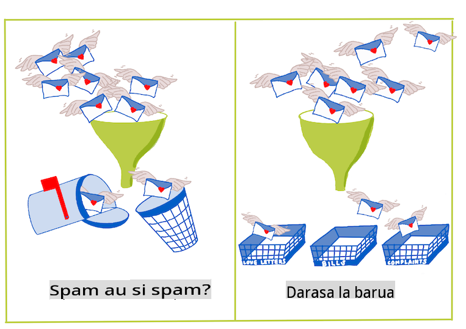
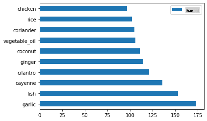
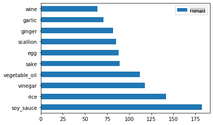
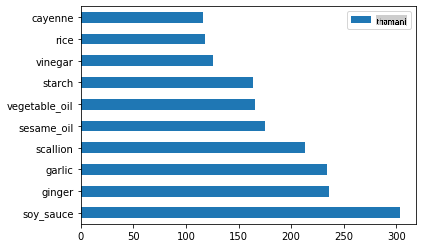
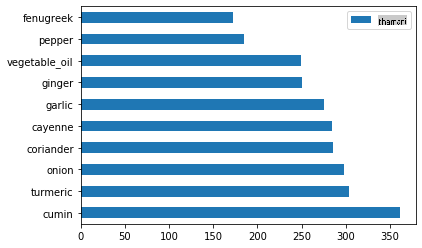
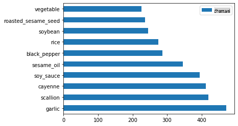

# Utangulizi wa Uainishaji

Katika masomo haya manne, utachunguza mwelekeo wa msingi wa ujifunzaji wa mashine wa kawaida - _uainishaji_. Tutapitia kutumia algorithimu mbalimbali za uainishaji na seti ya data kuhusu vyakula vyote bora vya Asia na India. Tunatumaini una njaa!


> Sherehekea vyakula vya pan-Asia katika masomo haya! Picha na [Jen Looper](https://twitter.com/jenlooper)

Uainishaji ni aina ya [ujifunzaji unaosimamiwa](https://wikipedia.org/wiki/Supervised_learning) ambao una mambo mengi yanayofanana na mbinu za urejeleaji. Ikiwa ujifunzaji wa mashine ni kuhusu kutabiri thamani au majina ya vitu kwa kutumia seti za data, basi uainishaji kwa ujumla unagawanyika katika makundi mawili: _uainishaji wa binary_ na _uainishaji wa makundi mengi_.

[](https://youtu.be/eg8DJYwdMyg "Introduction to classification")

> 🎥 Bofya picha hapo juu kwa video: John Guttag wa MIT anatambulisha uainishaji

Kumbuka:

- **Urejeleaji wa mstari** ulikusaidia kutabiri uhusiano kati ya vigezo na kufanya utabiri sahihi kuhusu mahali ambapo kipengele kipya kingeangukia katika uhusiano na mstari huo. Kwa hivyo, ungeweza kutabiri _bei ya boga itakuwa kiasi gani mwezi wa Septemba vs. Desemba_, kwa mfano.
- **Urejeleaji wa logisitiki** ulikusaidia kugundua "makundi mawili": kwa bei hii, _je, boga hili ni la rangi ya machungwa au si la machungwa_?

Uainishaji hutumia algorithimu mbalimbali kuamua njia zingine za kuamua lebo au darasa la kipengele cha data. Hebu tufanye kazi na data hii ya vyakula ili kuona kama, kwa kuangalia kikundi cha viungo, tunaweza kuamua asili ya vyakula hivyo.

## [Jaribio la kabla ya somo](https://gray-sand-07a10f403.1.azurestaticapps.net/quiz/19/)

> ### [Somo hili linapatikana katika R!](../../../../4-Classification/1-Introduction/solution/R/lesson_10.html)

### Utangulizi

Uainishaji ni mojawapo ya shughuli za msingi za mtafiti wa ujifunzaji wa mashine na mwanasayansi wa data. Kutoka uainishaji wa msingi wa thamani ya binary ("je, barua pepe hii ni spam au si spam?"), hadi uainishaji na ugawaji wa picha tata kwa kutumia maono ya kompyuta, daima ni muhimu kuweza kupanga data katika madarasa na kuuliza maswali kuihusu.

Kueleza mchakato kwa njia ya kisayansi zaidi, mbinu yako ya uainishaji inaunda mfano wa utabiri unaokuwezesha kuonyesha uhusiano kati ya vigezo vya ingizo na vigezo vya pato.



> Masuala ya binary vs. multiclass kwa algorithimu za uainishaji kushughulikia. Picha na [Jen Looper](https://twitter.com/jenlooper)

Kabla ya kuanza mchakato wa kusafisha data yetu, kuiona, na kuiandaa kwa kazi zetu za ML, hebu tujifunze kidogo kuhusu njia mbalimbali ambazo ujifunzaji wa mashine unaweza kutumika kuainisha data.

Iliyotokana na [takwimu](https://wikipedia.org/wiki/Statistical_classification), uainishaji kwa kutumia ujifunzaji wa mashine wa kawaida hutumia sifa, kama vile `smoker`, `weight`, na `age` kuamua _uwezekano wa kupata X ugonjwa_. Kama mbinu ya ujifunzaji unaosimamiwa inayofanana na mazoezi ya urejeleaji uliyofanya awali, data yako imewekwa lebo na algorithimu za ML hutumia lebo hizo kuainisha na kutabiri madarasa (au 'sifa') za seti ya data na kuyapeleka kwenye kikundi au matokeo.

✅ Chukua muda kufikiria seti ya data kuhusu vyakula. Mfano wa multiclass ungeweza kujibu nini? Mfano wa binary ungeweza kujibu nini? Je, ungependa kuamua kama chakula fulani kina uwezekano wa kutumia fenugreek? Je, ungependa kuona kama, ukipewa mfuko wa mboga uliojaa nyota ya anise, artichokes, cauliflower, na horseradish, ungeweza kuunda sahani ya kawaida ya Kihindi?

[](https://youtu.be/GuTeDbaNoEU "Crazy mystery baskets")

> 🎥 Bofya picha hapo juu kwa video. Wazo kuu la kipindi 'Chopped' ni 'kikapu cha siri' ambapo wapishi wanapaswa kutengeneza sahani kutoka kwenye uchaguzi wa viungo vya bahati nasibu. Bila shaka mfano wa ML ungeweza kusaidia!

## Halo 'classifier'

Swali tunalotaka kuuliza kuhusu seti hii ya data ya vyakula ni swali la **multiclass**, kwani tuna vyakula vingi vya kitaifa vya kufanya kazi navyo. Tukipewa kundi la viungo, ni darasa gani kati ya haya mengi data itafaa?

Scikit-learn inatoa algorithimu tofauti za kutumia kuainisha data, kulingana na aina ya tatizo unalotaka kutatua. Katika masomo mawili yajayo, utajifunza kuhusu baadhi ya algorithimu hizi.

## Zoezi - safisha na usawazishe data yako

Kazi ya kwanza, kabla ya kuanza mradi huu, ni kusafisha na **kusawazisha** data yako ili kupata matokeo bora. Anza na faili tupu _notebook.ipynb_ katika mzizi wa folda hii.

Kitu cha kwanza kufunga ni [imblearn](https://imbalanced-learn.org/stable/). Hii ni kifurushi cha Scikit-learn ambacho kitakuwezesha kusawazisha data vizuri zaidi (utajifunza zaidi kuhusu kazi hii kwa muda mfupi).

1. Kufunga `imblearn`, endesha `pip install`, kama ifuatavyo:

    ```python
    pip install imblearn
    ```

1. Leta vifurushi unavyohitaji ili kuingiza data yako na kuiangalia, pia leta `SMOTE` kutoka `imblearn`.

    ```python
    import pandas as pd
    import matplotlib.pyplot as plt
    import matplotlib as mpl
    import numpy as np
    from imblearn.over_sampling import SMOTE
    ```

    Sasa uko tayari kusoma kuingiza data inayofuata.

1. Kazi inayofuata itakuwa kuingiza data:

    ```python
    df  = pd.read_csv('../data/cuisines.csv')
    ```

   Kutumia `read_csv()` will read the content of the csv file _cusines.csv_ and place it in the variable `df`.

1. Angalia sura ya data:

    ```python
    df.head()
    ```

   Safu tano za kwanza zinaonekana hivi:

    ```output
    |     | Unnamed: 0 | cuisine | almond | angelica | anise | anise_seed | apple | apple_brandy | apricot | armagnac | ... | whiskey | white_bread | white_wine | whole_grain_wheat_flour | wine | wood | yam | yeast | yogurt | zucchini |
    | --- | ---------- | ------- | ------ | -------- | ----- | ---------- | ----- | ------------ | ------- | -------- | --- | ------- | ----------- | ---------- | ----------------------- | ---- | ---- | --- | ----- | ------ | -------- |
    | 0   | 65         | indian  | 0      | 0        | 0     | 0          | 0     | 0            | 0       | 0        | ... | 0       | 0           | 0          | 0                       | 0    | 0    | 0   | 0     | 0      | 0        |
    | 1   | 66         | indian  | 1      | 0        | 0     | 0          | 0     | 0            | 0       | 0        | ... | 0       | 0           | 0          | 0                       | 0    | 0    | 0   | 0     | 0      | 0        |
    | 2   | 67         | indian  | 0      | 0        | 0     | 0          | 0     | 0            | 0       | 0        | ... | 0       | 0           | 0          | 0                       | 0    | 0    | 0   | 0     | 0      | 0        |
    | 3   | 68         | indian  | 0      | 0        | 0     | 0          | 0     | 0            | 0       | 0        | ... | 0       | 0           | 0          | 0                       | 0    | 0    | 0   | 0     | 0      | 0        |
    | 4   | 69         | indian  | 0      | 0        | 0     | 0          | 0     | 0            | 0       | 0        | ... | 0       | 0           | 0          | 0                       | 0    | 0    | 0   | 0     | 1      | 0        |
    ```

1. Pata taarifa kuhusu data hii kwa kuita `info()`:

    ```python
    df.info()
    ```

    Matokeo yako yanafanana na:

    ```output
    <class 'pandas.core.frame.DataFrame'>
    RangeIndex: 2448 entries, 0 to 2447
    Columns: 385 entries, Unnamed: 0 to zucchini
    dtypes: int64(384), object(1)
    memory usage: 7.2+ MB
    ```

## Zoezi - kujifunza kuhusu vyakula

Sasa kazi inaanza kuwa ya kuvutia zaidi. Hebu tugundue usambazaji wa data, kwa kila chakula

1. Panga data kama baa kwa kuita `barh()`:

    ```python
    df.cuisine.value_counts().plot.barh()
    ```

    

    Kuna idadi ndogo ya vyakula, lakini usambazaji wa data si sawa. Unaweza kurekebisha hilo! Kabla ya kufanya hivyo, chunguza kidogo zaidi.

1. Tafuta ni kiasi gani cha data kinapatikana kwa kila chakula na ichapishe:

    ```python
    thai_df = df[(df.cuisine == "thai")]
    japanese_df = df[(df.cuisine == "japanese")]
    chinese_df = df[(df.cuisine == "chinese")]
    indian_df = df[(df.cuisine == "indian")]
    korean_df = df[(df.cuisine == "korean")]
    
    print(f'thai df: {thai_df.shape}')
    print(f'japanese df: {japanese_df.shape}')
    print(f'chinese df: {chinese_df.shape}')
    print(f'indian df: {indian_df.shape}')
    print(f'korean df: {korean_df.shape}')
    ```

    matokeo yanaonekana hivi:

    ```output
    thai df: (289, 385)
    japanese df: (320, 385)
    chinese df: (442, 385)
    indian df: (598, 385)
    korean df: (799, 385)
    ```

## Kugundua viungo

Sasa unaweza kuchimba zaidi katika data na kujifunza ni viungo gani vya kawaida kwa kila chakula. Unapaswa kusafisha data inayojirudia ambayo inasababisha mkanganyiko kati ya vyakula, kwa hivyo hebu tujifunze kuhusu tatizo hili.

1. Unda kazi `create_ingredient()` katika Python ili kuunda fremu ya data ya viungo. Kazi hii itaanza kwa kuacha safu isiyo na msaada na kupanga viungo kwa hesabu zao:

    ```python
    def create_ingredient_df(df):
        ingredient_df = df.T.drop(['cuisine','Unnamed: 0']).sum(axis=1).to_frame('value')
        ingredient_df = ingredient_df[(ingredient_df.T != 0).any()]
        ingredient_df = ingredient_df.sort_values(by='value', ascending=False,
        inplace=False)
        return ingredient_df
    ```

   Sasa unaweza kutumia kazi hiyo kupata wazo la viungo kumi maarufu zaidi kwa kila chakula.

1. Ita `create_ingredient()` and plot it calling `barh()`:

    ```python
    thai_ingredient_df = create_ingredient_df(thai_df)
    thai_ingredient_df.head(10).plot.barh()
    ```

    

1. Fanya vivyo hivyo kwa data ya Kijapani:

    ```python
    japanese_ingredient_df = create_ingredient_df(japanese_df)
    japanese_ingredient_df.head(10).plot.barh()
    ```

    

1. Sasa kwa viungo vya Kichina:

    ```python
    chinese_ingredient_df = create_ingredient_df(chinese_df)
    chinese_ingredient_df.head(10).plot.barh()
    ```

    

1. Panga viungo vya Kihindi:

    ```python
    indian_ingredient_df = create_ingredient_df(indian_df)
    indian_ingredient_df.head(10).plot.barh()
    ```

    

1. Hatimaye, panga viungo vya Kikorea:

    ```python
    korean_ingredient_df = create_ingredient_df(korean_df)
    korean_ingredient_df.head(10).plot.barh()
    ```

    

1. Sasa, acha viungo vya kawaida vinavyosababisha mkanganyiko kati ya vyakula tofauti, kwa kuita `drop()`:

   Kila mtu anapenda mchele, vitunguu na tangawizi!

    ```python
    feature_df= df.drop(['cuisine','Unnamed: 0','rice','garlic','ginger'], axis=1)
    labels_df = df.cuisine #.unique()
    feature_df.head()
    ```

## Sawazisha seti ya data

Sasa kwa kuwa umesafisha data, tumia [SMOTE](https://imbalanced-learn.org/dev/references/generated/imblearn.over_sampling.SMOTE.html) - "Mbinu ya Kuzidisha Sampuli Ndogo ya Kijinga" - kuisawazisha.

1. Ita `fit_resample()`, mkakati huu unazalisha sampuli mpya kwa upatanishi.

    ```python
    oversample = SMOTE()
    transformed_feature_df, transformed_label_df = oversample.fit_resample(feature_df, labels_df)
    ```

    Kwa kusawazisha data yako, utapata matokeo bora zaidi unapoitainisha. Fikiria kuhusu uainishaji wa binary. Ikiwa data yako nyingi ni ya darasa moja, mfano wa ML utaweza kutabiri darasa hilo mara nyingi zaidi, kwa sababu kuna data zaidi kwa ajili yake. Kusawazisha data kunachukua data yoyote iliyopotoka na kusaidia kuondoa usawa huu.

1. Sasa unaweza kuangalia idadi ya lebo kwa kila kiungo:

    ```python
    print(f'new label count: {transformed_label_df.value_counts()}')
    print(f'old label count: {df.cuisine.value_counts()}')
    ```

    Matokeo yako yanaonekana hivi:

    ```output
    new label count: korean      799
    chinese     799
    indian      799
    japanese    799
    thai        799
    Name: cuisine, dtype: int64
    old label count: korean      799
    indian      598
    chinese     442
    japanese    320
    thai        289
    Name: cuisine, dtype: int64
    ```

    Data ni safi na nzuri, imesawazishwa, na ni ladha sana!

1. Hatua ya mwisho ni kuhifadhi data yako iliyosawazishwa, ikiwa ni pamoja na lebo na sifa, kwenye fremu mpya ya data inayoweza kusafirishwa kwenye faili:

    ```python
    transformed_df = pd.concat([transformed_label_df,transformed_feature_df],axis=1, join='outer')
    ```

1. Unaweza kuangalia data kwa kutumia `transformed_df.head()` and `transformed_df.info()`. Hifadhi nakala ya data hii kwa matumizi ya masomo yajayo:

    ```python
    transformed_df.head()
    transformed_df.info()
    transformed_df.to_csv("../data/cleaned_cuisines.csv")
    ```

    CSV hii mpya sasa inaweza kupatikana katika folda ya mzizi ya data.

---

## 🚀Changamoto

Mtaala huu una seti kadhaa za data za kuvutia. Chunguza folda za `data` na uone kama kuna yoyote yenye seti za data ambazo zingefaa kwa uainishaji wa binary au wa makundi mengi? Maswali gani ungependa kuuliza kuhusu seti hii ya data?

## [Jaribio la baada ya somo](https://gray-sand-07a10f403.1.azurestaticapps.net/quiz/20/)

## Mapitio & Kujisomea

Chunguza API ya SMOTE. Inafaa kutumika kwa kesi gani? Inatatua matatizo gani?

## Kazi

[Chunguza mbinu za uainishaji](assignment.md)

**Kanusho**:
Hati hii imetafsiriwa kwa kutumia huduma za tafsiri za AI zinazotegemea mashine. Ingawa tunajitahidi kwa usahihi, tafadhali fahamu kuwa tafsiri za kiotomatiki zinaweza kuwa na makosa au kutokuwa sahihi. Hati ya asili katika lugha yake ya asili inapaswa kuchukuliwa kuwa chanzo cha mamlaka. Kwa taarifa muhimu, tafsiri ya kibinadamu ya kitaalamu inapendekezwa. Hatutawajibika kwa kutoelewana au tafsiri zisizo sahihi zinazotokana na matumizi ya tafsiri hii.