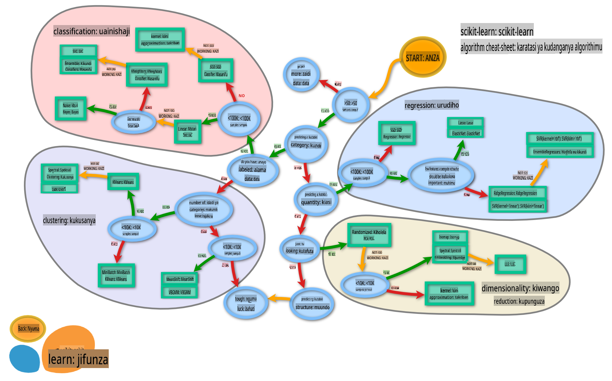

# Vihesabu vya vyakula 2

Katika somo hili la pili la uainishaji, utaangalia njia zaidi za kuainisha data za nambari. Pia utajifunza kuhusu athari za kuchagua kihesabu kimoja juu ya kingine.

## [Jaribio la kabla ya somo](https://gray-sand-07a10f403.1.azurestaticapps.net/quiz/23/)

### Sharti

Tunadhani kwamba umekamilisha masomo ya awali na una dataset iliyosafishwa katika folda yako ya `data` inayoitwa _cleaned_cuisines.csv_ katika mzizi wa folda hii ya masomo manne.

### Maandalizi

Tumeweka faili yako ya _notebook.ipynb_ na dataset iliyosafishwa na tumeigawa katika dataframes za X na y, tayari kwa mchakato wa kujenga modeli.

## Ramani ya uainishaji

Hapo awali, ulijifunza kuhusu chaguzi mbalimbali unazoweza kuwa nazo unapoweka data kwa kutumia karatasi ya udanganyifu ya Microsoft. Scikit-learn inatoa karatasi ya udanganyifu inayofanana, lakini yenye undani zaidi ambayo inaweza kusaidia zaidi kupunguza washauri wako (neno lingine la vihesabu):


> Tip: [tembelea ramani hii mtandaoni](https://scikit-learn.org/stable/tutorial/machine_learning_map/) na bonyeza njia ili kusoma nyaraka.

### Mpango

Ramani hii ni muhimu sana mara tu unapokuwa na uelewa mzuri wa data yako, kwani unaweza 'kutembea' kwenye njia zake hadi uamuzi:

- Tuna sampuli >50
- Tunataka kutabiri kategoria
- Tuna data zilizo na lebo
- Tuna sampuli chini ya 100K
- ✨ Tunaweza kuchagua Linear SVC
- Ikiwa hiyo haifanyi kazi, kwa kuwa tuna data za nambari
    - Tunaweza kujaribu ✨ KNeighbors Classifier 
      - Ikiwa hiyo haifanyi kazi, jaribu ✨ SVC na ✨ Ensemble Classifiers

Hii ni njia nzuri sana ya kufuata.

## Zoezi - gawanya data

Kufuata njia hii, tunapaswa kuanza kwa kuingiza baadhi ya maktaba za kutumia.

1. Ingiza maktaba zinazohitajika:

    ```python
    from sklearn.neighbors import KNeighborsClassifier
    from sklearn.linear_model import LogisticRegression
    from sklearn.svm import SVC
    from sklearn.ensemble import RandomForestClassifier, AdaBoostClassifier
    from sklearn.model_selection import train_test_split, cross_val_score
    from sklearn.metrics import accuracy_score,precision_score,confusion_matrix,classification_report, precision_recall_curve
    import numpy as np
    ```

1. Gawanya data yako ya mafunzo na majaribio:

    ```python
    X_train, X_test, y_train, y_test = train_test_split(cuisines_feature_df, cuisines_label_df, test_size=0.3)
    ```

## Kihesabu cha Linear SVC

Support-Vector clustering (SVC) ni mtoto wa familia ya Support-Vector machines ya mbinu za ML (jifunze zaidi kuhusu hizi hapa chini). Katika njia hii, unaweza kuchagua 'kernel' kuamua jinsi ya kuainisha lebo. Kigezo cha 'C' kinahusu 'uregulishaji' ambao unadhibiti ushawishi wa vigezo. Kernel inaweza kuwa moja ya [kadhaa](https://scikit-learn.org/stable/modules/generated/sklearn.svm.SVC.html#sklearn.svm.SVC); hapa tunaweka 'linear' kuhakikisha tunatumia linear SVC. Uwezekano kwa default ni 'false'; hapa tunaweka 'true' ili kupata makadirio ya uwezekano. Tunaweka hali ya nasibu kuwa '0' ili kuchanganya data kupata uwezekano.

### Zoezi - tumia linear SVC

Anza kwa kuunda safu ya vihesabu. Utaongeza polepole kwenye safu hii tunapojaribu. 

1. Anza na Linear SVC:

    ```python
    C = 10
    # Create different classifiers.
    classifiers = {
        'Linear SVC': SVC(kernel='linear', C=C, probability=True,random_state=0)
    }
    ```

2. Funza modeli yako kwa kutumia Linear SVC na uchapishe ripoti:

    ```python
    n_classifiers = len(classifiers)
    
    for index, (name, classifier) in enumerate(classifiers.items()):
        classifier.fit(X_train, np.ravel(y_train))
    
        y_pred = classifier.predict(X_test)
        accuracy = accuracy_score(y_test, y_pred)
        print("Accuracy (train) for %s: %0.1f%% " % (name, accuracy * 100))
        print(classification_report(y_test,y_pred))
    ```

    Matokeo ni mazuri sana:

    ```output
    Accuracy (train) for Linear SVC: 78.6% 
                  precision    recall  f1-score   support
    
         chinese       0.71      0.67      0.69       242
          indian       0.88      0.86      0.87       234
        japanese       0.79      0.74      0.76       254
          korean       0.85      0.81      0.83       242
            thai       0.71      0.86      0.78       227
    
        accuracy                           0.79      1199
       macro avg       0.79      0.79      0.79      1199
    weighted avg       0.79      0.79      0.79      1199
    ```

## K-Neighbors classifier

K-Neighbors ni sehemu ya familia ya "majirani" ya mbinu za ML, ambazo zinaweza kutumika kwa kujifunza kwa usimamizi na bila usimamizi. Katika njia hii, idadi iliyopangwa ya pointi huundwa na data hukusanywa karibu na pointi hizi ili lebo zilizojumlishwa ziweze kutabiriwa kwa data.

### Zoezi - tumia K-Neighbors classifier

Kihesabu kilichopita kilikuwa kizuri, na kilifanya kazi vizuri na data, lakini labda tunaweza kupata usahihi bora zaidi. Jaribu K-Neighbors classifier.

1. Ongeza mstari kwenye safu yako ya kihesabu (ongeza koma baada ya kipengee cha Linear SVC):

    ```python
    'KNN classifier': KNeighborsClassifier(C),
    ```

    Matokeo ni mabaya kidogo:

    ```output
    Accuracy (train) for KNN classifier: 73.8% 
                  precision    recall  f1-score   support
    
         chinese       0.64      0.67      0.66       242
          indian       0.86      0.78      0.82       234
        japanese       0.66      0.83      0.74       254
          korean       0.94      0.58      0.72       242
            thai       0.71      0.82      0.76       227
    
        accuracy                           0.74      1199
       macro avg       0.76      0.74      0.74      1199
    weighted avg       0.76      0.74      0.74      1199
    ```

    ✅ Jifunze kuhusu [K-Neighbors](https://scikit-learn.org/stable/modules/neighbors.html#neighbors)

## Kihesabu cha Support Vector

Kihesabu cha Support-Vector ni sehemu ya familia ya [Support-Vector Machine](https://wikipedia.org/wiki/Support-vector_machine) ya mbinu za ML ambazo hutumika kwa kazi za uainishaji na regression. SVMs "huweka mifano ya mafunzo kwenye pointi katika nafasi" ili kuongeza umbali kati ya kategoria mbili. Data inayofuata huwekwa katika nafasi hii ili kategoria yao iweze kutabiriwa.

### Zoezi - tumia Support Vector Classifier

Hebu jaribu kupata usahihi bora zaidi kwa kutumia Support Vector Classifier.

1. Ongeza koma baada ya kipengee cha K-Neighbors, na kisha ongeza mstari huu:

    ```python
    'SVC': SVC(),
    ```

    Matokeo ni mazuri sana!

    ```output
    Accuracy (train) for SVC: 83.2% 
                  precision    recall  f1-score   support
    
         chinese       0.79      0.74      0.76       242
          indian       0.88      0.90      0.89       234
        japanese       0.87      0.81      0.84       254
          korean       0.91      0.82      0.86       242
            thai       0.74      0.90      0.81       227
    
        accuracy                           0.83      1199
       macro avg       0.84      0.83      0.83      1199
    weighted avg       0.84      0.83      0.83      1199
    ```

    ✅ Jifunze kuhusu [Support-Vectors](https://scikit-learn.org/stable/modules/svm.html#svm)

## Vihesabu vya Ensemble

Hebu fuata njia hadi mwisho, ingawa jaribio la awali lilikuwa zuri sana. Hebu jaribu 'Ensemble Classifiers, haswa Random Forest na AdaBoost:

```python
  'RFST': RandomForestClassifier(n_estimators=100),
  'ADA': AdaBoostClassifier(n_estimators=100)
```

Matokeo ni mazuri sana, hasa kwa Random Forest:

```output
Accuracy (train) for RFST: 84.5% 
              precision    recall  f1-score   support

     chinese       0.80      0.77      0.78       242
      indian       0.89      0.92      0.90       234
    japanese       0.86      0.84      0.85       254
      korean       0.88      0.83      0.85       242
        thai       0.80      0.87      0.83       227

    accuracy                           0.84      1199
   macro avg       0.85      0.85      0.84      1199
weighted avg       0.85      0.84      0.84      1199

Accuracy (train) for ADA: 72.4% 
              precision    recall  f1-score   support

     chinese       0.64      0.49      0.56       242
      indian       0.91      0.83      0.87       234
    japanese       0.68      0.69      0.69       254
      korean       0.73      0.79      0.76       242
        thai       0.67      0.83      0.74       227

    accuracy                           0.72      1199
   macro avg       0.73      0.73      0.72      1199
weighted avg       0.73      0.72      0.72      1199
```

✅ Jifunze kuhusu [Ensemble Classifiers](https://scikit-learn.org/stable/modules/ensemble.html)

Njia hii ya Kujifunza Mashine "inaunganisha utabiri wa wahesabuji kadhaa wa msingi" ili kuboresha ubora wa modeli. Katika mfano wetu, tulitumia Random Trees na AdaBoost. 

- [Random Forest](https://scikit-learn.org/stable/modules/ensemble.html#forest), njia ya wastani, inajenga 'msitu' wa 'miti ya maamuzi' iliyo na nasibu ili kuepuka kufaa kupita kiasi. Kigezo cha n_estimators kimewekwa kwa idadi ya miti.

- [AdaBoost](https://scikit-learn.org/stable/modules/generated/sklearn.ensemble.AdaBoostClassifier.html) inafaa kihesabu kwa dataset na kisha inafaa nakala za kihesabu hicho kwa dataset hiyo hiyo. Inazingatia uzito wa vitu vilivyoainishwa vibaya na kurekebisha kifaa kwa kihesabu kinachofuata ili kusahihisha.

---

## 🚀Changamoto

Kila moja ya mbinu hizi ina idadi kubwa ya vigezo unavyoweza kurekebisha. Tafiti vigezo vya default vya kila moja na fikiria kuhusu nini kurekebisha vigezo hivi kungeleta kwa ubora wa modeli.

## [Jaribio la baada ya somo](https://gray-sand-07a10f403.1.azurestaticapps.net/quiz/24/)

## Mapitio & Kujisomea

Kuna maneno mengi ya kitaalamu katika masomo haya, kwa hivyo chukua muda kidogo kupitia [orodha hii](https://docs.microsoft.com/dotnet/machine-learning/resources/glossary?WT.mc_id=academic-77952-leestott) ya maneno muhimu!

## Kazi 

[Cheza na vigezo](assignment.md)

**Kanusho**:
Hati hii imetafsiriwa kwa kutumia huduma za tafsiri za AI zinazotumia mashine. Ingawa tunajitahidi kwa usahihi, tafadhali fahamu kuwa tafsiri za kiotomatiki zinaweza kuwa na makosa au kutokamilika. Hati ya asili katika lugha yake ya asili inapaswa kuzingatiwa kama chanzo cha mamlaka. Kwa taarifa muhimu, tafsiri ya kitaalamu ya binadamu inapendekezwa. Hatutawajibika kwa kutoelewana au kutafsiri vibaya kunakotokana na matumizi ya tafsiri hii.