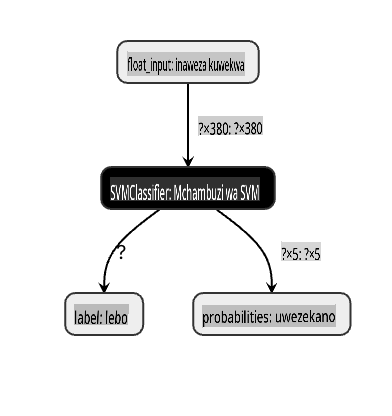
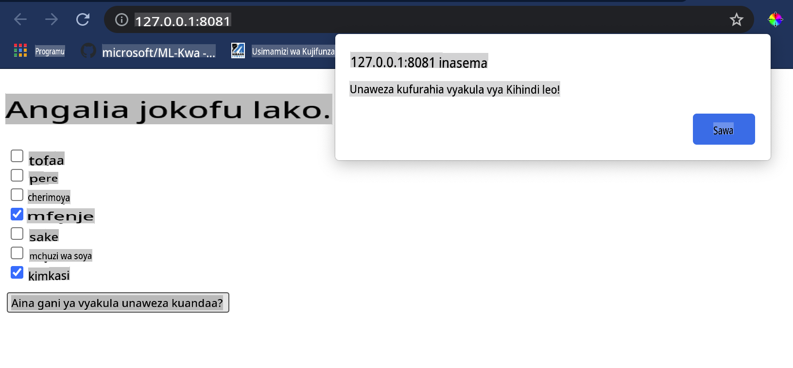

# Jenga Programu ya Mapendekezo ya Vyakula

Katika somo hili, utajenga mfano wa uainishaji ukitumia baadhi ya mbinu ulizojifunza katika masomo yaliyopita na kwa kutumia seti ya data ya vyakula vitamu iliyotumika katika mfululizo huu. Aidha, utajenga programu ndogo ya wavuti kutumia mfano uliowekwa, kwa kutumia Onnx's web runtime.

Moja ya matumizi muhimu ya kujifunza kwa mashine ni kujenga mifumo ya mapendekezo, na unaweza kuchukua hatua ya kwanza katika mwelekeo huo leo!

[](https://youtu.be/17wdM9AHMfg "Applied ML")

> 🎥 Bofya picha hapo juu kwa video: Jen Looper anajenga programu ya wavuti kutumia data ya vyakula vilivyowekwa

## [Jaribio la kabla ya somo](https://gray-sand-07a10f403.1.azurestaticapps.net/quiz/25/)

Katika somo hili utajifunza:

- Jinsi ya kujenga mfano na kuihifadhi kama mfano wa Onnx
- Jinsi ya kutumia Netron kukagua mfano
- Jinsi ya kutumia mfano wako katika programu ya wavuti kwa utabiri

## Jenga mfano wako

Kujenga mifumo ya ML inayotumika ni sehemu muhimu ya kutumia teknolojia hizi kwa mifumo ya biashara yako. Unaweza kutumia mifano ndani ya programu zako za wavuti (na hivyo kuzitumia katika muktadha wa nje ya mtandao ikiwa inahitajika) kwa kutumia Onnx.

Katika [somo la awali](../../3-Web-App/1-Web-App/README.md), ulijenga mfano wa Regression kuhusu kuona UFO, "pickled" na kuutumia katika programu ya Flask. Wakati usanifu huu ni muhimu sana kujua, ni programu kamili ya Python, na mahitaji yako yanaweza kujumuisha matumizi ya programu ya JavaScript.

Katika somo hili, unaweza kujenga mfumo wa msingi wa JavaScript kwa utabiri. Kwanza, hata hivyo, unahitaji kufundisha mfano na kuubadilisha kwa matumizi na Onnx.

## Zoezi - fundisha mfano wa uainishaji

Kwanza, fundisha mfano wa uainishaji ukitumia seti ya data ya vyakula iliyosafishwa tuliyotumia.

1. Anza kwa kuingiza maktaba muhimu:

    ```python
    !pip install skl2onnx
    import pandas as pd 
    ```

    Unahitaji '[skl2onnx](https://onnx.ai/sklearn-onnx/)' kusaidia kubadilisha mfano wako wa Scikit-learn kuwa muundo wa Onnx.

1. Kisha, fanya kazi na data yako kwa njia ile ile uliyofanya katika masomo yaliyopita, kwa kusoma faili ya CSV ukitumia `read_csv()`:

    ```python
    data = pd.read_csv('../data/cleaned_cuisines.csv')
    data.head()
    ```

1. Ondoa safu mbili za kwanza zisizo za lazima na uhifadhi data iliyobaki kama 'X':

    ```python
    X = data.iloc[:,2:]
    X.head()
    ```

1. Hifadhi lebo kama 'y':

    ```python
    y = data[['cuisine']]
    y.head()
    
    ```

### Anza mchakato wa mafunzo

Tutatumia maktaba ya 'SVC' ambayo ina usahihi mzuri.

1. Ingiza maktaba zinazofaa kutoka Scikit-learn:

    ```python
    from sklearn.model_selection import train_test_split
    from sklearn.svm import SVC
    from sklearn.model_selection import cross_val_score
    from sklearn.metrics import accuracy_score,precision_score,confusion_matrix,classification_report
    ```

1. Tenganisha seti za mafunzo na majaribio:

    ```python
    X_train, X_test, y_train, y_test = train_test_split(X,y,test_size=0.3)
    ```

1. Jenga mfano wa Uainishaji wa SVC kama ulivyofanya katika somo lililopita:

    ```python
    model = SVC(kernel='linear', C=10, probability=True,random_state=0)
    model.fit(X_train,y_train.values.ravel())
    ```

1. Sasa, jaribu mfano wako, ukipiga `predict()`:

    ```python
    y_pred = model.predict(X_test)
    ```

1. Chapisha ripoti ya uainishaji ili kuangalia ubora wa mfano:

    ```python
    print(classification_report(y_test,y_pred))
    ```

    Kama tulivyoona hapo awali, usahihi ni mzuri:

    ```output
                    precision    recall  f1-score   support
    
         chinese       0.72      0.69      0.70       257
          indian       0.91      0.87      0.89       243
        japanese       0.79      0.77      0.78       239
          korean       0.83      0.79      0.81       236
            thai       0.72      0.84      0.78       224
    
        accuracy                           0.79      1199
       macro avg       0.79      0.79      0.79      1199
    weighted avg       0.79      0.79      0.79      1199
    ```

### Badilisha mfano wako kuwa Onnx

Hakikisha unafanya ubadilishaji na idadi sahihi ya Tensor. Seti hii ya data ina viungo 380 vilivyotajwa, kwa hivyo unahitaji kubainisha idadi hiyo katika `FloatTensorType`:

1. Badilisha ukitumia idadi ya tensor ya 380.

    ```python
    from skl2onnx import convert_sklearn
    from skl2onnx.common.data_types import FloatTensorType
    
    initial_type = [('float_input', FloatTensorType([None, 380]))]
    options = {id(model): {'nocl': True, 'zipmap': False}}
    ```

1. Unda onx na uhifadhi kama faili **model.onnx**:

    ```python
    onx = convert_sklearn(model, initial_types=initial_type, options=options)
    with open("./model.onnx", "wb") as f:
        f.write(onx.SerializeToString())
    ```

    > Kumbuka, unaweza kupitisha [chaguzi](https://onnx.ai/sklearn-onnx/parameterized.html) katika hati yako ya ubadilishaji. Katika kesi hii, tulipitisha 'nocl' kuwa Kweli na 'zipmap' kuwa Uongo. Kwa kuwa huu ni mfano wa uainishaji, una chaguo la kuondoa ZipMap ambayo hutoa orodha ya kamusi (si lazima). `nocl` refers to class information being included in the model. Reduce your model's size by setting `nocl` to 'True'. 

Running the entire notebook will now build an Onnx model and save it to this folder.

## View your model

Onnx models are not very visible in Visual Studio code, but there's a very good free software that many researchers use to visualize the model to ensure that it is properly built. Download [Netron](https://github.com/lutzroeder/Netron) and  open your model.onnx file. You can see your simple model visualized, with its 380 inputs and classifier listed:



Netron is a helpful tool to view your models.

Now you are ready to use this neat model in a web app. Let's build an app that will come in handy when you look in your refrigerator and try to figure out which combination of your leftover ingredients you can use to cook a given cuisine, as determined by your model.

## Build a recommender web application

You can use your model directly in a web app. This architecture also allows you to run it locally and even offline if needed. Start by creating an `index.html` file in the same folder where you stored your `model.onnx` faili.

1. Katika faili hii _index.html_, ongeza alama zifuatazo:

    ```html
    <!DOCTYPE html>
    <html>
        <header>
            <title>Cuisine Matcher</title>
        </header>
        <body>
            ...
        </body>
    </html>
    ```

1. Sasa, ukifanya kazi ndani ya vitambulisho vya `body`, ongeza alama kidogo kuonyesha orodha ya visanduku vya kukagua vinavyoakisi baadhi ya viungo:

    ```html
    <h1>Check your refrigerator. What can you create?</h1>
            <div id="wrapper">
                <div class="boxCont">
                    <input type="checkbox" value="4" class="checkbox">
                    <label>apple</label>
                </div>
            
                <div class="boxCont">
                    <input type="checkbox" value="247" class="checkbox">
                    <label>pear</label>
                </div>
            
                <div class="boxCont">
                    <input type="checkbox" value="77" class="checkbox">
                    <label>cherry</label>
                </div>
    
                <div class="boxCont">
                    <input type="checkbox" value="126" class="checkbox">
                    <label>fenugreek</label>
                </div>
    
                <div class="boxCont">
                    <input type="checkbox" value="302" class="checkbox">
                    <label>sake</label>
                </div>
    
                <div class="boxCont">
                    <input type="checkbox" value="327" class="checkbox">
                    <label>soy sauce</label>
                </div>
    
                <div class="boxCont">
                    <input type="checkbox" value="112" class="checkbox">
                    <label>cumin</label>
                </div>
            </div>
            <div style="padding-top:10px">
                <button onClick="startInference()">What kind of cuisine can you make?</button>
            </div> 
    ```

    Angalia kwamba kila kisanduku cha kukagua kimepewa thamani. Hii inaonyesha index ambapo kiungo kinapatikana kulingana na seti ya data. Apple, kwa mfano, katika orodha hii ya alfabeti, inachukua safu ya tano, kwa hivyo thamani yake ni '4' kwa kuwa tunaanza kuhesabu kutoka 0. Unaweza kushauriana na [spreadsheet ya viungo](../../../../4-Classification/data/ingredient_indexes.csv) kugundua index ya kiungo fulani.

    Ukiendelea na kazi yako katika faili ya index.html, ongeza kizuizi cha hati ambapo mfano unaitwa baada ya kufunga mwisho `</div>`.

1. Kwanza, ingiza [Onnx Runtime](https://www.onnxruntime.ai/):

    ```html
    <script src="https://cdn.jsdelivr.net/npm/onnxruntime-web@1.9.0/dist/ort.min.js"></script> 
    ```

    > Onnx Runtime inatumika kuwezesha kuendesha mifano yako ya Onnx kwenye majukwaa mbalimbali ya vifaa, ikiwa ni pamoja na uboreshaji na API ya kutumia.

1. Mara Runtime inapowekwa, unaweza kuipiga:

    ```html
    <script>
        const ingredients = Array(380).fill(0);
        
        const checks = [...document.querySelectorAll('.checkbox')];
        
        checks.forEach(check => {
            check.addEventListener('change', function() {
                // toggle the state of the ingredient
                // based on the checkbox's value (1 or 0)
                ingredients[check.value] = check.checked ? 1 : 0;
            });
        });

        function testCheckboxes() {
            // validate if at least one checkbox is checked
            return checks.some(check => check.checked);
        }

        async function startInference() {

            let atLeastOneChecked = testCheckboxes()

            if (!atLeastOneChecked) {
                alert('Please select at least one ingredient.');
                return;
            }
            try {
                // create a new session and load the model.
                
                const session = await ort.InferenceSession.create('./model.onnx');

                const input = new ort.Tensor(new Float32Array(ingredients), [1, 380]);
                const feeds = { float_input: input };

                // feed inputs and run
                const results = await session.run(feeds);

                // read from results
                alert('You can enjoy ' + results.label.data[0] + ' cuisine today!')

            } catch (e) {
                console.log(`failed to inference ONNX model`);
                console.error(e);
            }
        }
               
    </script>
    ```

Katika msimbo huu, kuna mambo kadhaa yanayotokea:

1. Uliunda safu ya thamani 380 zinazowezekana (1 au 0) kuwekwa na kutumwa kwa mfano kwa utabiri, kulingana na kama kisanduku cha kukagua kiungo kimechaguliwa.
2. Uliunda safu ya visanduku vya kukagua na njia ya kubaini kama vilikuwa vimechaguliwa katika `init` function that is called when the application starts. When a checkbox is checked, the `ingredients` array is altered to reflect the chosen ingredient.
3. You created a `testCheckboxes` function that checks whether any checkbox was checked.
4. You use `startInference` function when the button is pressed and, if any checkbox is checked, you start inference.
5. The inference routine includes:
   1. Setting up an asynchronous load of the model
   2. Creating a Tensor structure to send to the model
   3. Creating 'feeds' that reflects the `float_input` input that you created when training your model (you can use Netron to verify that name)
   4. Sending these 'feeds' to the model and waiting for a response

## Test your application

Open a terminal session in Visual Studio Code in the folder where your index.html file resides. Ensure that you have [http-server](https://www.npmjs.com/package/http-server) installed globally, and type `http-server` kwenye prompt. Localhost inapaswa kufunguka na unaweza kuona programu yako ya wavuti. Angalia ni chakula gani kinachopendekezwa kulingana na viungo mbalimbali:



Hongera, umeunda programu ya wavuti ya 'mapendekezo' na sehemu chache. Chukua muda kujenga mfumo huu zaidi!
## 🚀Changamoto

Programu yako ya wavuti ni ndogo sana, kwa hivyo endelea kuijenga ukitumia viungo na fahirisi zao kutoka kwa data ya [ingredient_indexes](../../../../4-Classification/data/ingredient_indexes.csv). Ni mchanganyiko gani wa ladha hufanya chakula cha kitaifa fulani?

## [Jaribio la baada ya somo](https://gray-sand-07a10f403.1.azurestaticapps.net/quiz/26/)

## Mapitio & Kujisomea

Wakati somo hili limegusia tu matumizi ya kujenga mfumo wa mapendekezo kwa viungo vya chakula, eneo hili la matumizi ya ML lina mifano mingi. Soma zaidi kuhusu jinsi mifumo hii inavyojengwa:

- https://www.sciencedirect.com/topics/computer-science/recommendation-engine
- https://www.technologyreview.com/2014/08/25/171547/the-ultimate-challenge-for-recommendation-engines/
- https://www.technologyreview.com/2015/03/23/168831/everything-is-a-recommendation/

## Kazi 

[Jenga kipendekezo kipya](assignment.md)

**Kanusho**:
Hati hii imetafsiriwa kwa kutumia huduma za tafsiri za AI za mashine. Ingawa tunajitahidi kwa usahihi, tafadhali fahamu kwamba tafsiri za kiotomatiki zinaweza kuwa na makosa au upotovu. Hati asili katika lugha yake ya asili inapaswa kuzingatiwa kuwa chanzo cha mamlaka. Kwa habari muhimu, tafsiri ya kitaalamu ya binadamu inapendekezwa. Hatutawajibika kwa kutoelewana au tafsiri potofu zinazotokana na matumizi ya tafsiri hii.