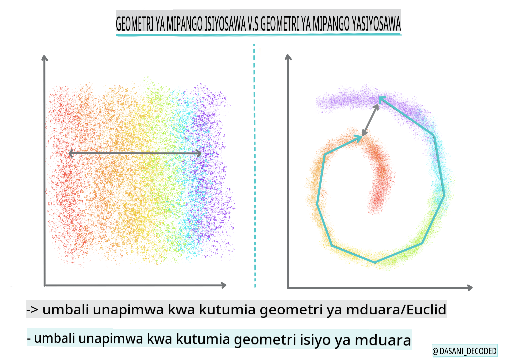
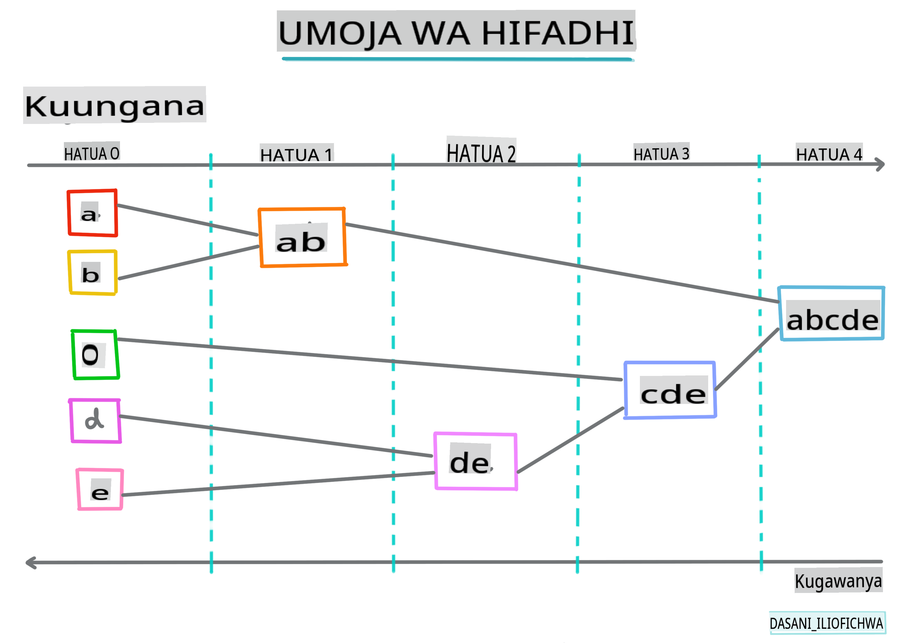
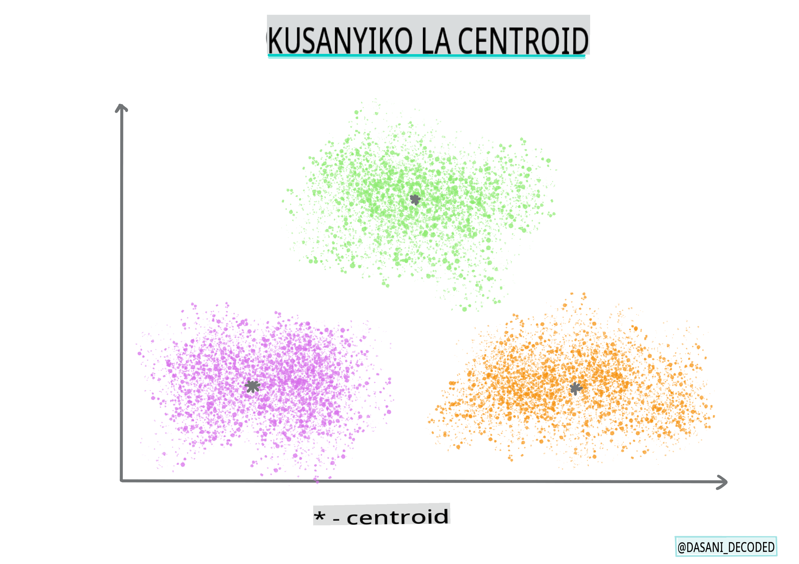

# Utangulizi wa clustering

Clustering ni aina ya [Unsupervised Learning](https://wikipedia.org/wiki/Unsupervised_learning) ambayo inadhani kwamba dataset haina lebo au kwamba ingizo zake hazijalinganishwa na matokeo yaliyoainishwa awali. Inatumia algoriti mbalimbali kuchambua data isiyo na lebo na kutoa makundi kulingana na mifumo inayoona kwenye data.

[](https://youtu.be/ty2advRiWJM "No One Like You by PSquare")

> 🎥 Bofya picha hapo juu kwa video. Wakati unajifunza machine learning na clustering, furahia baadhi ya nyimbo za Nigerian Dance Hall - hii ni wimbo uliopendwa sana kutoka mwaka 2014 na PSquare.
## [Pre-lecture quiz](https://gray-sand-07a10f403.1.azurestaticapps.net/quiz/27/)
### Utangulizi

[Clustering](https://link.springer.com/referenceworkentry/10.1007%2F978-0-387-30164-8_124) ni muhimu sana kwa uchunguzi wa data. Hebu tuone kama inaweza kusaidia kugundua mwelekeo na mifumo katika njia ambayo hadhira ya Nigeria hutumia muziki.

✅ Chukua dakika moja kufikiria matumizi ya clustering. Katika maisha halisi, clustering hutokea wakati wowote unapokuwa na rundo la nguo na unahitaji kupanga nguo za wanafamilia wako 🧦👕👖🩲. Katika data science, clustering hutokea wakati wa kujaribu kuchambua mapendeleo ya mtumiaji, au kubaini sifa za dataset yoyote isiyo na lebo. Clustering, kwa njia, husaidia kufanya mambo kuwa na maana, kama droo ya soksi.

[](https://youtu.be/esmzYhuFnds "Introduction to Clustering")

> 🎥 Bofya picha hapo juu kwa video: John Guttag wa MIT anatoa utangulizi wa clustering

Katika mazingira ya kitaalamu, clustering inaweza kutumika kubaini mambo kama kugawanya soko, kubaini ni makundi ya umri gani yanayonunua bidhaa gani, kwa mfano. Matumizi mengine yanaweza kuwa kugundua udanganyifu, labda kugundua ulaghai kutoka kwenye dataset ya miamala ya kadi za mkopo. Au unaweza kutumia clustering kubaini uvimbe katika kundi la picha za matibabu.

✅ Fikiria dakika moja jinsi unavyoweza kuwa umekutana na clustering 'katika mazingira ya asili', katika mazingira ya benki, e-commerce, au biashara.

> 🎓 Inafurahisha, uchambuzi wa cluster ulitokana na nyanja za Anthropolojia na Saikolojia katika miaka ya 1930. Je, unaweza kufikiria jinsi ilivyoweza kutumika?

Vinginevyo, unaweza kuitumia kwa kupanga matokeo ya utafutaji - kwa viungo vya ununuzi, picha, au hakiki, kwa mfano. Clustering ni muhimu unapokuwa na dataset kubwa ambayo unataka kupunguza na ambayo unataka kufanya uchambuzi wa kina zaidi, kwa hivyo mbinu hii inaweza kutumika kujifunza kuhusu data kabla ya kujenga mifano mingine.

✅ Mara data yako inapopangwa katika clusters, unapeleka kitambulisho cha cluster, na mbinu hii inaweza kuwa na manufaa wakati wa kuhifadhi faragha ya dataset; badala yake unaweza kurejelea kipengele cha data kwa kitambulisho cha cluster, badala ya data inayotambulika zaidi. Je, unaweza kufikiria sababu nyingine kwa nini ungependa kurejelea kitambulisho cha cluster badala ya vipengele vingine vya cluster ili kuitambulisha?

Kuelewa zaidi mbinu za clustering katika [Learn module](https://docs.microsoft.com/learn/modules/train-evaluate-cluster-models?WT.mc_id=academic-77952-leestott)
## Kuanza na clustering

[Scikit-learn inatoa mbinu nyingi](https://scikit-learn.org/stable/modules/clustering.html) za kufanya clustering. Aina unayochagua itategemea kesi yako ya matumizi. Kulingana na nyaraka, kila mbinu ina faida mbalimbali. Hapa kuna jedwali rahisi la mbinu zinazoungwa mkono na Scikit-learn na kesi zao za matumizi zinazofaa:

| Jina la Mbinu                | Kesi ya Matumizi                                                    |
| :--------------------------- | :------------------------------------------------------------------ |
| K-Means                      | matumizi ya jumla, inductive                                        |
| Affinity propagation         | makundi mengi, yasiyo sawa, inductive                               |
| Mean-shift                   | makundi mengi, yasiyo sawa, inductive                               |
| Spectral clustering          | makundi machache, sawa, transductive                                |
| Ward hierarchical clustering | makundi mengi, yenye vikwazo, transductive                          |
| Agglomerative clustering     | makundi mengi, yenye vikwazo, umbali usio wa Euclidean, transductive|
| DBSCAN                       | jiometri isiyo tambarare, makundi yasiyo sawa, transductive         |
| OPTICS                       | jiometri isiyo tambarare, makundi yasiyo sawa yenye msongamano tofauti, transductive|
| Gaussian mixtures            | jiometri tambarare, inductive                                       |
| BIRCH                        | dataset kubwa yenye outliers, inductive                             |

> 🎓 Jinsi tunavyounda clusters inahusiana sana na jinsi tunavyokusanya pointi za data katika makundi. Hebu tuchambue baadhi ya msamiati:
>
> 🎓 ['Transductive' vs. 'inductive'](https://wikipedia.org/wiki/Transduction_(machine_learning))
> 
> Transductive inference inatokana na kesi za mafunzo zilizozingatiwa ambazo zinaelekeza kwenye kesi maalum za mtihani. Inductive inference inatokana na kesi za mafunzo ambazo zinaelekeza kwenye sheria za jumla ambazo baadaye zinatumika kwenye kesi za mtihani.
> 
> Mfano: Fikiria una dataset ambayo ina lebo kwa sehemu tu. Vitu vingine ni 'rekodi', vingine ni 'cds', na vingine havina lebo. Kazi yako ni kutoa lebo kwa data isiyo na lebo. Ikiwa unachagua mbinu ya inductive, ungefundisha mfano kwa kutafuta 'rekodi' na 'cds', na kutumia lebo hizo kwenye data yako isiyo na lebo. Mbinu hii itapata shida kuainisha vitu ambavyo kwa kweli ni 'cassettes'. Mbinu ya transductive, kwa upande mwingine, hushughulikia data hii isiyojulikana kwa ufanisi zaidi kwani inafanya kazi ya kuunganisha vitu vinavyofanana na kisha kutoa lebo kwa kundi. Katika kesi hii, clusters zinaweza kuonyesha 'vitu vya muziki vya mviringo' na 'vitu vya muziki vya mraba'.
> 
> 🎓 ['Non-flat' vs. 'flat' geometry](https://datascience.stackexchange.com/questions/52260/terminology-flat-geometry-in-the-context-of-clustering)
> 
> Imetokana na istilahi za kihesabu, jiometri isiyo tambarare vs. tambarare inahusu kipimo cha umbali kati ya pointi kwa njia ya 'tambarare' ([Euclidean](https://wikipedia.org/wiki/Euclidean_geometry)) au 'isiyo tambarare' (isiyo ya Euclidean).
>
>'Tambarare' katika muktadha huu inarejelea jiometri ya Euclidean (sehemu za ambayo hufundishwa kama 'jiometri ya ndege'), na isiyo tambarare inarejelea jiometri isiyo ya Euclidean. Jiometri inahusiana vipi na machine learning? Naam, kama nyanja mbili ambazo zinategemea hesabu, lazima kuwe na njia ya kawaida ya kupima umbali kati ya pointi katika clusters, na hiyo inaweza kufanywa kwa njia ya 'tambarare' au 'isiyo tambarare', kulingana na asili ya data. [Umbali wa Euclidean](https://wikipedia.org/wiki/Euclidean_distance) unapimwa kama urefu wa kipande cha mstari kati ya pointi mbili. [Umbali usio wa Euclidean](https://wikipedia.org/wiki/Non-Euclidean_geometry) unapimwa kando ya curve. Ikiwa data yako, ikionyeshwa, inaonekana kuwa haipo kwenye ndege, unaweza kuhitaji kutumia algoriti maalum kuishughulikia.
>

> Infographic na [Dasani Madipalli](https://twitter.com/dasani_decoded)
> 
> 🎓 ['Umbali'](https://web.stanford.edu/class/cs345a/slides/12-clustering.pdf)
> 
> Clusters zinafafanuliwa na matrix ya umbali wao, yaani umbali kati ya pointi. Umbali huu unaweza kupimwa kwa njia kadhaa. Clusters za Euclidean zinafafanuliwa na wastani wa thamani za pointi, na zina 'centroid' au kituo. Umbali hupimwa kwa umbali hadi kwenye centroid hiyo. Umbali usio wa Euclidean unarejelea 'clustroids', pointi iliyo karibu zaidi na pointi nyingine. Clustroids kwa upande wao zinaweza kufafanuliwa kwa njia mbalimbali.
> 
> 🎓 ['Yenye vikwazo'](https://wikipedia.org/wiki/Constrained_clustering)
> 
> [Constrained Clustering](https://web.cs.ucdavis.edu/~davidson/Publications/ICDMTutorial.pdf) inaletwa 'semi-supervised' learning katika mbinu hii isiyo ya usimamizi. Mahusiano kati ya pointi yamewekwa alama kama 'hayawezi kuunganishwa' au 'lazima yaunganishwe' hivyo sheria fulani zinalazimishwa kwenye dataset.
>
> Mfano: Ikiwa algoriti imeachiwa huru kwenye kundi la data isiyo na lebo au yenye lebo kidogo, clusters zinazozalisha zinaweza kuwa za ubora duni. Katika mfano hapo juu, clusters zinaweza kuunganisha 'vitu vya muziki vya mviringo' na 'vitu vya muziki vya mraba' na 'vitu vya pembetatu' na 'biskuti'. Ikiwa imepewa vikwazo fulani, au sheria za kufuata ("kipengele lazima kiwe cha plastiki", "kipengele kinahitaji kuwa na uwezo wa kutoa muziki") hii inaweza kusaidia 'kuzuia' algoriti kufanya uchaguzi bora.
> 
> 🎓 'Density'
> 
> Data ambayo ni 'noisy' inachukuliwa kuwa 'dense'. Umbali kati ya pointi katika kila cluster zake unaweza kuonyesha, kwa uchunguzi, kuwa zaidi au chini ya dense, au 'imejaa' na hivyo data hii inahitaji kuchambuliwa kwa mbinu sahihi ya clustering. [Makala hii](https://www.kdnuggets.com/2020/02/understanding-density-based-clustering.html) inaonyesha tofauti kati ya kutumia algoriti za K-Means clustering vs. HDBSCAN kuchunguza dataset yenye kelele na msongamano wa cluster usio sawa.

## Algoriti za clustering

Kuna zaidi ya algoriti 100 za clustering, na matumizi yake yanategemea asili ya data iliyo mkononi. Hebu tujadili baadhi ya zile kuu:

- **Hierarchical clustering**. Ikiwa kitu kimeainishwa kwa ukaribu wake na kitu kilicho karibu, badala ya kile kilicho mbali zaidi, clusters zinaundwa kulingana na umbali wa wanachama wake na vitu vingine. Agglomerative clustering ya Scikit-learn ni hierarchical.

   
   > Infographic na [Dasani Madipalli](https://twitter.com/dasani_decoded)

- **Centroid clustering**. Algoriti hii maarufu inahitaji kuchagua 'k', au idadi ya clusters za kuunda, baada ya hapo algoriti inaamua kituo cha cluster na kukusanya data karibu na kituo hicho. [K-means clustering](https://wikipedia.org/wiki/K-means_clustering) ni toleo maarufu la centroid clustering. Kituo kinaamuliwa na wastani wa karibu, hivyo jina. Umbali wa mraba kutoka kwenye cluster unapunguzwa.

   
   > Infographic na [Dasani Madipalli](https://twitter.com/dasani_decoded)

- **Distribution-based clustering**. Inategemea modeli za takwimu, clustering inayotegemea usambazaji inajikita katika kubaini uwezekano kwamba kipengele cha data kinahusiana na cluster, na kukipeleka ipasavyo. Mbinu za Gaussian mixture ni za aina hii.

- **Density-based clustering**. Vipengele vya data vinapewa clusters kulingana na density yao, au mkusanyiko wao karibu na kila mmoja. Vipengele vya data vilivyo mbali na kundi vinachukuliwa kuwa outliers au kelele. DBSCAN, Mean-shift na OPTICS ni za aina hii ya clustering.

- **Grid-based clustering**. Kwa datasets za vipimo vingi, gridi inaundwa na data inagawanywa kati ya seli za gridi, hivyo kuunda clusters.

## Zoezi - panga data yako

Clustering kama mbinu inasaidiwa sana na taswira sahihi, kwa hivyo hebu tuanze kwa kutazama data yetu ya muziki. Zoezi hili litatusaidia kuamua ni mbinu gani za clustering tunazopaswa kutumia kwa ufanisi zaidi kwa asili ya data hii.

1. Fungua faili [_notebook.ipynb_](https://github.com/microsoft/ML-For-Beginners/blob/main/5-Clustering/1-Visualize/notebook.ipynb) katika folda hii.

1. Ingiza kifurushi cha `Seaborn` kwa taswira bora ya data.

    ```python
    !pip install seaborn
    ```

1. Ongeza data ya wimbo kutoka [_nigerian-songs.csv_](https://github.com/microsoft/ML-For-Beginners/blob/main/5-Clustering/data/nigerian-songs.csv). Pakia dataframe na data fulani kuhusu nyimbo. Jiandae kuchunguza data hii kwa kuingiza maktaba na kutoa data:

    ```python
    import matplotlib.pyplot as plt
    import pandas as pd
    
    df = pd.read_csv("../data/nigerian-songs.csv")
    df.head()
    ```

    Angalia mistari ya kwanza ya data:

    |     | name                     | album                        | artist              | artist_top_genre | release_date | length | popularity | danceability | acousticness | energy | instrumentalness | liveness | loudness | speechiness | tempo   | time_signature |
    | --- | ------------------------ | ---------------------------- | ------------------- | ---------------- | ------------ | ------ | ---------- | ------------ | ------------ | ------ | ---------------- | -------- | -------- | ----------- | ------- | -------------- |
    | 0   | Sparky                   | Mandy & The Jungle           | Cruel Santino       | alternative r&b  | 2019         | 144000 | 48         | 0.666        | 0.851        | 0.42   | 0.534            | 0.11     | -6.699   | 0.0829      | 133.015 | 5              |
    | 1   | shuga rush               | EVERYTHING YOU HEARD IS TRUE | Odunsi (The Engine) | afropop          | 2020         | 89488  | 30         | 0.71         | 0.0822       | 0.683  | 0.000169         | 0.101    | -5.64    | 0.36        | 129.993 | 3              |
    | 2   | LITT!                    | LITT!                        | AYLØ                | indie r&b        | 2018         | 207758 | 40         | 0.836        | 0.272        | 0.564  | 0.000537         | 0.11     | -7.127   | 0.0424      | 130.005 | 4              |
    | 3   | Confident / Feeling Cool | Enjoy Your Life              | Lady Donli          | nigerian pop     | 2019         | 175135 | 14         | 0.894        | 0.798        | 0.611  | 0.000187         | 0.0964   | -4.961   | 0.113       | 111.087 | 4              |
    | 4   | wanted you               | rare.                        | Odunsi (The Engine) | afropop          | 2018         | 152049 | 25         | 0.702        | 0.116        | 0.833  | 0.91             | 0.348    | -6.044   | 0.0447      | 105.115 | 4              |

1. Pata taarifa kuhusu dataframe, kwa kuita `info()`:

    ```python
    df.info()
    ```

   Matokeo yanaonekana kama hivi:

    ```output
    <class 'pandas.core.frame.DataFrame'>
    RangeIndex: 530 entries, 0 to 529
    Data columns (total 16 columns):
     #   Column            Non-Null Count  Dtype  
    ---  ------            --------------  -----  
     0   name              530 non-null    object 
     1   album             530 non-null    object 
     2   artist            530 non-null    object 
     3   artist_top_genre  530 non-null    object 
     4   release_date      530 non-null    int64  
     5   length            530 non-null    int64  
     6   popularity        530 non-null    int64  
     7   danceability      530 non-null    float64
     8   acousticness      530 non-null    float64
     9   energy            530 non-null    float64
     10  instrumentalness  530 non-null    float64
     11  liveness          530 non-null    float64
     12  loudness          530 non-null    float64
     13  speechiness       530 non-null    float64
     14  tempo             530 non-null    float64
     15  time_signature    530 non-null    int64  
    dtypes: float64(8), int64(4), object(4)
    memory usage: 66.4+ KB
    ```

1. Angalia mara mbili kama kuna thamani za null, kwa kuita `isnull()` na kuthibitisha jumla kuwa 0:

    ```python
    df.isnull().sum()
    ```

    Inaonekana vizuri:

    ```output
    name                0
    album               0
    artist              0
    artist_top_genre    0
    release_date        0
    length              0
    popularity          0
    danceability        0
    acousticness        0
    energy              0
    instrumentalness    0
    liveness            0
    loudness            0
    speechiness         0
    tempo               0
    time_signature      0
    dtype: int64
    ```

1. Eleza data:

    ```python
    df.describe()
    ```

    |       | release_date | length      | popularity | danceability | acousticness | energy   | instrumentalness | liveness | loudness  | speechiness | tempo      | time_signature |
    | ----- | ------------ | ----------- | ---------- | ------------ | ------------ | -------- | ---------------- | -------- | --------- | ----------- | ---------- | -------------- |
    | count | 530          | 530         | 530        | 530          | 530          | 530      | 530              | 530      | 530       | 530         | 530        | 530            |
    | mean  | 2015.390566  | 222298.1698 | 17.507547  | 0.741619     | 0.265412     | 0.760623 | 0.016305         | 0.147308 | -4.953011 | 0.130748    | 116.487864 | 3.986792       |
    | std   | 3.131688     | 39696.82226 |
## [Jaribio baada ya somo](https://gray-sand-07a10f403.1.azurestaticapps.net/quiz/28/)

## Mapitio na Kujisomea

Kabla ya kutumia algorithms za clustering, kama tulivyojifunza, ni wazo zuri kuelewa asili ya dataset yako. Soma zaidi kuhusu mada hii [hapa](https://www.kdnuggets.com/2019/10/right-clustering-algorithm.html)

[Makala hii ya msaada](https://www.freecodecamp.org/news/8-clustering-algorithms-in-machine-learning-that-all-data-scientists-should-know/) inakuelekeza njia tofauti ambazo algorithms mbalimbali za clustering zinavyofanya kazi, kutokana na maumbo tofauti ya data.

## Kazi

[Fanya utafiti juu ya visualizations nyingine za clustering](assignment.md)

**Kanusho**:
Hati hii imetafsiriwa kwa kutumia huduma za tafsiri za AI za mashine. Ingawa tunajitahidi kwa usahihi, tafadhali fahamu kuwa tafsiri za kiotomatiki zinaweza kuwa na makosa au kutokubaliana. Hati ya asili katika lugha yake ya kiasili inapaswa kuzingatiwa kama chanzo rasmi. Kwa taarifa muhimu, inashauriwa kupata tafsiri ya kitaalamu ya kibinadamu. Hatutawajibika kwa kutokuelewana au tafsiri zisizo sahihi zinazotokana na matumizi ya tafsiri hii.