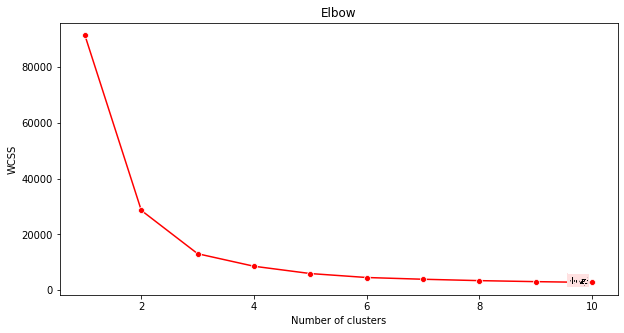
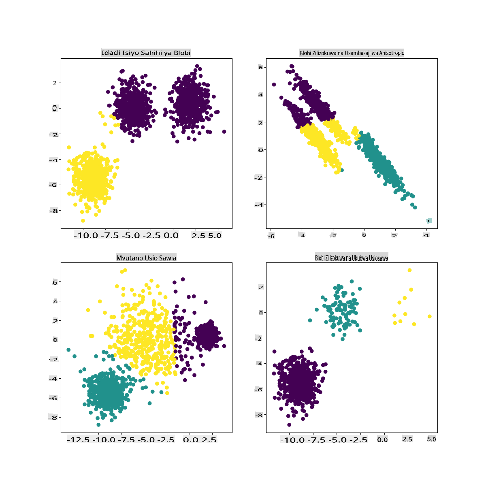

# K-Means clustering

## [Pre-lecture quiz](https://gray-sand-07a10f403.1.azurestaticapps.net/quiz/29/)

Katika somo hili, utajifunza jinsi ya kuunda vikundi kwa kutumia Scikit-learn na dataset ya muziki wa Nigeria uliyoiingiza awali. Tutashughulikia misingi ya K-Means kwa ajili ya Clustering. Kumbuka kwamba, kama ulivyojifunza katika somo la awali, kuna njia nyingi za kufanya kazi na vikundi na njia unayotumia inategemea data yako. Tutajaribu K-Means kwani ni mbinu ya kawaida zaidi ya clustering. Twende kazi!

Maneno utakayojifunza:

- Silhouette scoring
- Elbow method
- Inertia
- Variance

## Utangulizi

[K-Means Clustering](https://wikipedia.org/wiki/K-means_clustering) ni mbinu inayotokana na eneo la usindikaji wa ishara. Inatumika kugawanya na kugawa vikundi vya data katika 'k' clusters kwa kutumia mfululizo wa uchunguzi. Kila uchunguzi hufanya kazi ya kuweka kipengele cha data karibu zaidi na 'mean' yake, au sehemu ya kati ya cluster.

Vikundi vinaweza kuonyeshwa kama [Voronoi diagrams](https://wikipedia.org/wiki/Voronoi_diagram), ambazo zinajumuisha sehemu (au 'mbegu') na eneo lake linalolingana.


> infographic by [Jen Looper](https://twitter.com/jenlooper)

Mchakato wa K-Means clustering [unatekelezwa katika hatua tatu](https://scikit-learn.org/stable/modules/clustering.html#k-means):

1. Algorithimu huchagua idadi ya k ya sehemu za kati kwa kuchukua sampuli kutoka kwenye dataset. Baada ya hapo, inarudia:
    1. Inapeleka kila sampuli kwa centroid iliyo karibu zaidi.
    2. Inaunda centroids mpya kwa kuchukua thamani ya wastani wa sampuli zote zilizotolewa kwa centroids za awali.
    3. Kisha, inahesabu tofauti kati ya centroids mpya na za zamani na kurudia hadi centroids zitakapokuwa imara.

Hasara moja ya kutumia K-Means ni kwamba utahitaji kuanzisha 'k', ambayo ni idadi ya centroids. Kwa bahati nzuri, 'elbow method' husaidia kukadiria thamani nzuri ya kuanzia kwa 'k'. Utaijaribu baada ya muda mfupi.

## Sharti

Utafanya kazi katika faili la [_notebook.ipynb_](https://github.com/microsoft/ML-For-Beginners/blob/main/5-Clustering/2-K-Means/notebook.ipynb) la somo hili ambalo linajumuisha uingizaji wa data na usafishaji wa awali ulioufanya katika somo lililopita.

## Mazoezi - maandalizi

Anza kwa kuangalia tena data ya nyimbo.

1. Unda boxplot, ukipiga `boxplot()` kwa kila safu:

    ```python
    plt.figure(figsize=(20,20), dpi=200)
    
    plt.subplot(4,3,1)
    sns.boxplot(x = 'popularity', data = df)
    
    plt.subplot(4,3,2)
    sns.boxplot(x = 'acousticness', data = df)
    
    plt.subplot(4,3,3)
    sns.boxplot(x = 'energy', data = df)
    
    plt.subplot(4,3,4)
    sns.boxplot(x = 'instrumentalness', data = df)
    
    plt.subplot(4,3,5)
    sns.boxplot(x = 'liveness', data = df)
    
    plt.subplot(4,3,6)
    sns.boxplot(x = 'loudness', data = df)
    
    plt.subplot(4,3,7)
    sns.boxplot(x = 'speechiness', data = df)
    
    plt.subplot(4,3,8)
    sns.boxplot(x = 'tempo', data = df)
    
    plt.subplot(4,3,9)
    sns.boxplot(x = 'time_signature', data = df)
    
    plt.subplot(4,3,10)
    sns.boxplot(x = 'danceability', data = df)
    
    plt.subplot(4,3,11)
    sns.boxplot(x = 'length', data = df)
    
    plt.subplot(4,3,12)
    sns.boxplot(x = 'release_date', data = df)
    ```

    Data hii ni kidogo yenye kelele: kwa kuangalia kila safu kama boxplot, unaweza kuona outliers.

    

Unaweza kupitia dataset na kuondoa hizi outliers, lakini hiyo ingefanya data kuwa kidogo sana.

1. Kwa sasa, chagua safu ambazo utatumia kwa zoezi lako la clustering. Chagua zile zenye anuwai zinazofanana na encode safu ya `artist_top_genre` kama data ya nambari:

    ```python
    from sklearn.preprocessing import LabelEncoder
    le = LabelEncoder()
    
    X = df.loc[:, ('artist_top_genre','popularity','danceability','acousticness','loudness','energy')]
    
    y = df['artist_top_genre']
    
    X['artist_top_genre'] = le.fit_transform(X['artist_top_genre'])
    
    y = le.transform(y)
    ```

1. Sasa unahitaji kuchagua idadi ya clusters za kulenga. Unajua kuna aina 3 za nyimbo ambazo tulizitenga kutoka kwenye dataset, kwa hivyo jaribu 3:

    ```python
    from sklearn.cluster import KMeans
    
    nclusters = 3 
    seed = 0
    
    km = KMeans(n_clusters=nclusters, random_state=seed)
    km.fit(X)
    
    # Predict the cluster for each data point
    
    y_cluster_kmeans = km.predict(X)
    y_cluster_kmeans
    ```

Unaona safu iliyochapishwa na clusters zilizotabiriwa (0, 1, au 2) kwa kila safu ya dataframe.

1. Tumia safu hii kuhesabu 'silhouette score':

    ```python
    from sklearn import metrics
    score = metrics.silhouette_score(X, y_cluster_kmeans)
    score
    ```

## Silhouette score

Tafuta silhouette score iliyo karibu na 1. Alama hii inatofautiana kutoka -1 hadi 1, na ikiwa alama ni 1, cluster ni mnene na imejitenga vizuri na clusters nyingine. Thamani karibu na 0 inawakilisha clusters zinazofuatana na sampuli ziko karibu sana na mipaka ya maamuzi ya clusters jirani. [(Chanzo)](https://dzone.com/articles/kmeans-silhouette-score-explained-with-python-exam)

Alama yetu ni **.53**, kwa hivyo katikati. Hii inaonyesha kwamba data yetu haifai sana kwa aina hii ya clustering, lakini tuendelee.

### Mazoezi - jenga modeli

1. Ingiza `KMeans` na anza mchakato wa clustering.

    ```python
    from sklearn.cluster import KMeans
    wcss = []
    
    for i in range(1, 11):
        kmeans = KMeans(n_clusters = i, init = 'k-means++', random_state = 42)
        kmeans.fit(X)
        wcss.append(kmeans.inertia_)
    
    ```

    Kuna sehemu chache hapa ambazo zinahitaji maelezo.

    > 🎓 range: Hizi ni iterations za mchakato wa clustering

    > 🎓 random_state: "Inabainisha uzalishaji wa nambari za bahati nasibu kwa uanzishaji wa centroid." [Chanzo](https://scikit-learn.org/stable/modules/generated/sklearn.cluster.KMeans.html#sklearn.cluster.KMeans)

    > 🎓 WCSS: "within-cluster sums of squares" hupima umbali wa wastani wa mraba wa pointi zote ndani ya cluster hadi kwenye centroid ya cluster. [Chanzo](https://medium.com/@ODSC/unsupervised-learning-evaluating-clusters-bd47eed175ce).

    > 🎓 Inertia: Algorithimu za K-Means hujaribu kuchagua centroids kupunguza 'inertia', "kipimo cha jinsi clusters zilivyo na mshikamano wa ndani." [Chanzo](https://scikit-learn.org/stable/modules/clustering.html). Thamani inaongezwa kwenye variable ya wcss katika kila iteration.

    > 🎓 k-means++: Katika [Scikit-learn](https://scikit-learn.org/stable/modules/clustering.html#k-means) unaweza kutumia 'k-means++' optimization, ambayo "inaanzisha centroids kuwa (kwa ujumla) mbali kutoka kwa kila mmoja, na kusababisha matokeo bora kuliko uanzishaji wa nasibu.

### Elbow method

Awali, ulidhani kwamba, kwa kuwa ulilenga aina 3 za nyimbo, unapaswa kuchagua clusters 3. Lakini je, ni hivyo?

1. Tumia 'elbow method' kuhakikisha.

    ```python
    plt.figure(figsize=(10,5))
    sns.lineplot(x=range(1, 11), y=wcss, marker='o', color='red')
    plt.title('Elbow')
    plt.xlabel('Number of clusters')
    plt.ylabel('WCSS')
    plt.show()
    ```

    Tumia variable ya `wcss` ambayo uliijenga katika hatua ya awali kuunda chati inayoonyesha wapi 'bend' katika elbow ipo, ambayo inaonyesha idadi bora ya clusters. Labda ni **3**!

    

## Mazoezi - onyesha clusters

1. Jaribu mchakato tena, wakati huu ukiweka clusters tatu, na uonyeshe clusters kama scatterplot:

    ```python
    from sklearn.cluster import KMeans
    kmeans = KMeans(n_clusters = 3)
    kmeans.fit(X)
    labels = kmeans.predict(X)
    plt.scatter(df['popularity'],df['danceability'],c = labels)
    plt.xlabel('popularity')
    plt.ylabel('danceability')
    plt.show()
    ```

1. Angalia usahihi wa modeli:

    ```python
    labels = kmeans.labels_
    
    correct_labels = sum(y == labels)
    
    print("Result: %d out of %d samples were correctly labeled." % (correct_labels, y.size))
    
    print('Accuracy score: {0:0.2f}'. format(correct_labels/float(y.size)))
    ```

    Usahihi wa modeli hii sio mzuri sana, na umbo la clusters linakupa dokezo kwa nini.

    

    Data hii ni isiyo na usawa, haijakolea sana na kuna tofauti kubwa kati ya thamani za safu ili kuunda clusters vizuri. Kwa kweli, clusters zinazoundwa zinaweza kuwa zimeathiriwa sana au kupotoshwa na aina tatu za muziki tulizozitaja hapo juu. Huo ulikuwa mchakato wa kujifunza!

    Katika nyaraka za Scikit-learn, unaweza kuona kwamba modeli kama hii, yenye clusters ambazo hazijatengwa vizuri, ina tatizo la 'variance':

    
    > Infographic kutoka Scikit-learn

## Variance

Variance inafafanuliwa kama "wastani wa tofauti za mraba kutoka kwa Mean" [(Chanzo)](https://www.mathsisfun.com/data/standard-deviation.html). Katika muktadha wa tatizo hili la clustering, inahusu data ambayo nambari za dataset yetu zina mwelekeo wa kutofautiana sana kutoka kwa wastani.

✅ Huu ni wakati mzuri wa kufikiria njia zote ambazo unaweza kurekebisha tatizo hili. Kuboresha data zaidi? Kutumia safu tofauti? Kutumia algorithimu tofauti? Dokezo: Jaribu [kusawazisha data yako](https://www.mygreatlearning.com/blog/learning-data-science-with-k-means-clustering/) ili kuifanya iwe kawaida na jaribu safu zingine.

> Jaribu hii '[variance calculator](https://www.calculatorsoup.com/calculators/statistics/variance-calculator.php)' kuelewa dhana zaidi.

---

## 🚀Changamoto

Tumia muda na notebook hii, ukibadilisha vigezo. Je, unaweza kuboresha usahihi wa modeli kwa kusafisha data zaidi (kuondoa outliers, kwa mfano)? Unaweza kutumia uzito kutoa uzito zaidi kwa sampuli fulani za data. Unaweza kufanya nini kingine kuunda clusters bora?

Dokezo: Jaribu kusawazisha data yako. Kuna msimbo uliotolewa maoni katika notebook unaoongeza kusawazisha kwa kiwango cha kawaida ili kufanya safu za data zifanane zaidi kwa karibu kwa suala la anuwai. Utapata kuwa wakati silhouette score inashuka, 'kink' katika grafu ya elbow inakuwa laini zaidi. Hii ni kwa sababu kuacha data bila kusawazishwa kunaruhusu data yenye tofauti ndogo kubeba uzito zaidi. Soma zaidi kuhusu tatizo hili [hapa](https://stats.stackexchange.com/questions/21222/are-mean-normalization-and-feature-scaling-needed-for-k-means-clustering/21226#21226).

## [Post-lecture quiz](https://gray-sand-07a10f403.1.azurestaticapps.net/quiz/30/)

## Mapitio & Kujisomea

Angalia K-Means Simulator [kama hii](https://user.ceng.metu.edu.tr/~akifakkus/courses/ceng574/k-means/). Unaweza kutumia zana hii kuona pointi za sampuli za data na kubaini centroids zake. Unaweza kuhariri nasibu ya data, idadi ya clusters na idadi ya centroids. Je, hii inakusaidia kupata wazo la jinsi data inaweza kugawanywa?

Pia, angalia [handout hii juu ya K-Means](https://stanford.edu/~cpiech/cs221/handouts/kmeans.html) kutoka Stanford.

## Kazi

[Jaribu njia tofauti za clustering](assignment.md)

**Kanusho**:
Hati hii imetafsiriwa kwa kutumia huduma za tafsiri za AI zinazotegemea mashine. Ingawa tunajitahidi kwa usahihi, tafadhali fahamu kuwa tafsiri za kiotomatiki zinaweza kuwa na makosa au kutokuwa sahihi. Hati asilia katika lugha yake ya asili inapaswa kuchukuliwa kama chanzo chenye mamlaka. Kwa taarifa muhimu, tafsiri ya kitaalamu ya binadamu inapendekezwa. Hatutawajibika kwa kutoelewana au tafsiri zisizo sahihi zinazotokana na matumizi ya tafsiri hii.