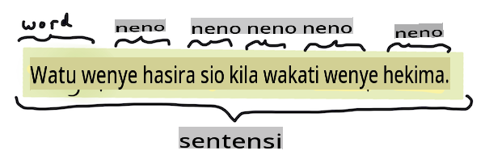
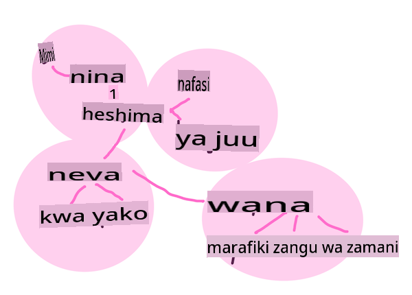

# Kazi na Mbinu za Kawaida za Usindikaji Lugha Asilia

Kwa kazi nyingi za *usindikaji lugha asilia*, maandishi yanayopaswa kushughulikiwa lazima yavunjwe, yakaguliwe, na matokeo yake yahifadhiwe au yarejelewe na sheria na seti za data. Kazi hizi, zinamruhusu mpangaji kupata _maana_ au _nia_ au tu _mara kwa mara_ ya maneno na maneno katika maandishi.

## [Maswali ya awali ya mihadhara](https://gray-sand-07a10f403.1.azurestaticapps.net/quiz/33/)

Hebu tujifunze mbinu za kawaida zinazotumika katika usindikaji wa maandishi. Pamoja na kujifunza kwa mashine, mbinu hizi zinakusaidia kuchambua kiasi kikubwa cha maandishi kwa ufanisi. Kabla ya kutumia ML kwa kazi hizi, hata hivyo, hebu tuangalie matatizo yanayokutana na mtaalamu wa NLP.

## Kazi za kawaida za NLP

Kuna njia tofauti za kuchambua maandishi unayofanyia kazi. Kuna kazi ambazo unaweza kufanya na kupitia kazi hizi unaweza kuelewa maandishi na kutoa hitimisho. Kawaida unafanya kazi hizi kwa mpangilio.

### Utoaji wa Tokeni

Labda jambo la kwanza ambalo algorithimu nyingi za NLP zinahitaji kufanya ni kugawanya maandishi kuwa tokeni, au maneno. Ingawa hili linaweza kuonekana rahisi, kuzingatia alama za uakifishaji na mipaka ya maneno na sentensi za lugha tofauti kunaweza kufanya iwe ngumu. Unaweza kulazimika kutumia mbinu mbalimbali kubaini mipaka.


> Kugawanya sentensi kutoka **Pride and Prejudice**. Picha na [Jen Looper](https://twitter.com/jenlooper)

### Utoaji wa Embeddings

[Embeddings za maneno](https://wikipedia.org/wiki/Word_embedding) ni njia ya kubadilisha data yako ya maandishi kwa njia ya nambari. Embeddings hufanywa kwa njia ambayo maneno yenye maana sawa au maneno yanayotumika pamoja yanajikusanya pamoja.


> "Nawaheshimu sana mishipa yako, wao ni marafiki zangu wa zamani." - Embeddings za maneno kwa sentensi katika **Pride and Prejudice**. Picha na [Jen Looper](https://twitter.com/jenlooper)

✅ Jaribu [chombo hiki cha kuvutia](https://projector.tensorflow.org/) kujaribu embeddings za maneno. Kubofya neno moja inaonyesha makundi ya maneno yanayofanana: 'toy' inakusanyika na 'disney', 'lego', 'playstation', na 'console'.

### Uchanganuzi & Uwekaji wa Sehemu za Hotuba

Kila neno ambalo limegawanywa linaweza kuwekwa alama kama sehemu ya hotuba - nomino, kitenzi, au kivumishi. Sentensi `the quick red fox jumped over the lazy brown dog` inaweza kuwekwa alama za POS kama fox = nomino, jumped = kitenzi.


> Kuchanganua sentensi kutoka **Pride and Prejudice**. Picha na [Jen Looper](https://twitter.com/jenlooper)

Uchanganuzi ni kutambua maneno yanayohusiana katika sentensi - kwa mfano `the quick red fox jumped` ni mlolongo wa kivumishi-nomino-kitenzi ambao ni tofauti na mlolongo wa `lazy brown dog`.  

### Mara kwa Mara ya Maneno na Misemo

Utaratibu muhimu wakati wa kuchambua mwili mkubwa wa maandishi ni kujenga kamusi ya kila neno au msemo wa kuvutia na jinsi inavyoonekana mara kwa mara. Msemo `the quick red fox jumped over the lazy brown dog` una mara mbili ya neno the.

Hebu tuangalie mfano wa maandishi ambapo tunahesabu mara kwa mara ya maneno. Shairi la Rudyard Kipling "The Winners" lina beti ifuatayo:

```output
What the moral? Who rides may read.
When the night is thick and the tracks are blind
A friend at a pinch is a friend, indeed,
But a fool to wait for the laggard behind.
Down to Gehenna or up to the Throne,
He travels the fastest who travels alone.
```

Kama mara kwa mara ya misemo inaweza kuwa isiyo na hisia za herufi kubwa au ndogo kama inavyohitajika, msemo `a friend` has a frequency of 2 and `the` has a frequency of 6, and `travels` ni 2.

### N-grams

Maandishi yanaweza kugawanywa katika mfuatano wa maneno ya urefu uliowekwa, neno moja (unigram), maneno mawili (bigrams), maneno matatu (trigrams) au idadi yoyote ya maneno (n-grams).

Kwa mfano `the quick red fox jumped over the lazy brown dog` na alama ya n-gram ya 2 inazalisha n-grams zifuatazo:

1. the quick 
2. quick red 
3. red fox
4. fox jumped 
5. jumped over 
6. over the 
7. the lazy 
8. lazy brown 
9. brown dog

Inaweza kuwa rahisi kuona kama sanduku la kuteleza juu ya sentensi. Hapa kuna n-grams za maneno 3, n-gram iko kwa herufi nzito katika kila sentensi:

1.   <u>**the quick red**</u> fox jumped over the lazy brown dog
2.   the **<u>quick red fox</u>** jumped over the lazy brown dog
3.   the quick **<u>red fox jumped</u>** over the lazy brown dog
4.   the quick red **<u>fox jumped over</u>** the lazy brown dog
5.   the quick red fox **<u>jumped over the</u>** lazy brown dog
6.   the quick red fox jumped **<u>over the lazy</u>** brown dog
7.   the quick red fox jumped over <u>**the lazy brown**</u> dog
8.   the quick red fox jumped over the **<u>lazy brown dog</u>**


> Thamani ya N-gram ya 3: Picha na [Jen Looper](https://twitter.com/jenlooper)

### Utoaji wa Misemo ya Nomino

Katika sentensi nyingi, kuna nomino ambayo ni mhusika, au kitu cha sentensi. Katika Kiingereza, mara nyingi inatambulika kwa kuwa na 'a' au 'an' au 'the' kabla yake. Kutambua mhusika au kitu cha sentensi kwa 'kutoa msemo wa nomino' ni kazi ya kawaida katika NLP wakati wa kujaribu kuelewa maana ya sentensi.

✅ Katika sentensi "Siwezi kuweka saa, au sehemu, au muonekano au maneno, ambayo yaliweka msingi. Ni muda mrefu sana uliopita. Nilikuwa katikati kabla sijajua kuwa nilianza.", unaweza kutambua misemo ya nomino?

Katika sentensi `the quick red fox jumped over the lazy brown dog` kuna misemo 2 ya nomino: **quick red fox** na **lazy brown dog**.

### Uchanganuzi wa Hisia

Sentensi au maandishi yanaweza kuchambuliwa kwa hisia, au jinsi *chanya* au *hasi* ilivyo. Hisia hupimwa kwa *polarity* na *objectivity/subjectivity*. Polarity hupimwa kutoka -1.0 hadi 1.0 (hasi hadi chanya) na 0.0 hadi 1.0 (isiyo na upande hadi yenye upande zaidi).

✅ Baadaye utajifunza kuwa kuna njia tofauti za kuamua hisia kwa kutumia kujifunza kwa mashine, lakini njia moja ni kuwa na orodha ya maneno na misemo ambayo imewekwa kama chanya au hasi na mtaalamu wa binadamu na kutumia mfano huo kwa maandishi ili kuhesabu alama ya polarity. Unaweza kuona jinsi hii ingeweza kufanya kazi katika hali zingine na chini katika zingine?

### Ubadilishaji

Ubadilishaji unakuwezesha kuchukua neno na kupata umoja au wingi wa neno hilo.

### Lemmatization

*Lemma* ni mzizi au neno kuu kwa seti ya maneno, kwa mfano *flew*, *flies*, *flying* yana lemma ya kitenzi *fly*.

Kuna pia hifadhidata muhimu zinazopatikana kwa mtafiti wa NLP, haswa:

### WordNet

[WordNet](https://wordnet.princeton.edu/) ni hifadhidata ya maneno, visawe, kinyume na maelezo mengine mengi kwa kila neno katika lugha nyingi tofauti. Ni muhimu sana wakati wa kujaribu kujenga tafsiri, ukaguzi wa tahajia, au zana za lugha za aina yoyote.

## Maktaba za NLP

Kwa bahati nzuri, huhitaji kujenga mbinu hizi zote wewe mwenyewe, kwani kuna maktaba bora za Python zinazopatikana ambazo zinaifanya iwe rahisi zaidi kwa waendelezaji ambao hawajabobea katika usindikaji lugha asilia au kujifunza kwa mashine. Masomo yanayofuata yanajumuisha mifano zaidi ya hizi, lakini hapa utajifunza mifano muhimu kukusaidia na kazi inayofuata.

### Zoezi - kutumia `TextBlob` library

Let's use a library called TextBlob as it contains helpful APIs for tackling these types of tasks. TextBlob "stands on the giant shoulders of [NLTK](https://nltk.org) and [pattern](https://github.com/clips/pattern), and plays nicely with both." It has a considerable amount of ML embedded in its API.

> Note: A useful [Quick Start](https://textblob.readthedocs.io/en/dev/quickstart.html#quickstart) guide is available for TextBlob that is recommended for experienced Python developers 

When attempting to identify *noun phrases*, TextBlob offers several options of extractors to find noun phrases. 

1. Take a look at `ConllExtractor`.

    ```python
    from textblob import TextBlob
    from textblob.np_extractors import ConllExtractor
    # import and create a Conll extractor to use later 
    extractor = ConllExtractor()
    
    # later when you need a noun phrase extractor:
    user_input = input("> ")
    user_input_blob = TextBlob(user_input, np_extractor=extractor)  # note non-default extractor specified
    np = user_input_blob.noun_phrases                                    
    ```

    > Nini kinaendelea hapa? [ConllExtractor](https://textblob.readthedocs.io/en/dev/api_reference.html?highlight=Conll#textblob.en.np_extractors.ConllExtractor) ni "Kitoa misemo ya nomino kinachotumia uchanganuzi wa vipande vilivyofunzwa na korpasi ya mafunzo ya ConLL-2000." ConLL-2000 inarejelea Mkutano wa 2000 wa Kujifunza Lugha Asilia kwa Njia ya Kompyuta. Kila mwaka mkutano huo ulifanyika warsha ya kushughulikia tatizo gumu la NLP, na mnamo 2000 ilikuwa ni kuchanganua misemo ya nomino. Mfano ulifunzwa kwenye Wall Street Journal, na "sehemu 15-18 kama data ya mafunzo (tokeni 211727) na sehemu 20 kama data ya majaribio (tokeni 47377)". Unaweza kuangalia taratibu zilizotumika [hapa](https://www.clips.uantwerpen.be/conll2000/chunking/) na [matokeo](https://ifarm.nl/erikt/research/np-chunking.html).

### Changamoto - kuboresha bot yako kwa NLP

Katika somo lililopita ulijenga bot rahisi sana ya Q&A. Sasa, utamfanya Marvin kuwa na huruma kidogo kwa kuchambua maingizo yako kwa hisia na kuchapisha jibu linalolingana na hisia. Pia utahitaji kutambua `noun_phrase` na kuuliza kuhusu hilo.

Hatua zako wakati wa kujenga bot bora ya mazungumzo:

1. Chapisha maelekezo yanayoshauri mtumiaji jinsi ya kuwasiliana na bot
2. Anza kitanzi 
   1. Kubali maingizo ya mtumiaji
   2. Ikiwa mtumiaji ameomba kutoka, basi toka
   3. Shughulikia maingizo ya mtumiaji na kubaini jibu linalofaa la hisia
   4. Ikiwa msemo wa nomino umetambuliwa katika hisia, fanya wingi wake na uliza maingizo zaidi juu ya mada hiyo
   5. Chapisha jibu
3. Rudi kwenye hatua ya 2

Hapa kuna kipande cha msimbo wa kubaini hisia kwa kutumia TextBlob. Kumbuka kuna *mwelekeo* nne tu za jibu la hisia (unaweza kuwa na zaidi ikiwa unapenda):

```python
if user_input_blob.polarity <= -0.5:
  response = "Oh dear, that sounds bad. "
elif user_input_blob.polarity <= 0:
  response = "Hmm, that's not great. "
elif user_input_blob.polarity <= 0.5:
  response = "Well, that sounds positive. "
elif user_input_blob.polarity <= 1:
  response = "Wow, that sounds great. "
```

Hapa kuna matokeo ya sampuli kukuelekeza (maingizo ya mtumiaji yako kwenye mistari iliyoanza na >):

```output
Hello, I am Marvin, the friendly robot.
You can end this conversation at any time by typing 'bye'
After typing each answer, press 'enter'
How are you today?
> I am ok
Well, that sounds positive. Can you tell me more?
> I went for a walk and saw a lovely cat
Well, that sounds positive. Can you tell me more about lovely cats?
> cats are the best. But I also have a cool dog
Wow, that sounds great. Can you tell me more about cool dogs?
> I have an old hounddog but he is sick
Hmm, that's not great. Can you tell me more about old hounddogs?
> bye
It was nice talking to you, goodbye!
```

Suluhisho moja linalowezekana kwa kazi hiyo liko [hapa](https://github.com/microsoft/ML-For-Beginners/blob/main/6-NLP/2-Tasks/solution/bot.py)

✅ Uhakiki wa Maarifa

1. Je, unadhani majibu ya huruma yangeweza 'kumdanganya' mtu kufikiria kuwa bot kweli inaelewa?
2. Je, kutambua msemo wa nomino kunafanya bot iwe ya 'kuaminika' zaidi?
3. Kwa nini kutoa 'msemo wa nomino' kutoka kwa sentensi ni jambo muhimu kufanya?

---

Tekeleza bot katika uhakiki wa maarifa wa awali na ujaribu kwa rafiki. Je, inaweza kumdanganya? Je, unaweza kufanya bot yako iwe ya 'kuaminika' zaidi?

## 🚀Changamoto

Chukua kazi katika uhakiki wa maarifa wa awali na ujaribu kuitekeleza. Jaribu bot kwa rafiki. Je, inaweza kumdanganya? Je, unaweza kufanya bot yako iwe ya 'kuaminika' zaidi?

## [Maswali ya baada ya mihadhara](https://gray-sand-07a10f403.1.azurestaticapps.net/quiz/34/)

## Mapitio & Kujisomea

Katika masomo machache yajayo utajifunza zaidi kuhusu uchanganuzi wa hisia. Tafiti mbinu hii ya kuvutia katika makala kama hizi kwenye [KDNuggets](https://www.kdnuggets.com/tag/nlp)

## Kazi

[Fanya bot izungumze](assignment.md)

**Kanusho**:
Hati hii imetafsiriwa kwa kutumia huduma za tafsiri za AI zinazotumia mashine. Ingawa tunajitahidi kwa usahihi, tafadhali fahamu kuwa tafsiri za kiotomatiki zinaweza kuwa na makosa au kutokuwa sahihi. Hati ya asili katika lugha yake ya kiasili inapaswa kuzingatiwa kama chanzo chenye mamlaka. Kwa habari muhimu, inashauriwa kupata tafsiri ya kibinadamu ya kitaalamu. Hatutawajibika kwa kutoelewana au tafsiri potofu zinazotokana na matumizi ya tafsiri hii.