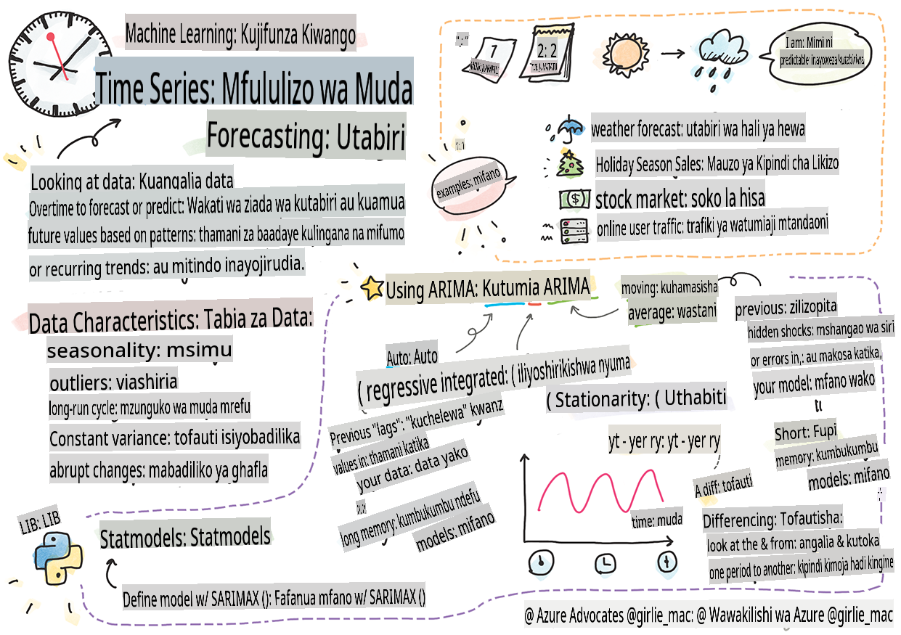
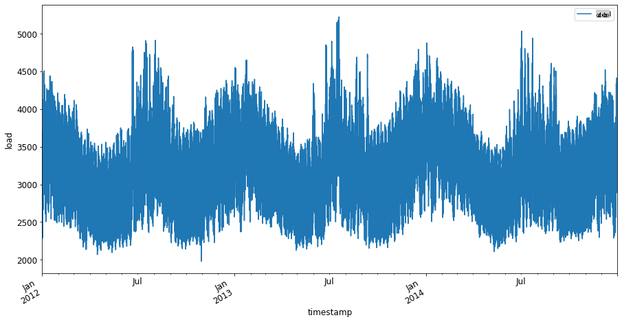

# Utangulizi wa utabiri wa mfululizo wa muda



> Sketchnote na [Tomomi Imura](https://www.twitter.com/girlie_mac)

Katika somo hili na lile linalofuata, utajifunza kidogo kuhusu utabiri wa mfululizo wa muda, sehemu ya kuvutia na yenye thamani katika zana za mwanasayansi wa ML ambayo haijulikani sana kuliko mada zingine. Utabiri wa mfululizo wa muda ni kama 'mpira wa kioo': kwa msingi wa utendaji wa zamani wa kigezo kama bei, unaweza kutabiri thamani yake ya baadaye.

[](https://youtu.be/cBojo1hsHiI "Utangulizi wa utabiri wa mfululizo wa muda")

> 🎥 Bofya picha hapo juu kwa video kuhusu utabiri wa mfululizo wa muda

## [Maswali ya awali ya somo](https://gray-sand-07a10f403.1.azurestaticapps.net/quiz/41/)

Ni uwanja wa kuvutia na muhimu na thamani halisi kwa biashara, kwa kuzingatia matumizi yake ya moja kwa moja katika matatizo ya bei, hesabu, na masuala ya mnyororo wa ugavi. Wakati mbinu za kujifunza kwa kina zimeanza kutumika kupata ufahamu zaidi ili kutabiri utendaji wa baadaye vizuri zaidi, utabiri wa mfululizo wa muda bado ni uwanja unaoongozwa sana na mbinu za kimsingi za ML.

> Mtaala muhimu wa mfululizo wa muda wa Penn State unaweza kupatikana [hapa](https://online.stat.psu.edu/stat510/lesson/1)

## Utangulizi

Fikiria unadumisha safu ya mita za maegesho za kisasa ambazo hutoa data kuhusu mara ngapi zinatumika na kwa muda gani kwa muda.

> Je, ungeweza kutabiri, kwa msingi wa utendaji wa zamani wa mita, thamani yake ya baadaye kulingana na sheria za ugavi na mahitaji?

Kutabiri kwa usahihi wakati wa kuchukua hatua ili kufikia lengo lako ni changamoto ambayo inaweza kushughulikiwa na utabiri wa mfululizo wa muda. Haita wafurahisha watu kutozwa zaidi wakati wa shughuli nyingi wanapotafuta nafasi ya maegesho, lakini itakuwa njia ya uhakika ya kuzalisha mapato kwa kusafisha barabara!

Wacha tuchunguze baadhi ya aina za algoriti za mfululizo wa muda na kuanzisha daftari ili kusafisha na kuandaa data. Data utakayochambua imetolewa kutoka kwa mashindano ya utabiri ya GEFCom2014. Inajumuisha miaka 3 ya mzigo wa umeme wa kila saa na thamani za joto kati ya 2012 na 2014. Kwa kuzingatia mifumo ya kihistoria ya mzigo wa umeme na joto, unaweza kutabiri thamani za baadaye za mzigo wa umeme.

Katika mfano huu, utajifunza jinsi ya kutabiri hatua moja mbele ya wakati, kwa kutumia data ya mzigo wa kihistoria tu. Kabla ya kuanza, hata hivyo, ni muhimu kuelewa kinachoendelea nyuma ya pazia.

## Baadhi ya ufafanuzi

Unapokutana na neno 'mfululizo wa muda' unahitaji kuelewa matumizi yake katika muktadha tofauti.

🎓 **Mfululizo wa muda**

Katika hisabati, "mfululizo wa muda ni mfululizo wa alama za data zilizoorodheshwa (au zilizoorodheshwa au kuchorwa) kwa mpangilio wa wakati. Mara nyingi, mfululizo wa muda ni mlolongo uliotolewa kwa pointi za wakati zilizo na nafasi sawa." Mfano wa mfululizo wa muda ni thamani ya kufunga kila siku ya [Dow Jones Industrial Average](https://wikipedia.org/wiki/Time_series). Matumizi ya michoro ya mfululizo wa muda na modeli za takwimu mara nyingi hukutana katika usindikaji wa ishara, utabiri wa hali ya hewa, utabiri wa matetemeko ya ardhi, na nyanja zingine ambapo matukio hutokea na alama za data zinaweza kuchorwa kwa muda.

🎓 **Uchambuzi wa mfululizo wa muda**

Uchambuzi wa mfululizo wa muda, ni uchambuzi wa data ya mfululizo wa muda iliyotajwa hapo juu. Data ya mfululizo wa muda inaweza kuchukua aina tofauti, ikiwa ni pamoja na 'mfululizo wa muda uliokatizwa' ambao hugundua mifumo katika mabadiliko ya mfululizo wa muda kabla na baada ya tukio linalokatiza. Aina ya uchambuzi inayohitajika kwa mfululizo wa muda, inategemea asili ya data. Data ya mfululizo wa muda yenyewe inaweza kuchukua fomu ya mfululizo wa nambari au herufi.

Uchambuzi unaofanywa, hutumia mbinu mbalimbali, ikiwa ni pamoja na uwanja wa masafa na uwanja wa wakati, linear na nonlinear, na zaidi. [Jifunze zaidi](https://www.itl.nist.gov/div898/handbook/pmc/section4/pmc4.htm) kuhusu njia nyingi za kuchambua aina hii ya data.

🎓 **Utabiri wa mfululizo wa muda**

Utabiri wa mfululizo wa muda ni matumizi ya modeli kutabiri thamani za baadaye kwa msingi wa mifumo iliyojitokeza na data iliyokusanywa hapo awali kama ilivyotokea zamani. Ingawa inawezekana kutumia modeli za regression kuchunguza data ya mfululizo wa muda, na faharasa za wakati kama x kwenye mchoro, data kama hiyo inachambuliwa vizuri zaidi kwa kutumia aina maalum za modeli.

Data ya mfululizo wa muda ni orodha ya uchunguzi ulioamriwa, tofauti na data inayoweza kuchambuliwa na regression ya mstari.   Moja ya kawaida ni ARIMA, kifupi cha "Autoregressive Integrated Moving Average".

[Modeli za ARIMA](https://online.stat.psu.edu/stat510/lesson/1/1.1) "zinahusisha thamani ya sasa ya mfululizo na thamani za zamani na makosa ya utabiri ya zamani." Zinahitajika zaidi kwa kuchambua data ya uwanja wa wakati, ambapo data imepangwa kwa wakati.

> Kuna aina kadhaa za modeli za ARIMA, ambazo unaweza kujifunza kuhusu [hapa](https://people.duke.edu/~rnau/411arim.htm) na ambazo utazigusia katika somo lijalo.

Katika somo lijalo, utajenga modeli ya ARIMA kwa kutumia [Univariate Time Series](https://itl.nist.gov/div898/handbook/pmc/section4/pmc44.htm), inayozingatia kigezo kimoja kinachobadilisha thamani yake kwa muda. Mfano wa aina hii ya data ni [seti hii ya data](https://itl.nist.gov/div898/handbook/pmc/section4/pmc4411.htm) inayorekodi mkusanyiko wa C02 wa kila mwezi katika Kituo cha Mauna Loa:

|  CO2   | YearMonth | Year  | Month |
| :----: | :-------: | :---: | :---: |
| 330.62 |  1975.04  | 1975  |   1   |
| 331.40 |  1975.13  | 1975  |   2   |
| 331.87 |  1975.21  | 1975  |   3   |
| 333.18 |  1975.29  | 1975  |   4   |
| 333.92 |  1975.38  | 1975  |   5   |
| 333.43 |  1975.46  | 1975  |   6   |
| 331.85 |  1975.54  | 1975  |   7   |
| 330.01 |  1975.63  | 1975  |   8   |
| 328.51 |  1975.71  | 1975  |   9   |
| 328.41 |  1975.79  | 1975  |  10   |
| 329.25 |  1975.88  | 1975  |  11   |
| 330.97 |  1975.96  | 1975  |  12   |

✅ Tambua kigezo kinachobadilika kwa muda katika seti hii ya data

## Tabia za data ya mfululizo wa muda za kuzingatia

Unapotazama data ya mfululizo wa muda, unaweza kugundua kuwa ina [tabia fulani](https://online.stat.psu.edu/stat510/lesson/1/1.1) ambazo unahitaji kuzingatia na kupunguza ili kuelewa mifumo yake vizuri. Ukizingatia data ya mfululizo wa muda kama inayoweza kutoa 'ishara' unayotaka kuchambua, tabia hizi zinaweza kufikiriwa kama 'kelele'. Mara nyingi utahitaji kupunguza 'kelele' hii kwa kupunguza baadhi ya tabia hizi kwa kutumia mbinu za takwimu.

Hapa kuna dhana unazopaswa kujua ili kuweza kufanya kazi na mfululizo wa muda:

🎓 **Mwenendo**

Mwenendo unafafanuliwa kama ongezeko na upunguzaji unaoweza kupimika kwa muda. [Soma zaidi](https://machinelearningmastery.com/time-series-trends-in-python). Katika muktadha wa mfululizo wa muda, ni kuhusu jinsi ya kutumia na, ikiwa ni lazima, kuondoa mwenendo kutoka kwa mfululizo wako wa muda.

🎓 **[Msimu](https://machinelearningmastery.com/time-series-seasonality-with-python/)**

Msimu unafafanuliwa kama mabadiliko ya mara kwa mara, kama vile msimu wa sikukuu ambao unaweza kuathiri mauzo, kwa mfano. [Angalia](https://itl.nist.gov/div898/handbook/pmc/section4/pmc443.htm) jinsi aina tofauti za michoro zinavyoonyesha msimu katika data.

🎓 **Data zilizotengwa**

Data zilizotengwa ni zile ambazo ziko mbali sana na tofauti ya kawaida ya data.

🎓 **Mzunguko wa muda mrefu**

Huru na msimu, data inaweza kuonyesha mzunguko wa muda mrefu kama vile kushuka kwa uchumi kunakodumu zaidi ya mwaka mmoja.

🎓 **Tofauti ya mara kwa mara**

Kwa muda, baadhi ya data huonyesha mabadiliko ya mara kwa mara, kama vile matumizi ya nishati kwa mchana na usiku.

🎓 **Mabadiliko ya ghafla**

Data inaweza kuonyesha mabadiliko ya ghafla ambayo yanaweza kuhitaji uchambuzi zaidi. Kufungwa kwa biashara ghafla kutokana na COVID, kwa mfano, kulisababisha mabadiliko katika data.

✅ Hapa kuna [mfano wa mchoro wa mfululizo wa muda](https://www.kaggle.com/kashnitsky/topic-9-part-1-time-series-analysis-in-python) unaoonyesha matumizi ya sarafu ya ndani ya mchezo kwa siku kadhaa. Je, unaweza kutambua yoyote ya tabia zilizoorodheshwa hapo juu katika data hii?


## Zoezi - kuanza na data ya matumizi ya nguvu

Wacha tuanze kuunda modeli ya mfululizo wa muda ili kutabiri matumizi ya nguvu ya baadaye kwa kuzingatia matumizi ya zamani.

> Data katika mfano huu imetolewa kutoka kwa mashindano ya utabiri ya GEFCom2014. Inajumuisha miaka 3 ya mzigo wa umeme wa kila saa na thamani za joto kati ya 2012 na 2014.
>
> Tao Hong, Pierre Pinson, Shu Fan, Hamidreza Zareipour, Alberto Troccoli na Rob J. Hyndman, "Utabiri wa nishati ya uwezekano: Mashindano ya Utabiri wa Nishati ya Kimataifa 2014 na zaidi", Jarida la Kimataifa la Utabiri, vol.32, no.3, pp 896-913, Julai-Septemba, 2016.

1. Katika folda ya `working` ya somo hili, fungua faili ya _notebook.ipynb_. Anza kwa kuongeza maktaba zitakazokusaidia kupakia na kuona data

    ```python
    import os
    import matplotlib.pyplot as plt
    from common.utils import load_data
    %matplotlib inline
    ```

    Kumbuka, unatumia faili kutoka `common` folder which set up your environment and handle downloading the data.

2. Next, examine the data as a dataframe calling `load_data()` and `head()`:

    ```python
    data_dir = './data'
    energy = load_data(data_dir)[['load']]
    energy.head()
    ```

    Unaweza kuona kwamba kuna safu mbili zinazoonyesha tarehe na mzigo:

    |                     |  load  |
    | :-----------------: | :----: |
    | 2012-01-01 00:00:00 | 2698.0 |
    | 2012-01-01 01:00:00 | 2558.0 |
    | 2012-01-01 02:00:00 | 2444.0 |
    | 2012-01-01 03:00:00 | 2402.0 |
    | 2012-01-01 04:00:00 | 2403.0 |

3. Sasa, chora data kwa kuita `plot()`:

    ```python
    energy.plot(y='load', subplots=True, figsize=(15, 8), fontsize=12)
    plt.xlabel('timestamp', fontsize=12)
    plt.ylabel('load', fontsize=12)
    plt.show()
    ```

    

4. Sasa, chora wiki ya kwanza ya Julai 2014, kwa kutoa kama ingizo kwa `energy` in `[from date]: [to date]`:

    ```python
    energy['2014-07-01':'2014-07-07'].plot(y='load', subplots=True, figsize=(15, 8), fontsize=12)
    plt.xlabel('timestamp', fontsize=12)
    plt.ylabel('load', fontsize=12)
    plt.show()
    ```

    

    Mchoro mzuri! Tazama michoro hii na uone kama unaweza kubaini yoyote ya tabia zilizoorodheshwa hapo juu. Tunaweza kusema nini kwa kuona data?

Katika somo lijalo, utaunda modeli ya ARIMA ili kuunda baadhi ya utabiri.

---

## 🚀Changamoto

Fanya orodha ya viwanda na maeneo ya uchunguzi unayoweza kufikiria ambayo yangefaidika na utabiri wa mfululizo wa muda. Je, unaweza kufikiria matumizi ya mbinu hizi katika sanaa? Katika Uchumi? Ekolojia? Rejareja? Viwanda? Fedha? Wapi pengine?

## [Maswali ya baada ya somo](https://gray-sand-07a10f403.1.azurestaticapps.net/quiz/42/)

## Mapitio & Kujisomea

Ingawa hatutayafunika hapa, mitandao ya neva wakati mwingine hutumika kuimarisha mbinu za kimsingi za utabiri wa mfululizo wa muda. Soma zaidi kuhusu hilo [katika makala hii](https://medium.com/microsoftazure/neural-networks-for-forecasting-financial-and-economic-time-series-6aca370ff412)

## Kazi

[Onyesha zaidi mfululizo wa muda](assignment.md)

**Kanusho**:
Hati hii imetafsiriwa kwa kutumia huduma za tafsiri za AI zinazotumia mashine. Ingawa tunajitahidi kwa usahihi, tafadhali fahamu kuwa tafsiri za kiotomatiki zinaweza kuwa na makosa au kutokuwa sahihi. Hati asilia katika lugha yake ya awali inapaswa kuzingatiwa kama chanzo kikuu. Kwa taarifa muhimu, tafsiri ya kitaalamu ya kibinadamu inapendekezwa. Hatutawajibika kwa kutoelewana au tafsiri zisizo sahihi zinazotokana na matumizi ya tafsiri hii.