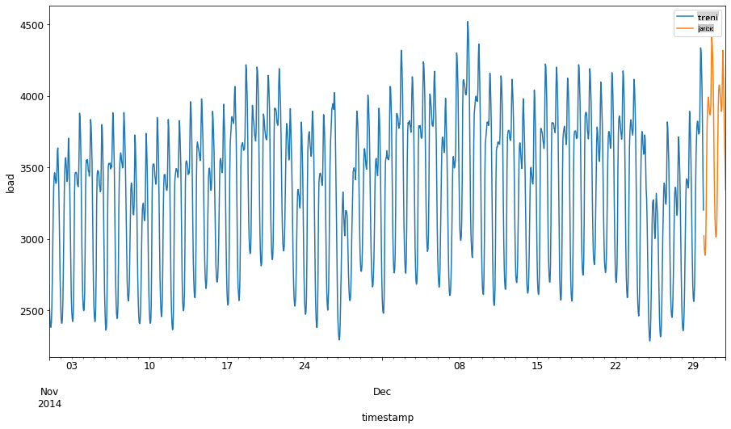
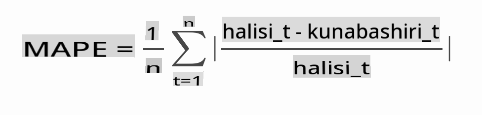

# Utabiri wa mfululizo wa muda na ARIMA

Katika somo lililopita, ulijifunza kidogo kuhusu utabiri wa mfululizo wa muda na kupakia seti ya data inayoonyesha mabadiliko ya mzigo wa umeme kwa kipindi cha muda.

[](https://youtu.be/IUSk-YDau10 "Utangulizi wa ARIMA")

> 🎥 Bofya picha hapo juu kwa video: Utangulizi mfupi wa mifano ya ARIMA. Mfano umefanywa kwa R, lakini dhana ni za ulimwengu wote.

## [Jaribio la kabla ya somo](https://gray-sand-07a10f403.1.azurestaticapps.net/quiz/43/)

## Utangulizi

Katika somo hili, utagundua njia maalum ya kujenga mifano na [ARIMA: *A*uto*R*egressive *I*ntegrated *M*oving *A*verage](https://wikipedia.org/wiki/Autoregressive_integrated_moving_average). Mifano ya ARIMA inafaa hasa kwa data inayoonyesha [kutokuwa na msimamo](https://wikipedia.org/wiki/Stationary_process).

## Dhana za jumla

Ili kuweza kufanya kazi na ARIMA, kuna dhana kadhaa unazohitaji kujua:

- 🎓 **Ukimya**. Kutoka muktadha wa takwimu, ukimya unahusu data ambayo usambazaji wake haukabadilika inapohamishwa kwa muda. Data isiyo na ukimya, basi, inaonyesha mabadiliko kutokana na mwenendo ambao lazima ubadilishwe ili kuchambuliwa. Msimu, kwa mfano, unaweza kuanzisha mabadiliko katika data na inaweza kuondolewa kwa mchakato wa 'seasonal-differencing'.

- 🎓 **[Kutoa tofauti](https://wikipedia.org/wiki/Autoregressive_integrated_moving_average#Differencing)**. Kutoa tofauti data, tena kutoka muktadha wa takwimu, inahusu mchakato wa kubadilisha data isiyo na ukimya ili kuifanya kuwa na ukimya kwa kuondoa mwenendo wake usiokuwa na msimamo. "Kutoa tofauti kunatoa mabadiliko katika kiwango cha mfululizo wa muda, kuondoa mwenendo na msimu na hivyo kuleta usawa wa wastani wa mfululizo wa muda." [Karatasi ya Shixiong et al](https://arxiv.org/abs/1904.07632)

## ARIMA katika muktadha wa mfululizo wa muda

Hebu tuvunje sehemu za ARIMA ili kuelewa vyema jinsi inavyotusaidia kuunda mifano ya mfululizo wa muda na kutusaidia kufanya utabiri dhidi yake.

- **AR - kwa AutoRegressive**. Mifano ya autoregressive, kama jina linavyopendekeza, huangalia 'nyuma' kwa wakati kuchambua thamani za awali katika data yako na kufanya mawazo juu yao. Thamani hizi za awali huitwa 'lags'. Mfano ungekuwa data inayoonyesha mauzo ya kila mwezi ya penseli. Kila jumla ya mauzo ya mwezi ingechukuliwa kama 'kigezo kinachoendelea' katika seti ya data. Mfano huu umejengwa kama "kigezo kinachoendelea cha maslahi kinatabiriwa kwa thamani zake za nyuma (yaani, za awali)." [wikipedia](https://wikipedia.org/wiki/Autoregressive_integrated_moving_average)

- **I - kwa Integrated**. Tofauti na mifano ya 'ARMA', 'I' katika ARIMA inahusu kipengele chake cha *[integrated](https://wikipedia.org/wiki/Order_of_integration)*. Data inakuwa 'integrated' wakati hatua za kutoa tofauti zinapotumika ili kuondoa kutokuwa na ukimya.

- **MA - kwa Moving Average**. Kipengele cha [moving-average](https://wikipedia.org/wiki/Moving-average_model) cha mfano huu kinahusu kigezo cha pato kinachobainishwa kwa kuchunguza thamani za sasa na za awali za lags.

Bottom line: ARIMA inatumika kufanya mfano uendane na aina maalum ya data ya mfululizo wa muda kwa karibu iwezekanavyo.

## Zoezi - kujenga mfano wa ARIMA

Fungua folda ya [_/working_](https://github.com/microsoft/ML-For-Beginners/tree/main/7-TimeSeries/2-ARIMA/working) katika somo hili na upate faili ya [_notebook.ipynb_](https://github.com/microsoft/ML-For-Beginners/blob/main/7-TimeSeries/2-ARIMA/working/notebook.ipynb).

1. Endesha notebook kupakia maktaba ya `statsmodels` ya Python; utahitaji hii kwa mifano ya ARIMA.

1. Pakia maktaba muhimu

1. Sasa, pakia maktaba zaidi zinazofaa kwa kuchora data:

    ```python
    import os
    import warnings
    import matplotlib.pyplot as plt
    import numpy as np
    import pandas as pd
    import datetime as dt
    import math

    from pandas.plotting import autocorrelation_plot
    from statsmodels.tsa.statespace.sarimax import SARIMAX
    from sklearn.preprocessing import MinMaxScaler
    from common.utils import load_data, mape
    from IPython.display import Image

    %matplotlib inline
    pd.options.display.float_format = '{:,.2f}'.format
    np.set_printoptions(precision=2)
    warnings.filterwarnings("ignore") # specify to ignore warning messages
    ```

1. Pakia data kutoka faili la `/data/energy.csv` ndani ya dataframe ya Pandas na uangalie:

    ```python
    energy = load_data('./data')[['load']]
    energy.head(10)
    ```

1. Chora data yote ya nishati inayopatikana kutoka Januari 2012 hadi Desemba 2014. Hakutakuwa na mshangao kwani tuliiona data hii katika somo lililopita:

    ```python
    energy.plot(y='load', subplots=True, figsize=(15, 8), fontsize=12)
    plt.xlabel('timestamp', fontsize=12)
    plt.ylabel('load', fontsize=12)
    plt.show()
    ```

    Sasa, hebu tujenge mfano!

### Unda seti za mafunzo na majaribio

Sasa data yako imepakiwa, unaweza kuigawa katika seti za mafunzo na majaribio. Utafundisha mfano wako kwenye seti ya mafunzo. Kama kawaida, baada ya mfano kumaliza mafunzo, utapima usahihi wake kwa kutumia seti ya majaribio. Unahitaji kuhakikisha kuwa seti ya majaribio inashughulikia kipindi cha baadaye kutoka seti ya mafunzo ili kuhakikisha kuwa mfano haupati taarifa kutoka vipindi vya baadaye.

1. Gawa kipindi cha miezi miwili kutoka Septemba 1 hadi Oktoba 31, 2014 kwa seti ya mafunzo. Seti ya majaribio itajumuisha kipindi cha miezi miwili cha Novemba 1 hadi Desemba 31, 2014:

    ```python
    train_start_dt = '2014-11-01 00:00:00'
    test_start_dt = '2014-12-30 00:00:00'
    ```

    Kwa kuwa data hii inaonyesha matumizi ya nishati ya kila siku, kuna muundo wenye nguvu wa msimu, lakini matumizi ni sawa zaidi na matumizi ya siku za hivi karibuni.

1. Onyesha tofauti:

    ```python
    energy[(energy.index < test_start_dt) & (energy.index >= train_start_dt)][['load']].rename(columns={'load':'train'}) \
        .join(energy[test_start_dt:][['load']].rename(columns={'load':'test'}), how='outer') \
        .plot(y=['train', 'test'], figsize=(15, 8), fontsize=12)
    plt.xlabel('timestamp', fontsize=12)
    plt.ylabel('load', fontsize=12)
    plt.show()
    ```

    

    Kwa hiyo, kutumia dirisha ndogo ya muda kwa mafunzo ya data inapaswa kutosha.

    > Note: Kwa kuwa kazi tunayoyotumia kufaa mfano wa ARIMA hutumia uthibitishaji wa ndani-sampuli wakati wa kufaa, tutaacha data ya uthibitishaji.

### Andaa data kwa mafunzo

Sasa, unahitaji kuandaa data kwa mafunzo kwa kufanya uchujaji na kupima data yako. Chuja seti yako ya data ili kujumuisha tu vipindi vya muda vilivyotajwa na safu ambazo unahitaji, na kupima ili kuhakikisha data inatolewa katika kipimo cha 0,1.

1. Chuja seti asili ya data kujumuisha tu vipindi vya muda vilivyotajwa kwa kila seti na kujumuisha tu safu inayohitajika 'mzigo' pamoja na tarehe:

    ```python
    train = energy.copy()[(energy.index >= train_start_dt) & (energy.index < test_start_dt)][['load']]
    test = energy.copy()[energy.index >= test_start_dt][['load']]

    print('Training data shape: ', train.shape)
    print('Test data shape: ', test.shape)
    ```

    Unaweza kuona umbo la data:

    ```output
    Training data shape:  (1416, 1)
    Test data shape:  (48, 1)
    ```

1. Pima data kuwa katika kipimo (0, 1).

    ```python
    scaler = MinMaxScaler()
    train['load'] = scaler.fit_transform(train)
    train.head(10)
    ```

1. Onyesha data asili dhidi ya data iliyopimwa:

    ```python
    energy[(energy.index >= train_start_dt) & (energy.index < test_start_dt)][['load']].rename(columns={'load':'original load'}).plot.hist(bins=100, fontsize=12)
    train.rename(columns={'load':'scaled load'}).plot.hist(bins=100, fontsize=12)
    plt.show()
    ```

    

    > Data asili

    

    > Data iliyopimwa

1. Sasa kwa kuwa umekalibu data iliyopimwa, unaweza kupima data ya majaribio:

    ```python
    test['load'] = scaler.transform(test)
    test.head()
    ```

### Tekeleza ARIMA

Ni wakati wa kutekeleza ARIMA! Sasa utatumia maktaba ya `statsmodels` uliyoisakinisha awali.

Sasa unahitaji kufuata hatua kadhaa

   1. Fafanua mfano kwa kupiga `SARIMAX()` and passing in the model parameters: p, d, and q parameters, and P, D, and Q parameters.
   2. Prepare the model for the training data by calling the fit() function.
   3. Make predictions calling the `forecast()` function and specifying the number of steps (the `horizon`) to forecast.

> 🎓 What are all these parameters for? In an ARIMA model there are 3 parameters that are used to help model the major aspects of a time series: seasonality, trend, and noise. These parameters are:

`p`: the parameter associated with the auto-regressive aspect of the model, which incorporates *past* values.
`d`: the parameter associated with the integrated part of the model, which affects the amount of *differencing* (🎓 remember differencing 👆?) to apply to a time series.
`q`: the parameter associated with the moving-average part of the model.

> Note: If your data has a seasonal aspect - which this one does - , we use a seasonal ARIMA model (SARIMA). In that case you need to use another set of parameters: `P`, `D`, and `Q` which describe the same associations as `p`, `d`, and `q`, lakini zinaendana na vipengele vya msimu wa mfano.

1. Anza kwa kuweka thamani yako ya upeo wa muda. Hebu jaribu masaa 3:

    ```python
    # Specify the number of steps to forecast ahead
    HORIZON = 3
    print('Forecasting horizon:', HORIZON, 'hours')
    ```

    Kuchagua thamani bora kwa vigezo vya mfano wa ARIMA kunaweza kuwa changamoto kwani ni jambo la kibinafsi na linachukua muda. Unaweza kufikiria kutumia maktaba ya `auto_arima()` function from the [`pyramid` library](https://alkaline-ml.com/pmdarima/0.9.0/modules/generated/pyramid.arima.auto_arima.html),

1. Kwa sasa jaribu uteuzi wa mwongozo ili kupata mfano mzuri.

    ```python
    order = (4, 1, 0)
    seasonal_order = (1, 1, 0, 24)

    model = SARIMAX(endog=train, order=order, seasonal_order=seasonal_order)
    results = model.fit()

    print(results.summary())
    ```

    Jedwali la matokeo linachapishwa.

Umejenga mfano wako wa kwanza! Sasa tunahitaji kupata njia ya kuipima.

### Pima mfano wako

Ili kupima mfano wako, unaweza kufanya uthibitishaji wa `walk forward`. Kwa vitendo, mifano ya mfululizo wa muda hufundishwa tena kila wakati data mpya inapopatikana. Hii inaruhusu mfano kufanya utabiri bora kwa kila hatua ya muda.

Kuanzia mwanzo wa mfululizo wa muda kwa kutumia mbinu hii, fundisha mfano kwenye seti ya mafunzo. Kisha fanya utabiri kwenye hatua inayofuata ya muda. Utabiri unakaguliwa dhidi ya thamani inayojulikana. Seti ya mafunzo kisha inapanuliwa kujumuisha thamani inayojulikana na mchakato unarudiwa.

> Note: Unapaswa kuweka dirisha la seti ya mafunzo imara kwa mafunzo bora zaidi ili kwamba kila wakati unapoongeza uchunguzi mpya kwenye seti ya mafunzo, unatoa uchunguzi kutoka mwanzo wa seti.

Mchakato huu hutoa makadirio thabiti zaidi ya jinsi mfano utakavyofanya kazi kwa vitendo. Hata hivyo, inakuja na gharama ya kompyuta ya kuunda mifano mingi sana. Hii inakubalika ikiwa data ni ndogo au ikiwa mfano ni rahisi, lakini inaweza kuwa tatizo kwa kiwango kikubwa.

Uthibitishaji wa walk-forward ni kiwango cha dhahabu cha tathmini ya mifano ya mfululizo wa muda na inapendekezwa kwa miradi yako mwenyewe.

1. Kwanza, unda hatua ya data ya majaribio kwa kila hatua ya HORIZON.

    ```python
    test_shifted = test.copy()

    for t in range(1, HORIZON+1):
        test_shifted['load+'+str(t)] = test_shifted['load'].shift(-t, freq='H')

    test_shifted = test_shifted.dropna(how='any')
    test_shifted.head(5)
    ```

    |            |          | mzigo | mzigo+1 | mzigo+2 |
    | ---------- | -------- | ---- | ------ | ------ |
    | 2014-12-30 | 00:00:00 | 0.33 | 0.29   | 0.27   |
    | 2014-12-30 | 01:00:00 | 0.29 | 0.27   | 0.27   |
    | 2014-12-30 | 02:00:00 | 0.27 | 0.27   | 0.30   |
    | 2014-12-30 | 03:00:00 | 0.27 | 0.30   | 0.41   |
    | 2014-12-30 | 04:00:00 | 0.30 | 0.41   | 0.57   |

    Data inahamishwa kwa usawa kulingana na hatua yake ya upeo wa muda.

1. Fanya utabiri kwenye data yako ya majaribio kwa kutumia mbinu hii ya dirisha linalosonga katika kitanzi cha ukubwa wa urefu wa data ya majaribio:

    ```python
    %%time
    training_window = 720 # dedicate 30 days (720 hours) for training

    train_ts = train['load']
    test_ts = test_shifted

    history = [x for x in train_ts]
    history = history[(-training_window):]

    predictions = list()

    order = (2, 1, 0)
    seasonal_order = (1, 1, 0, 24)

    for t in range(test_ts.shape[0]):
        model = SARIMAX(endog=history, order=order, seasonal_order=seasonal_order)
        model_fit = model.fit()
        yhat = model_fit.forecast(steps = HORIZON)
        predictions.append(yhat)
        obs = list(test_ts.iloc[t])
        # move the training window
        history.append(obs[0])
        history.pop(0)
        print(test_ts.index[t])
        print(t+1, ': predicted =', yhat, 'expected =', obs)
    ```

    Unaweza kuona mafunzo yakitokea:

    ```output
    2014-12-30 00:00:00
    1 : predicted = [0.32 0.29 0.28] expected = [0.32945389435989236, 0.2900626678603402, 0.2739480752014323]

    2014-12-30 01:00:00
    2 : predicted = [0.3  0.29 0.3 ] expected = [0.2900626678603402, 0.2739480752014323, 0.26812891674127126]

    2014-12-30 02:00:00
    3 : predicted = [0.27 0.28 0.32] expected = [0.2739480752014323, 0.26812891674127126, 0.3025962399283795]
    ```

1. Linganisha utabiri na mzigo halisi:

    ```python
    eval_df = pd.DataFrame(predictions, columns=['t+'+str(t) for t in range(1, HORIZON+1)])
    eval_df['timestamp'] = test.index[0:len(test.index)-HORIZON+1]
    eval_df = pd.melt(eval_df, id_vars='timestamp', value_name='prediction', var_name='h')
    eval_df['actual'] = np.array(np.transpose(test_ts)).ravel()
    eval_df[['prediction', 'actual']] = scaler.inverse_transform(eval_df[['prediction', 'actual']])
    eval_df.head()
    ```

    Matokeo
    |     |            | timestamp | h   | utabiri | halisi   |
    | --- | ---------- | --------- | --- | ---------- | -------- |
    | 0   | 2014-12-30 | 00:00:00  | t+1 | 3,008.74   | 3,023.00 |
    | 1   | 2014-12-30 | 01:00:00  | t+1 | 2,955.53   | 2,935.00 |
    | 2   | 2014-12-30 | 02:00:00  | t+1 | 2,900.17   | 2,899.00 |
    | 3   | 2014-12-30 | 03:00:00  | t+1 | 2,917.69   | 2,886.00 |
    | 4   | 2014-12-30 | 04:00:00  | t+1 | 2,946.99   | 2,963.00 |


    Angalia utabiri wa data ya kila saa, ikilinganishwa na mzigo halisi. Je, ni sahihi kiasi gani?

### Angalia usahihi wa mfano

Angalia usahihi wa mfano wako kwa kupima kosa la asilimia ya wastani wa upungufu (MAPE) juu ya utabiri wote.

> **🧮 Nionyeshe hisabati**
>
> 
>
>  [MAPE](https://www.linkedin.com/pulse/what-mape-mad-msd-time-series-allameh-statistics/) hutumika kuonyesha usahihi wa utabiri kama uwiano unaofafanuliwa na fomula hapo juu. Tofauti kati ya actual<sub>t</sub> na predicted<sub>t</sub> inagawanywa na actual<sub>t</sub>. "Thamani ya absolute katika hesabu hii inajumlishwa kwa kila hatua ya utabiri wa muda na kugawanywa na idadi ya pointi zilizofaa n." [wikipedia](https://wikipedia.org/wiki/Mean_absolute_percentage_error)

1. Eleza equation katika code:

    ```python
    if(HORIZON > 1):
        eval_df['APE'] = (eval_df['prediction'] - eval_df['actual']).abs() / eval_df['actual']
        print(eval_df.groupby('h')['APE'].mean())
    ```

1. Hesabu MAPE ya hatua moja:

    ```python
    print('One step forecast MAPE: ', (mape(eval_df[eval_df['h'] == 't+1']['prediction'], eval_df[eval_df['h'] == 't+1']['actual']))*100, '%')
    ```

    MAPE ya utabiri wa hatua moja:  0.5570581332313952 %

1. Chapisha MAPE ya utabiri wa hatua nyingi:

    ```python
    print('Multi-step forecast MAPE: ', mape(eval_df['prediction'], eval_df['actual'])*100, '%')
    ```

    ```output
    Multi-step forecast MAPE:  1.1460048657704118 %
    ```

    Nambari ya chini ni bora: fikiria kwamba utabiri ambao una MAPE ya 10 ni mbali kwa 10%.

1. Lakini kama kawaida, ni rahisi kuona aina hii ya kipimo cha usahihi kwa macho, kwa hivyo hebu tuichore:

    ```python
     if(HORIZON == 1):
        ## Plotting single step forecast
        eval_df.plot(x='timestamp', y=['actual', 'prediction'], style=['r', 'b'], figsize=(15, 8))

    else:
        ## Plotting multi step forecast
        plot_df = eval_df[(eval_df.h=='t+1')][['timestamp', 'actual']]
        for t in range(1, HORIZON+1):
            plot_df['t+'+str(t)] = eval_df[(eval_df.h=='t+'+str(t))]['prediction'].values

        fig = plt.figure(figsize=(15, 8))
        ax = plt.plot(plot_df['timestamp'], plot_df['actual'], color='red', linewidth=4.0)
        ax = fig.add_subplot(111)
        for t in range(1, HORIZON+1):
            x = plot_df['timestamp'][(t-1):]
            y = plot_df['t+'+str(t)][0:len(x)]
            ax.plot(x, y, color='blue', linewidth=4*math.pow(.9,t), alpha=math.pow(0.8,t))

        ax.legend(loc='best')

    plt.xlabel('timestamp', fontsize=12)
    plt.ylabel('load', fontsize=12)
    plt.show()
    ```

    

🏆 Mchoro mzuri sana, unaoonyesha mfano wenye usahihi mzuri. Hongera!

---

## 🚀Changamoto

Chunguza njia za kupima usahihi wa Mfano wa Mfululizo wa Muda. Tumegusia MAPE katika somo hili, lakini je, kuna njia nyingine unazoweza kutumia? Tafiti na uzichambue. Hati ya kusaidia inaweza kupatikana [hapa](https://otexts.com/fpp2/accuracy.html)

## [Jaribio la baada ya somo](https://gray-sand-07a10f403.1.azurestaticapps.net/quiz/44/)

## Mapitio & Kujisomea

Somo hili linagusa tu misingi ya Utabiri wa Mfululizo wa Muda na ARIMA. Chukua muda wa kuongeza maarifa yako kwa kuchimba zaidi katika [repo hii](https://microsoft.github.io/forecasting/) na aina zake mbalimbali za mifano ili kujifunza njia nyingine za kujenga mifano ya Mfululizo wa Muda.

## Kazi

[Mfano mpya wa ARIMA](assignment.md)

**Kanusho**: 
Hati hii imetafsiriwa kwa kutumia huduma za kutafsiri za AI zinazotegemea mashine. Ingawa tunajitahidi kwa usahihi, tafadhali fahamu kuwa tafsiri za kiotomatiki zinaweza kuwa na makosa au kutokuwa sahihi. Hati asilia katika lugha yake ya asili inapaswa kuzingatiwa kama chanzo cha mamlaka. Kwa habari muhimu, tafsiri ya kitaalamu ya kibinadamu inapendekezwa. Hatutawajibika kwa kutoelewana au tafsiri zisizo sahihi zinazotokana na matumizi ya tafsiri hii.