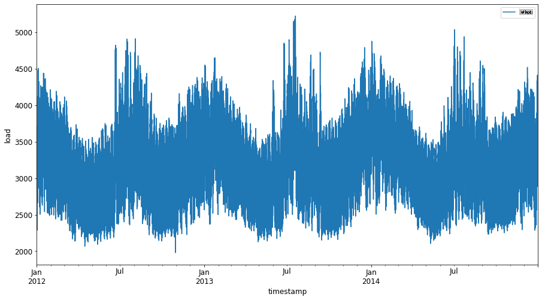
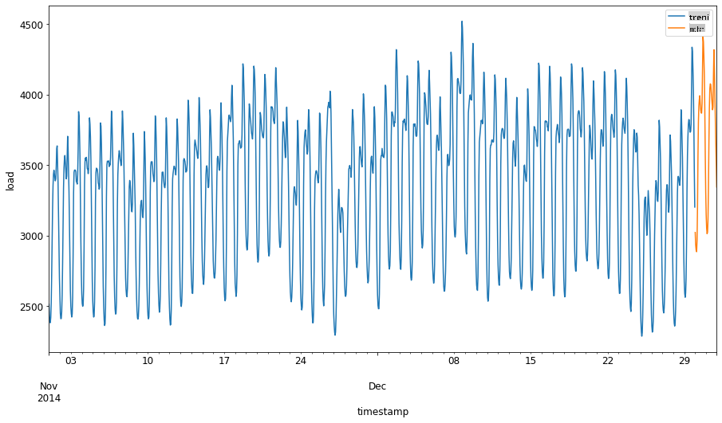
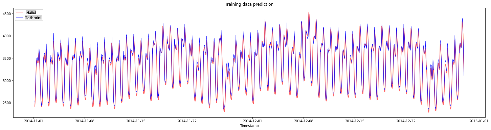
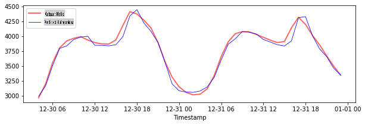
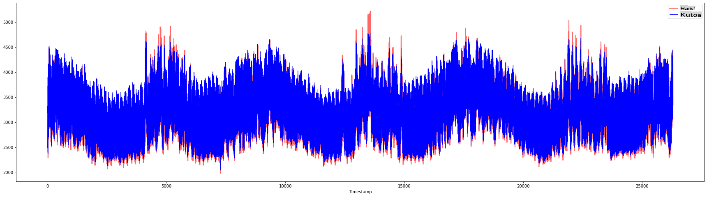

# Utabiri wa Mfululizo wa Wakati kwa Kutumia Support Vector Regressor

Katika somo lililopita, ulijifunza jinsi ya kutumia mfano wa ARIMA kufanya utabiri wa mfululizo wa wakati. Sasa utakuwa unatazama mfano wa Support Vector Regressor ambao ni mfano wa kurudi nyuma unaotumika kutabiri data inayoendelea.

## [Pre-lecture quiz](https://gray-sand-07a10f403.1.azurestaticapps.net/quiz/51/) 

## Utangulizi

Katika somo hili, utagundua njia maalum ya kujenga mifano kwa [**SVM**: **S**upport **V**ector **M**achine](https://en.wikipedia.org/wiki/Support-vector_machine) kwa kurudi nyuma, au **SVR: Support Vector Regressor**. 

### SVR katika muktadha wa mfululizo wa wakati [^1]

Kabla ya kuelewa umuhimu wa SVR katika utabiri wa mfululizo wa wakati, hapa kuna baadhi ya dhana muhimu unazohitaji kujua:

- **Regression:** Mbinu ya kujifunza yenye usimamizi ili kutabiri thamani zinazoendelea kutoka kwenye seti fulani ya pembejeo. Wazo ni kufaa mkurva (au mstari) katika nafasi ya vipengele ambayo ina idadi kubwa ya pointi za data. [Bonyeza hapa](https://en.wikipedia.org/wiki/Regression_analysis) kwa maelezo zaidi.
- **Support Vector Machine (SVM):** Aina ya mfano wa kujifunza kwa mashine yenye usimamizi unaotumika kwa uainishaji, kurudi nyuma na kugundua vitu vya kipekee. Mfano huo ni ndege ya juu katika nafasi ya vipengele, ambayo katika kesi ya uainishaji inafanya kazi kama mpaka, na katika kesi ya kurudi nyuma inafanya kazi kama mstari bora wa kufaa. Katika SVM, kazi ya Kernel hutumika kubadilisha seti ya data kuwa nafasi ya idadi kubwa ya vipimo, ili iweze kutenganishwa kwa urahisi. [Bonyeza hapa](https://en.wikipedia.org/wiki/Support-vector_machine) kwa maelezo zaidi kuhusu SVMs.
- **Support Vector Regressor (SVR):** Aina ya SVM, kupata mstari bora wa kufaa (ambao katika kesi ya SVM ni ndege ya juu) ambayo ina idadi kubwa ya pointi za data.

### Kwa nini SVR? [^1]

Katika somo la mwisho ulijifunza kuhusu ARIMA, ambayo ni njia ya takwimu ya mstari yenye mafanikio sana kutabiri data ya mfululizo wa wakati. Hata hivyo, katika kesi nyingi, data ya mfululizo wa wakati ina *kutokuwa na mstari*, ambayo haiwezi kuakisiwa na mifano ya mstari. Katika kesi hizo, uwezo wa SVM kuzingatia kutokuwa na mstari katika data kwa kazi za kurudi nyuma hufanya SVR kufanikiwa katika utabiri wa mfululizo wa wakati.

## Zoezi - jenga mfano wa SVR

Hatua za awali za maandalizi ya data ni sawa na zile za somo lililopita kuhusu [ARIMA](https://github.com/microsoft/ML-For-Beginners/tree/main/7-TimeSeries/2-ARIMA). 

Fungua folda ya [_/working_](https://github.com/microsoft/ML-For-Beginners/tree/main/7-TimeSeries/3-SVR/working) katika somo hili na tafuta faili [_notebook.ipynb_](https://github.com/microsoft/ML-For-Beginners/blob/main/7-TimeSeries/3-SVR/working/notebook.ipynb). [^2]

1. Endesha daftari na ulete maktaba muhimu: [^2]

   ```python
   import sys
   sys.path.append('../../')
   ```

   ```python
   import os
   import warnings
   import matplotlib.pyplot as plt
   import numpy as np
   import pandas as pd
   import datetime as dt
   import math
   
   from sklearn.svm import SVR
   from sklearn.preprocessing import MinMaxScaler
   from common.utils import load_data, mape
   ```

2. Pakia data kutoka kwenye faili `/data/energy.csv` ndani ya dataframe ya Pandas na uangalie: [^2]

   ```python
   energy = load_data('../../data')[['load']]
   ```

3. Chora data zote za nishati zinazopatikana kutoka Januari 2012 hadi Desemba 2014: [^2]

   ```python
   energy.plot(y='load', subplots=True, figsize=(15, 8), fontsize=12)
   plt.xlabel('timestamp', fontsize=12)
   plt.ylabel('load', fontsize=12)
   plt.show()
   ```

   

   Sasa, hebu tujenge mfano wetu wa SVR.

### Tengeneza seti za mafunzo na majaribio

Sasa data yako imepakuliwa, kwa hivyo unaweza kuitenganisha kuwa seti za mafunzo na majaribio. Kisha utarekebisha data ili kuunda seti ya data inayotegemea wakati ambayo itahitajika kwa SVR. Utaufundisha mfano wako kwenye seti ya mafunzo. Baada ya mfano kumaliza mafunzo, utapima usahihi wake kwenye seti ya mafunzo, seti ya majaribio na kisha seti kamili ya data ili kuona utendaji wa jumla. Unahitaji kuhakikisha kwamba seti ya majaribio inashughulikia kipindi cha baadaye kutoka kwenye seti ya mafunzo ili kuhakikisha kwamba mfano haupati habari kutoka kwenye vipindi vya wakati vijavyo [^2] (hali inayojulikana kama *Overfitting*).

1. Tengeneza kipindi cha miezi miwili kutoka Septemba 1 hadi Oktoba 31, 2014 kwa seti ya mafunzo. Seti ya majaribio itajumuisha kipindi cha miezi miwili kutoka Novemba 1 hadi Desemba 31, 2014: [^2]

   ```python
   train_start_dt = '2014-11-01 00:00:00'
   test_start_dt = '2014-12-30 00:00:00'
   ```

2. Angalia tofauti: [^2]

   ```python
   energy[(energy.index < test_start_dt) & (energy.index >= train_start_dt)][['load']].rename(columns={'load':'train'}) \
       .join(energy[test_start_dt:][['load']].rename(columns={'load':'test'}), how='outer') \
       .plot(y=['train', 'test'], figsize=(15, 8), fontsize=12)
   plt.xlabel('timestamp', fontsize=12)
   plt.ylabel('load', fontsize=12)
   plt.show()
   ```

   

### Andaa data kwa mafunzo

Sasa, unahitaji kuandaa data kwa mafunzo kwa kufanya uchujaji na kupima data yako. Chuja seti yako ya data ili kujumuisha vipindi vya wakati vilivyotajwa tu kwa kila seti na kujumuisha safu inayohitajika 'load' pamoja na tarehe: [^2]

1. Chuja seti ya data asili ili kujumuisha vipindi vya wakati vilivyotajwa hapo juu tu kwa kila seti na kujumuisha safu inayohitajika 'load' pamoja na tarehe: [^2]

   ```python
   train = energy.copy()[(energy.index >= train_start_dt) & (energy.index < test_start_dt)][['load']]
   test = energy.copy()[energy.index >= test_start_dt][['load']]
   
   print('Training data shape: ', train.shape)
   print('Test data shape: ', test.shape)
   ```

   ```output
   Training data shape:  (1416, 1)
   Test data shape:  (48, 1)
   ```
   
2. Pima data ya mafunzo kuwa katika safu ya (0, 1): [^2]

   ```python
   scaler = MinMaxScaler()
   train['load'] = scaler.fit_transform(train)
   ```
   
4. Sasa, pima data ya majaribio: [^2]

   ```python
   test['load'] = scaler.transform(test)
   ```

### Unda data kwa hatua za wakati [^1]

Kwa SVR, unabadilisha data ya pembejeo kuwa ya fomu `[batch, timesteps]`. So, you reshape the existing `train_data` and `test_data` kwa njia ambayo kuna kipimo kipya kinachorejelea hatua za wakati. 

```python
# Converting to numpy arrays
train_data = train.values
test_data = test.values
```

Kwa mfano huu, tunachukua `timesteps = 5`. Kwa hivyo, pembejeo kwa mfano ni data ya hatua za wakati za kwanza 4, na pato litakuwa data ya hatua ya wakati ya 5.

```python
timesteps=5
```

Kubadilisha data ya mafunzo kuwa tensor ya 2D kwa kutumia orodha iliyo ndani ya orodha:

```python
train_data_timesteps=np.array([[j for j in train_data[i:i+timesteps]] for i in range(0,len(train_data)-timesteps+1)])[:,:,0]
train_data_timesteps.shape
```

```output
(1412, 5)
```

Kubadilisha data ya majaribio kuwa tensor ya 2D:

```python
test_data_timesteps=np.array([[j for j in test_data[i:i+timesteps]] for i in range(0,len(test_data)-timesteps+1)])[:,:,0]
test_data_timesteps.shape
```

```output
(44, 5)
```

 Kuchagua pembejeo na matokeo kutoka kwa data ya mafunzo na majaribio:

```python
x_train, y_train = train_data_timesteps[:,:timesteps-1],train_data_timesteps[:,[timesteps-1]]
x_test, y_test = test_data_timesteps[:,:timesteps-1],test_data_timesteps[:,[timesteps-1]]

print(x_train.shape, y_train.shape)
print(x_test.shape, y_test.shape)
```

```output
(1412, 4) (1412, 1)
(44, 4) (44, 1)
```

### Tekeleza SVR [^1]

Sasa, ni wakati wa kutekeleza SVR. Kusoma zaidi kuhusu utekelezaji huu, unaweza kurejelea [hati hii](https://scikit-learn.org/stable/modules/generated/sklearn.svm.SVR.html). Kwa utekelezaji wetu, tunafuata hatua hizi:

  1. Fafanua mfano kwa kuita `SVR()` and passing in the model hyperparameters: kernel, gamma, c and epsilon
  2. Prepare the model for the training data by calling the `fit()` function
  3. Make predictions calling the `predict()` function

Sasa tunaunda mfano wa SVR. Hapa tunatumia [kernel ya RBF](https://scikit-learn.org/stable/modules/svm.html#parameters-of-the-rbf-kernel), na kuweka hyperparameters gamma, C na epsilon kama 0.5, 10 na 0.05 mtawaliwa.

```python
model = SVR(kernel='rbf',gamma=0.5, C=10, epsilon = 0.05)
```

#### Fiti mfano kwenye data ya mafunzo [^1]

```python
model.fit(x_train, y_train[:,0])
```

```output
SVR(C=10, cache_size=200, coef0=0.0, degree=3, epsilon=0.05, gamma=0.5,
    kernel='rbf', max_iter=-1, shrinking=True, tol=0.001, verbose=False)
```

#### Fanya utabiri wa mfano [^1]

```python
y_train_pred = model.predict(x_train).reshape(-1,1)
y_test_pred = model.predict(x_test).reshape(-1,1)

print(y_train_pred.shape, y_test_pred.shape)
```

```output
(1412, 1) (44, 1)
```

Umejenga SVR yako! Sasa tunahitaji kuipima.

### Pima mfano wako [^1]

Kwa tathmini, kwanza tutapima data tena kuwa kwenye kipimo chetu asili. Kisha, ili kuangalia utendaji, tutachora mfululizo wa wakati wa asili na utabiri, na pia kuchapisha matokeo ya MAPE.

Pima tena data ya utabiri na pato la asili:

```python
# Scaling the predictions
y_train_pred = scaler.inverse_transform(y_train_pred)
y_test_pred = scaler.inverse_transform(y_test_pred)

print(len(y_train_pred), len(y_test_pred))
```

```python
# Scaling the original values
y_train = scaler.inverse_transform(y_train)
y_test = scaler.inverse_transform(y_test)

print(len(y_train), len(y_test))
```

#### Angalia utendaji wa mfano kwenye data ya mafunzo na majaribio [^1]

Tunatoa timestamps kutoka kwenye seti ya data kuonyesha kwenye mhimili wa x wa mchoro wetu. Kumbuka kuwa tunatumia ```timesteps-1``` thamani za kwanza kama pembejeo kwa pato la kwanza, kwa hivyo timestamps za pato zitaanza baada ya hapo.

```python
train_timestamps = energy[(energy.index < test_start_dt) & (energy.index >= train_start_dt)].index[timesteps-1:]
test_timestamps = energy[test_start_dt:].index[timesteps-1:]

print(len(train_timestamps), len(test_timestamps))
```

```output
1412 44
```

Chora utabiri kwa data ya mafunzo:

```python
plt.figure(figsize=(25,6))
plt.plot(train_timestamps, y_train, color = 'red', linewidth=2.0, alpha = 0.6)
plt.plot(train_timestamps, y_train_pred, color = 'blue', linewidth=0.8)
plt.legend(['Actual','Predicted'])
plt.xlabel('Timestamp')
plt.title("Training data prediction")
plt.show()
```



Chapisha MAPE kwa data ya mafunzo

```python
print('MAPE for training data: ', mape(y_train_pred, y_train)*100, '%')
```

```output
MAPE for training data: 1.7195710200875551 %
```

Chora utabiri kwa data ya majaribio

```python
plt.figure(figsize=(10,3))
plt.plot(test_timestamps, y_test, color = 'red', linewidth=2.0, alpha = 0.6)
plt.plot(test_timestamps, y_test_pred, color = 'blue', linewidth=0.8)
plt.legend(['Actual','Predicted'])
plt.xlabel('Timestamp')
plt.show()
```



Chapisha MAPE kwa data ya majaribio

```python
print('MAPE for testing data: ', mape(y_test_pred, y_test)*100, '%')
```

```output
MAPE for testing data:  1.2623790187854018 %
```

🏆 Una matokeo mazuri sana kwenye seti ya data ya majaribio!

### Angalia utendaji wa mfano kwenye seti kamili ya data [^1]

```python
# Extracting load values as numpy array
data = energy.copy().values

# Scaling
data = scaler.transform(data)

# Transforming to 2D tensor as per model input requirement
data_timesteps=np.array([[j for j in data[i:i+timesteps]] for i in range(0,len(data)-timesteps+1)])[:,:,0]
print("Tensor shape: ", data_timesteps.shape)

# Selecting inputs and outputs from data
X, Y = data_timesteps[:,:timesteps-1],data_timesteps[:,[timesteps-1]]
print("X shape: ", X.shape,"\nY shape: ", Y.shape)
```

```output
Tensor shape:  (26300, 5)
X shape:  (26300, 4) 
Y shape:  (26300, 1)
```

```python
# Make model predictions
Y_pred = model.predict(X).reshape(-1,1)

# Inverse scale and reshape
Y_pred = scaler.inverse_transform(Y_pred)
Y = scaler.inverse_transform(Y)
```

```python
plt.figure(figsize=(30,8))
plt.plot(Y, color = 'red', linewidth=2.0, alpha = 0.6)
plt.plot(Y_pred, color = 'blue', linewidth=0.8)
plt.legend(['Actual','Predicted'])
plt.xlabel('Timestamp')
plt.show()
```



```python
print('MAPE: ', mape(Y_pred, Y)*100, '%')
```

```output
MAPE:  2.0572089029888656 %
```

🏆 Michoro nzuri sana, inaonyesha mfano wenye usahihi mzuri. Hongera!

---

## 🚀Changamoto

- Jaribu kubadilisha hyperparameters (gamma, C, epsilon) wakati wa kuunda mfano na tathmini kwenye data ili kuona seti gani ya hyperparameters inatoa matokeo bora kwenye data ya majaribio. Kujua zaidi kuhusu hyperparameters hizi, unaweza kurejelea hati [hapa](https://scikit-learn.org/stable/modules/svm.html#parameters-of-the-rbf-kernel). 
- Jaribu kutumia kazi tofauti za kernel kwa mfano na uchanganue utendaji wao kwenye seti ya data. Hati inayosaidia inaweza kupatikana [hapa](https://scikit-learn.org/stable/modules/svm.html#kernel-functions).
- Jaribu kutumia thamani tofauti za `timesteps` kwa mfano ili kuangalia nyuma kufanya utabiri.

## [Post-lecture quiz](https://gray-sand-07a10f403.1.azurestaticapps.net/quiz/52/)

## Mapitio na Kujisomea

Somo hili lilikuwa la kuanzisha matumizi ya SVR kwa Utabiri wa Mfululizo wa Wakati. Kusoma zaidi kuhusu SVR, unaweza kurejelea [blogu hii](https://www.analyticsvidhya.com/blog/2020/03/support-vector-regression-tutorial-for-machine-learning/). Hii [hati ya scikit-learn](https://scikit-learn.org/stable/modules/svm.html) inatoa maelezo ya kina zaidi kuhusu SVMs kwa ujumla, [SVRs](https://scikit-learn.org/stable/modules/svm.html#regression) na pia maelezo mengine ya utekelezaji kama vile kazi tofauti za [kernel](https://scikit-learn.org/stable/modules/svm.html#kernel-functions) zinazoweza kutumika, na vigezo vyake.

## Kazi

[Modeli mpya ya SVR](assignment.md)

## Credits

[^1]: Maandishi, msimbo na matokeo katika sehemu hii yalichangiwa na [@AnirbanMukherjeeXD](https://github.com/AnirbanMukherjeeXD)
[^2]: Maandishi, msimbo na matokeo katika sehemu hii yalichukuliwa kutoka [ARIMA](https://github.com/microsoft/ML-For-Beginners/tree/main/7-TimeSeries/2-ARIMA)

**Kanusho**:
Hati hii imetafsiriwa kwa kutumia huduma za tafsiri za AI zinazotumia mashine. Ingawa tunajitahidi kuwa sahihi, tafadhali fahamu kwamba tafsiri za kiotomatiki zinaweza kuwa na makosa au kutokuwa sahihi. Hati ya asili katika lugha yake ya asili inapaswa kuzingatiwa kama chanzo chenye mamlaka. Kwa taarifa muhimu, tafsiri ya kitaalamu ya binadamu inapendekezwa. Hatutawajibika kwa kutokuelewana au tafsiri zisizo sahihi zinazotokana na matumizi ya tafsiri hii.