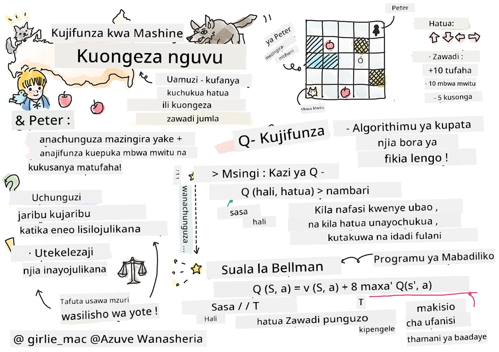

# Utangulizi wa Kujifunza kwa Uimarishaji na Q-Learning


> Sketchnote na [Tomomi Imura](https://www.twitter.com/girlie_mac)

Kujifunza kwa uimarishaji kunahusisha dhana muhimu tatu: wakala, baadhi ya hali, na seti ya vitendo kwa kila hali. Kwa kutekeleza kitendo katika hali iliyotajwa, wakala hupata zawadi. Tena fikiria mchezo wa kompyuta Super Mario. Wewe ni Mario, uko kwenye kiwango cha mchezo, unasimama karibu na kingo ya mto. Juu yako kuna sarafu. Wewe ukiwa Mario, katika kiwango cha mchezo, katika nafasi maalum ... hiyo ni hali yako. Kusonga hatua moja kulia (kitendo) kutakupeleka juu ya kingo, na hiyo itakupatia alama ya chini ya nambari. Hata hivyo, kubonyeza kitufe cha kuruka kungekupa alama na ungebaki hai. Hiyo ni matokeo mazuri na inapaswa kukupatia alama nzuri za nambari.

Kwa kutumia kujifunza kwa uimarishaji na kielelezo (mchezo), unaweza kujifunza jinsi ya kucheza mchezo ili kuongeza zawadi ambayo ni kubaki hai na kupata alama nyingi iwezekanavyo.

[](https://www.youtube.com/watch?v=lDq_en8RNOo)

> 🎥 Bofya picha hapo juu kusikiliza Dmitry akijadili Kujifunza kwa Uimarishaji

## [Mtihani wa kabla ya somo](https://ff-quizzes.netlify.app/en/ml/)

## Masharti ya awali na Usanidi

Katika somo hili, tutajaribu baadhi ya msimbo wa Python. Unapaswa kuwa na uwezo wa kuendesha msimbo wa Jupyter Notebook kutoka somo hili, iwe kwenye kompyuta yako au mahali fulani kwenye wingu.

Unaweza kufungua [daftari la somo](https://github.com/microsoft/ML-For-Beginners/blob/main/8-Reinforcement/1-QLearning/notebook.ipynb) na kupitia somo hili kujifunza.

> **Kumbuka:** Ikiwa unafungua msimbo huu kutoka kwenye wingu, pia unahitaji kupakua faili la [`rlboard.py`](https://github.com/microsoft/ML-For-Beginners/blob/main/8-Reinforcement/1-QLearning/rlboard.py), ambalo linatumika kwenye msimbo wa daftari. Liaweke kwenye saraka ile ile kama daftari.

## Utangulizi

Katika somo hili, tutachunguza dunia ya **[Peter na Wolf](https://en.wikipedia.org/wiki/Peter_and_the_Wolf)**, iliyohamasishwa na hadithi ya muziki na mtunzi kutoka Urusi, [Sergei Prokofiev](https://en.wikipedia.org/wiki/Sergei_Prokofiev). Tutatumia **Kujifunza kwa Uimarishaji** kumruhusu Peter kuchunguza mazingira yake, kukusanya tufaha tamu na kuepuka kukutana na mbwa mwitu.

**Kujifunza kwa Uimarishaji** (RL) ni mbinu ya kujifunza inayoturuhusu kujifunza tabia bora ya **wakala** katika **mazingira** fulani kwa kufanya majaribio mengi. Wakala katika mazingira haya anapaswa kuwa na **lengo**, linaloelezwa na **kazi ya zawadi**.

## Mazingira

Kwa urahisi, tuchukulie dunia ya Peter kuwa safu ya mstatili yenye ukubwa wa `width` x `height`, kama hii:


Kila kisanduku kwenye bamba hili linaweza kuwa:

* **ardhi**, ambayo Peter na viumbe wengine wanaweza kutembea juu yake.
* **maji**, ambayo wazi hutaweza kutembea juu yake.
* **mti** au **nyasi**, mahali pa kupumzika.
* **tufaha**, kinachowakilisha kitu ambacho Peter atafurahia kupata ili kujilisha.
* **mbwa mwitu**, ambaye ni hatari na anapaswa kuepukwa.

Kuna moduli tofauti ya Python, [`rlboard.py`](https://github.com/microsoft/ML-For-Beginners/blob/main/8-Reinforcement/1-QLearning/rlboard.py), ambayo ina msimbo wa kufanya kazi na mazingira haya. Kwa kuwa msimbo huu hauhitaji kueleweka kwa dhana zetu, tutaleta moduli hii na kuitumia kutengeneza bamba la mfano (kifungu cha msimbo 1):

```python
from rlboard import *

width, height = 8,8
m = Board(width,height)
m.randomize(seed=13)
m.plot()
```

Msimbo huu unapaswa kuchapisha picha ya mazingira yanayofanana na ile hapo juu.

## Vitendo na sera

Katika mfano wetu, lengo la Peter litakuwa kupata tufaha, huku akiiepuka mbwa mwitu na vikwazo vingine. Kwa kufanya hivyo, anaweza kutembea hadi apate tufaha.

Kwa hivyo, katika nafasi yoyote, anaweza kuchagua moja ya vitendo vifuatavyo: juu, chini, kushoto na kulia.

Tutafafanua vitendo hivyo kama kamusi, na kuviweka kwenye mabadiliko ya viwango vinavyohusiana. Kwa mfano, kusogea kulia (`R`) kutafanana na jozi `(1,0)`. (kifungu cha msimbo 2):

```python
actions = { "U" : (0,-1), "D" : (0,1), "L" : (-1,0), "R" : (1,0) }
action_idx = { a : i for i,a in enumerate(actions.keys()) }
```

Kuhitimisha, mkakati na lengo la sinia hii ni kama ifuatavyo:

- **Mkakati**, wa wakala wetu (Peter) unafafanuliwa na kinachoitwa **sera**. Sera ni kazi inayorejesha kitendo katika hali yoyote iliyotolewa. Katika kesi yetu, hali ya tatizo inaonyeshwa na bamba, ikiwa ni pamoja na nafasi ya sasa ya mchezaji.

- **Lengo**, la kujifunza kwa uimarishaji ni hatimaye kujifunza sera nzuri itakayoruhusu kutatua tatizo kwa ufanisi. Hata hivyo, kama msingi, tuchukulie sera rahisi kabisa inayoitwa **kutembea kwa nasibu**.

## Kutembea kwa nasibu

Hebu kwanza tatua tatizo letu kwa kutekeleza mkakati wa kutembea kwa nasibu. Kwa kutembea kwa nasibu, tutachagua kitendo kijacho kwa bahati kutoka vitendo vinavyoruhusiwa, hadi tufikie tufaha (kifungu cha msimbo 3).

1. Tekeleza kutembea kwa nasibu kwa msimbo unaofuata:

    ```python
    def random_policy(m):
        return random.choice(list(actions))
    
    def walk(m,policy,start_position=None):
        n = 0 # idadi ya hatua
        # weka nafasi ya mwanzo
        if start_position:
            m.human = start_position 
        else:
            m.random_start()
        while True:
            if m.at() == Board.Cell.apple:
                return n # mafanikio!
            if m.at() in [Board.Cell.wolf, Board.Cell.water]:
                return -1 # kuliwa na mbwa mwitu au kuzama
            while True:
                a = actions[policy(m)]
                new_pos = m.move_pos(m.human,a)
                if m.is_valid(new_pos) and m.at(new_pos)!=Board.Cell.water:
                    m.move(a) # fanya mwelekeo halisi
                    break
            n+=1
    
    walk(m,random_policy)
    ```

    Wito kwa `walk` unapaswa kurejesha urefu wa njia inayohusiana, ambayo inaweza kutofautiana kutoka mara moja hadi nyingine.

1. Endesha jaribio la kutembea mara kadhaa (tuseme, 100), na chapisha takwimu zinazotokana (kifungu cha msimbo 4):

    ```python
    def print_statistics(policy):
        s,w,n = 0,0,0
        for _ in range(100):
            z = walk(m,policy)
            if z<0:
                w+=1
            else:
                s += z
                n += 1
        print(f"Average path length = {s/n}, eaten by wolf: {w} times")
    
    print_statistics(random_policy)
    ```

    Kumbuka kuwa urefu wa wastani wa njia ni hatua 30-40, ambayo ni mengi, ikizingatiwa kwamba umbali wa wastani hadi tufaha ulio karibu ni hatua 5-6.

    Pia unaweza kuona muonekano wa mwendo wa Peter wakati wa kutembea kwa nasibu:

    

## Kazi ya zawadi

Ili kufanya sera yetu kuwa na akili zaidi, tunahitaji kuelewa ni ngapi hatua ni "bora" kuliko nyingine. Kufanya hivyo, tunahitaji kufafanua lengo letu.

Lengo linaweza kufafanuliwa kwa matumizi ya **kazi ya zawadi**, ambayo itarejesha baadhi ya alama kwa kila hali. Idadi kubwa ya nambari, ni kazi bora ya zawadi. (kifungu cha msimbo 5)

```python
move_reward = -0.1
goal_reward = 10
end_reward = -10

def reward(m,pos=None):
    pos = pos or m.human
    if not m.is_valid(pos):
        return end_reward
    x = m.at(pos)
    if x==Board.Cell.water or x == Board.Cell.wolf:
        return end_reward
    if x==Board.Cell.apple:
        return goal_reward
    return move_reward
```

Jambo la kuvutia kuhusu kazi za zawadi ni kwamba katika kesi nyingi, *tunapewa tu zawadi kubwa mwishoni mwa mchezo*. Hii inamaanisha kuwa algoriti yetu inapaswa kukumbuka "hatua nzuri" zinazosababisha zawadi nzuri mwishoni, na kuongeza umuhimu wake. Vivyo hivyo, hatua zote zinazotuletea matokeo mabaya zinapaswa kuzuiwa.

## Q-Learning

Algoriti tutakayojadili hapa inaitwa **Q-Learning**. Katika algoriti hii, sera inafafanuliwa na kazi (au muundo wa data) unaoitwa **Meza ya Q**. Inarekodi "ubora" wa kila kitendo katika hali fulani.

Inaitwa Meza ya Q kwa sababu mara nyingi ni rahisi kuionyesha kama meza, au safu nyingi za vipimo. Tukiwa na bamba lenye vipimo `width` x `height`, tunaweza kuwakilisha Meza ya Q kwa kutumia numpy array yenye sura `width` x `height` x `len(actions)`: (kifungu cha msimbo 6)

```python
Q = np.ones((width,height,len(actions)),dtype=np.float)*1.0/len(actions)
```

Tazama kuwa tunaanzisha thamani zote za Meza ya Q kwa thamani sawa, katika kesi yetu - 0.25. Hii inahusiana na sera ya "kutembea kwa nasibu", kwa sababu hatua zote katika kila hali ni sawa. Tunaweza kuipasa Meza ya Q kwa kazi ya `plot` ili kukuonyesha meza kwenye bamba: `m.plot(Q)`.


Katikati ya kila kisanduku kuna "mshale" unaoashiria mwelekeo unaopendelea wa mwendo. Kwa kuwa mwelekeo yote ni sawa, alama ya doa inaonyeshwa.

Sasa tunahitaji kuendesha maonyesho, kuchunguza mazingira yetu, na kujifunza sehemu bora ya thamani za Meza ya Q, ambazo zitaturuhusu kupata njia hadi tufaha haraka zaidi.

## Muhtasari wa Q-Learning: Mlinganyo wa Bellman

Mara tu tunapoanza kusonga, kila kitendo kitaambatana na zawadi inayojitokeza mara moja, yaani tunaweza kuchagua kitendo kijacho kulingana na zawadi ya haraka zaidi. Hata hivyo, katika hali nyingi, hatua itashindwa kufanikisha lengo letu la kufikia tufaha, hivyo hatuwezi kuamua mara moja mwelekeo gani ni bora.

> Kumbuka kuwa si matokeo ya mara moja yanayohesabiwa, bali matokeo ya mwisho, ambayo tutayapata mwishoni mwa maonyesho.

Ili kuzingatia zawadi hii ya kuchelewa, tunahitaji kutumia kanuni za **[programu ya mabadiliko](https://en.wikipedia.org/wiki/Dynamic_programming)**, ambazo zinatuwezesha kufikiria tatizo letu kwa mzunguko.

Fikiria kuwa sasa tuko katika hali *s*, na tunataka kusonga hadi hali inayofuata *s'*. Kwa kufanya hivyo, tutapokea zawadi ya mara moja *r(s,a)*, inayofafanuliwa na kazi ya zawadi, pamoja na zawadi ya baadaye. Ikiwa tunadhani kuwa Meza yetu ya Q inaonyesha vyema "mvuto" wa kitendo chochote, basi katika hali *s'* tutachagua kitendo *a* kinacholingana na thamani kubwa zaidi ya *Q(s',a')*. hivyo, zawadi bora zaidi ya baadaye ambayo tunaweza kupata katika hali *s* itafafanuliwa kama `max`<sub>a'</sub>*Q(s',a')* (kinachotumiwa hapa ni thamani kubwa zaidi kati ya vitendo vyote vinavyowezekana *a'* katika hali *s'*).

Huu ndio **mlinganyo wa Bellman** kwa kuhesabu thamani ya Meza ya Q katika hali *s*, ikizingatiwa kitendo *a*:


Hapa γ ni kinachoitwa **kipimo cha punguzo** kinachobainisha kiwango ambacho unapaswa kupendelea zawadi ya sasa kuliko zawadi ya baadaye na kinyume chake.

## Algoriti ya Kujifunza

Kutokana na mlinganyo hapo juu, sasa tunaweza kuandika pseudokodi kwa algoriti yetu ya kujifunza:

* Anzisha Meza ya Q na nambari sawa kwa kila hali na kitendo
* Weka kiwango cha kujifunza α ← 1
* Rudia maonyesho mara nyingi
   1. Anza katika nafasi ya nasibu
   1. Rudia
        1. Chagua kitendo *a* katika hali *s*
        2. Tekeleza kitendo kwa kusonga hadi hali mpya *s'*
        3. Ikiwa tukutana na hali ya mwisho wa mchezo, au jumla ya zawadi ni ndogo sana - toka maonyeshoni  
        4. Hesabu zawadi *r* katika hali mpya
        5. Sasisha Kazi ya Q kulingana na mlinganyo wa Bellman: *Q(s,a)* ← *(1-α)Q(s,a)+α(r+γ max<sub>a'</sub>Q(s',a'))*
        6. *s* ← *s'*
        7. Sasisha jumla ya zawadi na punguza α.

## Kutumia vs. kuchunguza

Katika algoriti hapo juu, hatukufafanua jinsi ilivyo kamili unapaswa kuchagua kitendo katika hatua 2.1. Ikiwa tunachagua kitendo kwa bahati, tutachunguza mazingira kwa bahati, na pia kuna uwezekano mkubwa wa kufa mara nyingi na kuchunguza maeneo ambayo kawaida hatutapita. Njia mbadala itakuwa kutumia thamani za Meza ya Q ambazo tayari tunazijua, na hivyo kuchagua kitendo bora (chenye thamani kubwa ya Meza ya Q) katika hali *s*. Hata hivyo, hii itakuzuia kuchunguza hali nyingine, na kuna uwezekano usipate suluhisho bora kabisa.

Hivyo, njia bora ni kupata usawa kati ya kuchunguza na kutumia. Hii inaweza kufanyika kwa kuchagua kitendo katika hali *s* kwa uwezekano unaolingana na thamani zilizoko katika Meza ya Q. Mwanzo, thamani za Meza ya Q zikiwa sawa zote, itakuwa sawa na uchaguzi wa nasibu, lakini tunapojifunza zaidi kuhusu mazingira yetu, tuna uwezekano mkubwa zaidi wa kufuata njia bora huku tukiruhusu wakala kuchagua njia ambayo haijachunguzwa mara kwa mara.

## Utekelezaji wa Python

Sasa tuko tayari kutekeleza algoriti ya kujifunza. Kabla ya kufanya hivyo, tunahitaji pia kazi inayobadilisha nambari zozote katika Meza ya Q kuwa sehemu za uwezekano kwa vitendo vinavyolingana.

1. Tengeneza kazi `probs()`:

    ```python
    def probs(v,eps=1e-4):
        v = v-v.min()+eps
        v = v/v.sum()
        return v
    ```

    Tunaongeza `eps` chache kwenye vector ya awali ili kuepuka kugawanya kwa 0 katika kesi ya awali, wakati vipengele vyote vya vector ni sawa.

Endesha algoriti ya kujifunza kupitia majaribio 5000, pia yanayoitwa **epocha**: (kifungu cha msimbo 8)
```python
    for epoch in range(5000):
    
        # Chagua sehemu ya awali
        m.random_start()
        
        # Anza kusafiri
        n=0
        cum_reward = 0
        while True:
            x,y = m.human
            v = probs(Q[x,y])
            a = random.choices(list(actions),weights=v)[0]
            dpos = actions[a]
            m.move(dpos,check_correctness=False) # tunaruhusu mchezaji kusogea nje ya ubao, ambayo huumaliza kipindi
            r = reward(m)
            cum_reward += r
            if r==end_reward or cum_reward < -1000:
                lpath.append(n)
                break
            alpha = np.exp(-n / 10e5)
            gamma = 0.5
            ai = action_idx[a]
            Q[x,y,ai] = (1 - alpha) * Q[x,y,ai] + alpha * (r + gamma * Q[x+dpos[0], y+dpos[1]].max())
            n+=1
```

Baada ya kutekeleza algoriti hii, Meza ya Q inapaswa kusasishwa na thamani zinazofafanua mvuto wa vitendo tofauti katika kila hatua. Tunaweza kujaribu kuonyesha Meza ya Q kwa kuchora vector katika kila kisanduku inayoelekeza mwelekeo unaotakiwa wa mwendo. Kwa urahisi, tunachora duara ndogo badala ya kichwa cha mshale.


## Kukagua sera

Kwa kuwa Meza ya Q inaorodhesha "mvuto" wa kitendo chochote katika kila hali, ni rahisi kuitumia kufafanua njia bora ya kuvinjari katika dunia yetu. Katika kesi rahisi, tunaweza kuchagua kitendo kinacholingana na thamani kubwa zaidi ya Meza ya Q: (kifungu cha msimbo 9)

```python
def qpolicy_strict(m):
        x,y = m.human
        v = probs(Q[x,y])
        a = list(actions)[np.argmax(v)]
        return a

walk(m,qpolicy_strict)
```


> Ikiwa uta jaribu nambari hapo juu mara kadhaa, unaweza kugundua kwamba mara nyingine "inakwama", na unahitaji kubonyeza kitufe cha STOP kwenye daftari kuizuia. Hii hutokea kwa sababu kunaweza kuwa na hali ambazo hali mbili "zinatumia ishara" kati yao kulingana na thamani bora ya Q-Value, ambapo wakala hukaa akiendelea kusogea kati ya hali hizo wasio na kikomo.

## 🚀Changamoto

> **Kazi 1:** Badilisha kazi ya `walk` ili kuzuia urefu wa njia hadi hatua fulani (semka, 100), na angalia nambari hapo juu kurudisha thamani hii mara kwa mara.

> **Kazi 2:** Badilisha kazi ya `walk` ili isirudi kwenye maeneo ambayo tayari imeshawahi kwenda hapo awali. Hii itazuia `walk` kuzunguka zunguka, lakini, wakala bado anaweza kuishia "kukamatwa" mahali ambapo hawezi kutoka.

## Uongozaji

Sera bora ya uongozaji itakuwa ile tuliyotumia wakati wa mafunzo, inayochanganya matumizi na utafutaji. Katika sera hii, tutachagua kila kitendo kwa uwezekano fulani, kulingana na thamani kwenye Jedwali la Q. Mkakati huu bado unaweza kusababisha wakala kurudi kwenye nafasi ambayo tayari ameisafiri, lakini, kama unavyoweza kuona kutoka kwa nambari hapo chini, hutoa njia fupi sana kwa wastani kuelekea eneo linalotakiwa (kumbuka kwamba `print_statistics` inaendesha majaribio 100): (kifungu cha nambari 10)

```python
def qpolicy(m):
        x,y = m.human
        v = probs(Q[x,y])
        a = random.choices(list(actions),weights=v)[0]
        return a

print_statistics(qpolicy)
```

Baada ya kuendesha nambari hii, unapaswa kupata urefu wa njia wa wastani mdogo sana kuliko awali, katika kiwango cha 3-6.

## Kuchunguza mchakato wa kujifunza

Kama tulivyosema, mchakato wa kujifunza ni usawa kati ya utafutaji na matumizi ya maarifa yaliyopatikana kuhusu muundo wa eneo la tatizo. Tumeona kwamba matokeo ya kujifunza (uwezo wa kusaidia wakala kupata njia fupi kuelekea lengo) yameboreshwa, lakini pia ni muhimu kuangalia jinsi urefu wa njia wa wastani unavyojibadilisha wakati wa mchakato wa kujifunza:


Mafunzo yanaweza kufupishwa kama:

- **Urefu wa njia wa wastani unaongezeka**. Tunachoona hapa ni kuwa mwanzoni, urefu wa njia wa wastani unaongezeka. Hii labda ni kwa sababu wakati hatujui chochote kuhusu mazingira, tuna uwezekano wa kukamata katika hali mbaya, kama maji au mbwa mwitu. Tunapoendelea kujifunza na kuanza kutumia maarifa haya, tunaweza kuchunguza mazingira kwa muda mrefu zaidi, lakini bado hatujui vizuri ambapo tufaha ziko.

- **Urefu wa njia unashuka, tunapoendelea kujifunza**. Mara tunapojifunza vya kutosha, inakuwa rahisi kwa wakala kufikia lengo, na urefu wa njia unaanza kushuka. Hata hivyo, bado tuko wazi kwa utafutaji, hivyo mara nyingi tunatoka kwenye njia bora, na kuchunguza chaguzi mpya, na kufanya njia kuwa ndefu zaidi kuliko ilivyopaswa.

- **Urefu unaongezeka ghafla**. Pia tunavyoona kwenye mchoro huu ni kwamba wakati fulani, urefu uliongezeka ghafla. Hii inaonyesha tabia isiyotabirika ya mchakato, na kwamba tunaweza wakati fulani "kuharibu" viwango vya Jedwali la Q kwa kuvitumia thamani mpya. Hii kwa kawaida inapaswa kupunguzwa kwa kupunguza kiwango cha kujifunza (kwa mfano, mwishoni mwa mafunzo, tunarekebisha thamani za Jedwali la Q kidogo tu).

Kwa ujumla, ni muhimu kukumbuka kwamba mafanikio na ubora wa mchakato wa kujifunza hutegemea sana vigezo, kama kiwango cha kujifunza, kupungua kwa kiwango cha kujifunza, na kigezo cha punguzo. Hivi mara nyingi huitwa **vigezo vikuu**, kutofautisha na **vigezo**, ambavyo tunairekebisha wakati wa mafunzo (kwa mfano, viwango vya Jedwali la Q). Mchakato wa kutafuta thamani bora za vigezo vikuu huitwa **urekebishaji wa vigezo vikuu**, na ni mada tofauti kabisa.

## [Jaribio baada ya mihadhara](https://ff-quizzes.netlify.app/en/ml/)

## Kazi ya Nyumbani
[Dunia Yenye Maishazidi Hale Halisi](assignment.md)

---

<!-- CO-OP TRANSLATOR DISCLAIMER START -->
**Kionyozo**:
Hati hii imetafsiriwa kwa kutumia huduma ya tafsiri ya AI [Co-op Translator](https://github.com/Azure/co-op-translator). Ingawa tunajitahidi kupata usahihi, tafadhali fahamu kwamba tafsiri za kiotomatiki zinaweza kuwa na makosa au upungufu wa usahihi. Hati ya asili katika lugha yake halisi inapaswa kuchukuliwa kama chanzo cha mamlaka. Kwa taarifa muhimu, tafsiri ya kitaalamu inayofanywa na binadamu inapendekezwa. Hatutojibu kwa kuelewa vibaya au tafsiri potofu zinazotokea kutokana na matumizi ya tafsiri hii.
<!-- CO-OP TRANSLATOR DISCLAIMER END -->