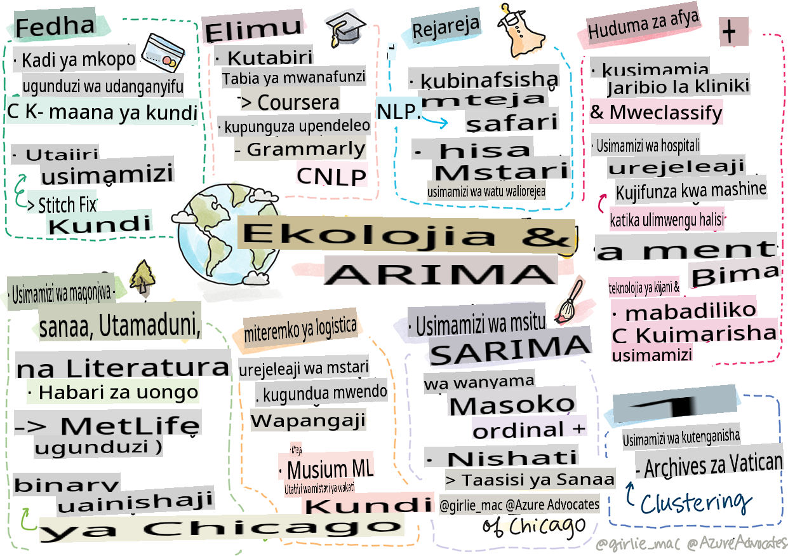

# Postscript: Machine learning katika ulimwengu wa kweli

> Sketchnote na [Tomomi Imura](https://www.twitter.com/girlie_mac)

Katika mtaala huu, umejifunza njia nyingi za kuandaa data kwa ajili ya mafunzo na kuunda mifano ya machine learning. Umejenga mfululizo wa mifano ya regression, clustering, classification, natural language processing, na time series. Hongera! Sasa, unaweza kuwa unajiuliza yote haya ni kwa ajili ya nini... ni matumizi gani ya ulimwengu wa kweli kwa mifano hii?

Wakati AI imevutia sana sekta nyingi, ambayo mara nyingi hutumia deep learning, bado kuna matumizi muhimu kwa mifano ya machine learning ya kawaida. Unaweza hata kutumia baadhi ya matumizi haya leo! Katika somo hili, utaangalia jinsi sekta nane tofauti na maeneo ya mada yanavyotumia aina hizi za mifano ili kufanya programu zao kuwa bora zaidi, za kuaminika, za akili, na zenye thamani kwa watumiaji.

## [Pre-lecture quiz](https://gray-sand-07a10f403.1.azurestaticapps.net/quiz/49/)

## 💰 Fedha

Sekta ya fedha inatoa fursa nyingi kwa machine learning. Shida nyingi katika eneo hili zinaweza kuigwa na kutatuliwa kwa kutumia ML.

### Kugundua udanganyifu wa kadi za mkopo

Tulijifunza kuhusu [k-means clustering](../../5-Clustering/2-K-Means/README.md) mapema katika kozi, lakini inaweza kutumika vipi kutatua matatizo yanayohusiana na udanganyifu wa kadi za mkopo?

K-means clustering inasaidia wakati wa mbinu ya kugundua udanganyifu wa kadi za mkopo inayoitwa **outlier detection**. Outliers, au mabadiliko katika uchunguzi kuhusu seti ya data, zinaweza kutuambia ikiwa kadi ya mkopo inatumiwa kwa kawaida au ikiwa kuna kitu kisicho cha kawaida kinaendelea. Kama inavyoonyeshwa katika karatasi iliyounganishwa hapa chini, unaweza kupanga data za kadi za mkopo kwa kutumia algorithimu ya k-means clustering na kupeana kila muamala kwenye kundi kulingana na jinsi inavyoonekana kuwa outlier. Kisha, unaweza kutathmini makundi yenye hatari zaidi kwa miamala ya udanganyifu dhidi ya halali.
[Reference](https://citeseerx.ist.psu.edu/viewdoc/download?doi=10.1.1.680.1195&rep=rep1&type=pdf)

### Usimamizi wa utajiri

Katika usimamizi wa utajiri, mtu binafsi au kampuni hushughulikia uwekezaji kwa niaba ya wateja wao. Kazi yao ni kudumisha na kukuza utajiri kwa muda mrefu, kwa hivyo ni muhimu kuchagua uwekezaji unaofanya vizuri.

Njia moja ya kutathmini jinsi uwekezaji fulani unavyofanya kazi ni kupitia regression ya takwimu. [Linear regression](../../2-Regression/1-Tools/README.md) ni chombo muhimu kwa kuelewa jinsi mfuko unavyofanya kazi kulingana na baadhi ya alama. Tunaweza pia kuamua ikiwa matokeo ya regression ni muhimu kistatistiki, au jinsi yanavyoweza kuathiri uwekezaji wa mteja. Unaweza hata kupanua uchambuzi wako zaidi kwa kutumia multiple regression, ambapo sababu za hatari za ziada zinaweza kuzingatiwa. Kwa mfano wa jinsi hii ingefanya kazi kwa mfuko maalum, angalia karatasi hapa chini kuhusu kutathmini utendaji wa mfuko kwa kutumia regression.
[Reference](http://www.brightwoodventures.com/evaluating-fund-performance-using-regression/)

## 🎓 Elimu

Sekta ya elimu pia ni eneo la kuvutia sana ambapo ML inaweza kutumika. Kuna matatizo ya kuvutia ya kushughulikia kama vile kugundua udanganyifu kwenye mitihani au insha au kudhibiti upendeleo, wa makusudi au la, katika mchakato wa kurekebisha.

### Kutabiri tabia ya mwanafunzi

[Coursera](https://coursera.com), mtoa kozi za mtandaoni, ana blogi nzuri ya teknolojia ambapo wanajadili maamuzi mengi ya uhandisi. Katika utafiti huu wa kesi, walipanga mstari wa regression kujaribu kuchunguza uhusiano wowote kati ya rating ya chini ya NPS (Net Promoter Score) na uhifadhi au kuacha kozi.
[Reference](https://medium.com/coursera-engineering/controlled-regression-quantifying-the-impact-of-course-quality-on-learner-retention-31f956bd592a)

### Kupunguza upendeleo

[Grammarly](https://grammarly.com), msaidizi wa uandishi unaokagua makosa ya tahajia na sarufi, hutumia mifumo ya [natural language processing](../../6-NLP/README.md) katika bidhaa zake. Walichapisha utafiti wa kesi wa kuvutia katika blogi yao ya teknolojia kuhusu jinsi walivyoshughulikia upendeleo wa kijinsia katika machine learning, ambayo ulijifunza katika [somo letu la utangulizi la haki](../../1-Introduction/3-fairness/README.md).
[Reference](https://www.grammarly.com/blog/engineering/mitigating-gender-bias-in-autocorrect/)

## 👜 Rejareja

Sekta ya rejareja inaweza kunufaika sana na matumizi ya ML, kutoka kuunda safari bora ya mteja hadi kusimamia hesabu kwa njia bora.

### Kubinafsisha safari ya mteja

Katika Wayfair, kampuni inayouza bidhaa za nyumbani kama samani, kusaidia wateja kupata bidhaa sahihi kwa ladha na mahitaji yao ni muhimu. Katika makala hii, wahandisi kutoka kampuni hiyo wanaelezea jinsi wanavyotumia ML na NLP "kuibua matokeo sahihi kwa wateja". Hasa, Injini yao ya Query Intent imejengwa kutumia uchimbaji wa entiti, mafunzo ya classifier, uchimbaji wa mali na maoni, na kuweka alama za hisia kwenye hakiki za wateja. Hii ni matumizi ya kawaida ya jinsi NLP inavyofanya kazi katika rejareja mtandaoni.
[Reference](https://www.aboutwayfair.com/tech-innovation/how-we-use-machine-learning-and-natural-language-processing-to-empower-search)

### Usimamizi wa hesabu

Kampuni za ubunifu na zenye ujasiri kama [StitchFix](https://stitchfix.com), huduma ya sanduku inayotuma nguo kwa watumiaji, hutegemea sana ML kwa mapendekezo na usimamizi wa hesabu. Timu zao za mitindo hufanya kazi pamoja na timu zao za biashara, kwa kweli: "mmoja wa wanasayansi wetu wa data alicheza na algorithimu ya kijeni na kuitekeleza kwa mavazi kutabiri ni kipande gani cha mavazi kitakuwa na mafanikio ambacho hakipo leo. Tulileta hiyo kwa timu ya biashara na sasa wanaweza kuitumia kama chombo."
[Reference](https://www.zdnet.com/article/how-stitch-fix-uses-machine-learning-to-master-the-science-of-styling/)

## 🏥 Huduma za Afya

Sekta ya huduma za afya inaweza kutumia ML kuboresha kazi za utafiti na pia matatizo ya kiutendaji kama kurudisha wagonjwa hospitalini au kuzuia magonjwa kuenea.

### Usimamizi wa majaribio ya kliniki

Sumu katika majaribio ya kliniki ni wasiwasi mkubwa kwa watengenezaji wa dawa. Kiasi gani cha sumu kinavumilika? Katika utafiti huu, kuchambua mbinu mbalimbali za majaribio ya kliniki kulisababisha maendeleo ya mbinu mpya ya kutabiri uwezekano wa matokeo ya majaribio ya kliniki. Hasa, waliweza kutumia random forest kutoa [classifier](../../4-Classification/README.md) inayoweza kutofautisha kati ya vikundi vya dawa.
[Reference](https://www.sciencedirect.com/science/article/pii/S2451945616302914)

### Usimamizi wa kurudisha wagonjwa hospitalini

Huduma za hospitali ni ghali, hasa wakati wagonjwa wanahitaji kurudishwa. Karatasi hii inajadili kampuni inayotumia ML kutabiri uwezekano wa kurudishwa kwa kutumia algorithimu za [clustering](../../5-Clustering/README.md). Makundi haya husaidia wachambuzi "kugundua vikundi vya kurudishwa ambavyo vinaweza kushiriki sababu ya kawaida".
[Reference](https://healthmanagement.org/c/healthmanagement/issuearticle/hospital-readmissions-and-machine-learning)

### Usimamizi wa magonjwa

Janga la hivi karibuni limeweka mwanga mkali juu ya njia ambazo machine learning inaweza kusaidia kuzuia kuenea kwa magonjwa. Katika makala hii, utatambua matumizi ya ARIMA, logistic curves, linear regression, na SARIMA. "Kazi hii ni jaribio la kuhesabu kiwango cha kuenea kwa virusi hivi na hivyo kutabiri vifo, kupona, na kesi zilizothibitishwa, ili iweze kutusaidia kujiandaa vizuri na kuishi."
[Reference](https://www.ncbi.nlm.nih.gov/pmc/articles/PMC7979218/)

## 🌲 Ikolojia na Teknolojia ya Kijani

Asili na ikolojia inajumuisha mifumo mingi nyeti ambapo mwingiliano kati ya wanyama na asili unakuja mbele. Ni muhimu kuweza kupima mifumo hii kwa usahihi na kuchukua hatua ipasavyo ikiwa kitu kinatokea, kama moto wa msitu au kupungua kwa idadi ya wanyama.

### Usimamizi wa misitu

Umejifunza kuhusu [Reinforcement Learning](../../8-Reinforcement/README.md) katika masomo ya awali. Inaweza kuwa muhimu sana wakati wa kujaribu kutabiri mifumo katika asili. Hasa, inaweza kutumika kufuatilia matatizo ya ikolojia kama moto wa misitu na kuenea kwa spishi vamizi. Nchini Kanada, kikundi cha watafiti walitumia Reinforcement Learning kujenga mifano ya mienendo ya moto wa misitu kutoka picha za setilaiti. Kwa kutumia "spatially spreading process (SSP)", waliona moto wa misitu kama "wakala katika seli yoyote katika mandhari." "Seti ya vitendo ambavyo moto unaweza kuchukua kutoka eneo lolote kwa wakati wowote ni pamoja na kuenea kaskazini, kusini, mashariki, au magharibi au kutokuenea.

Mbinu hii inageuza mpangilio wa kawaida wa RL kwa kuwa mienendo ya Mchakato wa Uamuzi wa Markov (MDP) unaolingana ni kazi inayojulikana kwa kuenea kwa moto mara moja." Soma zaidi kuhusu algorithimu za kawaida zinazotumiwa na kikundi hiki kwenye kiungo hapa chini.
[Reference](https://www.frontiersin.org/articles/10.3389/fict.2018.00006/full)

### Kugundua harakati za wanyama

Wakati deep learning imeleta mapinduzi katika kufuatilia harakati za wanyama kwa kuona (unaweza kujenga yako mwenyewe [polar bear tracker](https://docs.microsoft.com/learn/modules/build-ml-model-with-azure-stream-analytics/?WT.mc_id=academic-77952-leestott) hapa), ML ya kawaida bado ina nafasi katika kazi hii.

Vihisi vya kufuatilia harakati za wanyama wa shambani na IoT hutumia aina hii ya uchakataji wa kuona, lakini mbinu za msingi za ML ni muhimu kwa kuchakata data awali. Kwa mfano, katika karatasi hii, mkao wa kondoo ulifuatiliwa na kuchambuliwa kwa kutumia algorithimu mbalimbali za classifier. Unaweza kutambua ROC curve kwenye ukurasa wa 335.
[Reference](https://druckhaus-hofmann.de/gallery/31-wj-feb-2020.pdf)

### ⚡️ Usimamizi wa Nishati

Katika masomo yetu ya [time series forecasting](../../7-TimeSeries/README.md), tulitaja dhana ya mita za maegesho za kisasa ili kuzalisha mapato kwa mji kulingana na kuelewa usambazaji na mahitaji. Makala hii inajadili kwa kina jinsi clustering, regression na time series forecasting zilivyotumika pamoja kusaidia kutabiri matumizi ya nishati ya baadaye nchini Ireland, kwa kutumia mita za kisasa.
[Reference](https://www-cdn.knime.com/sites/default/files/inline-images/knime_bigdata_energy_timeseries_whitepaper.pdf)

## 💼 Bima

Sekta ya bima ni sekta nyingine inayotumia ML kujenga na kuboresha mifano ya kifedha na ya kihisabati.

### Usimamizi wa Mabadiliko

MetLife, mtoa bima ya maisha, ni wazi kuhusu jinsi wanavyochambua na kupunguza mabadiliko katika mifano yao ya kifedha. Katika makala hii utaona visualizations za binary na ordinal classification. Pia utagundua visualizations za forecasting.
[Reference](https://investments.metlife.com/content/dam/metlifecom/us/investments/insights/research-topics/macro-strategy/pdf/MetLifeInvestmentManagement_MachineLearnedRanking_070920.pdf)

## 🎨 Sanaa, Utamaduni, na Fasihi

Katika sanaa, kwa mfano katika uandishi wa habari, kuna matatizo mengi ya kuvutia. Kugundua habari za uongo ni tatizo kubwa kwani imethibitishwa kuathiri maoni ya watu na hata kupindua demokrasia. Makumbusho pia yanaweza kunufaika na kutumia ML katika kila kitu kutoka kupata viungo kati ya vitu hadi mipango ya rasilimali.

### Kugundua habari za uongo

Kugundua habari za uongo kumekuwa mchezo wa paka na panya katika vyombo vya habari vya leo. Katika makala hii, watafiti wanapendekeza kuwa mfumo unaochanganya mbinu kadhaa za ML tulizozisoma unaweza kujaribiwa na mfano bora zaidi kutumika: "Mfumo huu unategemea natural language processing ili kutoa sifa kutoka kwa data na kisha sifa hizi hutumika kwa mafunzo ya classifiers za machine learning kama Naive Bayes, Support Vector Machine (SVM), Random Forest (RF), Stochastic Gradient Descent (SGD), na Logistic Regression (LR)."
[Reference](https://www.irjet.net/archives/V7/i6/IRJET-V7I6688.pdf)

Makala hii inaonyesha jinsi kuchanganya maeneo tofauti ya ML kunaweza kutoa matokeo ya kuvutia ambayo yanaweza kusaidia kuzuia habari za uongo kuenea na kuleta madhara halisi; katika kesi hii, msukumo ulikuwa kuenea kwa uvumi kuhusu matibabu ya COVID ambayo yalisababisha vurugu za umati.

### ML katika Makumbusho

Makumbusho yako kwenye hatihati ya mapinduzi ya AI ambapo kuorodhesha na kidijitali makusanyo na kupata viungo kati ya vitu vinakuwa rahisi kadri teknolojia inavyosonga mbele. Miradi kama [In Codice Ratio](https://www.sciencedirect.com/science/article/abs/pii/S0306457321001035#:~:text=1.,studies%20over%20large%20historical%20sources.) inasaidia kufungua siri za makusanyo yasiyofikika kama vile Maktaba ya Vatican. Lakini, kipengele cha biashara cha makumbusho pia kinanufaika na mifano ya ML.

Kwa mfano, Taasisi ya Sanaa ya Chicago ilijenga mifano ya kutabiri kile ambacho watazamaji wanavutiwa nacho na wakati watakapotembelea maonyesho. Lengo ni kuunda uzoefu wa kibinafsi na ulioboreshwa kwa kila mgeni kila wakati mgeni anapotembelea makumbusho. "Katika mwaka wa fedha 2017, mfano ulitabiri mahudhurio na mapokezi ndani ya asilimia 1 ya usahihi, anasema Andrew Simnick, makamu wa rais mwandamizi katika Taasisi ya Sanaa."
[Reference](https://www.chicagobusiness.com/article/20180518/ISSUE01/180519840/art-institute-of-chicago-uses-data-to-make-exhibit-choices)

## 🏷 Masoko

### Uwekaji wa wateja katika makundi

Mikakati bora zaidi ya masoko inalenga wateja kwa njia tofauti kulingana na makundi mbalimbali. Katika makala hii, matumizi ya algorithimu za Clustering yamejadiliwa ili kusaidia masoko tofauti. Masoko tofauti husaidia kampuni kuboresha utambuzi wa chapa, kufikia wateja zaidi, na kupata pesa zaidi.
[Reference](https://ai.inqline.com/machine-learning-for-marketing-customer-segmentation/)

## 🚀 Changamoto

Tambua sekta nyingine inayofaidika na baadhi ya mbinu ulizojifunza katika mtaala huu, na ugundue jinsi inavyotumia ML.

## [Jaribio la baada ya somo](https://gray-sand-07a10f403.1.azurestaticapps.net/quiz/50/)

## Mapitio & Kujisomea

Timu ya sayansi ya data ya Wayfair ina video kadhaa za kuvutia kuhusu jinsi wanavyotumia ML katika kampuni yao. Inafaa [kuangalia](https://www.youtube.com/channel/UCe2PjkQXqOuwkW1gw6Ameuw/videos)!

## Kazi

[A ML scavenger hunt](assignment.md)

**Kanusho**:
Hati hii imetafsiriwa kwa kutumia huduma za tafsiri za AI zinazotumia mashine. Ingawa tunajitahidi kwa usahihi, tafadhali fahamu kuwa tafsiri za kiotomatiki zinaweza kuwa na makosa au upotovu. Hati ya asili katika lugha yake ya asili inapaswa kuchukuliwa kuwa chanzo cha mamlaka. Kwa taarifa muhimu, tafsiri ya kibinadamu ya kitaalamu inapendekezwa. Hatutawajibika kwa kutoelewana au tafsiri zisizo sahihi zinazotokana na matumizi ya tafsiri hii.