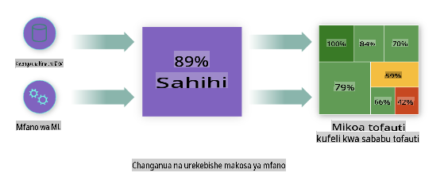
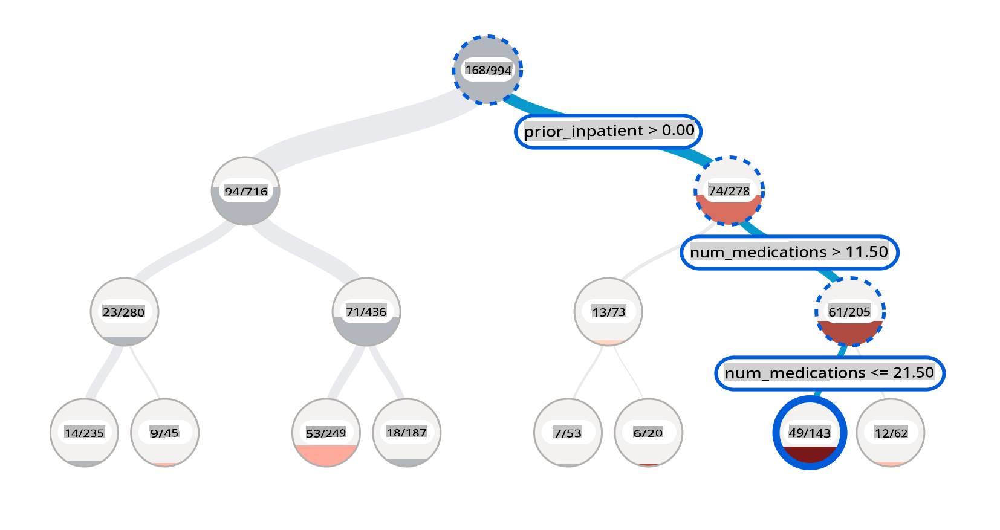
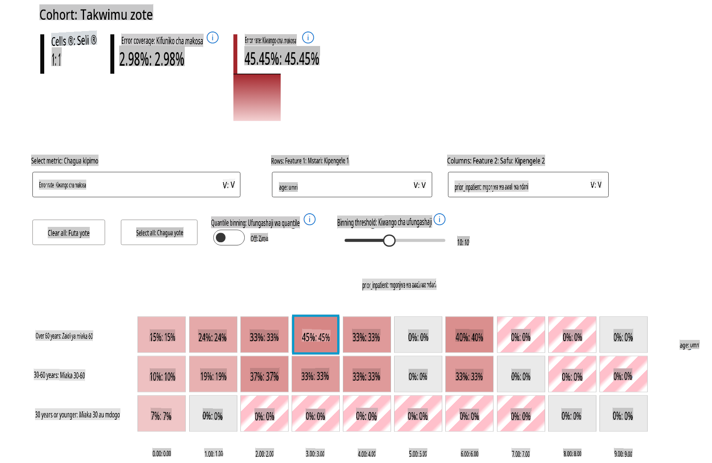
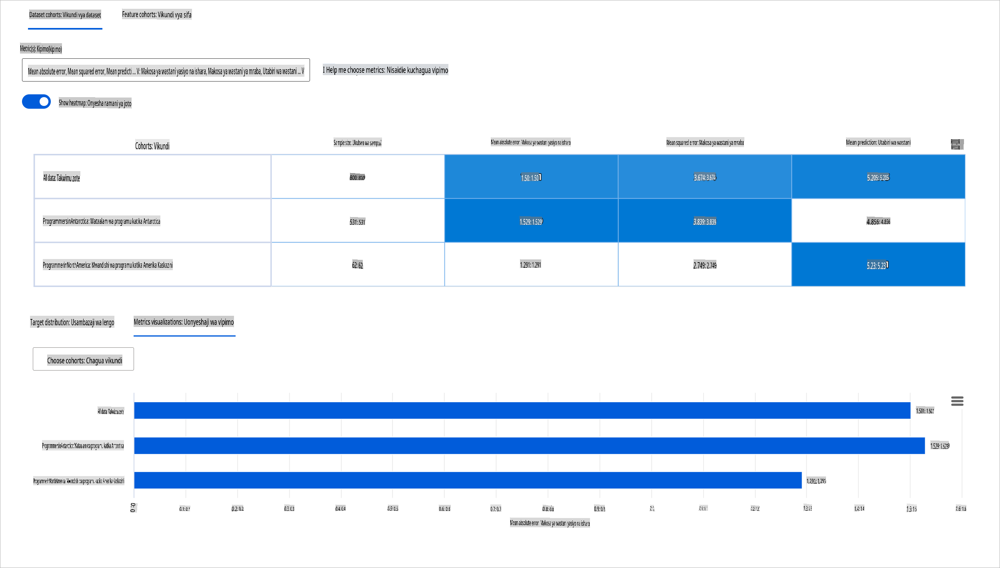
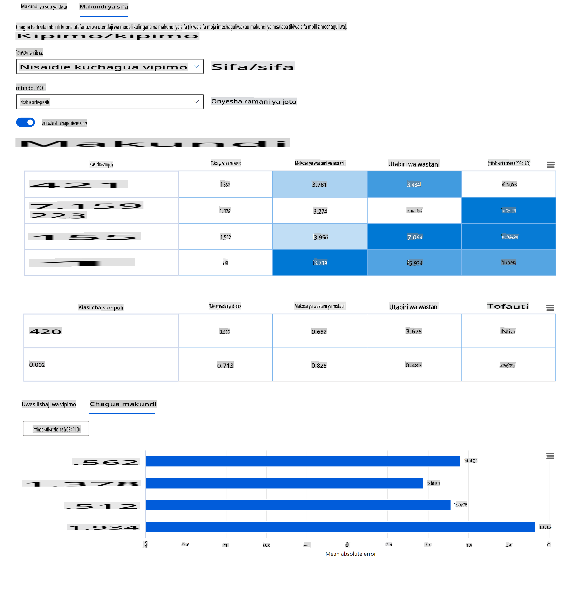
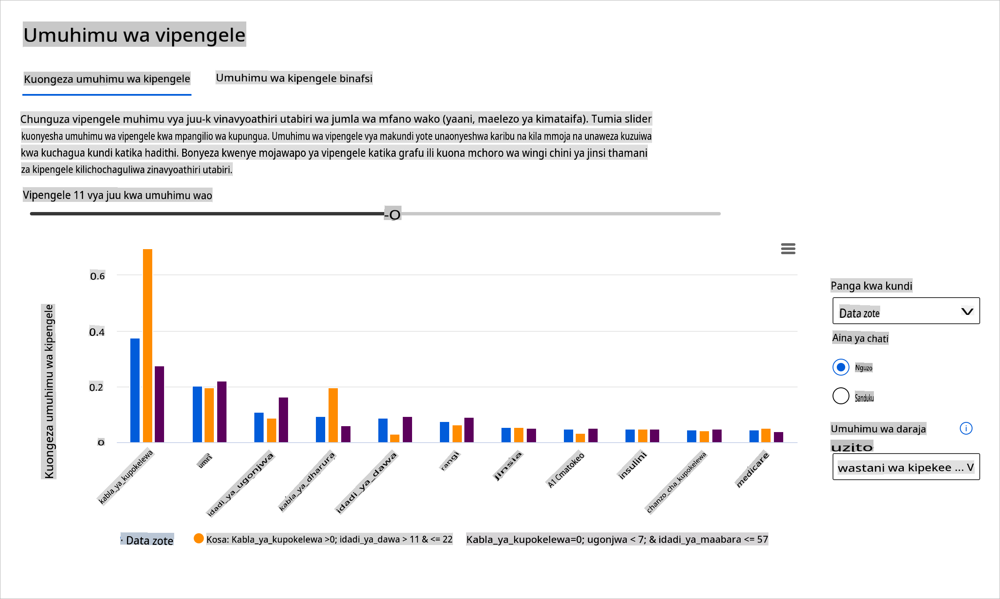
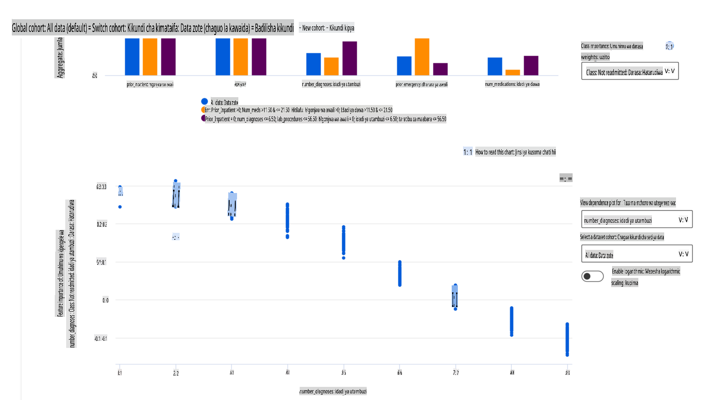

# Postscript: Urekebishaji wa Modeli katika Kujifunza kwa Mashine kwa kutumia Vipengele vya dashibodi ya AI inayowajibika
 

## [Jaribio la awali ya somo](https://gray-sand-07a10f403.1.azurestaticapps.net/quiz/5/)
 
## Utangulizi

Kujifunza kwa mashine kunaathiri maisha yetu ya kila siku. AI inajipenyeza katika baadhi ya mifumo muhimu zaidi inayotugusa kama watu binafsi na jamii yetu, kutoka afya, fedha, elimu, na ajira. Kwa mfano, mifumo na modeli zinahusika katika kazi za kila siku za kufanya maamuzi, kama vile utambuzi wa afya au kugundua ulaghai. Matokeo yake, maendeleo katika AI pamoja na kupitishwa kwa kasi yanakutana na matarajio yanayobadilika ya jamii na kanuni zinazokua kwa kujibu. Tunapata maeneo ambapo mifumo ya AI inaendelea kukosa matarajio; wanaonyesha changamoto mpya; na serikali zinaanza kudhibiti suluhisho za AI. Kwa hivyo, ni muhimu kwamba modeli hizi zichambuliwe ili kutoa matokeo ya haki, ya kuaminika, yanayojumuisha, wazi, na yanayowajibika kwa kila mtu.

Katika mtaala huu, tutaangalia zana za vitendo zinazoweza kutumika kutathmini kama modeli ina masuala ya AI inayowajibika. Mbinu za jadi za kurekebisha kujifunza kwa mashine zinategemea hesabu za kiasi kama vile usahihi wa jumla au upotevu wa makosa wa wastani. Fikiria kinachoweza kutokea wakati data unayotumia kujenga modeli hizi inakosa baadhi ya idadi ya watu, kama vile rangi, jinsia, mtazamo wa kisiasa, dini, au inawakilisha idadi hiyo kwa uwiano usio sawa. Je, vipi kuhusu wakati matokeo ya modeli yanapotafsiriwa kupendelea idadi fulani ya watu? Hii inaweza kuanzisha uwakilishi wa ziada au pungufu wa makundi haya nyeti ya vipengele na kusababisha masuala ya haki, ujumuishaji, au uaminifu kutoka kwa modeli. Sababu nyingine ni, modeli za kujifunza kwa mashine zinachukuliwa kuwa masanduku meusi, jambo ambalo linawafanya kuwa magumu kuelewa na kuelezea nini kinachoendesha utabiri wa modeli. Haya yote ni changamoto zinazowakabili wataalamu wa data na watengenezaji wa AI wanapokosa zana za kutosha za kurekebisha na kutathmini haki au uaminifu wa modeli.

Katika somo hili, utajifunza kuhusu kurekebisha modeli zako kwa kutumia:

-	**Uchambuzi wa Makosa**: tambua ni wapi katika usambazaji wa data yako modeli ina viwango vya juu vya makosa.
-	**Muhtasari wa Modeli**: fanya uchambuzi wa kulinganisha katika vikundi tofauti vya data ili kugundua tofauti katika vipimo vya utendaji wa modeli yako.
-	**Uchambuzi wa Data**: chunguza ni wapi kunaweza kuwa na uwakilishi wa ziada au pungufu wa data yako ambao unaweza kupotosha modeli yako kupendelea idadi moja ya watu kuliko nyingine.
-	**Umuhimu wa Vipengele**: elewa ni vipengele vipi vinaendesha utabiri wa modeli yako kwa kiwango cha jumla au cha ndani.

## Sharti

Kama sharti, tafadhali angalia [Zana za AI inayowajibika kwa watengenezaji](https://www.microsoft.com/ai/ai-lab-responsible-ai-dashboard)

> 

## Uchambuzi wa Makosa

Vipimo vya utendaji wa modeli vya jadi vinavyotumika kupima usahihi mara nyingi ni hesabu zinazotegemea utabiri sahihi dhidi ya usio sahihi. Kwa mfano, kuamua kuwa modeli ni sahihi kwa 89% ya wakati na upotevu wa makosa wa 0.001 inaweza kuchukuliwa kuwa utendaji mzuri. Makosa mara nyingi hayasambazwi kwa usawa katika seti yako ya data ya msingi. Unaweza kupata alama ya usahihi ya modeli ya 89% lakini kugundua kuwa kuna maeneo tofauti ya data yako ambayo modeli inashindwa kwa 42% ya wakati. Matokeo ya mifumo hii ya kushindwa na makundi fulani ya data yanaweza kusababisha masuala ya haki au uaminifu. Ni muhimu kuelewa maeneo ambapo modeli inafanya vizuri au la. Maeneo ya data ambapo kuna idadi kubwa ya kutokua sahihi katika modeli yako yanaweza kuwa idadi muhimu ya data.  

Kipengele cha Uchambuzi wa Makosa kwenye dashibodi ya RAI kinaonyesha jinsi kushindwa kwa modeli kunavyosambazwa katika vikundi mbalimbali kwa kutumia mchanganuo wa mti. Hii ni muhimu katika kutambua vipengele au maeneo yenye viwango vya juu vya makosa katika seti yako ya data. Kwa kuona ni wapi makosa mengi ya modeli yanatokea, unaweza kuanza kuchunguza sababu kuu. Unaweza pia kuunda vikundi vya data kufanya uchambuzi juu yake. Vikundi hivi vya data husaidia katika mchakato wa kurekebisha ili kubaini kwa nini utendaji wa modeli ni mzuri katika kundi moja, lakini si sahihi katika kundi jingine.   

Viashiria vya kuona kwenye ramani ya mti husaidia katika kupata maeneo yenye tatizo haraka. Kwa mfano, kivuli cha rangi nyekundu kilicho giza zaidi kwenye nodi ya mti, ndivyo kiwango cha makosa kinavyokuwa juu zaidi.  

Ramani ya joto ni kipengele kingine cha kuona ambacho watumiaji wanaweza kutumia kuchunguza kiwango cha makosa kwa kutumia kipengele kimoja au viwili ili kupata mchango wa makosa ya modeli katika seti nzima ya data au vikundi.

Tumia uchambuzi wa makosa unapohitaji:

* Kupata ufahamu wa kina juu ya jinsi kushindwa kwa modeli kunavyosambazwa katika seti ya data na katika vipengele mbalimbali vya ingizo na vipengele.
* Kuvunja vipimo vya utendaji wa jumla ili kugundua moja kwa moja vikundi vya makosa ili kuarifu hatua zako za kurekebisha zilizolengwa.

## Muhtasari wa Modeli

Kutathmini utendaji wa modeli ya kujifunza kwa mashine kunahitaji kupata uelewa wa jumla wa tabia yake. Hii inaweza kupatikana kwa kupitia zaidi ya kipimo kimoja kama vile kiwango cha makosa, usahihi, kumbukumbu, usahihi, au MAE (Makosa ya Wastani wa Absolute) ili kupata tofauti kati ya vipimo vya utendaji. Kipimo kimoja cha utendaji kinaweza kuonekana kizuri, lakini kutokua sahihi kunaweza kufichuliwa katika kipimo kingine. Zaidi ya hayo, kulinganisha vipimo kwa tofauti katika seti nzima ya data au vikundi husaidia kutoa mwanga juu ya wapi modeli inafanya vizuri au la. Hii ni muhimu hasa katika kuona utendaji wa modeli kati ya vipengele nyeti dhidi ya visivyo nyeti (mfano, rangi ya mgonjwa, jinsia, au umri) ili kugundua uwezekano wa kutokua na haki ambao modeli inaweza kuwa nao. Kwa mfano, kugundua kuwa modeli ni sahihi zaidi katika kundi lenye vipengele nyeti kunaweza kufichua uwezekano wa kutokua na haki ambao modeli inaweza kuwa nao.

Kipengele cha Muhtasari wa Modeli kwenye dashibodi ya RAI husaidia sio tu katika kuchambua vipimo vya utendaji wa uwakilishi wa data katika kundi, lakini inawapa watumiaji uwezo wa kulinganisha tabia ya modeli katika vikundi tofauti.

Kipengele cha uchambuzi wa msingi wa vipengele cha kipengele hiki kinawaruhusu watumiaji kupunguza vikundi vidogo vya data ndani ya kipengele fulani ili kutambua hali zisizo za kawaida kwa kiwango cha kina. Kwa mfano, dashibodi ina akili iliyojengwa ndani ya kiotomatiki kuunda vikundi kwa kipengele kilichochaguliwa na mtumiaji (mfano, *"time_in_hospital < 3"* au *"time_in_hospital >= 7"*). Hii inamruhusu mtumiaji kutenganisha kipengele fulani kutoka kwa kundi kubwa la data ili kuona kama ni mshawishi mkuu wa matokeo yasiyo sahihi ya modeli.

Kipengele cha Muhtasari wa Modeli kinasaidia aina mbili za vipimo vya tofauti:

**Tofauti katika utendaji wa modeli**: Seti hizi za vipimo zinahesabu tofauti (tofauti) katika maadili ya kipimo cha utendaji kilichochaguliwa katika vikundi vya data. Hapa kuna mifano michache:

* Tofauti katika kiwango cha usahihi
* Tofauti katika kiwango cha makosa
* Tofauti katika usahihi
* Tofauti katika kumbukumbu
* Tofauti katika makosa ya wastani wa absolute (MAE)

**Tofauti katika kiwango cha uteuzi**: Kipimo hiki kina tofauti katika kiwango cha uteuzi (utabiri mzuri) kati ya vikundi. Mfano wa hii ni tofauti katika viwango vya idhini ya mkopo. Kiwango cha uteuzi kinamaanisha sehemu ya pointi za data katika kila darasa zilizoainishwa kama 1 (katika uainishaji wa binary) au usambazaji wa maadili ya utabiri (katika regression).

## Uchambuzi wa Data

> "Ukitesa data kwa muda mrefu vya kutosha, itakiri chochote" - Ronald Coase

Kauli hii inasikika kali, lakini ni kweli kwamba data inaweza kudanganywa kuunga mkono hitimisho lolote. Udanganyifu kama huo wakati mwingine unaweza kutokea bila kukusudia. Kama wanadamu, sote tuna upendeleo, na mara nyingi ni vigumu kujua kwa ufahamu wakati unaleta upendeleo katika data. Kuhakikisha haki katika AI na kujifunza kwa mashine bado ni changamoto ngumu. 

Data ni kipofu kikubwa kwa vipimo vya jadi vya utendaji wa modeli. Unaweza kuwa na alama za juu za usahihi, lakini hii haionyeshi kila mara upendeleo wa msingi wa data ambao unaweza kuwa katika seti yako ya data. Kwa mfano, ikiwa seti ya data ya wafanyakazi ina 27% ya wanawake katika nafasi za utendaji katika kampuni na 73% ya wanaume katika ngazi hiyo hiyo, modeli ya matangazo ya kazi ya AI iliyofundishwa kwenye data hii inaweza kulenga zaidi hadhira ya kiume kwa nafasi za kazi za ngazi za juu. Kuwa na uwiano huu wa data kulipotosha utabiri wa modeli kupendelea jinsia moja. Hii inaonyesha tatizo la haki ambapo kuna upendeleo wa kijinsia katika modeli ya AI.  

Kipengele cha Uchambuzi wa Data kwenye dashibodi ya RAI husaidia kutambua maeneo ambapo kuna uwakilishi wa ziada au pungufu katika seti ya data. Husaidia watumiaji kutambua sababu kuu za makosa na masuala ya haki yanayoletwa na uwiano wa data au ukosefu wa uwakilishi wa kundi fulani la data. Hii inawapa watumiaji uwezo wa kuona seti za data kulingana na matokeo yaliyotabiriwa na halisi, vikundi vya makosa, na vipengele maalum. Wakati mwingine kugundua kundi la data lililowakilishwa kidogo kunaweza pia kufichua kuwa modeli haijifunzi vizuri, hivyo makosa mengi. Kuwa na modeli ambayo ina upendeleo wa data sio tu tatizo la haki lakini inaonyesha kuwa modeli haijumuishi au haijakubalika.

Tumia uchambuzi wa data unapohitaji:

* Kuchunguza takwimu za seti yako ya data kwa kuchagua vichujio tofauti ili kugawanya data yako katika vipimo tofauti (inayojulikana pia kama vikundi).
* Kuelewa usambazaji wa seti yako ya data katika vikundi tofauti na makundi ya vipengele.
* Kuamua kama matokeo yako yanayohusiana na haki, uchambuzi wa makosa, na uhusiano (yanayotokana na vipengele vingine vya dashibodi) ni matokeo ya usambazaji wa seti yako ya data.
* Kuamua ni maeneo gani ya kukusanya data zaidi ili kupunguza makosa yanayotokana na masuala ya uwakilishi, kelele za lebo, kelele za vipengele, upendeleo wa lebo, na mambo yanayofanana.

## Ufafanuzi wa Modeli

Modeli za kujifunza kwa mashine zinapokuwa masanduku meusi. Kuelewa ni vipengele vipi vya data muhimu vinaendesha utabiri wa modeli inaweza kuwa changamoto. Ni muhimu kutoa uwazi kuhusu kwa nini modeli inatoa utabiri fulani. Kwa mfano, ikiwa mfumo wa AI unatabiri kuwa mgonjwa wa kisukari yuko hatarini kurudi hospitalini ndani ya siku 30, inapaswa kutoa data inayounga mkono ambayo ilisababisha utabiri wake. Kuwa na viashiria vya data vinavyounga mkono kunaleta uwazi kusaidia madaktari au hospitali kufanya maamuzi sahihi. Zaidi ya hayo, kuwa na uwezo wa kuelezea kwa nini modeli ilifanya utabiri kwa mgonjwa binafsi inasaidia uwajibikaji kwa kanuni za afya. Unapotumia modeli za kujifunza kwa mashine kwa njia zinazogusa maisha ya watu, ni muhimu kuelewa na kuelezea ni nini kinachoathiri tabia ya modeli. Ufafanuzi na ufafanuzi wa modeli husaidia kujibu maswali katika hali kama:

* Kurekebisha modeli: Kwa nini modeli yangu ilikosea? Ninawezaje kuboresha modeli yangu?
* Ushirikiano wa binadamu na AI: Ninawezaje kuelewa na kuamini maamuzi ya modeli?
* Kufuata kanuni: Je, modeli yangu inakidhi mahitaji ya kisheria?

Kipengele cha Umuhimu wa Vipengele cha dashibodi ya RAI kinakusaidia kurekebisha na kupata uelewa wa kina wa jinsi modeli inavyotoa utabiri. Pia ni zana muhimu kwa wataalamu wa kujifunza kwa mashine na watoa maamuzi kuelezea na kuonyesha ushahidi wa vipengele vinavyoathiri tabia ya modeli kwa kufuata kanuni. Kisha, watumiaji wanaweza kuchunguza maelezo ya jumla na ya ndani kuthibitisha ni vipengele vipi vinaendesha utabiri wa modeli. Maelezo ya jumla yanaorodhesha vipengele vya juu vilivyoathiri utabiri wa jumla wa modeli. Maelezo ya ndani yanaonyesha ni vipengele vipi vilivyopelekea utabiri wa modeli kwa kesi ya mtu binafsi. Uwezo wa kutathmini maelezo ya ndani pia ni muhimu katika kurekebisha au kukagua kesi maalum ili kuelewa vizuri na kufafanua kwa nini modeli ilitoa utabiri sahihi au usio sahihi. 

* Maelezo ya jumla: Kwa mfano, ni vipengele gani vinavyoathiri tabia ya jumla ya modeli ya kurudi hospitalini kwa kisukari?
* Maelezo ya ndani: Kwa mfano, kwa nini mgonjwa wa kisukari aliye na umri wa zaidi ya miaka 60 na aliye na historia ya kulazwa hospitalini alitabiriwa kurudi au kutorudi hospitalini ndani ya siku 30?

Katika mchakato wa kurekebisha utendaji wa modeli katika vikundi tofauti, Umuhimu wa Vipengele unaonyesha ni kiwango gani cha athari kipengele kinacho katika vikundi. Husaidia kufichua hali zisizo za kawaida wakati wa kulinganisha kiwango cha ushawishi kipengele kinacho katika kuendesha utabiri wa makosa ya modeli. Kipengele cha Umuhimu wa Vipengele kinaweza kuonyesha ni maadili gani katika kipengele yaliyoathiri utabiri wa modeli kwa njia nzuri au mbaya. Kwa mfano, ikiwa modeli ilitoa utabiri usio sahihi, kipengele hiki kinatoa uwezo wa kuchambua na kugundua ni vipengele vipi au maadili ya vipengele yaliyoendesha utabiri huo. Kiwango hiki cha kina husaidia sio tu katika kurekebisha lakini pia hutoa uwazi na uwajibikaji katika hali za ukaguzi. Hatimaye, kipengele hiki kinaweza kukusaidia kutambua masuala ya haki. Kwa mfano, ikiwa kipengele nyeti kama vile kabila au jinsia kina ushawishi mkubwa katika kuendesha utabiri wa modeli, hii inaweza kuwa ishara ya upendeleo wa rangi au jinsia katika modeli.

Tumia ufafanuzi unapohitaji:

* Kuamua jinsi utabiri wa mfumo wako wa AI unavyoweza kuaminika kwa kuelewa ni vipengele vipi vilivyo muhimu zaidi kwa utabiri.
* Kuanza kurekebisha modeli yako kwa kuelewa kwanza na kutambua kama modeli inatumia vipengele vyenye afya au uhusiano wa uongo tu.
* Kugundua vyanzo vya uwezekano wa kutokua na haki kwa kuelewa kama modeli inategemea vipengele nyeti au vipengele vinavyohusiana sana navyo.
* Kujenga imani ya mtumiaji katika maamuzi ya modeli yako kwa kutoa maelezo ya ndani ili kuelezea matokeo yao.
* Kukamilisha uk

**Kanusho**:
Hati hii imetafsiriwa kwa kutumia huduma za tafsiri za AI zinazotegemea mashine. Ingawa tunajitahidi kwa usahihi, tafadhali fahamu kuwa tafsiri za kiotomatiki zinaweza kuwa na makosa au upungufu wa usahihi. Hati ya asili katika lugha yake ya asili inapaswa kuchukuliwa kuwa chanzo cha mamlaka. Kwa taarifa muhimu, tafsiri ya kibinadamu ya kitaalamu inapendekezwa. Hatutawajibika kwa maelewano mabaya au tafsiri zisizo sahihi zinazotokana na matumizi ya tafsiri hii.