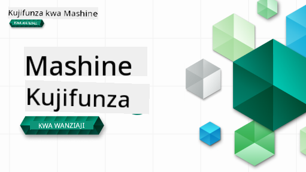

<!--
CO_OP_TRANSLATOR_METADATA:
{
  "original_hash": "c21bf667cfbd946f76fde049e31b07d0",
  "translation_date": "2025-12-25T01:15:48+00:00",
  "source_file": "README.md",
  "language_code": "sw"
}
-->

### 🌐 Msaada wa Lugha Nyingi

#### Inasaidiwa kupitia GitHub Action (Kiotomatiki & Daima Imesasishwa)

<!-- CO-OP TRANSLATOR LANGUAGES TABLE START -->
[Arabic](../ar/README.md) | [Bengali](../bn/README.md) | [Bulgarian](../bg/README.md) | [Burmese (Myanmar)](../my/README.md) | [Chinese (Simplified)](../zh/README.md) | [Chinese (Traditional, Hong Kong)](../hk/README.md) | [Chinese (Traditional, Macau)](../mo/README.md) | [Chinese (Traditional, Taiwan)](../tw/README.md) | [Croatian](../hr/README.md) | [Czech](../cs/README.md) | [Danish](../da/README.md) | [Dutch](../nl/README.md) | [Estonian](../et/README.md) | [Finnish](../fi/README.md) | [French](../fr/README.md) | [German](../de/README.md) | [Greek](../el/README.md) | [Hebrew](../he/README.md) | [Hindi](../hi/README.md) | [Hungarian](../hu/README.md) | [Indonesian](../id/README.md) | [Italian](../it/README.md) | [Japanese](../ja/README.md) | [Kannada](../kn/README.md) | [Korean](../ko/README.md) | [Lithuanian](../lt/README.md) | [Malay](../ms/README.md) | [Malayalam](../ml/README.md) | [Marathi](../mr/README.md) | [Nepali](../ne/README.md) | [Nigerian Pidgin](../pcm/README.md) | [Norwegian](../no/README.md) | [Persian (Farsi)](../fa/README.md) | [Polish](../pl/README.md) | [Portuguese (Brazil)](../br/README.md) | [Portuguese (Portugal)](../pt/README.md) | [Punjabi (Gurmukhi)](../pa/README.md) | [Romanian](../ro/README.md) | [Russian](../ru/README.md) | [Serbian (Cyrillic)](../sr/README.md) | [Slovak](../sk/README.md) | [Slovenian](../sl/README.md) | [Spanish](../es/README.md) | [Swahili](./README.md) | [Swedish](../sv/README.md) | [Tagalog (Filipino)](../tl/README.md) | [Tamil](../ta/README.md) | [Telugu](../te/README.md) | [Thai](../th/README.md) | [Turkish](../tr/README.md) | [Ukrainian](../uk/README.md) | [Urdu](../ur/README.md) | [Vietnamese](../vi/README.md)
<!-- CO-OP TRANSLATOR LANGUAGES TABLE END -->

#### Jiunge na Jamii Yetu

Tuna mfululizo wa kujifunza kupitia Discord kuhusu AI unaoendelea; jifunze zaidi na ujiunge nasi kwenye [Mfululizo wa Jifunze na AI](https://aka.ms/learnwithai/discord) kuanzia 18 - 30 Septemba, 2025. Utapokea vidokezo na mbinu za kutumia GitHub Copilot kwa Sayansi ya Data.

# Kujifunza Mashine kwa Waanzilishi - Mtaala

> 🌍 Safiri duniani tunapochunguza Kujifunza Mashine kupitia tamaduni za dunia 🌍

Watafiti wa Cloud (Cloud Advocates) wa Microsoft wanafurahia kutoa mtaala wa wiki 12, masomo 26 yote kuhusu **Kujifunza Mashine**. Katika mtaala huu, utajifunza kile kinachoitwa mara kwa mara **kujifunza mashine cha jadili**, ukitumia hasa maktaba ya Scikit-learn na kuepuka deep learning, ambayo inashughulikiwa katika [mtaala wa AI for Beginners'](https://aka.ms/ai4beginners). Pia weka masomo haya pamoja na ['Data Science for Beginners' curriculum](https://aka.ms/ds4beginners)!

Safiri nasi duniani tunapotumia mbinu hizi za jadi kwa data kutoka maeneo mengi ya dunia. Kila somo linajumuisha maswali ya kabla na baada ya somo, maelekezo ya maandishi ya kukamilisha somo, suluhisho, kazi ya nyumbani, na zaidi. Mbinu yetu ya kufundisha kwa kuzingatia miradi inakuwezesha kujifunza huku ukijenga, njia iliyoonyesha ufanisi kwa ujuzi mpya kuendelea 'kushikika'.

**✍️ Shukrani za dhati kwa waandishi wetu** Jen Looper, Stephen Howell, Francesca Lazzeri, Tomomi Imura, Cassie Breviu, Dmitry Soshnikov, Chris Noring, Anirban Mukherjee, Ornella Altunyan, Ruth Yakubu na Amy Boyd

**🎨 Shukrani pia kwa wachoraji wetu** Tomomi Imura, Dasani Madipalli, na Jen Looper

**🙏 Shukrani maalum 🙏 kwa waandishi, wachambuzi, na wachangiaji wa maudhui wa Microsoft Student Ambassador**, hasa Rishit Dagli, Muhammad Sakib Khan Inan, Rohan Raj, Alexandru Petrescu, Abhishek Jaiswal, Nawrin Tabassum, Ioan Samuila, na Snigdha Agarwal

**🤩 Shukrani za ziada kwa Microsoft Student Ambassadors Eric Wanjau, Jasleen Sondhi, na Vidushi Gupta kwa masomo yetu ya R!**

# Kuanzia

Fuata hatua hizi:
1. **Fork the Repository**: Bonyeza kitufe cha "Fork" kilicho kona ya juu-kulia ya ukurasa huu.
2. **Clone the Repository**:   `git clone https://github.com/microsoft/ML-For-Beginners.git`

> [pata rasilimali zote za ziada kwa kozi hii katika mkusanyiko wetu wa Microsoft Learn](https://learn.microsoft.com/en-us/collections/qrqzamz1nn2wx3?WT.mc_id=academic-77952-bethanycheum)

> 🔧 **Unahitaji msaada?** Angalia [Troubleshooting Guide](TROUBLESHOOTING.md) yetu kwa suluhisho za matatizo ya kawaida kuhusu usanikishaji, usanidi, na kuendesha masomo.

**[Students](https://aka.ms/student-page)**, ili kutumia mtaala huu, fanya fork ya repo nzima kwenye akaunti yako ya GitHub na kamilizo mazoezi mwenyewe au kwa kikundi:

- Anza na mtihani wa kabla ya mihadhara.
- Soma mihadhara na ukamilishe shughuli, simama na kutafakari kila ukaguzi wa maarifa.
- Jaribu kuunda miradi kwa kuelewa masomo badala ya tu kuendesha msimbo wa suluhisho; hata hivyo msimbo huo upo katika folda za `/solution` katika kila somo linalolenga mradi.
- Fanya mtihani baada ya mihadhara.
- Kamilisha changamoto.
- Kamilisha kazi ya nyumbani.
- Baada ya kukamilisha kundi la masomo, tembelea [Bodi ya Majadiliano](https://github.com/microsoft/ML-For-Beginners/discussions) na "jifunze kwa kuonyesha" kwa kujaza rubriki ya PAT inayofaa. 'PAT' ni Chombo cha Tathmini ya Maendeleo ambacho ni rubriki unayoijaza ili kuendeleza kujifunza kwako. Unaweza pia kuonyesha hisia kwa PAT za wengine ili tujifunze pamoja.

> Kwa masomo zaidi, tunapendekeza kufuata [moduli na njia za kujifunza za Microsoft Learn hizi](https://docs.microsoft.com/en-us/users/jenlooper-2911/collections/k7o7tg1gp306q4?WT.mc_id=academic-77952-leestott).

**Walimu**, tumetoa [mapendekezo kadhaa](for-teachers.md) juu ya jinsi ya kutumia mtaala huu.

---

## Video za maelekezo

Baadhi ya masomo yanapatikana kama video fupi. Unaweza kuyapata haya yote ndani ya masomo, au kwenye [orodha ya nyimbo ya ML for Beginners kwenye chaneli ya Microsoft Developer YouTube](https://aka.ms/ml-beginners-videos) kwa kubonyeza picha hapa chini.

---

## Kutana na Timu

**Gif na** [Mohit Jaisal](https://linkedin.com/in/mohitjaisal)

> 🎥 Bonyeza picha hapo juu kwa video kuhusu mradi na watu waliouunda!

---

## Mbinu ya Kufundisha

Tumebaini kanuni mbili za kifundisho wakati wa kujenga mtaala huu: kuhakikisha kuwa ni ya vitendo na kwa msingi wa miradi **(project-based)** na kuwa na **miadi ya mara kwa mara ya maswali (frequent quizzes)**. Aidha, mtaala huu una mandhari ya pamoja ili kumpa muunganiko.

Kwa kuhakikisha maudhui yanaendana na miradi, mchakato unakuwa wa kuvutia zaidi kwa wanafunzi na kukumbuka dhana kutaongezeka. Pia, mtihani wa kiwango cha chini kabla ya darasa unaweka nia ya mwanafunzi kuelekea kujifunza mada, wakati mtihani wa pili baada ya darasa unahakikisha uhifadhi wa maarifa zaidi. Mtaala huu umetengenezwa kuwa rahisi kubadilika na wa kufurahisha na unaweza kuchukuliwa kwa njia nzima au kwa sehemu. Miradi inaanza kwa ndogo na huwa tata zaidi kufikia mwisho wa mzunguko wa wiki 12. Mtaala huu pia unajumuisha sehemu ya mwisho kuhusu matumizi ya dunia halisi ya ML, ambayo inaweza kutumika kama mkopo wa ziada au kama msingi wa mjadala.

> Pata [Code of Conduct](CODE_OF_CONDUCT.md), [Contributing](CONTRIBUTING.md), [Translation](TRANSLATIONS.md), na [Troubleshooting](TROUBLESHOOTING.md) mwongozo wetu. Tunakaribisha maoni yako yenye kujenga!

## Kila somo linajumuisha

- sketchnote (hiari)
- video ya ziada (hiari)
- maelekezo ya video (baadhi ya masomo tu)
- [pre-lecture warmup quiz](https://ff-quizzes.netlify.app/en/ml/)
- somo lililoandikwa
- kwa masomo yanayotegemea mradi, miongozo hatua kwa hatua juu ya jinsi ya kujenga mradi
- ukaguzi wa maarifa
- changamoto
- usomaji wa ziada
- kazi ya nyumbani
- [post-lecture quiz](https://ff-quizzes.netlify.app/en/ml/)

> **Kumbuka kuhusu lugha**: Masomo haya kwa kawaida yameandikwa kwa Python, lakini mengi pia yanapatikana kwa R. Ili kukamilisha somo la R, nenda kwenye folda ya `/solution` na utafute masomo ya R. Yanajumuisha ugani .rmd unaoonyesha faili ya **R Markdown** ambayo inaweza kufafanuliwa kama mchanganyiko wa `code chunks` (za R au lugha nyingine) na `Kichwa cha YAML` (ambacho kinaongoza jinsi ya kuunda matokeo kama PDF) ndani ya `nyaraka ya Markdown`. Kwa hivyo, inatumika kama mfumo bora wa uandishi kwa sayansi ya data kwa sababu inakuwezesha kuunganisha msimbo wako, matokeo yake, na mawazo yako kwa kuandika kwa Markdown. Aidha, nyaraka za R Markdown zinaweza kutolewa kwa matokeo kama PDF, HTML, au Word.

> **Kumbuka kuhusu mtihani**: Mtihani zote ziko ndani ya [Quiz App folder](../../quiz-app), kwa mtihani 52 jumla za maswali matatu kila moja. Zimeunganishwa kutoka ndani ya masomo lakini programu ya mtihani inaweza kuendeshwa kwa ndani; fuata maagizo katika folda ya `quiz-app` ili kuendesha kwa ndani au kupeleka kwenye Azure.

| Nambari ya Somo |                             Mada                              |                   Kikundi cha Somo                   | Malengo ya Kujifunza                                                                                                             |                                                              Somo Lililounganishwa                                                               |                        Mwandishi                        |
| :-----------: | :------------------------------------------------------------: | :-------------------------------------------------: | ------------------------------------------------------------------------------------------------------------------------------- | :--------------------------------------------------------------------------------------------------------------------------------------: | :--------------------------------------------------: |
|      01       |                Utangulizi wa ujifunzaji wa mashine                |      [Utangulizi](1-Introduction/README.md)       | Jifunze dhana za msingi nyuma ya ujifunzaji wa mashine                                                                                |                                             [Somo](1-Introduction/1-intro-to-ML/README.md)                                             |                       Muhammad                       |
|      02       |                Historia ya ujifunzaji wa mashine                 |      [Utangulizi](1-Introduction/README.md)       | Jifunze historia inayotambuliwa katika eneo hili                                                                                         |                                            [Somo](1-Introduction/2-history-of-ML/README.md)                                            |                     Jen and Amy                      |
|      03       |                 Usawa na ujifunzaji wa mashine                  |      [Utangulizi](1-Introduction/README.md)       | Ni masuala gani ya kifalsafa muhimu kuhusu usawa ambayo wanafunzi wanapaswa kuyazingatia wanapojenga na kutumia mifano ya ML? |                                              [Somo](1-Introduction/3-fairness/README.md)                                               |                        Tomomi                        |
|      04       |                Mbinu za ujifunzaji wa mashine                 |      [Utangulizi](1-Introduction/README.md)       | Wanatafiti wa ML hutumia mbinu gani kujenga mifano ya ML?                                                                       |                                          [Somo](1-Introduction/4-techniques-of-ML/README.md)                                           |                    Chris and Jen                     |
|      05       |                   Utangulizi wa regresi                   |        [Regression](2-Regression/README.md)         | Anza na Python na Scikit-learn kwa mifano ya regresi                                                                  |         [Python](2-Regression/1-Tools/README.md) • [R](../../2-Regression/1-Tools/solution/R/lesson_1.html)         |      Jen • Eric Wanjau       |
|      06       |                Bei za malenge za Amerika Kaskazini 🎃                |        [Regression](2-Regression/README.md)         | Onyesha na safisha data kwa ajili ya maandalizi ya ML                                                                                  |          [Python](2-Regression/2-Data/README.md) • [R](../../2-Regression/2-Data/solution/R/lesson_2.html)          |      Jen • Eric Wanjau       |
|      07       |                Bei za malenge za Amerika Kaskazini 🎃                |        [Regression](2-Regression/README.md)         | Jenga mifano ya regresi ya mstari na polinomu                                                                                   |        [Python](2-Regression/3-Linear/README.md) • [R](../../2-Regression/3-Linear/solution/R/lesson_3.html)        |      Jen and Dmitry • Eric Wanjau       |
|      08       |                Bei za malenge za Amerika Kaskazini 🎃                |        [Regression](2-Regression/README.md)         | Jenga mfano wa regresi ya logistiki                                                                                               |     [Python](2-Regression/4-Logistic/README.md) • [R](../../2-Regression/4-Logistic/solution/R/lesson_4.html)      |      Jen • Eric Wanjau       |
|      09       |                          Programu ya wavuti 🔌                          |           [Programu ya wavuti](3-Web-App/README.md)            | Jenga programu ya wavuti kutumia mfano uliyofunzwa                                                                                       |                                                 [Python](3-Web-App/1-Web-App/README.md)                                                  |                         Jen                          |
|      10       |                 Utangulizi wa uainishaji                 |    [Classification](4-Classification/README.md)     | Safisha, andaa, na onyesha data yako; utangulizi wa uainishaji                                                            | [Python](4-Classification/1-Introduction/README.md) • [R](../../4-Classification/1-Introduction/solution/R/lesson_10.html)  | Jen and Cassie • Eric Wanjau |
|      11       |             Chakula tamu cha Asia na India 🍜             |    [Classification](4-Classification/README.md)     | Utangulizi wa wanaainishaji                                                                                                     | [Python](4-Classification/2-Classifiers-1/README.md) • [R](../../4-Classification/2-Classifiers-1/solution/R/lesson_11.html) | Jen and Cassie • Eric Wanjau |
|      12       |             Chakula tamu cha Asia na India 🍜             |    [Classification](4-Classification/README.md)     | Wanaainishaji zaidi                                                                                                                | [Python](4-Classification/3-Classifiers-2/README.md) • [R](../../4-Classification/3-Classifiers-2/solution/R/lesson_12.html) | Jen and Cassie • Eric Wanjau |
|      13       |             Chakula tamu cha Asia na India 🍜             |    [Classification](4-Classification/README.md)     | Jenga programu ya wavuti ya mapendekezo ukitumia mfano wako                                                                                    |                                              [Python](4-Classification/4-Applied/README.md)                                              |                         Jen                          |
|      14       |                   Utangulizi wa ugawaji wa makundi                   |        [Clustering](5-Clustering/README.md)         | Safisha, andaa, na onyesha data yako; utangulizi wa ugawaji wa makundi                                                                |         [Python](5-Clustering/1-Visualize/README.md) • [R](../../5-Clustering/1-Visualize/solution/R/lesson_14.html)         |      Jen • Eric Wanjau       |
|      15       |              Kuchunguza Ladha za Muziki za Nigeria 🎧              |        [Clustering](5-Clustering/README.md)         | Chunguza mbinu ya klasta ya K-Means                                                                                           |           [Python](5-Clustering/2-K-Means/README.md) • [R](../../5-Clustering/2-K-Means/solution/R/lesson_15.html)           |      Jen • Eric Wanjau       |
|      16       |        Utangulizi wa usindikaji wa lugha asilia ☕️         |   [Natural language processing](6-NLP/README.md)    | Jifunze misingi ya NLP kwa kujenga bot rahisi                                                                             |                                             [Python](6-NLP/1-Introduction-to-NLP/README.md)                                              |                       Stephen                        |
|      17       |                      Kazi za kawaida za NLP ☕️                      |   [Natural language processing](6-NLP/README.md)    | Zidisha ujuzi wako wa NLP kwa kuelewa kazi za kawaida zinazohitajika unapo shughulikia miundo ya lugha                          |                                                    [Python](6-NLP/2-Tasks/README.md)                                                     |                       Stephen                        |
|      18       |             Tafsiri na uchambuzi wa hisia ♥️              |   [Natural language processing](6-NLP/README.md)    | Tafsiri na uchambuzi wa hisia kwa Jane Austen                                                                             |                                            [Python](6-NLP/3-Translation-Sentiment/README.md)                                             |                       Stephen                        |
|      19       |                  Hoteli za kimapenzi za Ulaya ♥️                  |   [Natural language processing](6-NLP/README.md)    | Uchambuzi wa hisia kwa mapitio ya hoteli 1                                                                                         |                                               [Python](6-NLP/4-Hotel-Reviews-1/README.md)                                                |                       Stephen                        |
|      20       |                  Hoteli za kimapenzi za Ulaya ♥️                  |   [Natural language processing](6-NLP/README.md)    | Uchambuzi wa hisia kwa mapitio ya hoteli 2                                                                                         |                                               [Python](6-NLP/5-Hotel-Reviews-2/README.md)                                                |                       Stephen                        |
|      21       |            Utangulizi wa utabiri wa mfululizo wa wakati             |        [Time series](7-TimeSeries/README.md)        | Utangulizi wa utabiri wa mfululizo wa wakati                                                                                         |                                             [Python](7-TimeSeries/1-Introduction/README.md)                                              |                      Francesca                       |
|      22       | ⚡️ World Power Usage ⚡️ - time series forecasting with ARIMA |        [Time series](7-TimeSeries/README.md)        | Utabiri wa mfululizo wa wakati kwa kutumia ARIMA                                                                                              |                                                 [Python](7-TimeSeries/2-ARIMA/README.md)                                                 |                      Francesca                       |
|      23       |  ⚡️ World Power Usage ⚡️ - time series forecasting with SVR  |        [Time series](7-TimeSeries/README.md)        | Utabiri wa mfululizo wa wakati kwa kutumia Support Vector Regressor                                                                           |                                                  [Python](7-TimeSeries/3-SVR/README.md)                                                  |                       Anirban                        |
|      24       |             Utangulizi wa kujifunza kwa kuimarishwa             | [Reinforcement learning](8-Reinforcement/README.md) | Utangulizi wa reinforcement learning kwa Q-Learning                                                                          |                                             [Python](8-Reinforcement/1-QLearning/README.md)                                              |                        Dmitry                        |
|      25       |                 Msaada kwa Peter kuepuka mbwa mwitu! 🐺                  | [Reinforcement learning](8-Reinforcement/README.md) | Reinforcement learning Gym                                                                                                      |                                                [Python](8-Reinforcement/2-Gym/README.md)                                                 |                        Dmitry                        |
|  Taarifa ya Mwisho   |            Mifano na matumizi ya ML katika dunia halisi            |      [ML in the Wild](9-Real-World/README.md)       | Matumizi ya kuvutia na ya kufichua ya ML katika mazingira halisi                                                               |                                             [Somo](9-Real-World/1-Applications/README.md)                                              |                         Team                         |
|  Taarifa ya Mwisho   |            Kurekebisha modeli katika ML kwa kutumia dashibodi ya RAI          |      [ML in the Wild](9-Real-World/README.md)       | Kurekebisha modeli katika Machine Learning kwa kutumia vipengele vya dashibodi ya Responsible AI                                                              |                                             [Somo](9-Real-World/2-Debugging-ML-Models/README.md)                                              |                         Ruth Yakubu                       |

> [pata rasilimali zote za ziada kwa kozi hii katika mkusanyiko wetu wa Microsoft Learn](https://learn.microsoft.com/en-us/collections/qrqzamz1nn2wx3?WT.mc_id=academic-77952-bethanycheum)

## Upatikanaji bila mtandao

Unaweza kuendesha nyaraka hizi bila mtandao kwa kutumia [Docsify](https://docsify.js.org/#/). Fanya fork ya repo hii, [sakinisha Docsify](https://docsify.js.org/#/quickstart) kwenye kompyuta yako, na kisha katika folda ya mzizi ya repo hii, andika `docsify serve`. Tovuti itahudumiwa kwenye bandari 3000 kwenye localhost yako: `localhost:3000`.

## PDFs

Pata pdf ya mtaala yenye viungo [hapa](https://microsoft.github.io/ML-For-Beginners/pdf/readme.pdf).

## 🎒 Kozi Nyingine 

Timu yetu inatengeneza kozi nyingine! Angalia:

<!-- CO-OP TRANSLATOR OTHER COURSES START -->
### LangChain

---

### Azure / Edge / MCP / Agents

---
 
### Mfululizo wa AI Inayozalisha

[-9333EA?style=for-the-badge&labelColor=E5E7EB&color=9333EA)](https://github.com/microsoft/Generative-AI-for-beginners-dotnet?WT.mc_id=academic-105485-koreyst)
[-C084FC?style=for-the-badge&labelColor=E5E7EB&color=C084FC)](https://github.com/microsoft/generative-ai-for-beginners-java?WT.mc_id=academic-105485-koreyst)
[-E879F9?style=for-the-badge&labelColor=E5E7EB&color=E879F9)](https://github.com/microsoft/generative-ai-with-javascript?WT.mc_id=academic-105485-koreyst)

---
 
### Mafunzo ya Msingi

---
 
### Mfululizo wa Copilot

<!-- CO-OP TRANSLATOR OTHER COURSES END -->

## Kupata Msaada

Ikiwa utakwama au una maswali yoyote kuhusu kujenga programu za AI. Jiunge na wanafunzi wenzako na waendelezaji wenye uzoefu katika mijadala kuhusu MCP. Ni jamii inayounga mkono ambapo maswali yanakaribishwa na maarifa yanashirikiwa kwa uhuru.

If you have product feedback or errors while building visit:

---

<!-- CO-OP TRANSLATOR DISCLAIMER START -->
Tamko la kutokuwa na dhamana:
Nyaraka hii imetafsiriwa kwa kutumia huduma ya tafsiri ya AI [Co-op Translator](https://github.com/Azure/co-op-translator). Ingawa tunajitahidi kuhakikisha usahihi, tafadhali fahamu kwamba tafsiri za kiotomatiki zinaweza kuwa na makosa au zisizo sahihi. Nyaraka ya asili katika lugha yake ya asili inapaswa kuzingatiwa kama chanzo chenye mamlaka. Kwa taarifa muhimu, inashauriwa kutumia tafsiri ya mtaalamu wa binadamu. Hatuwajibiki kwa kutokuelewana au tafsiri potofu zitokanazo na matumizi ya tafsiri hii.
<!-- CO-OP TRANSLATOR DISCLAIMER END -->