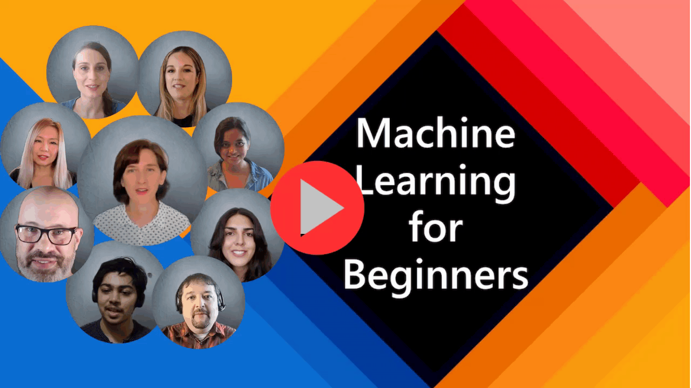

# Kujifunza Mashine kwa Anayeanza - Mtaala

> 🌍 Safiri duniani tunapochunguza Kujifunza Mashine kupitia tamaduni za ulimwengu 🌍

Wataalam wa Cloud katika Microsoft wana furaha kutoa mtaala wa wiki 12, masomo 26 kuhusu **Kujifunza Mashine**. Katika mtaala huu, utajifunza kuhusu kile kinachoitwa **kujifunza mashine kwa kawaida**, ukitumia Scikit-learn kama maktaba na kuepuka kujifunza kwa kina, ambayo inashughulikiwa katika [mtaala wetu wa AI kwa Anayeanza](https://aka.ms/ai4beginners). Unganisha masomo haya na mtaala wetu wa ['Sayansi ya Takwimu kwa Anayeanza'](https://aka.ms/ds4beginners), pia!

Safiri nasi kote ulimwenguni tunapotumia mbinu hizi za kawaida kwa data kutoka maeneo mbalimbali ya ulimwengu. Kila somo linajumuisha maswali kabla na baada ya somo, maelekezo ya maandishi ya kukamilisha somo, suluhisho, kazi, na zaidi. Pedagogi yetu inayozingatia miradi inakuwezesha kujifunza wakati wa kujenga, njia iliyothibitishwa ya kuifanya ujuzi mpya 'kubaki'.

**✍️ Shukrani za dhati kwa waandishi wetu** Jen Looper, Stephen Howell, Francesca Lazzeri, Tomomi Imura, Cassie Breviu, Dmitry Soshnikov, Chris Noring, Anirban Mukherjee, Ornella Altunyan, Ruth Yakubu na Amy Boyd

**🎨 Shukrani pia kwa wachora picha wetu** Tomomi Imura, Dasani Madipalli, na Jen Looper

**🙏 Shukrani maalum 🙏 kwa waandishi wa Microsoft Student Ambassador, wakaguzi, na wachangiaji wa maudhui**, hasa Rishit Dagli, Muhammad Sakib Khan Inan, Rohan Raj, Alexandru Petrescu, Abhishek Jaiswal, Nawrin Tabassum, Ioan Samuila, na Snigdha Agarwal

**🤩 Shukrani za ziada kwa Microsoft Student Ambassadors Eric Wanjau, Jasleen Sondhi, na Vidushi Gupta kwa masomo yetu ya R!**

# Kuanza

Fuata hatua hizi:
1. **Fork Repository**: Bonyeza kitufe cha "Fork" kwenye kona ya juu-kulia ya ukurasa huu.
2. **Clone Repository**:   `git clone https://github.com/microsoft/ML-For-Beginners.git`

> [pata rasilimali zote za ziada kwa kozi hii katika mkusanyiko wetu wa Microsoft Learn](https://learn.microsoft.com/en-us/collections/qrqzamz1nn2wx3?WT.mc_id=academic-77952-bethanycheum)

**[Wanafunzi](https://aka.ms/student-page)**, kutumia mtaala huu, fanya fork ya repo nzima kwenye akaunti yako ya GitHub na kamilisha mazoezi mwenyewe au na kikundi:

- Anza na jaribio la awali la somo.
- Soma somo na kamilisha shughuli, ukisimama na kutafakari katika kila ukaguzi wa maarifa.
- Jaribu kuunda miradi kwa kuelewa masomo badala ya kuendesha msimbo wa suluhisho; hata hivyo msimbo huo unapatikana katika `/solution` folda katika kila somo linalohusiana na mradi.
- Chukua jaribio la baada ya somo.
- Kamilisha changamoto.
- Kamilisha kazi.
- Baada ya kukamilisha kikundi cha somo, tembelea [Bodi ya Majadiliano](https://github.com/microsoft/ML-For-Beginners/discussions) na "jifunze kwa sauti" kwa kujaza rubriki ya PAT inayofaa. 'PAT' ni Chombo cha Tathmini ya Maendeleo ambacho ni rubriki unayojaza ili kuendeleza ujifunzaji wako. Unaweza pia kuitikia PAT zingine ili tujifunze pamoja.

> Kwa masomo zaidi, tunapendekeza kufuata moduli na njia za kujifunza hizi za [Microsoft Learn](https://docs.microsoft.com/en-us/users/jenlooper-2911/collections/k7o7tg1gp306q4?WT.mc_id=academic-77952-leestott).

**Walimu**, tumejumuisha [mapendekezo kadhaa](for-teachers.md) kuhusu jinsi ya kutumia mtaala huu.

---

## Maelezo ya Video

Baadhi ya masomo yanapatikana kama video fupi. Unaweza kupata hizi zote ndani ya masomo, au kwenye [orodha ya kucheza ya ML kwa Anayeanza kwenye kituo cha YouTube cha Microsoft Developer](https://aka.ms/ml-beginners-videos) kwa kubonyeza picha hapa chini.

---

## Kutana na Timu

**Gif na** [Mohit Jaisal](https://linkedin.com/in/mohitjaisal)

> 🎥 Bonyeza picha hapo juu kwa video kuhusu mradi na watu waliouunda!

---

## Pedagogi

Tumechagua kanuni mbili za kipedagogia wakati wa kujenga mtaala huu: kuhakikisha kuwa ni ya vitendo **inayozingatia miradi** na kwamba inajumuisha **maswali ya mara kwa mara**. Zaidi ya hayo, mtaala huu una **mandhari** ya kawaida ili kuupa mshikamano.

Kwa kuhakikisha kuwa maudhui yanaendana na miradi, mchakato unakuwa wa kuvutia zaidi kwa wanafunzi na uhifadhi wa dhana utaongezeka. Zaidi ya hayo, jaribio la hatari ndogo kabla ya darasa linaweka nia ya mwanafunzi kuelekea kujifunza mada, wakati jaribio la pili baada ya darasa linaongeza uhifadhi zaidi. Mtaala huu uliundwa kuwa rahisi na wa kufurahisha na unaweza kuchukuliwa kwa ujumla au sehemu. Miradi huanza ndogo na kuwa ngumu zaidi mwishoni mwa mzunguko wa wiki 12. Mtaala huu pia unajumuisha maelezo ya matumizi ya kweli ya ML, ambayo yanaweza kutumika kama ziada ya mkopo au kama msingi wa majadiliano.

> Pata [Kanuni zetu za Maadili](CODE_OF_CONDUCT.md), [Kuchangia](CONTRIBUTING.md), na [Miongozo ya Tafsiri](TRANSLATIONS.md). Tunakaribisha maoni yako ya kujenga!

## Kila somo linajumuisha

- sketchnote ya hiari
- video ya ziada ya hiari
- maelezo ya video (masomo mengine tu)
- jaribio la joto la kabla ya somo
- somo la maandishi
- kwa masomo yanayozingatia mradi, miongozo ya hatua kwa hatua juu ya jinsi ya kujenga mradi
- ukaguzi wa maarifa
- changamoto
- kusoma kwa ziada
- kazi
- jaribio la baada ya somo

> **Maelezo kuhusu lugha**: Masomo haya yameandikwa kimsingi kwa Python, lakini mengi yanapatikana pia kwa R. Ili kukamilisha somo la R, nenda kwenye folda ya `/solution` na tafuta masomo ya R. Yanajumuisha kiendelezi cha .rmd ambacho kinaonyesha faili ya **R Markdown** ambayo inaweza kuelezewa kwa urahisi kama kuingiza `code chunks` (ya R au lugha nyingine) na `YAML header` (inayoongoza jinsi ya kuunda matokeo kama PDF) katika `Markdown document`. Kwa hivyo, inatumika kama mfumo wa uandishi wa mfano kwa sayansi ya data kwani inakuwezesha kuchanganya msimbo wako, matokeo yake, na mawazo yako kwa kuandika kwa Markdown. Zaidi ya hayo, hati za R Markdown zinaweza kutolewa kwa fomati za matokeo kama PDF, HTML, au Word.

> **Maelezo kuhusu maswali**: Maswali yote yamo kwenye [folda ya Quiz App](../../quiz-app), kwa jumla ya maswali 52 ya maswali matatu kila moja. Yameunganishwa kutoka ndani ya masomo lakini programu ya maswali inaweza kuendeshwa kwa ndani; fuata maagizo katika folda ya `quiz-app` kuendesha kwa ndani au kupeleka kwenye Azure.

| Nambari ya Somo |                             Mada                              |                   Kundi la Somo                   | Malengo ya Kujifunza                                                                                                             |                                                              Somo lililounganishwa                                                               |                        Mwandishi                        |
| :-----------: | :------------------------------------------------------------: | :-------------------------------------------------: | ------------------------------------------------------------------------------------------------------------------------------- | :--------------------------------------------------------------------------------------------------------------------------------------: | :--------------------------------------------------: |
|      01       |                Utangulizi wa kujifunza mashine                |      [Utangulizi](1-Introduction/README.md)       | Jifunze dhana za msingi za kujifunza mashine                                                                                |                                             [Somo](1-Introduction/1-intro-to-ML/README.md)                                             |                       Muhammad                       |
|      02       |                Historia ya kujifunza mashine                 |      [Utangulizi](1-Introduction/README.md)       | Jifunze historia inayoelezea uwanja huu                                                                                         |                                            [Somo](1-Introduction/2-history-of-ML/README.md)                                            |                     Jen na Amy                      |
|      03       |                 Usawa na kujifunza mashine                  |      [Utangulizi](1-Introduction/README.md)       | Masuala muhimu ya kifalsafa kuhusu usawa ambayo wanafunzi wanapaswa kuzingatia wanapojenga na kutumia mifano ya ML? |                                              [Somo](1-Introduction/3-fairness/README.md)                                               |                        Tomomi                        |
|      04       |                Mbinu za kujifunza kwa mashine                 |      [Introduction](1-Introduction/README.md)       | Je, watafiti wa ML wanatumia mbinu gani kujenga mifano ya ML?                                                                       |                                          [Lesson](1-Introduction/4-techniques-of-ML/README.md)                                           |                    Chris na Jen                     |
|      05       |                   Utangulizi wa regression                   |        [Regression](2-Regression/README.md)         | Anza na Python na Scikit-learn kwa mifano ya regression                                                                  |         <ul><li>[Python](2-Regression/1-Tools/README.md)</li><li>[R](../../2-Regression/1-Tools/solution/R/lesson_1.html)</li></ul>         |      <ul><li>Jen</li><li>Eric Wanjau</li></ul>       |
|      06       |                Bei za malenge Amerika Kaskazini 🎃                |        [Regression](2-Regression/README.md)         | Angalia na safisha data kwa maandalizi ya ML                                                                                  |          <ul><li>[Python](2-Regression/2-Data/README.md)</li><li>[R](../../2-Regression/2-Data/solution/R/lesson_2.html)</li></ul>          |      <ul><li>Jen</li><li>Eric Wanjau</li></ul>       |
|      07       |                Bei za malenge Amerika Kaskazini 🎃                |        [Regression](2-Regression/README.md)         | Jenga mifano ya regression ya mstari na polynomial                                                                                   |        <ul><li>[Python](2-Regression/3-Linear/README.md)</li><li>[R](../../2-Regression/3-Linear/solution/R/lesson_3.html)</li></ul>        |      <ul><li>Jen na Dmitry</li><li>Eric Wanjau</li></ul>       |
|      08       |                Bei za malenge Amerika Kaskazini 🎃                |        [Regression](2-Regression/README.md)         | Jenga mfano wa regression wa logistic                                                                                               |     <ul><li>[Python](2-Regression/4-Logistic/README.md) </li><li>[R](../../2-Regression/4-Logistic/solution/R/lesson_4.html)</li></ul>      |      <ul><li>Jen</li><li>Eric Wanjau</li></ul>       |
|      09       |                          Programu ya Wavuti 🔌                          |           [Web App](3-Web-App/README.md)            | Jenga programu ya wavuti kutumia mfano wako uliyojifunza                                                                                       |                                                 [Python](3-Web-App/1-Web-App/README.md)                                                  |                         Jen                          |
|      10       |                 Utangulizi wa uainishaji                 |    [Classification](4-Classification/README.md)     | Safisha, andaa, na onyesha data yako; utangulizi wa uainishaji                                                            | <ul><li> [Python](4-Classification/1-Introduction/README.md) </li><li>[R](../../4-Classification/1-Introduction/solution/R/lesson_10.html)  | <ul><li>Jen na Cassie</li><li>Eric Wanjau</li></ul> |
|      11       |             Vyakula vitamu vya Asia na India 🍜             |    [Classification](4-Classification/README.md)     | Utangulizi wa classifiers                                                                                                     | <ul><li> [Python](4-Classification/2-Classifiers-1/README.md)</li><li>[R](../../4-Classification/2-Classifiers-1/solution/R/lesson_11.html) | <ul><li>Jen na Cassie</li><li>Eric Wanjau</li></ul> |
|      12       |             Vyakula vitamu vya Asia na India 🍜             |    [Classification](4-Classification/README.md)     | Classifiers zaidi                                                                                                                | <ul><li> [Python](4-Classification/3-Classifiers-2/README.md)</li><li>[R](../../4-Classification/3-Classifiers-2/solution/R/lesson_12.html) | <ul><li>Jen na Cassie</li><li>Eric Wanjau</li></ul> |
|      13       |             Vyakula vitamu vya Asia na India 🍜             |    [Classification](4-Classification/README.md)     | Jenga programu ya wavuti ya kutoa mapendekezo kutumia mfano wako                                                                                    |                                              [Python](4-Classification/4-Applied/README.md)                                              |                         Jen                          |
|      14       |                   Utangulizi wa clustering                   |        [Clustering](5-Clustering/README.md)         | Safisha, andaa, na onyesha data yako; Utangulizi wa clustering                                                                |         <ul><li> [Python](5-Clustering/1-Visualize/README.md)</li><li>[R](../../5-Clustering/1-Visualize/solution/R/lesson_14.html)         |      <ul><li>Jen</li><li>Eric Wanjau</li></ul>       |
|      15       |              Kuchunguza Ladha za Muziki wa Nigeria 🎧              |        [Clustering](5-Clustering/README.md)         | Chunguza mbinu ya K-Means clustering                                                                                           |           <ul><li> [Python](5-Clustering/2-K-Means/README.md)</li><li>[R](../../5-Clustering/2-K-Means/solution/R/lesson_15.html)           |      <ul><li>Jen</li><li>Eric Wanjau</li></ul>       |
|      16       |        Utangulizi wa usindikaji wa lugha asilia ☕️         |   [Natural language processing](6-NLP/README.md)    | Jifunze misingi ya NLP kwa kujenga bot rahisi                                                                             |                                             [Python](6-NLP/1-Introduction-to-NLP/README.md)                                              |                       Stephen                        |
|      17       |                      Majukumu ya kawaida ya NLP ☕️                      |   [Natural language processing](6-NLP/README.md)    | Zidi kuelewa NLP kwa kuelewa majukumu ya kawaida yanayohitajika unaposhughulikia miundo ya lugha                          |                                                    [Python](6-NLP/2-Tasks/README.md)                                                     |                       Stephen                        |
|      18       |             Tafsiri na uchambuzi wa hisia ♥️              |   [Natural language processing](6-NLP/README.md)    | Tafsiri na uchambuzi wa hisia na Jane Austen                                                                             |                                            [Python](6-NLP/3-Translation-Sentiment/README.md)                                             |                       Stephen                        |
|      19       |                  Hoteli za Kimapenzi za Ulaya ♥️                  |   [Natural language processing](6-NLP/README.md)    | Uchambuzi wa hisia na maoni ya hoteli 1                                                                                         |                                               [Python](6-NLP/4-Hotel-Reviews-1/README.md)                                                |                       Stephen                        |
|      20       |                  Hoteli za Kimapenzi za Ulaya ♥️                  |   [Natural language processing](6-NLP/README.md)    | Uchambuzi wa hisia na maoni ya hoteli 2                                                                                         |                                               [Python](6-NLP/5-Hotel-Reviews-2/README.md)                                                |                       Stephen                        |
|      21       |            Utangulizi wa utabiri wa mfululizo wa muda             |        [Time series](7-TimeSeries/README.md)        | Utangulizi wa utabiri wa mfululizo wa muda                                                                                         |                                             [Python](7-TimeSeries/1-Introduction/README.md)                                              |                      Francesca                       |
|      22       | ⚡️ Matumizi ya Nguvu Duniani ⚡️ - utabiri wa mfululizo wa muda na ARIMA |        [Time series](7-TimeSeries/README.md)        | Utabiri wa mfululizo wa muda na ARIMA                                                                                              |                                                 [Python](7-TimeSeries/2-ARIMA/README.md)                                                 |                      Francesca                       |
|      23       |  ⚡️ Matumizi ya Nguvu Duniani ⚡️ - utabiri wa mfululizo wa muda na SVR  |        [Time series](7-TimeSeries/README.md)        | Utabiri wa mfululizo wa muda na Support Vector Regressor                                                                           |                                                  [Python](7-TimeSeries/3-SVR/README.md)                                                  |                       Anirban                        |
|      24       |             Utangulizi wa kujifunza kwa kuimarisha             | [Reinforcement learning](8-Reinforcement/README.md) | Utangulizi wa kujifunza kwa kuimarisha na Q-Learning                                                                          |                                             [Python](8-Reinforcement/1-QLearning/README.md)                                              |                        Dmitry                        |
|      25       |                 Msaidie Peter kuepuka mbwa mwitu! 🐺                  | [Reinforcement learning](8-Reinforcement/README.md) | Gym ya kujifunza kwa kuimarisha                                                                                                      |                                                [Python](8-Reinforcement/2-Gym/README.md)                                                 |                        Dmitry                        |
|  Postscript   |            Matukio na matumizi halisi ya ML            |      [ML in the Wild](9-Real-World/README.md)       | Matumizi ya kuvutia na kufichua ya ulimwengu halisi ya ML ya kimsingi                                                               |                                             [Lesson](9-Real-World/1-Applications/README.md)                                              |                         Team                         |
|  Postscript   |            Urekebishaji wa Modeli katika ML kwa kutumia dashibodi ya RAI          |      [ML in the Wild](9-Real-World/README.md)       | Urekebishaji wa Modeli katika Kujifunza kwa Mashine kwa kutumia vipengele vya dashibodi ya AI inayowajibika                                                              |                                             [Lesson](9-Real-World/2-Debugging-ML-Models/README.md)                                              |                         Ruth Yakubu                       |

> [pata rasilimali zote za ziada za kozi hii kwenye mkusanyiko wetu wa Microsoft Learn](https://learn.microsoft.com/en-us/collections/qrqzamz1nn2wx3?WT.mc_id=academic-77952-bethanycheum)

## Ufikiaji wa nje ya mtandao

Unaweza kuendesha nyaraka hizi nje ya mtandao kwa kutumia [Docsify](https://docsify.js.org/#/). Fork repo hii, [sakinisha Docsify](https://docsify.js.org/#/quickstart) kwenye mashine yako ya ndani, na kisha kwenye folda ya mizizi ya repo hii, andika `docsify serve`. Tovuti itahudumiwa kwenye bandari 3000 kwenye localhost yako: `localhost:3000`.

## PDFs
Pata nakala ya pdf ya mtaala na viungo [hapa](https://microsoft.github.io/ML-For-Beginners/pdf/readme.pdf).

## Msaada Unahitajika

Ungependa kuchangia tafsiri? Tafadhali soma [miongozo yetu ya tafsiri](TRANSLATIONS.md) na ongeza suala lililotayarishwa ili kusimamia mzigo wa kazi [hapa](https://github.com/microsoft/ML-For-Beginners/issues).

## Mitaala Mingine

Timu yetu inazalisha mitaala mingine! Angalia:

- [AI kwa Kompyuta](https://aka.ms/ai4beginners)
- [Sayansi ya Takwimu kwa Kompyuta](https://aka.ms/datascience-beginners)
- [**Toleo Jipya 2.0** - AI ya Kizazi kwa Kompyuta](https://aka.ms/genai-beginners)
- [**JIPYA** Usalama wa Mtandao kwa Kompyuta](https://github.com/microsoft/Security-101??WT.mc_id=academic-96948-sayoung)
- [Maendeleo ya Wavuti kwa Kompyuta](https://aka.ms/webdev-beginners)
- [IoT kwa Kompyuta](https://aka.ms/iot-beginners)
- [Ujifunzaji wa Mashine kwa Kompyuta](https://aka.ms/ml4beginners)
- [Maendeleo ya XR kwa Kompyuta](https://aka.ms/xr-dev-for-beginners)
- [Kumudu GitHub Copilot kwa Uprogramishaji wa Pamoja wa AI](https://aka.ms/GitHubCopilotAI)

**Kanusho**:
Hati hii imetafsiriwa kwa kutumia huduma za tafsiri za AI zinazotumia mashine. Ingawa tunajitahidi kwa usahihi, tafadhali fahamu kuwa tafsiri za kiotomatiki zinaweza kuwa na makosa au upungufu wa usahihi. Hati asilia katika lugha yake ya asili inapaswa kuzingatiwa kama chanzo cha mamlaka. Kwa taarifa muhimu, inashauriwa kutumia tafsiri ya kibinadamu ya kitaalamu. Hatutawajibika kwa kutoelewana au tafsiri zisizo sahihi zinazotokana na matumizi ya tafsiri hii.