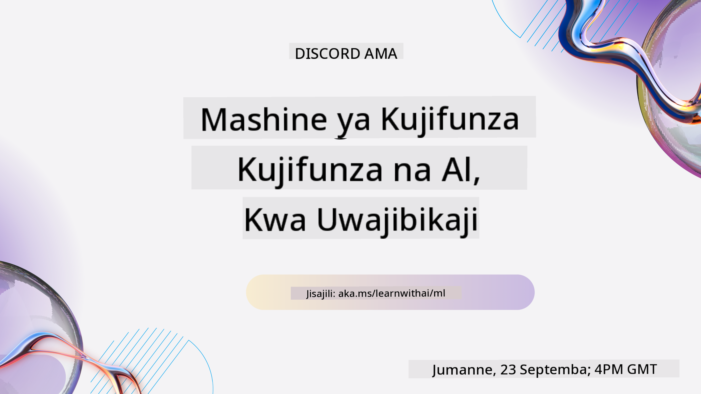

<!--
CO_OP_TRANSLATOR_METADATA:
{
  "original_hash": "7a13afb3674838f557d61f8d67e4d5f8",
  "translation_date": "2025-10-24T09:18:43+00:00",
  "source_file": "README.md",
  "language_code": "sw"
}
-->

### 🌐 Msaada wa Lugha Nyingi

#### Inasaidiwa kupitia GitHub Action (Imefanywa Kiotomatiki & Daima Imeboreshwa)

<!-- CO-OP TRANSLATOR LANGUAGES TABLE START -->
[Arabic](../ar/README.md) | [Bengali](../bn/README.md) | [Bulgarian](../bg/README.md) | [Burmese (Myanmar)](../my/README.md) | [Chinese (Simplified)](../zh/README.md) | [Chinese (Traditional, Hong Kong)](../hk/README.md) | [Chinese (Traditional, Macau)](../mo/README.md) | [Chinese (Traditional, Taiwan)](../tw/README.md) | [Croatian](../hr/README.md) | [Czech](../cs/README.md) | [Danish](../da/README.md) | [Dutch](../nl/README.md) | [Estonian](../et/README.md) | [Finnish](../fi/README.md) | [French](../fr/README.md) | [German](../de/README.md) | [Greek](../el/README.md) | [Hebrew](../he/README.md) | [Hindi](../hi/README.md) | [Hungarian](../hu/README.md) | [Indonesian](../id/README.md) | [Italian](../it/README.md) | [Japanese](../ja/README.md) | [Korean](../ko/README.md) | [Lithuanian](../lt/README.md) | [Malay](../ms/README.md) | [Marathi](../mr/README.md) | [Nepali](../ne/README.md) | [Norwegian](../no/README.md) | [Persian (Farsi)](../fa/README.md) | [Polish](../pl/README.md) | [Portuguese (Brazil)](../br/README.md) | [Portuguese (Portugal)](../pt/README.md) | [Punjabi (Gurmukhi)](../pa/README.md) | [Romanian](../ro/README.md) | [Russian](../ru/README.md) | [Serbian (Cyrillic)](../sr/README.md) | [Slovak](../sk/README.md) | [Slovenian](../sl/README.md) | [Spanish](../es/README.md) | [Swahili](./README.md) | [Swedish](../sv/README.md) | [Tagalog (Filipino)](../tl/README.md) | [Tamil](../ta/README.md) | [Thai](../th/README.md) | [Turkish](../tr/README.md) | [Ukrainian](../uk/README.md) | [Urdu](../ur/README.md) | [Vietnamese](../vi/README.md)
<!-- CO-OP TRANSLATOR LANGUAGES TABLE END -->

#### Jiunge na Jamii Yetu

Tuna mfululizo wa kujifunza na AI kwenye Discord unaoendelea, jifunze zaidi na jiunge nasi katika [Learn with AI Series](https://aka.ms/learnwithai/discord) kuanzia tarehe 18 - 30 Septemba, 2025. Utapata vidokezo na mbinu za kutumia GitHub Copilot kwa Sayansi ya Takwimu.

# Kujifunza Mashine kwa Kompyuta kwa Anayeanza - Mtaala

> 🌍 Safiri kote ulimwenguni tunapochunguza Kujifunza Mashine kupitia tamaduni za dunia 🌍

Wakili wa Wingu wa Microsoft wana furaha kutoa mtaala wa wiki 12, masomo 26 kuhusu **Kujifunza Mashine**. Katika mtaala huu, utajifunza kuhusu kile kinachoitwa mara nyingine **kujifunza mashine ya kawaida**, ukitumia hasa maktaba ya Scikit-learn na kuepuka kujifunza kwa kina, ambako kunashughulikiwa katika [mtaala wa AI kwa Anayeanza](https://aka.ms/ai4beginners). Unganisha masomo haya na mtaala wetu wa ['Sayansi ya Takwimu kwa Anayeanza'](https://aka.ms/ds4beginners), pia!

Safiri nasi kote ulimwenguni tunapotumia mbinu hizi za kawaida kwa data kutoka maeneo mengi ya dunia. Kila somo linajumuisha maswali ya kabla na baada ya somo, maelekezo yaliyoandikwa ya kukamilisha somo, suluhisho, kazi, na zaidi. Njia yetu ya kujifunza kwa msingi wa miradi inakuwezesha kujifunza huku ukijenga, njia iliyothibitishwa ya kufanya ujuzi mpya 'kubaki'.

**✍️ Shukrani za dhati kwa waandishi wetu** Jen Looper, Stephen Howell, Francesca Lazzeri, Tomomi Imura, Cassie Breviu, Dmitry Soshnikov, Chris Noring, Anirban Mukherjee, Ornella Altunyan, Ruth Yakubu na Amy Boyd

**🎨 Shukrani pia kwa wachoraji wetu** Tomomi Imura, Dasani Madipalli, na Jen Looper

**🙏 Shukrani maalum 🙏 kwa waandishi, wakaguzi, na wachangiaji wa maudhui wa Microsoft Student Ambassador**, hasa Rishit Dagli, Muhammad Sakib Khan Inan, Rohan Raj, Alexandru Petrescu, Abhishek Jaiswal, Nawrin Tabassum, Ioan Samuila, na Snigdha Agarwal

**🤩 Shukrani za ziada kwa Microsoft Student Ambassadors Eric Wanjau, Jasleen Sondhi, na Vidushi Gupta kwa masomo yetu ya R!**

# Kuanza

Fuata hatua hizi:
1. **Fork Hifadhi**: Bonyeza kitufe cha "Fork" kwenye kona ya juu-kulia ya ukurasa huu.
2. **Clone Hifadhi**:   `git clone https://github.com/microsoft/ML-For-Beginners.git`

> [pata rasilimali zote za ziada kwa kozi hii katika mkusanyiko wetu wa Microsoft Learn](https://learn.microsoft.com/en-us/collections/qrqzamz1nn2wx3?WT.mc_id=academic-77952-bethanycheum)

> 🔧 **Unahitaji msaada?** Angalia [Mwongozo wa Kutatua Tatizo](TROUBLESHOOTING.md) kwa suluhisho za masuala ya kawaida ya usakinishaji, usanidi, na kuendesha masomo.

**[Wanafunzi](https://aka.ms/student-page)**, ili kutumia mtaala huu, fork hifadhi nzima kwenye akaunti yako ya GitHub na ukamilishe mazoezi peke yako au na kikundi:

- Anza na jaribio la kabla ya somo.
- Soma somo na ukamilishe shughuli, ukisimama na kutafakari kila ukaguzi wa maarifa.
- Jaribu kuunda miradi kwa kuelewa masomo badala ya kuendesha msimbo wa suluhisho; hata hivyo msimbo huo unapatikana katika folda za `/solution` katika kila somo linalotegemea mradi.
- Fanya jaribio la baada ya somo.
- Kamilisha changamoto.
- Kamilisha kazi.
- Baada ya kukamilisha kikundi cha masomo, tembelea [Bodi ya Majadiliano](https://github.com/microsoft/ML-For-Beginners/discussions) na "jifunze kwa sauti" kwa kujaza rubriki ya PAT inayofaa. 'PAT' ni Chombo cha Tathmini ya Maendeleo ambacho ni rubriki unayojaza ili kuendeleza kujifunza kwako. Unaweza pia kujibu PAT nyingine ili tujifunze pamoja.

> Kwa masomo zaidi, tunapendekeza kufuata moduli na njia za kujifunza za [Microsoft Learn](https://docs.microsoft.com/en-us/users/jenlooper-2911/collections/k7o7tg1gp306q4?WT.mc_id=academic-77952-leestott).

**Walimu**, tumetoa [mapendekezo kadhaa](for-teachers.md) kuhusu jinsi ya kutumia mtaala huu.

---

## Maelezo ya Video

Baadhi ya masomo yanapatikana kama video fupi. Unaweza kupata zote hizi ndani ya masomo, au kwenye [orodha ya ML kwa Anayeanza kwenye kituo cha YouTube cha Microsoft Developer](https://aka.ms/ml-beginners-videos) kwa kubonyeza picha hapa chini.

---

## Kutana na Timu

**Gif na** [Mohit Jaisal](https://linkedin.com/in/mohitjaisal)

> 🎥 Bonyeza picha hapo juu kwa video kuhusu mradi na watu waliouunda!

---

## Pedagogia

Tumechagua kanuni mbili za kipedagogia wakati wa kujenga mtaala huu: kuhakikisha kuwa ni wa vitendo **unaotegemea miradi** na kwamba unajumuisha **maswali ya mara kwa mara**. Aidha, mtaala huu una **mada ya kawaida** ili kuupa mshikamano.

Kwa kuhakikisha kuwa maudhui yanalingana na miradi, mchakato unakuwa wa kuvutia zaidi kwa wanafunzi na uhifadhi wa dhana utaongezeka. Aidha, jaribio la hatari ndogo kabla ya darasa linaweka nia ya mwanafunzi kuelekea kujifunza mada, wakati jaribio la pili baada ya darasa linahakikisha uhifadhi zaidi. Mtaala huu ulitengenezwa kuwa rahisi na wa kufurahisha na unaweza kuchukuliwa kwa ukamilifu au kwa sehemu. Miradi huanza ndogo na kuwa ngumu zaidi kufikia mwisho wa mzunguko wa wiki 12. Mtaala huu pia unajumuisha maelezo ya matumizi halisi ya ML, ambayo yanaweza kutumika kama alama za ziada au kama msingi wa majadiliano.

> Pata [Kanuni za Maadili](CODE_OF_CONDUCT.md), [Mchango](CONTRIBUTING.md), [Tafsiri](TRANSLATIONS.md), na miongozo ya [Kutatua Tatizo](TROUBLESHOOTING.md). Tunakaribisha maoni yako ya kujenga!

## Kila somo linajumuisha

- sketchnote ya hiari
- video ya ziada ya hiari
- maelezo ya video (baadhi ya masomo tu)
- [jaribio la joto la kabla ya somo](https://ff-quizzes.netlify.app/en/ml/)
- somo lililoandikwa
- kwa masomo yanayotegemea mradi, mwongozo wa hatua kwa hatua wa jinsi ya kujenga mradi
- ukaguzi wa maarifa
- changamoto
- usomaji wa ziada
- kazi
- [jaribio la baada ya somo](https://ff-quizzes.netlify.app/en/ml/)

> **Kumbuka kuhusu lugha**: Masomo haya yameandikwa hasa kwa Python, lakini mengi pia yanapatikana kwa R. Ili kukamilisha somo la R, nenda kwenye folda ya `/solution` na tafuta masomo ya R. Yanajumuisha kiendelezi cha .rmd ambacho kinawakilisha faili ya **R Markdown** ambayo inaweza kufafanuliwa kwa urahisi kama kuingiza `vipande vya msimbo` (wa R au lugha nyingine) na `kichwa cha YAML` (kinachoongoza jinsi ya kuunda matokeo kama PDF) katika `hati ya Markdown`. Kwa hivyo, inatumika kama mfumo bora wa uandishi kwa sayansi ya takwimu kwani inakuwezesha kuchanganya msimbo wako, matokeo yake, na mawazo yako kwa kukuruhusu kuyaandika kwa Markdown. Zaidi ya hayo, hati za R Markdown zinaweza kutolewa kwa fomati za matokeo kama PDF, HTML, au Word.

> **Kumbuka kuhusu maswali**: Maswali yote yamejumuishwa katika [folda ya Quiz App](../../quiz-app), kwa jumla ya maswali 52 ya maswali matatu kila moja. Yameunganishwa kutoka ndani ya masomo lakini programu ya maswali inaweza kuendeshwa ndani; fuata maelekezo katika folda ya `quiz-app` kuendesha ndani au kupeleka kwenye Azure.

| Nambari ya Somo |                             Mada                              |                   Kikundi cha Masomo                   | Malengo ya Kujifunza                                                                                                             |                                                              Somo Lililounganishwa                                                               |                        Mwandishi                        |
| :-----------: | :------------------------------------------------------------: | :-------------------------------------------------: | ------------------------------------------------------------------------------------------------------------------------------- | :--------------------------------------------------------------------------------------------------------------------------------------: | :--------------------------------------------------: |
|      01       |                Utangulizi wa kujifunza kwa mashine                |      [Utangulizi](1-Introduction/README.md)       | Jifunze dhana za msingi za kujifunza kwa mashine                                                                                |                                             [Somo](1-Introduction/1-intro-to-ML/README.md)                                             |                       Muhammad                       |
|      02       |                Historia ya kujifunza kwa mashine                 |      [Utangulizi](1-Introduction/README.md)       | Jifunze historia ya uwanja huu                                                                                         |                                            [Somo](1-Introduction/2-history-of-ML/README.md)                                            |                     Jen na Amy                      |
|      03       |                 Usawa na kujifunza kwa mashine                  |      [Utangulizi](1-Introduction/README.md)       | Ni masuala gani muhimu ya kifalsafa kuhusu usawa ambayo wanafunzi wanapaswa kuzingatia wanapojenga na kutumia mifano ya ML? |                                              [Somo](1-Introduction/3-fairness/README.md)                                               |                        Tomomi                        |
|      04       |                Mbinu za kujifunza kwa mashine                 |      [Utangulizi](1-Introduction/README.md)       | Ni mbinu gani watafiti wa ML hutumia kujenga mifano ya ML?                                                                       |                                          [Somo](1-Introduction/4-techniques-of-ML/README.md)                                           |                    Chris na Jen                     |
|      05       |                   Utangulizi wa regression                   |        [Regression](2-Regression/README.md)         | Anza na Python na Scikit-learn kwa mifano ya regression                                                                  |         [Python](2-Regression/1-Tools/README.md) • [R](../../2-Regression/1-Tools/solution/R/lesson_1.html)         |      Jen • Eric Wanjau       |
|      06       |                Bei za malenge Amerika Kaskazini 🎃                |        [Regression](2-Regression/README.md)         | Angalia na safisha data kwa maandalizi ya ML                                                                                  |          [Python](2-Regression/2-Data/README.md) • [R](../../2-Regression/2-Data/solution/R/lesson_2.html)          |      Jen • Eric Wanjau       |
|      07       |                Bei za malenge Amerika Kaskazini 🎃                |        [Regression](2-Regression/README.md)         | Jenga mifano ya regression ya mstari na polynomial                                                                                   |        [Python](2-Regression/3-Linear/README.md) • [R](../../2-Regression/3-Linear/solution/R/lesson_3.html)        |      Jen na Dmitry • Eric Wanjau       |
|      08       |                Bei za malenge Amerika Kaskazini 🎃                |        [Regression](2-Regression/README.md)         | Jenga mfano wa regression ya logistic                                                                                               |     [Python](2-Regression/4-Logistic/README.md) • [R](../../2-Regression/4-Logistic/solution/R/lesson_4.html)      |      Jen • Eric Wanjau       |
|      09       |                          Programu ya Wavuti 🔌                          |           [Programu ya Wavuti](3-Web-App/README.md)            | Jenga programu ya wavuti kutumia mfano uliyojifunza                                                                                       |                                                 [Python](3-Web-App/1-Web-App/README.md)                                                  |                         Jen                          |
|      10       |                 Utangulizi wa classification                 |    [Classification](4-Classification/README.md)     | Safisha, andaa, na angalia data yako; utangulizi wa classification                                                            | [Python](4-Classification/1-Introduction/README.md) • [R](../../4-Classification/1-Introduction/solution/R/lesson_10.html)  | Jen na Cassie • Eric Wanjau |
|      11       |             Vyakula vitamu vya Asia na India 🍜             |    [Classification](4-Classification/README.md)     | Utangulizi wa classifiers                                                                                                     | [Python](4-Classification/2-Classifiers-1/README.md) • [R](../../4-Classification/2-Classifiers-1/solution/R/lesson_11.html) | Jen na Cassie • Eric Wanjau |
|      12       |             Vyakula vitamu vya Asia na India 🍜             |    [Classification](4-Classification/README.md)     | Classifiers zaidi                                                                                                                | [Python](4-Classification/3-Classifiers-2/README.md) • [R](../../4-Classification/3-Classifiers-2/solution/R/lesson_12.html) | Jen na Cassie • Eric Wanjau |
|      13       |             Vyakula vitamu vya Asia na India 🍜             |    [Classification](4-Classification/README.md)     | Jenga programu ya wavuti ya mapendekezo ukitumia mfano wako                                                                                    |                                              [Python](4-Classification/4-Applied/README.md)                                              |                         Jen                          |
|      14       |                   Utangulizi wa clustering                   |        [Clustering](5-Clustering/README.md)         | Safisha, andaa, na angalia data yako; Utangulizi wa clustering                                                                |         [Python](5-Clustering/1-Visualize/README.md) • [R](../../5-Clustering/1-Visualize/solution/R/lesson_14.html)         |      Jen • Eric Wanjau       |
|      15       |              Kuchunguza ladha za muziki wa Nigeria 🎧              |        [Clustering](5-Clustering/README.md)         | Chunguza mbinu ya clustering ya K-Means                                                                                           |           [Python](5-Clustering/2-K-Means/README.md) • [R](../../5-Clustering/2-K-Means/solution/R/lesson_15.html)           |      Jen • Eric Wanjau       |
|      16       |        Utangulizi wa usindikaji wa lugha asilia ☕️         |   [Usindikaji wa lugha asilia](6-NLP/README.md)    | Jifunze misingi ya NLP kwa kujenga bot rahisi                                                                             |                                             [Python](6-NLP/1-Introduction-to-NLP/README.md)                                              |                       Stephen                        |
|      17       |                      Kazi za kawaida za NLP ☕️                      |   [Usindikaji wa lugha asilia](6-NLP/README.md)    | Panua maarifa yako ya NLP kwa kuelewa kazi za kawaida zinazohitajika unaposindika miundo ya lugha                          |                                                    [Python](6-NLP/2-Tasks/README.md)                                                     |                       Stephen                        |
|      18       |             Tafsiri na uchambuzi wa hisia ♥️              |   [Usindikaji wa lugha asilia](6-NLP/README.md)    | Tafsiri na uchambuzi wa hisia na Jane Austen                                                                             |                                            [Python](6-NLP/3-Translation-Sentiment/README.md)                                             |                       Stephen                        |
|      19       |                  Hoteli za kimapenzi za Ulaya ♥️                  |   [Usindikaji wa lugha asilia](6-NLP/README.md)    | Uchambuzi wa hisia na maoni ya hoteli 1                                                                                         |                                               [Python](6-NLP/4-Hotel-Reviews-1/README.md)                                                |                       Stephen                        |
|      20       |                  Hoteli za kimapenzi za Ulaya ♥️                  |   [Usindikaji wa lugha asilia](6-NLP/README.md)    | Uchambuzi wa hisia na maoni ya hoteli 2                                                                                         |                                               [Python](6-NLP/5-Hotel-Reviews-2/README.md)                                                |                       Stephen                        |
|      21       |            Utangulizi wa utabiri wa mfululizo wa muda             |        [Mfululizo wa muda](7-TimeSeries/README.md)        | Utangulizi wa utabiri wa mfululizo wa muda                                                                                         |                                             [Python](7-TimeSeries/1-Introduction/README.md)                                              |                      Francesca                       |
|      22       | ⚡️ Matumizi ya Nguvu Duniani ⚡️ - utabiri wa mfululizo wa muda na ARIMA |        [Mfululizo wa muda](7-TimeSeries/README.md)        | Utabiri wa mfululizo wa muda na ARIMA                                                                                              |                                                 [Python](7-TimeSeries/2-ARIMA/README.md)                                                 |                      Francesca                       |
|      23       |  ⚡️ Matumizi ya Nguvu Duniani ⚡️ - utabiri wa mfululizo wa muda na SVR  |        [Mfululizo wa muda](7-TimeSeries/README.md)        | Utabiri wa mfululizo wa muda na Support Vector Regressor                                                                           |                                                  [Python](7-TimeSeries/3-SVR/README.md)                                                  |                       Anirban                        |
|      24       |             Utangulizi wa kujifunza kwa kuimarisha             | [Kujifunza kwa kuimarisha](8-Reinforcement/README.md) | Utangulizi wa kujifunza kwa kuimarisha na Q-Learning                                                                          |                                             [Python](8-Reinforcement/1-QLearning/README.md)                                              |                        Dmitry                        |
|      25       |                 Msaidie Peter kuepuka mbwa mwitu! 🐺                  | [Kujifunza kwa kuimarisha](8-Reinforcement/README.md) | Gym ya kujifunza kwa kuimarisha                                                                                                      |                                                [Python](8-Reinforcement/2-Gym/README.md)                                                 |                        Dmitry                        |
|  Postscript   |            Matukio na matumizi ya ML katika maisha halisi            |      [ML katika Maisha Halisi](9-Real-World/README.md)       | Matumizi ya kuvutia na ya kufichua ya ML ya kawaida                                                               |                                             [Somo](9-Real-World/1-Applications/README.md)                                              |                         Timu                         |
|  Postscript   |            Urekebishaji wa Mfano wa ML ukitumia dashibodi ya RAI          |      [ML katika Maisha Halisi](9-Real-World/README.md)       | Urekebishaji wa Mfano wa Kujifunza kwa Mashine ukitumia vipengele vya dashibodi ya AI inayowajibika                                                              |                                             [Somo](9-Real-World/2-Debugging-ML-Models/README.md)                                              |                         Ruth Yakubu                       |

> [pata rasilimali zote za ziada za kozi hii katika mkusanyiko wetu wa Microsoft Learn](https://learn.microsoft.com/en-us/collections/qrqzamz1nn2wx3?WT.mc_id=academic-77952-bethanycheum)

## Ufikiaji wa nje ya mtandao

Unaweza kuendesha nyaraka hizi nje ya mtandao kwa kutumia [Docsify](https://docsify.js.org/#/). Nakili repo hii, [sakinisha Docsify](https://docsify.js.org/#/quickstart) kwenye mashine yako ya ndani, kisha kwenye folda kuu ya repo hii, andika `docsify serve`. Tovuti itapatikana kwenye bandari ya 3000 kwenye localhost yako: `localhost:3000`.

## PDF

Pata PDF ya mtaala na viungo [hapa](https://microsoft.github.io/ML-For-Beginners/pdf/readme.pdf).

## 🎒 Kozi Nyingine 

Timu yetu inazalisha kozi nyingine! Angalia:

### Azure / Edge / MCP / Mawakala

---
 
### Mfululizo wa AI ya Kizazi

[-9333EA?style=for-the-badge&labelColor=E5E7EB&color=9333EA)](https://github.com/microsoft/Generative-AI-for-beginners-dotnet?WT.mc_id=academic-105485-koreyst)
[-C084FC?style=for-the-badge&labelColor=E5E7EB&color=C084FC)](https://github.com/microsoft/generative-ai-for-beginners-java?WT.mc_id=academic-105485-koreyst)
[-E879F9?style=for-the-badge&labelColor=E5E7EB&color=E879F9)](https://github.com/microsoft/generative-ai-with-javascript?WT.mc_id=academic-105485-koreyst)

--- 
 
### Kujifunza Msingi
  
  
  
  
  
  
  

---

### Mfululizo wa Copilot  
  
  
  

## Kupata Msaada  

Ikiwa unakwama au una maswali kuhusu kujenga programu za AI, jiunge:  

  

Ikiwa una maoni kuhusu bidhaa au unakutana na makosa wakati wa kujenga, tembelea:  

  

---

**Kanusho**:  
Hati hii imetafsiriwa kwa kutumia huduma ya tafsiri ya AI [Co-op Translator](https://github.com/Azure/co-op-translator). Ingawa tunajitahidi kwa usahihi, tafadhali fahamu kuwa tafsiri za kiotomatiki zinaweza kuwa na makosa au kutokuwa sahihi. Hati ya asili katika lugha yake ya asili inapaswa kuzingatiwa kama chanzo cha mamlaka. Kwa taarifa muhimu, tafsiri ya kitaalamu ya binadamu inapendekezwa. Hatutawajibika kwa kutoelewana au tafsiri zisizo sahihi zinazotokana na matumizi ya tafsiri hii.