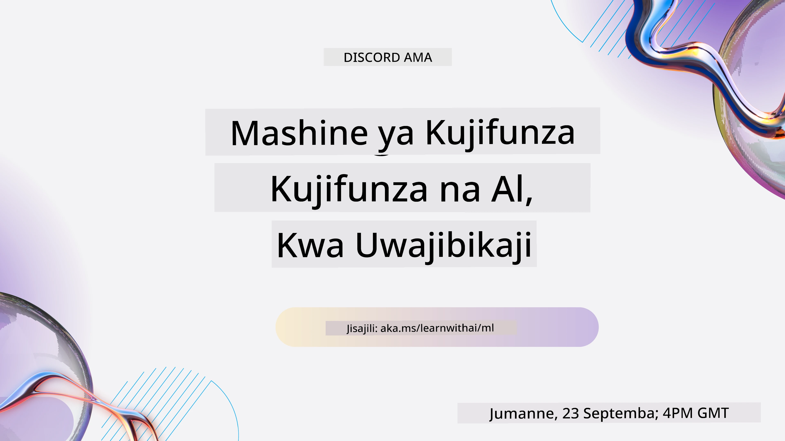
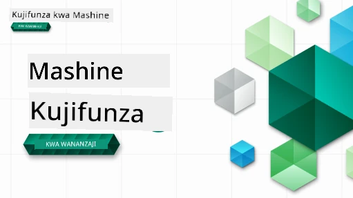

[](https://github.com/microsoft/ML-For-Beginners/blob/master/LICENSE)
[](https://GitHub.com/microsoft/ML-For-Beginners/graphs/contributors/)
[](https://GitHub.com/microsoft/ML-For-Beginners/issues/)
[](https://GitHub.com/microsoft/ML-For-Beginners/pulls/)
[](http://makeapullrequest.com)

[](https://GitHub.com/microsoft/ML-For-Beginners/watchers/)
[](https://GitHub.com/microsoft/ML-For-Beginners/network/)
[](https://GitHub.com/microsoft/ML-For-Beginners/stargazers/)

### 🌐 Usaidizi wa Lugha Nyingi

#### Unaungwa mkono kupitia Kitendo cha GitHub (Moja kwa Moja & Kila Wakati Kinaboresha)

<!-- CO-OP TRANSLATOR LANGUAGES TABLE START -->
[Kiarabu](../ar/README.md) | [Kibengali](../bn/README.md) | [Kibulgaria](../bg/README.md) | [Kiburma (Myanmar)](../my/README.md) | [Kichina (Kilicho rahisi)](../zh-CN/README.md) | [Kichina (Kilicho cha jadi, Hong Kong)](../zh-HK/README.md) | [Kichina (Kilicho cha jadi, Makao)](../zh-MO/README.md) | [Kichina (Kilicho cha jadi, Taiwani)](../zh-TW/README.md) | [Kikroeshia](../hr/README.md) | [Kicheki](../cs/README.md) | [Kidanemaki](../da/README.md) | [Kiholanzi](../nl/README.md) | [Kiestonia](../et/README.md) | [Kifini](../fi/README.md) | [Kifaransa](../fr/README.md) | [Kijerumani](../de/README.md) | [Kigiriki](../el/README.md) | [Kiebrania](../he/README.md) | [Kihindi](../hi/README.md) | [Kihungari](../hu/README.md) | [Kiindonesia](../id/README.md) | [Kiitaliano](../it/README.md) | [Kijapani](../ja/README.md) | [Kikannada](../kn/README.md) | [Kikimeri](../km/README.md) | [Kikorea](../ko/README.md) | [Kilithuania](../lt/README.md) | [Kimela](../ms/README.md) | [Kimalayalam](../ml/README.md) | [Kimarathi](../mr/README.md) | [Kinepali](../ne/README.md) | [Kipidgin cha Nigeria](../pcm/README.md) | [Kinorwe](../no/README.md) | [Kiajemi (Farsi)](../fa/README.md) | [Kipolandi](../pl/README.md) | [Kireno (Brazil)](../pt-BR/README.md) | [Kireno (Ureno)](../pt-PT/README.md) | [Kipunjabi (Gurmukhi)](../pa/README.md) | [Kiromania](../ro/README.md) | [Kirusi](../ru/README.md) | [Kiserbia (Azimio la Kirusi)](../sr/README.md) | [Kislovakia](../sk/README.md) | [Kislovenia](../sl/README.md) | [Kihispania](../es/README.md) | [Kiswahili](./README.md) | [Kiswidi](../sv/README.md) | [Kitagalogi (Kifilipino)](../tl/README.md) | [Kitamili](../ta/README.md) | [Kitelugu](../te/README.md) | [Kithai](../th/README.md) | [Kituruki](../tr/README.md) | [Kiukrania](../uk/README.md) | [Kiurdu](../ur/README.md) | [Kivietinamu](../vi/README.md)

> **Unapendelea Kukopa Kwenye Kompyuta Yako?**
>
> Hifadhi hii ina tafsiri za lugha zaidi ya 50 ambazo huongeza sana ukubwa wa kupakua. Ili kukopa bila tafsiri, tumia sparse checkout:
>
> **Bash / macOS / Linux:**
> ```bash
> git clone --filter=blob:none --sparse https://github.com/microsoft/ML-For-Beginners.git
> cd ML-For-Beginners
> git sparse-checkout set --no-cone '/*' '!translations' '!translated_images'
> ```
>
> **CMD (Windows):**
> ```cmd
> git clone --filter=blob:none --sparse https://github.com/microsoft/ML-For-Beginners.git
> cd ML-For-Beginners
> git sparse-checkout set --no-cone "/*" "!translations" "!translated_images"
> ```
>
> Hii inakupa kila kitu unachohitaji kumaliza kozi kwa upakuaji wa haraka zaidi.
<!-- CO-OP TRANSLATOR LANGUAGES TABLE END -->

#### Ungana na Jamii Yetu

[](https://discord.gg/nTYy5BXMWG)

Tuna mfululizo wa kujifunza kupitia Discord na AI unaoendelea, jifunze zaidi na ujiunge nasi kwenye [Mfululizo wa Kujifunza na AI](https://aka.ms/learnwithai/discord) kuanzia tarehe 18 - 30 Septemba, 2025. Utapata vidokezo na mbinu za kutumia GitHub Copilot kwa Sayansi ya Takwimu.



# Kujifunza Mashine kwa Waanzilishi - Mtaala

> 🌍 Safari kote duniani tunapochunguza Kujifunza Mashine kupitia tamaduni za dunia 🌍

Wakili wa Wingu wa Microsoft wanafurahia kutoa mtaala wa wiki 12, masomo 26 yote kuhusu **Kujifunza Mashine**. Katika mtaala huu, utajifunza kuhusu kile kinachoitwa mara nyingine **kujifunza mashine cha klasiki**, ukitumia hasa maktaba ya Scikit-learn na kuepuka kujifunza kwa kina, ambayo huhusishwa katika [mtaala wetu wa AI kwa Waanzilishi](https://aka.ms/ai4beginners). Sambaza masomo haya na mtaala wetu wa ['Sayansi ya Takwimu kwa Waanzilishi'](https://aka.ms/ds4beginners), pia!

Safiri pamoja nasi duniani tunapotumia mbinu hizi za klasiki kwa data kutoka sehemu nyingi za dunia. Kila funzo lina mitihani ya kabla na baada ya somo, maelekezo yaliyoandikwa ya kukamilisha somo, suluhisho, kazi ya nyumbani, na zaidi. Mbinu yetu inayotegemea miradi inakuwezesha kujifunza wakati wa kujenga, njia iliyo wazi ya kuweka ujuzi mpya 'ushikike'.

**✍️ Shukrani za dhati kwa waandishi wetu** Jen Looper, Stephen Howell, Francesca Lazzeri, Tomomi Imura, Cassie Breviu, Dmitry Soshnikov, Chris Noring, Anirban Mukherjee, Ornella Altunyan, Ruth Yakubu na Amy Boyd

**🎨 Shukrani pia kwa wachora picha wetu** Tomomi Imura, Dasani Madipalli, na Jen Looper

**🙏 Shukrani maalum 🙏 kwa waandishi wetu wa Balozi wa Wanafunzi wa Microsoft, wakaguzi, na wachangiaji wa maudhui**, hasa Rishit Dagli, Muhammad Sakib Khan Inan, Rohan Raj, Alexandru Petrescu, Abhishek Jaiswal, Nawrin Tabassum, Ioan Samuila, na Snigdha Agarwal

**🤩 Shukrani zaidi kwa Mabalozi wa Wanafunzi wa Microsoft Eric Wanjau, Jasleen Sondhi, na Vidushi Gupta kwa masomo yetu ya R!**

# Kuanzia

Fuata hatua hizi:
1. **Fanya Fork ya Hifadhi**: Bonyeza kitufe cha "Fork" upande wa juu kulia wa ukurasa huu.
2. **Nakili Hifadhi (Clone)**:   `git clone https://github.com/microsoft/ML-For-Beginners.git`

> 💡 **Kidokezo cha Kuanza Haraka:** Unataka kuanza katika kivinjari bila kusanidi Python ndani ya kompyuta yako? Tumia [GitHub Codespaces](https://github.com/features/codespaces) kuunda mazingira ya maendeleo ya wingu kwa fork yako. Fungua menyu ya kijani ya **Code**, chagua **Codespaces**, na unda codespace; sanidi viongezi vinavyohitajika kwa kila somo ndani yake kama inavyohitaji.

> [pata rasilimali zote za ziada za kozi hii katika mkusanyiko wetu wa Microsoft Learn](https://learn.microsoft.com/en-us/collections/qrqzamz1nn2wx3?WT.mc_id=academic-77952-bethanycheum)

> 🔧 **Unahitaji msaada?** Angalia [Mwongozo wa Matatizo](TROUBLESHOOTING.md) kwa suluhisho la masuala ya kawaida kuhusu usakinishaji, usanidi, na kuendesha masomo.


**[Wanafunzi](https://aka.ms/student-page)**, ili kutumia mtaala huu, fanya fork ya hifadhi yote kwa akaunti yako ya GitHub na maliza mazoezi peke yako au na kikundi:

- Anza na mtihani wa kabla ya duru la somo.
- Soma duru na maliza shughuli, simama na fikiria kila ukaguzi wa maarifa.
- Jaribu kuunda miradi kwa kuelewa masomo badala ya kuendesha msimbo wa suluhisho; ingawa msimbo huo upo kwenye folda `/solution` katika kila somo lililolenga mradi.
- Chukua mtihani wa baada ya duru la somo.
- Maliza changamoto.
- Maliza kazi ya nyumbani.
- Baada ya kumaliza kundi la masomo, tembelea [Bodi ya Majadiliano](https://github.com/microsoft/ML-For-Beginners/discussions) na "jifunze kwa sauti" kwa kujaza rubrik ya PAT inayofaa. 'PAT' ni Chombo cha Tathmini ya Maendeleo ambacho ni rubrik unayojaza ili kukuza ujifunzaji wako. Unaweza pia kutoa maoni kwa PAT nyingine ili tujifunze pamoja.

> Kwa masomo zaidi, tunapendekeza kufuata moduli na njia za kujifunza za [Microsoft Learn](https://docs.microsoft.com/en-us/users/jenlooper-2911/collections/k7o7tg1gp306q4?WT.mc_id=academic-77952-leestott).

**Walimu**, tume [jumuisha mapendekezo](for-teachers.md) juu ya jinsi ya kutumia mtaala huu.

---

## Maelezo ya video

Baadhi ya masomo yanapatikana kama video fupi. Unaweza kupata hizi zote kwenye masomo, au kwenye [orodha ya ML kwa Waanzilishi kwenye kituo cha developer cha Microsoft YouTube](https://aka.ms/ml-beginners-videos) kwa kubofya picha iliyo hapa chini.

[](https://aka.ms/ml-beginners-videos)

---

## Kutana na Timu

[](https://youtu.be/Tj1XWrDSYJU)

**Gif na** [Mohit Jaisal](https://linkedin.com/in/mohitjaisal)

> 🎥 Bonyeza picha hapo juu kwa video kuhusu mradi na watu waliouunda!

---

## Mbinu ya Kufundishia

Tumebaini viwango viwili vya ufundishaji wakati wa kujenga mtaala huu: kuhakikisha kuwa ni mbinu ya **mradi-kuzingatia** na inajumuisha **mitihani mara kwa mara**. Zaidi ya hayo, mtaala huu una **kauli mbiu** moja kwa lengo la kutoa muunganiko.

Kwa kuhakikisha kuwa maudhui yanaendana na miradi, mchakato unakuwa wa kuvutia zaidi kwa wanafunzi na kumbukumbu ya dhana itaimarishwa. Zaidi ya hayo, mtihani wa kawaida kabla ya darasa unaweka nia ya mwanafunzi kuelekea kujifunza mada, huku mtihani wa pili baada ya darasa ukihakikisha kumbukumbu zaidi. Mtaala huu umeundwa kuwa rahisi kutumia na kufurahisha na unaweza kuchukuliwa kwa jumla au sehemu. Miradi huanza ndogo na kuwa ngumu zaidi mwishoni mwa mzunguko wa wiki 12. Mtaala huu pia unajumuisha onyo la matumizi ya kweli ya ML, ambayo inaweza kutumika kama mkopo wa ziada au kama msingi wa majadiliano.

> Pata [Kanuni za Maadili](CODE_OF_CONDUCT.md), [Michango](CONTRIBUTING.md), [Tafsiri](..), na [Mwongozo wa Matatizo](TROUBLESHOOTING.md). Tunakaribisha maoni yako ya kujenga!

## Kila somo linajumuisha

- chati ya optional ya kuchora mawazo
- video ya ziada ya hiari
- maelekezo ya video (masomo machache tu)
- [mtihani wa kuandaa kabla ya duru](https://ff-quizzes.netlify.app/en/ml/)
- somo ambalo limeandikwa
- kwa masomo yanayolenga mradi, mwongozo wa hatua kwa hatua wa jinsi ya kujenga mradi
- ukaguzi wa maarifa
- changamoto
- usomaji wa ziada
- kazi ya nyumbani
- [mtihani baada ya duru](https://ff-quizzes.netlify.app/en/ml/)

> **Kumbuka kuhusu lugha**: Masomo haya yameandikwa hasa kwa Python, lakini mengi pia yamepatikana kwa R. Ili kumaliza somo la R, nenda kwenye folda ya `/solution` na tafuta masomo ya R. Yana kiambatisho .rmd kinachoashiria faili la **R Markdown** ambalo linaweza kufafanuliwa kama uingizaji wa vipande vya msimbo (R au lugha nyingine) na kichwa cha `YAML` (kinachoelekeza jinsi ya kuandaa matokeo kama PDF) katika `Hati ya Markdown`. Hivyo, hutumika kama mfumo bora wa kuandika kwa sayansi ya data kwa kuwa huruhusu kuunganisha msimbo wako, matokeo yake, na mawazo yako kwa kuandika kwa Markdown. Zaidi ya hayo, hati za R Markdown zinaweza kutafsiriwa hadi fomati kama PDF, HTML, au Word.

> **Kumbuka kuhusu mitihani**: Mitihani yote iko katika [folda ya Quiz App](../../quiz-app), ikiwa na jumla ya mitihani 52 ya maswali matatu kila moja. Inaunganishwa kutoka ndani ya masomo lakini programu ya mtihani inaweza kuendeshwa ndani ya kompyuta yako; fuata maelekezo katika folda ya `quiz-app` ili kuendesha kwa ndani au kupeleka kwenye Azure.

| Idadi ya Somo |                             Mada                              |                   Kundi la Somo                   | Malengo ya Kujifunza                                                                                                             |                                                              Somo Lililounganishwa                                                               |                        Mwandishi                        |
| :-----------: | :------------------------------------------------------------: | :-------------------------------------------------: | ------------------------------------------------------------------------------------------------------------------------------- | :--------------------------------------------------------------------------------------------------------------------------------------: | :--------------------------------------------------: |
|      01       |                 Utangulizi wa ujifunzaji wa mashine                |      [Utangulizi](1-Introduction/README.md)       | Jifunze dhana za msingi nyuma ya ujifunzaji wa mashine                                                                                |                                             [Somo](1-Introduction/1-intro-to-ML/README.md)                                             |                       Muhammad                       |
|      02       |                Historia ya ujifunzaji wa mashine                 |      [Utangulizi](1-Introduction/README.md)       | Jifunze historia inayosimikia uwanja huu                                                                                         |                                            [Somo](1-Introduction/2-history-of-ML/README.md)                                            |                     Jen na Amy                      |
|      03       |                 Usawa na ujifunzaji wa mashine                  |      [Utangulizi](1-Introduction/README.md)       | Ni masuala gani ya kifalsafa muhimu kuhusu usawa yanayopaswa kuzingatiwa na wanafunzi wanapojenga na kutumia mifano ya ML? |                                              [Somo](1-Introduction/3-fairness/README.md)                                               |                        Tomomi                        |
|      04       |                Mbinu za ujifunzaji wa mashine                 |      [Utangulizi](1-Introduction/README.md)       | Ni mbinu gani wasomi wa ML hutumia kujenga mifano ya ML?                                                                       |                                          [Somo](1-Introduction/4-techniques-of-ML/README.md)                                           |                    Chris na Jen                     |
|      05       |                   Utangulizi wa urekebishaji                   |        [Urekebishaji](2-Regression/README.md)         | Anza na Python na Scikit-learn kwa mifano ya urekebishaji                                                                  |         [Python](2-Regression/1-Tools/README.md) • [R](../../2-Regression/1-Tools/solution/R/lesson_1.html)         |      Jen • Eric Wanjau       |
|      06       |                Bei za malenge za Amerika Kaskazini 🎃                |        [Urekebishaji](2-Regression/README.md)         | Onyesha na safisha data kama maandalizi kwa ML                                                                                  |          [Python](2-Regression/2-Data/README.md) • [R](../../2-Regression/2-Data/solution/R/lesson_2.html)          |      Jen • Eric Wanjau       |
|      07       |                Bei za malenge za Amerika Kaskazini 🎃                |        [Urekebishaji](2-Regression/README.md)         | Jenga mifano ya urekebishaji wa mstari na polinomial                                                                           |        [Python](2-Regression/3-Linear/README.md) • [R](../../2-Regression/3-Linear/solution/R/lesson_3.html)        |      Jen na Dmitry • Eric Wanjau       |
|      08       |                Bei za malenge za Amerika Kaskazini 🎃                |        [Urekebishaji](2-Regression/README.md)         | Jenga mfano wa urekebishaji wa logisti                                                                                               |     [Python](2-Regression/4-Logistic/README.md) • [R](../../2-Regression/4-Logistic/solution/R/lesson_4.html)      |      Jen • Eric Wanjau       |
|      09       |                          Programu ya Wavuti 🔌                          |           [Programu ya Wavuti](3-Web-App/README.md)            | Jenga programu ya wavuti kutumia mfano wako uliobinafsishwa                                                                                       |                                                 [Python](3-Web-App/1-Web-App/README.md)                                                  |                         Jen                          |
|      10       |                 Utangulizi wa kasha                                                       |    [Kasha](4-Classification/README.md)     | Safisha, andaa, naonyesha data yako; utangulizi wa kasha                                                            | [Python](4-Classification/1-Introduction/README.md) • [R](../../4-Classification/1-Introduction/solution/R/lesson_10.html)  | Jen na Cassie • Eric Wanjau |
|      11       |             Vyakula vitamu vya Asia na India 🍜             |    [Kasha](4-Classification/README.md)     | Utangulizi wa vatasisi                                                                                                     | [Python](4-Classification/2-Classifiers-1/README.md) • [R](../../4-Classification/2-Classifiers-1/solution/R/lesson_11.html) | Jen na Cassie • Eric Wanjau |
|      12       |             Vyakula vitamu vya Asia na India 🍜             |    [Kasha](4-Classification/README.md)     | Zaidi ya vatasisi                                                                                                                | [Python](4-Classification/3-Classifiers-2/README.md) • [R](../../4-Classification/3-Classifiers-2/solution/R/lesson_12.html) | Jen na Cassie • Eric Wanjau |
|      13       |             Vyakula vitamu vya Asia na India 🍜             |    [Kasha](4-Classification/README.md)     | Jenga programu ya wavuti ya mapendekezo kutumia mfano wako                                                                                    |                                              [Python](4-Classification/4-Applied/README.md)                                              |                         Jen                          |
|      14       |                   Utangulizi wa kugawanya kundi                   |        [Ugawaji Kundi](5-Clustering/README.md)         | Safisha, andaa, naonyesha data yako; Utangulizi wa kugawanya kundi                                                                |         [Python](5-Clustering/1-Visualize/README.md) • [R](../../5-Clustering/1-Visualize/solution/R/lesson_14.html)         |      Jen • Eric Wanjau       |
|      15       |              Kuchunguza Ladha za Muziki za Nigeria 🎧              |        [Ugawaji Kundi](5-Clustering/README.md)         | Chunguza njia ya K-Means ya kugawanya kundi                                                                                           |           [Python](5-Clustering/2-K-Means/README.md) • [R](../../5-Clustering/2-K-Means/solution/R/lesson_15.html)           |      Jen • Eric Wanjau       |
|      16       |        Utangulizi wa usindikaji wa lugha asilia ☕️         |   [Usindikaji wa lugha asilia](6-NLP/README.md)    | Jifunze misingi ya NLP kwa kujenga bot rahisi                                                                             |                                             [Python](6-NLP/1-Introduction-to-NLP/README.md)                                              |                       Stephen                        |
|      17       |                      Kazi za kawaida za NLP ☕️                      |   [Usindikaji wa lugha asilia](6-NLP/README.md)    | Zidi kujua NLP kwa kuelewa kazi za kawaida zinazohitajika wakati wa kushughulikia miundo ya lugha                          |                                                    [Python](6-NLP/2-Tasks/README.md)                                                     |                       Stephen                        |
|      18       |             Tafsiri na uchambuzi wa hisia ♥️              |   [Usindikaji wa lugha asilia](6-NLP/README.md)    | Tafsiri na uchambuzi wa hisia na Jane Austen                                                                             |                                            [Python](6-NLP/3-Translation-Sentiment/README.md)                                             |                       Stephen                        |
|      19       |                  Hoteli za kimapenzi za Ulaya ♥️                  |   [Usindikaji wa lugha asilia](6-NLP/README.md)    | Uchambuzi wa hisia na hakiki za hoteli 1                                                                                         |                                               [Python](6-NLP/4-Hotel-Reviews-1/README.md)                                                |                       Stephen                        |
|      20       |                  Hoteli za kimapenzi za Ulaya ♥️                  |   [Usindikaji wa lugha asilia](6-NLP/README.md)    | Uchambuzi wa hisia na hakiki za hoteli 2                                                                                         |                                               [Python](6-NLP/5-Hotel-Reviews-2/README.md)                                                |                       Stephen                        |
|      21       |            Utangulizi wa utabiri wa mfululizo wa wakati             |        [Mfululizo wa wakati](7-TimeSeries/README.md)        | Utangulizi wa utabiri wa mfululizo wa wakati                                                                                         |                                             [Python](7-TimeSeries/1-Introduction/README.md)                                              |                      Francesca                       |
|      22       | ⚡️ Matumizi ya Nguvu Duniani ⚡️ - utabiri wa mfululizo wa wakati kwa ARIMA |        [Mfululizo wa wakati](7-TimeSeries/README.md)        | Utabiri wa mfululizo wa wakati kwa ARIMA                                                                                              |                                                 [Python](7-TimeSeries/2-ARIMA/README.md)                                                 |                      Francesca                       |
|      23       |  ⚡️ Matumizi ya Nguvu Duniani ⚡️ - utabiri wa mfululizo wa wakati kwa SVR  |        [Mfululizo wa wakati](7-TimeSeries/README.md)        | Utabiri wa mfululizo wa wakati kwa Support Vector Regressor                                                                           |                                                  [Python](7-TimeSeries/3-SVR/README.md)                                                  |                       Anirban                        |
|      24       |             Utangulizi wa ujifunzaji wa kuimarisha             | [Ujifunzaji wa kuimarisha](8-Reinforcement/README.md) | Utangulizi wa ujifunzaji wa kuimarisha na Q-Learning                                                                          |                                             [Python](8-Reinforcement/1-QLearning/README.md)                                              |                        Dmitry                        |
|      25       |                 Msaidizi Peter apewe usaidizi kuepuka wolf! 🐺                  | [Ujifunzaji wa kuimarisha](8-Reinforcement/README.md) | Gym ya ujifunzaji wa kuimarisha                                                                                                      |                                                [Python](8-Reinforcement/2-Gym/README.md)                                                 |                        Dmitry                        |
|  Kumbukumbu ya Mwisho   |            Mabadiliko na matumizi halisi ya ML            |      [ML katika Porini](9-Real-World/README.md)       | Matumizi ya ajabu na ya kufichua ya ML klasiki                                                               |                                             [Somo](9-Real-World/1-Applications/README.md)                                              |                         Timu                         |
|  Kumbukumbu ya Mwisho   |            Utambuzi wa Makosa katika ML kwa kutumia dashibodi ya RAI            |      [ML katika Porini](9-Real-World/README.md)       | Utambuzi wa makosa katika ujifunzaji wa mashine kwa kutumia vipengele vya dashibodi ya AI ya kuwajibika                                                              |                                             [Somo](9-Real-World/2-Debugging-ML-Models/README.md)                                              |                     Ruth Yakubu                      |

> [pata rasilimali zote za ziada kwa kozi hii katika mkusanyiko wetu wa Microsoft Learn](https://learn.microsoft.com/en-us/collections/qrqzamz1nn2wx3?WT.mc_id=academic-77952-bethanycheum)

## Upatikanaji bila mtandao

Unaweza kuendesha hati hii bila mtandao kwa kutumia [Docsify](https://docsify.js.org/#/). Nakili hifadhi hii, [weka Docsify](https://docsify.js.org/#/quickstart) kwenye mashine yako ya karibu, kisha katika folda ya mzizi ya hifadhi hii, andika `docsify serve`. Tovuti itapatikana kwenye bandari 3000 kwenye localhost yako: `localhost:3000`.

## PDF

Pata pdf ya mtaala yenye viungo [hapa](https://microsoft.github.io/ML-For-Beginners/pdf/readme.pdf).


## 🎒 Kozi Nyingine 

Timu yetu hutengeneza kozi nyingine! Angalia:

<!-- CO-OP TRANSLATOR OTHER COURSES START -->
### LangChain
[](https://aka.ms/langchain4j-for-beginners)
[](https://aka.ms/langchainjs-for-beginners?WT.mc_id=m365-94501-dwahlin)
[](https://github.com/microsoft/langchain-for-beginners?WT.mc_id=m365-94501-dwahlin)
---

### Azure / Edge / MCP / Maajenti
[](https://github.com/microsoft/AZD-for-beginners?WT.mc_id=academic-105485-koreyst)
[](https://github.com/microsoft/edgeai-for-beginners?WT.mc_id=academic-105485-koreyst)
[](https://github.com/microsoft/mcp-for-beginners?WT.mc_id=academic-105485-koreyst)
[](https://github.com/microsoft/ai-agents-for-beginners?WT.mc_id=academic-105485-koreyst)

---
 
### Mfululizo wa AI ya Kizazi
[](https://github.com/microsoft/generative-ai-for-beginners?WT.mc_id=academic-105485-koreyst)
[-9333EA?style=for-the-badge&labelColor=E5E7EB&color=9333EA)](https://github.com/microsoft/Generative-AI-for-beginners-dotnet?WT.mc_id=academic-105485-koreyst)
[-C084FC?style=for-the-badge&labelColor=E5E7EB&color=C084FC)](https://github.com/microsoft/generative-ai-for-beginners-java?WT.mc_id=academic-105485-koreyst)
[-E879F9?style=for-the-badge&labelColor=E5E7EB&color=E879F9)](https://github.com/microsoft/generative-ai-with-javascript?WT.mc_id=academic-105485-koreyst)

---
 
### Mafunzo ya Msingi
[](https://aka.ms/ml-beginners?WT.mc_id=academic-105485-koreyst)
[](https://aka.ms/datascience-beginners?WT.mc_id=academic-105485-koreyst)
[](https://aka.ms/ai-beginners?WT.mc_id=academic-105485-koreyst)
[](https://github.com/microsoft/Security-101?WT.mc_id=academic-96948-sayoung)
[](https://aka.ms/webdev-beginners?WT.mc_id=academic-105485-koreyst)
[](https://aka.ms/iot-beginners?WT.mc_id=academic-105485-koreyst)
[](https://github.com/microsoft/xr-development-for-beginners?WT.mc_id=academic-105485-koreyst)

---
 
### Mfululizo wa Copilot
[](https://aka.ms/GitHubCopilotAI?WT.mc_id=academic-105485-koreyst)
[](https://github.com/microsoft/mastering-github-copilot-for-dotnet-csharp-developers?WT.mc_id=academic-105485-koreyst)
[](https://github.com/microsoft/CopilotAdventures?WT.mc_id=academic-105485-koreyst)
<!-- CO-OP TRANSLATOR OTHER COURSES END -->

## Kupata Msaada

Ukikumbwa na shida au una maswali wakati wa kujifunza Ujifunzaji wa Mashine au kuunda programu za AI, usijali — msaada upo.

Unaweza kujiunga na mijadala na wanafunzi na watengenezaji wengine, kuuliza maswali, na kushiriki mawazo yako na jamii.

- Jiunge na jamii kuuliza maswali na kujifunza na wengine
- Jadili dhana za Ujifunzaji wa Mashine na mawazo ya miradi
- Pata mwongozo kutoka kwa watengenezaji wenye uzoefu

Jamii yenye msaada ni njia nzuri ya kukuza ujuzi wako na kutatua matatizo haraka.

[Jumuiya ya Microsoft Foundry Discord](https://discord.gg/nTYy5BXMWG)

Ukikuta dosari, makosa, au una mapendekezo ya maboresho, unaweza pia kufungua **Tatizo** katika hifadhi hii kuripoti tatizo.

Kwa mrejesho wa bidhaa au kutafuta machapisho yaliyopo ya jamii, tembelea Jukwaa la Watengenezaji:

[](https://aka.ms/foundry/forum)

## Vidokezo vya Ziada vya Kujifunza

- Kagua daftari baada ya kila somo kwa uelewa bora.
- Fanya mazoezi ya kutekeleza algoritimu peke yako.
- Chunguza seti za data za kweli kwa kutumia dhana ulizojifunza.

---

<!-- CO-OP TRANSLATOR DISCLAIMER START -->
**Kionyozo**:
Hati hii imetafsiriwa kwa kutumia huduma ya tafsiri ya AI [Co-op Translator](https://github.com/Azure/co-op-translator). Ingawa tunajitahidi kupata usahihi, tafadhali fahamu kwamba tafsiri za kiotomatiki zinaweza kuwa na makosa au upungufu wa usahihi. Hati ya asili katika lugha yake halisi inapaswa kuchukuliwa kama chanzo cha mamlaka. Kwa taarifa muhimu, tafsiri ya kitaalamu inayofanywa na binadamu inapendekezwa. Hatutojibu kwa kuelewa vibaya au tafsiri potofu zinazotokea kutokana na matumizi ya tafsiri hii.
<!-- CO-OP TRANSLATOR DISCLAIMER END -->