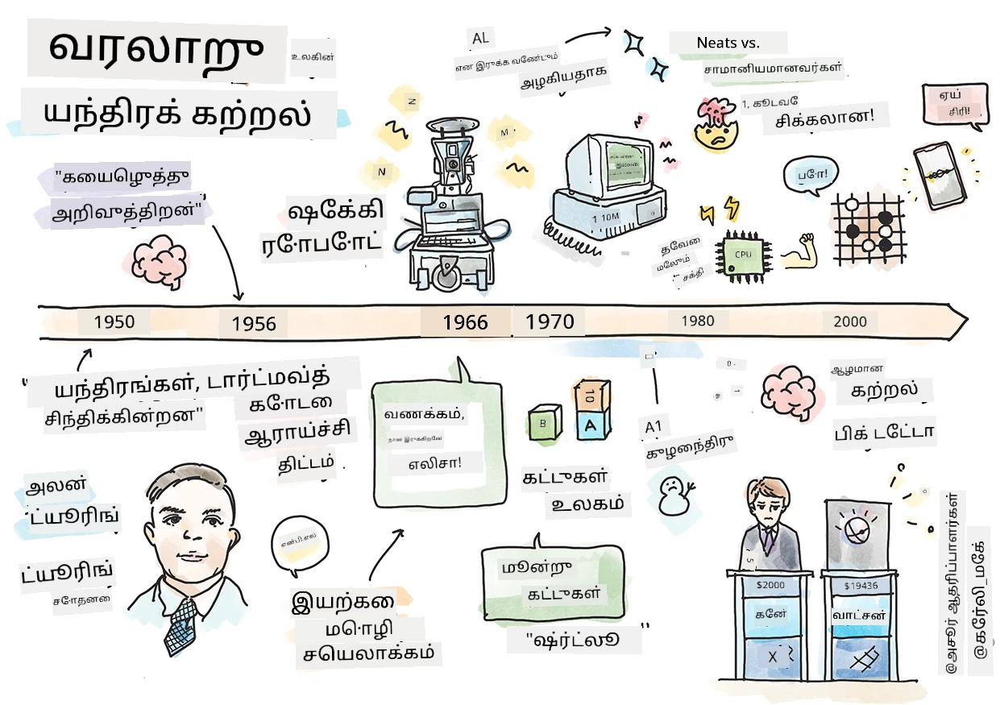
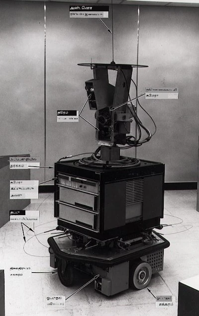
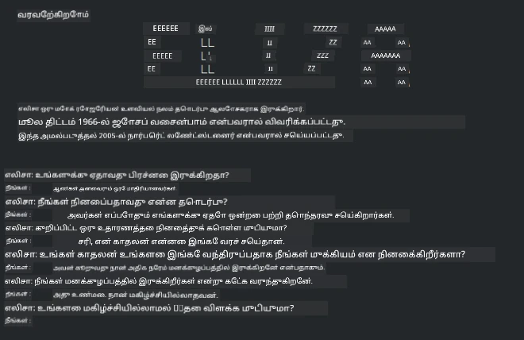

<!--
CO_OP_TRANSLATOR_METADATA:
{
  "original_hash": "6a05fec147e734c3e6bfa54505648e2b",
  "translation_date": "2025-10-11T11:27:30+00:00",
  "source_file": "1-Introduction/2-history-of-ML/README.md",
  "language_code": "ta"
}
-->
# இயந்திரக் கற்றலின் வரலாறு

> ஸ்கெட்ச் நோட்: [Tomomi Imura](https://www.twitter.com/girlie_mac)

## [முன்-பாடம் வினாடி வினா](https://ff-quizzes.netlify.app/en/ml/)

---

> 🎥 மேலே உள்ள படத்தை கிளிக் செய்து இந்த பாடத்திற்கான குறுகிய வீடியோவைப் பாருங்கள்.

இந்த பாடத்தில், இயந்திரக் கற்றல் மற்றும் செயற்கை நுண்ணறிவின் வரலாற்றில் முக்கியமான நிகழ்வுகளைப் பார்ப்போம்.

செயற்கை நுண்ணறிவு (AI) என்ற துறையின் வரலாறு இயந்திரக் கற்றலின் வரலாற்றுடன் இணைந்துள்ளது, ஏனெனில் ML-ஐ ஆதரிக்கும் ஆல்கொரிதங்கள் மற்றும் கணினி முன்னேற்றங்கள் AI-யின் வளர்ச்சிக்கு உதவின. இந்த துறைகள் தனித்த துறைகளாக 1950களில் உருவாகத் தொடங்கினாலும், முக்கியமான [ஆல்கொரிதம்கள், புள்ளியியல், கணித, கணினி மற்றும் தொழில்நுட்ப கண்டுபிடிப்புகள்](https://wikipedia.org/wiki/Timeline_of_machine_learning) இந்த காலத்தை முந்தியவை மற்றும் அதனுடன் ஒட்டியவை. உண்மையில், [நூற்றாண்டுகளாக](https://wikipedia.org/wiki/History_of_artificial_intelligence) மக்கள் 'சிந்திக்கும் இயந்திரம்' என்ற கருத்தை பற்றி யோசித்துள்ளனர்: இந்தக் கட்டுரை 'சிந்திக்கும் இயந்திரம்' என்ற கருத்தின் வரலாற்று அறிவாற்றல்களை விவரிக்கிறது.

---
## குறிப்பிடத்தக்க கண்டுபிடிப்புகள்

- 1763, 1812 [Bayes Theorem](https://wikipedia.org/wiki/Bayes%27_theorem) மற்றும் அதன் முன்னோடிகள். இந்த கோட்பாடு மற்றும் அதன் பயன்பாடுகள் முன்னறிவிப்பை அடிப்படையாகக் கொண்டவை, முன்னறிவிப்பின் அடிப்படையில் ஒரு நிகழ்வு நிகழும் சாத்தியத்தை விவரிக்கின்றன.
- 1805 [Least Square Theory](https://wikipedia.org/wiki/Least_squares) பிரெஞ்சு கணிதவியலாளர் Adrien-Marie Legendre. இந்த கோட்பாடு, Regression அலகில் நீங்கள் கற்றுக்கொள்ளப் போகிறீர்கள், தரவுகளை பொருத்த உதவுகிறது.
- 1913 [Markov Chains](https://wikipedia.org/wiki/Markov_chain), ரஷ்ய கணிதவியலாளர் Andrey Markov-இன் பெயரால் அழைக்கப்படுகிறது, இது முந்தைய நிலையை அடிப்படையாகக் கொண்ட நிகழ்வுகளின் வரிசையை விவரிக்க பயன்படுகிறது.
- 1957 [Perceptron](https://wikipedia.org/wiki/Perceptron) என்பது அமெரிக்க உளவியலாளர் Frank Rosenblatt உருவாக்கிய ஒரு வகை நேரியல் வகைப்பாடு, இது ஆழமான கற்றலின் முன்னேற்றங்களுக்கு அடிப்படையாக உள்ளது.

---

- 1967 [Nearest Neighbor](https://wikipedia.org/wiki/Nearest_neighbor) என்பது முதலில் பாதை வரைபடங்களை உருவாக்க வடிவமைக்கப்பட்ட ஒரு ஆல்கொரிதம். ML சூழலில் இது முறைமைகளை கண்டறிய பயன்படுகிறது.
- 1970 [Backpropagation](https://wikipedia.org/wiki/Backpropagation) [feedforward neural networks](https://wikipedia.org/wiki/Feedforward_neural_network) கற்றதற்கு பயன்படுத்தப்படுகிறது.
- 1982 [Recurrent Neural Networks](https://wikipedia.org/wiki/Recurrent_neural_network) என்பது feedforward neural networks-இல் இருந்து பெறப்பட்ட செயற்கை நரம்பியல் வலைகள், இது தற்காலிக வரைபடங்களை உருவாக்குகிறது.

✅ சிறு ஆராய்ச்சி செய்யுங்கள். ML மற்றும் AI வரலாற்றில் மற்ற எந்த தேதிகள் முக்கியமானவை என்று உங்களுக்கு தெரிகிறது?

---
## 1950: சிந்திக்கும் இயந்திரங்கள்

Alan Turing, 2019-ல் [பொது மக்களால்](https://wikipedia.org/wiki/Icons:_The_Greatest_Person_of_the_20th_Century) 20ஆம் நூற்றாண்டின் மிகச் சிறந்த விஞ்ஞானியாக தேர்ந்தெடுக்கப்பட்ட ஒரு குறிப்பிடத்தக்க நபர், 'சிந்திக்கக்கூடிய இயந்திரம்' என்ற கருத்தின் அடிப்படை அமைக்க உதவியதாகக் கருதப்படுகிறார். அவர் [Turing Test](https://www.bbc.com/news/technology-18475646) உருவாக்குவதன் மூலம் இந்த கருத்தின் உண்மையை நிரூபிக்க முயற்சித்தார், இது NLP பாடங்களில் நீங்கள் ஆராய்வீர்கள்.

---
## 1956: Dartmouth Summer Research Project

"Dartmouth Summer Research Project on artificial intelligence என்பது செயற்கை நுண்ணறிவு துறைக்கு ஒரு முக்கிய நிகழ்வாக இருந்தது," மற்றும் இங்கு 'செயற்கை நுண்ணறிவு' என்ற சொல் உருவாக்கப்பட்டது ([source](https://250.dartmouth.edu/highlights/artificial-intelligence-ai-coined-dartmouth)).

> கற்றல் அல்லது நுண்ணறிவின் எந்த அம்சமும் துல்லியமாக விவரிக்கப்படலாம், அதனால் ஒரு இயந்திரம் அதை ஒத்திசைக்க செய்யப்படலாம்.

---

முதன்மை ஆராய்ச்சியாளர், கணிதப் பேராசிரியர் John McCarthy, "கற்றல் அல்லது நுண்ணறிவின் எந்த அம்சமும் துல்லியமாக விவரிக்கப்படலாம், அதனால் ஒரு இயந்திரம் அதை ஒத்திசைக்க செய்யப்படலாம்" என்ற யூகத்தின் அடிப்படையில் முன்னேற வேண்டும் என்று நம்பினார். பங்கேற்பாளர்களில் மற்றொரு முக்கிய நபர் Marvin Minsky இருந்தார்.

இந்த வேலைக்கான கருத்தரங்கு "சின்னவியல் முறைகள், வரையறுக்கப்பட்ட துறைகளில் மையமாக்கப்பட்ட அமைப்புகள் (ஆரம்பக் கலைஞர் அமைப்புகள்), deductive systems மற்றும் inductive systems ஆகியவற்றின் வளர்ச்சியை" ஊக்குவித்தது என்று கருதப்படுகிறது ([source](https://wikipedia.org/wiki/Dartmouth_workshop)).

---
## 1956 - 1974: "தங்க காலம்"

1950களிலிருந்து 70களின் நடுப்பகுதி வரை, AI பல பிரச்சினைகளைத் தீர்க்கும் திறன் கொண்டது என்ற நம்பிக்கை அதிகமாக இருந்தது. 1967-ல் Marvin Minsky தன்னம்பிக்கையுடன் "ஒரு தலைமுறைக்குள் ... 'செயற்கை நுண்ணறிவு' உருவாக்கும் பிரச்சினை பெருமளவில் தீர்க்கப்படும்" என்று கூறினார். (Minsky, Marvin (1967), Computation: Finite and Infinite Machines, Englewood Cliffs, N.J.: Prentice-Hall)

இயற்கை மொழி செயலாக்க ஆராய்ச்சி வளர்ச்சியடைந்தது, தேடல் மேம்படுத்தப்பட்டது மற்றும் சக்திவாய்ந்ததாக மாற்றப்பட்டது, மேலும் 'micro-worlds' என்ற கருத்து உருவாக்கப்பட்டது, எளிய பணிகள் சாதாரண மொழி வழிகாட்டுதல்களைப் பயன்படுத்தி முடிக்கப்பட்டன.

---

அரசு நிறுவனங்களால் ஆராய்ச்சி நிதி வழங்கப்பட்டது, கணினி மற்றும் ஆல்கொரிதங்களில் முன்னேற்றங்கள் செய்யப்பட்டன, மேலும் நுண்ணறிவு இயந்திரங்களின் மாதிரிகள் உருவாக்கப்பட்டன. இந்த இயந்திரங்களில் சில:

* [Shakey the robot](https://wikipedia.org/wiki/Shakey_the_robot), 'நுண்ணறிவுடன்' பணிகளைச் செய்ய முடிவு செய்யும் திறன் கொண்டது.

    
    > Shakey 1972-ல்

---

* Eliza, ஒரு ஆரம்ப 'chatterbot', மக்களுடன் உரையாட முடியும் மற்றும் ஒரு ஆரம்ப 'மனநல மருத்துவர்' ஆக செயல்பட முடியும். NLP பாடங்களில் Eliza பற்றி மேலும் அறியலாம்.

    
    > Eliza, ஒரு chatbot-இன் ஒரு பதிப்பு

---

* "Blocks world" என்பது ஒரு micro-world-இன் உதாரணமாக இருந்தது, இங்கு கட்டங்களை அடுக்கவும் வரிசைப்படுத்தவும் முடியும், மேலும் இயந்திரங்களை முடிவெடுக்க கற்பிக்க முயற்சிகள் செய்யப்பட்டது. [SHRDLU](https://wikipedia.org/wiki/SHRDLU) போன்ற நூலகங்களுடன் கட்டப்பட்ட முன்னேற்றங்கள் மொழி செயலாக்கத்தை முன்னேற்ற உதவின.

    

    > 🎥 மேலே உள்ள படத்தை கிளிக் செய்து வீடியோவைப் பாருங்கள்: Blocks world SHRDLU உடன்

---
## 1974 - 1980: "AI Winter"

1970களின் நடுப்பகுதியில், 'நுண்ணறிவு இயந்திரங்களை' உருவாக்குவதின் சிக்கலான தன்மை குறைவாக மதிப்பீடு செய்யப்பட்டதையும், கிடைக்கக்கூடிய கணினி சக்தி அளவில் அதன் வாக்குறுதி மிகைப்படுத்தப்பட்டதையும் உணரப்பட்டது. நிதி குறைந்தது மற்றும் துறையின் மீது நம்பிக்கை குறைந்தது. நம்பிக்கையை பாதித்த சில பிரச்சினைகள்:

---
- **வரையறைகள்**. கணினி சக்தி மிகவும் வரையறுக்கப்பட்டிருந்தது.
- **கூட்டிணைப்பு வெடிப்பு**. கணினிகளிடம் அதிகம் கேட்கப்பட்டபோது, ​​பயிற்சி பெற வேண்டிய அளவுகள் கணினி சக்தி மற்றும் திறனின் சமநிலை வளர்ச்சியின்றி பெருகியது.
- **தரவின் பற்றாக்குறை**. ஆல்கொரிதங்களை சோதிக்க, உருவாக்க, மற்றும் மேம்படுத்தும் செயல்முறையைத் தடைசெய்த தரவின் பற்றாக்குறை இருந்தது.
- **நாம் சரியான கேள்விகளை கேட்கிறோமா?**. கேட்கப்பட்ட கேள்விகளே கேள்விக்குறியாகத் தொடங்கின. ஆராய்ச்சியாளர்கள் தங்கள் அணுகுமுறைகள் குறித்து விமர்சனங்களை எதிர்கொண்டனர்:
  - Turing சோதனைகள் 'சீன அறை கோட்பாடு' போன்ற கருத்துக்களால் கேள்விக்குள்ளாக்கப்பட்டன, இது "ஒரு டிஜிட்டல் கணினியை நிரலாக்குவது மொழியைப் புரிந்துகொள்ளும் தோற்றத்தை உருவாக்கலாம், ஆனால் உண்மையான புரிதலை உருவாக்க முடியாது" என்று கூறியது. ([source](https://plato.stanford.edu/entries/chinese-room/))
  - "மனநல மருத்துவர்" ELIZA போன்ற செயற்கை நுண்ணறிவுகளை சமுதாயத்தில் அறிமுகப்படுத்துவதற்கான நெறிமுறைகள் சவாலாக இருந்தன.

---

அதே நேரத்தில், பல AI சிந்தனைக் பள்ளிகள் உருவாகத் தொடங்கின. ["scruffy" vs. "neat AI"](https://wikipedia.org/wiki/Neats_and_scruffies) நடைமுறைகளுக்கு இடையே ஒரு பிளவு உருவாக்கப்பட்டது. _Scruffy_ ஆய்வகங்கள் தேவையான முடிவுகளைப் பெற நிரல்களை பல மணி நேரம் திருத்தின. _Neat_ ஆய்வகங்கள் "தருக்கம் மற்றும் முறையான பிரச்சினை தீர்வில்" கவனம் செலுத்தின. ELIZA மற்றும் SHRDLU பிரபலமான _scruffy_ அமைப்புகள். 1980களில், ML அமைப்புகளை மீண்டும் உருவாக்க தேவையானது உருவாகியதால், _neat_ அணுகுமுறை முன்னேற்றம் அடைந்தது, ஏனெனில் அதன் முடிவுகள் மேலும் விளக்கமாக உள்ளன.

---
## 1980களின் நிபுணர் அமைப்புகள்

துறை வளர்ந்தபோது, ​​இது வணிகத்திற்கு பயனுள்ளதாக இருக்கும் என்று தெளிவாக இருந்தது, மேலும் 1980களில் 'நிபுணர் அமைப்புகள்' பரவலாக வளர்ந்தன. "நிபுணர் அமைப்புகள் செயற்கை நுண்ணறிவு (AI) மென்பொருளின் முதல் உண்மையான வெற்றிகரமான வடிவங்களில் ஒன்றாக இருந்தன." ([source](https://wikipedia.org/wiki/Expert_system)).

இந்த வகை அமைப்பு உண்மையில் _hybrid_, வணிக தேவைகளை வரையறுக்கும் விதிகளின் இயந்திரம் மற்றும் புதிய உண்மைகளைத் தீர்மானிக்க விதிகளின் அமைப்பை பயன்படுத்தும் ஒரு தீர்மான இயந்திரம் ஆகியவற்றைக் கொண்டது.

இந்த காலகட்டத்தில் நரம்பியல் வலைகளுக்கு அதிக கவனம் செலுத்தப்பட்டது.

---
## 1987 - 1993: AI 'Chill'

சிறப்பு பெற்ற நிபுணர் அமைப்புகளின் ஹார்ட்வேரின் பரவலான விளைவு மிகவும் சிறப்பு பெற்றதாக மாறியது. தனிப்பட்ட கணினிகளின் வளர்ச்சி இந்த பெரிய, சிறப்பு பெற்ற, மையப்படுத்தப்பட்ட அமைப்புகளுடன் போட்டியிட்டது. கணினி ஜனநாயகம் தொடங்கியது, மேலும் இது பெரிய தரவின் நவீன வெடிப்புக்கு வழிவகுத்தது.

---
## 1993 - 2011

இந்த காலகட்டம் ML மற்றும் AI-க்கு முன்பு ஏற்பட்ட பிரச்சினைகளைத் தீர்க்க உதவியது, குறிப்பாக தரவின் பற்றாக்குறை மற்றும் கணினி சக்தியின் குறைபாடு. தரவின் அளவு வேகமாக அதிகரிக்கத் தொடங்கியது மற்றும் பரவலாக கிடைக்கக்கூடியதாக மாறியது, நல்லதற்கும் கெட்டதற்கும், குறிப்பாக 2007-இல் ஸ்மார்ட்போன் அறிமுகமானதுடன். கணினி சக்தி பெருகியது, மேலும் ஆல்கொரிதங்கள் அதனுடன் வளர்ந்தன. துறை ஒரு உண்மையான துறையாக உருவாகத் தொடங்கியது.

---
## இப்போது

இன்றைய இயந்திரக் கற்றல் மற்றும் AI எங்கள் வாழ்க்கையின் ஒவ்வொரு பகுதிக்கும் Almost தொடுகிறது. இந்த காலம் இந்த ஆல்கொரிதங்கள் மனித வாழ்க்கையில் ஏற்படுத்தும் அபாயங்கள் மற்றும் சாத்தியமான விளைவுகளை கவனமாகப் புரிந்துகொள்ள அழைக்கிறது. Microsoft-இன் Brad Smith கூறியதுபோல், "தகவல் தொழில்நுட்பம் தனிப்பட்ட உரிமைகள் மற்றும் வெளிப்பாட்டுச் சுதந்திரம் போன்ற அடிப்படை மனித உரிமை பாதுகாப்புகளின் மையத்திற்குச் செல்லும் பிரச்சினைகளை எழுப்புகிறது. இந்த பிரச்சினைகள் இந்த தயாரிப்புகளை உருவாக்கும் தொழில்நுட்ப நிறுவனங்களுக்கு பொறுப்பை அதிகரிக்கின்றன. எங்கள் பார்வையில், அவை சிந்தனையுடன் அரசாங்க ஒழுங்குமுறைகளையும் ஏற்றுக்கொள்ளக்கூடிய பயன்பாடுகளின் நெறிமுறைகளை உருவாக்கவும் அழைக்கின்றன" ([source](https://www.technologyreview.com/2019/12/18/102365/the-future-of-ais-impact-on-society/)).

---

எதிர்காலம் என்ன கொண்டுவரும் என்பது இன்னும் தெரியவில்லை, ஆனால் இந்த கணினி அமைப்புகள் மற்றும் அவை இயக்கும் மென்பொருள் மற்றும் ஆல்கொரிதங்களைப் புரிந்துகொள்வது முக்கியம். இந்த பாடத்திட்டம் உங்களுக்கு சிறந்த புரிதலை வழங்க உதவுமென்று நாங்கள் நம்புகிறோம், அதனால் நீங்கள் உங்கள் முடிவுகளைத் தீர்மானிக்க முடியும்.

> 🎥 மேலே உள்ள படத்தை கிளிக் செய்து வீடியோவைப் பாருங்கள்: Yann LeCun இந்த சொற்பொழிவில் ஆழமான கற்றலின் வரலாற்றை விவரிக்கிறார்

---
## 🚀சவால்

இந்த வரலாற்று தருணங்களில் ஒன்றில் ஆழமாக ஆராய்ந்து, அதன் பின்னால் உள்ள மக்களைப் பற்றி மேலும் அறியுங்கள். அற்புதமான கதாபாத்திரங்கள் உள்ளன, மேலும் எந்த அறிவியல் கண்டுபிடிப்பும் கலாச்சார வெற்றிடத்தில் உருவாக்கப்படவில்லை. நீங்கள் என்ன கண்டுபிடிக்கிறீர்கள்?

## [பாடத்திற்குப் பின் வினாடி வினா](https://ff-quizzes.netlify.app/en/ml/)

---
## மதிப்பீடு & சுயபடிப்பு

இங்கே பார்க்க மற்றும் கேட்க சில உருப்படிகள் உள்ளன:

[Amy Boyd AI-யின் வளர்ச்சியை விவரிக்கும் இந்த பாட்காஸ்ட்](http://runasradio.com/Shows/Show/739)

---

## பணிக்கட்டளை

[ஒரு காலவரிசை உருவாக்கவும்](assignment.md)

---

**குறிப்பு**:  
இந்த ஆவணம் [Co-op Translator](https://github.com/Azure/co-op-translator) என்ற AI மொழிபெயர்ப்பு சேவையைப் பயன்படுத்தி மொழிபெயர்க்கப்பட்டுள்ளது. நாங்கள் துல்லியத்திற்காக முயற்சிக்கின்றோம், ஆனால் தானியக்க மொழிபெயர்ப்புகளில் பிழைகள் அல்லது தவறான தகவல்கள் இருக்கக்கூடும் என்பதை தயவுசெய்து கவனத்தில் கொள்ளுங்கள். அதன் தாய்மொழியில் உள்ள மூல ஆவணம் அதிகாரப்பூர்வ ஆதாரமாக கருதப்பட வேண்டும். முக்கியமான தகவல்களுக்கு, தொழில்முறை மனித மொழிபெயர்ப்பு பரிந்துரைக்கப்படுகிறது. இந்த மொழிபெயர்ப்பைப் பயன்படுத்துவதால் ஏற்படும் எந்த தவறான புரிதல்கள் அல்லது தவறான விளக்கங்களுக்கு நாங்கள் பொறுப்பல்ல.