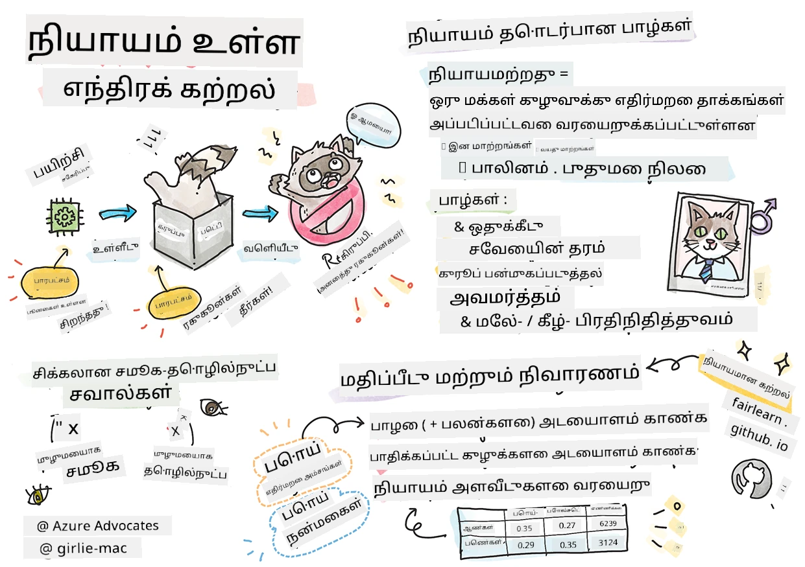
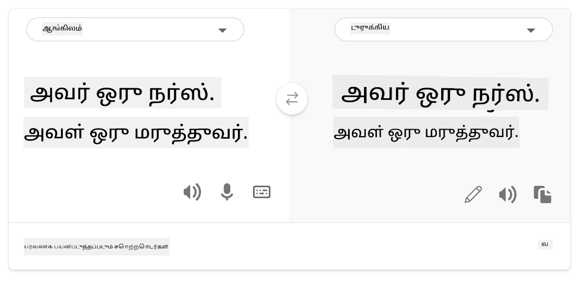
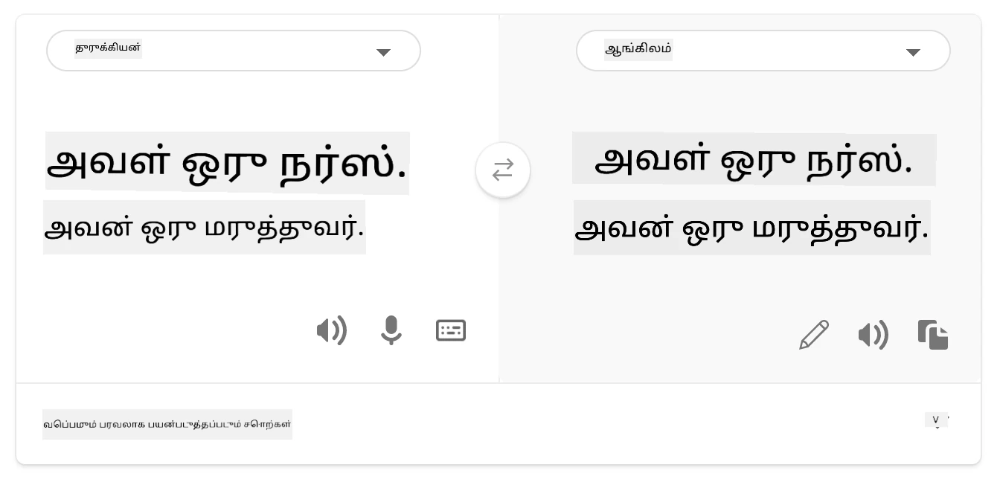
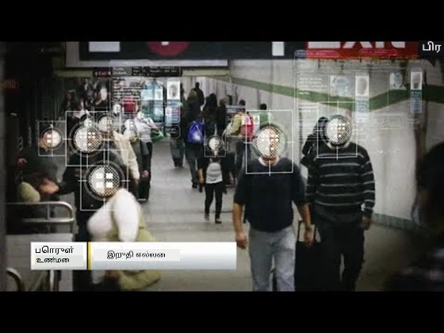

# பொறுப்புள்ள AI உடன் இயந்திர அறிதல் தீர்வுகளை கட்டமைத்தல்
 

> ஸ்கெட்ச்னோட் வழங்கியவர் [Tomomi Imura](https://www.twitter.com/girlie_mac)

## [முன்-பாதுகாப்பு வினாடிக்குறிப்பு](https://ff-quizzes.netlify.app/en/ml/)
 
## அறிமுகம்

இந்த பாடத்திட்டத்தில், இயந்திர அறிதல் எப்படியும் எங்கள் தினசரி வாழ்க்கையை பாதித்து வருகிறது என்பதை நீங்கள் அறிதல் செய்ய தொடங்குவீர்கள். இப்போது கூட, உத்திகள் மற்றும் மாதிரிகள் தினசரி தீர்மானங்களை செய்ய உதவுகின்றன, உதாரணமாக மருத்துவ التشخیصகள், கடன் அனுமதிகள் அல்லது மோசடி கண்டறிதல் போன்றவை. ஆகவே, இந்த மாதிரிகள் நம்பத்தகுந்த முடிவுகளை வழங்குவதற்கு நல்ல முறையில் செயல்படுவது முக்கியம். எந்த மென்பொருள் பயன்பாட்டும் போல, AI அமைப்புகள் எதிர்பார்ப்புகளை பூர்த்தி செய்யாமலோ தவறான முடிவுகளை தருவதோ இருக்கலாம். அதனால் AI மாதிரியின் நடத்தை புரிந்து விளக்க முடிவது அவசியமே.

நீங்கள் உருவாக்கும் மாதிரிகளின் தரவு சில இனக்கூட்டங்கள், பாலினம், அரசியல் பார்வை, மதம் போன்றவற்றை கொண்டிராதது அல்லது அவற்றை தவறாக பிரதிபலிக்கும் போது என்ன நடக்கும் என்று கற்பனை செய்யுங்கள். மாதிரியின் முடிவுகள் சில இனக்கூட்டங்களை ஆதரிக்கப்படுமாறு வலைபார்க்கப்படும்போது என்ன நடக்கும்? பயன்பாட்டிற்கான விளைவுகள் என்ன? கூடுதலாக, மாதிரி எதிர்மறை முடிவை கொண்டதும் அது மனிதர்களுக்கு தீங்கு விளைவித்தால் என்ன? AI அமைப்புகளின் நடத்தைக்கான பொறுப்பாளர் யார்? இந்தக் கேள்விகள் இந்த பாடத்திட்டத்தில் ஆராயப்படும்.

இந்த பாடத்தில் நீங்கள்:

- இயந்திர அறிதல் மற்றும் நீதித்தன்மை தொடர்பான தீங்குகளைப் பற்றிய உங்கள் விழிப்புணர்வை உயர்த்துவீர்கள்.
- நம்பகத்தன்மை மற்றும் பாதுகாப்பை உறுதிப்படுத்த, விசித்திரமான மற்றும் தவிர்க்க முடியாத சூழல்களை ஆராயும் பழக்கம் பற்றி அறிந்து கொள்வீர்கள்.
- அனைவரையும் சாமர்த்தியமிக்க அமைப்புகளை வடிவமைக்கும் தேவையை புரிந்து கொள்வீர்கள்.
- தரவு மற்றும் மக்களின் தனியுரிமை மற்றும் பாதுகாப்பை எவ்வாறு பாதுகாப்பது என்பது முக்கியத்தை ஆராய்வீர்கள்.
- AI மாதிரிகளின் நடத்தை விளக்க ஒரு தெளிவான அணுகுமுறையின் முக்கியத்துவத்தை காண்பீர்கள்.
- AI அமைப்புகளில் நம்பிக்கை உருவாக்க பொறுப்புக்கூறல் அவசியம் என்பதை நினைவில் வைப்பீர்கள்.

## முன்னோட்டம்

முன்னோட்டமாக, "பொறுப்புள்ள AI கொள்கைகள்" கற்றல் பாதையைப் பின்பற்றவும் கீழுள்ள காணொளியை பாருங்கள்:

பொறுப்புள்ள AI பற்றி மேலும் அறிய இந்த [கற்றல் பாதையை](https://docs.microsoft.com/learn/modules/responsible-ai-principles/?WT.mc_id=academic-77952-leestott) பின்பற்றவும்

> 🎥 மேலுள்ள படத்தில் கிளிக் செய்து காணொளியை பாருங்கள்: Microsoft இன் பொறுப்புள்ள AI அணுகுமுறை

## நீதித்தன்மை

AI அமைப்புகள் அனைவரிடத்திலும் நீதியான முறையில் நடத்த வேண்டும் மற்றும் ஒரே மாதிரிக்குழுக்களை வேறுபட்ட முறையில் பாதிக்க கூடாது. உதாரணமாக, மருத்துவச் சிகிச்சை, கடன் விண்ணப்பங்கள், வேலை வாய்ப்பு போன்றவற்றில் AI அமைப்புகள் ஒரே அறிகுறிகள், நிதி சூழல்கள் அல்லது தொழில்முறை தகுதிகள் கொண்ட அனைவருக்கும் ஒரே பரிந்துரைகளை வழங்க வேண்டும். ஒவ்வொரு மனிதனும் உள்ளபடி பாரபட்சங்கள் கொண்டிருப்பது வழக்கமாகும், அவை AI அமைப்புகளை பயிற்சி தர தரவுகளில் எளிதில் தெரியும். இத்தகைய மாற்றல்கள் சில நேரங்களில்意ப்படாமல் நிகழலாம். தரவை உள்ளடக்கியபோது பாரபட்சத்தை உணர்ந்து உணர்ச்சியாக உணர்வது கடினம்.

**“நீதியற்ற தன்மை”** என்பது ஒரு குழுவுக்கான (வங்கிகள், பாலினம், வயது, வலிமை நிலை போன்றவை அடிப்படையாக கொண்ட) எதிர்மறை தாக்கங்களை குறிக்கிறது. முக்கிய நீதியற்ற தீங்குகள் வகைப்படுத்தப்படலாம்:

- **பிரிப்பு**, உதாரணமாக ஒரு பாலினம் அல்லது இனப்பேருந்து மற்றவருக்கு முன்னுரிமை அளிக்கும் போது.
- **சேவை தரம்**. ஒரு குறிப்பிட்ட சூழலுக்கான தரவை பயிற்சி செய்தால் ஆனால் நிஜம் அதிக சிக்கலானது என்றால் சேவை மோசமாக செயல்படும். எடுத்துக்காட்டு, கருப்பு தோலுடையவர்களை உணர முடியாத கை சோப்புக் குவியல். [காண Reference](https://gizmodo.com/why-cant-this-soap-dispenser-identify-dark-skin-1797931773)
- **முறைப்பாடு**. தவறாக விமர்சித்து யாரோரை அல்லது ஒன்றை குறைவாக குறிக்க. உதாரணமாக, கருப்பு தோலுடையவர்களுக்கு உருவப்படங்களை கொங்குகுட்டிகள் என தவறாக அடையாளம் கண்டு புகழடைந்த படம் அடையாளமிடும் தொழில்நுட்பம்.
- **அதிகப்படியான அல்லது குறைவான பிரதிநிதித்துவம்**. ஒரு குழுவை ஒரு தொழிலில் காணாததும், அந்த சேவையை முன்மொழியும் எந்த அமைப்பும் தீங்காக கருதப்படுகிறது.
- **கற்பனை முறைகள்**. குறிப்பிட்ட குழுவை முன்காணிக்கப்பட்ட பண்புகளுடன் இணைப்பது. உதாரணமாக, ஆங்கிலம் மற்றும் துருக்கிய மொழி மாறுதல் அமைப்பில் பாலினத்தைப் பற்றிய முறைப்பாடு காரணமாக தவறுகள் இருக்கும்.

> டுர்க்கிஷ் மொழிக்கு மொழிபெயர்ப்பு

> மீண்டும் ஆங்கிலம் மொழியில் மொழிபெயர்க்கப்பட்டது

AI அமைப்புகளை வடிவமைக்கும் மற்றும் சோதிக்கும் போது, AI நீதி புறக்கும் அல்லது விரிவடையும் வண்ணம் திட்டமிடலை தவிர்க்க வேண்டும் என்று உறுதி செய்ய வேண்டும். மனிதர்களும் செய்யக் கூடாத பாகுபாடான முடிவுகளை AI அமைப்புகள் வழங்கக்கூடாது. AI மற்றும் இயந்திர அறிதலில் நீதியை உறுதி செய்வது ஒரு சிக்கலான சமூக தொழில்நுட்பப் பணி.

### நம்பகத்தன்மை மற்றும் பாதுகாப்பு

நம்பிக்கையைக் கட்டியெழுப்ப AI அமைப்புகள் நம்பகமான, பாதுகாப்பான மற்றும் நிலையானவையாக இருக்க வேண்டும். AI அமைப்புகள் பல்வேறு சூழல்களில் எப்படி நடந்து கொள்வது என்பது முக்கியம், குறிப்பாக அசாதாரணச் சூழல்களில். AI தீர்வுகளை உருவாக்கும் போது, AI தீர்வுகள் சந்திக்கும் பல்வேறு சூழல்களை எப்படி கையாள்வது என்பது முக்கிய கவனம் பெற வேண்டும். ஒரு சுய இயக்கும் கார் மனிதர்களின் பாதுகாப்பை முதன்மைமாக நினைத்துக் கொள்ள வேண்டும். எனவே, காரின் AI அனைத்து சாத்தியமான சூழல்கள் (இரவு, மின்னிவடிவம், பனி, தெருக்கள் கடப்பவர்களின் பிள்ளைகள், செல்லப் பறவைகள், சாலை கட்டுமானங்கள்) ஆகியவற்றைக் கவனத்தில கொள்ள வேண்டும். AI அமைப்பின் எப்படி பல்வேறு சூழல்களை நம்பகமாக மற்றும் பாதுகாப்பாக கையாளும் என்பது வடிவமைப்பாளரின் கணிப்புக் திறனைக் காட்டும்.

> [🎥 காணொளிக்குச் செல்ல இங்கே கிளிக் செய்யவும்: ](https://www.microsoft.com/videoplayer/embed/RE4vvIl)

### சமவாய்மை

AI அமைப்புகள் அனைவரையும் ஈடுப்படுத்த மற்றும் அதிகாரப்படுத்த வடிவமைக்கப்பட வேண்டும். AI அமைப்புகளை வடிவமைக்கும் போது தரவியலாளர்கள் மற்றும் AI உருவாக்குநர்கள் தடைகளை கண்டறிந்து சரிசெய்ய வேண்டும், அது தவறுதலாக சிலரை பின்னடைவைச் செய்யாமல். உலகில் ஒரு பில்லியன் பேர் மாற்றுத் திறனாளிகளாக உள்ளனர். AI முன்னேற்றத்தால், அவர்கள் தினசரி வாழ்க்கையில் தகவல் மற்றும் வாய்ப்புகளை எளிதில் அடைய முடியும். தடைகளை எதிர்கொண்டு AI பொருட்களை மேம்படுத்தி அனைவருக்கும் நன்மைகள் தரும் அனுபவங்களை உருவாக்க இது வாய்ப்பை உருவாக்குகிறது.

> [🎥 சமவாய்மை பற்றிய காணொளிக்குச் செல்ல இங்கே கிளிக் செய்யவும்](https://www.microsoft.com/videoplayer/embed/RE4vl9v)

### பாதுகாப்பு மற்றும் தனியுரிமை

AI அமைப்புகள் பாதுகாப்பாகவும் மக்களின் தனியுரிமையை மதிப்பதாகவும் இருக்க வேண்டும். தனியுரிமை, தகவல் அல்லது வியாழ்கை பாதிப்புக்கு உள்ளாக்கும் அமைப்புகளில் மக்கள் குறைவான நம்பிக்கை கொண்டுள்ளனர். இயந்திர அறிதல் மாதிரிகளை பயிற்சி செய்யும் போது, சிறந்த முடிவுகளை வழங்க தரவை நம்புகிறோம். தரவின் மூலமும் நேர்மையும் கவனிக்கப்பட வேண்டும். எடுத்துக்காட்டு, தரவு பயனர் வழங்கியது என்பதா அல்லது பொதுவாகக் கிடைத்தது என்றோடு? அடுத்ததாக, தரவுடன் வேலை செய்வதில் ரகசிய தகவலை பாதுகாக்கும் மற்றும் தாக்குதல்களை எதிர்க்கும் AI அமைப்புகளை உருவாக்குவது அவசியம். AI அதிகரிக்கும் போது, தனியுரிமை மற்றும் முக்கிய தனிநபர் மற்றும் வணிகத் தகவலை பாதுகாப்பது முக்கியமும் சிக்கலானதும் ஆகிவிட்டது. தனியுரிமை மற்றும் தரவு பாதுகாப்பு பிரச்சனைகள் AI இல் அதிக கவனத்தை தேவைப்படுகிறது, ஏனெனில் தரவை அணுகுதல் AI அமைப்புகளுக்கு மனிதர்களைப் பற்றிய துல்லியமான மற்றும் அறிவுரைத்திறன் predictions அளிக்க தேவையானது.

> [🎥 பாதுகாப்பு பற்றிய காணொளிக்குச் செல்ல இங்கே கிளிக் செய்யவும்](https://www.microsoft.com/videoplayer/embed/RE4voJF)

- தொழில்துறையில், GDPR போன்ற ஒழுங்குமுறைகளால் வழிநடத்தப்பட்டு தனியுரிமை மற்றும் பாதுகாப்பில் பெரிய முன்னேற்றங்கள் சம்பந்தப்பட்டுள்ளன.
- ஆனால் AI அமைப்புகளுடன், அவற்றை அதிக தனிப்பட்ட மற்றும் செயல்திறனுள்ள ஆக்க கடுமையான தனியுரிமை இடைபிரச்சினை உள்ளது.
- இணையதள இணைந்த கணினிகள் பிறப்போடு போலவே, AI தொடர்பான பாதுகாப்பு பிரச்சனைகளும் பெருகிக் கொண்டு உள்ளது.
- அதே சமயம் AI பாதுகாப்பை மேம்படுத்த பயன்படுத்தப்படுகின்றது. உதாரணமாக, நவீன அன்டி வைரஸ் கண்காணிப்பாளர்கள் இன்று AI heuristic கள் மூலம் இயங்குகின்றன.
- எங்கள் தரவியல் செயல்முறை சமீபத்திய தனியுரிமை மற்றும் பாதுகாப்பு நடைமுறைகளுடன் ஒத்திசைக்கப்பட்டிருக்க வேண்டும்.

### வெளிப்படைத்தன்மை
AI அமைப்புகள் புரிந்துகொள்ள வழிமுறையாக இருக்க வேண்டும். வெளிப்படையான தன்மையின் முக்கிய பகுதியாக AI அமைப்புகளின் நடத்தை மற்றும் கூறுகளை விளக்க வேண்டும். AI அமைப்புகளை மேம்படுத்த stakeholders எவ்வாறு மற்றும் ஏன் இயங்குகின்றன என்பதைக் புரிந்து கொள்ள வேண்டும், மேலும் செயல்திறன் பிரச்சனைகள், பாதுகாப்பு மற்றும் தனியுரிமைக் கவலைகள், பாகுபாடு, நீக்கம் நடைமுறைகள் அல்லது எதிர்பாராத முடிவுகளை கண்டறிய வேண்டும். AI அமைப்புகளைப் பயன்படுத்துவோர் எப்போது, எப்போது ஏன், எப்படி பயன்படுத்துகிறார்கள் என்பதில் நேர்மையாக இருக்க வேண்டும். பயன்படுத்தும் அமைப்புகளின் வரம்புகளையும் மீறாது விளக்க வேண்டும். உதாரணமாக, வங்கி AI அமைப்பை விருப்ப கடன் முடிவுகள் ஆதரிக்க பயன்படுத்தினால், முடிவுகளை ஆய்வு செய்து எந்த தரவு பரிந்துரைகளை பாதிக்கிறது எனப் புரிந்து கொள்வது அவசியம். அரசு தொழில்களில் AI ஐ ஒழுங்குபடுத்த ஆரம்பித்துள்ளது; ஆகையால் டேட்டா அறிவியலாளர்களும் நிறுவனங்களும் AI அமைப்புகள் விதி கடைப்பிடிப்பைப் பூர்த்தி செய்கிறதா என்று விளக்க வேண்டும், குறிப்பாக தீய முடிவுகள் இருந்தால்.

> [🎥 வெளிப்படைத்தன்மை பற்றிய காணொளிக்குச் செல்ல இங்கே கிளிக் செய்யவும்](https://www.microsoft.com/videoplayer/embed/RE4voJF)

- AI அமைப்புகள் மிகவும் சிக்கலானவை என்பதனால் அவை எப்படி இயங்குகின்றன என புரிந்து கொள்ளவும் முடிவுகளை விவரிக்கவும் கடினம்.
- இந்த புரிதல் இல்லாத தன்மை பின்வரும் பணிக்கு பாதிப்பை உண்டாக்குகின்றது: நன்கு நிர்வகிக்க, செயல்படுத்தவும், ஆவணப்படுத்தவும்.
- இதேபோல், இந்த புரிதல் இல்லாத தன்மை AI அமைப்புகள் உருவாக்கும் முடிவுகளை பயன்படுத்தி எடுக்கப்படும் முடிவுகளின் மீது மிகப்பெரும் தாக்கம் செலுத்துகிறது.

### பொறுப்புக்கூறல்
 
AI அமைப்புகளை வடிவமைத்து வெளியிடும் நபர்கள் அவற்றின் செயல்பாடுகளுக்குப் பொறுப்பேற்க வேண்டும். முகம் அடையாளம் போல் பொறுப்புக்கூறல் மிகவும் அவசியம். சமீபத்தில், முகம் அடையாள தொழில்நுட்பத்திற்கு வருகையாளர்களிடமிருந்து அதிகத்தலைவாக கோரிக்கை ஏற்பட்டுள்ளது, குறிப்பாக பறந்துபோன பிள்ளைகளை கண்டுபிடிக்க போலீஸ் அமைப்புகள் இதை பயன்படுத்துகின்றன. ஆனால் இந்த தொழில்நுட்பம் அரசு அதன் குடிமக்களின் அடிப்படையான சுதந்திரங்களை இழுக்க செய்ய பயன்படுத்தப்படலாம், உதாரணமாக குறிப்பிட்ட நபர்களின் தொடர்ச்சியான கண்காணிப்பை இயல்புறுத்தல். இதனால் தரவியல் அறிவியலாளர்கள் மற்றும் நிறுவனங்கள் AI அமைப்பு நபர்களுக்கு அல்லது சமுதாயத்திற்கு ஏற்பும் தாக்கங்களை பொறுப்பாக ஏற்றுக்கொள்ள வேண்டும்.

> 🎥 மேலுள்ள படத்தில் கிளிக் செய்து காணொளியை பாருங்கள்: முகம் அடையாளத்தின் மூலம் பொதுக்கண்காணிப்பு எச்சரிக்கை

முற்றிலும், AI சமுதாயத்திற்கு கொண்டு வரும் முதல் தலைமுறையாக நாங்கள், கணினிகள் மக்களுக்கு பொறுப்பாயிருப்பதை எவ்வாறு உறுதி செய்வது மற்றும் கணினிகள் வடிவமைக்கும் மக்கள் மற்ற அனைவருக்கும் பொறுப்பாயிருப்பதை எவ்வாறு உறுதி செய்வது என்பது பெரிய கேள்வி ஆகும்.

## தாக்கம் மதிப்பீடு

இயந்திர அறிதல் மாதிரியை பயிற்சி செய்ய முன்னர், AI அமைப்பின் நோக்கம் என்ன என்பதை புரிந்து கொண்டு, உபயோக நோக்கம்; எங்கு அதன் செயல்பாடு; யார் அமைப்புடன் தொடர்பு கொள்ளும் என்பதை அறிந்து ஒரு தாக்கம் மதிப்பீடு செய்ய வேண்டும். இது சோதனை அல்லது மதிப்பீடு செய்யும் நபர்களுக்கு அமைப்பின் பாதிப்பு காரணிகள் மற்றும் எதிர்பார்க்கப்படும் விளைவுகளை அறிந்து எளிதாக்கும்.

தாக்கம் மதிப்பீடு செய்யும்போது கவனம் செலுத்த வேண்டிய பகுதிகள்:

* **நபர்களுக்கு எதிர்மறையான தாக்கம்**. எந்தவொரு கட்டுப்பாடுகள், தேவைகள், ஆதரிக்கப்படாத பயன்பாடு அல்லது அறியப்பட்ட வரம்புகள் அமைப்பின் செயல்திறனை பாதிப்பவை இருக்கலாம் என்ற அறிவு முக்கியம், அது நபர்களுக்கு தீங்கு விளைவிப்பதைத் தடுக்கும்.
* **தரவு தேவைகள்**. அமைப்பு தரவை எப்படி எங்கு பயன்படுத்தும் என்பதில் புரிதலை உருவாக்குவது, மேம்படுத்துனர்கள் தரவு தேவைகளை (உதா., GDPR அல்லது HIPAA தரவு விதிகள்) கவனத்தில் கொள்ள உதவும். மேலும், தரவு மூலமும் அளவும் பயிற்சிக்க மோசமாக இருக்குமா என ஆராய்க.
* **தாக்கம் சுருக்கம்**. அமைப்பினைப் பயன்படுத்தி வரும் சாத்தியமான தீங்குகளின் பட்டியலை சேகரிக்கவும். முழு ML வாழ்நாள் நிலத்தில், இவை சரிசெய்யப்பட்டதா அல்லது நிர்வகிக்கப்பட்டதா என பரிசீலனை செய்யவும்.
* **ஆறு முக்கியக் கொள்கைகளுக்கு பொருந்தக்கூடிய குறிக்கோள்கள்**. ஒவ்வொரு கொள்கை குறிக்கோளும் பூர்த்தியாயிற்றா? இடைவெளிகள் உள்ளனவா? என மதிப்பிடவும்.

## பொறுப்புள்ள AI உடன் பிழைதிருத்தல்

மென்பொருள் பயன்பாட்டைப் போல, AI அமைப்புகளுக்கான பிழைதிருத்தலும் அவற்றின் பிரச்சனைகளை கண்டறிந்து தீர்ப்பது அவசியம். மாதிரி எதிர்பார்த்தது போல செயல்படவில்லையெனில் பல காரணிகள் இருக்கலாம். பெரும்பான்மையான மரபு மாதிரி செயல்திறன் கணக்கீடுகள் மாதிரியின் செயல்திறன் அளவுகளின் எண் தொகுப்புகள் மட்டுமே ஆகும்; இவை AI பொறுப்பாக்க கொள்கைகளை மீறுது என்பதை ஆராய்வதற்கு போதுமானதல்ல. மேலும், இயந்திர அறிதல் மாதிரி ஒரு இரகசியப் பெட்டியாக இருக்கின்றது, அதனால் அதன் முடிவை தெளிவாக உணர்வது அல்லது பிழை செய்தால் விளக்குவது கடினமாகும். இந்த பாடத்திட்டத்தில் பின்னர், பொறுப்புள்ள AI டாஷ் போர்டு பயன்படுத்தி AI அமைப்புகளை பிழைதிருத்துவது கற்றுக்கொள்வோம். டாஷ்போர்டு ஒரு ஒருங்கிணைந்த கருவி, தரவியலாளர்கள் மற்றும் AI உருவாக்குநர்களுக்காக பின்வரும் பணிகளை செய்ய உதவுகிறது:

* **பிழை பகுப்பு**. அமைப்பில் நீதித்தன்மை அல்லது நம்பகத்தன்மைக்கு பாதிப்பூட்டும் பிழை பகிர்வு கண்டறிதல்.
* **மாதிரி பார்வை**. தரவு குழுக்களில் மாதிரி செயல்திறனில் உள்ள வேறுபாடுகளை கண்டறிதல்.
* **தரவு பகுப்பு**. தரவு பகிர்வு புரிந்துகொள்ளல் மற்றும் நீதித்தன்மை, சமவாய்மை மற்றும் நம்பகத்தன்மை பிரச்சனைகளுக்கு காரணமான பாகுபாடுகளை கண்டறிதல்.
* **மாதிரி விளக்கம்**. மாதிரியில் எது அதன் தீர்வுகளை பாதிக்கிறது என்பதைக் புரிந்து கொள்ளுதல். இது வெளிப்படைத்தன்மைக்கும் பொறுப்புக்கூறலுக்கும் முக்கியம்.

## 🚀 சவால்
 
தீங்கு ஏற்படுத்தப்படுவதை தடுக்க நாம் செய்ய வேண்டும்:

- அமைப்புகளை உருவாக்கும் மக்கள் பல்வேறு பின்னணி மற்றும் பார்வைகளைக் கொண்டிருக்க வேண்டும்
- எமது சமுதாயத்தின் பல்வேறு தரவுத்தொகுப்புகளில் முதலீடு செய்ய வேண்டும்
- பொறுப்புள்ள AI ஏற்பட்டால் அதை கண்டறிந்து சரி செய்ய இயந்திர அறிதல் வாழ்நாளில் சிறந்த முறைகளை மேம்படுத்த வேண்டும்

மாதிரியை உருவாக்கும் மற்றும் பயன்படுத்தும் போது அதன் நம்பிக்கையற்ற தன்மை உணரக்கூடிய நிலைமைகள் பற்றி யோசியுங்கள். மேலும் என்ன கவனிக்கப்பட வேண்டும்?

## [பிறகு-பாடம் வினாடிக்குறிப்பு](https://ff-quizzes.netlify.app/en/ml/)

## மீளாய்வு & சுயநிலை கற்றல்
 

இந்த படிப்பில், நீங்கள் இயந்திரக் கற்றலில் நியாயமாகத் தன்மையும் அவநியாயமாகத் தன்மையும் பற்றிய சில அடிப்படைக் கருத்துக்களை கற்றுக்கொண்டிருக்கிறீர்கள்.  
 
இந்த கருத்துக்களில் ஆழமாக சென்று பதிவு செய்ய, இந்த பணிமனை காணுங்கள்: 

- பொறுப்பான AI நோக்கில்: 원칙ங்களை நடைமுறையில் கொண்டு வருதல், Besmira Nushi, Mehrnoosh Sameki மற்றும் Amit Sharma இணைக்கையில்

> 🎥 மேலே உள்ள படமாக்குக்குக் கிளிக் செய்து காணொளியைப் பாருங்கள்: பொறுப்பான AI டூல்பாக்ஸ்: Besmira Nushi, Mehrnoosh Sameki, மற்றும் Amit Sharma ஆட்களால் உருவாக்கப்பட்ட ஓர் திறந்த மூலக் கட்டமைப்பு

மேலும், வாசிக்கவும்: 

- மைக்ரோசாஃப்ட் RAI வளக்கழகம்: [Responsible AI Resources – Microsoft AI](https://www.microsoft.com/ai/responsible-ai-resources?activetab=pivot1%3aprimaryr4) 

- மைக்ரோசாஃப்ட் FATE ஆராய்ச்சி குழு: [FATE: Fairness, Accountability, Transparency, and Ethics in AI - Microsoft Research](https://www.microsoft.com/research/theme/fate/) 

RAI டூல்பாக்ஸ்: 

- [Responsible AI Toolbox GitHub repository](https://github.com/microsoft/responsible-ai-toolbox)

Azure இயந்திரக் கற்றல் நியாயத்தினை உறுதி செய்யும் கருவிகள் பற்றி வாசிக்கவும்:

- [Azure Machine Learning](https://docs.microsoft.com/azure/machine-learning/concept-fairness-ml?WT.mc_id=academic-77952-leestott) 

## பணிகள்

[RAI டூல்பாக்ஸை ஆய்வு செய்யவும்](assignment.md)

---

<!-- CO-OP TRANSLATOR DISCLAIMER START -->
**மறுப்பு**:
இந்த ஆவணம் AI மொழிபெயர்ப்பு சேவை [Co-op Translator](https://github.com/Azure/co-op-translator) பயன்படுத்தி மொழிபெயர்க்கப்பட்டுள்ளது. நாங்கள் துல்லியத்திற்காக முயற்சி செய்துள்ளோம், ஆனால் தானாக செய்யப்படும் மொழிபெயர்ப்புகளில் பிழைகள் அல்லது தவறுகள் இருக்கலாம் என்பதை கவனத்தில் கொள்ளவும். அசல் ஆவணம் அதன் தாய்மொழியில் அதிகாரப்பூர்வ ஆதாரமாக கருதப்பட வேண்டும். முக்கியமான தகவல்களுக்கு, தொழில்நுட்பமான மனித மொழிபெயர்ப்பு பரிந்துரைக்கப்படுகிறது. இந்த மொழிபெயர்ப்பைப் பயன்படுத்துவதால் ஏற்படும் எந்த தவறான புரிதல்கள் அல்லது தவறான விளக்கத்திற்கும் நாங்கள் பொறுப்பில்வில்லை.
<!-- CO-OP TRANSLATOR DISCLAIMER END -->