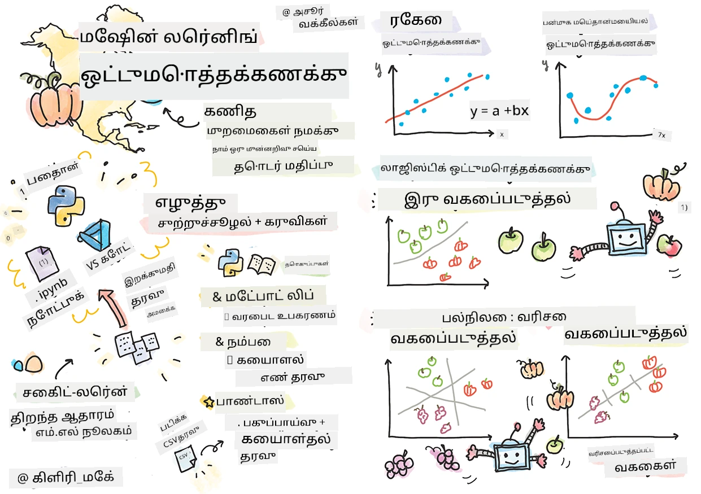
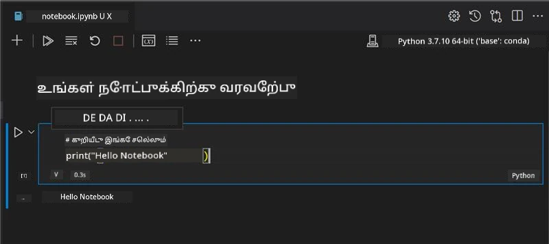
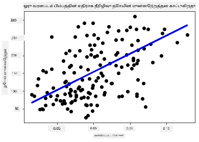

<!--
CO_OP_TRANSLATOR_METADATA:
{
  "original_hash": "fa81d226c71d5af7a2cade31c1c92b88",
  "translation_date": "2025-10-11T11:43:13+00:00",
  "source_file": "2-Regression/1-Tools/README.md",
  "language_code": "ta"
}
-->
# Python மற்றும் Scikit-learn மூலம் Regression மாடல்களை உருவாக்க தொடங்குங்கள்



> Sketchnote: [Tomomi Imura](https://www.twitter.com/girlie_mac) 

## [முன்-பாடம் வினாடி வினா](https://ff-quizzes.netlify.app/en/ml/)

> ### [இந்த பாடம் R-ல் கிடைக்கிறது!](../../../../2-Regression/1-Tools/solution/R/lesson_1.html)

## அறிமுகம்

இந்த நான்கு பாடங்களில், நீங்கள் regression மாடல்களை உருவாக்குவது எப்படி என்பதை அறிந்து கொள்ளுவீர்கள். இவை எதற்காக பயன்படுத்தப்படுகின்றன என்பதை விரைவில் விவாதிக்கப் போகிறோம். ஆனால், நீங்கள் ஏதேனும் செய்யும் முன், சரியான கருவிகளை அமைத்துக் கொள்ளுங்கள்!

இந்த பாடத்தில், நீங்கள் கற்றுக்கொள்ளப் போவது:

- உங்கள் கணினியை உள்ளூர் machine learning பணிகளுக்கு அமைத்தல்.
- Jupyter notebooks-ஐப் பயன்படுத்துதல்.
- Scikit-learn-ஐ நிறுவல் உட்பட பயன்படுத்துதல்.
- Linear regression-ஐ ஒரு செயல்முறை பயிற்சியுடன் ஆராய்தல்.

## நிறுவல் மற்றும் அமைப்புகள்

[](https://youtu.be/-DfeD2k2Kj0 "ML ஆரம்பம் - Machine Learning மாடல்களை உருவாக்க உங்கள் கருவிகளை அமைத்தல்")

> 🎥 மேலே உள்ள படத்தை கிளிக் செய்து ML அமைப்புகளை அமைப்பதற்கான குறுகிய வீடியோவைப் பாருங்கள்.

1. **Python-ஐ நிறுவுங்கள்**. [Python](https://www.python.org/downloads/) உங்கள் கணினியில் நிறுவப்பட்டுள்ளதா என்பதை உறுதிப்படுத்துங்கள். Python பல தரவியல் அறிவியல் மற்றும் machine learning பணிகளுக்கு பயன்படுத்தப்படும். பெரும்பாலான கணினி அமைப்புகளில் Python ஏற்கனவே நிறுவப்பட்டிருக்கும். [Python Coding Packs](https://code.visualstudio.com/learn/educators/installers?WT.mc_id=academic-77952-leestott) போன்றவை சில பயனர்களுக்கு அமைப்பை எளிதாக்க உதவுகின்றன.

   Python-ஐப் பயன்படுத்தும் சில பயன்பாடுகள் ஒரு பதிப்பை தேவைப்படுத்தும், மற்றவை வேறு பதிப்பை தேவைப்படுத்தும். இதனால், [virtual environment](https://docs.python.org/3/library/venv.html) பயன்படுத்துவது பயனுள்ளதாக இருக்கும்.

2. **Visual Studio Code-ஐ நிறுவுங்கள்**. Visual Studio Code உங்கள் கணினியில் நிறுவப்பட்டுள்ளதா என்பதை உறுதிப்படுத்துங்கள். [Visual Studio Code-ஐ நிறுவ](https://code.visualstudio.com/) இந்த வழிமுறைகளைப் பின்பற்றுங்கள். இந்த பாடத்தில் Python-ஐ Visual Studio Code-ல் பயன்படுத்தப் போகிறீர்கள், எனவே Python மேம்பாட்டுக்கான [Visual Studio Code-ஐ அமைப்பது](https://docs.microsoft.com/learn/modules/python-install-vscode?WT.mc_id=academic-77952-leestott) எப்படி என்பதைப் புரிந்துகொள்ளுங்கள்.

   > Python-ஐப் பயன்படுத்துவதில் நன்கு பழக [Learn modules](https://docs.microsoft.com/users/jenlooper-2911/collections/mp1pagggd5qrq7?WT.mc_id=academic-77952-leestott) தொகுப்பைச் சோதிக்கவும்.
   >
   > [](https://youtu.be/yyQM70vi7V8 "Visual Studio Code-இல் Python அமைப்பது")
   >
   > 🎥 மேலே உள்ள படத்தை கிளிக் செய்து Python-ஐ VS Code-இல் பயன்படுத்துவது பற்றிய வீடியோவைப் பாருங்கள்.

3. **Scikit-learn-ஐ நிறுவுங்கள்**, [இந்த வழிமுறைகளை](https://scikit-learn.org/stable/install.html) பின்பற்றுங்கள். Python 3-ஐ பயன்படுத்த வேண்டும் என்பதால், virtual environment-ஐ பயன்படுத்த பரிந்துரைக்கப்படுகிறது. குறிப்பாக, M1 Mac-ல் இந்த நூலகத்தை நிறுவுவதற்கு, மேலே இணைக்கப்பட்டுள்ள பக்கத்தில் சிறப்பு வழிமுறைகள் உள்ளன.

4. **Jupyter Notebook-ஐ நிறுவுங்கள்**. [Jupyter package](https://pypi.org/project/jupyter/) ஐ நிறுவ வேண்டும்.

## உங்கள் ML எழுத்து சூழல்

Python குறியீடுகளை உருவாக்கவும் machine learning மாடல்களை உருவாக்கவும் நீங்கள் **notebooks**-ஐப் பயன்படுத்தப் போகிறீர்கள். இந்த வகை கோப்பு தரவியல் விஞ்ஞானிகளுக்கு பொதுவான கருவியாகும், மேலும் அவற்றை `.ipynb` என்ற suffix அல்லது extension மூலம் அடையாளம் காணலாம்.

Notebooks என்பது ஒரு தொடர்பு சூழல் ஆகும், இது code எழுதவும், குறியீட்டின் சுற்றியுள்ள குறிப்புகள் மற்றும் ஆவணங்களை எழுதவும் டெவலப்பருக்கு அனுமதிக்கிறது, இது பரிசோதனை அல்லது ஆராய்ச்சி சார்ந்த திட்டங்களுக்கு மிகவும் உதவியாக இருக்கும்.

[](https://youtu.be/7E-jC8FLA2E "ML ஆரம்பம் - Regression மாடல்களை உருவாக்க Jupyter Notebooks அமைப்பது")

> 🎥 மேலே உள்ள படத்தை கிளிக் செய்து இந்த பயிற்சியைச் செய்ய குறுகிய வீடியோவைப் பாருங்கள்.

### பயிற்சி - ஒரு notebook-ஐப் பயன்படுத்துதல்

இந்த கோப்புறையில், _notebook.ipynb_ என்ற கோப்பு உள்ளது.

1. _notebook.ipynb_ ஐ Visual Studio Code-ல் திறக்கவும்.

   Python 3+ உடன் Jupyter server தொடங்கும். Notebook-இல் `run` செய்யக்கூடிய பகுதிகளை காணலாம், குறியீட்டு துண்டுகள். Play button போன்ற ஐகானைத் தேர்வு செய்வதன் மூலம் குறியீட்டு துண்டை இயக்கலாம்.

2. `md` ஐகானைத் தேர்வு செய்து, ஒரு markdown மற்றும் **# Welcome to your notebook** என்ற உரையைச் சேர்க்கவும்.

   அடுத்ததாக, சில Python குறியீட்டுகளைச் சேர்க்கவும்.

3. Code block-இல் **print('hello notebook')** எனத் தட்டச்சு செய்யவும்.
4. குறியீட்டை இயக்க ஐகானைத் தேர்வு செய்யவும்.

   நீங்கள் அச்சிடப்பட்ட உரையைப் பார்க்க வேண்டும்:

    ```output
    hello notebook
    ```



உங்கள் குறியீட்டுடன் குறிப்புகளை இணைத்து notebook-ஐ சுய ஆவணமாக்கலாம்.

✅ ஒரு வினாடி யோசிக்கவும்: ஒரு web developer-இன் வேலை சூழல் மற்றும் ஒரு data scientist-இன் வேலை சூழல் எவ்வளவு வேறுபட்டது?

## Scikit-learn-ஐ பயன்படுத்த தொடங்குதல்

Python உங்கள் உள்ளூர் சூழலில் அமைக்கப்பட்டு, Jupyter notebooks-இல் நீங்கள் வசதியாக உள்ளீர்கள், Scikit-learn-ஐ பயன்படுத்துவதிலும் வசதியாக இருக்கலாம். Scikit-learn [விரிவான API](https://scikit-learn.org/stable/modules/classes.html#api-ref) ஐ வழங்குகிறது, இது ML பணிகளைச் செய்ய உதவுகிறது.

அவர்களின் [வலைத்தளத்தின்](https://scikit-learn.org/stable/getting_started.html) படி, "Scikit-learn என்பது திறந்த மூல machine learning நூலகமாகும், இது supervised மற்றும் unsupervised learning-ஐ ஆதரிக்கிறது. இது மாடல் பொருத்துதல், தரவின் முன்னேற்பாடு, மாடல் தேர்வு மற்றும் மதிப்பீடு, மற்றும் பல பயன்பாடுகளுக்கான கருவிகளை வழங்குகிறது."

இந்த பாடத்தில், Scikit-learn மற்றும் பிற கருவிகளைப் பயன்படுத்தி machine learning மாடல்களை உருவாக்கப் போகிறீர்கள், இது 'சாதாரண machine learning' பணிகளைச் செய்ய உதவுகிறது. நாங்கள் neural networks மற்றும் deep learning-ஐ தவிர்த்துள்ளோம், ஏனெனில் அவை 'AI for Beginners' பாடத்திட்டத்தில் விரிவாக கற்பிக்கப்படும்.

Scikit-learn-ஐப் பயன்படுத்தி மாடல்களை உருவாக்கவும், அவற்றை மதிப்பீடு செய்யவும் எளிதாக உள்ளது. இது முக்கியமாக எண் தரவுகளைப் பயன்படுத்துவதில் கவனம் செலுத்துகிறது மற்றும் கற்றல் கருவிகளாக பயன்படுத்த pre-made datasets-ஐ கொண்டுள்ளது. இது மாணவர்கள் முயற்சிக்க pre-built models-ஐ கொண்டுள்ளது. முதலில் Scikit-learn-ஐப் பயன்படுத்தி prepackaged data-ஐ ஏற்றுதல் மற்றும் ஒரு built-in estimator மூலம் ஒரு அடிப்படை ML மாடலை உருவாக்குதல் ஆகியவற்றை ஆராய்வோம்.

## பயிற்சி - உங்கள் முதல் Scikit-learn notebook

> இந்த பயிற்சி Scikit-learn-இன் [linear regression உதாரணத்தால்](https://scikit-learn.org/stable/auto_examples/linear_model/plot_ols.html#sphx-glr-auto-examples-linear-model-plot-ols-py) ஊக்கமளிக்கப்பட்டது.

[](https://youtu.be/2xkXL5EUpS0 "ML ஆரம்பம் - Python-இல் உங்கள் முதல் Linear Regression திட்டம்")

> 🎥 மேலே உள்ள படத்தை கிளிக் செய்து இந்த பயிற்சியைச் செய்ய குறுகிய வீடியோவைப் பாருங்கள்.

இந்த பாடத்துடன் தொடர்புடைய _notebook.ipynb_ கோப்பில், 'trash can' ஐகானை அழுத்துவதன் மூலம் அனைத்து cells-ஐ அழிக்கவும்.

இந்த பகுதியில், Scikit-learn-இல் கற்றல் நோக்கங்களுக்காக உள்ள diabetes dataset-ஐப் பயன்படுத்தப் போகிறீர்கள். Diabetes நோயாளிகளுக்கான சிகிச்சையைச் சோதிக்க விரும்புகிறீர்கள் என்று கற்பனை செய்யுங்கள். Machine Learning மாடல்கள், மாறிகள் கூட்டங்களின் அடிப்படையில் எந்த நோயாளிகள் சிகிச்சைக்கு சிறந்த முறையில் பதிலளிக்க முடியும் என்பதைத் தீர்மானிக்க உதவலாம். ஒரு அடிப்படை regression மாடல் கூட, visualization மூலம், உங்கள் கற்பனை மருத்துவ பரிசோதனைகளை ஒழுங்கமைக்க உதவும் மாறிகள் பற்றிய தகவல்களை காட்டலாம்.

✅ பல வகையான regression முறைகள் உள்ளன, மேலும் நீங்கள் தேர்ந்தெடுப்பது உங்கள் கேள்விக்கு நீங்கள் தேடும் பதிலின் அடிப்படையில் இருக்கும். ஒரு குறிப்பிட்ட வயதுடைய நபரின் உயரத்தை கணிக்க விரும்பினால், நீங்கள் **எண் மதிப்பு** தேடுகிறீர்கள் என்பதால் linear regression-ஐப் பயன்படுத்துவீர்கள். ஒரு உணவின் வகை vegan ஆக கருதப்பட வேண்டுமா என்பதை கண்டறிய விரும்பினால், நீங்கள் **வகை ஒதுக்கீடு** தேடுகிறீர்கள், எனவே logistic regression-ஐப் பயன்படுத்துவீர்கள். Logistic regression பற்றி நீங்கள் பின்னர் மேலும் கற்றுக்கொள்வீர்கள். தரவின் மீது நீங்கள் கேட்கக்கூடிய சில கேள்விகள் மற்றும் எந்த முறைகள் பொருத்தமானவை என்பதைப் பற்றி சிந்தியுங்கள்.

இப்போது இந்த பணியைத் தொடங்குவோம்.

### நூலகங்களை இறக்குமதி செய்யுங்கள்

இந்த பணிக்காக சில நூலகங்களை இறக்குமதி செய்ய வேண்டும்:

- **matplotlib**. இது ஒரு பயனுள்ள [graphing tool](https://matplotlib.org/) ஆகும், மேலும் line plot உருவாக்க இது பயன்படுத்தப்படும்.
- **numpy**. [numpy](https://numpy.org/doc/stable/user/whatisnumpy.html) என்பது Python-இல் எண் தரவுகளை கையாள பயனுள்ள நூலகமாகும்.
- **sklearn**. இது [Scikit-learn](https://scikit-learn.org/stable/user_guide.html) நூலகம்.

உங்கள் பணிகளுக்கு உதவ சில நூலகங்களை இறக்குமதி செய்யுங்கள்.

1. கீழே உள்ள குறியீட்டை தட்டச்சு செய்து imports சேர்க்கவும்:

   ```python
   import matplotlib.pyplot as plt
   import numpy as np
   from sklearn import datasets, linear_model, model_selection
   ```

   மேலே நீங்கள் `matplotlib`, `numpy` மற்றும் `sklearn`-இல் இருந்து `datasets`, `linear_model` மற்றும் `model_selection`-ஐ இறக்குமதி செய்கிறீர்கள். `model_selection` தரவுகளை training மற்றும் test sets-ஆகப் பிரிக்க பயன்படுத்தப்படுகிறது.

### Diabetes dataset

Scikit-learn-இல் உள்ள [diabetes dataset](https://scikit-learn.org/stable/datasets/toy_dataset.html#diabetes-dataset) diabetes பற்றிய 442 மாதிரிகளை கொண்டுள்ளது, இதில் 10 feature variables உள்ளன, அவற்றில் சில:

- age: வயது ஆண்டுகளில்
- bmi: உடல் பருமன் குறியீடு
- bp: சராசரி இரத்த அழுத்தம்
- s1 tc: T-Cells (ஒரு வகை வெள்ளை இரத்த அணுக்கள்)

✅ இந்த dataset 'sex' என்ற feature variable-ஐ diabetes பற்றிய ஆராய்ச்சிக்கான முக்கிய அம்சமாகக் கொண்டுள்ளது. பல மருத்துவ datasets binary classification போன்றவற்றை உள்ளடக்கியுள்ளன. இவை மக்கள் தொகையின் சில பகுதிகளை சிகிச்சைகளிலிருந்து விலக்குவதற்கு எப்படி வழிவகுக்கின்றன என்பதை சிந்தியுங்கள்.

இப்போது X மற்றும் y தரவுகளை ஏற்றுங்கள்.

> 🎓 இது supervised learning என்பதை நினைவில் கொள்ளுங்கள், மேலும் named 'y' target தேவை.

ஒரு புதிய code cell-இல், `load_diabetes()` ஐ அழைத்து diabetes dataset-ஐ ஏற்றுங்கள். `return_X_y=True` எனும் input, `X` data matrix ஆகவும், `y` regression target ஆகவும் இருக்கும் என்பதை சுட்டிக்காட்டுகிறது.

1. Data matrix மற்றும் அதன் முதல் உருப்படியின் வடிவத்தை காட்ட print commands சேர்க்கவும்:

    ```python
    X, y = datasets.load_diabetes(return_X_y=True)
    print(X.shape)
    print(X[0])
    ```

    நீங்கள் பெறும் பதில் tuple ஆகும். Tuple-இன் முதல் இரண்டு மதிப்புகளை முறையே `X` மற்றும் `y`-க்கு ஒதுக்குகிறீர்கள். [Tuples பற்றி](https://wikipedia.org/wiki/Tuple) மேலும் அறிக.

    இந்த data 442 உருப்படிகளை 10 உருப்படிகளின் arrays வடிவில் கொண்டுள்ளது என்பதை நீங்கள் காணலாம்:

    ```text
    (442, 10)
    [ 0.03807591  0.05068012  0.06169621  0.02187235 -0.0442235  -0.03482076
    -0.04340085 -0.00259226  0.01990842 -0.01764613]
    ```

    ✅ Data மற்றும் regression target இடையேயான தொடர்பைப் பற்றி சிந்தியுங்கள். Linear regression feature X மற்றும் target variable y இடையேயான தொடர்புகளை கணிக்கிறது. Diabetes dataset-க்கு [target](https://scikit-learn.org/stable/datasets/toy_dataset.html#diabetes-dataset) என்ன என்பதை documentation-இல் கண்டுபிடிக்க முடியுமா? இந்த dataset என்ன காட்டுகிறது?

2. Dataset-இன் ஒரு பகுதியை plot செய்ய 3rd column-ஐத் தேர்ந்தெடுக்கவும். `:` operator-ஐப் பயன்படுத்தி அனைத்து rows-ஐத் தேர்ந்தெடுக்கவும், பின்னர் index (2) மூலம் 3rd column-ஐத் தேர்ந்தெடுக்கவும். Plot செய்ய 2D array-ஆக data-ஐ reshape செய்ய `reshape(n_rows, n_columns)` ஐப் பயன்படுத்தவும். Parameter-ல் ஒன்று -1 என்றால், தொடர்புடைய அளவுகள் தானாக கணக்கிடப்படும்.

   ```python
   X = X[:, 2]
   X = X.reshape((-1,1))
   ```

   ✅ எந்த நேரத்திலும், data-ஐ print செய்து அதன் வடிவத்தைச் சரிபார்க்கவும்.

3. Data plot செய்ய தயாராக உள்ளதால், இந்த dataset-இல் எண்களின் இடைவெளியை machine கண்டறிய உதவுமா என்பதைப் பார்க்கலாம். இதற்காக, data (X) மற்றும் target (y) இரண்டையும் test மற்றும் training sets-ஆகப் பிரிக்க வேண்டும். Scikit-learn-இல் இதைச் செய்ய எளிய வழி உள்ளது; test data-ஐ ஒரு குறிப்பிட்ட புள்ளியில் பிரிக்கலாம்.

   ```python
   X_train, X_test, y_train, y_test = model_selection.train_test_split(X, y, test_size=0.33)
   ```

4. இப்போது உங்கள் மாடலை train செய்ய தயாராக உள்ளீர்கள்! Linear regression model-ஐ ஏற்றவும் மற்றும் `model.fit()` ஐப் பயன்படுத்தி உங்கள் X மற்றும் y training sets-ஐ train செய்யவும்:

    ```python
    model = linear_model.LinearRegression()
    model.fit(X_train, y_train)
    ```

    ✅ `model.fit()` என்பது TensorFlow போன்ற பல ML நூலகங்களில் நீங்கள் காணும் ஒரு function ஆகும்.

5. பின்னர், test data-ஐப் பயன்படுத்தி prediction உருவாக்கவும், இது data குழுக்களுக்கிடையில் line-ஐ வரைய பயன்படுத்தப்படும்.

    ```python
    y_pred = model.predict(X_test)
    ```

6. இப்போது data-ஐ plot-இல் காட்ட நேரம். Matplotlib இந்த பணிக்குப் பயனுள்ள கருவியாகும். அனைத்து X மற்றும் y test data-களின் scatterplot உருவாக்கவும், மற்றும் model-ஐ data குழுக்களுக்கிடையில் மிகச் சரியான இடத்தில் line-ஐ வரைய prediction-ஐப் பயன்படுத்தவும்.

    ```python
    plt.scatter(X_test, y_test,  color='black')
    plt.plot(X_test, y_pred, color='blue', linewidth=3)
    plt.xlabel('Scaled BMIs')
    plt.ylabel('Disease Progression')
    plt.title('A Graph Plot Showing Diabetes Progression Against BMI')
    plt.show()
    ```

   
✅ இங்கே என்ன நடக்கிறது என்பதைப் பற்றி சிறிது யோசிக்கவும். ஒரு நேர்கோடு பல சிறிய தரவுப் புள்ளிகளின் வழியாக ஓடுகிறது, ஆனால் அது உண்மையில் என்ன செய்கிறது? புதிய, பார்க்கப்படாத தரவுப் புள்ளி ஒரு வரைபடத்தின் y அச்சுடன் தொடர்புடைய இடத்தில் பொருந்த வேண்டும் என்பதை நீங்கள் எப்படி கணிக்க முடியும் என்பதைப் பார்க்க முடியுமா? இந்த மாதிரியின் நடைமுறை பயன்பாட்டை வார்த்தைகளில் விளக்க முயற்சிக்கவும்.

வாழ்த்துக்கள், நீங்கள் உங்கள் முதல் நேரியல் மடங்கல் மாதிரியை உருவாக்கி, அதைப் பயன்படுத்தி ஒரு கணிப்பு செய்து, அதை ஒரு வரைபடத்தில் காட்டியுள்ளீர்கள்!

---
## 🚀சவால்

இந்த தரவுத்தொகுப்பில் இருந்து வேறு ஒரு மாறியை வரைபடமாக்கவும். குறிப்புகள்: இந்த வரியைத் திருத்தவும்: `X = X[:,2]`. இந்த தரவுத்தொகுப்பின் இலக்கை அடிப்படையாகக் கொண்டு, நீரிழிவு நோயின் முன்னேற்றம் பற்றியதை நீங்கள் கண்டறிய முடிகிறதா?

## [பாடத்திற்குப் பிந்தைய வினாடி வினா](https://ff-quizzes.netlify.app/en/ml/)

## மதிப்பீடு & சுயபடிப்பு

இந்த பாடத்தில், நீங்கள் எளிய நேரியல் மடங்கல் முறையைப் பயன்படுத்தினீர்கள், ஆனால் ஒருமாறி அல்லது பலமாறி மடங்கல் முறைகளைப் பயன்படுத்தவில்லை. இந்த முறைகளின் இடையிலான வேறுபாடுகள் பற்றி சிறிது படிக்கவும் அல்லது [இந்த வீடியோவை](https://www.coursera.org/lecture/quantifying-relationships-regression-models/linear-vs-nonlinear-categorical-variables-ai2Ef) பாருங்கள்.

மடங்கல் என்ற கருத்து பற்றி மேலும் படித்து, இந்த தொழில்நுட்பம் மூலம் எந்த வகையான கேள்விகளுக்கு பதில் அளிக்க முடியும் என்பதை யோசிக்கவும். உங்கள் புரிதலை ஆழமாக்க இந்த [பயிற்சியை](https://docs.microsoft.com/learn/modules/train-evaluate-regression-models?WT.mc_id=academic-77952-leestott) எடுத்துக்கொள்ளவும்.

## பணிக்கான ஒதுக்கீடு

[வேறு ஒரு தரவுத்தொகுப்பு](assignment.md)

---

**குறிப்பு**:  
இந்த ஆவணம் [Co-op Translator](https://github.com/Azure/co-op-translator) என்ற AI மொழிபெயர்ப்பு சேவையை பயன்படுத்தி மொழிபெயர்க்கப்பட்டுள்ளது. நாங்கள் துல்லியத்திற்காக முயற்சிக்கின்றோம், ஆனால் தானியங்கி மொழிபெயர்ப்புகளில் பிழைகள் அல்லது தவறான தகவல்கள் இருக்கக்கூடும் என்பதை கவனத்தில் கொள்ளவும். அதன் தாய்மொழியில் உள்ள மூல ஆவணம் அதிகாரப்பூர்வ ஆதாரமாக கருதப்பட வேண்டும். முக்கியமான தகவல்களுக்கு, தொழில்முறை மனித மொழிபெயர்ப்பு பரிந்துரைக்கப்படுகிறது. இந்த மொழிபெயர்ப்பைப் பயன்படுத்துவதால் ஏற்படும் எந்த தவறான புரிதல்கள் அல்லது தவறான விளக்கங்களுக்கு நாங்கள் பொறுப்பல்ல.