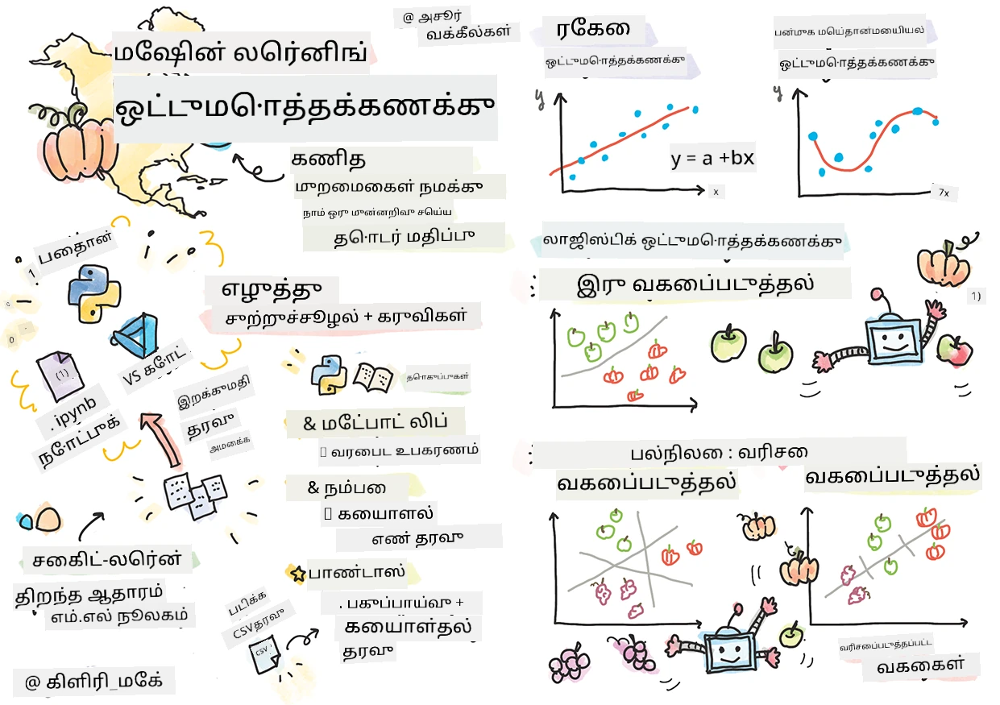
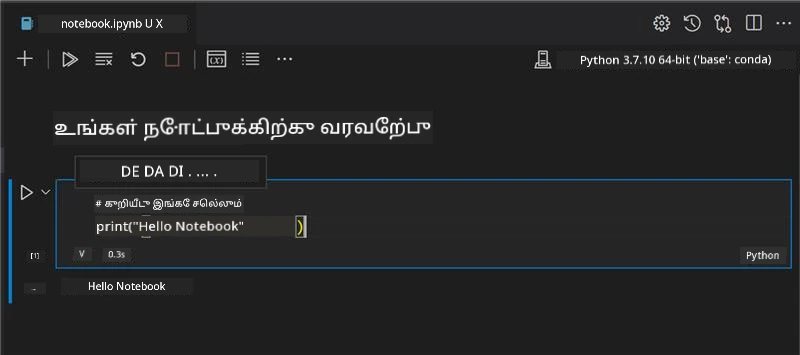
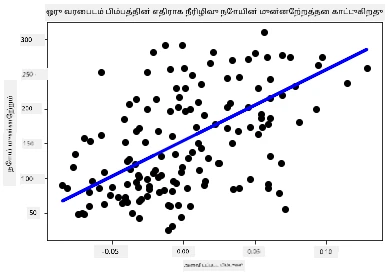

# Python மற்றும் Scikit-learn இல் regression மாதிரிகளுடன் தொடங்குதல்



> [Tomomi Imura](https://www.twitter.com/girlie_mac) அவர்களின் ஸ்கெட்ச் நோட்

## [முன்னணி வகுப்புக்கான வினாடி வினா](https://ff-quizzes.netlify.app/en/ml/)

> ### [இந்த பாடம் R உள்ளடக்கத்தில் உள்ளது!](../../../../2-Regression/1-Tools/solution/R/lesson_1.html)

## அறிமுகம்

இந்த நான்கு பாடங்களில், நீங்கள் regression மாதிரிகள் எவ்வாறு உருவாக்கப்படுகின்றன என்பதை அறிந்துகொள்ளப்போகிறீர்கள். இவற்றின் பயன்பாடு யாது என்பது விரைவில் விவாதிக்கப்படும். ஆனாலும் உங்கள் செயல்முறை தொடங்குவதற்கு முன் சரியான கருவிகள் உங்களிடம் இருக்கின்றனவா என்பதை உறுதிசெய்யுங்கள்!

இந்த பாடத்தில் நீங்கள் கற்றுக்கொள்ளப்போகிர்கள்:

- உள்ளூர் கணினி கற்றல் பணிகளுக்கு உங்கள் கணினியை அமைத்தல்.
- Jupyter Notebooks- உடன் பணியாற்றல்.
- Scikit-learn ஐ பயன்படுத்துதல், நிறுவலுடன் சேர்த்து.
- நடைமுறைப் பயிற்சியுடன் கூட linear regression ஐ ஆராய்தல்.

## நிறுவல்கள் மற்றும் அமைப்புகள்

[](https://youtu.be/-DfeD2k2Kj0 "ஆரம்பக்கார ML பயனாளிகளுக்கு - உங்கள் கருவிகளை தயார் செய்து மெஷின் கற்றல் மாதிரிகள் உருவாக்குதல்")

> 🎥 மேலுள்ள படத்தை கிளிக் செய்து, ML ன் கீழ் கணினி அமைப்பை அமைப்பதற்கான சுருக்க வீடியோவை பார்க்கவும்.

1. **Python ஐ நிறுவுக**. உங்கள் கணினியில் [Python](https://www.python.org/downloads/) நிறுவப்பட்டுள்ளது என்பதை உறுதிசெய்யுங்கள். பல தரவு அறிவியல் மற்றும் மெஷின் கற்றல் பணிகளுக்கு Python பயன்படுத்தப்படுகிறது. பெரும்பாலான கணினி செயல்பாட்டு அமைப்புகளில் Python ஏற்கனவே நிறுவப்பட்டுள்ளது. சில பயனர்களுக்காக, அமைப்பை எளிதாக்கும் [Python Coding Packs](https://code.visualstudio.com/learn/educators/installers?WT.mc_id=academic-77952-leestott) கூட கிடைக்கின்றன.

   ஆனால் Python ன் சில பயன்பாடுகள் ஒரே பதிப்பைத் தேவைப்படுத்தும், மற்றவை வேறு பதிப்பை வேண்டலாம். அதனால் [virtual environment](https://docs.python.org/3/library/venv.html) பயன்படுத்துவது பயனுள்ளது.

2. **Visual Studio Code ஐ நிறுவுக**. உங்கள் கணினியில் Visual Studio Code நிறுவப்பட்டுள்ளதா என உறுதிசெய்யவும். அடிப்படையான நிறுவலுக்கு [Visual Studio Code ஐ நிறுவும்](https://code.visualstudio.com/) படிகள் பின்பற்றவும். இந்த பாடத்தில் நீங்கள் Visual Studio Code இல் Python பயன்படுத்தப்போகின்றீர்கள், எனவே Python அபிவிருத்திக்கான [Visual Studio Code அமைப்புகள்](https://docs.microsoft.com/learn/modules/python-install-vscode?WT.mc_id=academic-77952-leestott) பற்றியும் தெரிந்து கொள்வது நல்லது.

   > Python உடன் பழக [Learn modules](https://docs.microsoft.com/users/jenlooper-2911/collections/mp1pagggd5qrq7?WT.mc_id=academic-77952-leestott) தொகுப்பைப் பயன்படுத்துங்கள்.
   >
   > [](https://youtu.be/yyQM70vi7V8 "Visual Studio Code உடன் Python அமைப்பு")
   >
   > 🎥 மேலுள்ள படத்தை கிளிக் செய்து VS Code இல் Python பயன்படுத்தும் வீடியோவை காணவும்.

3. **Scikit-learn ஐ நிறுவுக**, [இந்தக் கட்டளைகள்](https://scikit-learn.org/stable/install.html) வழிமுறைகளை பின்பற்றி. Python 3 ஐப் பயன்படுத்தியிருப்பது அவசியம், அதனால் virtual environment பயன்படுத்துவதே நல்லது. குறிப்பாக M1 Mac இல் நிறுவும் போது மேலுள்ள பக்கத்தில் குறிப்பிட்டுள்ள தனித்துவமான வழிமுறைகள் உள்ளன.

1. **Jupyter Notebook ஐ நிறுவுக**. [Jupyter தொகுப்பை நிறுவ](https://pypi.org/project/jupyter/) வேண்டும்.

## உங்கள் ML எழுத்துப்படைமை

நீங்கள் Python கோ드를 உருவாக்கவும் மெஷின் கற்றல் மாதிரிகள் உருவாக்கவும் **notebooks** பயன்படுத்தப்போகிறீர்கள். இந்த வகை கோப்புகள் தரவு அறிவியலாளர்களுக்கு பொதுவான கருவி ஆகும், அவை `.ipynb` என்ற உச்சரிப்பு அல்லது நீட்டிப்பால் அடையாளம் காணப்படுகின்றன.

Notebooks என்பது code எழுதுவதோடு சேர்த்து குறிப்புகள் சேர்க்கவும் மற்றும் கோட் குறித்து ஆவணப்படுத்தல் செய்யவும் உதவும் துறைமுகச் சூழல் ஆகும், இது பரிசோதனை அல்லது ஆராய்ச்சி நோக்கங்களில் மிகவும் உதவுகிறது.

[](https://youtu.be/7E-jC8FLA2E "ஆரம்பக்கார ML பயனாளிகளுக்கு - Jupyter Notebooks அமைத்து regression மாதிரிகள் உருவாக்க தொடங்கு")

> 🎥 மேலுள்ள படத்தை கிளிக் செய்து இந்த பயிற்சியை காணவும்.

### பயிற்சி - ஒரு notebook உடன் பணியாற்றல்

இந்த கோப்பகத்தில், _notebook.ipynb_ என்ற கோப்பை காணலாம்.

1. Visual Studio Code இல் _notebook.ipynb_ ஐ திறக்கவும்.

   Python 3+ கொண்டு Jupyter சேவை துவங்கும். notebook இல் சில பகுதிகள் `run` செய்ய கூடிய குறியீடு துண்டுகள். ஒரு குறியீடு அலகை இயக்க, பிளே பொத்தானைப் போன்ற ஐகானை தேர்ந்தெடுக்க வேண்டும்.

1. `md` ஐகானை தேர்ந்தெடுத்து குறைவான markdown மற்றும் **# Welcome to your notebook** என எழுது.

   அடுத்ததாக சில Python குறியீடுகளை சேர்க்கவும்.

1. குறியீடு பகுதி இல் **print('hello notebook')** என தட்டச்சு செய்க.
1. குறியீட்டைக் இயக்க அம்புத்திற்குக் கீழே இருக்கும் அம்பையைக் கிளிக் செய்க.

   அச்சிடப்பட்ட கூற்று கீழ்க்காணும்:

    ```output
    hello notebook
    ```



நீங்கள் բացառவும் பின்னூட்டங்களுடன் உங்கள் குறியீட்டை இணையடுக்கலாம், இது notebook ஐ தானாக ஆவணப்படுத்த உதவும்.

✅ ஒரு நிமிடம் யோசிக்கவும்: வலை வடிவமைப்பாளரின் வேலை சூழல் மற்றும் ஒரு தரவு அறிவியலாளரின் வேலை சூழல் எப்படி வேறுபடுகிறது.

## Scikit-learn உடன் தொடங்குதல்

இப்போது Python உங்கள் உள்ளூரில் அமைக்கப்பட்டுவிட்டது, Jupyter Notebooks உடன் நீங்கள் பழகியுள்ளீர்கள், இனி Scikit-learn உடனும் பழகுவோம் (`sci` என்றபடி உயிரியல் அறிவியலால் உச்சரிக்க). Scikit-learn ML பணிகளைச் செய்ய உதவும் [பெரிய API](https://scikit-learn.org/stable/modules/classes.html#api-ref) வழங்குகிறது.

அவர்களின் [வலைத்தளத்தின்படி](https://scikit-learn.org/stable/getting_started.html), "Scikit-learn என்பது மேற்பார்வையிடப்பட்ட மற்றும் மேற்பார்வையிடப்படாத கற்றலைக் குறைக்கும் திறன் கொண்ட திறந்த மூல மெஷின் கற்றல் நூலகம். இது மாதிரி பொருத்தல், தரவு முன்னோத்தல், மாதிரி தேர்வு மற்றும் மதிப்பீடு உள்ளிட்ட பல கருவிகள் வழங்குகிறது."

இந்த பாடத்தில், நீங்கள் Scikit-learn மற்றும் பிற கருவிகளை பயன்படுத்தி 'சார்பான மெஷின் கற்றல்' பணிகளைச் செய்வீர்கள். நியூரல் நெட்வொர்க்கள் மற்றும் ஆழமான கற்றல் இவற்றை தவிர்த்துள்ளோம், அவை வரும் 'AI for Beginners' பாடத்திட்டத்தில் விரிவாக கற்றுக்கொடுக்கப்படும்.

Scikit-learn உருவாக்க மற்றும் மதிப்பீடு செய்ய எளிதாக்குகிறது. இது பெரும்பாலும் எண் தரவை எடுத்து செயல்படுகிறது மற்றும் பல தயார் செய்யப்பட்ட தரவு தொகுப்புகளும் மாதிரிகள் உள்ளன. அவற்றை முயற்சி செய்ய மாணவர்கள் பயன்படுத்தலாம். முதலில் உபகரிக்கப்பட்ட தரவு ஏற்றுதல் மற்றும் உள்ளமைக்கப்பட்ட எஸ்டிமேட்டர் மூலம் எடுக்கப்படும் முதல் ML மாதிரி பற்றி ஆய்வோம்.

## பயிற்சி - உங்கள் முதல் Scikit-learn notebook

> இந்த பயிற்சிக்கு ஊக்குவிப்பாக Scikit-learn வலைத்தளத்தில் உள்ள [linear regression உதாரணம்](https://scikit-learn.org/stable/auto_examples/linear_model/plot_ols.html#sphx-glr-auto-examples-linear-model-plot-ols-py) உள்ளது.


[](https://youtu.be/2xkXL5EUpS0 "ஆரம்பக் கர ML பயனாளிகள் - உங்கள் முதல் Linear Regression திட்டம் Python இல்")

> 🎥 மேலுள்ள படத்தை கிளிக் செய்து இந்த பயிற்சியை காணவும்.

இந்த பாடத்தின் தொடர்புடைய _notebook.ipynb_ கோப்பில் அனைத்து செல்களையும் 'துப்பாக்கி' ஐகானை அழுத்தி அழிக்கவும்.

இந்தக் பகுதியில், கிளிநோய்களுக்கான சிறிய தரவு தொகுப்புடன் பணிபுரிகின்றீர்கள், இது Scikit-learn இல் கற்றல் நோக்கத்திற்காக உள்ளது. ஒரு சிகிச்சையை கணுக்கால நோயாளிகளுக்கு சோதிக்க விரும்பினால், மெஷின் கற்றல் மாதிரிகள் எந்த நோயாளிகள் சிறப்பாக பதில் அளிக்கக்கூடியார்கள் என்று உதவியாக இருக்கலாம், பல மாறிலிகள் அடிப்படையில். மிக அடிப்படையான regression மாதிரி கூட மாறிலிகள் பற்றி தகவல் காட்ட வாய்ப்பு உள்ளது, அது உங்கள் கருத்து செயலாக்கங்களை அமைக்க உதவும்.

✅ பல regression முறைமைகள் உள்ளன, எது தேர்வு செய்வது என்பதை நீங்கள் எதிர்பார்க்கும் பதிலின் அடிப்படையில் தீர்மானிக்க வேண்டும். உதாரணமாக, ஒரு குறிப்பிட்ட வயதுக்கான ஒருவரின் உயரம் கணிப்பதற்கு linear regression உகந்தது, ஏனெனில் நீங்கள் ஒரு **எண் மதிப்பை** தேடுகிறீர்கள். ஒரு உணவுப் பரிமாணம் வேகன் தட்டியோடு பொருந்துமா என்று கண்டுபிடிக்க விரும்பினால், நீங்கள் **வகை வகுப்பு** தேடுகிறீர்கள், அதற்கு logistic regression பயன்படுத்தப்படும். அதன் பற்றி பிறகு கற்றுக்கொள்வீர்கள். தரவுகளிடமிருந்து கேள்விகள் என்ன என்பதையும், எந்த regression முறைகள் பொருத்தமானவை என்பதையும் சிந்தியுங்கள்.

இப்போதெல்லாம் செயல்படுவோம்.

### நூலகங்களை இறக்குமதி செய்யவும்

இந்த பணிக்காக சில நூலகங்களை இறக்குமதி செய்வோம்:

- **matplotlib**. இது பயனுள்ள [வரைபட கருவி](https://matplotlib.org/) ஆகும், மற்றும் நாங்கள் ஒரு கோடு வரைபடம் உருவாக்க பயன்படுகின்றோம்.
- **numpy**. [numpy](https://numpy.org/doc/stable/user/whatisnumpy.html) என்பது Python இல் எண் தரவை கையாள உதவும் நூலகம்.
- **sklearn**. இது [Scikit-learn](https://scikit-learn.org/stable/user_guide.html) நூலகம்.

உங்கள் பணிக்கு உதவும் நூலகங்களை இறக்குமதி செய்யவும்.

1. கீழ்க்காணும் குறியீட்டை டைப் செய்து இறக்குமதிகளைச் செய்யவும்:

   ```python
   import matplotlib.pyplot as plt
   import numpy as np
   from sklearn import datasets, linear_model, model_selection
   ```

   மேற்கோள்: நீங்கள் `matplotlib`, `numpy` ஆகியவற்றையும், `sklearn` இலிருந்து `datasets`, `linear_model`, மற்றும் `model_selection` ஐ இறக்குமதி செய்து கொண்டிருக்கிறீர்கள். `model_selection` உடன் தரவுகளை பயிற்சி மற்றும் சோதனை தொகுதிகள் ஆகப் பிரிக்கின்றீர்கள்.

### கிளிநோய் தரவு தொகுப்பு

உள்ளமைக்கப்பட்ட [கிளிநோய் dataset](https://scikit-learn.org/stable/datasets/toy_dataset.html#diabetes-dataset) 442 மாதிரிகளைக் கொண்டுள்ளது, 10 பண்புகளுடன், அவற்றில் சில:

- வயது: வயது ஆண்டுகளில்
- bmi: உடல் பருமன் குறியீடு
- bp: மத்திய இரத்த அழுத்தம்
- s1 tc: T-மதுக்கள் (ஒவ்வொரு வெள்ளை உமிழ்மதுக்கள் வகை)

✅ இந்த dataset-ல் 'செக்ஸ்' எனும் binary வகுப்பு உண்டு, இது கிளிநோய் ஆராய்ச்சி பயனுள்ள ஒன்று. பல மருத்துவ தரவுத் தொகுப்புகள் இத்தகைய binary வகுப்பு கொண்டுள்ளன. இவ்வாறு வகைப்படுத்தல்கள் மக்கள் தொகையின் சில பகுதிகளை சிகிச்சைகளிலிருந்து விலக்கக்கூடும் என்று சிந்தியுங்கள்.

இப்போது, X மற்றும் y தரவுகளை ஏற்றுக.

> 🎓 நினைவில் கொள், இது மேற்பார்வையுடன் கற்றல் எனும் அம்சம், எனவே பெயரிடப்பட்ட 'y' இலக்கு தேவை.

புதிய குறியீடு செல்களில், `load_diabetes()` ஐ அழைத்துக் கொண்டு diabetes dataset-ஐ ஏற்கவும். உள்ளீடு `return_X_y=True` என்பது `X` என்பது தரவுப் புள்ளிகளுக்கான மேட்ரிக்ஸ் ஆகும், `y` என்பது regression இலக்காக இருக்கும்.

1. தரவு மேட்ரிக்ஸின் வடிவமைப்பையும் அதன் முதல் பொருளையும் அச்சிடுவதற்கான print கட்டளைகள் சேர்க்கவும்:

    ```python
    X, y = datasets.load_diabetes(return_X_y=True)
    print(X.shape)
    print(X[0])
    ```

    நீங்கள் பெறுகின்ற விடை ஒரு tuple ஆகும். இதன் முதல் இரண்டு மதிப்புகளைவெவ்விலுமாக `X` மற்றும் `y` க்கு ஒதுக்குகிறீர்கள். [tuple பற்றி மேலும் தெரியுமா](https://wikipedia.org/wiki/Tuple).

    இந்த தரவு 442 உருப்படியைக் கொண்டு 10 உறுப்புகளின் வரிசைகள் வடிவத்தில் உள்ளது:

    ```text
    (442, 10)
    [ 0.03807591  0.05068012  0.06169621  0.02187235 -0.0442235  -0.03482076
    -0.04340085 -0.00259226  0.01990842 -0.01764613]
    ```

    ✅ தரவு மற்றும் regression இலக்குக்கிடையிலான உறவினைப் பற்றிக் சிந்தியுங்கள். Linear regression அம்ச X மற்றும் இலக்கு y இடையிலான உறவுகளை கணக்கிடுகிறது. கிளிநோய் dataset இன் [இலக்கு](https://scikit-learn.org/stable/datasets/toy_dataset.html#diabetes-dataset) ஆவணத்தில் உள்ளதா? இந்த dataset எதை விளக்குகிறது என்பதைக் கவனித்து பார்க்கவும்.

2. அடுத்ததாக, dataset இன் ஒரு பகுதியை வரைபடமாகக் காட்ட 3வது நெடு நெடுவரிசையைத் (index 2) தேர்ந்தெடுக்கவும். இதற்கு உங்கள் எல்லா வரிசைகளையும் `:` மூலம் தேர்வு செய்து 3வது நெடுவரிசையை நினைவில் கொள்ளவும். 2D வரிசையாக மாற்றவும் `reshape(n_rows, n_columns)` பயன்படுத்தவும். ஒரு அளவுரு -1 என்றால் அந்த பரிமాణம் தானாகக் கணக்கிடப்படும்.

   ```python
   X = X[:, 2]
   X = X.reshape((-1,1))
   ```

   ✅ எந்த நேரமும் தரவின் வடிவமைப்பைக் கண்காணிக்க print செய்யலாம்.

3. இப்போது வரைபடத் தயாரான தரவுடன் இயந்திரம் எண் தொகுதிகளில் உரியபடி பிரிக்க உதவுமா என காணலாம். அதற்காக நீங்கள் தரவு (X) மற்றும் இலக்கு (y) இரண்டோ பயிற்சி மற்றும் சோதனை தொகுதிகளாக்க வேண்டும். Scikit-learn இதற்கான எளிய முறையை வழங்குகிறது; நீங்கள் சோதனை தரவை ஒரு குறிப்பிட்ட இடத்தில் பிரிக்கலாம்.

   ```python
   X_train, X_test, y_train, y_test = model_selection.train_test_split(X, y, test_size=0.33)
   ```

4. இப்போது உங்கள் மாதிரியை பயிற்சி செய்ய தயாராக இருக்கின்றீர்கள்! linear regression மாதிரியை ஏற்று உங்கள் X மற்றும் y பயிற்சி தொகுதிகள் கொண்டு `model.fit()` பயன்படுத்தி பயிற்சி செய்யுங்கள்:

    ```python
    model = linear_model.LinearRegression()
    model.fit(X_train, y_train)
    ```

    ✅ `model.fit()` என்பது TensorFlow போன்ற பல ML நூலகங்களில் காணப்படும் செயல்பாடு

5. பிறகு சோதனை தரவை பயன்படுத்தி `predict()` செயல்பாடு மூலம் முன்னறிவிப்பு உருவாக்கவும். இது தரவு குழுக்களில் இடையே கோடு வரைதல் பயன்படும்

    ```python
    y_pred = model.predict(X_test)
    ```

6. இப்போது தரவை வரைபடத்தில் காட்டும் நேரம். Matplotlib இந்த பணிக்கு மிகவும் பயனுள்ள கருவி. அனைத்து X மற்றும் y சோதனை தரவுகளையும் scatterplot ஆக உருவாக்கவும், மாடல் தரவு குழுக்களுக்கு இடையே அதிர்வெண் மூலம் வரிக்காட்டவும்.

    ```python
    plt.scatter(X_test, y_test,  color='black')
    plt.plot(X_test, y_pred, color='blue', linewidth=3)
    plt.xlabel('Scaled BMIs')
    plt.ylabel('Disease Progression')
    plt.title('A Graph Plot Showing Diabetes Progression Against BMI')
    plt.show()
    ```

   


   ✅ இங்கே என்ன நடக்கிறது என்று கொஞ்சம் யோசிக்கவும். ஒரு நேர்கோடு பல சிறிய தரவுத் துளிகளுக்கு வழியாக ஓடுகிறது, ஆனால் அது دقیகமாக என்ன செய்கிறது? ஒரு புதிய, பார்க்காத தரவு புள்ளி துணைத் தொடரின் y அச்சை ஒப்பிடும்போது எங்கே பொருந்தவேண்டும் என்பதை எவ்வாறு முன்னறிவிக்க இந்த கோட்டை நீங்கள் எப்படி பயன்படுத்த முடியும் என்பதைக் காண முடியுமா? இந்த மாதிரியின் நடைமுறைப் பயன்பாட்டை வார்த்தைகளால் எடுத்துரைக்க முயற்சியுங்கள்.

வாழ்த்துக்கள், நீங்கள் உங்கள் முதல் நேரியல் வெளியீட்டு மாதிரியை கட்டமைத்தீர்கள், அதுடன் ஒரு முன்னறிவிப்பு உருவாக்கினீர்கள் மற்றும் அதை ஒரு வரைபடத்தில் காட்டு வாட்சியுங்கள்!

---
## 🚀சவால்

இந்த தரவுத்தொகுதியிலிருந்து வேறுபட்ட மாறியை வரைபடப்படுத்துங்கள். குறிப்பு: இந்த வரியை திருத்துங்கள்: `X = X[:,2]`. இந்த தரவுத்தொகுதியின் இலக்கை கருத்தில் கொண்டு, நீரிழிவு (டையபட்டீஸ்) நோயின் முன்னேற்றம் பற்றி என்ன கண்டறிய முடிகிறது?
## [பாடம் பின்னர் கேள்விப்பட்டு](https://ff-quizzes.netlify.app/en/ml/)

## மதிப்பாய்வு & சுயமடைவு

இந்த பயிற்சியில், நீங்கள் சாதாரண நேரியல் வெளியீட்டோடு பணியாற்றினீர்கள், ஒருமுறை அல்லது பல நேரியல் வெளியீட்டை விட மாறுபட்டது. இந்த முறைமைகளுக்கு இடையேயான வித்தியாசங்களை கொஞ்சம் படியுங்கள், அல்லது [இந்த காணொளியை](https://www.coursera.org/lecture/quantifying-relationships-regression-models/linear-vs-nonlinear-categorical-variables-ai2Ef) பாருங்கள்

வெளியீட்டு கருத்து பற்றி மேலும் படியுங்கள் மற்றும் இந்த தொழில்நுட்பம் மூலம் எந்தவுப்போன்ற கேள்விகள் பதில் பெற முடியும் என்பதை யோசியுங்கள். உங்கள் புரிதலை ஆழப்படுத்த இந்த [பயிற்சியை](https://docs.microsoft.com/learn/modules/train-evaluate-regression-models?WT.mc_id=academic-77952-leestott) எடுத்துக்கொள்ளுங்கள்.

## பணித் திட்டம்

[வேறுபட்ட தரவுத்தொகுப்பு](assignment.md)

---

<!-- CO-OP TRANSLATOR DISCLAIMER START -->
**மறுப்பு**:
இந்த ஆவணம் AI மொழிபெயர்ப்பு சேவை [Co-op Translator](https://github.com/Azure/co-op-translator) பயன்படுத்தி மொழிபெயர்க்கப்பட்டுள்ளது. நாங்கள் துல்லியத்திற்காக முயற்சி செய்துள்ளோம், ஆனால் தானாக செய்யப்படும் மொழிபெயர்ப்புகளில் பிழைகள் அல்லது தவறுகள் இருக்கலாம் என்பதை கவனத்தில் கொள்ளவும். அசல் ஆவணம் அதன் தாய்மொழியில் அதிகாரப்பூர்வ ஆதாரமாக கருதப்பட வேண்டும். முக்கியமான தகவல்களுக்கு, தொழில்நுட்பமான மனித மொழிபெயர்ப்பு பரிந்துரைக்கப்படுகிறது. இந்த மொழிபெயர்ப்பைப் பயன்படுத்துவதால் ஏற்படும் எந்த தவறான புரிதல்கள் அல்லது தவறான விளக்கத்திற்கும் நாங்கள் பொறுப்பில்வில்லை.
<!-- CO-OP TRANSLATOR DISCLAIMER END -->