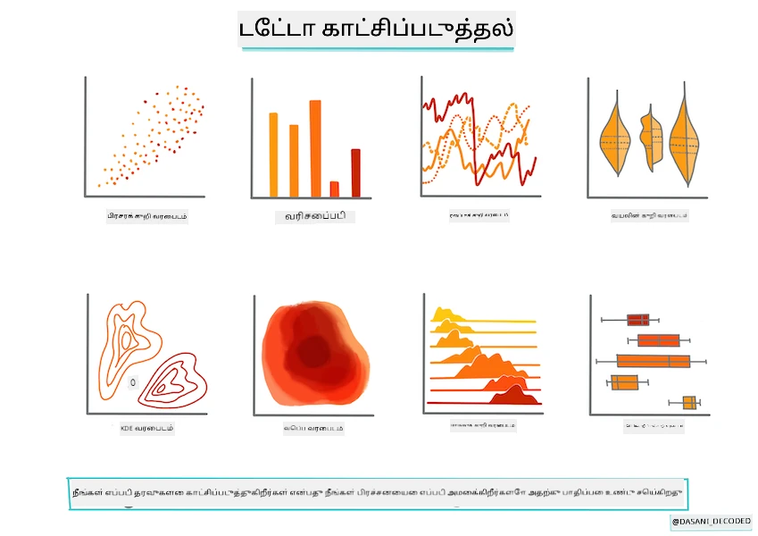
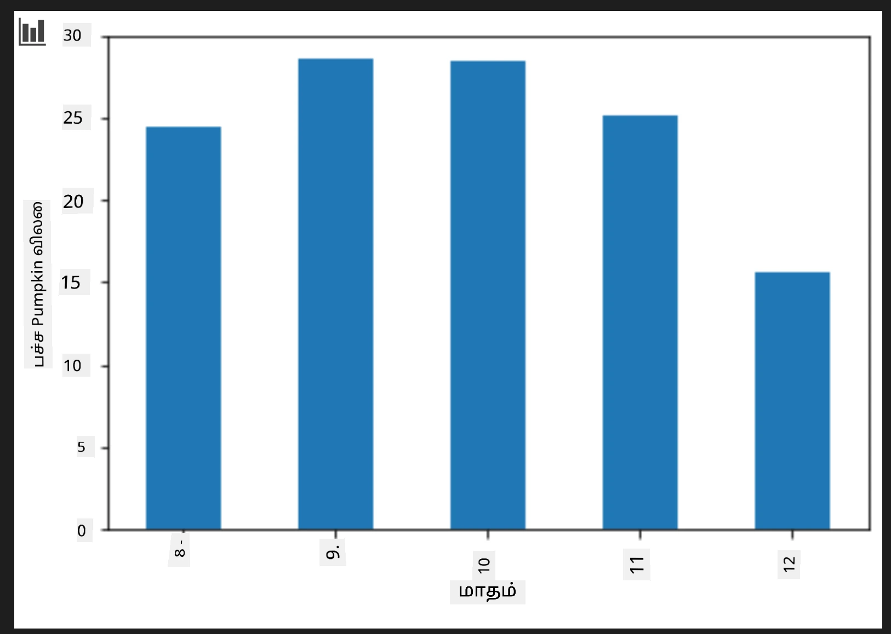

<!--
CO_OP_TRANSLATOR_METADATA:
{
  "original_hash": "7c077988328ebfe33b24d07945f16eca",
  "translation_date": "2025-10-11T11:47:18+00:00",
  "source_file": "2-Regression/2-Data/README.md",
  "language_code": "ta"
}
-->
# Scikit-learn பயன்படுத்தி ஒரு ரிக்ரஷன் மாடல் உருவாக்குதல்: தரவுகளை தயாரித்து காட்சிப்படுத்துதல்



தகவல் வரைபடம்: [Dasani Madipalli](https://twitter.com/dasani_decoded)

## [முன்-வகுப்பு வினாடி வினா](https://ff-quizzes.netlify.app/en/ml/)

> ### [இந்த பாடம் R-ல் கிடைக்கிறது!](../../../../2-Regression/2-Data/solution/R/lesson_2.html)

## அறிமுகம்

Scikit-learn-ஐப் பயன்படுத்தி மெஷின் லெர்னிங் மாடல் உருவாக்கத் தேவையான கருவிகளை நீங்கள் அமைத்த பிறகு, உங்கள் தரவுகளுக்கு கேள்விகள் கேட்கத் தயாராக இருக்கிறீர்கள். தரவுகளுடன் வேலை செய்யும் போது மற்றும் ML தீர்வுகளைப் பயன்படுத்தும் போது, உங்கள் தரவுத்தொகுப்பின் திறன்களை சரியாகத் திறக்க சரியான கேள்வியை கேட்பது மிகவும் முக்கியம்.

இந்த பாடத்தில், நீங்கள் கற்றுக்கொள்வீர்கள்:

- மாடல் உருவாக்கத்திற்கான தரவுகளை எப்படி தயாரிப்பது.
- தரவுகளை காட்சிப்படுத்த Matplotlib-ஐ எப்படி பயன்படுத்துவது.

## உங்கள் தரவுகளுக்கு சரியான கேள்வியை கேட்பது

உங்களுக்கு பதில் தேவைப்படும் கேள்வி எந்த வகையான ML அல்காரிதங்களை நீங்கள் பயன்படுத்துவீர்கள் என்பதைத் தீர்மானிக்கும். மேலும், நீங்கள் பெறும் பதிலின் தரம் உங்கள் தரவின் தன்மைக்கு மிகவும் சார்ந்தது.

இந்த பாடத்திற்கான [தரவை](https://github.com/microsoft/ML-For-Beginners/blob/main/2-Regression/data/US-pumpkins.csv) பாருங்கள். இந்த .csv கோப்பை நீங்கள் VS Code-ல் திறக்கலாம். ஒரு விரைவான பார்வை உடனடியாக வெற்றிடங்கள் மற்றும் சரங்கள் மற்றும் எண்களைக் கலந்த தரவுகள் உள்ளன என்பதை காட்டுகிறது. 'Package' எனும் ஒரு விசித்திரமான பத்தி உள்ளது, இதில் 'sacks', 'bins' மற்றும் பிற மதிப்புகள் கலந்துள்ளன. உண்மையில், இந்த தரவு கொஞ்சம் குழப்பமாக உள்ளது.

[](https://youtu.be/5qGjczWTrDQ "ML for beginners - How to Analyze and Clean a Dataset")

> 🎥 மேலே உள்ள படத்தை கிளிக் செய்து இந்த பாடத்திற்கான தரவுகளைத் தயாரிக்க ஒரு குறுகிய வீடியோவைப் பாருங்கள்.

உண்மையில், ML மாடல் உருவாக்கத்திற்குத் தயாராக இருக்கும் ஒரு தரவுத்தொகுப்பை பெறுவது மிகவும் அரிது. இந்த பாடத்தில், Python நூலகங்களைப் பயன்படுத்தி ஒரு மூல தரவுத்தொகுப்பை எப்படி தயாரிப்பது என்பதை நீங்கள் கற்றுக்கொள்வீர்கள். மேலும், தரவுகளை காட்சிப்படுத்த பல்வேறு நுட்பங்களை நீங்கள் கற்றுக்கொள்வீர்கள்.

## வழக்குக் கதை: 'பூசணிக்காய் சந்தை'

இந்த கோப்பகத்தில், [US-pumpkins.csv](https://github.com/microsoft/ML-For-Beginners/blob/main/2-Regression/data/US-pumpkins.csv) எனும் ஒரு .csv கோப்பு உள்ளது, இது 1757 வரிசைகளைக் கொண்டது, பூசணிக்காய்களின் சந்தை பற்றிய தகவல்களை நகரங்களின் அடிப்படையில் தொகுத்து வழங்குகிறது. இது [Specialty Crops Terminal Markets Standard Reports](https://www.marketnews.usda.gov/mnp/fv-report-config-step1?type=termPrice) மூலம் அமெரிக்க விவசாயத்துறை வழங்கிய தரவுகளிலிருந்து எடுக்கப்பட்டது.

### தரவுகளை தயாரித்தல்

இந்த தரவு பொது உரிமத்தில் உள்ளது. இது USDA வலைத்தளத்தில் இருந்து பல தனித்தனியான கோப்புகளாக, நகரத்தின் அடிப்படையில் பதிவிறக்கம் செய்ய முடியும். மிக அதிகமான தனித்தனியான கோப்புகளைத் தவிர்க்க, அனைத்து நகர தரவுகளையும் ஒரு ஸ்பிரெட்ஷீட்டில் இணைத்துள்ளோம், எனவே நாம் ஏற்கனவே தரவுகளை கொஞ்சம் _தயாரித்துள்ளோம்_. அடுத்ததாக, தரவுகளை நெருக்கமாகப் பார்ப்போம்.

### பூசணிக்காய் தரவுகள் - ஆரம்பக் கருத்துகள்

இந்த தரவுகள் பற்றி நீங்கள் என்ன கவனிக்கிறீர்கள்? நீங்கள் ஏற்கனவே சரங்கள், எண்கள், வெற்றிடங்கள் மற்றும் விசித்திரமான மதிப்புகள் கலந்துள்ளதைப் பார்த்தீர்கள், இதை நீங்கள் புரிந்துகொள்ள வேண்டும்.

Regression நுட்பத்தைப் பயன்படுத்தி, இந்த தரவுகளுக்கு நீங்கள் எந்த கேள்வியை கேட்கலாம்? "ஒரு குறிப்பிட்ட மாதத்தில் விற்பனைக்கு உள்ள பூசணிக்காயின் விலையை கணிக்கவும்" என்ற கேள்வி எப்படி? தரவுகளை மீண்டும் பார்த்தால், இந்த பணிக்குத் தேவையான தரவமைப்பை உருவாக்க சில மாற்றங்களைச் செய்ய வேண்டும்.

## பயிற்சி - பூசணிக்காய் தரவுகளை பகுப்பாய்வு செய்யுங்கள்

[Pandas](https://pandas.pydata.org/) (இது `Python Data Analysis` என்பதற்கான சுருக்கமாகும்) எனும் கருவியைப் பயன்படுத்தி, இந்த பூசணிக்காய் தரவுகளை பகுப்பாய்வு செய்து தயாரிக்கலாம்.

### முதலில், தேதிகள் காணாமல் போனதா என்பதைச் சரிபார்க்கவும்

முதலில், தேதிகள் காணாமல் போனதா என்பதைச் சரிபார்க்க சில நடவடிக்கைகளை எடுக்க வேண்டும்:

1. தேதிகளை மாத வடிவத்திற்கு மாற்றவும் (இவை US தேதிகள், எனவே வடிவம் `MM/DD/YYYY`).
2. மாதத்தை ஒரு புதிய பத்தியில் எடுக்கவும்.

Visual Studio Code-ல் _notebook.ipynb_ கோப்பைத் திறந்து, ஸ்பிரெட்ஷீட்டை புதிய Pandas dataframe-க்கு இறக்குமதி செய்யுங்கள்.

1. முதல் ஐந்து வரிசைகளைப் பார்க்க `head()` செயல்பாட்டைப் பயன்படுத்தவும்.

    ```python
    import pandas as pd
    pumpkins = pd.read_csv('../data/US-pumpkins.csv')
    pumpkins.head()
    ```

    ✅ கடைசி ஐந்து வரிசைகளைப் பார்க்க நீங்கள் எந்த செயல்பாட்டைப் பயன்படுத்துவீர்கள்?

1. தற்போதைய dataframe-ல் காணாமல் போன தரவுகள் உள்ளதா என்பதைச் சரிபார்க்கவும்:

    ```python
    pumpkins.isnull().sum()
    ```

    காணாமல் போன தரவுகள் உள்ளன, ஆனால் இது தற்போதைய பணிக்குத் தேவையில்லை.

1. உங்கள் dataframe-ஐ எளிதாக வேலை செய்ய, `loc` செயல்பாட்டைப் பயன்படுத்தி, உங்களுக்கு தேவையான பத்திகளை மட்டும் தேர்ந்தெடுக்கவும். இது முதன்மை dataframe-ல் இருந்து வரிசைகள் (முதல் அளவுருவாக) மற்றும் பத்திகள் (இரண்டாவது அளவுருவாக) எடுக்க உதவுகிறது. கீழே உள்ள `:` என்ற வெளிப்பாடு "அனைத்து வரிசைகள்" என்று பொருள்.

    ```python
    columns_to_select = ['Package', 'Low Price', 'High Price', 'Date']
    pumpkins = pumpkins.loc[:, columns_to_select]
    ```

### இரண்டாவது, பூசணிக்காயின் சராசரி விலையைத் தீர்மானிக்கவும்

ஒரு குறிப்பிட்ட மாதத்தில் பூசணிக்காயின் சராசரி விலையைத் தீர்மானிக்க எப்படி யோசிப்பீர்கள்? இந்த பணிக்குத் தேவையான பத்திகளை நீங்கள் எவ்வாறு தேர்ந்தெடுப்பீர்கள்? குறிப்புகள்: உங்களுக்கு 3 பத்திகள் தேவைப்படும்.

தீர்வு: `Low Price` மற்றும் `High Price` பத்திகளின் சராசரியை எடுத்து புதிய Price பத்தியை நிரப்பவும், மேலும் Date பத்தியை மாதத்தை மட்டும் காட்ட மாற்றவும். மேலே உள்ள சரிபார்ப்பின் படி, தேதிகள் அல்லது விலைகளுக்கு காணாமல் போன தரவுகள் இல்லை.

1. சராசரியை கணக்கிட, பின்வரும் குறியீட்டைச் சேர்க்கவும்:

    ```python
    price = (pumpkins['Low Price'] + pumpkins['High Price']) / 2

    month = pd.DatetimeIndex(pumpkins['Date']).month

    ```

   ✅ `print(month)` பயன்படுத்தி எந்த தரவையும் சரிபார்க்க நீங்கள் விரும்பினால் அச்சிடலாம்.

2. இப்போது, உங்கள் மாற்றிய தரவுகளை புதிய Pandas dataframe-க்கு நகலெடுக்கவும்:

    ```python
    new_pumpkins = pd.DataFrame({'Month': month, 'Package': pumpkins['Package'], 'Low Price': pumpkins['Low Price'],'High Price': pumpkins['High Price'], 'Price': price})
    ```

    உங்கள் dataframe-ஐ அச்சிடுவது, உங்கள் புதிய ரிக்ரஷன் மாடலை உருவாக்க ஒரு சுத்தமான, ஒழுங்கான தரவுத்தொகுப்பை காட்டும்.

### ஆனால் காத்திருங்கள்! இங்கு ஏதோ விசித்திரமாக உள்ளது

`Package` பத்தியைப் பாருங்கள், பூசணிக்காய்கள் பல்வேறு அமைப்புகளில் விற்கப்படுகின்றன. சில '1 1/9 bushel' அளவுகளில் விற்கப்படுகின்றன, சில '1/2 bushel' அளவுகளில், சில பூசணிக்காய் ஒன்றுக்கு, சில பவுண்டுக்கு, மற்றும் சில பெரிய பெட்டிகளில் விற்கப்படுகின்றன.

> பூசணிக்காய்களை சீராக எடுப்பது மிகவும் கடினம்

மூல தரவுகளை ஆராய்ந்தால், `Unit of Sale` 'EACH' அல்லது 'PER BIN' என்றால், `Package` வகை அங்குலம், பின், அல்லது 'each' ஆகவும் உள்ளது. பூசணிக்காய்களை சீராக எடுப்பது மிகவும் கடினம், எனவே `Package` பத்தியில் 'bushel' என்ற சரம் உள்ள பூசணிக்காய்களை மட்டும் தேர்ந்தெடுப்பதன் மூலம் அவற்றை வடிகட்டலாம்.

1. ஆரம்ப .csv இறக்குமதியின் கீழ் கோப்பின் மேல் ஒரு வடிகட்டலைச் சேர்க்கவும்:

    ```python
    pumpkins = pumpkins[pumpkins['Package'].str.contains('bushel', case=True, regex=True)]
    ```

    தரவுகளை இப்போது அச்சிடினால், நீங்கள் 'bushel' உள்ள 415 வரிசைகள் மட்டுமே பெறுவதை காணலாம்.

### ஆனால் காத்திருங்கள்! இன்னும் ஒரு வேலை செய்ய வேண்டும்

Bushel அளவு ஒவ்வொரு வரிசையிலும் மாறுவதை நீங்கள் கவனித்தீர்களா? நீங்கள் bushel அளவின் அடிப்படையில் விலையை காட்டுவதற்கு விலையை சீரமைக்க வேண்டும், எனவே அதை சீரமைக்க சில கணக்குகளைச் செய்யுங்கள்.

1. புதிய_pumpkins dataframe உருவாக்கும் தொகுதியின் கீழ் இந்த வரிகளைச் சேர்க்கவும்:

    ```python
    new_pumpkins.loc[new_pumpkins['Package'].str.contains('1 1/9'), 'Price'] = price/(1 + 1/9)

    new_pumpkins.loc[new_pumpkins['Package'].str.contains('1/2'), 'Price'] = price/(1/2)
    ```

✅ [The Spruce Eats](https://www.thespruceeats.com/how-much-is-a-bushel-1389308) படி, bushel-இன் எடை உற்பத்தியின் வகைக்கு ஏற்ப மாறுபடும், ஏனெனில் இது ஒரு அளவளவின் அளவீடு. "உதாரணமாக, ஒரு bushel of tomatoes 56 பவுண்டுகள் எடையுடன் இருக்க வேண்டும்... இலைகள் மற்றும் பச்சை கீரைகள் அதிக இடத்தை எடுக்கும், எனவே ஒரு bushel of spinach 20 பவுண்டுகள் மட்டுமே." இது மிகவும் சிக்கலானது! பூசணிக்காய்களின் bushel-to-pound மாற்றத்தை செய்யாமல், bushel அடிப்படையில் விலை நிர்ணயிக்கலாம். பூசணிக்காய்களின் bushel பற்றிய இந்த ஆய்வு, உங்கள் தரவின் தன்மையைப் புரிந்துகொள்வது மிகவும் முக்கியம் என்பதை காட்டுகிறது!

இப்போது, bushel அளவின் அடிப்படையில் விலையைப் பகுப்பாய்வு செய்யலாம். தரவுகளை ஒரு முறை மேலும் அச்சிடினால், அது சீரமைக்கப்பட்டதை நீங்கள் காணலாம்.

✅ பாதி-bushel மூலம் விற்கப்படும் பூசணிக்காய்கள் மிகவும் விலையுயர்ந்தவை என்பதை நீங்கள் கவனித்தீர்களா? ஏன் என்பதை நீங்கள் கண்டுபிடிக்க முடியுமா? குறிப்புகள்: சிறிய பூசணிக்காய்கள் பெரியவற்றை விட மிகவும் விலையுயர்ந்தவை, ஏனெனில் ஒரு பெரிய வெற்று பை பூசணிக்காயால் எடுக்கப்படும் பயன்படுத்தப்படாத இடத்தை விட, ஒரு bushel-இல் பல சிறிய பூசணிக்காய்கள் இருக்கும்.

## காட்சிப்படுத்தல் உத்திகள்

தரவுகளுடன் வேலை செய்யும் தரவுத் விஞ்ஞானியின் பங்கு, அவர்கள் வேலை செய்யும் தரவின் தரத்தையும் தன்மையையும் காட்டுவது. இதைச் செய்ய, அவர்கள் தரவின் பல்வேறு அம்சங்களை காட்டும் சுவாரஸ்யமான காட்சிப்படுத்தல்களை, அல்லது பிளாட்கள், கிராஃப்கள் மற்றும் வரைபடங்களை உருவாக்குகிறார்கள். இந்த வழியில், அவர்கள் கண்ணுக்குத் தெரியாத உறவுகள் மற்றும் இடைவெளிகளை காட்சிப்படுத்த முடிகிறது.

[](https://youtu.be/SbUkxH6IJo0 "ML for beginners - How to Visualize Data with Matplotlib")

> 🎥 மேலே உள்ள படத்தை கிளிக் செய்து இந்த பாடத்திற்கான தரவுகளை காட்சிப்படுத்த ஒரு குறுகிய வீடியோவைப் பாருங்கள்.

காட்சிப்படுத்தல்கள் தரவுக்கு மிகவும் பொருத்தமான மெஷின் லெர்னிங் நுட்பத்தைத் தீர்மானிக்க உதவலாம். ஒரு வரியைப் பின்பற்றும் போல தோன்றும் scatterplot, உதாரணமாக, தரவுகள் ஒரு நேரியல் ரிக்ரஷன் பயிற்சிக்குத் தகுந்தவை என்பதை காட்டுகிறது.

Jupyter notebooks-ல் நன்றாக வேலை செய்யும் ஒரு தரவுக் காட்சிப்படுத்தல் நூலகம் [Matplotlib](https://matplotlib.org/) (நீங்கள் முந்தைய பாடத்தில் இதைப் பார்த்தீர்கள்).

> [இந்த பயிற்சிகளில்](https://docs.microsoft.com/learn/modules/explore-analyze-data-with-python?WT.mc_id=academic-77952-leestott) தரவுக் காட்சிப்படுத்தலில் மேலும் அனுபவம் பெறுங்கள்.

## பயிற்சி - Matplotlib-ஐப் பயன்படுத்தி முயற்சிக்கவும்

நீங்கள் உருவாக்கிய புதிய dataframe-ஐ காட்சிப்படுத்த சில அடிப்படை பிளாட்களை உருவாக்க முயற்சிக்கவும். ஒரு அடிப்படை வரி பிளாட் என்ன காட்டும்?

1. Pandas இறக்குமதியின் கீழ் கோப்பின் மேல் Matplotlib-ஐ இறக்குமதி செய்யுங்கள்:

    ```python
    import matplotlib.pyplot as plt
    ```

1. முழு notebook-ஐ மீண்டும் இயக்கி புதுப்பிக்கவும்.
1. notebook-இன் கீழே ஒரு cell சேர்த்து தரவுகளை ஒரு பெட்டியாக பிளாட் செய்யுங்கள்:

    ```python
    price = new_pumpkins.Price
    month = new_pumpkins.Month
    plt.scatter(price, month)
    plt.show()
    ```

    

    இது ஒரு பயனுள்ள பிளாட் ஆகும்? இதைப் பற்றி உங்களுக்கு ஏதேனும் ஆச்சரியம் இருக்கிறதா?

    இது குறிப்பாக பயனுள்ளதாக இல்லை, ஏனெனில் இது உங்கள் தரவுகளை ஒரு குறிப்பிட்ட மாதத்தில் புள்ளிகளின் பரப்பாக மட்டுமே காட்டுகிறது.

### இதை பயனுள்ளதாக மாற்றுங்கள்

பட்டைகள் பயனுள்ள தரவுகளை காட்ட, நீங்கள் பொதுவாக தரவுகளை எவ்விதமாகக் குழுவாக்க வேண்டும். தரவுகள் விநியோகத்தை காட்டும் ஒரு பிளாட்டை உருவாக்க முயற்சிக்கலாம், இதில் y அச்சு மாதங்களை காட்டுகிறது.

1. தரவுகளை குழுவாக்கிய பட்டை வரைபடம் உருவாக்க ஒரு cell சேர்க்கவும்:

    ```python
    new_pumpkins.groupby(['Month'])['Price'].mean().plot(kind='bar')
    plt.ylabel("Pumpkin Price")
    ```

    

    இது ஒரு பயனுள்ள தரவுக் காட்சிப்படுத்தல்! பூசணிக்காய்களின் மிக உயர்ந்த விலை செப்டம்பர் மற்றும் அக்டோபரில் உள்ளது என்று தோன்றுகிறது. இது உங்கள் எதிர்பார்ப்பை பூர்த்தி செய்கிறதா? ஏன் அல்லது ஏன் இல்லை?

---

## 🚀சவால்

Matplotlib வழங்கும் பல்வேறு வகையான காட்சிப்படுத்தல்களை ஆராயுங்கள். Regression பிரச்சினைகளுக்கு எந்த வகைகள் மிகவும் பொருத்தமானவை?

## [பாடத்திற்குப் பிந்தைய வினாடி வினா](https://ff-quizzes.netlify.app/en/ml/)

## மதிப்பீடு & சுயபடிப்பு

தரவுகளை காட்சிப்படுத்த பல்வேறு வழிகளைப் பாருங்கள். கிடைக்கும் நூலகங்களின் பட்டியலை உருவாக்கி, 2D காட்சிப்படுத்தல்களுக்கு எதிராக 3D காட்சிப்படுத்தல்களுக்கு சிறந்தவை எவை என்பதை குறிப்பிட்டு, குறிப்பிட்ட வகையான பணிகளுக்கு சிறந்தவை எவை என்பதை கவனியுங்கள். நீங்கள் என்ன கண்டுபிடிக்கிறீர்கள்?

## பணிக்கட்டளை

[காட்சிப்படுத்தல்களை ஆராய்வது](assignment.md)

---

**குறிப்பு**:  
இந்த ஆவணம் [Co-op Translator](https://github.com/Azure/co-op-translator) என்ற AI மொழிபெயர்ப்பு சேவையைப் பயன்படுத்தி மொழிபெயர்க்கப்பட்டுள்ளது. நாங்கள் துல்லியத்திற்காக முயற்சிக்கிறோம், ஆனால் தானியங்கி மொழிபெயர்ப்புகளில் பிழைகள் அல்லது தவறான தகவல்கள் இருக்கக்கூடும் என்பதை கவனத்தில் கொள்ளவும். அதன் தாய்மொழியில் உள்ள மூல ஆவணம் அதிகாரப்பூர்வ ஆதாரமாக கருதப்பட வேண்டும். முக்கியமான தகவல்களுக்கு, தொழில்முறை மனித மொழிபெயர்ப்பு பரிந்துரைக்கப்படுகிறது. இந்த மொழிபெயர்ப்பைப் பயன்படுத்துவதால் ஏற்படும் எந்த தவறான புரிதல்கள் அல்லது தவறான விளக்கங்களுக்கு நாங்கள் பொறுப்பல்ல.