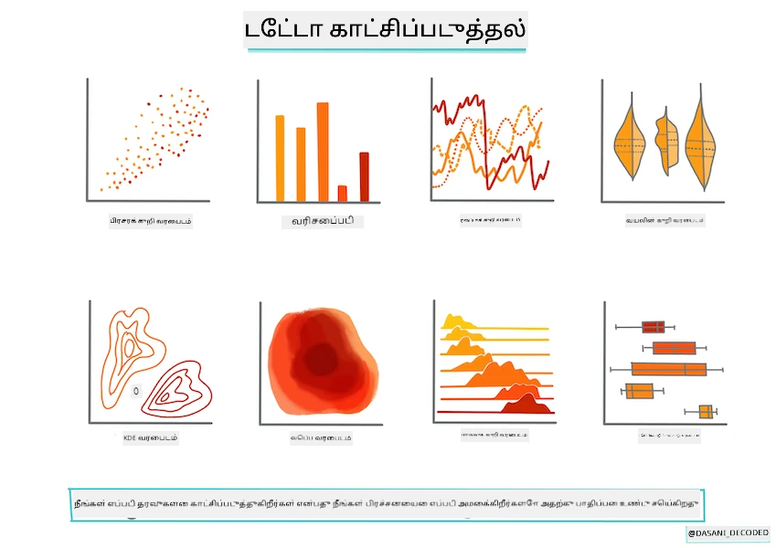
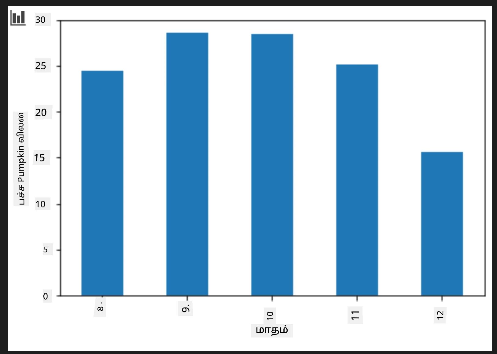
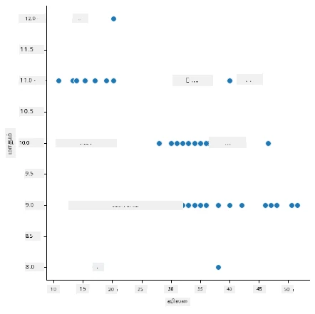
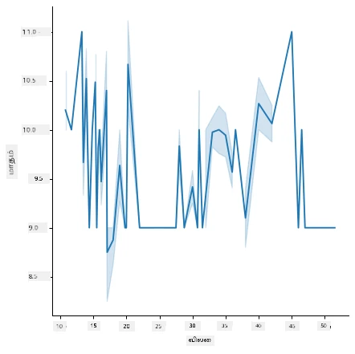
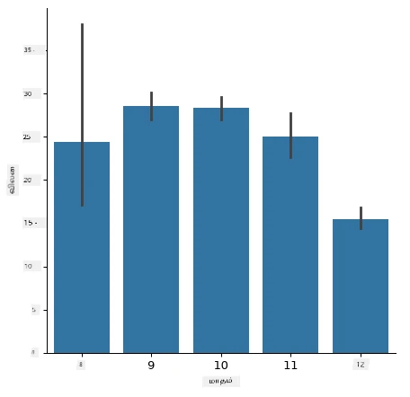
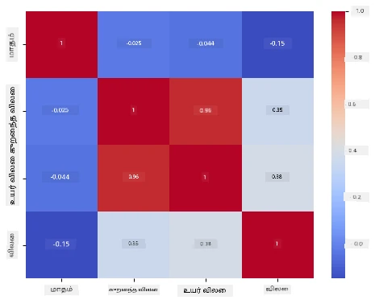

# Scikit-learn பயன்படுத்தி ஒரு எதிர்காலக் கணிப்பு மாதிரியை உருவாக்குதல்: தரவைத் தயாரித்து காட்சி போதித்தல்



தகவலுரு [டசானி மடிப்பள்ளி](https://twitter.com/dasani_decoded) அவர்களால்

## [முன்னுரைக்கு முன் வினாடி வினா](https://ff-quizzes.netlify.app/en/ml/)

> ### [இந்த பாடம் R-ல் கிடைக்கிறது!](../../../../2-Regression/2-Data/solution/R/lesson_2.html)

## அறிமுகம்

நீங்கள் Scikit-learn பயன்படுத்தி இயந்திரக் கற்றல் மாதிரி உருவாக்கத் தொடங்க தேவையான கருவிகளுடன் என்டு உள்ளீர்கள், இப்போது உங்கள் தரவில் கேள்விகள் கேட்கத் தயாராக இருக்கிறீர்கள். தரவு மற்றும் இயந்திரக் கற்றல் தீர்வுகளை பயன்படுத்தும்போது, உங்கள் தரவுக் குத்தகைகள் திறக்கச் சரியான கேள்வி கேட்கும் முறை மிகவும் முக்கியமான ஒன்று.

இப்பாடத்தில், நீங்கள் கற்றுக்கொள்ள உண்டு:

- மாதிரி கட்டமைப்புக்கு உங்கள் தரவை nasıl தயார் செய்வது.
- தரவு காட்சிப்படுத்தும் நோக்கத்திற்காக Matplotlib ஐ எப்படி பயன்படுத்துவது.
- மேலும் வெளிப்படையான தரவு காட்சிப்படுத்துவதற்காக Seaborn ஐ எப்படி பயன்படுத்துவது.

## உங்கள் தரவுக்கு சரியான கேள்வி கேட்குதல்

உங்கள் கேள்வி அடிப்படையில் நீங்கள் எந்த வகை இயந்திரக் கற்றல் ஆல்கொரித்ம்களை பயன்படுத்துவீர்கள் என்று தீர்மானிக்கிறது. மீண்டும் பெற்ற பதிலின் தரம் உங்கள் தரவின் இயல்புத்தன்மைக்கு மிகுந்த சார்ந்தது.

இந்த பாடத்திற்கு கொடுக்கப்பட்டுள்ள [தரவை](https://github.com/microsoft/ML-For-Beginners/blob/main/2-Regression/data/US-pumpkins.csv) பாருங்கள். இந்த .csv கோப்பை VS Code இல் திறக்கலாம். விரைவான பார்வையில், வெற்றிடங்கள் மற்றும் எழுத்து மற்றும் எண் கலவையுடைய தரவுகள் உள்ளன என்பதைக் காட்டுகிறது. 'Package' எனும் ஒரு அசாதாரண நெடுவரிசையும் உள்ளது, அங்கு தரவு 'sacks', 'bins' மற்றும் பிற மதிப்புகளின் கலவையாக உள்ளது. உண்மையில், தரவு கொஞ்சம் குழப்பமானது.

[](https://youtu.be/5qGjczWTrDQ "ML தொடக்கர்களுக்கான - Dataset ஐ பகுப்பாய்வு செய்து சுத்தம் செய்வது எப்படி")

> 🎥 இந்த படத்தை கிளிக் செய்து, பாடத்திற்கான தரவைத் தயாரிக்கும் ஒரு குறுகிய வீடியோவை காணலாம்.

உண்மையில், ஒரு இயந்திரக் கற்றல் மாதிரியை உருவாக்குவதற்கு முழுமையாக தயாராகக் கிடைக்கும் தரவை பெறுவது சாதாரணம் அல்ல. இப்பாடத்தில், நீங்கள் அசல் தரவை ஸ்டாண்டர்ட் Python நூலகங்களைப் பயன்படுத்தி எப்படி தயார் செய்வது என்று கற்றுக்கொள்வீர்கள். மேலும், தரவை காட்சிப்படுத்த பல்வேறு நுட்பங்களையும் கற்றுக்கொள்வீர்கள்.

## உயர் ஆய்வு: 'கத்திரிக்காய் சந்தை'

இந்த கோப்பகத்தில், ரூட் `data` கோப்பகத்தில் உள்ள [US-pumpkins.csv](https://github.com/microsoft/ML-For-Beginners/blob/main/2-Regression/data/US-pumpkins.csv) எனப்படும் .csv கோப்பை காணலாம், இது நகரங்கள் படி வகைப்படுத்தப்பட்ட கத்திரிக்காய் சந்தைக்கு 1757 வரிசை தரவுகள் கொண்டுள்ளது. இது [Specialty Crops Terminal Markets Standard Reports](https://www.marketnews.usda.gov/mnp/fv-report-config-step1?type=termPrice) மூலம் விவசாயத்துறை வழங்கிய அசல் தரவு ஆகும்.

### தரவை தயார் செய்தல்

இந்த தரவு பொதுத்துறை உரிமம் கொண்டது. USDA இணையதளத்தில் பல நகரங்களுக்கு தனித்தனியாக பல கோப்புகளில் பதிவிறக்கம் செய்யலாம். பல கோப்புகளை தவிர்க்க, அனைத்து நகரங்களின் தரவையும் நாம் ஒரே பத்திரிக்கையில் இணைத்துள்ளோம், ஆகவே நாம் ஏற்கனவே சில அளவுக்கு தரவை _தயார்_ செய்துள்ளோம். அடுத்து, தரவை நன்கு பார்ப்போம்.

### கத்திரிக்காய் தரவு - ஆரம்ப முடிவுகள்

இந்த தரவின் பற்றி என்ன கவனித்தீர்கள்? எழுத்துக்குறிகள், எண்கள், வெற்றிடங்கள் மற்றும் அதிர்வுதியான மதிப்புகள் கலந்துள்ளதைக் நீங்கள் ஏற்கனவே பார்த்துள்ளீர்கள்.

இந்த தரவுக்கு Regression தொழில்நுட்பம் பயன்படுத்தி எந்த கேள்வியை கேட்கலாம்? எடுத்துக்காட்டு "ஒரு கொடுக்கப்பட்ட மாதத்தில் விற்பனைக்கு இருக்கும் கத்திரிக்காய் விலை கணிக்கவும்". தரவை மீண்டும் பார்த்தால், இந்த பணிக்குத் தேவையான தரவு கட்டமைப்பை உருவாக்க சில மாற்றங்கள் செய்யப்பட வேண்டும்.
## பயிற்சி - கத்திரிக்காய் தரவை பகுப்பாய்வு செய்தல்

கத்திரிக்காய் தரவை பகுப்பாய்வு செய்து தயார் செய்ய [Pandas](https://pandas.pydata.org/), (`Python Data Analysis` என்ற பொருளைப் பார்க்கிறது) என்று அழைக்கப்படும் பயனுள்ள கருவி பயன்படுத்துவோம்.

### முதலில், காணவில்லை உள்ள தேதிகளை சரிபார்

முதலில் காணவில்லை இருக்கும் தேதிகளைச் சரிபார்க்க சில செயல்கள் செய்ய வேண்டும்:

1. தேதிகளை மாத வடிவமைப்புக்கு மாற்று (இவை அமெரிக்க தேதிகள், ஆகவே வடிவம் `MM/DD/YYYY` ஆகும்).
2. மாதத்தைக் புதிய நெடுவரிசையில் எடு.

Visual Studio Code இல் _notebook.ipynb_ கோப்பைத் திறந்து, பத்திரிக்கையை புதிய Pandas தரவுத்தொகுதியில் இறக்குமதி செய்க.

1. முதல் ஐந்து வரிசைகளை காண `head()` வகையைப் பயன்படுத்துக.

    ```python
    import pandas as pd
    pumpkins = pd.read_csv('../data/US-pumpkins.csv')
    pumpkins.head()
    ```

    ✅ கடைசி ஐந்து வரிசைகளை காண எந்த வகையை நீங்கள் பயன்படுத்துவீர்கள்?

1. தற்போதைய தரவுத்தொகுதியில் காணவில்லை உள்ள தரவு உள்ளதா என்பதை சரிபார்:

    ```python
    pumpkins.isnull().sum()
    ```

    காணவில்லை உள்ள தரவு உள்ளது, ஆனால் இது பணிக்குப் பெரிதாக பாதிப்பதில்லை.

1. உங்கள் தரவுத்தொகுதியை எளிதாக கையாள `loc` வகையைப் பயன்படுத்தி தேவைப்படும் நெடுவரிசைகள் மற்றும் நெடுவரிசைகளை மட்டுமே தேர்ந்தெடுக்கவும். கீழே `:` என்ற அகராதி "அனைத்து வரிசைகள்" என்பதைக் குறிக்கிறது.

    ```python
    columns_to_select = ['Package', 'Low Price', 'High Price', 'Date']
    pumpkins = pumpkins.loc[:, columns_to_select]
    ```

### இரண்டாவது, கத்திரிக்காயின் சராசரி விலையை தீர்மானி

கொடுக்கப்பட்ட மாதத்தில் கத்திரிக்காயின் சராசரி விலையை எப்படி தீர்மானிப்பதற்கான எண்ணத்தை செய்யவும். இந்த பணிக்காக எந்த நெடுவரிசைகள் தேவை? குறிப்பு: 3 நெடுவரிசைகள் தேவைப்படும்.

தீர்வு: `Low Price` மற்றும் `High Price` நெடுவரிசைகளின் சராசரியை எடுத்துக்கொண்டு புதிய `Price` நெடுவரிசையை நிரப்பவும் மற்றும் `Date` நெடுவரிசையை மாதத்தை மட்டும் காட்ட மாற்றவும். மேலே செய்யப்பட்ட சரிபார்ப்பின் படி, தேதிகளுக்காக அல்லது விலைகளுக்காக காணவில்லை உள்ள தரவு எதுவும் இல்லை.

1. சராசரியைக் கணக்கிட இந்த குறியீட்டைச் சேர்க்கவும்:

    ```python
    price = (pumpkins['Low Price'] + pumpkins['High Price']) / 2

    month = pd.DatetimeIndex(pumpkins['Date']).month

    ```

   ✅ செல்லாக்கடுங்க `print(month)` பற்றி உங்கள் விருப்பப்படி தரவைப் பிரிண்ட் செய்யலாம்.

2. இப்போது, உங்கள் மாற்றப்பட்ட தரவை புதிய Pandas தரவுத்தொகுதியில் நகலெடுக்கவும்:

    ```python
    new_pumpkins = pd.DataFrame({'Month': month, 'Package': pumpkins['Package'], 'Low Price': pumpkins['Low Price'],'High Price': pumpkins['High Price'], 'Price': price})
    ```

    உங்கள் தரவுத்தொகுதியை அச்சிடுவது நீங்கள் புதிய, சுத்தமான தரவுத்தொகுதியை காண்பிக்கும், அதில் நீங்கள் உங்கள் புதிய எதிர்காலக் கணிப்பு மாதிரியைக் கட்டலாம்.

### ஆனால் வந்து! இதோ ஒன்று விசித்திரம்

`Package` நெடுவரிசையைப் பாருங்கள், கத்திரிக்காய் பல்வேறு அமைப்புகளில் விற்கப்படுகிறார்கள். சில '1 1/9 bushel' அளவுகளில், சில '1/2 bushel' அளவுகளில், சில கதிரிக்காய்களுக்கு மற்றும் சில பவுண்ட் அளவுகளில், மற்றும் சில பெரிய பெட்டிகளில் விற்பனையாக இருக்கின்றன.

> கத்திரிக்காய்களை ஒழுங்காக எடை அளவிடுவது மிகவும் கடுமையானது என தோன்றுகிறது

அசல் தரவினை விரிவாக பார்த்தால், `Unit of Sale` 'EACH' அல்லது 'PER BIN' என்பதாக இருந்தால், அது `Package` வகை அங்குலம் ஒட்டுமொத்த, தொகுதி, அல்லது 'ஒவ்வொன்றும்' என்பதாக உள்ளது. கத்திரிக்காய்களை ஒழுங்காக எடை அளவிடுவது கடினமாய் உள்ளது, ஆகவே `Package` நெடுவரிசையில் 'bushel' என்ற சொல் உள்ள கத்திரிக்காய்களை மட்டும் தேர்ந்தெடுத்து வடிகட்டுவோம்.

1. கோப்பு மேலே, ஆரம்ப .csv இறக்குமதியின் கீழ் ஒரு வடிகட்டுதலை சேர்க்கவும்:

    ```python
    pumpkins = pumpkins[pumpkins['Package'].str.contains('bushel', case=True, regex=True)]
    ```

    இப்போது நீங்கள் தரவை அச்சிடினால், 'bushel' உள்ள கத்திரிக்காய்களின் சுமார் 415 வரிசைகளை மட்டும் பெறுகிறீர்கள்.

### ஆனால் வந்து! இன்னும் ஒரு நடவடிக்கை உள்ளது

ஒவ்வொரு வரிசையும் பயனுள்ள bushel அளவு மாறுகிறதா? விலையை ஒரு bushelக்கு ஏற்ப சீரமைக்க வேண்டும், ஆகவே சீரமைப்பு கணக்கீடு செய்யவும்.

1. `new_pumpkins` தரவுத்தொகுதி உருவாக்கிய பின்புறம் கீழ்காணும் வரிசைகளை சேர்க்கவும்:

    ```python
    new_pumpkins.loc[new_pumpkins['Package'].str.contains('1 1/9'), 'Price'] = price/(1 + 1/9)

    new_pumpkins.loc[new_pumpkins['Package'].str.contains('1/2'), 'Price'] = price/(1/2)
    ```

✅ [The Spruce Eats](https://www.thespruceeats.com/how-much-is-a-bushel-1389308) படி, bushel எடை தயாரிப்பு வகை அடிப்படையில் மாறும், ஏனெனில் இது அளவு அளவிடுதலைச் சொல்கிறது. "உதாரணமாக, தக்காளி bushel 56 பவுண்ட் எடையுள்ளது ... இலைகள் மற்றும் பச்சை மணைகள் அதிக இடம் பிடிக்கின்றன ஆனால் குறைந்த எடை கொண்டுள்ளதால், பச்சை spinach bushel 20 பவுண்ட் மட்டுமே." இது எல்லாம் சிக்கலானது! bushel-ஐ பவுண்டாக மாற்றாது, bushel அடிப்படையில் விலையை நிர்ணயிப்போம். இந்த bushel கத்திரிக்காய் ஆய்வு உங்கள் தரவின் இயல்பை புரிந்து கொள்ள மிகவும் முக்கியம் என்பதை காட்டுகிறது!

இப்போது, bushel அளவின் அடிப்படையில் அலகின் விலையை பகுப்பாய்வு செய்யலாம். தரவை மீண்டும் அச்சிடுங்கள், அது எப்படி சீரமைக்கப்பட்டுள்ளது என்பதை காணலாம்.

✅ பாதி bushel விற்கப்படும் கத்திரிக்காய் மிகவும் விலையுயர்ந்தது என்பதை நீங்கள் கவனித்தீர்களா? ஏன் என முடிவு செய்ய முடியுமா? குறிப்பு: சிறிய கத்திரிக்காய்கள் பெரியதுக்களைவிட மிகுந்த விலை கொண்டவை என்பதால், ஒரு பெரிய துளைக்குழியுள்ள பை கத்திரிக்காயால் பிடிக்கப்பெறும் இடம் தவிர்க்கப்பட்டு, bushel-க்கு அதிக எண்ணிக்கை இருக்கும் என்பதால் அதற்குக் காரணமாக இருக்கலாம்.

## காட்சிப்படுத்தல் தந்திரங்கள்

தரவு அறிவியல் வல்லுநர்களின் பங்கு, வேலை செய்கிற தரவின் தரம் மற்றும் இயலை பரிசுத்தமாக்குவதுதான். இதற்காக, அவர்கள் சுவாரஸ்யமான காட்சிப்படுத்தல்களை, வரைபடங்கள், கிராப்கள் மற்றும் அட்டவணைகள் மூலம் தரவை ரடெண்டு காட்டுகின்றனர். இதை வழியாக தொடர்புகளையும் கூடுதலாக தெரியாத இடைவெளிகளையும் காட்சிப்படுத்த முடிகிறது.

[](https://youtu.be/SbUkxH6IJo0 "ML தொடக்கர்களுக்கான - Matplotlib மூலம் தரவை காட்சிப்படுத்துவது எப்படி")

> 🎥 இந்த படத்தை கிளிக் செய்து, பாடத்திற்கான தரவை காட்சிப்படுத்தும் குறுகிய வீடியோவை காணலாம்.

காட்சிப்படுத்தல்கள், தரவுக்கு ஏற்ற இயந்திரக் கற்றல் தொழில்நுட்பத்தை தீர்மானிக்கவும் உதவு. உதாரணமாக, ஒரு நிலையான கோட்டை பின்பற்றும் scatterplot அத்தகைய தரவு வரிசைக்கான Linear Regression பயிற்சிக்கு நல்ல தேர்வு என்பதை காட்டுகிறது.

Jupyter நோட்புக் ஆகியவற்றில் நன்றாக வேலை செய்யும் தரவு காட்சிப்படுத்தல் நூலகம் ஒன்று [Matplotlib](https://matplotlib.org/) ஆகும் (இதைக் கடந்த பாடத்தில் நீங்கள் பார்த்தீர்கள்).

> [இந்த பயிற்சிகளில்](https://docs.microsoft.com/learn/modules/explore-analyze-data-with-python?WT.mc_id=academic-77952-leestott) தரவு காட்சிப்படுத்தலில் கூடுதல் அனுபவம் பெறுங்கள்.

## பயிற்சி - Matplotlib ஐ பயன்படுத்தி முயற்சி செய்யுங்கள்

நீங்கள் இப்போது உருவாக்கிய புதிய தரவுத்தொகுதியைப் பயன்படுத்தி அடிப்படை கோட்பாடுகளை உருவாக்க முயற்சி செய்யுங்கள். ஒரு அடிப்படை கோட்டுக் கோட்டு என்ன காட்டும்?

1. கோப்பு மேலே, Pandas இறக்குமதிக்குப் பின் Matplotlib ஐ இறக்குமதி செய்க:

    ```python
    import matplotlib.pyplot as plt
    ```

1. முழு நோட்புக் ஐ மறுகட்ட இயக்கு.
1. நோட்புக் அடியில், தரவுத்தொகுதியை பாக்சாக காட்டு ஒரு செலினை சேர்க்கவும்:

    ```python
    price = new_pumpkins.Price
    month = new_pumpkins.Month
    plt.scatter(price, month)
    plt.show()
    ```

    

    இது பயனுள்ள பிளாட் தானா? இதில் உங்களை ஏதேனும் அதிர்ச்சியடையவைக்குமா?

    இது குறிப்பாக பயனுள்ளதாக இல்லை, ஏனெனில் ஒரு மாதத்தில் உள்ள உங்கள் தரவை புள்ளிகள் பரவலாகக் காட்டுகிறது மட்டும்.

### இதை பயனுள்ளதாக மாற்று

பயனுள்ள தரவை காட்சிப்படுத்த, தரவினை எப்போது எடு வேறு வகையில் குழுவாக்க வேண்டும். வாரிசையின் y அச்சு மாதங்களை காட்டும் ஒரு காட்சி உருவட்ச் பண்ண முயற்சி செய்யுங்கள், மேலும் தரவு பகிர்ச்சி காட்டும்.

1. முலநோக்கில் ஒரு குழுவாகப்பட்ட பட்டை விளக்கப்படம் உருவாக்க ஒரு செல்களைச் சேர்க்கவும்:

    ```python
    new_pumpkins.groupby(['Month'])['Price'].mean().plot(kind='bar')
    plt.ylabel("Pumpkin Price")
    ```

    

    இது மிகவும் பயனுள்ள தரவு காட்சிப்படுத்தல்! கத்திரிக்காய்களின் அதிகபட்ச விலை செப்டம்பர் மற்றும் அக்டோபர் மாதங்களில் நிகழ்ந்ததாகத் தெரிவிக்கிறது. இது உங்கள் எதிர்ப்பார்ப்புக்கு ஏற்றதா? ஏன் அல்லது ஏன் இல்லை என்பதை விவாதிக்கவும்.

## பயிற்சி - Seaborn உடன் முயற்சி செய்யுங்கள்

Matplotlib பலவீனமான ஒன்று, ஆனால் ஒரு பிராட்டோயை முழுமையாக உருவாக்க அதன் பயன்பாடு அதிகமாகும். [Seaborn](https://seaborn.pydata.org/) என்பது Matplotlib மேல் கட்டப்பட்ட ஒரு நூலகமாகும், இது புள்ளிவிவர தரவு காட்சிப்படுத்தலுக்காக வடிவமைக்கப்பட்டுள்ளது. இது நேரடியாக Pandas தரவுத்தொகுதிகளுடன் வேலை செய்கிறது, அழகான முன்னிருப்பு வடிவமைப்புகளை பயன்படுத்துகிறது மற்றும் குறைவான குறியீட்டு மூலம் தகவலாகச் செய்யும் பிளாட்டுகளை உருவாக்க அனுமதிக்கிறது. Seaborn Matplotlib பொருட்களை வழங்குவதால், Matplotlib பற்றி நீங்கள் ஏற்கனவே அறிந்த அனைத்தையும் பயன்படுத்தி முடிவுகளை நுணுக்கமாகக் காட்டலாம்.

> நீங்கள் இன்னும் Seaborn நிறுவவில்லை என்றால், `pip install seaborn` கொண்டு நிறுவுங்கள்.

1. நோட்புக் மற்றும் மற்ற இறக்குமதிகளுக்கு கீழ் Seaborn ஐ இறக்குமதி செய்க. வழக்கமாக இது `sns` என்றழைக்கப்படுகிறது:

    ```python
    import seaborn as sns
    ```

### தொடர்புகளை காட்ட ஸ்காட்டர் பிளாட்டுகள்

மாதிரி கட்டுப்படுத்த முன் தரவின்போது _தொடர்புகள்_ தேடும் ஒரு பெரிய பகுதி. ஒரு [ஸ்காட்டர் பிளாட்](https://en.wikipedia.org/wiki/Scatter_plot) இதற்கான சிறந்த கருவிகளில் ஒன்றாகும்: புள்ளிகள் கோட்டு பின்பற்றுவதாக தோன்றினால், இரண்டு மாறிலிகள் தொடர்புடையதாயிருக்கலாம், இது ஒரு நல்ல அடையாளம் அந்தக் கோட்டர் Regression மாதிரி வேலை செய்யும்.

1. முன்பு இருந்த விலை-மாத ஸ்காட்டர் பிளாட் Seaborn இன் [`relplot()`](https://seaborn.pydata.org/generated/seaborn.relplot.html) (உறவு பிளாக்) கொண்டு மீண்டும் உருவாக்குங்கள், இது நேரடியாக உங்கள் தரவுத்தொகுதியில் உள்ள நெடுவரிசைகளுடன் வேலை செய்யும்:

    ```python
    sns.relplot(x="Price", y="Month", data=new_pumpkins)
    ```

    

    எப்படி நீங்கள் _நெடுவரிசை பெயர்களையும்_ மற்றும் தரவுத்தொகுதியையும் அனுப்புகிறீர்கள் மற்றும் Seaborn அதன் அச்சு தலைப்புக்களை கவனிக்கும் என்பதை கவனிக்கவும்.

2. நீங்கள் `kind="line"` என அனுப்பி கோட்டு பிளாட்டுக்கு மாற்றலாம். Seaborn கோட்டின் சுற்றிலும் நம்பிக்கை இடைவெளியை காட்டும் மூடி பட்டையை கூட வரைந்திருக்கும்:

    ```python
    sns.relplot(x="Price", y="Month", kind="line", data=new_pumpkins)
    ```

    

    இந்த குறிப்பிட்ட தரவு கொஞ்சம் சத்தமாக உள்ளது, ஆகையால் கோட்டு பிளாட் மிகவும் தெளிவான தேர்வு அல்ல - ஆனால் Seaborn-ல் எப்படி எளிதாக விளக்கப்பட வகைகளை மாற்றலாம் என்பதை காட்டுகிறது.

### பகிர்ச்சிகளை காட்ட பட்டை விளக்கப்படங்கள்


முன்பு நீங்கள் கைமுறையில் தரவுகளை குழுத்து செய்து Matplotlib கொண்டு ஒரு பட்டியல் வரைபடத்தை உருவாக்கி இருந்தீர்கள். Seaborn இன் [`catplot()`](https://seaborn.pydata.org/generated/seaborn.catplot.html) (வகைபடுத்தப்பட்ட வரைபடம்) உங்கள் சார்பாக குழுத்தலும் கூட்டுத்தலும் செய்ய முடியும். இயல்புநிலையில் `kind="bar"` ஒவ்வொரு வகையின் சராசரி மதிப்பையும் நம்பகத்தன்மை பரப்பை குறிக்கும் கருப்பு கோடு உடன் காட்டுகிறது.

1. மாதம் ஒன்றுக்கான சராசரி விலையின் பட்டியல் வரைபடத்தை உருவாக்கவும்:

    ```python
    sns.catplot(x="Month", y="Price", data=new_pumpkins, kind="bar")
    ```

    

    இது Matplotlib மூலம் நீங்கள் பார்த்ததை உறுதிப்படுத்துகிறது — விலைகள் செப்டம்பர் மற்றும் அக்டோபர் மாதங்களில் உச்சக்கட்டத்தில் இருக்கும் — ஆனால் Seaborn ஒவ்வொரு மாதத்திற்குள் விலை _மாறுபடுவதை_ காணக்கூடியவாறு காட்சிப்படுத்துகிறது.

### தொடர்புகளை காண காட்டும் ஹீட்மேப்கள்

இரு மாறிலிகளை ஒரே நேரத்தில் ஒப்பிட ஸ்காட்டர் வரைபடங்கள் பயன்படுகின்றன. பல நுண்ணணுக்களை கொண்டுள்ள போது, [ஹீட்மேப்](https://en.wikipedia.org/wiki/Heat_map) ஒவ்வொரு ஜோடிப் பத்திகளுக்கும் இடையேயான உறவின் வலிமையை ஒரே நேரத்தில் பார்க்க உதவுகிறது. இது எந்த அம்சங்கள் அதிகமாக தொடர்புடையவை என்பதை கண்டுபிடிக்க பொதுவாக பயன்படுத்தப்படும் வழி, பின்னர் எந்த பத்திகளை மாதிரியில் பயன்படுத்துவது என்று தீர்மானிக்கப் பயன்படும் (அதே வகையான வரைபடம் தரவுத்தொகுப்புகளுக்கான குழப்ப அட்டவணைகளை காட்டும் போது பெறப்படுகிறது).

1. Pandas கொண்டு தொடர்பு அக Matrிக்ஸ் உருவாக்கி பிறகு Seaborn இன் [`heatmap()`](https://seaborn.pydata.org/generated/seaborn.heatmap.html) மூலம் வரையவும். `annot=True` விருப்பம் ஒவ்வொரு செலிலும் தொடர்பு மதிப்புக்களை அச்சிடும்:

    ```python
    correlations = new_pumpkins[['Month', 'Low Price', 'High Price', 'Price']].corr()
    sns.heatmap(correlations, annot=True, cmap="coolwarm")
    ```

    

    `1` (அல்லது `-1`) க்கு அருகிலுள்ள மதிப்புகள் பத்திகள் மிகவும் _சேர்க்கப்பட்டவை_ என்பதைக் குறிக்கின்றன. `Low Price` மற்றும் `High Price` இணைப்புகள் மிக நெருக்கமாக இருப்பதை கவனியுங்கள். மற்றுபுறம், `Month` விலை தொடர்பாக தளர்ந்த நேர்காணல் வெளிப்படுத்துகிறது — மேலுள்ள பட்டியல் வரைபடம் செப்டம்பர் மற்றும் அக்டோபர் மாதங்களில் தெளிவான பருவ உச்சியை காட்டினாலும். இது முக்கிய பாடம்: தொடர்பு கூட்டுத்தகங்கள் _சரள கோப்பு_ குறிகளையே அளவிடுகிறது, ஆகையால் பருவ அல்லது பிற அலகாற்றாத நுணுக்கங்களைக் காணாமலிருக்கலாம். ✅ தொடர்பு ஹீட்மேப் *மற்றும்* பட்டியல் வரைபடம் ஆகிய இரண்டையும் பார்க்கும் பயனில்லை ஏன் என்பதை விளக்கவும்.

### Matplotlib அல்லது Seaborn?

இரு நூலகங்களும் அறிந்திருப்பது பயனுள்ளது:

- **Matplotlib** ஒரு வரைபடத்தின் ஒவ்வொரு அங்கத்தையும் நுணுக்கமாக கட்டுப்படுத்த அனுமதிக்கிறது மற்றும் Python இல் பல இடர்பாட கலைமுறை நூலகத்துக்கான அடித்தளம் ஆகும்.
- **Seaborn** மதிப்பீட்டு வரைபடங்களுக்கு மேல்நிலை செயல்பாடுகள் மற்றும் கவர்ச்சிகராக இருப்பதை வழங்குகிறது, dataframes உடனடியாக வேலை செய்கிறது மற்றும் ஆராய்ச்சி தரவு பகுப்பாய்வுக்கு விரைவாக பயன்படுகிறது.

பொதுவான பணிச் சீரமைப்பு ஆராய்ச்சிக்காக Seaborn கையாளவும், பின்னர் தேவையான சிறப்பம்சங்களுக்கு Matplotlib க்கு செல்லவும் ஆகும்.

---

## 🚀சவால்

Matplotlib மற்றும் Seaborn வழங்கும் பல்வேறு வகையான காட்சிப்படுத்தல்களை ஆராயுங்கள். எந்த வகைகள் பிணைப்பு பிரச்சினைகளுக்கு அதிக பொருத்தமாகும்?

## [பாட முடிவு வினாடி வினா](https://ff-quizzes.netlify.app/en/ml/)

## விமர்சனம் & சுயமரியாதை

தரவை காட்சிப்படுத்தும் பல வழிகளை பாருங்கள். பல நூலகங்களின் பட்டியலை தயார் செய்து, 2D மற்றும் 3D காட்சிப்படுத்தலுக்கு ஏற்றவையாக எவை என்பதை குறிப்பிடுங்கள். நீங்கள் என்ன கண்டறிந்தீர்கள்?

## பணிகள்

[காட்சிப்படுத்தலை ஆராய்தல்](assignment.md)

---

<!-- CO-OP TRANSLATOR DISCLAIMER START -->
**மறுப்பு**:
இந்த ஆவணம் AI மொழிபெயர்ப்பு சேவை [Co-op Translator](https://github.com/Azure/co-op-translator) பயன்படுத்தி மொழிபெயர்க்கப்பட்டுள்ளது. நாங்கள் துல்லியத்திற்காக முயற்சி செய்துள்ளோம், ஆனால் தானாக செய்யப்படும் மொழிபெயர்ப்புகளில் பிழைகள் அல்லது தவறுகள் இருக்கலாம் என்பதை கவனத்தில் கொள்ளவும். அசல் ஆவணம் அதன் தாய்மொழியில் அதிகாரப்பூர்வ ஆதாரமாக கருதப்பட வேண்டும். முக்கியமான தகவல்களுக்கு, தொழில்நுட்பமான மனித மொழிபெயர்ப்பு பரிந்துரைக்கப்படுகிறது. இந்த மொழிபெயர்ப்பைப் பயன்படுத்துவதால் ஏற்படும் எந்த தவறான புரிதல்கள் அல்லது தவறான விளக்கத்திற்கும் நாங்கள் பொறுப்பில்வில்லை.
<!-- CO-OP TRANSLATOR DISCLAIMER END -->