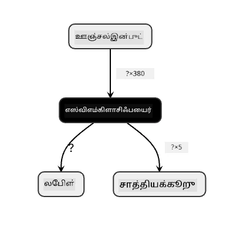
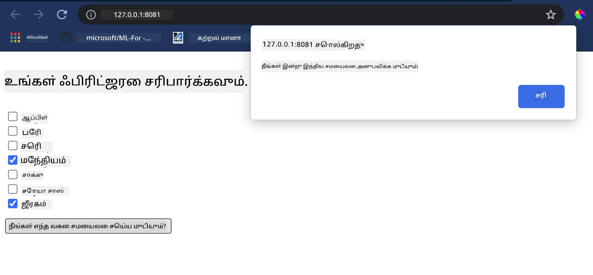

<!--
CO_OP_TRANSLATOR_METADATA:
{
  "original_hash": "61bdec27ed2da8b098cd9065405d9bb0",
  "translation_date": "2025-10-11T11:57:24+00:00",
  "source_file": "4-Classification/4-Applied/README.md",
  "language_code": "ta"
}
-->
# சமையல் பரிந்துரை வலை பயன்பாட்டை உருவாக்குதல்

இந்த பாடத்தில், நீங்கள் முந்தைய பாடங்களில் கற்ற சில தொழில்நுட்பங்களைப் பயன்படுத்தி மற்றும் இந்த தொடரில் பயன்படுத்தப்பட்ட சுவையான சமையல் தரவுத்தொகுப்பைப் பயன்படுத்தி ஒரு வகைப்படுத்தல் மாதிரியை உருவாக்குவீர்கள். மேலும், நீங்கள் சேமிக்கப்பட்ட மாதிரியைப் பயன்படுத்த ஒரு சிறிய வலை பயன்பாட்டை உருவாக்குவீர்கள், Onnx இன் வலை ரன்டைமைப் பயன்படுத்தி.

இன்றைய தினம், இயந்திரக் கற்றலின் மிகவும் பயனுள்ள நடைமுறை பயன்பாடுகளில் ஒன்றான பரிந்துரை அமைப்புகளை உருவாக்குவதில் முதல் படியை எடுக்கலாம்!

[](https://youtu.be/17wdM9AHMfg "Applied ML")

> 🎥 மேலே உள்ள படத்தை கிளிக் செய்யவும்: ஜென் லூப்பர் வகைப்படுத்தப்பட்ட சமையல் தரவுகளைப் பயன்படுத்தி ஒரு வலை பயன்பாட்டை உருவாக்குகிறார்

## [பாடத்திற்கு முன் வினாடி வினா](https://ff-quizzes.netlify.app/en/ml/)

இந்த பாடத்தில் நீங்கள் கற்றுக்கொள்வீர்கள்:

- ஒரு மாதிரியை உருவாக்கி அதை Onnx மாதிரியாக சேமிப்பது எப்படி
- Netron ஐப் பயன்படுத்தி மாதிரியை ஆய்வு செய்வது எப்படி
- உங்கள் மாதிரியை ஒரு வலை பயன்பாட்டில் பயன்படுத்தி முடிவுகளை பெறுவது எப்படி

## உங்கள் மாதிரியை உருவாக்குங்கள்

தொழில்நுட்பங்களை உங்கள் வணிக அமைப்புகளில் பயன்படுத்துவதற்கான முக்கியமான பகுதியாக செயல்படுத்தப்பட்ட ML அமைப்புகளை உருவாக்குவது உள்ளது. Onnx ஐப் பயன்படுத்தி உங்கள் வலை பயன்பாடுகளில் (தேவையானால் ஆஃப்லைனில் கூட) மாதிரிகளைப் பயன்படுத்தலாம்.

ஒரு [முந்தைய பாடத்தில்](../../3-Web-App/1-Web-App/README.md), நீங்கள் UFO காட்சிகள் பற்றிய ஒரு ரிக்ரஷன் மாதிரியை உருவாக்கி, அதை "பிக்கிள்" செய்து, Flask பயன்பாட்டில் பயன்படுத்தினீர்கள். இந்த கட்டமைப்பு தெரிந்துகொள்வதற்கு மிகவும் பயனுள்ளதாக இருந்தாலும், இது முழு-ஸ்டாக் பைதான் பயன்பாடாகும், மேலும் உங்கள் தேவைகள் ஜாவாஸ்கிரிப்ட் பயன்பாட்டைப் பயன்படுத்த வேண்டும்.

இந்த பாடத்தில், முடிவுகளை பெற ஒரு அடிப்படை ஜாவாஸ்கிரிப்ட் அடிப்படையிலான அமைப்பை உருவாக்கலாம். முதலில், ஒரு மாதிரியைப் பயிற்சி செய்து அதை Onnx உடன் பயன்படுத்த மாற்ற வேண்டும்.

## பயிற்சி - வகைப்படுத்தல் மாதிரியைப் பயிற்சி செய்யுங்கள்

முதலில், நாம் பயன்படுத்திய சுத்தமான சமையல் தரவுத்தொகுப்பைப் பயன்படுத்தி ஒரு வகைப்படுத்தல் மாதிரியைப் பயிற்சி செய்யுங்கள்.

1. பயனுள்ள நூலகங்களை இறக்குமதி செய்வதிலிருந்து தொடங்குங்கள்:

    ```python
    !pip install skl2onnx
    import pandas as pd 
    ```

    '[skl2onnx](https://onnx.ai/sklearn-onnx/)' உங்கள் Scikit-learn மாதிரியை Onnx வடிவத்திற்கு மாற்ற உதவ தேவை.

1. பின்னர், முந்தைய பாடங்களில் செய்தது போல உங்கள் தரவுடன் வேலை செய்யுங்கள், `read_csv()` ஐப் பயன்படுத்தி ஒரு CSV கோப்பைப் படிக்க:

    ```python
    data = pd.read_csv('../data/cleaned_cuisines.csv')
    data.head()
    ```

1. முதல் இரண்டு தேவையற்ற நெடுவரிசைகளை நீக்கி, மீதமுள்ள தரவுகளை 'X' ஆக சேமிக்கவும்:

    ```python
    X = data.iloc[:,2:]
    X.head()
    ```

1. லேபிள்களை 'y' ஆக சேமிக்கவும்:

    ```python
    y = data[['cuisine']]
    y.head()
    
    ```

### பயிற்சி செயல்முறையைத் தொடங்குங்கள்

நாம் 'SVC' நூலகத்தைப் பயன்படுத்துவோம், இது நல்ல துல்லியத்துடன் உள்ளது.

1. Scikit-learn இலிருந்து பொருத்தமான நூலகங்களை இறக்குமதி செய்யுங்கள்:

    ```python
    from sklearn.model_selection import train_test_split
    from sklearn.svm import SVC
    from sklearn.model_selection import cross_val_score
    from sklearn.metrics import accuracy_score,precision_score,confusion_matrix,classification_report
    ```

1. பயிற்சி மற்றும் சோதனை தொகுப்புகளை பிரிக்கவும்:

    ```python
    X_train, X_test, y_train, y_test = train_test_split(X,y,test_size=0.3)
    ```

1. முந்தைய பாடத்தில் செய்தது போல ஒரு SVC வகைப்படுத்தல் மாதிரியை உருவாக்குங்கள்:

    ```python
    model = SVC(kernel='linear', C=10, probability=True,random_state=0)
    model.fit(X_train,y_train.values.ravel())
    ```

1. இப்போது, உங்கள் மாதிரியை சோதித்து, `predict()` ஐ அழைக்கவும்:

    ```python
    y_pred = model.predict(X_test)
    ```

1. மாதிரியின் தரத்தைச் சரிபார்க்க ஒரு வகைப்படுத்தல் அறிக்கையை அச்சிடுங்கள்:

    ```python
    print(classification_report(y_test,y_pred))
    ```

    முந்தையது போல, துல்லியம் நல்லது:

    ```output
                    precision    recall  f1-score   support
    
         chinese       0.72      0.69      0.70       257
          indian       0.91      0.87      0.89       243
        japanese       0.79      0.77      0.78       239
          korean       0.83      0.79      0.81       236
            thai       0.72      0.84      0.78       224
    
        accuracy                           0.79      1199
       macro avg       0.79      0.79      0.79      1199
    weighted avg       0.79      0.79      0.79      1199
    ```

### உங்கள் மாதிரியை Onnx க்கு மாற்றுங்கள்

சரியான டென்சர் எண்ணிக்கையுடன் மாற்றத்தைச் செய்ய உறுதிப்படுத்துங்கள். இந்த தரவுத்தொகுப்பில் 380 பொருட்கள் பட்டியலிடப்பட்டுள்ளன, எனவே `FloatTensorType` இல் அந்த எண்ணிக்கையை குறிப்பிட வேண்டும்:

1. 380 டென்சர் எண்ணிக்கையுடன் மாற்றுங்கள்.

    ```python
    from skl2onnx import convert_sklearn
    from skl2onnx.common.data_types import FloatTensorType
    
    initial_type = [('float_input', FloatTensorType([None, 380]))]
    options = {id(model): {'nocl': True, 'zipmap': False}}
    ```

1. onx ஐ உருவாக்கி **model.onnx** என்ற கோப்பாக சேமிக்கவும்:

    ```python
    onx = convert_sklearn(model, initial_types=initial_type, options=options)
    with open("./model.onnx", "wb") as f:
        f.write(onx.SerializeToString())
    ```

    > கவனிக்கவும், உங்கள் மாற்ற ஸ்கிரிப்டில் [விருப்பங்களை](https://onnx.ai/sklearn-onnx/parameterized.html) வழங்கலாம். இந்தக் கட்டத்தில், 'nocl' ஐ True ஆகவும் 'zipmap' ஐ False ஆகவும் அமைத்தோம். இது ஒரு வகைப்படுத்தல் மாதிரி என்பதால், ZipMap ஐ நீக்குவதற்கான விருப்பம் உங்களுக்கு உள்ளது (தேவை இல்லை). `nocl` என்பது வகுப்புத் தகவல் மாதிரியில் சேர்க்கப்படுவதைக் குறிக்கிறது. `nocl` ஐ 'True' ஆக அமைப்பதன் மூலம் உங்கள் மாதிரியின் அளவை குறைக்கவும்.

முழு நோட்புக் இயக்கம் இப்போது ஒரு Onnx மாதிரியை உருவாக்கி இந்த கோப்பகத்தில் சேமிக்கும்.

## உங்கள் மாதிரியைப் பாருங்கள்

Onnx மாதிரிகள் Visual Studio Code இல் மிகவும் தெளிவாக இல்லை, ஆனால் பல ஆராய்ச்சியாளர்கள் மாதிரியை சரியாக உருவாக்கப்பட்டுள்ளதா என்பதை உறுதிப்படுத்த பார்க்க பயன்படுத்தும் ஒரு நல்ல இலவச மென்பொருள் உள்ளது. [Netron](https://github.com/lutzroeder/Netron) ஐ பதிவிறக்கம் செய்து உங்கள் model.onnx கோப்பைத் திறக்கவும். 380 உள்ளீடுகள் மற்றும் வகைப்படுத்தல் பட்டியலுடன் உங்கள் எளிய மாதிரி காட்சிப்படுத்தப்பட்டிருப்பதை நீங்கள் காணலாம்:



Netron உங்கள் மாதிரிகளைப் பார்வையிட உதவும் ஒரு பயனுள்ள கருவியாகும்.

இப்போது உங்கள் neat மாதிரியை ஒரு வலை பயன்பாட்டில் பயன்படுத்த தயாராக உள்ளீர்கள். உங்கள் குளிர்சாதனப் பெட்டியில் உள்ள பொருட்களைப் பார்த்து, உங்கள் மாதிரி தீர்மானிக்கும் ஒரு குறிப்பிட்ட சமையல் வகையைச் செய்ய எந்த பொருட்களின் சேர்க்கைகள் வேலை செய்யும் என்பதை கண்டறிய உதவும் ஒரு பயன்பாட்டை உருவாக்குவோம்.

## பரிந்துரை வலை பயன்பாட்டை உருவாக்குங்கள்

உங்கள் மாதிரியை நேரடியாக ஒரு வலை பயன்பாட்டில் பயன்படுத்தலாம். இந்த கட்டமைப்பு அதை உள்ளூர் மற்றும் தேவைப்பட்டால் ஆஃப்லைனில் கூட இயக்க அனுமதிக்கிறது. உங்கள் `model.onnx` கோப்பு சேமிக்கப்பட்டுள்ள அதே கோப்பகத்தில் ஒரு `index.html` கோப்பை உருவாக்குவதிலிருந்து தொடங்குங்கள்.

1. இந்த கோப்பில் _index.html_, பின்வரும் மார்க்அப் சேர்க்கவும்:

    ```html
    <!DOCTYPE html>
    <html>
        <header>
            <title>Cuisine Matcher</title>
        </header>
        <body>
            ...
        </body>
    </html>
    ```

1. இப்போது, `body` டேக்களில் வேலை செய்து, சில பொருட்களை பிரதிபலிக்கும் செக்பாக்ஸ்களின் பட்டியலைக் காட்ட சிறிய மார்க்அப் சேர்க்கவும்:

    ```html
    <h1>Check your refrigerator. What can you create?</h1>
            <div id="wrapper">
                <div class="boxCont">
                    <input type="checkbox" value="4" class="checkbox">
                    <label>apple</label>
                </div>
            
                <div class="boxCont">
                    <input type="checkbox" value="247" class="checkbox">
                    <label>pear</label>
                </div>
            
                <div class="boxCont">
                    <input type="checkbox" value="77" class="checkbox">
                    <label>cherry</label>
                </div>
    
                <div class="boxCont">
                    <input type="checkbox" value="126" class="checkbox">
                    <label>fenugreek</label>
                </div>
    
                <div class="boxCont">
                    <input type="checkbox" value="302" class="checkbox">
                    <label>sake</label>
                </div>
    
                <div class="boxCont">
                    <input type="checkbox" value="327" class="checkbox">
                    <label>soy sauce</label>
                </div>
    
                <div class="boxCont">
                    <input type="checkbox" value="112" class="checkbox">
                    <label>cumin</label>
                </div>
            </div>
            <div style="padding-top:10px">
                <button onClick="startInference()">What kind of cuisine can you make?</button>
            </div> 
    ```

    ஒவ்வொரு செக்பாக்ஸுக்கும் ஒரு மதிப்பு வழங்கப்பட்டிருப்பதை கவனிக்கவும். இது தரவுத்தொகுப்பின் படி பொருள் காணப்படும் குறியீட்டை பிரதிபலிக்கிறது. உதாரணமாக, ஆப்பிள், இந்த அகரவரிசை பட்டியலில், ஐந்தாவது நெடுவரிசையை ஆக்குகிறது, எனவே அதன் மதிப்பு '4' ஆகும், ஏனெனில் நாம் 0 இல் தொடங்குகிறோம். ஒரு குறிப்பிட்ட பொருளின் குறியீட்டை கண்டறிய [ingredients spreadsheet](../../../../4-Classification/data/ingredient_indexes.csv) ஐ அணுகலாம்.

    உங்கள் index.html கோப்பில் உங்கள் வேலை தொடர, இறுதி மூடல் `</div>` க்கு பிறகு ஒரு ஸ்கிரிப்ட் பிளாக் சேர்க்கவும், அங்கு மாதிரி அழைக்கப்படுகிறது.

1. முதலில், [Onnx Runtime](https://www.onnxruntime.ai/) ஐ இறக்குமதி செய்யுங்கள்:

    ```html
    <script src="https://cdn.jsdelivr.net/npm/onnxruntime-web@1.9.0/dist/ort.min.js"></script> 
    ```

    > Onnx Runtime உங்கள் Onnx மாதிரிகளை பல்வேறு ஹார்ட்வேர தளங்களில் இயக்க அனுமதிக்க பயன்படுத்தப்படுகிறது, இதில் மேம்பாடுகள் மற்றும் API பயன்படுத்துவதற்கான வசதி உள்ளது.

1. Runtime இடத்தில் உள்ளபோது, அதை அழைக்கலாம்:

    ```html
    <script>
        const ingredients = Array(380).fill(0);
        
        const checks = [...document.querySelectorAll('.checkbox')];
        
        checks.forEach(check => {
            check.addEventListener('change', function() {
                // toggle the state of the ingredient
                // based on the checkbox's value (1 or 0)
                ingredients[check.value] = check.checked ? 1 : 0;
            });
        });

        function testCheckboxes() {
            // validate if at least one checkbox is checked
            return checks.some(check => check.checked);
        }

        async function startInference() {

            let atLeastOneChecked = testCheckboxes()

            if (!atLeastOneChecked) {
                alert('Please select at least one ingredient.');
                return;
            }
            try {
                // create a new session and load the model.
                
                const session = await ort.InferenceSession.create('./model.onnx');

                const input = new ort.Tensor(new Float32Array(ingredients), [1, 380]);
                const feeds = { float_input: input };

                // feed inputs and run
                const results = await session.run(feeds);

                // read from results
                alert('You can enjoy ' + results.label.data[0] + ' cuisine today!')

            } catch (e) {
                console.log(`failed to inference ONNX model`);
                console.error(e);
            }
        }
               
    </script>
    ```

இந்தக் குறியீட்டில், பல விஷயங்கள் நடக்கின்றன:

1. நீங்கள் 380 சாத்தியமான மதிப்புகளின் (1 அல்லது 0) ஒரு வரிசையை உருவாக்கி, ஒரு பொருள் செக்பாக்ஸ் தேர்ந்தெடுக்கப்பட்டதா என்பதைப் பொறுத்து மாதிரிக்கு அனுப்பி முடிவுகளை பெறலாம்.
2. நீங்கள் செக்பாக்ஸ்களின் வரிசையை உருவாக்கி, அவை தேர்ந்தெடுக்கப்பட்டதா என்பதைத் தீர்மானிக்க ஒரு `init` செயல்பாட்டை உருவாக்கினீர்கள், இது பயன்பாடு தொடங்கும்போது அழைக்கப்படுகிறது. ஒரு செக்பாக்ஸ் தேர்ந்தெடுக்கப்பட்டால், `ingredients` வரிசை தேர்ந்தெடுக்கப்பட்ட பொருளை பிரதிபலிக்க மாற்றப்படுகிறது.
3. நீங்கள் எந்த செக்பாக்ஸ் தேர்ந்தெடுக்கப்பட்டதா என்பதைச் சரிபார்க்க `testCheckboxes` செயல்பாட்டை உருவாக்கினீர்கள்.
4. ஒரு பொத்தானை அழுத்தும்போது `startInference` செயல்பாட்டைப் பயன்படுத்துகிறீர்கள், மேலும் எந்த செக்பாக்ஸ் தேர்ந்தெடுக்கப்பட்டதா என்பதைச் சரிபார்த்து, முடிவுகளை பெற ஆரம்பிக்கிறீர்கள்.
5. முடிவு செயல்முறை இதில் அடங்கும்:
   1. மாதிரியை அசிங்க்ரோனஸ் லோடு செய்ய அமைத்தல்
   2. மாதிரிக்கு அனுப்ப ஒரு டென்சர் அமைப்பை உருவாக்குதல்
   3. நீங்கள் உங்கள் மாதிரியைப் பயிற்சி செய்தபோது உருவாக்கிய `float_input` உள்ளீட்டை பிரதிபலிக்கும் 'feeds' உருவாக்குதல் (அந்த பெயரை Netron ஐப் பயன்படுத்தி சரிபார்க்கலாம்)
   4. இந்த 'feeds' ஐ மாதிரிக்கு அனுப்பி பதிலை காத்திருத்தல்

## உங்கள் பயன்பாட்டைச் சோதிக்கவும்

Visual Studio Code இல் உங்கள் index.html கோப்பு இருக்கும் கோப்பகத்தில் ஒரு டெர்மினல் அமர்வைத் திறக்கவும். [http-server](https://www.npmjs.com/package/http-server) உலகளவில் நிறுவப்பட்டுள்ளதா என்பதை உறுதிப்படுத்தி, உத்தரவிடும் இடத்தில் `http-server` என தட்டச்சு செய்யவும். ஒரு localhost திறக்க வேண்டும், மேலும் உங்கள் வலை பயன்பாட்டைப் பார்க்கலாம். பல பொருட்களின் அடிப்படையில் பரிந்துரைக்கப்படும் சமையல் வகையைச் சரிபார்க்கவும்:



வாழ்த்துக்கள், நீங்கள் சில புலங்களுடன் ஒரு 'பரிந்துரை' வலை பயன்பாட்டை உருவாக்கியுள்ளீர்கள். இந்த அமைப்பை உருவாக்குவதற்கு சில நேரம் செலவிடுங்கள்!
## 🚀சவால்

உங்கள் வலை பயன்பாடு மிகவும் அடிப்படையானது, எனவே [ingredient_indexes](../../../../4-Classification/data/ingredient_indexes.csv) தரவிலிருந்து பொருட்கள் மற்றும் அவற்றின் குறியீடுகளைப் பயன்படுத்தி அதை மேலும் உருவாக்குங்கள். எந்த சுவை சேர்க்கைகள் ஒரு குறிப்பிட்ட தேசிய உணவை உருவாக்க வேலை செய்கின்றன?

## [பாடத்திற்குப் பின் வினாடி வினா](https://ff-quizzes.netlify.app/en/ml/)

## மதிப்பீடு & சுயபயிற்சி

இந்த பாடம் உணவுப் பொருட்களுக்கான பரிந்துரை அமைப்பை உருவாக்குவதன் பயன்பாட்டை மட்டும் தொடTouched, இந்த ML பயன்பாடுகளின் பகுதி உதாரணங்களில் மிகவும் வளமானது. இந்த அமைப்புகள் எப்படி உருவாக்கப்படுகின்றன என்பதைப் பற்றி மேலும் படிக்கவும்:

- https://www.sciencedirect.com/topics/computer-science/recommendation-engine
- https://www.technologyreview.com/2014/08/25/171547/the-ultimate-challenge-for-recommendation-engines/
- https://www.technologyreview.com/2015/03/23/168831/everything-is-a-recommendation/

## பணிக்கட்டளை 

[புதிய பரிந்துரை அமைப்பை உருவாக்குங்கள்](assignment.md)

---

**குறிப்பு**:  
இந்த ஆவணம் [Co-op Translator](https://github.com/Azure/co-op-translator) என்ற AI மொழிபெயர்ப்பு சேவையைப் பயன்படுத்தி மொழிபெயர்க்கப்பட்டுள்ளது. நாங்கள் துல்லியத்திற்காக முயற்சிக்கின்றோம், ஆனால் தானியங்கி மொழிபெயர்ப்புகளில் பிழைகள் அல்லது தவறுகள் இருக்கக்கூடும் என்பதை தயவுசெய்து கவனத்தில் கொள்ளுங்கள். அதன் தாய்மொழியில் உள்ள மூல ஆவணம் அதிகாரப்பூர்வ ஆதாரமாக கருதப்பட வேண்டும். முக்கியமான தகவல்களுக்கு, தொழில்முறை மனித மொழிபெயர்ப்பு பரிந்துரைக்கப்படுகிறது. இந்த மொழிபெயர்ப்பைப் பயன்படுத்துவதால் ஏற்படும் எந்த தவறான புரிதல்கள் அல்லது தவறான விளக்கங்களுக்கு நாங்கள் பொறுப்பல்ல.