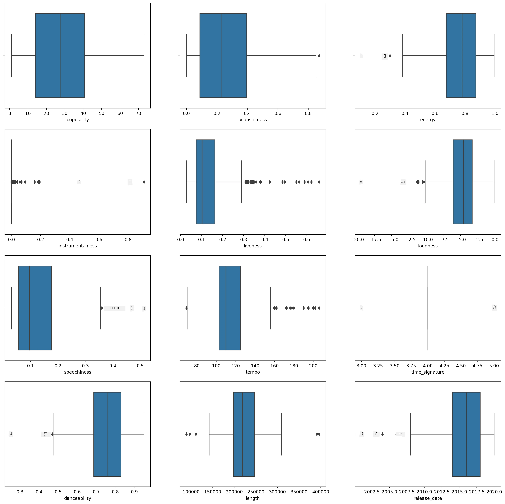
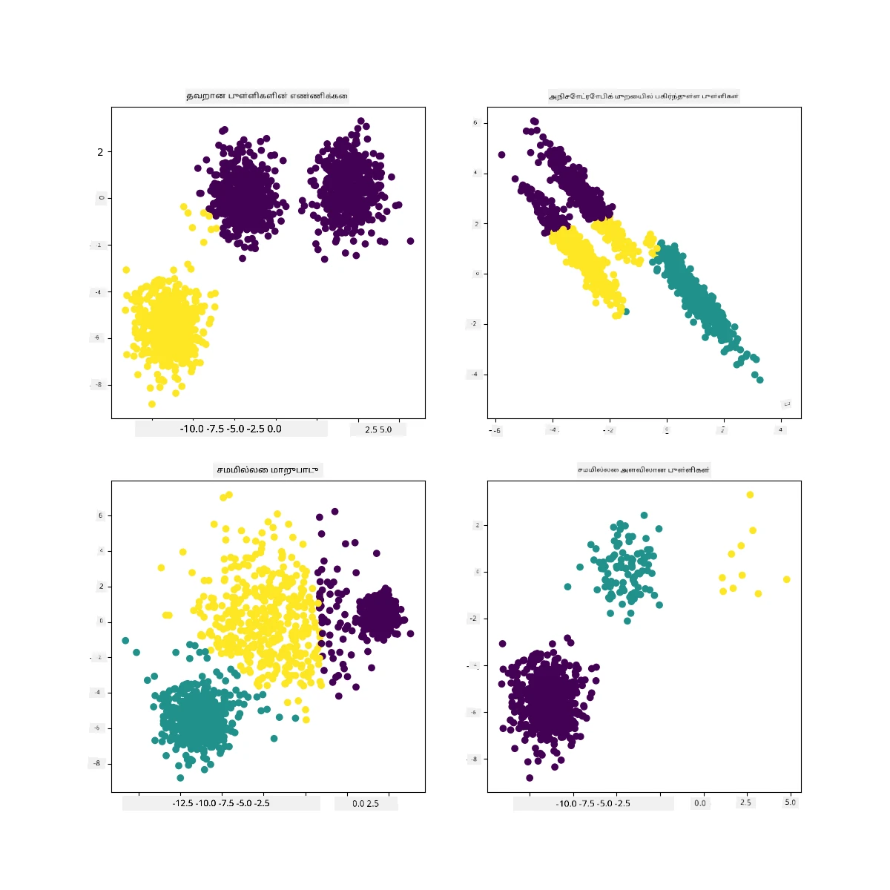

<!--
CO_OP_TRANSLATOR_METADATA:
{
  "original_hash": "7cdd17338d9bbd7e2171c2cd462eb081",
  "translation_date": "2025-10-11T12:07:34+00:00",
  "source_file": "5-Clustering/2-K-Means/README.md",
  "language_code": "ta"
}
-->
# K-Means குழுமம்

## [முன்-வகுப்பு வினாடி வினா](https://ff-quizzes.netlify.app/en/ml/)

இந்த பாடத்தில், நீங்கள் Scikit-learn மற்றும் நீங்கள் முன்பே இறக்குமதி செய்த நைஜீரிய இசை தரவுத்தொகுப்பைப் பயன்படுத்தி குழுமங்களை உருவாக்குவது எப்படி என்பதை கற்றுக்கொள்வீர்கள். K-Means குழுமத்திற்கான அடிப்படைகளை நாம் கற்கப்போகிறோம். நீங்கள் முன் பாடத்தில் கற்றுக்கொண்டது போல, குழுமங்களுடன் வேலை செய்ய பல வழிகள் உள்ளன, மேலும் நீங்கள் பயன்படுத்தும் முறை உங்கள் தரவின் அடிப்படையில் இருக்கும். K-Means மிகவும் பொதுவான குழும முறை என்பதால் அதை முயற்சிப்போம். தொடங்குவோம்!

நீங்கள் கற்றுக்கொள்ளும் சொற்கள்:

- Silhouette மதிப்பீடு
- Elbow முறை
- Inertia
- Variance

## அறிமுகம்

[K-Means Clustering](https://wikipedia.org/wiki/K-means_clustering) என்பது சிக்னல் செயலாக்கத்தின் துறையில் இருந்து பெறப்பட்ட ஒரு முறை. இது 'k' குழுமங்களாக தரவுகளை பிரிக்கவும் பகிரவும் ஒரு வரிசை கண்காணிப்புகளைப் பயன்படுத்துகிறது. ஒவ்வொரு கண்காணிப்பும் ஒரு குறிப்பிட்ட தரவுப் புள்ளியை அதன் அருகிலுள்ள 'mean' அல்லது குழுமத்தின் மைய புள்ளிக்கு அருகில் குழுமமாக்க முயற்சிக்கிறது.

குழுமங்களை [Voronoi diagrams](https://wikipedia.org/wiki/Voronoi_diagram) போல காட்சிப்படுத்தலாம், இதில் ஒரு புள்ளி (அல்லது 'seed') மற்றும் அதற்குரிய பகுதி அடங்கும்.


> [Jen Looper](https://twitter.com/jenlooper) உருவாக்கிய தகவல் வரைபடம்

K-Means குழும செயல்முறை [மூன்று படிகள் கொண்ட செயல்முறையாக செயல்படுகிறது](https://scikit-learn.org/stable/modules/clustering.html#k-means):

1. க алгоритம் தரவுத்தொகுப்பிலிருந்து k-மைய புள்ளிகளைத் தேர்ந்தெடுக்கிறது. இதற்குப் பிறகு இது மடக்குகிறது:
    1. ஒவ்வொரு மாதிரியையும் அருகிலுள்ள மைய புள்ளிக்கு ஒதுக்குகிறது.
    2. முந்தைய மைய புள்ளிகளுக்கு ஒதுக்கப்பட்ட அனைத்து மாதிரிகளின் சராசரி மதிப்பை எடுத்து புதிய மைய புள்ளிகளை உருவாக்குகிறது.
    3. பின்னர், புதிய மற்றும் பழைய மைய புள்ளிகளுக்கு இடையிலான வேறுபாட்டை கணக்கிடுகிறது மற்றும் மைய புள்ளிகள் நிலைபெறும்வரை மீண்டும் செய்கிறது.

K-Means பயன்படுத்துவதற்கான ஒரு குறைபாடு 'k', அதாவது மைய புள்ளிகளின் எண்ணிக்கையை நிறுவ வேண்டும் என்பதில் உள்ளது. 'elbow method' ஒரு நல்ல தொடக்க மதிப்பை 'k' க்கான மதிப்பீடு செய்ய உதவுகிறது. நீங்கள் அதை ஒரு நிமிடத்தில் முயற்சிக்கலாம்.

## முன் தேவைகள்

இந்த பாடத்தின் [_notebook.ipynb_](https://github.com/microsoft/ML-For-Beginners/blob/main/5-Clustering/2-K-Means/notebook.ipynb) கோப்பில் நீங்கள் வேலை செய்ய வேண்டும், இதில் நீங்கள் கடந்த பாடத்தில் செய்த தரவுகளை இறக்குமதி மற்றும் ஆரம்ப சுத்திகரிப்பு அடங்கும்.

## பயிற்சி - தயாரிப்பு

பாடல்களின் தரவுகளை மீண்டும் ஒரு முறை பாருங்கள்.

1. ஒவ்வொரு நெடுவரிசைக்கும் `boxplot()` அழைத்து ஒரு பாக்ஸ் பிளாட்டை உருவாக்கவும்:

    ```python
    plt.figure(figsize=(20,20), dpi=200)
    
    plt.subplot(4,3,1)
    sns.boxplot(x = 'popularity', data = df)
    
    plt.subplot(4,3,2)
    sns.boxplot(x = 'acousticness', data = df)
    
    plt.subplot(4,3,3)
    sns.boxplot(x = 'energy', data = df)
    
    plt.subplot(4,3,4)
    sns.boxplot(x = 'instrumentalness', data = df)
    
    plt.subplot(4,3,5)
    sns.boxplot(x = 'liveness', data = df)
    
    plt.subplot(4,3,6)
    sns.boxplot(x = 'loudness', data = df)
    
    plt.subplot(4,3,7)
    sns.boxplot(x = 'speechiness', data = df)
    
    plt.subplot(4,3,8)
    sns.boxplot(x = 'tempo', data = df)
    
    plt.subplot(4,3,9)
    sns.boxplot(x = 'time_signature', data = df)
    
    plt.subplot(4,3,10)
    sns.boxplot(x = 'danceability', data = df)
    
    plt.subplot(4,3,11)
    sns.boxplot(x = 'length', data = df)
    
    plt.subplot(4,3,12)
    sns.boxplot(x = 'release_date', data = df)
    ```

    இந்த தரவு கொஞ்சம் சத்தமாக உள்ளது: ஒவ்வொரு நெடுவரிசையையும் பாக்ஸ் பிளாட்டாகக் கவனிப்பதன் மூலம், நீங்கள் வெளிப்புற மதிப்புகளை காணலாம்.

    

நீங்கள் தரவுத்தொகுப்பைச் சென்று இந்த வெளிப்புற மதிப்புகளை அகற்றலாம், ஆனால் அது தரவுகளை மிகவும் குறைவாக்கும்.

1. தற்போது, உங்கள் குழும பயிற்சிக்காக எந்த நெடுவரிசைகளை நீங்கள் பயன்படுத்தப் போகிறீர்கள் என்பதைத் தேர்ந்தெடுக்கவும். ஒரே மாதிரியான வரம்புகளைக் கொண்டவற்றைத் தேர்ந்தெடுக்கவும் மற்றும் `artist_top_genre` நெடுவரிசையை எண் தரவாக குறியாக்கவும்:

    ```python
    from sklearn.preprocessing import LabelEncoder
    le = LabelEncoder()
    
    X = df.loc[:, ('artist_top_genre','popularity','danceability','acousticness','loudness','energy')]
    
    y = df['artist_top_genre']
    
    X['artist_top_genre'] = le.fit_transform(X['artist_top_genre'])
    
    y = le.transform(y)
    ```

1. இப்போது நீங்கள் எத்தனை குழுமங்களை இலக்காகக் கொள்ள வேண்டும் என்பதைத் தேர்ந்தெடுக்க வேண்டும். நீங்கள் தரவுத்தொகுப்பிலிருந்து 3 பாடல் வகைகளை பிரித்தெடுத்துள்ளீர்கள் என்பதை நீங்கள் அறிந்துள்ளீர்கள், எனவே 3 ஐ முயற்சிக்கலாம்:

    ```python
    from sklearn.cluster import KMeans
    
    nclusters = 3 
    seed = 0
    
    km = KMeans(n_clusters=nclusters, random_state=seed)
    km.fit(X)
    
    # Predict the cluster for each data point
    
    y_cluster_kmeans = km.predict(X)
    y_cluster_kmeans
    ```

நீங்கள் dataframe இன் ஒவ்வொரு வரிசைக்கும் (0, 1 அல்லது 2) கணிக்கப்பட்ட குழுமங்களுடன் ஒரு வரிசையை அச்சிடப்பட்டதாகக் காண்கிறீர்கள்.

1. இந்த வரிசையைப் பயன்படுத்தி 'silhouette score' ஐ கணக்கிடவும்:

    ```python
    from sklearn import metrics
    score = metrics.silhouette_score(X, y_cluster_kmeans)
    score
    ```

## Silhouette மதிப்பீடு

1 க்கு அருகிலுள்ள silhouette மதிப்பீட்டைத் தேடுங்கள். இந்த மதிப்பீடு -1 முதல் 1 வரை மாறுகிறது, மேலும் மதிப்பீடு 1 ஆக இருந்தால், குழுமம் அடர்த்தியாகவும் மற்ற குழுமங்களிலிருந்து நன்றாகப் பிரிக்கப்பட்டதாகவும் இருக்கும். 0 க்கு அருகிலுள்ள மதிப்பு, அண்டை குழுமங்களின் முடிவு எல்லைக்கு மிகவும் அருகிலுள்ள மாதிரிகளுடன் ஒட்டுமொத்த குழுமங்களை பிரதிநிதித்துவப்படுத்துகிறது. [(மூலம்)](https://dzone.com/articles/kmeans-silhouette-score-explained-with-python-exam)

எங்கள் மதிப்பீடு **.53**, எனவே நடுவில் உள்ளது. இது இந்த வகையான குழுமத்திற்கு எங்கள் தரவு குறிப்பாக பொருத்தமாக இல்லை என்பதை குறிக்கிறது, ஆனால் தொடர்வோம்.

### பயிற்சி - ஒரு மாதிரியை உருவாக்கவும்

1. `KMeans` ஐ இறக்குமதி செய்து குழும செயல்முறையைத் தொடங்கவும்.

    ```python
    from sklearn.cluster import KMeans
    wcss = []
    
    for i in range(1, 11):
        kmeans = KMeans(n_clusters = i, init = 'k-means++', random_state = 42)
        kmeans.fit(X)
        wcss.append(kmeans.inertia_)
    
    ```

    இங்கு சில பகுதிகள் விளக்கத்திற்குத் தகுதியானவை.

    > 🎓 range: குழும செயல்முறையின் மீளுருவாக்கங்கள்

    > 🎓 random_state: "மைய புள்ளி ஆரம்பத்திற்கான சீரற்ற எண் உருவாக்கத்தை நிர்ணயிக்கிறது." [மூலம்](https://scikit-learn.org/stable/modules/generated/sklearn.cluster.KMeans.html#sklearn.cluster.KMeans)

    > 🎓 WCSS: "within-cluster sums of squares" என்பது ஒரு குழுமத்தின் மைய புள்ளிக்கு உள்ள அனைத்து புள்ளிகளின் சதுர சராசரி தூரத்தை அளவிடுகிறது. [மூலம்](https://medium.com/@ODSC/unsupervised-learning-evaluating-clusters-bd47eed175ce). 

    > 🎓 Inertia: K-Means الگوریتمங்கள் 'inertia' ஐ குறைக்க மைய புள்ளிகளைத் தேர்ந்தெடுக்க முயற்சிக்கின்றன, இது "குழுமங்கள் உள்ளார்ந்த ஒற்றுமையாக இருக்கின்றன என்பதை அளவிடும் ஒரு அளவீடு." [மூலம்](https://scikit-learn.org/stable/modules/clustering.html). இந்த மதிப்பு ஒவ்வொரு மீளுருவாக்கத்திலும் wcss மாறியில் சேர்க்கப்படுகிறது.

    > 🎓 k-means++: [Scikit-learn](https://scikit-learn.org/stable/modules/clustering.html#k-means) இல் நீங்கள் 'k-means++' ஆப்டிமைசேஷனைப் பயன்படுத்தலாம், இது "மைய புள்ளிகள் பொதுவாக ஒருவருக்கொருவர் தொலைவில் இருக்கும்படி ஆரம்பிக்கின்றன, சீரற்ற ஆரம்பத்துடன் ஒப்பிடும்போது சிறந்த முடிவுகளை வழங்குகிறது.

### Elbow முறை

முன்பு, நீங்கள் 3 பாடல் வகைகளை இலக்காகக் கொண்டுள்ளீர்கள் என்பதால், 3 குழுமங்களைத் தேர்ந்தெடுக்க வேண்டும் என்று நீங்கள் முடிவு செய்தீர்கள். ஆனால் அது சரியா?

1. 'elbow method' ஐப் பயன்படுத்தி உறுதிப்படுத்தவும்.

    ```python
    plt.figure(figsize=(10,5))
    sns.lineplot(x=range(1, 11), y=wcss, marker='o', color='red')
    plt.title('Elbow')
    plt.xlabel('Number of clusters')
    plt.ylabel('WCSS')
    plt.show()
    ```

    நீங்கள் முந்தைய படியில் உருவாக்கிய `wcss` மாறியைப் பயன்படுத்தி ஒரு வரைபடத்தை உருவாக்கவும், இதில் 'elbow' இல் உள்ள வளைவு எங்கு உள்ளது என்பதை காட்டுகிறது, இது குழுமங்களின் சரியான எண்ணிக்கையை குறிக்கிறது. அது **மூன்று** இருக்கலாம்!

    

## பயிற்சி - குழுமங்களை காட்சிப்படுத்தவும்

1. செயல்முறையை மீண்டும் முயற்சிக்கவும், இந்த முறை மூன்று குழுமங்களை அமைத்து, குழுமங்களை scatterplot ஆக காட்சிப்படுத்தவும்:

    ```python
    from sklearn.cluster import KMeans
    kmeans = KMeans(n_clusters = 3)
    kmeans.fit(X)
    labels = kmeans.predict(X)
    plt.scatter(df['popularity'],df['danceability'],c = labels)
    plt.xlabel('popularity')
    plt.ylabel('danceability')
    plt.show()
    ```

1. மாதிரியின் துல்லியத்தைச் சரிபார்க்கவும்:

    ```python
    labels = kmeans.labels_
    
    correct_labels = sum(y == labels)
    
    print("Result: %d out of %d samples were correctly labeled." % (correct_labels, y.size))
    
    print('Accuracy score: {0:0.2f}'. format(correct_labels/float(y.size)))
    ```

    இந்த மாதிரியின் துல்லியம் மிகவும் நல்லதல்ல, மேலும் குழுமங்களின் வடிவம் ஏன் என்பதை உங்களுக்கு ஒரு குறிப்பைக் கொடுக்கிறது.

    

    இந்த தரவு மிகவும் சமநிலையற்றது, மிகவும் குறைவாக தொடர்புடையது மற்றும் நெடுவரிசை மதிப்புகளுக்கு இடையிலான வேறுபாடு மிகவும் அதிகமாக உள்ளது, குழுமம் நன்றாக செயல்படுவதற்கு. உண்மையில், உருவாகும் குழுமங்கள் மேலே வரையறுக்கப்பட்ட மூன்று வகை பிரிவுகளால் மிகவும் பாதிக்கப்படுகின்றன அல்லது சாய்ந்திருக்கின்றன. அது ஒரு கற்றல் செயல்முறை!

    Scikit-learn இன் ஆவணங்களில், இந்த மாதிரி, குழுமங்கள் மிகவும் நன்றாக வரையறுக்கப்படாதது, 'variance' பிரச்சனை கொண்டுள்ளது:

    
    > Scikit-learn இன் தகவல் வரைபடம்

## Variance

Variance என்பது "சராசரியத்திலிருந்து சதுர வேறுபாடுகளின் சராசரி" என்று வரையறுக்கப்படுகிறது [(மூலம்)](https://www.mathsisfun.com/data/standard-deviation.html). இந்த குழும பிரச்சனையின் சூழலில், இது எங்கள் தரவுத்தொகுப்பின் எண்கள் சராசரியத்திலிருந்து கொஞ்சம் அதிகமாக விலகும் என்பதை குறிக்கிறது.

✅ இது இந்த பிரச்சனையை சரிசெய்ய நீங்கள் செய்யக்கூடிய அனைத்து வழிகளையும் சிந்திக்க சிறந்த தருணம். தரவுகளை மேலும் சீரமைக்கிறீர்களா? வேறு நெடுவரிசைகளைப் பயன்படுத்துகிறீர்களா? வேறு الگوریتمஐ பயன்படுத்துகிறீர்களா? குறிப்புகள்: உங்கள் தரவுகளை [scale செய்ய முயற்சிக்கவும்](https://www.mygreatlearning.com/blog/learning-data-science-with-k-means-clustering/) அதை சாதாரணமாக்கவும் மற்றும் பிற நெடுவரிசைகளைச் சோதிக்கவும்.

> இந்த '[variance calculator](https://www.calculatorsoup.com/calculators/statistics/variance-calculator.php)' ஐ முயற்சித்து இந்த கருத்தை மேலும் புரிந்துகொள்ளுங்கள்.

---

## 🚀சவால்

இந்த notebook உடன் சில நேரம் செலவிடுங்கள், அளவுருக்களைச் சீரமைக்கவும். தரவுகளை மேலும் சுத்திகரிப்பதன் மூலம் (உதாரணமாக வெளிப்புற மதிப்புகளை அகற்றுதல்) நீங்கள் மாதிரியின் துல்லியத்தை மேம்படுத்த முடியுமா? நீங்கள் குறிப்பிட்ட தரவுப் மாதிரிகளுக்கு அதிக எடை கொடுக்க எடைகளைப் பயன்படுத்தலாம். சிறந்த குழுமங்களை உருவாக்க நீங்கள் இன்னும் என்ன செய்ய முடியும்?

குறிப்பு: உங்கள் தரவுகளை அளவிட முயற்சிக்கவும். தரவுத்தொகுப்பின் நெடுவரிசைகள் வரம்பு அடிப்படையில் ஒருவருக்கொருவர் மேலும் ஒத்திருக்கும்படி தரவுகளைச் சீரமைக்க standard scaling ஐச் சேர்க்கும் குறிப்பிட்ட குறியீடு notebook இல் உள்ளது. தரவுகளை அளவிடாமல் விடுவது குறைவான variance கொண்ட தரவுகளுக்கு அதிக எடை கொடுக்க அனுமதிக்கிறது என்பதால் silhouette மதிப்பீடு குறைந்தாலும், elbow வரைபடத்தில் 'kink' மிருதுவாக மாறுகிறது. இந்த பிரச்சனை குறித்து மேலும் படிக்க [இங்கே](https://stats.stackexchange.com/questions/21222/are-mean-normalization-and-feature-scaling-needed-for-k-means-clustering/21226#21226).

## [பாடத்திற்குப் பிந்தைய வினாடி வினா](https://ff-quizzes.netlify.app/en/ml/)

## மதிப்பீடு & சுயபடிப்பு

K-Means Simulator [இதுபோன்ற](https://user.ceng.metu.edu.tr/~akifakkus/courses/ceng574/k-means/) ஒன்றைப் பாருங்கள். இந்த கருவியை நீங்கள் மாதிரி தரவுப் புள்ளிகளை காட்சிப்படுத்தவும் அதன் மைய புள்ளிகளைத் தீர்மானிக்கவும் பயன்படுத்தலாம். தரவின் சீரற்ற தன்மை, குழுமங்களின் எண்ணிக்கை மற்றும் மைய புள்ளிகளின் எண்ணிக்கையை நீங்கள் திருத்தலாம். இது தரவுகளை குழுமமாக்குவது எப்படி என்பதைப் பற்றிய ஒரு கருத்தை உங்களுக்கு வழங்குமா?

மேலும், [Stanford இன் K-Means பற்றிய இந்த கையேட்டை](https://stanford.edu/~cpiech/cs221/handouts/kmeans.html) பாருங்கள்.

## பணிக்கட்டளை

[வேறு குழும முறைகளை முயற்சிக்கவும்](assignment.md)

---

**குறிப்பு**:  
இந்த ஆவணம் [Co-op Translator](https://github.com/Azure/co-op-translator) என்ற AI மொழிபெயர்ப்பு சேவையை பயன்படுத்தி மொழிபெயர்க்கப்பட்டுள்ளது. எங்கள் நோக்கம் துல்லியமாக இருக்க வேண்டும் என்பதுதான், ஆனால் தானியங்கி மொழிபெயர்ப்புகளில் பிழைகள் அல்லது துல்லியமின்மைகள் இருக்கக்கூடும் என்பதை தயவுசெய்து கவனத்தில் கொள்ளவும். அதன் தாய்மொழியில் உள்ள மூல ஆவணம் அதிகாரப்பூர்வ ஆதாரமாக கருதப்பட வேண்டும். முக்கியமான தகவல்களுக்கு, தொழில்முறை மனித மொழிபெயர்ப்பு பரிந்துரைக்கப்படுகிறது. இந்த மொழிபெயர்ப்பைப் பயன்படுத்துவதால் ஏற்படும் எந்த தவறான புரிதல்கள் அல்லது தவறான விளக்கங்களுக்கு நாங்கள் பொறுப்பல்ல.