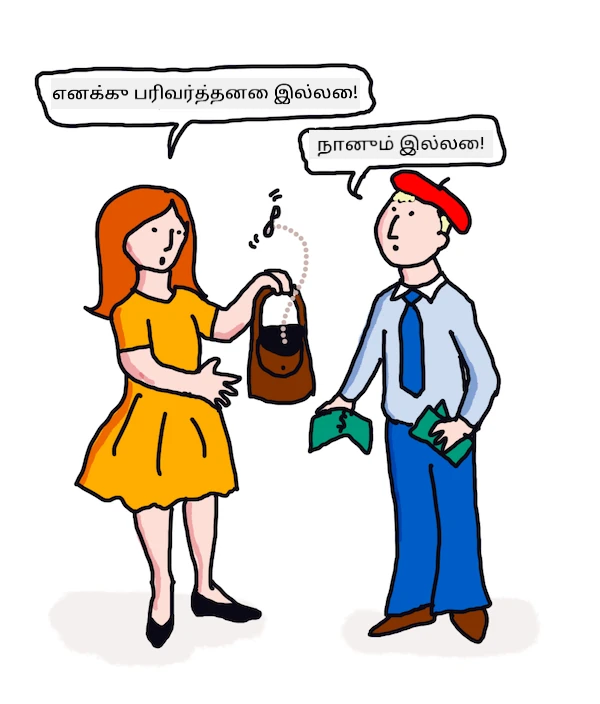

<!--
CO_OP_TRANSLATOR_METADATA:
{
  "original_hash": "be03c8182982b87ced155e4e9d1438e8",
  "translation_date": "2025-10-11T11:37:56+00:00",
  "source_file": "6-NLP/3-Translation-Sentiment/README.md",
  "language_code": "ta"
}
-->
# மெஷின் லெர்னிங் மூலம் மொழிபெயர்ப்பு மற்றும் உணர்ச்சி பகுப்பாய்வு

முந்தைய பாடங்களில், `TextBlob` என்ற நூலகத்தைப் பயன்படுத்தி அடிப்படை பாட்டை உருவாக்குவது எப்படி என்பதை நீங்கள் கற்றுக்கொண்டீர்கள். இது பெயர்ச்சொல் குழு பிரித்தல் போன்ற அடிப்படை இயற்கை மொழி செயலாக்க பணிகளை செய்ய மெஷின் லெர்னிங் பின்னணியில் செயல்படுகிறது. கணினி மொழியியல் துறையில் மற்றொரு முக்கிய சவால் என்பது ஒரு மொழியில் இருந்து மற்றொரு மொழிக்கு ஒரு வாக்கியத்தை துல்லியமாக மொழிபெயர்ப்பது.

## [பாடத்திற்கு முந்தைய வினாடி வினா](https://ff-quizzes.netlify.app/en/ml/)

மொழிபெயர்ப்பு என்பது மிகவும் கடினமான பிரச்சினையாகும், ஏனெனில் ஆயிரக்கணக்கான மொழிகள் உள்ளன, மேலும் ஒவ்வொன்றுக்கும் வெவ்வேறு இலக்கண விதிகள் இருக்கலாம். ஒரு அணுகுமுறை என்பது ஒரு மொழியின் (உதாரணமாக ஆங்கிலம்) இலக்கண விதிகளை மொழி சார்ந்த இல்லாத அமைப்பாக மாற்றி, பின்னர் அதை மற்றொரு மொழிக்கு மாற்றுவது. இந்த அணுகுமுறையில் நீங்கள் பின்வரும் படிகளை மேற்கொள்வீர்கள்:

1. **அடையாளம் காணுதல்**. உள்ளீட்டு மொழியில் உள்ள சொற்களை பெயர்ச்சொல், வினைச்சொல் போன்றவையாக அடையாளம் காணவும் அல்லது குறிக்கவும்.
2. **மொழிபெயர்ப்பு உருவாக்குதல்**. இலக்கு மொழியின் வடிவத்தில் ஒவ்வொரு சொல்லுக்கும் நேரடி மொழிபெயர்ப்பை உருவாக்கவும்.

### உதாரண வாக்கியம், ஆங்கிலத்திலிருந்து ஐரிஷ் மொழிக்கு

'ஆங்கிலத்தில்', _I feel happy_ என்ற வாக்கியம் மூன்று சொற்களைக் கொண்டுள்ளது, அவற்றின் வரிசை:

- **பொருள்** (I)
- **வினைச்சொல்** (feel)
- **பெயரடை** (happy)

ஆனால், 'ஐரிஷ்' மொழியில், அதே வாக்கியத்திற்கு மிகவும் மாறுபட்ட இலக்கண அமைப்பு உள்ளது - "*happy*" அல்லது "*sad*" போன்ற உணர்வுகள் உங்கள்மேல் இருப்பதாக வெளிப்படுத்தப்படுகின்றன.

ஆங்கில வாக்கியம் `I feel happy` ஐரிஷில் `Tá athas orm` ஆகும். ஒரு *உருவக* மொழிபெயர்ப்பு `Happy is upon me` ஆக இருக்கும்.

ஒரு ஐரிஷ் பேசுபவர் ஆங்கிலத்திற்கு மொழிபெயர்க்கும்போது `I feel happy` என்று கூறுவார், `Happy is upon me` என்று அல்ல, ஏனெனில் அவர்கள் வாக்கியத்தின் அர்த்தத்தை புரிந்துகொள்கிறார்கள், சொற்களும் வாக்கிய அமைப்பும் மாறுபட்டிருந்தாலும்.

ஐரிஷ் மொழியில் வாக்கியத்தின் உத்தியோகபூர்வ வரிசை:

- **வினைச்சொல்** (Tá அல்லது is)
- **பெயரடை** (athas, அல்லது happy)
- **பொருள்** (orm, அல்லது upon me)

## மொழிபெயர்ப்பு

ஒரு எளிய மொழிபெயர்ப்பு நிரல் சொற்களை மட்டுமே மொழிபெயர்க்கலாம், வாக்கிய அமைப்பை புறக்கணிக்கலாம்.

✅ நீங்கள் ஒரு இரண்டாவது (அல்லது மூன்றாவது அல்லது அதற்கு மேல்) மொழியை பெரியவராக கற்றுக்கொண்டிருந்தால், நீங்கள் உங்கள் தாய்மொழியில் சிந்தித்து, ஒரு கருத்தை சொல் வாரியாக உங்கள் மனதில் மொழிபெயர்த்து, பின்னர் உங்கள் மொழிபெயர்ப்பை பேச ஆரம்பித்திருக்கலாம். இது எளிய மொழிபெயர்ப்பு கணினி நிரல்கள் செய்யும் செயலுக்கு ஒத்ததாகும். இந்த கட்டத்தை கடந்து சென்று சரளமாக பேசுவது முக்கியம்!

எளிய மொழிபெயர்ப்பு மோசமான (மற்றும் சில நேரங்களில் நகைச்சுவையான) தவறான மொழிபெயர்ப்புகளுக்கு வழிவகுக்கிறது: `I feel happy` ஐரிஷில் சொற்தொகுப்பாக `Mise bhraitheann athas` ஆக மொழிபெயர்க்கப்படுகிறது. அதாவது (உருவகமாக) `me feel happy` ஆகும், இது செல்லுபடியாகும் ஐரிஷ் வாக்கியம் அல்ல. ஆங்கிலமும் ஐரிஷும் இரண்டு அருகிலுள்ள தீவுகளில் பேசப்படும் மொழிகள் என்றாலும், அவை மிகவும் மாறுபட்ட மொழிகள் மற்றும் மாறுபட்ட இலக்கண அமைப்புகளைக் கொண்டுள்ளன.

> ஐரிஷ் மொழியியல் பாரம்பரியங்களைப் பற்றிய சில வீடியோக்களை [இங்கே](https://www.youtube.com/watch?v=mRIaLSdRMMs) பார்க்கலாம்.

### மெஷின் லெர்னிங் அணுகுமுறைகள்

இப்போது வரை, இயற்கை மொழி செயலாக்கத்திற்கு உத்தியோகபூர்வ விதிகளின் அணுகுமுறையைப் பற்றி நீங்கள் கற்றுக்கொண்டீர்கள். மற்றொரு அணுகுமுறை என்பது சொற்களின் அர்த்தத்தை புறக்கணித்து, *மாறாக மெஷின் லெர்னிங் மூலம் முறைமைகளை கண்டறிதல்* ஆகும். இது மொழிபெயர்ப்பில் செயல்படலாம், நீங்கள் மூல மற்றும் இலக்கு மொழிகளில் நிறைய உரை (ஒரு *corpus*) அல்லது உரைகள் (*corpora*) கொண்டிருந்தால்.

உதாரணமாக, ஜேன் ஆஸ்டின் 1813 இல் எழுதிய பிரபலமான ஆங்கில நாவலான *Pride and Prejudice* ஐ எடுத்துக்கொள்ளுங்கள். நீங்கள் இந்த புத்தகத்தை ஆங்கிலத்திலும், *பிரெஞ்சு* மொழியில் மனித மொழிபெயர்ப்பிலும் பார்த்தால், ஒரு மொழியில் உள்ள சொற்றொடர்களை மற்றொன்றில் *இடியோமாடிக்காக* மொழிபெயர்க்கப்பட்டிருப்பதை கண்டறியலாம். நீங்கள் அதை ஒரு நிமிடத்தில் செய்வீர்கள்.

உதாரணமாக, `I have no money` என்ற ஆங்கில சொற்றொடர் பிரெஞ்சுக்கு சொற்தொகுப்பாக மொழிபெயர்க்கப்படும் போது, அது `Je n'ai pas de monnaie` ஆக மாறலாம். "Monnaie" என்பது ஒரு சிக்கலான பிரெஞ்சு 'தவறான ஒத்தசொல்', ஏனெனில் 'money' மற்றும் 'monnaie' ஒரே அர்த்தம் கொண்டவை அல்ல. ஒரு மனிதன் செய்யக்கூடிய சிறந்த மொழிபெயர்ப்பு `Je n'ai pas d'argent` ஆக இருக்கும், ஏனெனில் இது உங்களிடம் பணம் இல்லை என்பதைச் சரியாக வெளிப்படுத்துகிறது (அல்லது 'சில்லறை' என்பதை அல்ல, இது 'monnaie' என்பதன் அர்த்தம்).



> படம்: [Jen Looper](https://twitter.com/jenlooper)

ஒரு மெஷின் லெர்னிங் மாடல், மனித மொழிபெயர்ப்புகளை அடிப்படையாகக் கொண்டு போதுமான தரவுகளை கொண்டிருந்தால், முன்பு நிபுணர் மனித மொழிபெயர்ப்பாளர்களால் மொழிபெயர்க்கப்பட்ட உரைகளில் பொதுவான முறைமைகளை அடையாளம் காண்பதன் மூலம் மொழிபெயர்ப்புகளின் துல்லியத்தை மேம்படுத்த முடியும்.

### பயிற்சி - மொழிபெயர்ப்பு

`TextBlob` ஐப் பயன்படுத்தி வாக்கியங்களை மொழிபெயர்க்கலாம். **Pride and Prejudice** புத்தகத்தின் பிரபலமான முதல் வரியை முயற்சிக்கவும்:

```python
from textblob import TextBlob

blob = TextBlob(
    "It is a truth universally acknowledged, that a single man in possession of a good fortune, must be in want of a wife!"
)
print(blob.translate(to="fr"))

```

`TextBlob` மொழிபெயர்ப்பை மிகவும் துல்லியமாக செய்கிறது: "C'est une vérité universellement reconnue, qu'un homme célibataire en possession d'une bonne fortune doit avoir besoin d'une femme!".

உண்மையில், TextBlob இன் மொழிபெயர்ப்பு 1932 ஆம் ஆண்டில் V. Leconte மற்றும் Ch. Pressoir எழுதிய பிரெஞ்சு மொழிபெயர்ப்பை விட மிகவும் துல்லியமானதாகக் கருதப்படுகிறது:

"C'est une vérité universelle qu'un célibataire pourvu d'une belle fortune doit avoir envie de se marier, et, si peu que l'on sache de son sentiment à cet egard, lorsqu'il arrive dans une nouvelle résidence, cette idée est si bien fixée dans l'esprit de ses voisins qu'ils le considèrent sur-le-champ comme la propriété légitime de l'une ou l'autre de leurs filles."

இந்தக் கட்டத்தில், மெஷின் லெர்னிங் மூலம் தகவலளிக்கப்பட்ட மொழிபெயர்ப்பு, தெளிவுக்காக தேவையற்ற சொற்களை சேர்த்த மனித மொழிபெயர்ப்பாளரை விட சிறப்பாக செயல்படுகிறது.

> இங்கே என்ன நடக்கிறது? TextBlob மொழிபெயர்ப்பில் ஏன் இவ்வளவு சிறப்பாக செயல்படுகிறது? TextBlob பின்னணியில் Google Translate ஐப் பயன்படுத்துகிறது, இது மிகுந்த நுண்ணறிவுடன் கோடிக்கணக்கான சொற்றொடர்களை பகுப்பாய்ந்து, குறிப்பிட்ட பணிக்கான சிறந்த சொற்றொடர்களை கணிக்கிறது. இங்கே எதுவும் கைமுறையாக செய்யப்படவில்லை, மேலும் `blob.translate` ஐப் பயன்படுத்த இணைய இணைப்பு தேவை.

✅ மேலும் சில வாக்கியங்களை முயற்சிக்கவும். எது சிறந்தது, மெஷின் லெர்னிங் அல்லது மனித மொழிபெயர்ப்பு? எந்த வழிகளில்?

## உணர்ச்சி பகுப்பாய்வு

மெஷின் லெர்னிங் மிகவும் நன்றாக செயல்படும் மற்றொரு பகுதி உணர்ச்சி பகுப்பாய்வு ஆகும். மெஷின் லெர்னிங் இல்லாத அணுகுமுறை என்பது 'நேர்மறை' மற்றும் 'எதிர்மறை' சொற்களையும் சொற்றொடர்களையும் அடையாளம் காண்பதாகும். பின்னர், புதிய உரை ஒன்றுக்கு, நேர்மறை, எதிர்மறை மற்றும் நடுநிலை சொற்களின் மொத்த மதிப்பை கணக்கிட்டு, மொத்த உணர்ச்சியை அடையாளம் காணவும்.

இந்த அணுகுமுறை எளிதில் ஏமாற்றப்படும், நீங்கள் Marvin பணியில் பார்த்திருப்பீர்கள் - `Great, that was a wonderful waste of time, I'm glad we are lost on this dark road` என்ற வாக்கியம் ஒரு கிண்டலான, எதிர்மறை உணர்ச்சி கொண்ட வாக்கியம், ஆனால் எளிய ஆல்காரிதம் 'great', 'wonderful', 'glad' ஆகியவற்றை நேர்மறையாகவும், 'waste', 'lost', 'dark' ஆகியவற்றை எதிர்மறையாகவும் கண்டறிகிறது. இந்த முரண்பட்ட சொற்களால் மொத்த உணர்ச்சி பாதிக்கப்படுகிறது.

✅ ஒரு நிமிடம் நின்று, மனிதர்கள் பேசும் போது கிண்டலை எவ்வாறு வெளிப்படுத்துகிறோம் என்று சிந்தியுங்கள். குரல் உயரச்செய்தல் முக்கிய பங்கு வகிக்கிறது. "Well, that film was awesome" என்ற சொற்றொடரை வெவ்வேறு முறைகளில் சொல்ல முயற்சிக்கவும், உங்கள் குரல் அர்த்தத்தை எவ்வாறு வெளிப்படுத்துகிறது என்பதை கண்டறியவும்.

### மெஷின் லெர்னிங் அணுகுமுறைகள்

மெஷின் லெர்னிங் அணுகுமுறை என்பது கையேடு முறையில் எதிர்மறை மற்றும் நேர்மறை உரைகளை சேகரிப்பதாகும் - ட்வீட்கள், திரைப்பட விமர்சனங்கள் அல்லது மனிதர் மதிப்பெண்களையும் எழுத்து கருத்துக்களையும் வழங்கிய எதையும். பின்னர், கருத்துக்களுக்கும் மதிப்பெண்களுக்கும் இயற்கை மொழி செயலாக்க நுட்பங்களைப் பயன்படுத்தி, முறைமைகள் வெளிப்படுகின்றன (உதாரணமாக, நேர்மறை திரைப்பட விமர்சனங்களில் 'Oscar worthy' என்ற சொற்றொடர் எதிர்மறை விமர்சனங்களை விட அதிகமாக இருக்கும், அல்லது நேர்மறை உணவக விமர்சனங்களில் 'gourmet' என்பது 'disgusting' என்பதைக் காட்டிலும் அதிகமாக இருக்கும்).

> ⚖️ **உதாரணம்**: நீங்கள் ஒரு அரசியல்வாதியின் அலுவலகத்தில் வேலை செய்தால், ஒரு புதிய சட்டம் விவாதிக்கப்படும் போது, மக்கள் அந்த சட்டத்தை ஆதரிக்க அல்லது எதிர்க்க மின்னஞ்சல்கள் எழுதலாம். மின்னஞ்சல்களின் எண்ணிக்கை அதிகமாக இருந்தால், அவற்றை அனைத்தையும் படிக்க முயற்சிப்பது சிரமமாக இருக்கும். ஒரு பாட்டி அவற்றை அனைத்தையும் படித்து, ஒவ்வொரு மின்னஞ்சலும் எந்தப் பிரிவில் சேரும் என்பதைச் சொல்ல முடியுமானால் நல்லதல்லவா? 
> 
> இதை அடைய ஒரு வழி மெஷின் லெர்னிங் ஆகும். நீங்கள் மாடலை ஒரு பகுதியை *எதிர்ப்பு* மின்னஞ்சல்களுடன் மற்றும் மற்றொரு பகுதியை *ஆதரவு* மின்னஞ்சல்களுடன் பயிற்சி செய்யலாம். மாடல் எதிர்ப்பு அல்லது ஆதரவு மின்னஞ்சல்களில் குறிப்பிட்ட சொற்கள் மற்றும் முறைமைகள் அதிகமாக தோன்றும் என்பதை தொடர்புபடுத்தும், *ஆனால் அது எந்த உள்ளடக்கத்தையும் புரிந்துகொள்ளாது*, குறிப்பிட்ட சொற்கள் மற்றும் முறைமைகள் எதிர்ப்பு அல்லது ஆதரவு மின்னஞ்சல்களில் அதிகமாக தோன்றும் என்பதை மட்டும். பின்னர், நீங்கள் மாடலின் துல்லியத்துடன் திருப்தி அடைந்த பிறகு, எதிர்கால மின்னஞ்சல்களை ஒவ்வொன்றையும் படிக்காமல் செயலாக்கலாம்.

✅ இந்த செயல்முறை நீங்கள் முந்தைய பாடங்களில் பயன்படுத்திய செயல்முறைகளைப் போன்றதா?

## பயிற்சி - உணர்ச்சி கொண்ட வாக்கியங்கள்

உணர்ச்சி *துருவத்தன்மை* -1 முதல் 1 வரை அளவிடப்படுகிறது, அதாவது -1 என்பது மிகவும் எதிர்மறையான உணர்ச்சி, 1 என்பது மிகவும் நேர்மறையான உணர்ச்சி. உணர்ச்சி 0 - 1 மதிப்பெண்களுடன் பொருளாதாரத்தன்மை (0) மற்றும் தனிப்பட்ட தன்மை (1) ஆகியவற்றுடன் அளவிடப்படுகிறது.

ஜேன் ஆஸ்டின் எழுதிய *Pride and Prejudice* புத்தகத்தை மீண்டும் பாருங்கள். இந்த உரை [Project Gutenberg](https://www.gutenberg.org/files/1342/1342-h/1342-h.htm) இல் கிடைக்கிறது. கீழே உள்ள மாதிரி, புத்தகத்தின் முதல் மற்றும் கடைசி வாக்கியங்களின் உணர்ச்சியை பகுப்பாய்வு செய்யும் ஒரு சிறிய நிரலின் உதாரணத்தை காட்டுகிறது, மேலும் அதன் உணர்ச்சி துருவத்தன்மை மற்றும் தன்மை/பொருளாதாரத்தன்மை மதிப்பெண்களை காட்டுகிறது.

இந்த பணியில் `TextBlob` நூலகத்தை (மேலே விவரிக்கப்பட்டது) பயன்படுத்தி `sentiment` ஐ தீர்மானிக்க வேண்டும் (உங்கள் சொந்த உணர்ச்சி கணக்கீட்டியை எழுத தேவையில்லை).

```python
from textblob import TextBlob

quote1 = """It is a truth universally acknowledged, that a single man in possession of a good fortune, must be in want of a wife."""

quote2 = """Darcy, as well as Elizabeth, really loved them; and they were both ever sensible of the warmest gratitude towards the persons who, by bringing her into Derbyshire, had been the means of uniting them."""

sentiment1 = TextBlob(quote1).sentiment
sentiment2 = TextBlob(quote2).sentiment

print(quote1 + " has a sentiment of " + str(sentiment1))
print(quote2 + " has a sentiment of " + str(sentiment2))
```

நீங்கள் பின்வரும் வெளியீட்டை காண்கிறீர்கள்:

```output
It is a truth universally acknowledged, that a single man in possession of a good fortune, must be in want # of a wife. has a sentiment of Sentiment(polarity=0.20952380952380953, subjectivity=0.27142857142857146)

Darcy, as well as Elizabeth, really loved them; and they were
     both ever sensible of the warmest gratitude towards the persons
      who, by bringing her into Derbyshire, had been the means of
      uniting them. has a sentiment of Sentiment(polarity=0.7, subjectivity=0.8)
```

## சவால் - உணர்ச்சி துருவத்தன்மையை சரிபார்க்கவும்

*Pride and Prejudice* புத்தகத்தில் முழுமையாக நேர்மறையான வாக்கியங்கள் எதிர்மறையானவைகளை விட அதிகமாக உள்ளதா என்பதை உணர்ச்சி துருவத்தன்மையைப் பயன்படுத்தி தீர்மானிக்க உங்கள் பணியாகும். இந்த பணிக்கான துருவத்தன்மை மதிப்பெண் 1 அல்லது -1 என்பது முற்றிலும் நேர்மறை அல்லது முற்றிலும் எதிர்மறை என்று கருதலாம்.

**படிகள்:**

1. [Pride and Prejudice](https://www.gutenberg.org/files/1342/1342-h/1342-h.htm) புத்தகத்தின் ஒரு நகலை .txt கோப்பாக Project Gutenberg இல் இருந்து பதிவிறக்கம் செய்யவும். கோப்பின் தொடக்க மற்றும் இறுதியில் உள்ள மெட்டாடாவை நீக்கி, மூல உரையை மட்டும் விடவும்.
2. Python இல் கோப்பை திறந்து, உள்ளடக்கத்தை ஒரு string ஆக எடுக்கவும்.
3. புத்தக string ஐ TextBlob ஆக உருவாக்கவும்.
4. புத்தகத்தில் உள்ள ஒவ்வொரு வாக்கியத்தையும் ஒரு மடக்கத்தில் பகுப்பாய்வு செய்யவும்.
   1. துருவத்தன்மை 1 அல்லது -1 என்றால், அந்த வாக்கியத்தை நேர்மறை அல்லது எதிர்மறை செய்திகளின் வரிசையில் சேமிக்கவும்.
5. இறுதியில், அனைத்து நேர்மறை வாக்கியங்களையும் எதிர்மறை வாக்கியங்களையும் (தனித்தனியாக) மற்றும் ஒவ்வொன்றின் எண்ணிக்கையையும் அச்சிடவும்.

இங்கே ஒரு மாதிரி [தீர்வு](https://github.com/microsoft/ML-For-Beginners/blob/main/6-NLP/3-Translation-Sentiment/solution/notebook.ipynb) உள்ளது.

✅ அறிவு சரிபார்ப்பு

1. உணர்ச்சி சொற்களில் அடிப்படையாக உள்ளது, ஆனால் குறியீடு சொற்களை *புரிகிறதா*?
2. உணர்ச்சி துருவத்தன்மை துல்லியமாக இருக்கிறதா, அல்லது வேறு வார்த்தைகளில், நீங்கள் மதிப்பெண்களுடன் *ஒத்துப்போகிறீர்களா*?
   1. குறிப்பாக, பின்வரும் வாக்கியங்களின் முழுமையான **நேர்மறை** துருவத்தன்மையுடன் நீங்கள் ஒத்துக்கொள்கிறீர்களா அல்லது ஒத்துக்கொள்வதில்லை?
      * “What an excellent father you have, girls!” said she, when the door was shut.
      * “Your examination of Mr. Darcy is over, I presume,” said Miss Bingley; “and pray what is the result?” “I am perfectly convinced by it that Mr. Darcy has no defect.
      * How wonderfully these sort of things occur!
      * I have the greatest dislike in the world to that sort of thing.
      * Charlotte is an excellent manager, I dare say.
      * “This is delightful indeed!
      * I am so happy!
      * Your idea of the ponies is delightful.
   2. பின்வரும் 3 வாக்கியங்கள் முழுமையான நேர்மறை உணர்ச்சியுடன் மதிப்பீடு செய்யப்பட்டன, ஆனால் நெருங்கிய வாசிப்பில், அவை நேர்மறை வாக்கியங்கள் அல்ல. உணர்ச்சி பகுப்பாய்வு அவற்றை நேர்மறை வாக்கியங்களாக நினைத்ததற்கான காரணம் என்ன?
      * Happy shall I be, when his stay at Netherfield is over!” “I wish I could say anything to comfort you,” replied Elizabeth; “but it is wholly out of my power.
      * If I could but see you as happy!
      * Our distress, my dear Lizzy, is very great.
   3. பின்வரும் வாக்கியங்களின் முழுமையான **எதிர்மறை** துருவத்தன்மையுடன் நீங்கள் ஒத்துக்கொள்கிறீர்களா அல்லது ஒத்துக்கொள்வதில்லை?
      - Everybody is disgusted
## மதிப்பீடு & சுயபயிற்சி

உரையில் இருந்து உணர்வுகளை பெற பல வழிகள் உள்ளன. இந்த தொழில்நுட்பத்தை பயன்படுத்தும் வணிக பயன்பாடுகளை நினைத்துப் பாருங்கள். இது எவ்வாறு தவறாக செல்லக்கூடும் என்பதைப் பற்றி யோசிக்கவும். உணர்வுகளை பகுப்பாய்வு செய்யும் மேம்பட்ட நிறுவனத்திற்கான அமைப்புகள் பற்றிய மேலும் படிக்கவும், உதாரணமாக [Azure Text Analysis](https://docs.microsoft.com/azure/cognitive-services/Text-Analytics/how-tos/text-analytics-how-to-sentiment-analysis?tabs=version-3-1?WT.mc_id=academic-77952-leestott). மேலே உள்ள Pride and Prejudice வாக்கியங்களில் சிலவற்றை சோதித்து, அது நுணுக்கத்தை கண்டறிய முடியுமா என்பதைப் பாருங்கள்.

## பணிக்கட்டளை

[கவிதை உரிமம்](assignment.md)

---

**குறிப்பு**:  
இந்த ஆவணம் [Co-op Translator](https://github.com/Azure/co-op-translator) என்ற AI மொழிபெயர்ப்பு சேவையை பயன்படுத்தி மொழிபெயர்க்கப்பட்டுள்ளது. எங்கள் நோக்கம் துல்லியமாக இருக்க வேண்டும் என்றாலும், தானியங்கி மொழிபெயர்ப்புகளில் பிழைகள் அல்லது தவறுகள் இருக்கக்கூடும் என்பதை தயவுசெய்து கவனத்தில் கொள்ளவும். அதன் தாய்மொழியில் உள்ள மூல ஆவணம் அதிகாரப்பூர்வ ஆதாரமாக கருதப்பட வேண்டும். முக்கியமான தகவல்களுக்கு, தொழில்முறை மனித மொழிபெயர்ப்பு பரிந்துரைக்கப்படுகிறது. இந்த மொழிபெயர்ப்பைப் பயன்படுத்துவதால் ஏற்படும் எந்த தவறான புரிதல்கள் அல்லது தவறான விளக்கங்களுக்கு நாங்கள் பொறுப்பல்ல.