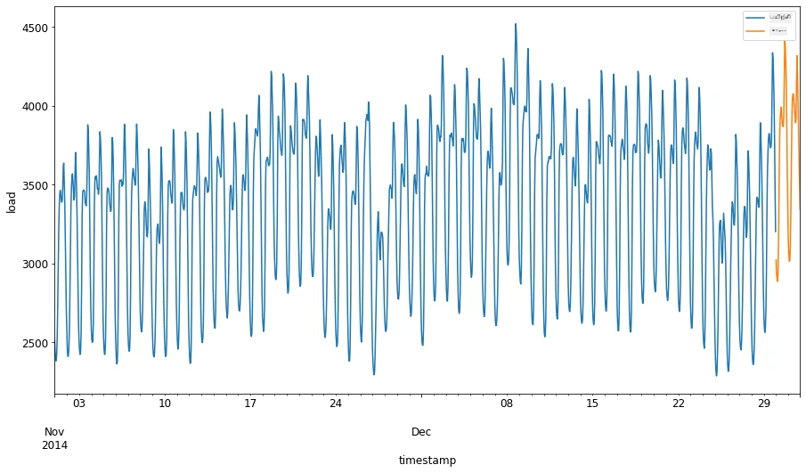
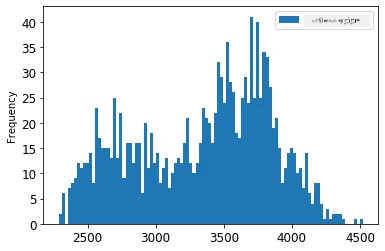
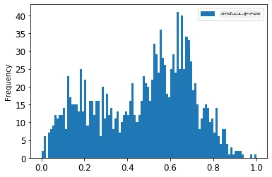
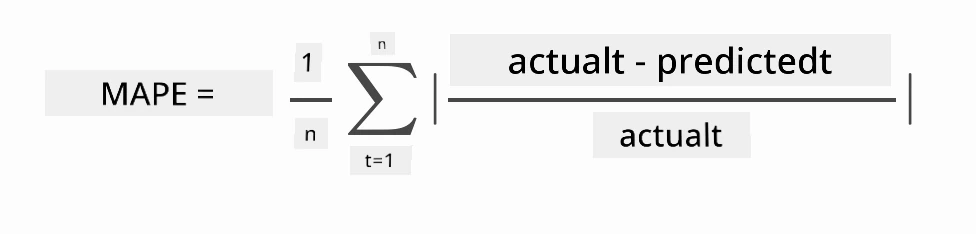
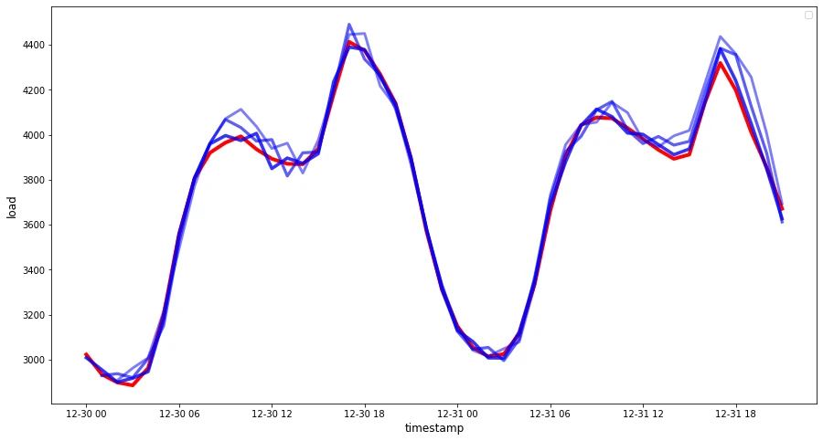

# ARIMA உடன் நேர வரிசை முன்னறிவு

முந்தைய பாடத்தில், நீங்கள் நேர வரிசை முன்னறிவைப் பற்றி சிறிது அறிந்துகொண்டு, ஒரு காலப் பரப்பில் மின்சார சுமையின் வீழ்ச்சிகளை காட்டும் தரவுத்தொகுப்பை ஏற்றினீர்கள்.

[](https://youtu.be/IUSk-YDau10 "ARIMA அறிமுகம்")

> 🎥 மேலே உள்ள படத்தை கிளிக் செய்து காணொளியைப் பாருங்கள்: ARIMA மாதிரிகளுக்கான ஒரு சுருக்கமான அறிமுகம். எடுத்துக்காட்டு R இல் செய்யப்பட்டிருப்பாலும், கருத்துகள் உலகளாவியமானவை.

## [முன்னிலை தேர்வுக்கான வினாக்களஞ்சியம்](https://ff-quizzes.netlify.app/en/ml/)

## அறிமுகம்

இந்த பாடத்தில், நீங்கள் குறிப்பிட்ட ஒரு முறையை கண்டறியப்போகிறீர்கள், அதனை [ARIMA: *A*uto*R*egressive *I*ntegrated *M*oving *A*verage](https://wikipedia.org/wiki/Autoregressive_integrated_moving_average) என்று அழைக்கப்படுகிறது. ARIMA மாதிரிகள் குறிப்பாக [நிலைமையற்றவை](https://wikipedia.org/wiki/Stationary_process) என்று காட்டும் தரவுக்கு மிகச் சிறந்தவை.

## பொதுவான கருத்துகள்

ARIMA உடன் பணியாற்ற, நீங்கள் சில கருத்துக்களை அறிந்திருக்க வேண்டும்:

- 🎓 **நிலைமைமையாக்கம்**. புள்ளிவிவரம் சார்ந்த நியாயத்தில், நிலைமைமையாக்கம் என்பது நேரம் மாறினாலும் தரவின் பகிர்வு மாறாததை குறிக்கும். நிலைமையற்ற தரவு என்பது படிமங்கள் காரணமாக வீழ்ச்சிகளை காட்டும், அவற்றை பகுப்பாய்வு செய்ய மாற்றப்படాలి. காலக்கட்ட விருப்பம் உதாரணமாக தரவில் வீழ்ச்சிகளை அறிமுகம் செய்ய முடியும், அதை 'காலக்கட்ட பாகுபாடு' மூலம் நீக்க முடியும்.

- 🎓 **[பரிசோதனை](https://wikipedia.org/wiki/Autoregressive_integrated_moving_average#Differencing)**. பரிசோதனை தரவுக்கான ஒரு முறை, இதன் மூலம் நிலைமையற்ற தரவை நிலைமைமையாக்கமாக மாற்ற, அதன் நிலைமையற்ற படிமத்தை அகற்றும். "பரிசோதனை நேர வரிசையின் நிலையின் மாற்றங்களை அகற்றி, படிமம் மற்றும் காலக்கட்ட விருப்பத்தை நீக்கும், இதனால் நேர வரிசையின் சராசரி நிலையானதாக இருக்கும்." [Shixiong et al மூலம் கட்டுரை](https://arxiv.org/abs/1904.07632)

## நேர வரிசை சூழலில் ARIMA

ARIMA இன் பகுதிகளை ஆராய்ந்து, இது எவ்வாறு நேர வரிசையை மாதிரியாக்கில் உதவுகிறது மற்றும் எவ்வாறு எதிர்காலம் கணிப்பதில் உதவுகிறது என்று புரிந்துகொள்ளலாம்.

- **AR - தானாகும் பின்விளைவு**. AutoRegressive மாதிரிகள், பெயரே சொல்வது போல, உங்கள் தரவின் முந்தைய மதிப்புகளைப் பார்க்கின்றன மற்றும் அவற்றைப் பற்றி ஊகிக்கின்றன. இந்த முந்தைய மதிப்புகள் 'தாமதங்கள்' என அழைக்கப்படுகின்றன. உதாரணமாக, மாதாந்திர பேன்சில்கள் விற்பனையை காட்டும் தரவு. ஒவ்வொரு மாததிலும் விற்பனை மொத்தம் 'மாறுபடும் மாறி' ஆக கருதப்படுகிறது. இந்த மாதிரியானது "தாயாரிப்பு மாறி தனது தாமத மதிப்புகளுக்கு மீண்டும் சாரப்படுகிறது." [விக்கிபீடியா](https://wikipedia.org/wiki/Autoregressive_integrated_moving_average)

- **I - ஒருங்கிணைப்பு**. ARMA மாதிரிகளுக்கு மாறாக, ARIMA இன் 'I' அதன் *[ஒருங்கிணைக்கப்பட்ட](https://wikipedia.org/wiki/Order_of_integration)* அம்சத்தை குறிக்கிறது. தரவு 'ஒருங்கிணைக்கப்படுகிறது' எனும் போது, நிலைமையற்ற தன்மையை நீக்கும் பரிசோதனைச் செயல்முறைகள் செயல்படுத்தப்படுகின்றன.

- **MA - நகரும் சராசரி**. இந்த மாதிரியின் [நகரும் சராசரி](https://wikipedia.org/wiki/Moving-average_model) அம்சம், தற்போதைய மற்றும் முந்தைய தாமத மதிப்புகளைக் கவனித்து முடிவு செய்யும் வெளியீட்டு மாறி ஆகும்.

சுருக்கமாக: ARIMA நேர வரிசை தரவை மிக நுணுக்கமாக மாதிரியாக்க பயன்படுத்தப்படுகிறது.

## பயிற்சி - ARIMA மாதிரி உருவாக்குதல்

இந்த பாடத்தில் உள்ள [_/working_](https://github.com/microsoft/ML-For-Beginners/tree/main/7-TimeSeries/2-ARIMA/working) கோப்புறையை திறந்து [_notebook.ipynb_](https://github.com/microsoft/ML-For-Beginners/blob/main/7-TimeSeries/2-ARIMA/working/notebook.ipynb) கோப்பை கண்டுகொள்ளுங்கள்.

1. `statsmodels` பைத்தான் நூலகத்தை ஏற்ற வெளியொட்டையை இயக்குங்கள்; இதன் மூலம் ARIMA மாதிரிகள் பயன்படுத்தப்பட வேண்டும்.

1. தேவையான நூலகங்களை ஏற்று.

1. இப்போது, தரவு வரைபடப்படுத்த தேவையான மேலும் சில நூலகங்களை ஏற்றுங்கள்:

    ```python
    import os
    import warnings
    import matplotlib.pyplot as plt
    import numpy as np
    import pandas as pd
    import datetime as dt
    import math

    from pandas.plotting import autocorrelation_plot
    from statsmodels.tsa.statespace.sarimax import SARIMAX
    from sklearn.preprocessing import MinMaxScaler
    from common.utils import load_data, mape
    from IPython.display import Image

    %matplotlib inline
    pd.options.display.float_format = '{:,.2f}'.format
    np.set_printoptions(precision=2)
    warnings.filterwarnings("ignore") # எச்சரிக்கை செய்திகளை பிற்புறிக்காக குறிப்பிடு
    ```

1. `/data/energy.csv` கோப்பிலிருந்து தரவை Pandas தரவுத்தொடர்வாக்கி (dataframe) ஆக ஏற்று பாருங்கள்:

    ```python
    energy = load_data('./data')[['load']]
    energy.head(10)
    ```

1. ஜனவரி 2012 முதல் டிசம்பர் 2014 வரை உள்ள அனைத்து எரிசக்தி தரவும் வரைபடம் படுத்துங்கள். இது முந்தைய பாடத்தில் பார்த்த தரவு, அதனால் ஆச்சரியமிடவதில்லை:

    ```python
    energy.plot(y='load', subplots=True, figsize=(15, 8), fontsize=12)
    plt.xlabel('timestamp', fontsize=12)
    plt.ylabel('load', fontsize=12)
    plt.show()
    ```

இப்போது, ஒரு மாதிரியை உருவாக்குவோம்!

### பயிற்சி மற்றும் சோதனை தரவுத்தொகுப்புகளை உருவாக்குதல்

இப்போது உங்கள் தரவு ஏற்றப்பட்டுள்ளது, அதை பயிற்சி மற்றும் சோதனை தொகுதிகளாக பிரிக்கலாம். உங்கள் மாதிரியை பயிற்சி தொகுதியில் பயிற்றுவிப்பீர்கள். சாதாரணமாக, மாதிரி பயிற்சியாயிற்றுப்பின்னர், அதன் நம்பகதன்மையை சோதனை தொகுதியில் மதிப்பீடு செய்வீர்கள். சோதனை தொகுதி பயிற்சி தொகுதியில் இருந்து பின்னர் காலப் பகுதியை உள்ளடக்க வேண்டும், மாதிரி எதிர்கால காலங்களிலிருந்து தகவல் பெறாமல் இருக்க.

1. 2014 செப்டம்பர் 1 முதல் அக்டோபர் 31 வரை இரண்டு மாத காலத்தை பயிற்சி தொகுதிக்கு ஒதுக்குங்கள். சோதனை தொகுதியில் 2014 நவம்பர் 1 முதல் டிசம்பர் 31 வரை இரண்டு மாத காலம் இருக்கும்:

    ```python
    train_start_dt = '2014-11-01 00:00:00'
    test_start_dt = '2014-12-30 00:00:00'
    ```

இந்த தரவு நாள்தோறும் எரிசக்தி பயன்பாட்டை பிரதிபலிக்கும், ஒரு வலுவான காலக்கட்ட முறை உள்ளது, ஆனால் சமீபத்திய நாட்களில் உள்ள பயன்பாட்டுடன் மிகவும் ஒத்துப்போகிறது.

1. வேறுபாடுகளை காட்சிப்படுத்துங்கள்:

    ```python
    energy[(energy.index < test_start_dt) & (energy.index >= train_start_dt)][['load']].rename(columns={'load':'train'}) \
        .join(energy[test_start_dt:][['load']].rename(columns={'load':'test'}), how='outer') \
        .plot(y=['train', 'test'], figsize=(15, 8), fontsize=12)
    plt.xlabel('timestamp', fontsize=12)
    plt.ylabel('load', fontsize=12)
    plt.show()
    ```



ஆகையால், தரவை பயிற்றுவிக்க பொது நேரம் குறைந்த ஒரு சாளரம் போலும் போதுமானது.

> குறிப்பு: ARIMA மாதிரியை பொருந்தும் செயல்பாட்டில் உள்ள மாதிரி உள்ளடக்கங்களில் எடுத்துக்காட்டு நிறைவு செய்யும் போது நாம் தேர்வான தரவை தவிர்க்கிறோம்.

### பயிற்சிக்கான தரவை தயாரிப்பது

இப்போது, உங்கள் தரவை வடிகட்டி மற்றும் அளவீட்டு செயல்களை செய்து பயிற்சிக்கு தயாரிக்க வேண்டும். உங்கள் தரவுத்தொகுப்பை தேவையான காலப்பகுதிகள் மற்றும் பத்திகளுக்காக மட்டும் வடிகட்டி, தரவை 0,1 இடைவெளியில் வரும் வகையில் அளவீடு செய்யவும்.

1. முதலில், மேலே கூறிய காலப்பகுதிகளை மற்றும் தேவையான 'load' பத்தி மற்றும் தேதியுடன் மட்டுமே அடக்கம் செய்யும் வகையில் தரவுத்தொகுப்பை வடிகட்டுங்கள்:

    ```python
    train = energy.copy()[(energy.index >= train_start_dt) & (energy.index < test_start_dt)][['load']]
    test = energy.copy()[energy.index >= test_start_dt][['load']]

    print('Training data shape: ', train.shape)
    print('Test data shape: ', test.shape)
    ```

தரவு வடிவத்தைப் பார்க்கலாம்:

    ```output
    Training data shape:  (1416, 1)
    Test data shape:  (48, 1)
    ```

1. தரவை (0, 1) வரையறையில் அளவீடு செய்யவும்.

    ```python
    scaler = MinMaxScaler()
    train['load'] = scaler.fit_transform(train)
    train.head(10)
    ```

1. ஆரம்ப தரவு மற்றும் அளவீடு செய்யப்பட்ட தரவை காட்சிப்படுத்துங்கள்:

    ```python
    energy[(energy.index >= train_start_dt) & (energy.index < test_start_dt)][['load']].rename(columns={'load':'original load'}).plot.hist(bins=100, fontsize=12)
    train.rename(columns={'load':'scaled load'}).plot.hist(bins=100, fontsize=12)
    plt.show()
    ```



> அசல் தரவு



> அளவீடு செய்யப்பட்ட தரவு

1. ஒருவேளை, நீங்கள் அளவிடப்பட்ட தரவை அளவீடு செய்து விட்டீர்கள், இப்போது சோதனை தரவையும் அளவீடு செய்யுங்கள்:

    ```python
    test['load'] = scaler.transform(test)
    test.head()
    ```

### ARIMA ஐ செயல்படுத்துதல்

ARIMA ஐ தற்போது செயல்படுத்த நேரம்! நீங்கள் முன்னர் நிறுவிய `statsmodels` நூலகத்தை இப்போது பயன்படுத்தப்போகிறீர்கள்.

இப்போது நீங்கள் பல படிகள் பின்பற்ற வேண்டும்

   1. `SARIMAX()` ஐ அழைத்து மாதிரி அளவுருக்கள் p, d, மற்றும் q, மற்றும் P, D, மற்றும் Q அளவுருக்களை கடந்து மாதிரியை வரையறுக்கவும்.
   2. பயிற்சி தரவுக்கான மாதிரியை fit() செயல்பாட்டை அழைத்து தயார் செய்யவும்.
   3. எண்ணிக்கையை (`horizon`) குறிப்பிட்டு `forecast()` செயல்பாட்டை அழைத்து முன்னறிவுகளை செய்யவும்.

> 🎓 இந்த அனைத்து அளவுருக்கள் எதற்காக இருக்கின்றன? ARIMA மாதிரியில் 3 அளவுருக்கள் உள்ளன, அவை நேர வரிசையின் முக்கிய அம்சங்களான காலக்கட்டி, படிமம் மற்றும் சத்தத்தை மாதிரியாக்க உதவுகின்றன. அவை:

`p`: மாதிரியின் தானாகும் பின்விளைவு அம்சத்திற்கு தொடர்புடைய அளவுரு, இது *ஏற்றி* மதிப்புகளைச் சேர்க்கிறது.
`d`: மாதிரியின் ஒருங்கிணைந்த பகுதியுக்கான அளவுரு, இது நேர வரிசையில் *பரிசோதனை* (🎓 மேல் பரிசோதனை நினைவுகூரவும் 👆) அளவுக்கு பாதிப்பை ஏற்படுத்துகிறது.
`q`: நகரும் சராசரி பகுதியுக்கான அளவுரு.

> குறிப்பு: உங்கள் தரவில் காலக்கட்டு அம்சம் இருந்தால் - இந்தப் பதிவு அதுபோலவே உள்ளது - , காலக்கட்டி ARIMA மாதிரி (SARIMA) பயன்படுத்தப்படும். அந்த நிலைமைக்கான தனிப்பட்ட அளவுருக்கள்: `P`, `D`, மற்றும் `Q` இவை `p`, `d`, மற்றும் `q` எனும் அளவுருக்களின் காலக்கட்ட அம்சங்களுக்கான இணைப்புகளாகும்.

1. முதலில் உங்கள் விருப்பமான கணிப்புப் பரப்பை அமைக்கவும். எடுத்துக்காட்டாக 3 மணி நேரத்திற்கு முயற்சி செய்யுங்கள்:

    ```python
    # முன்னால் கணிக்க படவுள்ள படிகளின் எண்ணிக்கை குறிப்பிடுக
    HORIZON = 3
    print('Forecasting horizon:', HORIZON, 'hours')
    ```

    ARIMA மாதிரி அளவுருக்களின் சிறந்த மதிப்புகளை தேர்வு செய்வது சிரமமாக இருக்கலாம், ஏனெனில் அது சுயபரிசோதி மற்றும் நேரம் எடுக்கும். நீங்கள் [`pyramid` நூலகத்தின் `auto_arima()`](https://alkaline-ml.com/pmdarima/0.9.0/modules/generated/pyramid.arima.auto_arima.html) செயல்பாட்டைப் பயன்படுத்தலாம்,

1. இப்போது சில கையாலான தேர்வுகளைச் செய்து நல்ல மாதிரியை கண்டறிய முயற்சி செய்க.

    ```python
    order = (4, 1, 0)
    seasonal_order = (1, 1, 0, 24)

    model = SARIMAX(endog=train, order=order, seasonal_order=seasonal_order)
    results = model.fit()

    print(results.summary())
    ```

    முடிவுகளின் அட்டவணை அச்சிடப்படும்.

உங்கள் முதல் மாதிரியை நீங்கள் உருவாக்கியுள்ளீர்கள்! இப்போது அதை மதிப்பீடு செய்ய வேண்டும்.

### உங்கள் மாதிரியை மதிப்பீடு செய்யுங்கள்

உங்கள் மாதிரியை மதிப்பீடு செய்ய, `walk forward` எனப்படும் சரிபார்ப்பை செய்யலாம். நடைமுறையில், நேர வரிசை மாதிரிகள் புதிய தரவு கிடைக்கும்போது மீண்டும் பயிற்சிக்கப்படுகின்றன. இது மாதிரிக்கு ஒவ்வொரு நேரத்திலும் சிறந்த முன்னறிவை செய்கிறது.

நேர வரிசையின் ஆரம்பத்தில் இருந்து இந்த முறையை பின்பற்றி, பயிற்சி தரவுடன் மாதிரியை பயிற்றுவிக்கவும். பிறகு அடுத்த நேரத்திற்கான முன்னறிவை செய்யவும். முன்னறிவு அறிவான மதிப்புடன் ஒப்பிடப்படுகிறது. பிறகு பயிற்சி தொகுதி அந்த மதிப்பை சேர்க்கும் வகையில் விரிவடைகிறது மற்றும் செயல்முறை மீண்டும் நடக்கிறது.

> குறிப்பு: பயிற்சி தொகுதி சாளரத்தை நிலையானதாக்கி வைத்திருக்க வேண்டும், இதனால் ஒவ்வொரு முறையும் புதிய மதிப்பை இணைக்கும் போது தொடக்கத்தின் மதிப்பை நீக்குங்கள்.

இந்த செயல்முறை மாதிரி நடைமுறையில் எவ்வாறு செயல்படும் என்பதை நன்றாக மதிப்பீடு செய்ய உதவுகிறது. ஆனால், இது அதிக மாதிரிகளை உருவாக்குவதால் கணினி செலவு அதிகரிக்கிறது. தரவு சிறியதாகவும் மாதிரி எளிமையாகவும் இருந்தால் இது ஏற்றுக்கொள்ளத்தக்கது, ஆனால் பெரிய அளவில் சிக்கல் இருக்கலாம்.

நடைமுறை சோதனை செயல்முறை நேர வரிசை மாதிரி மதிப்பீட்டின் சரித்திர நிலையானது மற்றும் உங்கள் சொந்த திட்டங்களுக்கு பரிந்துரைக்கப்படுகிறது.

1. முதலில், ஒவ்வொரு HORIZON படியும் சரிபார்க்கும் தரவு புள்ளியை உருவாக உருவாக்குங்கள்.

    ```python
    test_shifted = test.copy()

    for t in range(1, HORIZON+1):
        test_shifted['load+'+str(t)] = test_shifted['load'].shift(-t, freq='H')

    test_shifted = test_shifted.dropna(how='any')
    test_shifted.head(5)
    ```

    |            |          | load | load+1 | load+2 |
    | ---------- | -------- | ---- | ------ | ------ |
    | 2014-12-30 | 00:00:00 | 0.33 | 0.29   | 0.27   |
    | 2014-12-30 | 01:00:00 | 0.29 | 0.27   | 0.27   |
    | 2014-12-30 | 02:00:00 | 0.27 | 0.27   | 0.30   |
    | 2014-12-30 | 03:00:00 | 0.27 | 0.30   | 0.41   |
    | 2014-12-30 | 04:00:00 | 0.30 | 0.41   | 0.57   |

    தரவு அதன் கணிப்புப் புள்ளிக்கேற்ப ஆகாரமாக மாற்றப்பட்டுள்ளது.

1. சோதனை தரவில் இந்த நகரும் சாளரம் முறையை ஒரு சுழற்சியில் பயன்படுத்தி கணிப்புகளைச் செய்யுங்கள்:

    ```python
    %%time
    training_window = 720 # பயிற்சிக்கு 30 நாட்கள் (720 மணி நேரம்) ஒதுக்கி வைக்கவும்

    train_ts = train['load']
    test_ts = test_shifted

    history = [x for x in train_ts]
    history = history[(-training_window):]

    predictions = list()

    order = (2, 1, 0)
    seasonal_order = (1, 1, 0, 24)

    for t in range(test_ts.shape[0]):
        model = SARIMAX(endog=history, order=order, seasonal_order=seasonal_order)
        model_fit = model.fit()
        yhat = model_fit.forecast(steps = HORIZON)
        predictions.append(yhat)
        obs = list(test_ts.iloc[t])
        # பயிற்சி சாளரத்தை நகர்த்தவும்
        history.append(obs[0])
        history.pop(0)
        print(test_ts.index[t])
        print(t+1, ': predicted =', yhat, 'expected =', obs)
    ```

நீங்கள் பயிற்சி நிகழ்வை காணலாம்:

    ```output
    2014-12-30 00:00:00
    1 : predicted = [0.32 0.29 0.28] expected = [0.32945389435989236, 0.2900626678603402, 0.2739480752014323]

    2014-12-30 01:00:00
    2 : predicted = [0.3  0.29 0.3 ] expected = [0.2900626678603402, 0.2739480752014323, 0.26812891674127126]

    2014-12-30 02:00:00
    3 : predicted = [0.27 0.28 0.32] expected = [0.2739480752014323, 0.26812891674127126, 0.3025962399283795]
    ```

1. கணிப்புகளை உண்மை 'load' உடன் ஒப்பிடுங்கள்:

    ```python
    eval_df = pd.DataFrame(predictions, columns=['t+'+str(t) for t in range(1, HORIZON+1)])
    eval_df['timestamp'] = test.index[0:len(test.index)-HORIZON+1]
    eval_df = pd.melt(eval_df, id_vars='timestamp', value_name='prediction', var_name='h')
    eval_df['actual'] = np.array(np.transpose(test_ts)).ravel()
    eval_df[['prediction', 'actual']] = scaler.inverse_transform(eval_df[['prediction', 'actual']])
    eval_df.head()
    ```

வெளியீடு
|     |            | timestamp | h   | prediction | actual   |
| --- | ---------- | --------- | --- | ---------- | -------- |
| 0   | 2014-12-30 | 00:00:00  | t+1 | 3,008.74   | 3,023.00 |
| 1   | 2014-12-30 | 01:00:00  | t+1 | 2,955.53   | 2,935.00 |
| 2   | 2014-12-30 | 02:00:00  | t+1 | 2,900.17   | 2,899.00 |
| 3   | 2014-12-30 | 03:00:00  | t+1 | 2,917.69   | 2,886.00 |
| 4   | 2014-12-30 | 04:00:00  | t+1 | 2,946.99   | 2,963.00 |


அங்குள்ள கடிகார தரவின் கணிப்பைப் பார்க்கவும், அது உண்மையான 'load' உடன் ஒப்பிடுகையில் எவ்வளவு துல்லியமாக உள்ளது?

### மாதிரி துல்லியத்தைப் பரிசோதிக்கவும்

உங்கள் மாதிரியின் துல்லியத்தை அனைத்து கணிப்புகளின் சராசரி முழுமையான சதவீத பிழை (MAPE) மூலம் சோதிக்குங்கள்.

> **🧮 கணிதத்தை எனக்கு காட்டு**
>
> 
>
>  [MAPE](https://www.linkedin.com/pulse/what-mape-mad-msd-time-series-allameh-statistics/) முன்னறிவு துல்லியத்தை மேற்கண்ட சூத்திரத்தால் கணக்கிடும் விகிதமாக பயன்படுத்தப்படுகிறது. உண்மை<sub>t</sub> மற்றும் கணிக்கப்பட்ட<sub>t</sub> இடையேயான வேறுபாடு உண்மை<sub>t</sub> உடன் வகுக்கப்படுகிறது. "இந்த கணக்கீட்டில் முற்றிலும் மதிப்பு ஒவ்வொரு முன்னறிவிடப்பட்ட பண்டைய புள்ளிக்குமான கூட்டு, அத்துடன் பொருந்திய புள்ளிகளின் எண்ணிக்கையால் (n) வகுக்கப்படுகிறது." [விக்கிப்பீடியா](https://wikipedia.org/wiki/Mean_absolute_percentage_error)


1. குறியீட்டில் சமன்பாட்டை வெளிப்படுத்துதல்:

    ```python
    if(HORIZON > 1):
        eval_df['APE'] = (eval_df['prediction'] - eval_df['actual']).abs() / eval_df['actual']
        print(eval_df.groupby('h')['APE'].mean())
    ```

1. ஒரு படியின் MAPE ஐ கணக்கிடுங்கள்:

    ```python
    print('One step forecast MAPE: ', (mape(eval_df[eval_df['h'] == 't+1']['prediction'], eval_df[eval_df['h'] == 't+1']['actual']))*100, '%')
    ```

    ஒரு படி முன்னறிக்கை MAPE:  0.5570581332313952 %

1. பல படி முன்னறிக்கையின் MAPE ஐ அச்சிடுங்கள்:

    ```python
    print('Multi-step forecast MAPE: ', mape(eval_df['prediction'], eval_df['actual'])*100, '%')
    ```

    ```output
    Multi-step forecast MAPE:  1.1460048657704118 %
    ```

    ஒரு சிறந்த குறைந்த எண் சிறந்தது: MAPE 10 கொண்ட முன்னறிக்கை 10% விலகியுள்ளது என்று கருதவும்.

1. ஆனால் எப்போதும் உள்ளது போல், இந்த வகையான துல்லியம் அளவுகோலை காட்சி வடிவில் பார்க்க எளிதாகும், ஆகவே அதை வரைபடமாக்கலாம்:

    ```python
     if(HORIZON == 1):
        ## ஒரே படி முன்னறிவிப்பை வரைபடம் செய்வது
        eval_df.plot(x='timestamp', y=['actual', 'prediction'], style=['r', 'b'], figsize=(15, 8))

    else:
        ## பல படிகள் முன்னறிவிப்பை வரைபடம் செய்வது
        plot_df = eval_df[(eval_df.h=='t+1')][['timestamp', 'actual']]
        for t in range(1, HORIZON+1):
            plot_df['t+'+str(t)] = eval_df[(eval_df.h=='t+'+str(t))]['prediction'].values

        fig = plt.figure(figsize=(15, 8))
        ax = plt.plot(plot_df['timestamp'], plot_df['actual'], color='red', linewidth=4.0)
        ax = fig.add_subplot(111)
        for t in range(1, HORIZON+1):
            x = plot_df['timestamp'][(t-1):]
            y = plot_df['t+'+str(t)][0:len(x)]
            ax.plot(x, y, color='blue', linewidth=4*math.pow(.9,t), alpha=math.pow(0.8,t))

        ax.legend(loc='best')

    plt.xlabel('timestamp', fontsize=12)
    plt.ylabel('load', fontsize=12)
    plt.show()
    ```

    

🏆 ஒரு மிகவும் சிறந்த வரைபடம், நல்ல துல்லியம் கொண்ட மாதிரியை காட்டுகிறது. நன்றாக செயற்கை!

---

## 🚀சவால்

கால வரிசை மாதிரியின் துல்லியத்தை சோதிக்கும் வழிகளை ஆராயுங்கள். இந்த பாடத்தில் நாம் MAPE ஐ தொட touchுகின்றோம், ஆனால் நீங்கள் பயன்படுத்்தக்க பிற முறைமைகள் உள்ளதா? அவற்றை ஆராய்ந்து குறிப்பு இடுங்கள். உதவிக்குரிய ஆவணம் [இங்கே](https://otexts.com/fpp2/accuracy.html) காணலாம்

## [பாடம் முடிந்த பிறகு வினாடி வினா](https://ff-quizzes.netlify.app/en/ml/)

## மதிப்பாய்வு & சுயஅறிவு

இந்த பாடம் ARIMA உடன் கால வரிசை முன்னறிக்கையின் அடிப்படைகளை மட்டுமே தொடுகிறது. [இந்த களஞ்சியத்தை](https://microsoft.github.io/forecasting/) மற்றும் அதன் பல்வேறு மாதிரி வகைகளை ஆராய்ந்து உங்கள் அறிவைப் பராமரிக்கவும், கால வரிசை மாதிரிகளை உருவாக்கும் பிற வழிகளைக் கற்றுக்கொள்வதும் சிறந்தது.

## பணித் த simultaneous செயல்

[புதிய ARIMA மாதிரி](assignment.md)

---

<!-- CO-OP TRANSLATOR DISCLAIMER START -->
**மறுப்பு**:
இந்த ஆவணம் AI மொழிபெயர்ப்பு சேவை [Co-op Translator](https://github.com/Azure/co-op-translator) பயன்படுத்தி மொழிபெயர்க்கப்பட்டுள்ளது. நாங்கள் துல்லியத்திற்காக முயற்சி செய்துள்ளோம், ஆனால் தானாக செய்யப்படும் மொழிபெயர்ப்புகளில் பிழைகள் அல்லது தவறுகள் இருக்கலாம் என்பதை கவனத்தில் கொள்ளவும். அசல் ஆவணம் அதன் தாய்மொழியில் அதிகாரப்பூர்வ ஆதாரமாக கருதப்பட வேண்டும். முக்கியமான தகவல்களுக்கு, தொழில்நுட்பமான மனித மொழிபெயர்ப்பு பரிந்துரைக்கப்படுகிறது. இந்த மொழிபெயர்ப்பைப் பயன்படுத்துவதால் ஏற்படும் எந்த தவறான புரிதல்கள் அல்லது தவறான விளக்கத்திற்கும் நாங்கள் பொறுப்பில்வில்லை.
<!-- CO-OP TRANSLATOR DISCLAIMER END -->