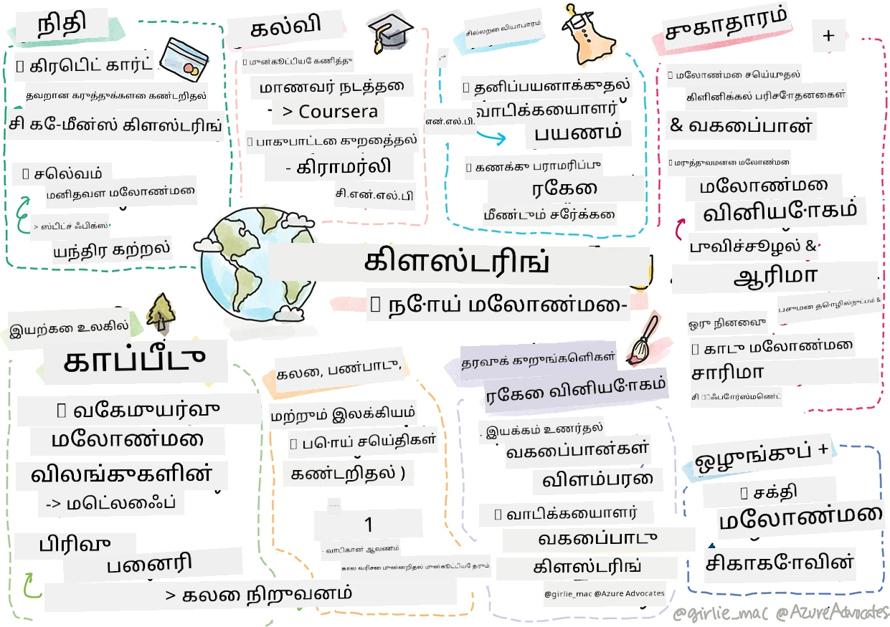

<!--
CO_OP_TRANSLATOR_METADATA:
{
  "original_hash": "83320d6b6994909e35d830cebf214039",
  "translation_date": "2025-10-11T11:49:19+00:00",
  "source_file": "9-Real-World/1-Applications/README.md",
  "language_code": "ta"
}
-->
# Postscript: இயல்புநிலை உலகில் இயந்திரக் கற்றல்

> Sketchnote: [Tomomi Imura](https://www.twitter.com/girlie_mac) உருவாக்கியது

இந்த பாடத்திட்டத்தில், தரவுகளை பயிற்சிக்கத் தயார்படுத்தவும், இயந்திரக் கற்றல் மாதிரிகளை உருவாக்கவும் பல வழிகளை நீங்கள் கற்றுக்கொண்டீர்கள். நீங்கள் பாரம்பரிய ரிக்ரஷன், கிளஸ்டரிங், வகைப்படுத்தல், இயற்கை மொழி செயலாக்கம் மற்றும் நேரம் வரிசை மாதிரிகளை உருவாக்கினீர்கள். வாழ்த்துக்கள்! இப்போது, இதற்கெல்லாம் என்ன பயன் என்று நீங்கள் கேட்கலாம்... இந்த மாதிரிகளின் இயல்புநிலை பயன்பாடுகள் என்ன?

தொழில்துறையில் AI மீது அதிக ஆர்வம் காணப்படுகிறது, இது பொதுவாக ஆழமான கற்றலை பயன்படுத்துகிறது. இருப்பினும், பாரம்பரிய இயந்திரக் கற்றல் மாதிரிகளுக்கு fortfarande மதிப்புள்ள பயன்பாடுகள் உள்ளன. இன்றே நீங்கள் சிலவற்றைப் பயன்படுத்தக்கூடும்! இந்த பாடத்தில், எட்டு வெவ்வேறு தொழில்துறைகள் மற்றும் பொருள்-துறை பகுதிகள் இந்த மாதிரிகளை எவ்வாறு பயன்படுத்தி தங்கள் பயன்பாடுகளை மேலும் செயல்திறன், நம்பகத்தன்மை, புத்திசாலித்தனம் மற்றும் பயனாளர்களுக்கு மதிப்புமிக்கதாக மாற்றுகின்றன என்பதை நீங்கள் ஆராய்வீர்கள்.

## [பாடத்துக்கு முன் வினாடி வினா](https://ff-quizzes.netlify.app/en/ml/)

## 💰 நிதி

நிதி துறை இயந்திரக் கற்றலுக்கு பல வாய்ப்புகளை வழங்குகிறது. இந்த துறையில் உள்ள பல பிரச்சினைகள் ML பயன்படுத்தி மாதிரி அமைக்கவும் தீர்க்கவும் ஏற்றதாக உள்ளன.

### கிரெடிட் கார்டு மோசடி கண்டறிதல்

நாம் [k-means clustering](../../5-Clustering/2-K-Means/README.md) பற்றி முன்பே கற்றுக்கொண்டோம், ஆனால் இது கிரெடிட் கார்டு மோசடிகளுடன் தொடர்புடைய பிரச்சினைகளை எவ்வாறு தீர்க்க உதவுகிறது?

k-means clustering கிரெடிட் கார்டு மோசடி கண்டறிதல் தொழில்நுட்பத்தில் **outlier detection** எனப்படும் முறையில் உதவுகிறது. Outliers, அல்லது தரவின் ஒரு தொகுப்பைப் பற்றிய கவனிப்புகளில் உள்ள மாற்றங்கள், கிரெடிட் கார்டு சாதாரணமாக பயன்படுத்தப்படுகிறதா அல்லது ஏதோ விசித்திரமானது நடக்கிறதா என்பதை எங்களுக்குத் தெரிவிக்க முடியும். கீழே இணைக்கப்பட்டுள்ள ஆய்வுக் கட்டுரையில், k-means clustering algorithm பயன்படுத்தி கிரெடிட் கார்டு தரவுகளை வரிசைப்படுத்தி, ஒவ்வொரு பரிவர்த்தனையையும் அது எவ்வளவு outlier ஆக தோன்றுகிறது என்பதை அடிப்படையாகக் கொண்டு ஒரு கிளஸ்டருக்கு ஒதுக்கலாம். பின்னர், மோசடிகள் மற்றும் சட்டபூர்வமான பரிவர்த்தனைகளுக்கான மிக ஆபத்தான கிளஸ்டர்களை மதிப்பீடு செய்யலாம்.
[Reference](https://citeseerx.ist.psu.edu/viewdoc/download?doi=10.1.1.680.1195&rep=rep1&type=pdf)

### செல்வ மேலாண்மை

செல்வ மேலாண்மையில், ஒரு தனிநபர் அல்லது நிறுவனம் தங்கள் வாடிக்கையாளர்களின் சார்பில் முதலீடுகளை நிர்வகிக்கிறது. அவர்களின் வேலை நீண்ட காலத்தில் செல்வத்தை நிலைநிறுத்தவும் வளர்த்தெடுக்கவும் ஆகும், எனவே நல்ல செயல்திறன் கொண்ட முதலீடுகளைத் தேர்ந்தெடுப்பது அவசியம்.

ஒரு குறிப்பிட்ட முதலீடு எவ்வாறு செயல்படுகிறது என்பதை மதிப்பீடு செய்யும் ஒரு வழி புள்ளியியல் ரிக்ரஷன் மூலம். [Linear regression](../../2-Regression/1-Tools/README.md) ஒரு நிதி ஒரு குறிப்பிட்ட அளவீட்டுடன் ஒப்பிடும்போது எப்படி செயல்படுகிறது என்பதைப் புரிந்துகொள்ள ஒரு மதிப்புமிக்க கருவியாகும். மேலும், ரிக்ரஷனின் முடிவுகள் புள்ளியியல் ரீதியாக முக்கியத்துவம் வாய்ந்ததா அல்லது அவை வாடிக்கையாளரின் முதலீடுகளை எவ்வளவு பாதிக்குமென்று நாம் அறியலாம். கூடுதலாக, பல ரிக்ரஷன் பயன்படுத்தி உங்கள் பகுப்பாய்வை விரிவாக்கலாம், இதில் கூடுதல் ஆபத்து காரகங்களை கணக்கில் கொள்ளலாம். இது ஒரு குறிப்பிட்ட நிதிக்கு எவ்வாறு வேலை செய்யும் என்பதைப் பற்றிய உதாரணத்திற்காக, ரிக்ரஷன் பயன்படுத்தி நிதி செயல்திறனை மதிப்பீடு செய்வதற்கான கட்டுரையை கீழே பார்க்கவும்.
[Reference](http://www.brightwoodventures.com/evaluating-fund-performance-using-regression/)

## 🎓 கல்வி

கல்வித் துறையும் ML பயன்படுத்தக்கூடிய ஒரு மிகவும் சுவாரஸ்யமான பகுதி. தேர்வுகள் அல்லது கட்டுரைகளில் மோசடி கண்டறிதல் அல்லது திருத்த செயல்முறையில் உள்ள bias (தவறான அல்லது நோக்கமற்ற) போன்ற சுவாரஸ்யமான பிரச்சினைகளைத் தீர்க்கலாம்.

### மாணவர்களின் நடத்தை கணிக்க

[Coursera](https://coursera.com), ஒரு ஆன்லைன் திறந்த பாடநெறி வழங்குநர், பல பொறியியல் முடிவுகளை விவரிக்கும் ஒரு சிறந்த தொழில்நுட்ப வலைப்பதிவைக் கொண்டுள்ளது. இந்த வழக்குக் கற்றலில், அவர்கள் ஒரு regression line வரைந்து, குறைந்த NPS (Net Promoter Score) மதிப்பீடு மற்றும் பாடநெறி தக்கவைத்தல் அல்லது விலகல் இடையே எந்த தொடர்பும் உள்ளதா என்பதை ஆராய முயற்சித்தனர்.
[Reference](https://medium.com/coursera-engineering/controlled-regression-quantifying-the-impact-of-course-quality-on-learner-retention-31f956bd592a)

### bias குறைப்பது

[Grammarly](https://grammarly.com), எழுத்து உதவியாளர், எழுத்துப் பிழைகள் மற்றும் இலக்கண பிழைகளை சரிபார்க்கிறது, அதன் தயாரிப்புகளில் நவீன [இயற்கை மொழி செயலாக்க அமைப்புகளை](../../6-NLP/README.md) பயன்படுத்துகிறது. அவர்கள் தங்கள் தொழில்நுட்ப வலைப்பதிவில், ML இல் பாலின bias ஐ எவ்வாறு கையாளுகிறார்கள் என்பதைப் பற்றிய ஒரு சுவாரஸ்யமான வழக்குக் கற்றலை வெளியிட்டனர், இது எங்கள் [நீதி அறிமுக பாடத்தில்](../../1-Introduction/3-fairness/README.md) நீங்கள் கற்றுக்கொண்டீர்கள்.
[Reference](https://www.grammarly.com/blog/engineering/mitigating-gender-bias-in-autocorrect/)

## 👜 சில்லறை வணிகம்

சில்லறை வணிகத் துறை ML பயன்படுத்துவதில் நிச்சயமாக பல நன்மைகளைப் பெற முடியும், இது வாடிக்கையாளர் பயணத்தை மேம்படுத்துவதிலிருந்து சரக்கு கையிருப்பை சிறந்த முறையில் நிர்வகிப்பதற்கு வரை.

### வாடிக்கையாளர் பயணத்தை தனிப்பயனாக்குதல்

Wayfair, mööbel போன்ற வீட்டுப் பொருட்களை விற்கும் நிறுவனம், வாடிக்கையாளர்களுக்கு தங்கள் சுவை மற்றும் தேவைகளுக்கு பொருந்தக்கூடிய பொருட்களை கண்டுபிடிக்க உதவுவது மிகவும் முக்கியம். இந்த கட்டுரையில், நிறுவனத்தின் பொறியாளர்கள் ML மற்றும் NLP பயன்படுத்தி "வாடிக்கையாளர்களுக்கு சரியான முடிவுகளை வெளிப்படுத்த" எவ்வாறு உதவுகிறார்கள் என்பதை விவரிக்கிறார்கள். குறிப்பாக, அவர்களின் Query Intent Engine வாடிக்கையாளர் விமர்சனங்களில் entity extraction, classifier training, asset மற்றும் opinion extraction மற்றும் sentiment tagging ஆகியவற்றைப் பயன்படுத்தி உருவாக்கப்பட்டுள்ளது. இது ஆன்லைன் சில்லறை வணிகத்தில் NLP எவ்வாறு வேலை செய்கிறது என்பதற்கான பாரம்பரிய பயன்பாட்டின் ஒரு உதாரணமாகும்.
[Reference](https://www.aboutwayfair.com/tech-innovation/how-we-use-machine-learning-and-natural-language-processing-to-empower-search)

### சரக்கு நிர்வாகம்

[StitchFix](https://stitchfix.com) போன்ற புதுமையான, துரிதமான நிறுவனங்கள், நுகர்வோருக்கு ஆடை அனுப்பும் ஒரு பெட்டி சேவை, பரிந்துரைகள் மற்றும் சரக்கு நிர்வாகத்திற்காக ML மீது மிகவும் நம்பிக்கை வைக்கின்றன. அவர்களின் ஸ்டைலிங் குழுக்கள் மற்றும் வணிகக் குழுக்கள் இணைந்து வேலை செய்கின்றன: "எங்கள் தரவுத் விஞ்ஞானிகளில் ஒருவர் ஒரு genetic algorithm ஐ tinkering செய்து, அது இன்று இல்லை ஆனால் வெற்றிகரமான ஆடை துண்டு என்னவாக இருக்கும் என்பதை கணிக்க ஆடைக்கு பயன்படுத்தினார். அதை வணிகக் குழுவிற்கு கொண்டு வந்தோம், இப்போது அவர்கள் அதை ஒரு கருவியாகப் பயன்படுத்தலாம்."
[Reference](https://www.zdnet.com/article/how-stitch-fix-uses-machine-learning-to-master-the-science-of-styling/)

## 🏥 சுகாதார பராமரிப்பு

சுகாதார பராமரிப்பு துறை ஆராய்ச்சி பணிகளை மேலும் செயல்திறனாகவும், logistic பிரச்சினைகளை (மீண்டும் நோயாளிகளை அனுமதித்தல் அல்லது நோய்களை பரவாமல் தடுக்குதல் போன்றவை) மேலும் சிறப்பாகவும் மாற்ற ML ஐ பயன்படுத்தலாம்.

### மருத்துவ பரிசோதனைகளை நிர்வகித்தல்

மருந்து தயாரிப்பாளர்களுக்கு மருத்துவ பரிசோதனைகளில் toxicity ஒரு முக்கிய கவலை. எவ்வளவு toxicity ஏற்றுக்கொள்ளக்கூடியது? இந்த ஆய்வில், பல மருத்துவ பரிசோதனை முறைகளை பகுப்பாய்வு செய்ததில், மருத்துவ பரிசோதனை முடிவுகளின் வாய்ப்புகளை கணிக்க ஒரு புதிய அணுகுமுறை உருவாக்கப்பட்டது. குறிப்பாக, அவர்கள் random forest பயன்படுத்தி [classifier](../../4-Classification/README.md) உருவாக்க முடிந்தது, இது மருந்துகளின் குழுக்களை வேறுபடுத்த முடியும்.
[Reference](https://www.sciencedirect.com/science/article/pii/S2451945616302914)

### மருத்துவமனை மீண்டும் அனுமதி நிர்வாகம்

மருத்துவமனை பராமரிப்பு செலவானது, குறிப்பாக நோயாளிகள் மீண்டும் அனுமதிக்கப்பட வேண்டியபோது. இந்த ஆய்வு ஒரு நிறுவனம் [clustering](../../5-Clustering/README.md) algorithm பயன்படுத்தி மீண்டும் அனுமதிக்கப்பட வேண்டிய சாத்தியத்தை கணிக்க ML ஐ எவ்வாறு பயன்படுத்துகிறது என்பதை விவரிக்கிறது. இந்த கிளஸ்டர்கள் "மீண்டும் அனுமதிக்கப்பட வேண்டிய குழுக்களை கண்டறிய உதவுகின்றன, அவை ஒரு பொதுவான காரணத்தைப் பகிர்ந்து கொள்ளக்கூடும்."
[Reference](https://healthmanagement.org/c/healthmanagement/issuearticle/hospital-readmissions-and-machine-learning)

### நோய் மேலாண்மை

சமீபத்திய தொற்றுநோய் ML நோய்களை பரவாமல் தடுக்க உதவக்கூடிய வழிகளை வெளிச்சமிட்டுள்ளது. இந்த கட்டுரையில், ARIMA, logistic curves, linear regression மற்றும் SARIMA ஆகியவற்றின் பயன்பாட்டை நீங்கள் அடையாளம் காணலாம். "இந்த வேலை இந்த வைரஸின் பரவல் விகிதத்தை கணக்கிடவும், அதனால் மரணங்கள், மீட்பு மற்றும் உறுதிப்படுத்தப்பட்ட வழக்குகளை கணிக்கவும் முயற்சிக்கிறது, இதனால் நாங்கள் மேலும் தயாராகவும் உயிர்வாழவும் உதவலாம்."
[Reference](https://www.ncbi.nlm.nih.gov/pmc/articles/PMC7979218/)

## 🌲 இயற்கை மற்றும் பசுமை தொழில்நுட்பம்

இயற்கை மற்றும் சூழலியல் பல நுண்ணிய அமைப்புகளை கொண்டுள்ளது, இதில் விலங்குகள் மற்றும் இயற்கையின் இடையிலான தொடர்பு முக்கியமாகிறது. இந்த அமைப்புகளை துல்லியமாக அளவிடவும், ஏதாவது நடக்கும்போது சரியான நடவடிக்கை எடுக்கவும் முக்கியம்.

### காடுகளை நிர்வகித்தல்

நீங்கள் [Reinforcement Learning](../../8-Reinforcement/README.md) பற்றி முன்பே கற்றுக்கொண்டீர்கள். இது இயற்கையில் முறைமைகளை கணிக்க முயற்சிக்கும் போது மிகவும் பயனுள்ளதாக இருக்க முடியும். குறிப்பாக, இது காட்டுத் தீ மற்றும் ஆக்கிரமிப்பு இனங்களின் பரவலைப் போன்ற சூழலியல் பிரச்சினைகளை கண்காணிக்க பயன்படுத்தப்படலாம். கனடாவில், ஒரு ஆராய்ச்சியாளர்கள் குழு Reinforcement Learning பயன்படுத்தி satellite images மூலம் காட்டுத் தீ முறைமைகளை உருவாக்கினர். "spatially spreading process (SSP)" எனப்படும் புதுமையான முறையைப் பயன்படுத்தி, அவர்கள் காட்டுத் தீயை "landscape இல் எந்த cell இல் agent ஆக" கற்பனை செய்தனர். "தீ ஒரு இடத்திலிருந்து எந்த நேரத்திலும் எடுக்கக்கூடிய நடவடிக்கைகளின் தொகுப்பில் வடக்கு, தெற்கு, கிழக்கு அல்லது மேற்கு பரவுதல் அல்லது பரவாமல் இருக்குதல் அடங்கும்.

இந்த அணுகுமுறை வழக்கமான RL அமைப்பை மாற்றுகிறது, ஏனெனில் தொடர்புடைய Markov Decision Process (MDP) உடனடித் தீ பரவலுக்கான முறைமைகள் ஒரு அறியப்பட்ட செயல்பாடு ஆகும்." இந்த குழு பயன்படுத்திய பாரம்பரிய algorithm களைப் பற்றிய மேலும் விவரங்களை கீழே உள்ள இணைப்பில் படிக்கவும்.
[Reference](https://www.frontiersin.org/articles/10.3389/fict.2018.00006/full)

### விலங்குகளின் இயக்கத்தை உணருதல்

ஆழமான கற்றல் விலங்குகளின் இயக்கங்களை காட்சிப்படுத்துவதில் புரட்சியை உருவாக்கியுள்ளதாலும் (நீங்கள் உங்கள் சொந்த [polar bear tracker](https://docs.microsoft.com/learn/modules/build-ml-model-with-azure-stream-analytics/?WT.mc_id=academic-77952-leestott) ஐ இங்கே உருவாக்கலாம்), பாரம்பரிய ML இ still இந்த பணியில் ஒரு இடம் உள்ளது.

கிராம விலங்குகளின் இயக்கங்களை கண்காணிக்க சென்சார்கள் மற்றும் IoT இந்த வகையான காட்சித் செயலாக்கத்தைப் பயன்படுத்துகின்றன, ஆனால் தரவுகளை முன் செயலாக்க அடிப்படையான ML தொழில்நுட்பங்கள் பயனுள்ளதாக உள்ளன. உதாரணமாக, இந்த ஆய்வில், ஆடுகளின் நிலைகள் பல classifier algorithm களைப் பயன்படுத்தி கண்காணிக்கப்பட்டு பகுப்பாய்வு செய்யப்பட்டது. பக்கம் 335 இல் ROC curve ஐ நீங்கள் அடையாளம் காணலாம்.
[Reference](https://druckhaus-hofmann.de/gallery/31-wj-feb-2020.pdf)

### ⚡️ ஆற்றல் மேலாண்மை

நாங்கள் [time series forecasting](../../7-TimeSeries/README.md) பாடங்களில், smart parking meters ஐ supply மற்றும் demand ஐப் புரிந்துகொண்டு ஒரு நகரத்திற்கு வருவாய் உருவாக்க பயன்படுத்தும் கருத்தை எடுத்துக்கொண்டோம். இந்த கட்டுரை smart metering அடிப்படையில், regression மற்றும் time series forecasting இணைந்து, அயர்லாந்தில் எதிர்கால ஆற்றல் பயன்பாட்டை கணிக்க உதவியது என்பதை விரிவாக விவரிக்கிறது.
[Reference](https://www-cdn.knime.com/sites/default/files/inline-images/knime_bigdata_energy_timeseries_whitepaper.pdf)

## 💼 காப்பீடு

காப்பீட்டு துறை ML ஐ பயன்படுத்தி பொருளாதார மற்றும் actuarial மாதிரிகளை உருவாக்கவும், மேம்படுத்தவும் பயன்படுத்துகிறது.

### மாறுபாட்டை நிர்வகித்தல்

MetLife, ஒரு வாழ்க்கை காப்பீட்டு வழங்குநர், தங்கள் பொருளாதார மாதிரிகளில் மாறுபாட்டை எவ்வாறு பகுப்பாய்வு செய்து குறைக்கிறார்கள் என்பதை வெளிப்படையாக விவரிக்கிறது. இந்த கட்டுரையில் binary மற்றும் ordinal classification காட்சிகளை நீங்கள் காணலாம். நீங்கள் forecasting காட்சிகளையும் காணலாம்.
[Reference](https://investments.metlife.com/content/dam/metlifecom/us/investments/insights/research-topics/macro-strategy/pdf/MetLifeInvestmentManagement_MachineLearnedRanking_070920.pdf)

## 🎨 கலை, கலாச்சாரம் மற்றும் இலக்கியம்

கலைகளில், உதாரணமாக பத்திரிகைத் துறையில், பல சுவாரஸ்யமான பிரச்சினைகள் உள்ளன. போலி செய்திகளை கண்டறிதல் ஒரு பெரிய பிரச்சினையாக உள்ளது, இது மக்களின் கருத்தை பாதிக்கவும், ஜனநாயகங்களை சிதைக்கவும் நிரூபிக்கப்பட்டுள்ளது. அருங்காட்சியகங்கள் கூட ML ஐ artifacts க்கு இடையிலான இணைப்புகளை கண்டறிதல் முதல் res
## [பாடத்திற்குப் பிறகு வினாடி வினா](https://ff-quizzes.netlify.app/en/ml/)

## மதிப்பீடு & சுயபடிப்பு

Wayfair தரவியல் அறிவியல் குழு, தங்கள் நிறுவனத்தில் எவ்வாறு இயந்திரக் கற்றலை (ML) பயன்படுத்துகிறார்கள் என்பதை விளக்கும் பல 흥미로운 வீடியோக்களை வழங்கியுள்ளது. [ஒரு பார்வை இடுங்கள்](https://www.youtube.com/channel/UCe2PjkQXqOuwkW1gw6Ameuw/videos)!

## பணிக்கூற்று

[ML தேடல் வேட்டை](assignment.md)

---

**குறிப்பு**:  
இந்த ஆவணம் [Co-op Translator](https://github.com/Azure/co-op-translator) என்ற AI மொழிபெயர்ப்பு சேவையைப் பயன்படுத்தி மொழிபெயர்க்கப்பட்டுள்ளது. நாங்கள் துல்லியத்திற்காக முயற்சிக்கின்றோம், ஆனால் தானியங்கி மொழிபெயர்ப்புகளில் பிழைகள் அல்லது தவறான தகவல்கள் இருக்கக்கூடும் என்பதை தயவுசெய்து கவனத்தில் கொள்ளுங்கள். அதன் தாய்மொழியில் உள்ள மூல ஆவணம் அதிகாரப்பூர்வ ஆதாரமாக கருதப்பட வேண்டும். முக்கியமான தகவல்களுக்கு, தொழில்முறை மனித மொழிபெயர்ப்பு பரிந்துரைக்கப்படுகிறது. இந்த மொழிபெயர்ப்பைப் பயன்படுத்துவதால் ஏற்படும் எந்த தவறான புரிதல்கள் அல்லது தவறான விளக்கங்களுக்கு நாங்கள் பொறுப்பல்ல.