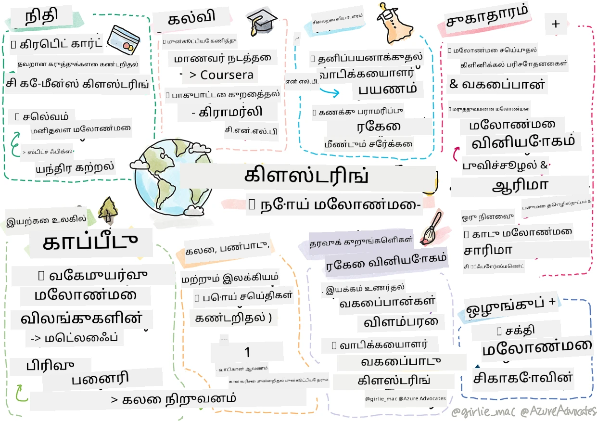

# பின்னூட்டம்: இயந்திரக் கல்வி நிஜ உலகில்

> ஸ்கெட்ச்நோட் [Tomomi Imura](https://www.twitter.com/girlie_mac) என்பவரால்

இந்த பாடத்திட்டத்தில், நீங்கள் பயிற்சிக்காக தரவைத் தயார் செய்வதற்கும் இயந்திரக் கல்வி மாதிரிகளை உருவாக்குவதற்குமான பல வழிகளை கற்றுக்கொண்டீர்கள். நீங்கள் ஒரு தொடர் பாரம்பரிய வினைத்திறன், தொகுப்பு, வகைப்படுத்தல், இயற்கை மொழி செயலாக்கம் மற்றும் கால வரிசை மாதிரிகளை உருவாக்கி உள்ளீர்கள். வாழ்த்துகள்! இப்போது, இவையென்னைவ அடிக்கடி வினவலாம்... இந்த மாதிரிகளின் நிஜ உலக பயன்பாடுகள் என்ன?

தொழிற்துறையில் பெரும்பாலும் ஆழ்ந்த கற்றலை பயன்படுத்துகின்ற AIக்கு பெரும் ஆர்வம் இருந்தாலும், பாரம்பரிய இயந்திரக் கல்வி மாதிரிகளுக்கும் இன்னும் மதிப்புமிக்க பயன்பாடுகள் உள்ளன. நீங்கள் இன்று கூட சிலவற்றை பயன்படுத்தி இருப்பீர்கள்! இந்த பாடத்தில், எட்டுப்பிரிவுகள் மற்றும் தலைமைத் துறை துறைகள் இவை மாதிரிகள் பயன்படுத்தப்படுவதால் அவற்றின் பயன்பாடுகள் மேலும் திறமையானது, நம்பகமானது, அறிவார்ந்தது மற்றும் பயனர்களுக்கு பெருமளவு மதிப்புள்ளவையாகக்கூடிய விதம் ஆராய்பீர்கள்.

## [முன்-பாடத்திட்டத் தேர்வு](https://ff-quizzes.netlify.app/en/ml/)

## 💰 நிதி

நிதி துறையில் இயந்திரக் கல்விக்கான பல வாய்ப்புகள் உள்ளன. இந்த பகுதியின் பல பிரச்சனைகள் இயந்திரக் கல்வி பயன்படுத்தி மாதிரிகள் செய்து தீர்க்கக்கூடியவை.

### கடன் அட்டை மோசடி கண்டறிதல்

நாங்கள் பாடத்தில் முன்பு [k-மீன்ஸ் தொகுப்பு](../../5-Clustering/2-K-Means/README.md) பற்றி கற்றோம், ஆனால் கடன் அட்டை மோசடியுடன் தொடர்புடைய பிரச்சனைகளை இதைப் பயன்படுத்தி எப்படி தீர்க்கலாம்?

k-மீன்ஸ் தொகுப்பு, கடன் அட்டை மோசடி கண்டறிதலில் பயன்படுத்தப்படும் **வெளிப்படையான கண்டறிதல்** முறையில் உதவுகிறது. ஒரு தரவு தொகுப்பின் குறிப்புகள் சார்ந்த அசாதாரணங்கள் (அதாவது வெளிப்படைகள்) கடன் அட்டை சாதாரணமாக பயன்படுத்தப்படுகிறதா அல்லது ஏதேனும் விதமாக மாறுகிறதா என்று சொல்லாமல் இருக்காது. கீழுள்ள கட்டுரையில் காட்டப்பட்டுள்ளபடி, கடன் அட்டை தரவை k-மீன்ஸ் தொகுப்பு ஆல்காரிதம் மூலம் வகைப்படுத்தி ஒவ்வொரு பரிவர்த்தனையையும் வெளிப்படையாக இருக்கிற அளவுக்கு பொறுத்து ஒரு தொகுப்பிற்கு நியமிக்கலாம். பின்னர், மோசடி மற்றும் சட்டபூர்வ பரிவர்த்தனைகளுக்கு மிக ஆபத்தான தொகுப்புகளை மதிப்பீடு செய்யலாம்.
[குறிப்பு](https://citeseerx.ist.psu.edu/viewdoc/download?doi=10.1.1.680.1195&rep=rep1&type=pdf)

### பணச் செயல்பாட்டு மேலாண்மை

பணச் செயல்பாட்டு மேலாண்மையில், ஒரு தனிநபர் அல்லது நிறுவனம் உளம் வாடிக்கையாளர்களின் பங்குகளை கையாள்கிறது. அவர்கள் பணத்தை நீண்டு வளர்த்துக் கொள்ள வேண்டியது அவசியம், ஆகையால் நன்கு செயல்படும் பங்குகளைத் தேர்ந்தெடுக்க வேண்டும்.

ஒரு குறிப்பிட்ட பங்கு எப்படி செயல்படுகிறது என்பதை மதிப்பிடுவதற்கான ஒரு வழி புள்ளியியல் வினைத்திறன். [ரேகை வினைத்திறன்](../../2-Regression/1-Tools/README.md) ஒரு நன்கு பயனுள்ள கருவி ஆகும், குறிப்பிட்ட பங்கு சில வழிகாட்டிகளுடன் எவ்வாறு செயல்படுகிறது என்பதை விளக்க. அதன் கண்ணோட்டத்தில் உள்ள பெறுபேறுகள் புள்ளியியலால் முக்கியமா இல்லையா என்பதையும், வாடிக்கையாளரின் முதலீடுகளுக்கு எவ்வளவு தாக்கம் விளைவிக்கும் என்பதையும் கருத்தில் கொள்ளலாம். மேலும் இது மேலதிகக் காரணிகளையும் எடுத்துக் கொண்டு பல வினைத்திறனை பயன்படுத்தி பகுப்பாய்வை விரிவாக்குவீர்கள். ஒரு சில பங்கு செயல்பாட்டை மதிப்பிடும் கீழ்காணும் கட்டுரையை காணவும்.
[குறிப்பு](http://www.brightwoodventures.com/evaluating-fund-performance-using-regression/)

## 🎓 கல்வி

கல்வி துறையும் இயந்திரக் கல்வி பயன்பாட்டிற்கு மிகவும் சுவாரஸ்யமான பகுதியாகும். தேர்வுகளில் மோசடி கண்டறிதல் அல்லது திருத்துநிலை தேர்வுகளில் அனுபவங்கள் உள்ள சில உறுதிப்பத்திர பிரச்சனைகள் போன்றவை கூர்ந்து அறியப்பட வேண்டியவை.

### மாணவர் நடத்தை எதிர்பார்ப்பு

ஆன்லைன் திறந்த பாடக் கோர்ஸ் வழங்குநர் [Coursera](https://coursera.com), ஒன்று தொழில்நுட்ப வலைப்பதிவில் பல பொறியியல் முடிவுகளின் விவரங்களை பகிர்கிறது. இக்கேஸ்ஸ்டடியில், நெடுங்கோட்டை சார்பு (Regression) கோடுவரிசை வரைதியாக குறைந்த NPS மதிப்பும் பாடத்திட்டத் துவக்கப்படுத்தல் அல்லது விட்டுவிடும் காரியத்துடனான தொடர்பை ஆராய்ந்தனர்.
[குறிப்பு](https://medium.com/coursera-engineering/controlled-regression-quantifying-the-impact-of-course-quality-on-learner-retention-31f956bd592a)

### பாகுபாட்டை குறைத்தல்

எழுத்துப் பெருக்கி [Grammarly](https://grammarly.com) அதன் முக்கிய தயாரிப்புகளில் நுட்பமான [இயற்கை மொழி செயலாக்கக் கணினிகள்](../../6-NLP/README.md) பயன்படுத்துகிறது. அவர்கள் தொழில்நுட்ப வலைப்பதிவில் இயந்திரக் கல்வியில் பாலின பாகுபாட்டை எப்படி கடந்தனர் என்பதைப் பற்றிய சுவாரஸ்யமான வழக்குக் கணக்கை இடையே வெளியிட்டனர், இது நமது [நியாயமான தன்மையே உரையாடல்](../../1-Introduction/3-fairness/README.md) பாடத்தில் கற்றிருந்தீர்கள்.
[குறிப்பு](https://www.grammarly.com/blog/engineering/mitigating-gender-bias-in-autocorrect/)

## 👜 சில்லறை வணிகம்

சில்லறை வணிக துறையும் இயந்திரக் கல்வியின் உதவியில் பல பயன்பாடுகள் பெறுகிறது, உதாரணத்திற்கு சிறந்த வாடிக்கையாளர் பயணம் உருவாக்குதல் முதல் சரக்கு வைப்புக்கு அச்சரியமாக நிர்வாகம் செய்வதுவே உண்டு.

### வாடிக்கையாளர் பயண தனிப்பயன் செய்யல்

Wayfair என்ற வீட்டு பொருட்களை விற்பனை செய்தும் நிறுவனம் வாடிக்கையாளர்களுக்கு அவர்களது விருப்பத்திற்கும் தேவைகளுக்கும் ஏற்ப பொருட்களை கண்டுபிடிக்க உதவுவதை முன்னுரிமையாகக் கொண்டு செயல்படுகிறது. இக்கட்டுரையில், நிறுவன பொறியியர்கள் எப்படி இயந்திரக் கல்வி மற்றும் இயற்கை மொழி செயலாக்கத்தை பயன்படுத்தி "வாடிக்கையாளர்களுக்கு சரியான முடிவுகளை தருகிறார்கள்" என்பதை விவரிக்கிறார்கள். குறிப்பாக, அவர்களது கேள்வி நோக்கம் இயந்திரம் உரைத் தொடர்பாளர் அடிப்படையில் அமைக்கப்பட்டுள்ளது, இது ஒன்றாக புலன் எடுக்கும், வகைப்பாடு பயிற்சி, சொத்து மற்றும் கருத்துகள் எடுக்கும் மற்றும் வாடிக்கையாளர் விமர்சனங்களில் உணர்ச்சிப் பிரிவினை குறிக்கிறது. இது ஆன்லைன் சில்லறை வணிகத்தில் இயற்கை மொழி செயலாக்கத்தின் பாரம்பரிய பயன்பாடு ஆகும்.
[குறிப்பு](https://www.aboutwayfair.com/tech-innovation/how-we-use-machine-learning-and-natural-language-processing-to-empower-search)

### சரக்கு நிர்வாகம்

உடன்படா [StitchFix](https://stitchfix.com) போன்ற முன்னேற்றமான, விரைவான நிறுவனங்கள், பெரிய அளவில் பரிந்துரைகள் மற்றும் சரக்கு நிர்வாகத்திற்காக இயந்திரக் கல்வி heavily சார்ந்துள்ளன. அவர்கள் ஸ்டைலிங் அணி வணிக அணியுடன் சேர்ந்து பணியாற்றுகின்றனர்: "எங்கள் தரவு விஞ்ஞானிகளுள் ஒருவர் மரபணு ஆல்காரிதமுடன் கோடுமைகளை குத்திக் கொண்டு அதை தாராளமாக பயன்பாட்டிற்கு கொண்டு வந்தார், இது இன்றைய இல்லை என்றெண்ணப்படும் வெற்றிகரமான ஒரு அணிகலன் ஆகும். இதனை வணிக அணிக்கு வழங்கினோம் மற்றும் இப்போது அவர்கள் அதை கருவியாக பயன்படுத்த முடிகிறது."
[குறிப்பு](https://www.zdnet.com/article/how-stitch-fix-uses-machine-learning-to-master-the-science-of-styling/)

## 🏥 சுகாதாரம்

சுகாதாரத் துறையிலும் ஆய்வுக் பணிகள் மற்றும் மீண்டும் சேர்க்கப்படும் நோயாளிகள், நோய்கள் பரவுவதைத் தடுக்கும் போன்ற தீர்வுகள் போன்றவற்றைப் பயன்படுத்திக் கொள்ள இயந்திரக் கல்வி பயன்படும்.

### மருத்துவ சோதனை மேலாண்மை

மருத்துவ சோதனைகளில் நச்சுக்களம் மருந்து தயாரிப்பாளர்களுக்கு பெரிய கவலை. எவ்வளவு நச்சுத்தன்மை நிலைத்திருக்க வேண்டும்? இந்த ஆய்வில், பல்வேறு மருத்துவ சோதனை முறைகளை பகுப்பாய்வு செய்தபடி புதிய முறையை உருவாக்கி சோதனை முடிவுகளை எதிர்பார்க்க முடிந்தது. குறிப்பாக, அவர்கள் ஸாதாரண காடும் [வகைப்படுத்துகை](../../4-Classification/README.md) உருவாக்குவதற்கு ராண்டம் ஃபாரெஸ்ட் பயன்படுத்தினர், இது மருந்துத் தொகுதிகளுக்கு இடையில் வேறுபாட்டைக் காண்கிறது.
[குறிப்பு](https://www.sciencedirect.com/science/article/pii/S2451945616302914)

### மருத்துவமனை மீண்டும் சேர்க்கை மேலாண்மை

மருத்துவமனை பராமரிப்பு செலவுத்தெரிகிறது, குறிப்பாக நோயாளிகள் மீண்டும் சேர்க்கப்படும்போது. இந்த கட்டுரை ஒரு நிறுவனமானது எப்படி [தொகுப்பு](../../5-Clustering/README.md) ஆல்காரிதங்களைப் பயன்படுத்தி மீண்டும் சேர்க்கை சாத்தியத்தை முன்கூட்டியே கணிக்கிறது என்பதை ஆராய்கிறது. இவை "பகிரப்பட்ட காரணங்களை பகிர்ந்த கொள்ளக்கூடிய மீண்டும் சேர்க்கை குழுக்களை கண்டறிய" உதவுகின்றன.
[குறிப்பு](https://healthmanagement.org/c/healthmanagement/issuearticle/hospital-readmissions-and-machine-learning)

### நோய் மேலாண்மை

சமீபத்திய பரவலான பான்டமிக் இயந்திரக் கல்வி நோய் பரப்பை நிறுத்துவதில் உதவும் விதத்தை வெளிப்படுத்தியுள்ளது. இதில், ARIMA, Logistic வரிகளும், நேரியல் வினைத்திறனும், SARIMA ஆகியவை அடங்கும். "இந்த பணியால் இந்த வைரஸ் பரவுவின் வீதத்தை கணக்கிட்டு இறப்புகள், குணமடையும் விகிதங்கள் மற்றும் உறுதிப்படுத்தப்பட்ட நோயாளிகள் எண்ணிக்கையை முன்னோக்கி கணிக்க முடிகிறது ஆகையால் சிறப்பாகத் தயாராகித் தவிர்க்க உதவும்."
[குறிப்பு](https://www.ncbi.nlm.nih.gov/pmc/articles/PMC7979218/)

## 🌲 இயற்கை மற்றும் பச்சைப் தொழில்நுட்பம்

இயற்கையும் சுற்றுச்சூழலையும் பல நுணுக்கமான அமைப்புகளை கொண்டுள்ளது, உயிரினங்களும் இயற்கையின் தொடர்பும் முக்கிய பங்கு வகிக்கின்றன. இக்குழப்பங்களை சரியான முறை அளவிடுவது அவசியம் மற்றும் காடு கேளிக்கை அல்லது உயிரினக் கூட்டம் குறைவதுபோன்ற ஒன்று ஏற்பட்டால் சரியான செயல்பாடு வேண்டும்.

### காடு மேலாண்மை

நீங்கள் முந்தைய பாடங்களில் [புதுக்கூறு கற்றல்](../../8-Reinforcement/README.md) பற்றி கற்றீர்கள். இயற்கை அமைப்புகளை எதிர்பார்க்க இது மிகவும் உதவுகிறது. குறிப்பாக, காடுகளின் தீ விபத்தினையும் நுகர்ந்த கிழங்குகளின் பரவலையும் கண்காணிக்க பயன்படுத்தப்படுகிறது. கனடாவில், ஒரு குழுக் ஆராய்ச்சியாளர்கள் ரிமோட் செட்டிலைக் காட்சிகளிலிருந்து காடுதீ விபத்து இயக்கத் துறையைக் கட்டியமைக்க புதுக்கூறு கற்றலை பயன்படுத்தினர். "பரப்பியலுக்கு இடையில் இடங்கள் ஒன்றிலிருந்து தீ பரவுவதற்கான கணிப்பு மற்றும் பிற்கால நகர்வு SSP" என்ற புதிய முறையை அவர்கள் உருவாக்கினர். "காட்டை தீ எதுவும் பரப்பாமல் தங்கு வாய்ப்பும், வடக்கு, தெற்கு, கிழக்கு மற்றும் மேற்கு நோக்கி பரப்புவதை உள்ளடக்கியது."

இந்த முறையில் சாதாரண புதுக்கூறு கற்றலைத் தோற்றமைப்பு மறுவடிவமைக்கப்பட்டுள்ளது ஏனென்றால், Markov தீர்மான செயல்முறை (MDP) இயல்பு தீ விரைவான பரப்புக்கான ஒரு வெளிப்படையான செயல்பாடாகும்." மேலும் இந்த குழு பயன்படுத்திய பாரம்பரிய ஆல்காரிதங்களை கீழ்காணும் இணைப்பில் படிக்கவும்.
[குறிப்பு](https://www.frontiersin.org/articles/10.3389/fict.2018.00006/full)

### உயிரின இயக்கம் உணர்தல்

ஆழ்ந்த கற்றல் உயிரினங்களின் இயக்கத்தை கண்டு பிடிக்கும் துறையில் புரட்சி ஏற்படுத்தியிருந்தாலும் (உதாரணத்திற்கு நீங்களும் [தனது ப polar bear tracker](https://docs.microsoft.com/learn/modules/build-ml-model-with-azure-stream-analytics/?WT.mc_id=academic-77952-leestott) உருவாக்கலாம்), பாரம்பரிய இயந்திரக் கல்விக்கும் இக்கட்டளையில் இடம் உள்ளது.

பண்ணை உயிரின இயக்கங்களை கண்டறியும் கண்காணிப்பு மற்றும் இண்டெர்நெட் ஆஃப் திங்ஸ் (IoT) இந்த பாரம்பரிய மாதிரிகளுக்கு அடிப்படையில் உள்ளது, ஆனால் அடிப்படையான இயந்திரக் கல்வி முறைகள் தரவை முன் செயலாக்குவதற்கு பயன்படுகின்றன. உதாரணமாக, இந்த கட்டுரையில் செட்டில் நிற்கும் ஆடு நிலைகளை கண்காணித்து வகைப்பாட்டு ஆல்காரிதங்களுடன் பகுப்பாய்வு செய்யப்பட்டது. பக்கம் 335ல் உள்ள ROC வளைவு கிடைக்கும்.
[குறிப்பு](https://druckhaus-hofmann.de/gallery/31-wj-feb-2020.pdf)

### ⚡️ சக்தி மேலாண்மை
  
[கால வரிசை முன்கூட்டிச் சுட்டல்](../../7-TimeSeries/README.md) பாடங்களில், ஊர் வருமானத்தை மேம்படுத்த கூர்மையான பார்க்கிங் நோக்கிகள் பற்றிய கருத்தைக் கொண்டோம். இந்த கட்டுரை, சிறந்த பகுதியில் தொகுப்பு, வினைத்திறன் மற்றும் கால வரிசை முன்கூட்டிச் சுட்டல் ஒன்றிணைந்து அயர்லாந்தில் எதிர்கால சக்தி பயன்பாட்டை முன்னறிவிக்க உதவுகிறதென விரிவாக விவரிக்கின்றது.
[குறிப்பு](https://www-cdn.knime.com/sites/default/files/inline-images/knime_bigdata_energy_timeseries_whitepaper.pdf)

## 💼 காப்பீடு

காப்பீட்டு துறையும் இயந்திரக் கல்வியை நிதி மற்றும் பரிசோதனை மாதிரிகளை கட்டமைக்கவும் மேம்படுத்தவும் பயன்படுத்துகிறது.

### нестабильность மேலாண்மை

MetLife, ஒரு வாழ்க்கைக் காப்பீடு வழங்குநர், அவர்கள் நிதி மாதிரிகளில் нестабильность எப்படி பகுப்பாய்வு செய்து குறைக்கின்றனர் என்பதில் தெளிவாக உள்ளனர். இந்த கட்டுரையில் நீங்கள் பைனரி மற்றும் ஒடிகோனல் வகைப்பாட்டின் காட்சியீடுகளை காணலாம். முன்கூட்டியான காட்சியீடுகளையும் உண்டு.
[குறிப்பு](https://investments.metlife.com/content/dam/metlifecom/us/investments/insights/research-topics/macro-strategy/pdf/MetLifeInvestmentManagement_MachineLearnedRanking_070920.pdf)

## 🎨 கலை, பண்பாடு மற்றும் இலக்கியம்

கலைகளில், உதாரணமாக பத்திரிக்கைத் துறையில், பல சுவாரஸ்ய பிரச்சனைகள் உள்ளன. போலி செய்திகளை கண்டறிதல் மிகப்பெரிய பிரச்சனை, ஏனெனில் அது மக்கள் கருத்துக்களை ప్రభావித்து ஜனநாயக அரசின்மையை கூட விளைவிக்க முடிகிறது. அருங்காட்சியகங்களும் அதன் தயாரிப்புகளுக்கு ML பயன்படுத்துவதில் பல உதவிகளை பெற முடியும், போல் பொருட்கள் மற்றும் வள திட்டமிடல் ஆகியவற்றிலும்.

### போலி செய்தி கண்டறிதல்

இன்றைய ஊடகங்களில் போலி செய்தி கண்டறிதல் பூனை மற்றும் எலி விளையாட்டாய் மாறியுள்ளது. இந்த கட்டுரையில், பல ML முறைமைகள் இணைந்த ஒரு முறைமை சோதிக்கப்படலாம் என்றும் சிறந்த மாதிரி வேரியக்கப்படலாம் என்றும் ஆராய்ச்சியாளர்கள் பரிந்துரைக்கின்றனர்: "இந்த முறைமை இயற்கை மொழி செயலாக்கத்தை பயன்படுத்தி தரவிலிருந்து அம்சங்களை எடுத்து பின்னர் ஒரு Naive Bayes, Support Vector Machine (SVM), Random Forest (RF), Stochastic Gradient Descent (SGD), மற்றும் Logistic Regression (LR) போன்ற இயந்திரக் கல்வி வகைப்படுத்திகள் பயிற்சிக்குப் பயன்படுத்தப்படுகிறது."
[குறிப்பு](https://www.irjet.net/archives/V7/i6/IRJET-V7I6688.pdf)

இந்த கட்டுரை, பல ML துறைகளின் பொன்மைகள் இணைந்து போலி செய்திகளை பரவுவதைத் தடக்க மற்றும் உண்மையான சேதங்களை இழக்க உதவ முடியும் என்பதைக் காட்டுகிறது; இதில் COVID சிகிச்சைகள் பற்றிய வதந்திகள் பரவுவதால் எதிர்ப்பு அக்கடைகளை தூண்டும்.

### அருங்காட்சியக இயந்திரக் கல்வி

கலை அருங்காட்சியகங்கள் AI புரட்சியின் முன்றிலிருக்கின்றன, இதில் திரட்டல்களையும் டிஜிட்டல் வடிவமைப்புகளையும் உருவாக்குதல் மற்றும் பொருட்களுக்கு இடையேயான தொடர்புக்களை கண்டுபிடிப்பது மொசமானது ஆகிறது. [In Codice Ratio](https://www.sciencedirect.com/science/article/abs/pii/S0306457321001035#:~:text=1.,studies%20over%20large%20historical%20sources.) போன்ற திட்டங்கள் வசதியற்ற சேமிப்பகங்கள் போன்றவை (வத்திக்கான் ஆவணங்கள்) கிரகித்தல் உதவுகின்றன. ஆனால் அருங்காட்சியகத்தின் வணிகக் கூறும் ML மாதிரிகளால் நன்மை பெறுகிறது.

உதாரணமாக, சிகாகோ கலை நிறுவனம் எந்தவாறு பார்வையாளர்கள் ஆர்வம் காட்டுகிறார்கள் மற்றும் எப்போது கண்காட்சிகளில் கலந்து கொள்வார்கள் என்பதைக் கணிக்க மாதிரிகள் கட்டியது. நோக்கம் ஒவ்வொரு முறை பயனர் அருங்காட்சியகத்தை பார்வையிடும் போதும் தனிப்பயனாக்கப்பட்ட சிறந்த பார்வையாளர் அனுபவங்களை உருவாக்குவதே. "வருட 2017-ல், மாதிரி பங்கு மற்றும் அங்கீகார மதிப்பை 1 சதவீத துல்லியத்தில் கணித்தது என்றும் சிகாகோ கலை நிறுவனத்தின் மூத்த துணைத் தலைவர் Andrew Simnick கூறுகிறார்."
[குறிப்பு](https://www.chicagobusiness.com/article/20180518/ISSUE01/180519840/art-institute-of-chicago-uses-data-to-make-exhibit-choices)

## 🏷 மார்க்கெட்டிங்

### வாடிக்கையாளர் பிரிவினை

மிகவும் விளைவளிக்கும் மார்க்கெட்டிங் திட்டங்கள் வாடிக்கையாளர்களை பல்வேறு குழுக்களாக பாகுபடுத்தும் வழியில் இலக்கு செய்கின்றன. இந்த கட்டுரையில் தொகுப்பு ஆல்காரிதங்கள் மூலம் வேறுபட்ட மார்க்கெட்டிங்கை ஆதரிப்பது விவரிக்கப்படுகிறது. வேறுபடுத்தப்பட்ட மார்க்கெட்டிங் நிறுவனங்களுக்கு பிராண்ட் அறிமுகத்தை மேம்படுத்தவும், அதிக வாடிக்கையாளர்களை அடையவும், அதிக வருமானம் வரட்டும் உதவுகிறது.
[குறிப்பு](https://ai.inqline.com/machine-learning-for-marketing-customer-segmentation/)

## 🚀 சவால்

இந்த பாடத்திட்டத்தில் கற்றுக் கொண்ட சில தொழில்நுட்பங்களைக் பயன்படுத்தி லாபம் பெறும் மற்றொரு துறையை கண்டுபிடித்து, அது இயந்திரக் கல்வியை எப்படி பயன்படுத்துகிறது என்பதை ஆராயவும்.

## [பாடத்துக்குப் பிறகு குறும்படம்](https://ff-quizzes.netlify.app/en/ml/)

## மதிப்பாய்வு மற்றும் சுயபடிப்பு

வேய்பேர் தரவு அறிவியல் குழுவிற்கு அவர்கள் நிறுவனத்தில் எவ்வாறு எம்எல் பயன்படுத்துகிறார்கள் என்பதைக் குறித்த சில சுவாரஸ்யமான காணொளிகள் உள்ளன. [பார்க்கத்](https://www.youtube.com/channel/UCe2PjkQXqOuwkW1gw6Ameuw/videos) அது மதிப்பிடத்திற்குரியது!

## பணிகள்

[ஒரு எம்எல் செங்கட்டிய வேடிக்கை வேட்டை](assignment.md)

---

<!-- CO-OP TRANSLATOR DISCLAIMER START -->
**மறுப்பு**:
இந்த ஆவணம் AI மொழிபெயர்ப்பு சேவை [Co-op Translator](https://github.com/Azure/co-op-translator) பயன்படுத்தி மொழிபெயர்க்கப்பட்டுள்ளது. நாங்கள் துல்லியத்திற்காக முயற்சி செய்துள்ளோம், ஆனால் தானாக செய்யப்படும் மொழிபெயர்ப்புகளில் பிழைகள் அல்லது தவறுகள் இருக்கலாம் என்பதை கவனத்தில் கொள்ளவும். அசல் ஆவணம் அதன் தாய்மொழியில் அதிகாரப்பூர்வ ஆதாரமாக கருதப்பட வேண்டும். முக்கியமான தகவல்களுக்கு, தொழில்நுட்பமான மனித மொழிபெயர்ப்பு பரிந்துரைக்கப்படுகிறது. இந்த மொழிபெயர்ப்பைப் பயன்படுத்துவதால் ஏற்படும் எந்த தவறான புரிதல்கள் அல்லது தவறான விளக்கத்திற்கும் நாங்கள் பொறுப்பில்வில்லை.
<!-- CO-OP TRANSLATOR DISCLAIMER END -->