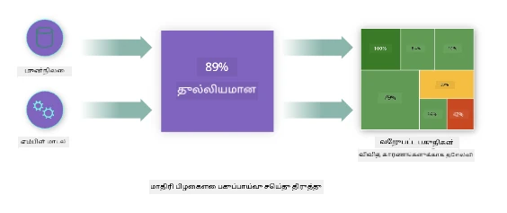
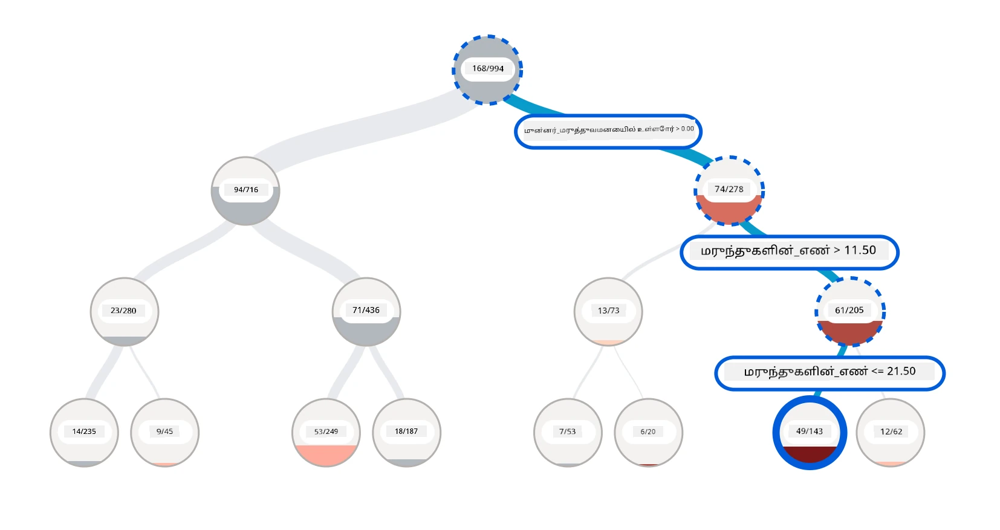
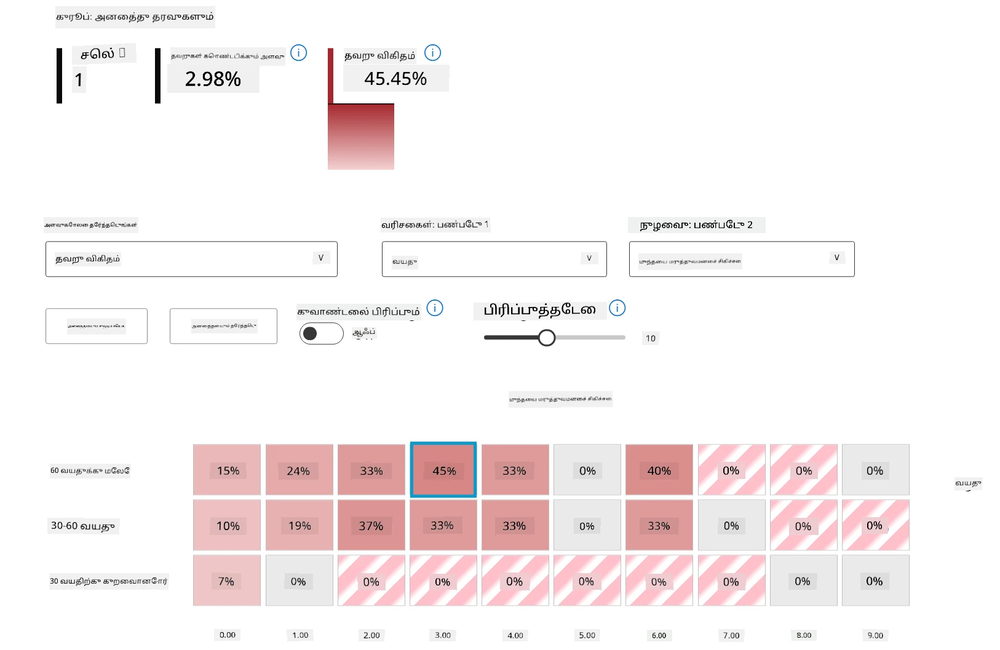
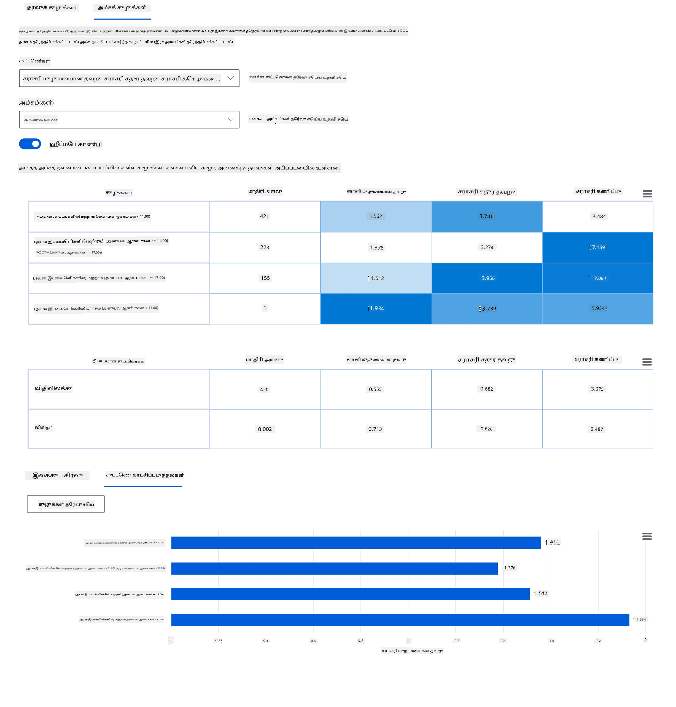
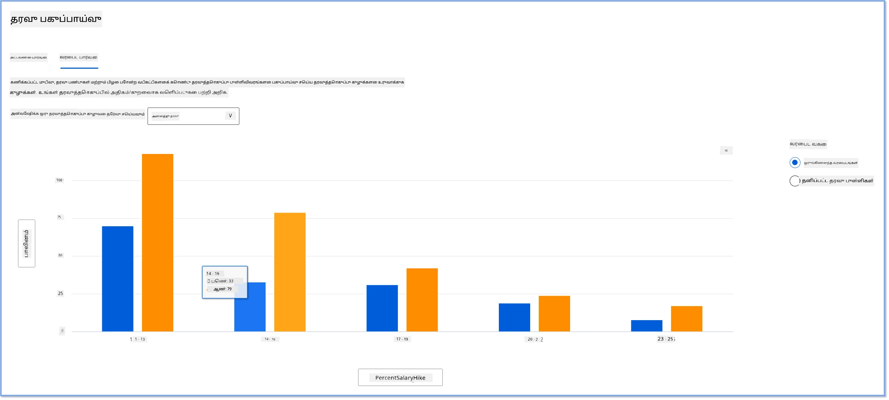

<!--
CO_OP_TRANSLATOR_METADATA:
{
  "original_hash": "df2b538e8fbb3e91cf0419ae2f858675",
  "translation_date": "2025-10-11T11:51:15+00:00",
  "source_file": "9-Real-World/2-Debugging-ML-Models/README.md",
  "language_code": "ta"
}
-->
# பிந்தைய குறிப்புகள்: பொறுப்பான AI டாஷ்போர்டு கூறுகளைப் பயன்படுத்தி இயந்திரக் கற்றல் மாடல் பிழை சரிசெய்தல்

## [முன்-வகுப்பு வினாடி வினா](https://ff-quizzes.netlify.app/en/ml/)

## அறிமுகம்

இயந்திரக் கற்றல் நம் அன்றாட வாழ்க்கையைப் பாதிக்கிறது. AI, நம் தனிப்பட்ட வாழ்க்கையையும் சமூகத்தையும் பாதிக்கும் முக்கியமான அமைப்புகளில், மருத்துவம், நிதி, கல்வி மற்றும் வேலைவாய்ப்பு போன்ற துறைகளில் நுழைந்து வருகிறது. உதாரணமாக, சுகாதார பரிசோதனைகள் அல்லது மோசடிகளை கண்டறிதல் போன்ற தினசரி முடிவெடுக்கும் பணிகளில் அமைப்புகள் மற்றும் மாடல்கள் ஈடுபடுகின்றன. இதனால், AI முன்னேற்றங்கள் மற்றும் அதிவேகமாக ஏற்றுக்கொள்ளப்படுவதற்கு சமூகத்தின் எதிர்பார்ப்புகள் மற்றும் விதிமுறைகள் உருவாகின்றன. AI அமைப்புகள் எதிர்பார்ப்புகளை பூர்த்தி செய்ய முடியாத பகுதிகளை தொடர்ந்து வெளிப்படுத்துகின்றன; புதிய சவால்களை உருவாக்குகின்றன; மற்றும் அரசாங்கங்கள் AI தீர்வுகளை ஒழுங்குபடுத்தத் தொடங்குகின்றன. எனவே, இந்த மாடல்கள் அனைவருக்கும் நியாயமான, நம்பகமான, உள்ளடக்கிய, வெளிப்படையான மற்றும் பொறுப்பான முடிவுகளை வழங்குவதற்காக ஆய்வு செய்யப்படுவது முக்கியம்.

இந்த பாடத்திட்டத்தில், ஒரு மாடலில் பொறுப்பான AI பிரச்சினைகள் உள்ளதா என்பதை மதிப்பீடு செய்ய பயன்படும் நடைமுறை கருவிகளைப் பார்ப்போம். பாரம்பரிய இயந்திரக் கற்றல் பிழை சரிசெய்தல் நுட்பங்கள் பொதுவாக தொகுத்த கணக்கீடுகள், உதாரணமாக சராசரி துல்லியம் அல்லது சராசரி பிழை இழப்பை அடிப்படையாகக் கொண்டவை. நீங்கள் இந்த மாடல்களை உருவாக்க பயன்படுத்தும் தரவுகளில் சில மக்கள் தொகை, உதாரணமாக இனம், பாலினம், அரசியல் பார்வை, மதம் போன்றவை இல்லாதபோது என்ன நடக்கலாம் என்று கற்பனை செய்யுங்கள். அல்லது மாடலின் வெளியீடு சில மக்கள் தொகைக்கு ஆதரவாக விளக்கப்படும்போது என்ன நடக்கும்? இது இந்த நுணுக்கமான அம்சக் குழுக்களின் அதிக அல்லது குறைவான பிரதிநிதித்துவத்தை அறிமுகப்படுத்தி, மாடலின் நியாயம், உள்ளடக்கம் அல்லது நம்பகத்தன்மை பிரச்சினைகளை உருவாக்கலாம். மேலும், இயந்திரக் கற்றல் மாடல்கள் "கருப்பு பெட்டிகள்" என்று கருதப்படுகின்றன, இது ஒரு மாடலின் கணிப்புகளை என்ன இயக்குகிறது என்பதைப் புரிந்து கொள்ளவும் விளக்கவும் கடினமாக்குகிறது. போதுமான கருவிகள் இல்லாமல் ஒரு மாடலின் நியாயம் அல்லது நம்பகத்தன்மையை சரிசெய்தல் மற்றும் மதிப்பீடு செய்யும் போது, தரவியல் விஞ்ஞானிகள் மற்றும் AI டெவலப்பர்கள் எதிர்கொள்ளும் சவால்கள் இவை.

இந்த பாடத்தில், உங்கள் மாடல்களை பிழை சரிசெய்தல் பற்றி நீங்கள் கற்றுக்கொள்வீர்கள்:

- **பிழை பகுப்பாய்வு**: உங்கள் தரவின் பகிர்மானத்தில் மாடலுக்கு அதிக பிழை விகிதங்கள் உள்ள இடங்களை அடையாளம் காணுங்கள்.
- **மாடல் மேற்பார்வை**: மாடலின் செயல்திறன் அளவுகோள்களில் வேறுபாடுகளை கண்டறிய தரவுக் குழுக்களுக்கிடையே ஒப்பீட்டு பகுப்பாய்வு செய்யுங்கள்.
- **தரவு பகுப்பாய்வு**: உங்கள் தரவின் அதிக அல்லது குறைவான பிரதிநிதித்துவம் எங்கு இருக்கலாம் என்பதை ஆராய்ந்து, உங்கள் மாடல் ஒரு தரவுக் குழுவுக்கு ஆதரவாக சாய்ந்திருக்க வாய்ப்பு உள்ளதா என்பதைப் பாருங்கள்.
- **அம்ச முக்கியத்துவம்**: மாடலின் கணிப்புகளை உலகளாவிய அல்லது உள்ளூர் அளவில் எந்த அம்சங்கள் இயக்குகின்றன என்பதைப் புரிந்து கொள்ளுங்கள்.

## முன்னோட்டம்

முன்னோட்டமாக, [டெவலப்பர்களுக்கான பொறுப்பான AI கருவிகள்](https://www.microsoft.com/ai/ai-lab-responsible-ai-dashboard) மதிப்பீடு செய்யவும்.

> 

## பிழை பகுப்பாய்வு

பாரம்பரிய மாடல் செயல்திறன் அளவுகோள்கள் துல்லியத்தை அளவிட பயன்படுத்தப்படுகின்றன, அவை பெரும்பாலும் சரியான மற்றும் தவறான கணிப்புகளின் அடிப்படையில் கணக்கீடுகள். உதாரணமாக, ஒரு மாடல் 89% துல்லியமாக உள்ளது மற்றும் 0.001 பிழை இழப்புடன் உள்ளது என்று தீர்மானித்தல் நல்ல செயல்திறனாகக் கருதப்படலாம். பிழைகள் உங்கள் அடிப்படை தரவுத்தொகுப்பில் ஒரே மாதிரியான முறையில் பகிரப்படவில்லை. நீங்கள் 89% மாடல் துல்லிய மதிப்பெண் பெறலாம், ஆனால் மாடல் 42% நேரத்தில் தோல்வியடையும் உங்கள் தரவின் பல பகுதிகளை கண்டறியலாம். குறிப்பிட்ட தரவுக் குழுக்களுடன் இந்த தோல்வி முறைமைகளின் விளைவுகள் நியாயம் அல்லது நம்பகத்தன்மை பிரச்சினைகளை உருவாக்கலாம். மாடல் எங்கு நன்றாக செயல்படுகிறது அல்லது இல்லை என்பதைப் புரிந்து கொள்வது அவசியம். உங்கள் மாடலில் அதிக தவறுகள் உள்ள தரவுப் பகுதிகள் முக்கியமான தரவுக் குழுவாக இருக்கலாம்.

RAI டாஷ்போர்டில் உள்ள பிழை பகுப்பாய்வு கூறு மாடல் தோல்வி பல்வேறு குழுக்களுக்கிடையே எவ்வாறு பகிரப்பட்டுள்ளது என்பதை மரக்காட்சி மூலம் விளக்குகிறது. இது உங்கள் தரவுத்தொகுப்பில் அதிக பிழை விகிதம் உள்ள அம்சங்கள் அல்லது பகுதிகளை அடையாளம் காண உதவுகிறது. மாடலின் தவறான கணிப்புகள் எங்கு அதிகமாக உள்ளன என்பதைப் பார்த்து, நீங்கள் அடிப்படை காரணத்தை ஆராயத் தொடங்கலாம். மேலும், தரவுக் குழுக்களை உருவாக்கி அவற்றில் பகுப்பாய்வு செய்யலாம். இந்த தரவுக் குழுக்கள் பிழை சரிசெய்தல் செயல்முறையில் உதவுகின்றன, ஏனெனில் ஒரு குழுவில் மாடல் செயல்திறன் நல்லது, ஆனால் மற்றொன்றில் தவறாக உள்ளது என்பதை தீர்மானிக்க உதவுகின்றன.

மரக்காட்சியில் உள்ள காட்சி குறியீடுகள் பிரச்சினை பகுதிகளை விரைவாக அடையாளம் காண உதவுகின்றன. உதாரணமாக, மரக்கிளை ஒரு ஆழமான சிவப்பு நிறத்துடன் இருந்தால், பிழை விகிதம் அதிகமாக இருக்கும்.

ஹீட் மேப் என்பது மற்றொரு காட்சி செயல்பாடு, இது ஒரு அல்லது இரண்டு அம்சங்களைப் பயன்படுத்தி பிழை விகிதத்தை ஆராய்ந்து, மாடல் பிழைகளுக்கு காரணமாக இருக்கும் அம்சங்களை முழு தரவுத்தொகுப்பில் அல்லது குழுக்களில் கண்டறிய உதவுகிறது.

பிழை பகுப்பாய்வை நீங்கள் பயன்படுத்த வேண்டிய சூழல்கள்:

* மாடல் தோல்விகள் உங்கள் தரவுத்தொகுப்பில் மற்றும் பல உள்ளீடு மற்றும் அம்ச பரிமாணங்களில் எவ்வாறு பகிரப்பட்டுள்ளன என்பதை ஆழமாகப் புரிந்து கொள்ளுங்கள்.
* தொகுத்த செயல்திறன் அளவுகோள்களை உடைத்து, தவறான குழுக்களை தானாகவே கண்டறிந்து, உங்கள் இலக்கு முறைமைகள் தொடர்பான தகவல்களை வழங்குங்கள்.

## மாடல் மேற்பார்வை

ஒரு இயந்திரக் கற்றல் மாடலின் செயல்திறனை மதிப்பீடு செய்வது அதன் நடத்தை பற்றிய முழுமையான புரிதலைப் பெற வேண்டும். இது பிழை விகிதம், துல்லியம், மீட்டெடுப்பு, துல்லியமான கணிப்பு அல்லது MAE (Mean Absolute Error) போன்ற பல அளவுகோள்களை மதிப்பீடு செய்வதன் மூலம் அடைய முடியும். ஒரு செயல்திறன் அளவுகோள் சிறப்பாகத் தோன்றலாம், ஆனால் மற்றொரு அளவுகோளில் தவறுகள் வெளிப்படலாம். மேலும், முழு தரவுத்தொகுப்பில் அல்லது குழுக்களில் அளவுகோள்களை ஒப்பிட்டு வேறுபாடுகளை கண்டறிவது மாடல் எங்கு நன்றாக செயல்படுகிறது அல்லது இல்லை என்பதை வெளிச்சமிட உதவுகிறது. இது குறிப்பாக உணர்திறன் கொண்ட அம்சங்கள் மற்றும் உணர்திறன் இல்லாத அம்சங்கள் (உதாரணமாக, நோயாளியின் இனம், பாலினம் அல்லது வயது) ஆகியவற்றின் மத்தியில் மாடலின் செயல்திறனைப் பார்ப்பதில் முக்கியம், மாடலின் சாத்தியமான அநியாயத்தை வெளிப்படுத்த உதவுகிறது. உதாரணமாக, உணர்திறன் கொண்ட அம்சங்களைக் கொண்ட குழுவில் மாடல் அதிக பிழைகளைச் செய்யும் என்பதை கண்டறிதல், மாடலின் சாத்தியமான அநியாயத்தை வெளிப்படுத்தலாம்.

RAI டாஷ்போர்டின் மாடல் மேற்பார்வை கூறு, தரவுக் குழுக்களில் மாடலின் நடத்தை ஒப்பிடுவதற்கான திறனைக் கொடுப்பதுடன், குழுவில் தரவின் பிரதிநிதித்துவத்தின் செயல்திறன் அளவுகோள்களை பகுப்பாய்வு செய்ய உதவுகிறது.

கூறின் அம்ச அடிப்படையிலான பகுப்பாய்வு செயல்பாடு, குறிப்பிட்ட அம்சத்தில் உள்ள தரவின் துணைக்குழுக்களை குறுகிய அளவில் அடையாளம் காண உதவுகிறது. உதாரணமாக, டாஷ்போர்டில் உள்ள உள்ளமை intelligence, பயனர் தேர்ந்தெடுத்த அம்சத்திற்கான குழுக்களை தானாக உருவாக்குகிறது (உதாரணமாக, *"time_in_hospital < 3"* அல்லது *"time_in_hospital >= 7"*). இது ஒரு பயனருக்கு பெரிய தரவுக் குழுவிலிருந்து ஒரு குறிப்பிட்ட அம்சத்தை தனிமைப்படுத்தி, மாடலின் தவறான முடிவுகளின் முக்கியமான தாக்கம் உள்ளதா என்பதைப் பார்க்க உதவுகிறது.

மாடல் மேற்பார்வை கூறு இரண்டு வகையான வேறுபாடு அளவுகோள்களை ஆதரிக்கிறது:

**மாடல் செயல்திறனில் வேறுபாடு**: இந்த அளவுகோள்களின் தொகுப்புகள், தரவின் துணைக்குழுக்களுக்கிடையே தேர்ந்தெடுக்கப்பட்ட செயல்திறன் அளவுகோளின் மதிப்புகளில் உள்ள வேறுபாட்டை (மாறுபாடு) கணக்கிடுகின்றன. சில உதாரணங்கள்:

* துல்லிய விகிதத்தில் வேறுபாடு
* பிழை விகிதத்தில் வேறுபாடு
* துல்லியமான கணிப்பில் வேறுபாடு
* மீட்டெடுப்பில் வேறுபாடு
* சராசரி முழுமையான பிழையில் (MAE) வேறுபாடு

**தேர்வு விகிதத்தில் வேறுபாடு**: இந்த அளவுகோள், தரவின் துணைக்குழுக்களுக்கிடையே தேர்வு விகிதத்தில் (சிறந்த கணிப்பு) உள்ள வேறுபாட்டை கொண்டுள்ளது. இதற்கான ஒரு உதாரணம் கடன் ஒப்புதல் விகிதங்களில் வேறுபாடு. தேர்வு விகிதம் என்பது ஒவ்வொரு வகுப்பில் உள்ள தரவுப் புள்ளிகளின் பகுதி (இரட்டை வகைப்பாட்டில்) அல்லது கணிப்பு மதிப்புகளின் பகிர்மானம் (மறுமதிப்பீட்டில்).

## தரவு பகுப்பாய்வு

> "தரவை நீண்ட நேரம் சித்திரவதை செய்தால், அது எதற்கும் ஒப்புக்கொள்ளும்" - ரொனால்ட் கோஸ்

இந்த கூற்று மிகுந்ததாகத் தோன்றினாலும், தரவை எந்த முடிவையும் ஆதரிக்க மாற்றம் செய்ய முடியும் என்பது உண்மை. இந்த மாற்றம் சில நேரங்களில் தவறுதலாக நடக்கலாம். மனிதர்களாக, நமக்கு அனைவருக்கும் பாகுபாடு உள்ளது, மேலும் தரவுகளில் பாகுபாட்டை அறிமுகப்படுத்தும் போது அதை உணர்ந்து கொள்ளுவது கடினம். AI மற்றும் இயந்திரக் கற்றலில் நியாயத்தை உறுதிப்படுத்துவது இன்னும் ஒரு சிக்கலான சவாலாகவே உள்ளது.

தரவு பாரம்பரிய மாடல் செயல்திறன் அளவுகோள்களுக்கு ஒரு பெரிய மறைமுகமாகும். உங்களுக்கு அதிக துல்லிய மதிப்பெண்கள் இருக்கலாம், ஆனால் இது உங்கள் தரவுத்தொகுப்பில் உள்ள அடிப்படை தரவுப் பாகுபாட்டை எப்போதும் பிரதிபலிக்காது. உதாரணமாக, ஒரு நிறுவனத்தில் நிர்வாக நிலைகளில் 27% பெண்கள் மற்றும் 73% ஆண்கள் உள்ள பணியாளர்களின் தரவுத்தொகுப்பில், இந்த தரவின் அடிப்படையில் பயிற்சி அளிக்கப்பட்ட வேலைவாய்ப்பு விளம்பர AI மாடல், மூத்த நிலை வேலைவாய்ப்புகளுக்கு பெரும்பாலும் ஆண் பார்வையாளர்களை இலக்காகக் கொண்டிருக்கலாம். இந்த சமநிலையற்ற தன்மை மாடலின் கணிப்பை ஒரு பாலினத்திற்கு ஆதரவாக சாய்த்தது. இது AI மாடலில் பாலின பாகுபாடு உள்ள ஒரு நியாய பிரச்சினையை வெளிப்படுத்துகிறது.

RAI டாஷ்போர்டில் உள்ள தரவு பகுப்பாய்வு கூறு, தரவுத்தொகுப்பில் அதிக மற்றும் குறைவான பிரதிநிதித்துவம் உள்ள பகுதிகளை அடையாளம் காண உதவுகிறது. இது தரவின் சமநிலையற்ற தன்மை அல்லது குறிப்பிட்ட தரவுக் குழுவின் பிரதிநிதித்துவம் இல்லாமை காரணமாக பிழைகள் மற்றும் நியாய பிரச்சினைகளை அறிய உதவுகிறது. இது பயனர்களுக்கு கணிப்பிடப்பட்ட மற்றும் உண்மையான முடிவுகள், பிழை குழுக்கள் மற்றும் குறிப்பிட்ட அம்சங்களை அடிப்படையாகக் கொண்ட தரவுத்தொகுப்புகளை காட்சிப்படுத்தும் திறனை வழங்குகிறது. சில நேரங்களில் குறைவாக பிரதிநிதித்துவம் செய்யப்பட்ட தரவுக் குழுவை கண்டறிதல், மாடல் நன்றாக கற்றுக்கொள்ளவில்லை என்பதை வெளிப்படுத்தலாம், இதனால் அதிக தவறுகள் ஏற்படுகின்றன. தரவுப் பாகுபாடு கொண்ட மாடல் என்பது ஒரு நியாய பிரச்சினை மட்டுமல்ல, மாடல் உள்ளடக்கமானது அல்லது நம்பகமானது அல்ல என்பதை காட்டுகிறது.

தரவு பகுப்பாய்வை நீங்கள் பயன்படுத்த வேண்டிய சூழல்கள்:

* உங்கள் தரவுத்தொகுப்பின் புள்ளிவிவரங்களை ஆராய்ந்து, உங்கள் தரவை பல பரிமாணங்களில் (குழுக்களாகவும் அழைக்கப்படும்) துண்டிக்க பல வடிகட்டிகளைத் தேர்ந்தெடுக்கவும்.
* உங்கள் தரவுத்தொகுப்பின் பகிர்மானத்தை பல குழுக்களிலும் அம்சக் குழுக்களிலும் புரிந்து கொள்ளுங்கள்.
* நியாயம், பிழை பகுப்பாய்வு மற்றும் காரணம் தொடர்பான உங்கள் கண்டுபிடிப்புகள் (மற்ற கூறுகளிலிருந்து பெறப்பட்டவை) உங்கள் தரவுத்தொகுப்பின் பகிர்மானத்தின் விளைவாக உள்ளதா என்பதை தீர்மானிக்கவும்.
* பிரதிநிதித்துவ பிரச்சினைகள், லேபிள் சத்தம், அம்ச சத்தம், லேபிள் பாகுபாடு மற்றும் இதே போன்ற காரணங்களால் ஏற்படும் பிழைகளை சரிசெய்ய மேலும் தரவை எங்கு சேகரிக்க வேண்டும் என்பதை முடிவு செய்யவும்.

## மாடல் விளக்கத்தன்மை

இயந்திரக் கற்றல் மாடல்கள் "கருப்பு பெட்டிகள்" ஆகும். ஒரு மாடலின் கணிப்பை இயக்கும் முக்கிய தரவின் அம்சங்களைப் புரிந்து கொள்வது சவாலாக இருக்கலாம். ஒரு மாடல் ஏன் ஒரு குறிப்பிட்ட கணிப்பைச் செய்கிறது என்பதை விளக்குவதற்கு வெளிப்படைத்தன்மையை வழங்குவது முக்கியம். உதாரணமாக, ஒரு AI அமைப்பு ஒரு நீரிழிவு நோயாளி 30 நாட்களுக்குள் மீண்டும் மருத்துவமனையில் சேர்க்கப்படுவார் என்று கணிக்கிறதானால், அதன் கணிப்புக்கு வழிவகுத்த ஆதரவு தரவை வழங்க வேண்டும். ஆதரவு தரவுக் குறியீடுகள் வெளிப்படைத்தன்மையை வழங்குகின்றன, இது மருத்துவர்கள் அல்லது மருத்துவமனைகள் நன்கு தகவலளிக்கப்பட்ட முடிவுகளை எடுக்க உதவுகிறது. மேலும், ஒரு தனிப்பட்ட நோயாளிக்கான கணிப்பை ஏன் ஒரு மாடல் செய்தது என்பதை விளக்குவதால், சுகாதார விதிமுறைகளுடன் பொறுப்புத்தன்மை ஏற்படுகிறது. மனிதர்களின் வாழ்க்கையை பாதிக்கும் வகையில் இயந்திரக் கற்றல் மாடல்களைப் பயன்படுத்தும் போது, ​​மாடலின் நடத்தை என்னவால் பாதிக்கப்படுகிறது என்பதைப் புரிந்து கொள்ளவும் விளக்கவும் முக்கியம். மாடல் விளக்கத்தன்மை மற்றும் விளக்கத்தன்மை, பின்வரும் சூழல்களில் கேள்விகளுக்கு பதிலளிக்க உதவுகிறது:

* மாடல் பிழை சரிசெய்தல்: என் மாடல் இந்த தவறை ஏன் செய்தது? என் மாடலை எப்படி மேம்படுத்தலாம்?
* மனித-AI ஒத்துழைப்பு: மாடலின் முடிவுகளை நான் எப்படி புரிந்து கொள்ளலாம் மற்றும் நம்பலாம்?
* ஒழுங்குமுறை இணக்கம்: என் மாடல் சட்ட தேவைகளை பூர்த்தி செய்கிறதா?

RAI டாஷ்போர்டின் அம்ச முக்கியத்துவ கூறு, மாடல் கணிப்புகளை எவ்வாறு செய்கிறது என்பதை முழுமையாகப் புரிந்து கொள்ளவும் பிழை சரிசெய்தல் செய்யவும் உதவுகிறது. இது இயந்திரக் கற்றல் நிபுணர்கள் மற்றும் முடிவெடுப்பாளர்களுக்கு, மாடலின் நடத்தை மீது தாக்கம் செலுத்தும் அம்சங்களின் ஆதாரத்தை விளக்கவும் காட்டவும் ஒரு பயனுள்ள
- **தூற்றுதல்**. ஒருவரை அல்லது ஒன்றை அநியாயமாக விமர்சித்து குற்றம் சாட்டுவது.  
- **அதிகமாக அல்லது குறைவாக பிரதிநிதித்துவம்**. ஒரு குறிப்பிட்ட குழு ஒரு குறிப்பிட்ட தொழிலில் காணப்படுவதில்லை என்ற கருத்து, மேலும் அதை தொடர்ந்து ஊக்குவிக்கும் எந்த சேவையோ அல்லது செயல்பாடோ பாதிப்பை ஏற்படுத்துகிறது.  

### Azure RAI டாஷ்போர்டு  

[Azure RAI டாஷ்போர்டு](https://learn.microsoft.com/en-us/azure/machine-learning/concept-responsible-ai-dashboard?WT.mc_id=aiml-90525-ruyakubu) என்பது Microsoft உட்பட முன்னணி கல்வி நிறுவனங்கள் மற்றும் அமைப்புகள் உருவாக்கிய திறந்த மூல கருவிகளின் அடிப்படையில் உருவாக்கப்பட்டுள்ளது. இது தரவியல் விஞ்ஞானிகள் மற்றும் AI டெவலப்பர்களுக்கு மாதிரி நடத்தை பற்றி சிறந்த புரிதலைப் பெறவும், AI மாதிரிகளில் இருந்து விரும்பத்தகாத பிரச்சினைகளை கண்டறிந்து சரிசெய்யவும் உதவுகிறது.  

- RAI டாஷ்போர்டின் [ஆவணங்களை](https://learn.microsoft.com/en-us/azure/machine-learning/how-to-responsible-ai-dashboard?WT.mc_id=aiml-90525-ruyakubu) சரிபார்த்து, பல்வேறு கூறுகளை எப்படி பயன்படுத்துவது என்பதை அறிக.  

- Azure Machine Learning இல் மேலும் பொறுப்பான AI சூழல்களை சரிசெய்ய RAI டாஷ்போர்டின் [மாதிரி நோட்புக்குகளை](https://github.com/Azure/RAI-vNext-Preview/tree/main/examples/notebooks) பாருங்கள்.  

---  
## 🚀 சவால்  

புள்ளிவிவர அல்லது தரவுப் பாகுபாடுகள் முதலில் அறிமுகமாகாமல் இருக்க, நாம்:  

- அமைப்புகளில் பணிபுரியும் மக்களிடையே பன்முகத்தன்மையும் பார்வைகளின் பல்வகைமையும் கொண்டிருக்க வேண்டும்  
- நமது சமுதாயத்தின் பன்முகத்தன்மையை பிரதிபலிக்கும் தரவுத்தொகுப்புகளில் முதலீடு செய்ய வேண்டும்  
- பாகுபாடு நிகழும் போது அதை கண்டறிந்து சரிசெய்ய சிறந்த முறைகளை உருவாக்க வேண்டும்  

மாதிரிகளை உருவாக்குவதிலும் பயன்படுத்துவதிலும் அநியாயம் தெளிவாக தெரியும் உண்மையான சூழல்களைப் பற்றி சிந்தியுங்கள். இன்னும் என்னை நாம் கருத்தில் கொள்ள வேண்டும்?  

## [பாடத்திற்குப் பிந்தைய வினாடி வினா](https://ff-quizzes.netlify.app/en/ml/)  
## மதிப்பீடு & சுயபடிப்பு  

இந்த பாடத்தில், இயந்திர கற்றலில் பொறுப்பான AI ஐ இணைக்கும் சில நடைமுறை கருவிகளை நீங்கள் கற்றுக்கொண்டீர்கள்.  

இந்த பணிமனைப் பார்வையிட இந்த தலைப்புகளில் மேலும் ஆழமாக செல்வதற்கான வீடியோவைப் பாருங்கள்:  

- பொறுப்பான AI டாஷ்போர்டு: நடைமுறையில் RAI ஐ செயல்படுத்துவதற்கான ஒரே இடம் - Besmira Nushi மற்றும் Mehrnoosh Sameki  

  

> 🎥 மேலே உள்ள படத்தை கிளிக் செய்து வீடியோவைப் பாருங்கள்: பொறுப்பான AI டாஷ்போர்டு: Besmira Nushi மற்றும் Mehrnoosh Sameki மூலம் நடைமுறையில் RAI ஐ செயல்படுத்துவதற்கான ஒரே இடம்  

பொறுப்பான AI மற்றும் நம்பகமான மாதிரிகளை உருவாக்குவது எப்படி என்பதைப் பற்றி மேலும் அறிய பின்வரும் பொருட்களை மேற்கோளாகக் கொள்ளுங்கள்:  

- ML மாதிரிகளை சரிசெய்ய Microsoft இன் RAI டாஷ்போர்டு கருவிகள்: [பொறுப்பான AI கருவி வளங்கள்](https://aka.ms/rai-dashboard)  

- பொறுப்பான AI கருவி தொகுப்பை ஆராயுங்கள்: [Github](https://github.com/microsoft/responsible-ai-toolbox)  

- Microsoft இன் RAI வள மையம்: [பொறுப்பான AI வளங்கள் – Microsoft AI](https://www.microsoft.com/ai/responsible-ai-resources?activetab=pivot1%3aprimaryr4)  

- Microsoft இன் FATE ஆராய்ச்சி குழு: [FATE: AI இல் நியாயம், பொறுப்பு, வெளிப்படைத் தன்மை மற்றும் நெறிமுறைகள் - Microsoft Research](https://www.microsoft.com/research/theme/fate/)  

## பணிக்குறிப்பு  

[RAI டாஷ்போர்டை ஆராயுங்கள்](assignment.md)  

---

**குறிப்பு**:  
இந்த ஆவணம் [Co-op Translator](https://github.com/Azure/co-op-translator) என்ற AI மொழிபெயர்ப்பு சேவையைப் பயன்படுத்தி மொழிபெயர்க்கப்பட்டுள்ளது. நாங்கள் துல்லியத்திற்காக முயற்சிக்கின்றோம், ஆனால் தானியங்கி மொழிபெயர்ப்புகளில் பிழைகள் அல்லது தவறான தகவல்கள் இருக்கக்கூடும் என்பதை கவனத்தில் கொள்ளவும். அதன் தாய்மொழியில் உள்ள மூல ஆவணம் அதிகாரப்பூர்வ ஆதாரமாக கருதப்பட வேண்டும். முக்கியமான தகவல்களுக்கு, தொழில்முறை மனித மொழிபெயர்ப்பு பரிந்துரைக்கப்படுகிறது. இந்த மொழிபெயர்ப்பைப் பயன்படுத்துவதால் ஏற்படும் எந்த தவறான புரிதல்கள் அல்லது தவறான விளக்கங்களுக்கு நாங்கள் பொறுப்பல்ல.