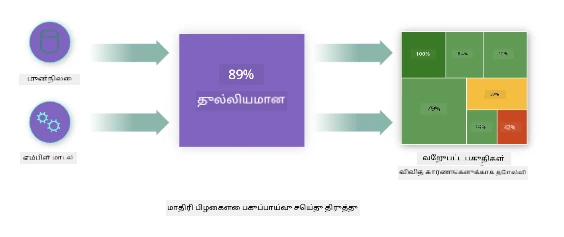
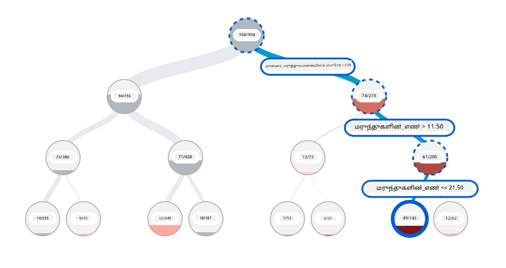
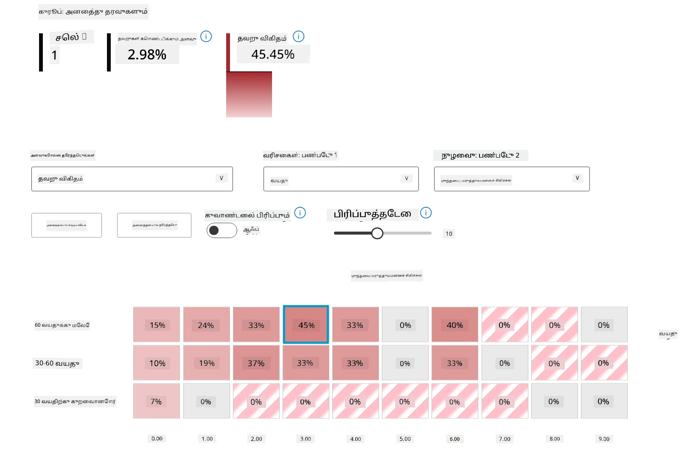
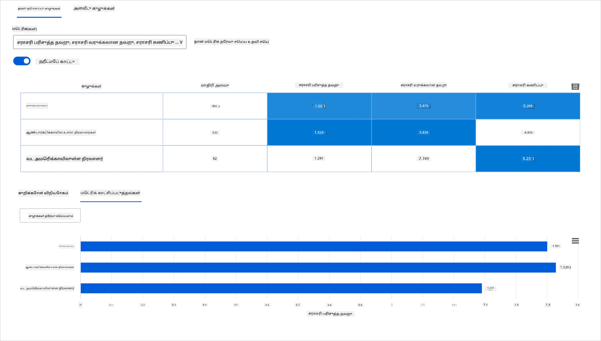
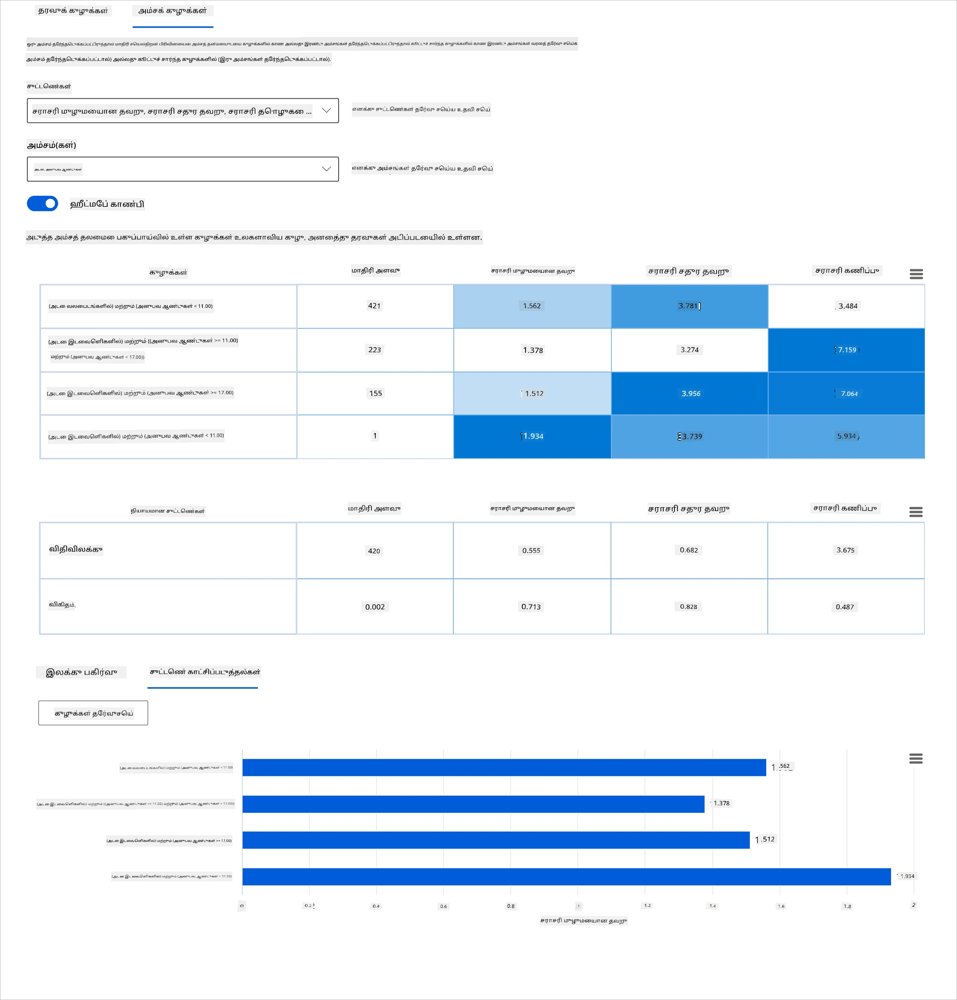
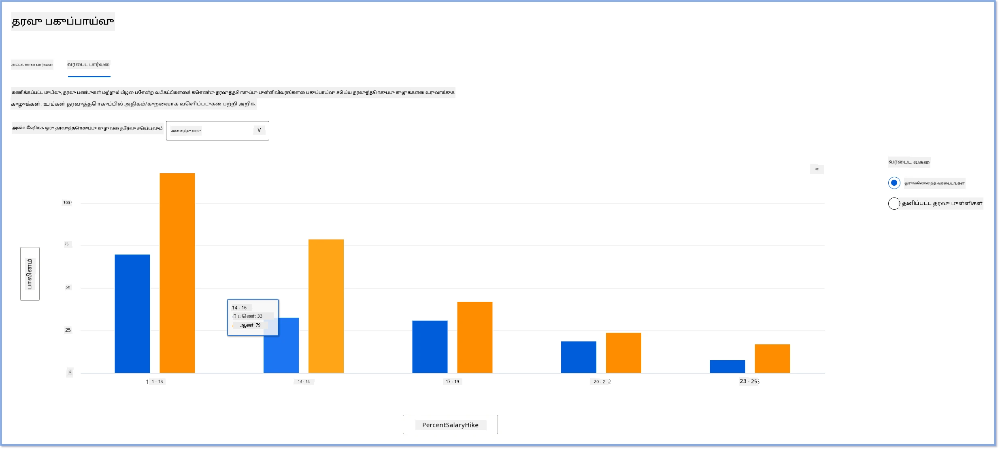
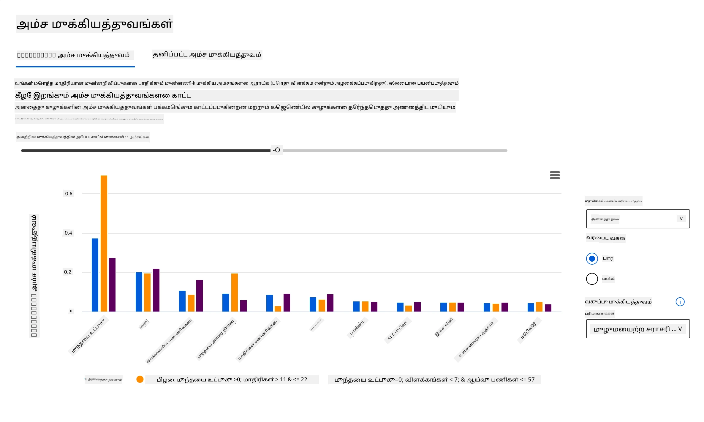
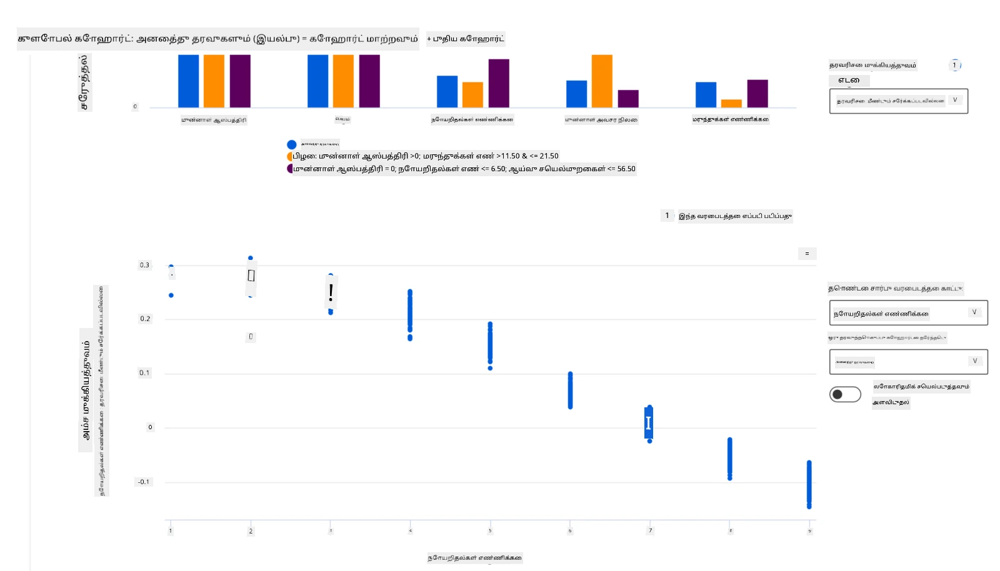

# பின்னூட்டம்: பொறுப்பான AI டாஷ்போர்டு கூறுகளைப் பயன்படுத்தி இயந்திரக் கற்பிப்பில் மாடல் பிழைதிரியல்
 

## [முன்-பாடக் கணக்கு](https://ff-quizzes.netlify.app/en/ml/)
 
## அறிமுகம்

இயந்திரக் கற்பிப்பு நமது தினசரிய வாழ்வில் பெரும் தாக்கங்களை ஏற்படுத்துகிறது. AI நம்மை மற்றும் நமது சமூகத்தையும் பாதிக்கும் மிக முக்கியமான சில அமைப்புகளில் திகழ்கிறது, மருத்துவம், நிதி, கல்வி மற்றும் வேலைவாய்ப்பு ஆகியவற்றில் இருந்து. உதாரணமாக, அமைப்புகள் மற்றும் மாதிரிகள் தினசரி முடிவெடுக்க வேண்டிய பணிகளில் ஈடுபட்டுள்ளன, உதாரணமாக மருத்துவ பரிசோதனைகள் அல்லது மோசடி கண்டறிதல் போன்றவை. இதனால், AI முன்னேற்றங்கள் மற்றும் அதனை விரைவில் ஏற்றுக்கொள்ளல் சமூக எதிர்பார்ப்புகள் வளர்ந்துவரும் விதி மற்றும் கட்டுப்பாடுகளுடன் சந்திக்கப்படுகிறது. AI அமைப்புகள் தொடர்ந்து எதிர்பார்ப்புகளை பூர்த்தி செய்ய விட்டு வைக்கக் காணப்படுகிறன; புதிய சிக்கல்களை வெளிப்படுத்துகின்றன; அரசுகள் AI தீர்வுகளை கட்டுப்படுத்தத் தொடங்கி விட்டன. எனவே, இந்த மாதிரிகளை அனைவருக்கும் நேர்மையாக, நம்பகத்தன்மையுடன், ஒருங்கிணைந்த, வெளிப்படையான மற்றும் பொறுப்பான முடிவுகளை வழங்க மதிப்பாய்வு செய்வது முக்கியம்.

இக்கற்க்குறிப்பில், மாதிரி பொறுப்பான AI பிரச்சனைகள் உள்ளதோ இல்லையோ என்பது மதிப்பாய்வதற்கான நடைமுறை கருவிகளை பார்க்கப்போகிறோம். பாரம்பரிய இயந்திரக் கற்பிப்பு பிழைதிரியல் தொழில்நுட்பங்கள் பெரும்பாலும் கூட்டு துல்லியத்திற்கோ அல்லது சராசரி பிழை இழப்பிற்கோ அடிப்படையாக கணக்கிடப்படுகின்றன. நீங்கள் உருவாக்கும் மாதிரிகளுக்காக பயன்படுத்தும் தரவை இனம், பிறப்பு, பாலினம், அரசியல் பார்வை, மதம் போன்ற சில மக்கள் குழுக்களை குறைவாகக் கொண்டிருந்தால் என்ன ஆகும் என்று நினைத்துக் பார்க்கவும். மாதிரியின் வெளியீடு சில மக்கள் குழுக்களை ஆதரிக்க வரையறுக்கப்பட்டால்? இதில் அந்த உணர்ச்சி வாய்ந்த அடையாளக்குச் சூழல்களில் அதிகம் அல்லது குறைவாக பிரதிநிதித்துவம் ஏற்படுவதால், மாதிரியில் நியாயம், ஒருங்கிணைவு அல்லது நம்பகத்தன்மை பிரச்சனைகள் உருவாகுகின்றன. இன்னும் ஒன்று, இயந்திரக் கற்பிப்பு மாதிரிகள் கருப்பு பெட்டிகள் என கருதப்படுகின்றன, அதனால் மாதிரியின் முன்னறிவிப்பிற்கான காரணங்களை புரியவோ விளக்கவோ கடினமாகிறது. இந்த அனைத்தும் தரவு அறிவியலாளர்கள் மற்றும் AI மேம்படுத்துநர்களுக்கு தேவையான கருவிகள் இல்லாதபோது அவ்வாறு எதிர்கொள்ளும் சவால்கள் ஆகும், மாதிரியின் நியாயம் அல்லது நம்பத்தன்மையை மதிப்பீடு செய்ய.

இந்த பாடத்தில், நீங்கள் உங்கள் மாதிரிகளை பிழைதிரியலில் பயன்படுத்த தொடங்குவீர்கள்:

-	**பிழை பகுப்பாய்வு**: உங்கள் தரவு விநியோகத்தில் மாதிரி அதிக பிழை வீதம் காணப்படும் இடங்களை கண்டறியுங்கள்.
-	**மாதிரி அவலோசனை**: வெவ்வேறு தரவு பகுதியில் மாதிரியின் செயல்திறன் அளவுகோல்களில் பன்முக வேறுபாடுகளை கண்டறிய ஒப்பிட்டுப் பார்வை நடத்துங்கள்.
-	**தரவு பகுப்பாய்வு**: உங்கள் மாதிரியை ஒரு தரவு மக்கள் தொகை மற்றொன்றை விட அதிகமாக ஆதரிக்க அல்லது குறையாக பிரதிநிதித்துவம் செய்கிற இடங்களை ஆராயுங்கள்.
-	**அமைப்பு முக்கியத்துவம்**: உலகளாவிய அல்லது உள்ளூர் மட்டத்தில் உங்கள் மாதிரியின் முன்னறிவிப்பை இயக்கும் அம்சங்களை புரிந்துகொள்ளுங்கள்.

## முன்னணிப் பகுதி

முன்னணி, தயவுசெய்து மீள்தரவேற்றலுக்கு [பொறுப்பான AI கருவிகள் மேம்படுத்துநர்களுக்கான](https://www.microsoft.com/ai/ai-lab-responsible-ai-dashboard) பார்த்துக் கொள்ளவும்.

> 

## பிழை பகுப்பாய்வு

சரியான எதிர்பார்ப்புகளை கொண்டு துல்லியத்தை கணக்கிடுவதில் பயன்படுத்தப்படும் பாரம்பரிய மாதிரி செயல்திறன் அளவுகோல்கள் பெரும்பாலும் துல்லியமான மற்றும் தவறான முன்னறிவிப்புகளின் அடிப்படையில் கணக்கிடப்படுகின்றன. உதாரணமாக, மாதிரி 89% துல்லியத்துடன் 0.001 பிழை இழப்பைக் கொண்டுள்ளது என நிரூபித்தால் நல்ல செயல்திறன் என கருதலாம். பிழைகள் பொதுவாக உங்கள் அடிப்படை தரவு தொகுப்பில் சமமாக பரவவில்லையென்று காணப்படுகின்றன. 89% மாதிரி துல்லியத்தைப் பெற்றாலும், மாதிரி சில தரவு பிரிவுகளில் 42% தவறான முன்னறிவிப்பைச் செய்யும் என்று கண்டுபிடிக்கலாம். சில தரவு குழுக்களுடன் இந்த தோல்வி முறை ஏற்பட்டால், அது நியாயம் அல்லது நம்பகத்தன்மை பிரச்சனைகளுக்கு வழிவகுக்கும். மாதிரி நன்றாக செயல்படுகையில் அல்லது செய்யாமல் இருக்கும் பகுதிகளை புரிந்துகொள்ளுவது அவசியம். உங்கள் மாதிரியில் அதிக தவறுகள் உள்ள இடங்கள் முக்கியமான தரவு மக்கள் தொகை என 판்பட்டுக் கொள்ளப்படலாம்.

RAI டாஷ்போர்டில் உள்ள பிழை பகுப்பாய்வு கூறு பல கொஹார்ட்களில் மாதிரி தோல்வி எவ்வாறு பரவியுள்ளது என்பதை மரம் வடிவமாக காட்டுகிறது. இது குறிப்பிட்ட அம்சங்கள் அல்லது அதிக பிழை வீதம் உள்ள பகுதிகளை கண்டறிய உதவுகிறது. மாதிரியின் அதிக தவறுகள் எங்கு உள்ளன என்று பார்த்து, மூல காரணத்தைக் கண்டுபிடிக்க தொடங்கலாம். கொஹார்ட்கள் உருவாக்கி அவற்றில் பகுப்பாய்வு செய்யவும் முடியும். அந்த கொஹார்ட்கள் மூலம் ஒரு பகுதியின் செயல்திறன் ஏன் நல்லதும் மற்றொன்றின் விரோதமானதும் என்பதை தெரிந்து கொள்ளலாம்.

மரம் வரைபடத்தில் உள்ள காட்சி குறியீடுகள் சிக்கல் உள்ள பகுதிகளை விரைவில் கண்டுபிடிக்க உதவுகின்றன. உதாரணமாக, ஒரு மர மூலக்கூடியின் சிவப்பு நிறம் காÇழுவ காட்டின் நிறம் ஆழமா இருந்தால், அதற்கு பிழை வீதம் அதிகம் என்று அர்த்தம்.

ஹீட் மேப் என்பது மாதிரி பிழைகளுக்கு பங்கேற்பு அளிக்கும் ஒரு அம்சத்தை அல்லது இரண்டு அம்சங்களை பயன்படுத்தி பிழை வீதத்தை ஆராயஒரு வேறொரு காட்சி உதவி.

பிழை பகுப்பாய்வை நீங்கள் பயன்படுத்த வேண்டும் எனின்:

* மாதிரி தோல்விகள் தரவு தொகுப்பு மற்றும் பல உள்ளீடு மற்றும் அம்ச பரிமாணங்களில் எப்போதெல்லாம் எங்கு பரவுகின்றன என்பதை ஆழ்ந்த புரிதல் பெற.
* கூட்டு செயல்திறன் அளவுகோல்களை உடைத்து பிழை உள்ள கொஹார்ட்களை தானாக கண்டறிந்து நோக்கிச் செயற்படுத்த அங்கீகாரம் பெறுதல்.

## மாதிரி அவலோசனை

இயந்திரக் கற்பிப்பு மாதிரியின் செயல்திறனை மதிப்பாய்வு செய்வதற்கு அதன் நடத்தையை முழுமையாகப் புரிந்து கொள்வது தேவை. பிழை வீதம், துல்லியம், மீள்கூறு, துல்லியத்தன்மை, அல்லது MAE (சராசரி முழுமையான பிழை) போன்ற பல அளவுகோல்களை மதிப்பீடு செய்து செயல்திறன் வேறுபாடுகளை கண்டறியலாம். ஒரு செயல்திறன் அளவுகோல் சிறப்பாக தோன்றினாலும் மற்றொன்று பிழைகளை வெளிப்படுத்தலாம். மேலும், முழு தரவு தொகுப்பிலும் கொஹார்ட்களிலும் வேறுபாடுகளை ஒப்பிட்டு பார்க்க பாதுகாப்பானது, அது மாதிரி எங்கு நன்றாக செயல்படுகிறது அல்லது இல்லை என்பதை வெளிச்சம் வீசும். இதற்கு முக்கியம், உணர்ச்சி வாய்ந்த மற்றும் உணர்ச்சி இல்லாத அம்சங்களின் இடையேயான வேறுபாடுகளை காண்பது (எ.கா., நோயாளியின் இனப் பாரம்பரியம், பாலினம் அல்லது வயது) மாதிரியில் உள்ள சாத்தியமான நியாயமற்ற தன்மையை வெளிப்படுத்த.

RAI டாஷ்போர்டின் மாதிரி அவலோசனை கூறு, ஒரு கொஹார்டில் தரவு பிரதிநிதித்துவ செயல்திறன் அளவுகோல்களை மட்டும் அல்லாமல், வேறுபட்ட கொஹார்ட்களுக்கு இடையேயான மாதிரி நடத்தையை ஒப்பிடும் திறனையும் அளிக்கிறது.

கூறின் அம்ச அடிப்படையிலான பகுப்பாய்வு செயல்பாடு, குறிப்பிட்ட அம்சத்தில் உள்ள தரவு உபகுழுக்களை துல்லியமாக சிதறல் அளவிட உதவுகிறது. உதாரணமாக, டாஷ்போர்டில் ஏற்கனவே உள்ள நுண்ணறிவு, பயனர் தேர்ந்தெடுத்த அம்சம் (உதாரணமாக *"time_in_hospital < 3"* அல்லது *"time_in_hospital >= 7"*) ஆகியவற்றுக்காக தானாகவே கொஹார்ட்களை உருவாக்க முடியும். இது ஒரு பெரிய தரவு குழுவிலிருந்து குறிப்பிட்ட ஒரு அம்சத்தை தனிமைப்படுத்தி, மாதிரியின் தவறான வெளியீடுகளுக்கு அதன் தாக்கம் அதிகமானதா என்று தெரிந்து கொள்வதற்கு உதவுகிறது.

மாதிரி அவலோசனை கூறு இரு வகையான வேறுபாடு அளவுகோல்களை ஆதரிக்கிறது:

**மாதிரி செயல்திறன் வேறுபாடு**: இந்த அளவுகோல்கள் தேர்வு செய்யப்பட்ட செயல்திறன் அளவுகோலின் மதிப்புகளில் தரவு உபகுழுக்களுக்கிடையேயான வேறுபாட்டை (வித்தியாசத்தை) கணக்கிடுகின்றன. இதற்கு சில உதாரணங்கள்:

* துல்லிய வீதத்தில் வேறுபாடு
* பிழை வீதத்தில் வேறுபாடு
* துல்லியத்தில் வேறுபாடு
* மீள்கூறில் வேறுபாடு
* சராசரி முழுமையான பிழை (MAE) இல் வேறுபாடு

**தேர்வு வீதத்தில் வேறுபாடு**: இந்த அளவுகோல் உபகுழுக்களில் தேர்வு வீதம் (நன்மைக்குரிய முன்னறிவிப்பு) இடையேயான வித்தியாசத்தைக் கொண்டுள்ளது. உதாரணமாக கடன் அனுமதி வீதத்தில் வேறுபாடு. தேர்வு வீதம் என்பது ஒவ்வொரு வகுப்பிலும் தரவு புள்ளிகள் 1 ஆக வகைப்படுத்தப்படுகிற அளவுகோல் (இரு வகைப்படுத்தலில்) அல்லது முன்னறிவிப்பு மதிப்புகளின் விநியோகம் (மீளாடல் முறையில்).

## தரவு பகுப்பாய்வு

> "நீங்கள் தரவை நீண்ட நேரம் வலித்து பேச வைக்கின்றீர்கள் என்றால் அது எதை வேண்டுமானாலும் ஒப்புக்கொள்ளும்" - ரொனால்ட் கோஸ்

இந்த கூற்றானது கடுமைபடியாக தெரிகிறது என்றாலும், தரவை எந்த முடிவையும் ஆதரிக்க ஏதாவது வகையில் மோசடியாக மாற்றலாம் என்பது உண்மை. சில சமயங்களில் இப்படிப் பண்படுத்தல் 意 危யல்லாமல் நிகழலாம். மனிதர்களுக்கு ஒவ்வொருவருக்கும் மதிப்பிலக்கணம் உள்ளது, மற்றும் எப்பொழுதெல்லாம் தரவில் மதிப்பிலக்கணம் கொண்டுவரப்படுகிறதென்று அப்படியே உணர்வது கடினம். AI மற்றும் இயந்திரக் கற்பிப்பில் நியாயத்தை உறுதி செய்வது சிக்கலான சவால் ஆகின்றது.

பாரம்பரிய மாதிரி செயல்திறன் அளவுகோல்கள் தரவு பக்கவிளைவுகளில் பெரும் புறக்கணிப்பு கண்டிருக்கின்றன. உங்களுக்கு உயர் துல்லியம் மதிப்பெண்கள் கிடைக்கலாம், ஆனாலும் அது உங்கள் தரவு தொகுப்பில் உள்ள அடிப்படை மதிப்பிலக்கணத்தை ஏற்படுத்தக்கூடும் என்று வேண்டாம். உதாரணமாக, ஒரு நிறுவனத்தில் பணியாளர்களின் தொகுப்பில் 27% பெண்கள் நிர்வாகப் பணிகளில் மற்றும் 73% ஆண்கள் அதே நிலையில் இருந்தால், அந்த தரவின் அடிப்படையில் பயிற்சி பெறுமாயிருக்கும் வேலைவாய்ப்பு AI மாதிரி பெரும்பாலும் ஆண் பார்வையாளர்களை இலக்கு செய்யும். இந்த தரவு சமநிலைமையின்மை மாதிரியின் முன்னறிவிப்பை ஓர் பாலினத்திற்கு மேலோட்டமாக சாய்க்கிறது. இது AI மாதிரியில் பாலின மதிப்பிலக்கணம் என்ற நியாய பிரச்சனையை வெளிப்படுத்துகிறது.

RAI டாஷ்போர்டில் உள்ள தரவு பகுப்பாய்வு கூறு தரவு தொகுதியில் அதிகம் அல்லது குறைவாக பிரதிநிதித்துவம் உள்ள பகுதிகளை கண்டுபிடிக்க உதவுகிறது. இது பிழை மற்றும் நியாய பிரச்சனைகளின் மூலக்காரணத்தை கண்டுபிடிக்க உதவுகிறது, குறிப்ப particular் குறிப்பிட்ட தரவு சமூகத்தின் பிரதிநிதித்துவம் குறைவாக அல்லது அளவுக்கு அதிகமாக இருக்கும்போது. இது பயனர்களுக்கு முன்னறிவு மற்றும் உண்மையான விளைவுகளின் அடிப்படை மற்றும் பிழைக் குழுக்களை, குறிப்பிட்ட அம்சங்களை அடிப்படையாக வைத்து தரவு தொகுப்பினை காட்சிப்படுத்தும் திறனை வழங்குகிறது. சில சமயங்களில் குறைந்த பிரதிநிதித்துவம் உள்ள தொடர்பற்ற தரவு குழு மாடல் நன்றாக கற்றுக்கொள்ளவில்லை என்பதையும் வெளிப்படுத்தும், அதனால் அதிக பிழைகள் ஏற்பட்டிருக்கலாம். ஒரு மாதிரி தரவு மதிப்பிலக்கணம் கொண்டிருந்தால், அது நியாய பிரச்சனை மட்டுமல்ல, அது மாதிரி ஒருங்கிணைந்ததும் நம்பகமானதுமில்லாததுமானது என்பதையும் காட்டும்.

தரவு பகுப்பாய்வை நீங்கள் பயன்படுத்த வேண்டும் எனில்:

* வேறுபட்ட வடிகட்டிகளை தேர்ந்தெடுத்து உங்கள் தரவை பல பரிமாணங்களாக (கொஹார்ட்களாக) பிரித்து தரவுத் புள்ளிவிவரங்களை ஆராயுங்கள்.
* உங்கள் தரவு தொகுப்பின் விநியோகம் வேறுபட்ட கொஹார்ட்களிலும் அம்சக் குழுக்களிலும் எப்படிக் இருக்கும் என்பதை புரிந்துகொள்ளுங்கள்.
* உங்கள் கண்டுபிடிப்புகள் (நியாயம், பிழை பகுப்பாய்வு, மற்றும் காரணப்பூர்வம்) பிற டாஷ்போர்டு கூறுகளிலிருந்து பெறப்பட்டாலும் அவை உங்கள் தரவு விநியோகம் காரணமா என்பதை நிரூபிக்கவும்.
* பிரதிநிதித்துவ பிரச்சனைகள், லேபிள் ஒலி, அம்ச ஒலி, லேபிள் மதிப்பிலக்கணம் போன்ற பிரச்சனைகள் வந்த பிழைகளை குறைக்க கூடுதல் தரவை எந்த இடத்தில் சேகரிக்க வேண்டும் என்பதைக் கட்டாயமாகத் தீர்மானிக்கவும்.

## மாதிரி விளக்கம்

இயந்திரக் கற்பிப்பு மாதிரிகள் பெரும்பாலும் கருப்பு பெட்டிகள். ஒரு மாதிரி முன்னறிவிப்பை இயக்கும் முக்கிய தரவு அம்சங்கள் என்ன என்பதை புரிந்துகொள்ள கடினம். ஆனால், ஒரு மாதிரி ஏன் குறிப்பிட்ட முன்கூட்டிய முடிவை எடுத்தது என்பதை வெளிப்படையாக வழங்குவது அவசியம். உதாரணமாக, AI அமைப்பு 30 நாட்களுக்குள் மீண்டும் மருத்துவமனைக்கு அனுமதிக்கப்படக்கூடிய ஆழ்ந்த பட்டியலாளர் ஒரு நோயாளி என்று முன்னறிவித்து இருந்தால், அது அதன் முடிவுக்கு வழிவகுக்கும் ஆதார தரவை வழங்க முடியும். ஆதார தகவல்கள் மருத்துவர்களுக்கு அல்லது மருத்துவமனைக்கு தெளிவான தீர்வுகள் எடுக்க உதவும். மேலும, ஒவ்வொரு நோயாளிக்கு மாதிரி ஏன் அந்த முடிவை எடுத்தது என்பதை விளக்குவது மருத்துவக் கட்டுப்பாடுகளுக்கு பொறுப்புக் காட்ட உதவும். மனிதர்களின் வாழ்வில் பாதிப்புகளை ஏற்படுத்தும் வகையில் இயந்திரக் கற்பிப்பு மாதிரிகளை பயன்படுத்தும் போது, மாதிரியின் நடத்தையை விளக்கும் மற்றும் புரியும் திறன் மிக அவசியம். மாதிரி விளக்கம் மற்றும் விளக்கம் பின்வரும் சூழலில் கேள்விகளுக்கு பதிலளிக்க உதவும்:

* மாதிரி பிழைத்திறனை ஆராய்வு: என் மாதிரி ஏன் இந்த பிழையை செய்தது? எப்படி மேம்படுத்தலாம்?
* மனித-AI ஒத்துழைப்பு: மாதிரியின் முடிவுகளை எப்படித் புரிந்து நம்பலாம்?
* கட்டுப்பாட்டு இணக்கம்: என் மாதிரி சட்ட தேவைகளை பூர்த்தி செய்கிறதா?

RAI டாஷ்போர்டின் அம்ச முக்கியத்துவ கூறு, மாதிரி முன்னறிவிப்புகளை பிழைதிரியலுக்கு உதவியும், மாதிரியின் நடத்தை வழிவகுக்கும் அம்சங்களை விளக்கும் முழுமையான புரிதலை வழங்கவும் உதவுகிறது. இது இயந்திரக் கற்பிப்பு வல்லுநர்கள் மற்றும் முடிவு எடுக்குநர்களுக்கு மாதிரி நடத்தை விளக்க மற்றும் சான்றுகளைச் சுட்டிக்காட்ட உதவும் கருவியாகும். பின்பு, பயனர்கள் உலகளாவிய மற்றும் உள்ளூர் விளக்கங்களை ஆராயலாம். உலகளாவிய விளக்கங்கள், ஒரு மாதிரியின் மொத்த முன்னறிவிப்பை பாதிக்கும் முக்கிய அம்சங்களின் பட்டியலை வழங்கும். உள்ளூர் விளக்கங்கள், தனிப்பட்ட வழக்கிற்கான முன்னறிவிப்பை ஏற்படுத்திய அம்சங்களை காட்டும். உள்ளூர் விளக்கங்களை மதிப்பீடு செய்வது ஒரு குறிப்பிட்ட வழக்கின் பிழைதிரியல் அல்லது ஆய்வுக்கு உதவும், மாதிரி அப்படியானா சரியான முன்னறிவிப்பை செய்ததாக அல்லது தவறானதாக வைக்க காரணங்களை அறியவும்.

* உலகளாவிய விளக்கங்கள்: உதாரணமாக, சர்க்கரை நோய் மருத்துவமனை மீண்டும் அடையாளம் மாதிரியின் மொத்த நடத்தையை எவ்வாறு பாதிக்கும் அம்சங்கள் என்ன?
* உள்ளூர் விளக்கங்கள்: உதாரணமாக, 60 வயதுக்கு மேற்பட்ட சர்க்கரை நோயாளர், முன் மருத்துவமனை அனுமதிப்புகளுடன், 30 நாட்களுக்குள் மீண்டும் அனுமதிக்கப்படுவாரா என்று முன்னறிவிக்கப்பட்ட காரணம் என்ன?

வெவ்வேறு கொஹார்டுகளில் மாதிரியின் செயல்திறனை ஆராயும் பிழைதிரியல் செயலியில், அம்ச முக்கியத்துவம் அப்படியான தரவு பாகங்களில் அம்சத்தின் தாக்கத்தின் மட்டத்தை காட்டுகிறது. இது ஒரு மாதிரி தவறான முன்னறிவிப்புகள் உண்டாக்கும் போது அதனை ஒப்பிட்டு விசித்திரங்களை வெளிப்படுத்த உதவுகிறது. அம்ச முக்கியத்துவம் ஒரு அம்சத்தில் உள்ள மதிப்புகள் மாதிரியின் முடிவுகளை நேர்மறையாக அல்லது எதிர்மறையாக பாதித்ததை காட்டும். உதாரணமாக, மாதிரிக்கு தவறான முன்னறிவிப்பு இருந்தால், கூறு அந்தப் பின்னறிவிப்பை சந்திக்க வைத்த அம்சங்கள் அல்லது அதன் மதிப்புக்களை துல்லியமாக அறிய உதவும். இந்த விவரம் பிழைத்திரியலில் மட்டுமல்லாமல், வெளிப்படைத்தன்மை மற்றும் பொறுப்புக் காட்சிகள் வழங்கவும் உதவுகிறது. கடைசியாக, இந்த கூறு நியாயமான பிரச்சனைகள் இருப்பதைக் கண்டறிய உதவும். உதாரணமாக, இனப்பெருக்கம் அல்லது பாலினம் போன்ற உணர்ச்சி வாய்ந்த அம்சம் ஒரு மாதிரியின் முன்னறிவிப்பில் உண்டாகும் மிக முக்கிய தாக்குவாக இருந்தால், அது இனப்பெருக்கம் அல்லது பாலின மதிப்பிலக்கணம் உள்ளதற்கு ஒரே சில அச்சுறுத்தல் ஆகும்.

விளக்கத்தை நீங்கள் பயன்படுத்த வேண்டும் எனில்:

* உங்கள் AI அமைப்பின் முன்னறிவிப்புகள் எவ்வளவு நம்பத்தக்கமானவை என்பதைப் புரிந்து கொண்டு முன்னறிவிப்புகளுக்கு முக்கியமான அம்சங்கள் என்ன என்பதை புரிந்துகொள்ளுங்கள்.
* உங்கள் மாதிரியை முதலில் புரிந்து கொண்டு அது உடல்நலமாக அம்சங்களை பயன்படுத்துகின்றதா அல்லது பொய் தொடர்புகளை மட்டுமே பயன்படுத்துகின்றதா என்பதை கண்டுபிடித்து பிழைதிரியலை அணுகுங்கள்.
* உணர்ச்சி வாய்ந்த அம்சங்களில் அல்லது அவற்றோடு அதிக தொடர்புடைய அம்சங்களில் அடிப்படையிலான முன்னறிவிப்புகளை உருவாக்கி மாதிரி உண்மையில் நியாயமற்றதும் உள்ளதா என்பதை வெளிப்படுத்துங்கள்.
* உள்ளூர் விளக்கங்களை உருவாக்கி உங்கள் மாதிரியின் முடிவுகளில் பயனாளர்களின் நம்பிக்கையை உருவாக்குங்கள்.
* AI அமைப்பின் கட்டுப்பாட்டு ஆய்வை முடித்து மாதிரிகளை மதிப்பீடு செய்து மனிதர்களின் மீது மாதிரி முடிவுகளின் தாக்கத்தை கண்காணியுங்கள்.

## முடிவு

அனைத்து RAI டாஷ்போர்டு கூறுகளும் சமூகத்திற்கு குறைவான தீங்கு விளைவிக்கும் மற்றும் நம்பகத்தன்மை அதிகமான இயந்திரக் கற்பிப்பு மாதிரிகள் உருவாக்க உதவும் நடைமுறை கருவிகள் ஆகும். இது மனித உரிமைகளுக்கு அசுரங் காக்குதல், குறிப்பிட்ட குழுக்களை வாழ்க்கை வாய்ப்புகளிலிருந்து விலக்கு வைப்பது மற்றும் உடல் அல்லது உளவியல் காயங்களுக்கு ஆபத்துகள் ஏற்படுத்த்வதை தடுக்க உதவும். இது உங்கள் மாதிரியின் முடிவுகளில் உள்ள நம்பிக்கையை உருவாக்கும் உள்ளூர் விளக்கங்களையும் உருவாக்க உதவும். சில அபாத்துக்கள் கீழ்க்காணும் வகையில் வகைப்படுத்தப்படலாம்:

- **வினியோகம்**, உதாரணமாக ஒரு பாலினம் அல்லது இனப்பெருக்கம் மற்றொன்றுடன் ஒப்பிடும்போது விருப்பம் பெற்றால்.
- **சேவை தரம்**. நீங்கள் ஒரு குறிப்பிட்ட சூழ்நிலையில் தரவை பயிற்சி செய்தாலும், உண்மை அதிக சிக்கலானதாக இருந்தால், அது மோசமான சேவை செயல்திறனை ஏற்படுத்தும்.
- **சாதாரண மனப்பான்மைகள்**. ஒரு குழுவுக்கு முன்பிருந்தே வழங்கப்பட்ட பண்புகளைக் கூட்டுசெலுத்துதல்.

- **எதிர்ப்புரை**. ஏமாற்றமாகக் கண்டிப்பது மற்றும் எதையோ அல்லது யாரையோ லேசாக குறிக்கோள் வைக்கிறது.
- **அதிகப்படியான அல்லது குறைந்தமையான பிரதிநிதித்துவம்**. குறிப்பிட்ட ஒரு குழு ஒரு குறிப்பிட்ட தொழிலில் பார்க்கப்படவில்லை என்று கருத்து, மேலும் எந்த சேவை அல்லது செயல்பாடு அதை முன்னிலைப்படுத்தியதால் சேதம் ஏற்படுகிறது.

### அசூர் RAI டாஷ்போர்டு
 
[அசூர் RAI டாஷ்போர்டு](https://learn.microsoft.com/en-us/azure/machine-learning/concept-responsible-ai-dashboard?WT.mc_id=aiml-90525-ruyakubu) முதன்மை கல்வி நிறுவனங்களும் நிறுவங்களும் உருவாக்கிய ஓபன்-சோর্স கருவிகளின் அடிப்படையில் கட்டப்பட்டு, தகவல் அறிவியலாளர்கள் மற்றும் AI உருவாக்குனர்களுக்கு மாதிரியின் நடத்தையை நன்றாக புரிந்துகொள்ள மற்றும் AI மாதிரிகளில் இருந்து விரும்பாத பிரச்சனைகளை கண்டறிந்து குறைக்க உதவுகிறது.

- RAI டாஷ்போர்டு [ஆவணங்களை](https://learn.microsoft.com/en-us/azure/machine-learning/how-to-responsible-ai-dashboard?WT.mc_id=aiml-90525-ruyakubu) பார்க்கவேண்டும் என்பவற்றின் வேறுபட்ட கூறுகளை பயன்படுத்துவதைக் கற்றுக்கொள்ளுங்கள்.

- அசூர் மெஷின் லெர்னிங் இல் இன்னும் பொறுப்பான AI நிலைகளுக்கு பிழைத்தீர்க்க RAI டாஷ்போர்டு [மேல்நோட்டங்களை](https://github.com/Azure/RAI-vNext-Preview/tree/main/examples/notebooks) பார்க்கவும். 
  
---
## 🚀 சவால் 
 
புள்ளிவிவர அல்லது தரவு பாகுபாடுகள் முதலில் அறிமுகப்படுத்தப்படாமல் இருக்க, நாம்: 

- அமைப்புகளில் பணிபுரியும் மனிதர்களிடையே பன்முகத் தலையங்கங்கள் மற்றும் பார்வைகள் இருக்க வேண்டும் 
- நமது சமூகத்தின் பன்முகத்தன்மையை பிரதிபலிக்கும் தரவுத்தொகுதிகளில் முதலீடு செய்ய வேண்டும் 
- பாகுபாடுகளை கண்டறிந்து திருத்துவதற்கான சிறந்த முறைகளை உருவாக்க வேண்டும் 

மாதிரி உருவாக்குதல் மற்றும் பயன்பாட்டில் நியாயமற்ற நிலைகள் காணப்படும் நிஜ உலக நிலையைப் பற்றி சிந்தியுங்கள். இன்னும் என்னை கருத்தில் கொள்ள வேண்டும்? 

## [பாடம் முடிந்த பின் வினாடி கேள்விக்கட்டு](https://ff-quizzes.netlify.app/en/ml/)
## விமர்சனம் மற்றும் சுய ஆய்வு 
 
இந்த பாடத்தில், நீங்கள் பொறுப்பான AI ஐ மெஷின் லெர்னிங்கில் ஒருங்கிணைக்க சில நடைமுறை கருவிகளை கற்றுக்கொண்டீர்கள்.  

இந்த செயல்முறை இயக்கத்தைக் கவனித்தால், அந்தக் களத்தில் மேலும் ஆழமாகலardırச் செய்யலாம்: 

- Besmira Nushi மற்றும் Mehrnoosh Sameki எழுதிய பொறுப்பான AI டாஷ்போர்டு: உட்பயன்பாட்டில் RAI ஐ செயல்படுத்த ஒரு ஒற்றை கட்சி கடை

> 🎥 மேலே புகைப்படத்தைக் கிளிக் செய்து வீடியோவைப் பாருங்கள்: Besmira Nushi மற்றும் Mehrnoosh Sameki எழுதிய பொறுப்பான AI டாஷ்போர்டு: உட்பயன்பாட்டில் RAI ஐ செயல்படுத்த ஒரு ஒற்றை கட்சி கடை
 
பொறுப்பான AI அங்கீகாரம் மற்றும் நம்பகமான மாதிரிகளை உருவாக்கும் முறைகளைப் பற்றி மேலும் அறிய கீழ்க்காணும் tàiல்களைப் பயன்படுத்தவும்: 

- Microsoft இன் RAI டாஷ்போர்டு கருவிகள் மூலம் ML மாதிரிகளை பிழைத்தீர்க்க: [பொறுப்பான AI கருவிகள் வளங்கள்](https://aka.ms/rai-dashboard)

- பொறுப்பான AI கருவிப்பெட்டியை ஆராயுங்கள்: [Github](https://github.com/microsoft/responsible-ai-toolbox)

- Microsoft இன் RAI வள மையம்: [பொறுப்பான AI வளங்கள் – Microsoft AI](https://www.microsoft.com/ai/responsible-ai-resources?activetab=pivot1%3aprimaryr4) 

- Microsoft இன் FATE ஆராய்ச்சி குழு: [FATE: AI இல் நீதி, பொறுப்புணர்வு, வெளிப்படையானம் மற்றும் ஒழுக்கநிலை - Microsoft Research](https://www.microsoft.com/research/theme/fate/) 

## பணிமுறை

[RAI டாஷ்போர்டு ஆராய்ச்சி](assignment.md)

---

<!-- CO-OP TRANSLATOR DISCLAIMER START -->
**மறுப்பு**:
இந்த ஆவணம் AI மொழிபெயர்ப்பு சேவை [Co-op Translator](https://github.com/Azure/co-op-translator) பயன்படுத்தி மொழிபெயர்க்கப்பட்டுள்ளது. நாங்கள் துல்லியத்திற்காக முயற்சி செய்துள்ளோம், ஆனால் தானாக செய்யப்படும் மொழிபெயர்ப்புகளில் பிழைகள் அல்லது தவறுகள் இருக்கலாம் என்பதை கவனத்தில் கொள்ளவும். அசல் ஆவணம் அதன் தாய்மொழியில் அதிகாரப்பூர்வ ஆதாரமாக கருதப்பட வேண்டும். முக்கியமான தகவல்களுக்கு, தொழில்நுட்பமான மனித மொழிபெயர்ப்பு பரிந்துரைக்கப்படுகிறது. இந்த மொழிபெயர்ப்பைப் பயன்படுத்துவதால் ஏற்படும் எந்த தவறான புரிதல்கள் அல்லது தவறான விளக்கத்திற்கும் நாங்கள் பொறுப்பில்வில்லை.
<!-- CO-OP TRANSLATOR DISCLAIMER END -->