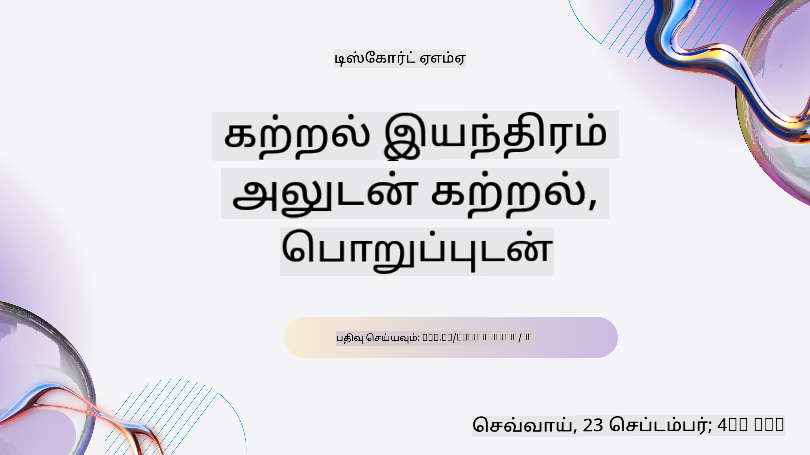
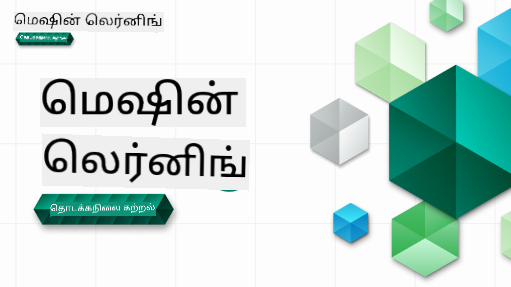

<!--
CO_OP_TRANSLATOR_METADATA:
{
  "original_hash": "7a13afb3674838f557d61f8d67e4d5f8",
  "translation_date": "2025-10-24T09:29:29+00:00",
  "source_file": "README.md",
  "language_code": "ta"
}
-->

### 🌐 பல மொழி ஆதரவு

#### GitHub செயல்பாடு மூலம் ஆதரவு (தானியங்கி மற்றும் எப்போதும் புதுப்பிக்கப்பட்டது)

<!-- CO-OP TRANSLATOR LANGUAGES TABLE START -->
[அரபு](../ar/README.md) | [பெங்காலி](../bn/README.md) | [பல்கேரியன்](../bg/README.md) | [பர்மீஸ் (மியான்மார்)](../my/README.md) | [சீனம் (எளிமைப்படுத்தப்பட்டது)](../zh/README.md) | [சீனம் (சம்பிரதாய, ஹாங்காங்)](../hk/README.md) | [சீனம் (சம்பிரதாய, மக்காவு)](../mo/README.md) | [சீனம் (சம்பிரதாய, தைவான்)](../tw/README.md) | [குரோஷியன்](../hr/README.md) | [செக்](../cs/README.md) | [டேனிஷ்](../da/README.md) | [டச்சு](../nl/README.md) | [எஸ்டோனியன்](../et/README.md) | [பின்னிஷ்](../fi/README.md) | [பிரெஞ்சு](../fr/README.md) | [ஜெர்மன்](../de/README.md) | [கிரேக்கம்](../el/README.md) | [ஹீப்ரூ](../he/README.md) | [இந்தி](../hi/README.md) | [ஹங்கேரியன்](../hu/README.md) | [இந்தோனேஷியன்](../id/README.md) | [இத்தாலியன்](../it/README.md) | [ஜப்பானியன்](../ja/README.md) | [கொரியன்](../ko/README.md) | [லிதுவேனியன்](../lt/README.md) | [மலாய்](../ms/README.md) | [மராத்தி](../mr/README.md) | [நேபாளி](../ne/README.md) | [நார்வேஜியன்](../no/README.md) | [பாரசீக (பார்ஸி)](../fa/README.md) | [போலிஷ்](../pl/README.md) | [போர்ச்சுகீஸ் (பிரேசில்)](../br/README.md) | [போர்ச்சுகீஸ் (போர்ச்சுகல்)](../pt/README.md) | [பஞ்சாபி (குர்முகி)](../pa/README.md) | [ரோமானியன்](../ro/README.md) | [ரஷியன்](../ru/README.md) | [செர்பியன் (சிரிலிக்)](../sr/README.md) | [ஸ்லோவாக்](../sk/README.md) | [ஸ்லோவேனியன்](../sl/README.md) | [ஸ்பானிஷ்](../es/README.md) | [ஸ்வாஹிலி](../sw/README.md) | [ஸ்வீடிஷ்](../sv/README.md) | [டாகாலோக் (பிலிப்பினோ)](../tl/README.md) | [தமிழ்](./README.md) | [தாய்](../th/README.md) | [துருக்கியம்](../tr/README.md) | [உக்ரேனியன்](../uk/README.md) | [உருது](../ur/README.md) | [வியட்நாமீஸ்](../vi/README.md)
<!-- CO-OP TRANSLATOR LANGUAGES TABLE END -->

#### எங்கள் சமூகத்தில் சேரவும்

நாங்கள் AI கற்றல் தொடர் தொடர்பான ஒரு டிஸ்கோர்டு நிகழ்வை நடத்துகிறோம், மேலும் [AI கற்றல் தொடர்](https://aka.ms/learnwithai/discord) பற்றி மேலும் அறிந்து, 2025 செப்டம்பர் 18 - 30 வரை எங்களுடன் சேரவும். GitHub Copilot-ஐ தரவியல் அறிவியலுக்காக பயன்படுத்துவதற்கான குறிப்புகள் மற்றும் வழிகாட்டுதல்களைப் பெறுவீர்கள்.

# தொடக்கத்திற்கான இயந்திர கற்றல் - ஒரு பாடத்திட்டம்

> 🌍 உலக கலாச்சாரங்களை அடிப்படையாகக் கொண்டு இயந்திர கற்றலை ஆராய்வதற்காக உலகம் முழுவதும் பயணம் செய்யுங்கள் 🌍

மைக்ரோசாஃப்ட் கிளவுட் ஆதரவாளர்கள் **இயந்திர கற்றல்** பற்றிய 12 வாரங்கள், 26 பாடங்கள் கொண்ட ஒரு பாடத்திட்டத்தை வழங்குவதில் மகிழ்ச்சி அடைகிறார்கள். இந்த பாடத்திட்டத்தில், **சாதாரண இயந்திர கற்றல்** என அழைக்கப்படும் விஷயங்களைப் பற்றி நீங்கள் கற்றுக்கொள்வீர்கள், முக்கியமாக Scikit-learn நூலகத்தைப் பயன்படுத்தி, எங்கள் [AI for Beginners' curriculum](https://aka.ms/ai4beginners) இல் உள்ள ஆழமான கற்றலை தவிர்த்து. இந்த பாடங்களை எங்கள் ['Data Science for Beginners' curriculum](https://aka.ms/ds4beginners) உடன் இணைத்துக் கொள்ளவும்!

உலகம் முழுவதும் பயணம் செய்து, உலகின் பல பகுதிகளில் உள்ள தரவுகளுக்கு இந்த பாரம்பரிய தொழில்நுட்பங்களைப் பயன்படுத்துவோம். ஒவ்வொரு பாடமும் பாடத்திற்கு முன் மற்றும் பின் வினாடி வினா, பாடத்தை முடிக்க எழுதப்பட்ட வழிமுறைகள், தீர்வு, பணிக்கட்டளை மற்றும் பலவற்றை உள்ளடக்கியது. எங்கள் திட்ட அடிப்படையிலான கற்பித்தல் உங்களுக்கு புதிய திறன்களை 'நினைவில் நிறுத்த' உதவுகிறது.

**✍️ எங்கள் ஆசிரியர்களுக்கு மனமார்ந்த நன்றி** Jen Looper, Stephen Howell, Francesca Lazzeri, Tomomi Imura, Cassie Breviu, Dmitry Soshnikov, Chris Noring, Anirban Mukherjee, Ornella Altunyan, Ruth Yakubu மற்றும் Amy Boyd

**🎨 எங்கள் விளக்கப்படம் உருவாக்குபவர்களுக்கு நன்றி** Tomomi Imura, Dasani Madipalli மற்றும் Jen Looper

**🙏 Microsoft மாணவர் தூதர்களுக்கு நன்றி 🙏**, குறிப்பாக Rishit Dagli, Muhammad Sakib Khan Inan, Rohan Raj, Alexandru Petrescu, Abhishek Jaiswal, Nawrin Tabassum, Ioan Samuila மற்றும் Snigdha Agarwal

**🤩 Microsoft மாணவர் தூதர்கள் Eric Wanjau, Jasleen Sondhi மற்றும் Vidushi Gupta எங்கள் R பாடங்களுக்கு கூடுதல் நன்றி!**

# தொடங்குதல்

இந்த படிகளை பின்பற்றவும்:
1. **களஞ்சியத்தை Fork செய்யவும்**: இந்த பக்கத்தின் மேல் வலது மூலையில் உள்ள "Fork" பொத்தானை கிளிக் செய்யவும்.
2. **களஞ்சியத்தை Clone செய்யவும்**:   `git clone https://github.com/microsoft/ML-For-Beginners.git`

> [இந்த பாடத்திட்டத்திற்கான கூடுதல் வளங்களை Microsoft Learn தொகுப்பில் காணவும்](https://learn.microsoft.com/en-us/collections/qrqzamz1nn2wx3?WT.mc_id=academic-77952-bethanycheum)

> 🔧 **உதவி தேவை?** நிறுவல், அமைப்பு மற்றும் பாடங்களை இயக்குவதில் பொதுவான சிக்கல்களுக்கு தீர்வுகளைப் பெற எங்கள் [சிக்கல் தீர்க்கும் வழிகாட்டியை](TROUBLESHOOTING.md) சரிபார்க்கவும்.

**[மாணவர்கள்](https://aka.ms/student-page)**, இந்த பாடத்திட்டத்தைப் பயன்படுத்த, முழு களஞ்சியத்தை உங்கள் சொந்த GitHub கணக்கிற்கு Fork செய்து, பயிற்சிகளை தனியாக அல்லது குழுவுடன் முடிக்கவும்:

- பாடத்திற்கு முன் வினாடி வினாவுடன் தொடங்கவும்.
- பாடத்தை படித்து செயல்பாடுகளை முடிக்கவும், ஒவ்வொரு அறிவு சரிபார்ப்பிலும் தற்காலிகமாக நிறுத்தி சிந்திக்கவும்.
- பாடங்களை புரிந்து கொண்டு திட்டங்களை உருவாக்க முயற்சிக்கவும்; ஆனால் தீர்வு குறியீடு `/solution` கோப்புறைகளில் கிடைக்கிறது.
- பாடத்திற்கு பின் வினாடி வினாவை எடுத்துக்கொள்ளவும்.
- சவால்களை முடிக்கவும்.
- பணிக்கட்டளையை முடிக்கவும்.
- ஒரு பாடக் குழுவை முடித்த பிறகு, [விவாதக் குழுமத்தை](https://github.com/microsoft/ML-For-Beginners/discussions) பார்வையிட்டு, PAT rubric நிரப்புவதன் மூலம் "கற்றல் வெளிப்படையாக" செய்யவும். PAT என்பது Progress Assessment Tool ஆகும், இது உங்கள் கற்றலை மேம்படுத்த ஒரு rubric ஆகும். மற்ற PAT-களுக்கு நீங்கள் பதிலளிக்கலாம், இதனால் நாம் ஒன்றாக கற்றுக்கொள்ளலாம்.

> மேலும் கற்றுக்கொள்ள, இந்த [Microsoft Learn](https://docs.microsoft.com/en-us/users/jenlooper-2911/collections/k7o7tg1gp306q4?WT.mc_id=academic-77952-leestott) தொகுப்புகள் மற்றும் கற்றல் பாதைகளை பின்பற்ற பரிந்துரைக்கிறோம்.

**ஆசிரியர்கள்**, இந்த பாடத்திட்டத்தை எவ்வாறு பயன்படுத்துவது என்பதற்கான [சில பரிந்துரைகளை](for-teachers.md) சேர்த்துள்ளோம்.

---

## வீடியோ வழிகாட்டிகள்

சில பாடங்கள் குறுகிய வடிவ வீடியோவாக கிடைக்கின்றன. இவை பாடங்களில் உள்ளே அல்லது [Microsoft Developer YouTube சேனலில் உள்ள ML for Beginners playlist](https://aka.ms/ml-beginners-videos) இல் காணலாம்.

---

## குழுவை சந்திக்கவும்

**Gif உருவாக்கியவர்** [Mohit Jaisal](https://linkedin.com/in/mohitjaisal)

> 🎥 மேலே உள்ள படத்தை கிளிக் செய்து திட்டம் மற்றும் அதை உருவாக்கியவர்களைப் பற்றி வீடியோவைப் பாருங்கள்!

---

## கற்பித்தல் முறை

இந்த பாடத்திட்டத்தை உருவாக்கும்போது, இரண்டு முக்கிய கற்பித்தல் கொள்கைகளை தேர்ந்தெடுத்துள்ளோம்: இது கைக்கூலி **திட்ட அடிப்படையிலானது** மற்றும் இது **தடுமாற்ற வினாக்களை** அடங்கியுள்ளது. மேலும், இந்த பாடத்திட்டம் ஒரு பொதுவான **தீமையை** கொண்டுள்ளது, இது ஒருங்கிணைப்பை வழங்குகிறது.

திட்டங்களுடன் உள்ளடக்கம் ஒத்துப்போகும் வகையில் உறுதிப்படுத்துவதன் மூலம், மாணவர்களுக்கு இது ஈர்க்கக்கூடியதாக மாறுகிறது மற்றும் கருத்துக்களின் நினைவில் நிறுத்தம் அதிகரிக்கப்படும். மேலும், வகுப்பிற்கு முன் குறைந்த அழுத்த வினா மாணவரின் கவனத்தை ஒரு தலைப்பை கற்றல் நோக்கமாக அமைக்கிறது, வகுப்பிற்குப் பிறகு ஒரு வினா மேலும் நினைவில் நிறுத்தத்தை உறுதிப்படுத்துகிறது. இந்த பாடத்திட்டம் நெகிழ்வான மற்றும் மகிழ்ச்சியானதாக வடிவமைக்கப்பட்டுள்ளது, முழுமையாக அல்லது பகுதியளவில் எடுத்துக்கொள்ளலாம். திட்டங்கள் சிறியதாக தொடங்கி, 12 வார சுழற்சியின் இறுதியில் அதிகமாக சிக்கலானதாக மாறுகின்றன. இந்த பாடத்திட்டம் ML இன் உண்மையான உலக பயன்பாடுகள் பற்றிய ஒரு பிந்தைய குறிப்பையும் உள்ளடக்கியது, இது கூடுதல் கிரெடிட் அல்லது விவாதத்திற்கான அடிப்படையாக பயன்படுத்தப்படலாம்.

> எங்கள் [நடத்தை விதிமுறைகள்](CODE_OF_CONDUCT.md), [கொடை](CONTRIBUTING.md), [மொழிபெயர்ப்பு](TRANSLATIONS.md), மற்றும் [சிக்கல் தீர்க்கும் வழிகாட்டி](TROUBLESHOOTING.md) வழிகாட்டுதல்களைப் பாருங்கள். உங்கள் கட்டமைப்பான கருத்துகளை வரவேற்கிறோம்!

## ஒவ்வொரு பாடமும் உள்ளடக்கியது

- விருப்பமான ஸ்கெட்ச் குறிப்பு
- விருப்பமான கூடுதல் வீடியோ
- வீடியோ வழிகாட்டி (சில பாடங்கள் மட்டும்)
- [பாடத்திற்கு முன் வெப்பமூட்டும் வினாடி வினா](https://ff-quizzes.netlify.app/en/ml/)
- எழுதப்பட்ட பாடம்
- திட்ட அடிப்படையிலான பாடங்களுக்கு, திட்டத்தை உருவாக்குவதற்கான படி படியாக வழிகாட்டிகள்
- அறிவு சரிபார்ப்புகள்
- ஒரு சவால்
- கூடுதல் வாசிப்பு
- பணிக்கட்டளை
- [பாடத்திற்கு பின் வினாடி வினா](https://ff-quizzes.netlify.app/en/ml/)

> **மொழிகள் பற்றிய குறிப்புகள்**: இந்த பாடங்கள் முதன்மையாக Python-ல் எழுதப்பட்டுள்ளன, ஆனால் பல R-ல் கிடைக்கின்றன. R பாடத்தை முடிக்க, `/solution` கோப்புறைக்கு சென்று R பாடங்களைத் தேடவும். அவை .rmd நீட்டிப்பை உள்ளடக்கியவை, இது **R Markdown** கோப்பை பிரதிநிதித்துவப்படுத்துகிறது, இது `Markdown document` இல் `code chunks` (R அல்லது பிற மொழிகள்) மற்றும் `YAML header` (PDF போன்ற வெளியீடுகளை வடிவமைப்பதற்கான வழிகாட்டி) ஆகியவற்றின் இணைப்பாக வரையறுக்கப்படலாம். எனவே, இது உங்கள் குறியீடு, அதன் வெளியீடு மற்றும் உங்கள் எண்ணங்களை Markdown-ல் எழுத அனுமதிப்பதன் மூலம் தரவியல் அறிவியலுக்கான ஒரு சிறந்த எழுத்தாளர் கட்டமைப்பாக செயல்படுகிறது. மேலும், R Markdown ஆவணங்கள் PDF, HTML அல்லது Word போன்ற வெளியீடு வடிவங்களுக்கு மாற்றப்படலாம்.

> **வினாடி வினா பற்றிய குறிப்புகள்**: அனைத்து வினாடி வினாக்களும் [Quiz App folder](../../quiz-app) இல் உள்ளன, மொத்தம் 52 வினாடி வினாக்கள், ஒவ்வொன்றும் மூன்று கேள்விகள் கொண்டது. அவை பாடங்களில் இருந்து இணைக்கப்பட்டுள்ளன, ஆனால் வினாடி வினா பயன்பாட்டை உள்ளூர் அளவில் இயக்கலாம்; `quiz-app` கோப்புறையில் உள்ள வழிமுறைகளைப் பின்பற்றி உள்ளூர் அல்லது Azure-க்கு வெளியிடவும்.

| பாட எண் |                             தலைப்பு                              |                   பாட குழுமம்                   | கற்றல் நோக்கங்கள்                                                                                                             |                                                              இணைக்கப்பட்ட பாடம்                                                               |                        ஆசிரியர்                        |
| :-----------: | :------------------------------------------------------------: | :-------------------------------------------------: | ------------------------------------------------------------------------------------------------------------------------------- | :--------------------------------------------------------------------------------------------------------------------------------------: | :--------------------------------------------------: |
|      01       |                மெஷின் லெர்னிங் அறிமுகம்                |      [Introduction](1-Introduction/README.md)       | மெஷின் லெர்னிங் பற்றிய அடிப்படை கருத்துகளை கற்றுக்கொள்ளுங்கள்                                                                                |                                             [Lesson](1-Introduction/1-intro-to-ML/README.md)                                             |                       முஹம்மது                       |
|      02       |                மெஷின் லெர்னிங் வரலாறு                 |      [Introduction](1-Introduction/README.md)       | இந்த துறையின் அடிப்படையான வரலாற்றை கற்றுக்கொள்ளுங்கள்                                                                                         |                                            [Lesson](1-Introduction/2-history-of-ML/README.md)                                            |                     ஜென் மற்றும் ஏமி                      |
|      03       |                 நியாயம் மற்றும் மெஷின் லெர்னிங்                  |      [Introduction](1-Introduction/README.md)       | மெஷின் லெர்னிங் மாடல்களை உருவாக்கும் மற்றும் பயன்படுத்தும் போது மாணவர்கள் கவனிக்க வேண்டிய முக்கிய தத்துவ பிரச்சினைகள் என்ன? |                                              [Lesson](1-Introduction/3-fairness/README.md)                                               |                        தோமோமி                        |
|      04       |                மெஷின் லெர்னிங் தொழில்நுட்பங்கள்                 |      [Introduction](1-Introduction/README.md)       | மெஷின் லெர்னிங் மாடல்களை உருவாக்க மெஷின் லெர்னிங் ஆராய்ச்சியாளர்கள் எந்த தொழில்நுட்பங்களை பயன்படுத்துகிறார்கள்?                                                                       |                                          [Lesson](1-Introduction/4-techniques-of-ML/README.md)                                           |                    கிறிஸ் மற்றும் ஜென்                     |
|      05       |                   ரிக்ரஷன் அறிமுகம்                   |        [Regression](2-Regression/README.md)         | ரிக்ரஷன் மாடல்களுக்கு Python மற்றும் Scikit-learn உடன் தொடங்குங்கள்                                                                  |         [Python](2-Regression/1-Tools/README.md) • [R](../../2-Regression/1-Tools/solution/R/lesson_1.html)         |      ஜென் • எரிக் வான்ஜௌ       |
|      06       |                வட அமெரிக்க கும்முட்டி விலை 🎃                |        [Regression](2-Regression/README.md)         | மெஷின் லெர்னிங் தயாரிப்புக்கு தரவுகளை காட்சிப்படுத்தவும் மற்றும் சுத்தம் செய்யவும்                                                                                  |          [Python](2-Regression/2-Data/README.md) • [R](../../2-Regression/2-Data/solution/R/lesson_2.html)          |      ஜென் • எரிக் வான்ஜௌ       |
|      07       |                வட அமெரிக்க கும்முட்டி விலை 🎃                |        [Regression](2-Regression/README.md)         | நேரியல் மற்றும் பாலினோமியல் ரிக்ரஷன் மாடல்களை உருவாக்கவும்                                                                                   |        [Python](2-Regression/3-Linear/README.md) • [R](../../2-Regression/3-Linear/solution/R/lesson_3.html)        |      ஜென் மற்றும் திமித்ரி • எரிக் வான்ஜௌ       |
|      08       |                வட அமெரிக்க கும்முட்டி விலை 🎃                |        [Regression](2-Regression/README.md)         | ஒரு லாஜிஸ்டிக் ரிக்ரஷன் மாடலை உருவாக்கவும்                                                                                               |     [Python](2-Regression/4-Logistic/README.md) • [R](../../2-Regression/4-Logistic/solution/R/lesson_4.html)      |      ஜென் • எரிக் வான்ஜௌ       |
|      09       |                          ஒரு வலை பயன்பாடு 🔌                          |           [Web App](3-Web-App/README.md)            | உங்கள் பயிற்சி மாடலை பயன்படுத்த ஒரு வலை பயன்பாட்டை உருவாக்கவும்                                                                                       |                                                 [Python](3-Web-App/1-Web-App/README.md)                                                  |                         ஜென்                          |
|      10       |                 வகைப்படுத்தல் அறிமுகம்                 |    [Classification](4-Classification/README.md)     | உங்கள் தரவுகளை சுத்தம் செய்யவும், தயாரிக்கவும், காட்சிப்படுத்தவும்; வகைப்படுத்தல் அறிமுகம்                                                            | [Python](4-Classification/1-Introduction/README.md) • [R](../../4-Classification/1-Introduction/solution/R/lesson_10.html)  | ஜென் மற்றும் காச்சி • எரிக் வான்ஜௌ |
|      11       |             சுவையான ஆசிய மற்றும் இந்திய உணவுகள் 🍜             |    [Classification](4-Classification/README.md)     | வகைப்படுத்தலர்களின் அறிமுகம்                                                                                                     | [Python](4-Classification/2-Classifiers-1/README.md) • [R](../../4-Classification/2-Classifiers-1/solution/R/lesson_11.html) | ஜென் மற்றும் காச்சி • எரிக் வான்ஜௌ |
|      12       |             சுவையான ஆசிய மற்றும் இந்திய உணவுகள் 🍜             |    [Classification](4-Classification/README.md)     | மேலும் வகைப்படுத்தலர்கள்                                                                                                                | [Python](4-Classification/3-Classifiers-2/README.md) • [R](../../4-Classification/3-Classifiers-2/solution/R/lesson_12.html) | ஜென் மற்றும் காச்சி • எரிக் வான்ஜௌ |
|      13       |             சுவையான ஆசிய மற்றும் இந்திய உணவுகள் 🍜             |    [Classification](4-Classification/README.md)     | உங்கள் மாடலைப் பயன்படுத்தி ஒரு பரிந்துரை வலை பயன்பாட்டை உருவாக்கவும்                                                                                    |                                              [Python](4-Classification/4-Applied/README.md)                                              |                         ஜென்                          |
|      14       |                   கிளஸ்டரிங் அறிமுகம்                   |        [Clustering](5-Clustering/README.md)         | உங்கள் தரவுகளை சுத்தம் செய்யவும், தயாரிக்கவும், காட்சிப்படுத்தவும்; கிளஸ்டரிங் அறிமுகம்                                                                |         [Python](5-Clustering/1-Visualize/README.md) • [R](../../5-Clustering/1-Visualize/solution/R/lesson_14.html)         |      ஜென் • எரிக் வான்ஜௌ       |
|      15       |              நைஜீரிய இசை விருப்பங்களை ஆராயுங்கள் 🎧              |        [Clustering](5-Clustering/README.md)         | கே-மீன்ஸ் கிளஸ்டரிங் முறையை ஆராயுங்கள்                                                                                           |           [Python](5-Clustering/2-K-Means/README.md) • [R](../../5-Clustering/2-K-Means/solution/R/lesson_15.html)           |      ஜென் • எரிக் வான்ஜௌ       |
|      16       |        இயற்கை மொழி செயலாக்கம் அறிமுகம் ☕️         |   [Natural language processing](6-NLP/README.md)    | ஒரு எளிய போட்டை உருவாக்குவதன் மூலம் NLP பற்றிய அடிப்படைகளை கற்றுக்கொள்ளுங்கள்                                                                             |                                             [Python](6-NLP/1-Introduction-to-NLP/README.md)                                              |                       ஸ்டீபன்                        |
|      17       |                      பொதுவான NLP பணிகள் ☕️                      |   [Natural language processing](6-NLP/README.md)    | மொழி அமைப்புகளை கையாளும்போது தேவையான பொதுவான பணிகளைப் புரிந்து கொள்ளுங்கள்                          |                                                    [Python](6-NLP/2-Tasks/README.md)                                                     |                       ஸ்டீபன்                        |
|      18       |             மொழிபெயர்ப்பு மற்றும் உணர்வு பகுப்பாய்வு ♥️              |   [Natural language processing](6-NLP/README.md)    | ஜேன் ஆஸ்டினுடன் மொழிபெயர்ப்பு மற்றும் உணர்வு பகுப்பாய்வு                                                                             |                                            [Python](6-NLP/3-Translation-Sentiment/README.md)                                             |                       ஸ்டீபன்                        |
|      19       |                  ஐரோப்பாவின் காதலான ஹோட்டல்கள் ♥️                  |   [Natural language processing](6-NLP/README.md)    | ஹோட்டல் விமர்சனங்களுடன் உணர்வு பகுப்பாய்வு 1                                                                                         |                                               [Python](6-NLP/4-Hotel-Reviews-1/README.md)                                                |                       ஸ்டீபன்                        |
|      20       |                  ஐரோப்பாவின் காதலான ஹோட்டல்கள் ♥️                  |   [Natural language processing](6-NLP/README.md)    | ஹோட்டல் விமர்சனங்களுடன் உணர்வு பகுப்பாய்வு 2                                                                                         |                                               [Python](6-NLP/5-Hotel-Reviews-2/README.md)                                                |                       ஸ்டீபன்                        |
|      21       |            நேரம் வரிசை முன்னறிவிப்பு அறிமுகம்             |        [Time series](7-TimeSeries/README.md)        | நேரம் வரிசை முன்னறிவிப்பு அறிமுகம்                                                                                         |                                             [Python](7-TimeSeries/1-Introduction/README.md)                                              |                      பிரான்செஸ்கா                       |
|      22       | ⚡️ உலக மின்சார பயன்பாடு ⚡️ - ARIMA உடன் நேரம் வரிசை முன்னறிவிப்பு |        [Time series](7-TimeSeries/README.md)        | ARIMA உடன் நேரம் வரிசை முன்னறிவிப்பு                                                                                              |                                                 [Python](7-TimeSeries/2-ARIMA/README.md)                                                 |                      பிரான்செஸ்கா                       |
|      23       |  ⚡️ உலக மின்சார பயன்பாடு ⚡️ - SVR உடன் நேரம் வரிசை முன்னறிவிப்பு  |        [Time series](7-TimeSeries/README.md)        | ஆதரவு வெக்டர் ரிக்ரஷனுடன் நேரம் வரிசை முன்னறிவிப்பு                                                                           |                                                  [Python](7-TimeSeries/3-SVR/README.md)                                                  |                       அனிர்பன்                        |
|      24       |             பலவழி கற்றல் அறிமுகம்             | [Reinforcement learning](8-Reinforcement/README.md) | Q-Learning உடன் பலவழி கற்றல் அறிமுகம்                                                                          |                                             [Python](8-Reinforcement/1-QLearning/README.md)                                              |                        திமித்ரி                        |
|      25       |                 பீட்டர் ஓநாயை தவிர்க்க உதவுங்கள்! 🐺                  | [Reinforcement learning](8-Reinforcement/README.md) | பலவழி கற்றல் ஜிம்                                                                                                      |                                                [Python](8-Reinforcement/2-Gym/README.md)                                                 |                        திமித்ரி                        |
|  Postscript   |            உண்மையான உலக மெஷின் லெர்னிங் சூழல்கள் மற்றும் பயன்பாடுகள்            |      [ML in the Wild](9-Real-World/README.md)       | பாரம்பரிய மெஷின் லெர்னிங் பயன்பாடுகளின் சுவாரஸ்யமான மற்றும் வெளிப்படையான உண்மையான உலக பயன்பாடுகள்                                                               |                                             [Lesson](9-Real-World/1-Applications/README.md)                                              |                         குழு                         |
|  Postscript   |            RAI டாஷ்போர்டை பயன்படுத்தி மெஷின் லெர்னிங் மாடல்களை பிழை திருத்துதல்          |      [ML in the Wild](9-Real-World/README.md)       | பொறுப்பான AI டாஷ்போர்டு கூறுகளைப் பயன்படுத்தி மெஷின் லெர்னிங் மாடல்களை பிழை திருத்துதல்                                                              |                                             [Lesson](9-Real-World/2-Debugging-ML-Models/README.md)                                              |                         ரூத் யாகுபு                       |

> [இந்த பாடத்திட்டத்திற்கான கூடுதல் வளங்களை Microsoft Learn தொகுப்பில் காணவும்](https://learn.microsoft.com/en-us/collections/qrqzamz1nn2wx3?WT.mc_id=academic-77952-bethanycheum)

## ஆஃப்லைன் அணுகல்

இந்த ஆவணங்களை [Docsify](https://docsify.js.org/#/) பயன்படுத்தி ஆஃப்லைனில் இயக்கலாம். இந்த ரெப்போவை Fork செய்யவும், உங்கள் உள்ளூர் கணினியில் [Docsify நிறுவவும்](https://docsify.js.org/#/quickstart), பின்னர் இந்த ரெப்போவின் மூல கோப்பகத்தில் `docsify serve` என டைப் செய்யவும். வலைத்தளம் உங்கள் localhost இல் port 3000 இல் வழங்கப்படும்: `localhost:3000`.

## PDFs

இணைப்புகளுடன் பாடத்திட்டத்தின் PDF ஐ [இங்கே](https://microsoft.github.io/ML-For-Beginners/pdf/readme.pdf) காணவும்.

## 🎒 பிற பாடங்கள் 

எங்கள் குழு பிற பாடங்களை உருவாக்குகிறது! பாருங்கள்:

<!-- CO-OP TRANSLATOR OTHER COURSES START -->
### Azure / Edge / MCP / Agents

---
 
### Generative AI Series

[-9333EA?style=for-the-badge&labelColor=E5E7EB&color=9333EA)](https://github.com/microsoft/Generative-AI-for-beginners-dotnet?WT.mc_id=academic-105485-koreyst)
[-C084FC?style=for-the-badge&labelColor=E5E7EB&color=C084FC)](https://github.com/microsoft/generative-ai-for-beginners-java?WT.mc_id=academic-105485-koreyst)
[-E879F9?style=for-the-badge&labelColor=E5E7EB&color=E879F9)](https://github.com/microsoft/generative-ai-with-javascript?WT.mc_id=academic-105485-koreyst)

---
 
### Core Learning
  
  
  
  
  
  
  

---

### Copilot தொடர்  
  
  
  
<!-- CO-OP TRANSLATOR OTHER COURSES END -->

## உதவி பெறுதல்  

AI பயன்பாடுகளை உருவாக்குவதில் சிக்கல் அல்லது கேள்விகள் இருந்தால், இணைந்திடுங்கள்:  

  

தயாரிப்பு கருத்துகள் அல்லது பிழைகள் இருந்தால், பார்வையிடுங்கள்:  

  

---

**அறிவிப்பு**:  
இந்த ஆவணம் [Co-op Translator](https://github.com/Azure/co-op-translator) என்ற AI மொழிபெயர்ப்பு சேவையைப் பயன்படுத்தி மொழிபெயர்க்கப்பட்டுள்ளது. நாங்கள் துல்லியத்திற்காக முயற்சிக்கிறோம், ஆனால் தானியங்கி மொழிபெயர்ப்புகளில் பிழைகள் அல்லது தவறுகள் இருக்கக்கூடும் என்பதை தயவுசெய்து கவனத்தில் கொள்ளவும். அதன் சொந்த மொழியில் உள்ள மூல ஆவணம் அதிகாரப்பூர்வ ஆதாரமாக கருதப்பட வேண்டும். முக்கியமான தகவல்களுக்கு, தொழில்முறை மனித மொழிபெயர்ப்பு பரிந்துரைக்கப்படுகிறது. இந்த மொழிபெயர்ப்பைப் பயன்படுத்துவதால் ஏற்படும் எந்த தவறான புரிதல்களுக்கும் அல்லது தவறான விளக்கங்களுக்கும் நாங்கள் பொறுப்பல்ல.