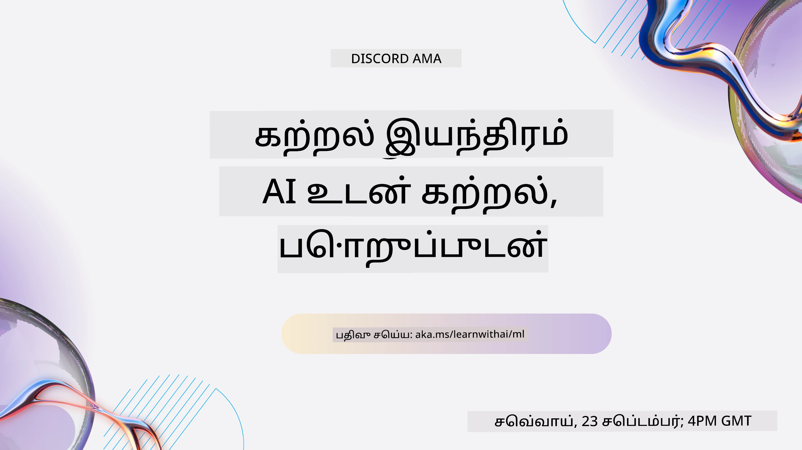
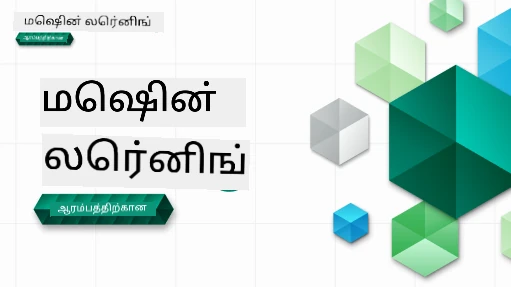

[](https://github.com/microsoft/ML-For-Beginners/blob/master/LICENSE)
[](https://GitHub.com/microsoft/ML-For-Beginners/graphs/contributors/)
[](https://GitHub.com/microsoft/ML-For-Beginners/issues/)
[](https://GitHub.com/microsoft/ML-For-Beginners/pulls/)
[](http://makeapullrequest.com)

[](https://GitHub.com/microsoft/ML-For-Beginners/watchers/)
[](https://GitHub.com/microsoft/ML-For-Beginners/network/)
[](https://GitHub.com/microsoft/ML-For-Beginners/stargazers/)

### 🌐 பல்மொழி ஆதரவு

#### GitHub செயல்பாட்டினாலும் (தானியங்கி மற்றும் எப்போதும் புதுப்பிக்கப்பட்டது) ஆதரிக்கப்படுகிறது

<!-- CO-OP TRANSLATOR LANGUAGES TABLE START -->
[அரபு](../ar/README.md) | [பெங்காலி](../bn/README.md) | [பல்கேரியன்](../bg/README.md) | [பருமாசி (மியான்மர்)](../my/README.md) | [சீனம் (எளிதாக்கப்பட்டது)](../zh-CN/README.md) | [சீனம் (மொழிபெயர்ப்பு, ஹாங்காங்)](../zh-HK/README.md) | [சீனம் (மொழிபெயர்ப்பு, மகாவு)](../zh-MO/README.md) | [சீனம் (மொழிபெயர்ப்பு, தைவான்)](../zh-TW/README.md) | [குரோஷியன்](../hr/README.md) | [செக்](../cs/README.md) | [டேனிஷ்](../da/README.md) | [டட்ச்](../nl/README.md) | [எஸ்டோனியன்](../et/README.md) | [பின்னிஷ்](../fi/README.md) | [பிரெஞ்சு](../fr/README.md) | [ஜெர்மன்](../de/README.md) | [கிரேக்கம்](../el/README.md) | [ஹீப்ரூ](../he/README.md) | [இந்தி](../hi/README.md) | [ஹங்கேரியன்](../hu/README.md) | [இந்தோனேஷியன்](../id/README.md) | [இத்தாலியன்](../it/README.md) | [ஜப்பானீஸ்](../ja/README.md) | [கன்னடம்](../kn/README.md) | [க்மேர்](../km/README.md) | [கொரியன்](../ko/README.md) | [லிதுவேனியன்](../lt/README.md) | [மலாய்](../ms/README.md) | [மலையாளம்](../ml/README.md) | [மராத்தி](../mr/README.md) | [நேபாளி](../ne/README.md) | [நைஜீரியன் பிட்ஜின்](../pcm/README.md) | [நார்வேஜியன்](../no/README.md) | [பெர்சியன் (பார்சி)](../fa/README.md) | [போலிஷ்](../pl/README.md) | [போர்ச்சுகீஸ் (பிரேசில்)](../pt-BR/README.md) | [போர்ச்சுகீஸ் (பொர்ச்சுகல்)](../pt-PT/README.md) | [பஞ்சாபி (குருமுகி)](../pa/README.md) | [ரோமானியன்](../ro/README.md) | [ரஷ்யன்](../ru/README.md) | [செர்பியன் (சிரிலிக்)](../sr/README.md) | [ஸ்லோவாக்](../sk/README.md) | [ஸ்லோவேனியன்](../sl/README.md) | [ஸ்பானிஷ்](../es/README.md) | [ஸ்வாஹிலி](../sw/README.md) | [ஸ்வீடிஷ்](../sv/README.md) | [டாகாலாக் (பிலிப்பைன்ஸ்)](../tl/README.md) | [தமிழ்](./README.md) | [தெலுங்கு](../te/README.md) | [தை](../th/README.md) | [துருக்கியம்](../tr/README.md) | [உக்ரைனியன்](../uk/README.md) | [உருது](../ur/README.md) | [வியட்நாமீஸ்](../vi/README.md)

> **உள்நாட்டில் கிளோன் செய்ய விரும்புகிறீர்களா?**
>
> இந்த ரெப்போசிடரி 50+ மொழி மொழிபெயர்ப்புகளை கொண்டுள்ளது, இது பதிவிறக்கம் அளவை முக்கியமாக அதிகரிக்கிறது. மொழிபெயர்ப்புகள் இல்லாமல் கிளோன் செய்ய sparse checkout பயன்படுத்தவும்:
>
> **பாஷ் / macOS / லினக்ஸ்:**
> ```bash
> git clone --filter=blob:none --sparse https://github.com/microsoft/ML-For-Beginners.git
> cd ML-For-Beginners
> git sparse-checkout set --no-cone '/*' '!translations' '!translated_images'
> ```
>
> **CMD (விண்டோஸ்):**
> ```cmd
> git clone --filter=blob:none --sparse https://github.com/microsoft/ML-For-Beginners.git
> cd ML-For-Beginners
> git sparse-checkout set --no-cone "/*" "!translations" "!translated_images"
> ```
>
> இது பாடக்குறிப்பை முடிக்க தேவையான அனைத்தையும் வழங்கி, மிகவும் வேகமான பதிவிறக்கத்தை சமர்ப்பிக்கும்.
<!-- CO-OP TRANSLATOR LANGUAGES TABLE END -->

#### எங்கள் சமூகத்தில் சேருங்கள்

[](https://discord.gg/nTYy5BXMWG)

நாங்கள் ஒரு Discord learn with AI தொடர் நடத்தியுள்ளோம், மேலும் அறிந்து சேர [Learn with AI Series](https://aka.ms/learnwithai/discord) 18 - 30 செப்டம்பர், 2025 அன்று. நீங்கள் GitHub Copilot பயன்படுத்துவதற்கான உதவிக் குறிப்புகளையும் அறிவுக்களையும் பெறுவீர்கள்.



# புதுமுகர்களுக்கான மெஷின் லேர்னிங் - ஒரு பாடத்திட்டம்

> 🌍 உலக கலாச்சாரங்களின் மூலம் மெஷின் லேர்னிங் பயணம்செய்யுங்கள் 🌍

Microsoft இல் உள்ள Cloud Advocates குழு 12 வார 26 பாடங்களை உள்ளடக்கிய **மெஷின் லேர்னிங்** குறித்து முழு பாடத்திட்டத்தை வழங்குகிறார்கள். இந்த பாடத்திட்டத்தில், பொதுவாக "கிளாசிக் மெஷின் லேர்னிங்" என்று அழைக்கப்படும், பெரும்பாலும் Scikit-learn நூலகத்தை பயன்படுத்தி, தீவிர கற்றல் தவிர்க்கப்படும், இது எங்கள் [AI for Beginners' பாடத்திட்டத்தில்](https://aka.ms/ai4beginners) உள்ளது. இந்தப் பாடங்களை எங்கள் ['Data Science for Beginners' பாடத்திட்டத்துடன்](https://aka.ms/ds4beginners) இணைத்து பயன்படுத்தவும்!

உலகத்தின் பல பகுதிகளிலிருந்து தரவுகளை கொண்டு இந்த klassieke முறைகளை பயன்படுத்தி எங்களுக்கு பயணம் செய்யுங்கள். ஒவ்வொரு பாடத்திலும் முன்னிளக்கம் மற்றும் பின்னணி வினாக்கள், எழுதப்பட்ட அறிவுரைகள், ஒரு தீர்வு, ஒரு பணியிடு உள்ளிட்டவை உள்ளன. எங்கள் திட்டஅடிப்படையிலான கற்றல் முறையால் நீங்கள் கட்டும்போது கற்றுக்கொள்ள முடியும், இது புதிய திறன்களை நிலையாக பெற உதவும்.

**✍️ எங்கள் எழுத்தாளர்களுக்கு பாராட்டுக்கள்** ஜென் லூப்பர், ஸ்டீபன் ஹவல், பிரான்செஸ்கா லாஜெரி, தோமாமி இமுரா, காச்சி பிரெவியு, ட்மிட்ரி சோஷ்னிக்கோவ், கிறிஸ் நொரிங், அனிர்பான் முகர்ஜி, அற்னல்லா ஆல்டுன்யான், ரூத் யாக்குபு மற்றும் ஆமி போய்ட்

**🎨 எங்கள் வரைப்பாளர்களுக்கு நன்றி** தோமாமி இமுரா, தசானி மதிபள்ளி மற்றும் ஜென் லூப்பர்

**🙏 சிறப்பு நன்றி 🙏  எங்கள் Microsoft மாணவர் அம்பாசடர் எழுத்தாளர்கள், மதிப்பாய்வாளர்கள் மற்றும் உள்ளடக்க பங்குதாரர்களுக்கு**, குறிப்பாக ரிஷித் டாக்ளி, முகம்மத் சாகிப் கான் இனான், ரோகன் ராஜ், அலெக்ஸாண்ட்ரு பெட்ரெஸ்கு, அபிஷேக் ஜெய்ஸ்வால், நவரின் தபசும், ஐஒன் சமுயிலா மற்றும் ஸ்நிக்தா அகர்வால்

**🤩 எங்கள் R பாடங்களுக்கு Microsoft மாணவர் அம்பாசடர்கள் எரிக் வான்ஜாவ், ஜாஸ்லீன் சொந்தி மற்றும் விடுஷி குப்தா அவர்களுக்கு கூடுதல் நன்றி!**

# துவக்கம்

கீழ்காணும் படிகளை பின்பற்றுங்கள்:
1. **ரெப்போசிடரியை ஃபோர்க் செய்யவும்**: இந்தப் பக்கத்தின் மேல் வலது முக்கோணத்தில் உள்ள "Fork" பொத்தானை கிளிக் செய்யவும்.
2. **ரெப்போசிடரியை கிளோன் செய்யவும்**:   `git clone https://github.com/microsoft/ML-For-Beginners.git`

> 💡 **விரைவான துவக்கம் குறிப்பு:** உங்கள் கணினியில் Python அமைக்காம χωρίς உலாவியில் துவங்க விரும்புகிறீர்களா? உங்கள் ஃபோர் க்குக்காக [GitHub Codespaces](https://github.com/features/codespaces) பயன்படுத்தி ஒரு கிளவுட் மேம்பாட்டு சூழலை உருவாக்குங்கள். பச்சை **Code** மெனுவை திறந்து, **Codespaces** தேர்ந்தெடுத்து ஒரு codespace உருவாக்குங்கள்; தேவைக்கேற்ப ஒவ்வொரு பாடத்திற்கும் தேவையான சார்வுகளை அதில் நிறுவுங்கள்.

> [இந்த பாடத்திட்டத்திற்கான அனைத்து கூடுதல் வளங்களையும் எங்கள் Microsoft Learn தொகுப்பில் காண்க](https://learn.microsoft.com/en-us/collections/qrqzamz1nn2wx3?WT.mc_id=academic-77952-bethanycheum)

> 🔧 **உதவி தேவைவா?** நிறுவல், அமைப்பு மற்றும் பாடங்களை இயக்குவதற்கான பொதுவான சிக்கல்களுக்கான தீர்வுகளை எங்கள் [பிரச்சினைத் தீர்வு கையேட்டில்](TROUBLESHOOTING.md) பார்க்கவும்.


**[மாணவர்கள்](https://aka.ms/student-page)**, இந்த பாடத்திட்டத்தை பயன்படுத்த, முழுமையான ரெப்போவை உங்கள் சொந்த GitHub கணக்குக்கு ஃபோர்க் செய்து, தனியாக அல்லது குழுவுடன் பயிற்சிகளை முடிக்கவும்:

- முன்னுணர்க வினாத்தாளுடன் துவங்குங்கள்.
- உரையைப் படித்து, செயல்பாடுகளை முடிக்கவும், ஒவ்வொரு அறிவு சோதனை இடைவெளி இடும்.
- மூலக் குறியீட்டை இயக்குாமல் பாடங்களைக் கற்றுக்கொண்டு திட்டங்களை உருவாக்க முயற்சிக்கவும்; ஆனால் அந்த குறியீடு ஒவ்வொரு திட்ட சார்ந்த பாடத்திற்கும் `/solution` கோப்புறையில் கிடைக்கும்.
- பின்னணி வினாத்தாளை எடுத்துக்கொள்ளவும்.
- சவாலை முடிக்கவும்.
- பணியிடை முடிக்கவும்.
- ஒரு பாடக் குழு முடிந்ததும், [உரையாடல் பலகை](https://github.com/microsoft/ML-For-Beginners/discussions) தளத்தில் சென்று "பேசிக் கற்றல்" - PAT ரூப்ரிக் நிரப்பவும். 'PAT' என்பது முன்னேற்ற மதிப்பீட்டு கருவி, இது உங்கள் கற்றலை மேலும் மேம்படுத்த உதவும். மற்ற PAT களுக்கும் எதிர்வினை தெரிவிக்கலாம், இதனால் நாம் ஒன்றாக கற்றுக்கொள்வோம்.

> மேலதிக படிப்பிற்கு, இவற்றை பின்தொடர்முறை பரிந்துரைக்கின்றோம்: [Microsoft Learn](https://docs.microsoft.com/en-us/users/jenlooper-2911/collections/k7o7tg1gp306q4?WT.mc_id=academic-77952-leestott) தொகுப்புகள் மற்றும் கற்றல் பாதைகள்.

**பாடநெறியாளர்கள்**, இந்த பாடத்திட்டத்தை எவ்வாறு பயன்படுத்துவது என்பது குறித்த [சில பரிந்துரைகளை](for-teachers.md) சேர்த்துள்ளோம்.

---

## வீடியோ நடைமுறைப்பரிசு

சில பாடங்கள் குறுகிய வடிவ வீடியோவாகக் கிடைக்கின்றன. இவை அனைத்தும் பாடக்குறிப்புகளில் நேரடியாக, அல்லது [Microsoft Developer YouTube சேனலிலுள்ள ML for Beginners காட்சிப்பட்டியலில்](https://aka.ms/ml-beginners-videos) கீழ்காணும் படத்தை கிளிக் செய்து காணலாம்.

[](https://aka.ms/ml-beginners-videos)

---

## குழுவை சந்திக்கவும்

[](https://youtu.be/Tj1XWrDSYJU)

**கிஃப்ம்** [மோஹித் ஜெய்சால்](https://linkedin.com/in/mohitjaisal)

> 🎥 மேலே உள்ள படத்தை கிளிக் செய்து, திட்டம் மற்றும் அதை உருவாக்கியவர்களைப் பற்றிய வீடியோவைப் பாருங்கள்!

---

## கல்வி முறைகள்

இந்த பாடத்திட்டத்தை உருவாக்கும்போது நாங்கள் இரண்டு கல்வி கொள்கைகளை தேர்ந்தெடுத்துள்ளோம்: கையேடு சிறப்பிக்கும் **திட்ட அடிப்படையிலான** கற்றல் மற்றும் **அடிக்கடி வினாக்கள்** சேர்த்தல். கூடுதலாக, இந்த பாடத்திட்டத்தின் ஒரு பொதுவான **தீம்** உள்ளது.

உள்ளடக்கம் திட்டங்களுடன் ஒத்துழைப்பதால், மாணவர்கள் அதிக ஈடுபாடு தெளிவாகவும், கருத்துகளின் நினைவுதிறன் அதிகரிக்கும். ஒரு வகுப்புக்கு முன்பான குறைந்த-அவை வினாத்தாள், மாணவரின் கற்றல் நோக்கத்தைக் கட்டமைத்து, வகுப்புக்குப் பின் இன்னொரு வினாத்தாள் நினைவாற்றலை உறுதிப்படுத்தும். இந்த பாடத்திட்டம் துரிதசாத்திய மற்றும் பொழுதுபோக்கு என வடிவமைக்கப்பட்டுள்ளது; முழுவதும் அல்லது ஒரு பகுதி மட்டும் எடுத்துக் கொள்ளலாம். திட்டங்கள் சிறிய அளவில் துவங்கி, 12 வார முடிவில் கடினமாக மாறுகின்றன. இன்னும், இந்த பாடத்திட்டத்தில் நிஜ உலக பயன்பாடுகள் குறித்த ஒரு பின்பொருள் உள்ளது, இது கூடுதல் கிரெடிட் அல்லது கலந்துரையாடல் அடிப்படையாக பயன்படுத்தலாம்.

> எங்கள் [நடத்தைக் கோட்பாடு](CODE_OF_CONDUCT.md), [பங்களிப்பு](CONTRIBUTING.md), [மொழிபெயர்ப்புகள்](..), மற்றும் [சிக்கல்தீர்க்கல்](TROUBLESHOOTING.md) வழிகாட்டிகள் காண்க. உங்கள் கட்டுமான கருத்துக்களை நாங்கள் அன்புடன் வரவேற்கின்றோம்!

## ஒவ்வொரு பாடத்திலும் உள்ளவை

- விரும்பினால் ஸ்கெட்ச் நோட்
- விரும்பினால் மேலதிக வீடியோ
- வீடியோ நடைமுறை (சில பாடங்களுக்கு மட்டுமே)
- [முன்-பாட வகுப்புப் பயிற்சி வினாத்தாள்](https://ff-quizzes.netlify.app/en/ml/)
- எழுதப்பட்ட பாடம்
- திட்ட அடிப்படையிலான பாடங்களுக்கு, திட்டத்தை உருவாக்கும் படி ஒவ்வொரு படி வழிகாட்டுதல்கள்
- அறிவு சோதனைகள்
- ஒரு சவால்
- மேலதிக படிப்பு
- பணியிடு
- [பாடத்துக்குப் பின் வினாத்தாள்](https://ff-quizzes.netlify.app/en/ml/)

> **மொழிகள் குறித்த குறிப்பு**: இந்த பாடங்கள் பெரும்பாலும் Python-ல் எழுதப்பட்டவை, ஆனால் பல பாடங்கள் R-ல் கிடைக்கின்றன. R பாடத்தை முடிக்க, `/solution` கோப்புறையை சென்று R பாடங்களைத் தேடு. அவற்றில் .rmd நீட்டிப்பு உள்ளது, இது **R மார்க்டவுன்** கோப்பாகும், இது `code chunks` (R அல்லது பிற மொழிகள்), மற்றும் `YAML header` (PDF போன்ற வெளிப்பாடுகளை அமைப்பதற்கான) ஆகியவற்றின் ஒட்டுமொத்தமான இணைப்பு என்று விளக்கப்படலாம். இதன் மூலம் உங்கள் குறியீடு, அதன் வெளியீடு, மற்றும் உங்கள் எண்ணங்களை மார்க்டவுனில் எழுதுவதால் ஒரே கோப்பில் சேமிக்க முடியும். மேலும், R மார்க்டவுன் கோப்புகள் PDF, HTML, அல்லது Word போன்ற வெளிப்பாடு வடிவங்களில் மாற்றப்படலாம்.

> **வினாத்தாள் குறித்த குறிப்பு**: அனைத்து வினாத்தாள்களும் [Quiz App கோப்புறையில்](../../quiz-app) உள்ளன, ஒவ்வொரு வினாத்தாளும் மூன்று கேள்விகளுடன் மொத்தம் 52 வினாத்தாள்கள் உள்ளன. அவை பாடங்களில் இணைக்கப்பட்டுள்ளன, ஆனால் வினாத்தாள் பயன்பாட்டை உள்ளகமாக இயக்கலாம்; அதற்கான வழிமுறைகள் `quiz-app` கோப்புறையில் உள்ளன, உங்களுக்கு ஏற்ற வகையில் உள்ளகமாக நடத்தலாம் அல்லது Azure-க்கு வெளியிடலாம்.

| பாட எண் |                             பொருள்                              |                   பாட குழு                   | கற்றல் குறிக்கோள்கள்                                                                                                             |                                                              இணைக்கப்பட்ட பாடம்                                                               |                        எழுத்தாளர்                        |
| :-----------: | :------------------------------------------------------------: | :-------------------------------------------------: | ------------------------------------------------------------------------------------------------------------------------------- | :--------------------------------------------------------------------------------------------------------------------------------------: | :--------------------------------------------------: |
|      01       |                இயந்திரக் கற்றலுக்கான அறிமுகம்                |      [Introduction](1-Introduction/README.md)       | இயந்திரக் கற்றலின் அடிப்படை கருத்துக்களை கற்கவுங்கள்                                                                                |                                             [Lesson](1-Introduction/1-intro-to-ML/README.md)                                             |                       முஹம்மது                       |
|      02       |                இயந்திரக் கற்றலின் வரலாறு                 |      [Introduction](1-Introduction/README.md)       | இந்த துறையின் அடிப்படை வரலாற்றை கற்றுக்கொள்ளுங்கள்                                                                                         |                                            [Lesson](1-Introduction/2-history-of-ML/README.md)                                            |                     ஜென் மற்றும் ஏமி                      |
|      03       |                 நியாயமும் இயந்திரக் கற்றலும்                  |      [Introduction](1-Introduction/README.md)       | இயந்திரக் கற்றல் மாதிரிகளை கட்டமைக்கும் போது மாணவர்கள் கவனிக்கும் முக்கிய தத்துவ பிரச்சனைகள் என்னென்ன? |                                              [Lesson](1-Introduction/3-fairness/README.md)                                               |                        தோமோமி                        |
|      04       |                இயந்திரக் கற்றலுக்கான நுட்பங்கள்                 |      [Introduction](1-Introduction/README.md)       | இயந்திரக் கற்றல்ப் புலத்தில் ஆய்வாளர்கள் மாதிரிகளை உருவாக்க பயன்படுத்தும் நுட்பங்கள் என்ன?                                                                       |                                          [Lesson](1-Introduction/4-techniques-of-ML/README.md)                                           |                    கிரிஸ் மற்றும் ஜென்                     |
|      05       |                   நிகர்கொள்ளலுக்கு அறிமுகம்                   |        [Regression](2-Regression/README.md)         | உள்ளீடுகள் மற்றும் வெளியீடுகளுக்கான ரிக்ரெஷன் மாதிரிகளுக்கான Python மற்றும் Scikit-learn இல் பயிற்சி                                                                  |         [Python](2-Regression/1-Tools/README.md) • [R](../../2-Regression/1-Tools/solution/R/lesson_1.html)         |      ஜென் • எரிக் வாஞ்சௌ       |
|      06       |                வட அமெரிக்கா பரங்கிப்பழ விலை 🎃                |        [Regression](2-Regression/README.md)         | இயந்திரக் கற்றலுக்கான தரவுகளை காட்சிப்படுத்தி சுத்திகரிப்பது                                                                                  |          [Python](2-Regression/2-Data/README.md) • [R](../../2-Regression/2-Data/solution/R/lesson_2.html)          |      ஜென் • எரிக் வாஞ்சௌ       |
|      07       |                வட அமெரிக்கா பரங்கிப்பழ விலை 🎃                |        [Regression](2-Regression/README.md)         | நேர்கோட்ட மற்றும் பன்முக ரிக்ரெஷன் மாதிரிகளை உருவாக்குதல்                                                                                   |        [Python](2-Regression/3-Linear/README.md) • [R](../../2-Regression/3-Linear/solution/R/lesson_3.html)        |      ஜென் மற்றும் ட்மித்ரி • எரிக் வாஞ்சௌ       |
|      08       |                வட அமெரிக்கா பரங்கிப்பழ விலை 🎃                |        [Regression](2-Regression/README.md)         | ஒரு லொஜிஸ்டிக் ரிக்ரெஷன் மாதிரியை உருவாக்குதல்                                                                                               |     [Python](2-Regression/4-Logistic/README.md) • [ர](../../2-Regression/4-Logistic/solution/R/lesson_4.html)      |      ஜென் • எரிக் வாஞ்சௌ       |
|      09       |                          ஒரு வலை பயன்பாடு 🔌                          |           [Web App](3-Web-App/README.md)            | பயிற்சி பெற்ற மாதிரியைப் பயன்படுத்த ஒரு வலை பயன்பாட்டை உருவாக்கவும்                                                                                       |                                                 [Python](3-Web-App/1-Web-App/README.md)                                                  |                         ஜென்                          |
|      10       |                 வகைப்பாட்டு அறிமுகம்                 |    [Classification](4-Classification/README.md)     | உங்கள் தரவைத் தூய்மை செய்யவும், தயாரித்து காட்சிப்படுத்தவும்; வகைப்பாட்டின் அறிமுகம்                                                            | [Python](4-Classification/1-Introduction/README.md) • [R](../../4-Classification/1-Introduction/solution/R/lesson_10.html)  | ஜென் மற்றும் காஸ்ஸி • எரிக் வாஞ்சௌ |
|      11       |             சுவையான ஆசிய மற்றும் இந்திய உணவுகள் 🍜             |    [Classification](4-Classification/README.md)     | வகைப்படுத்திகளுக்கான அறிமுகம்                                                                                                     | [Python](4-Classification/2-Classifiers-1/README.md) • [R](../../4-Classification/2-Classifiers-1/solution/R/lesson_11.html) | ஜென் மற்றும் காஸ்ஸி • எரிக் வாஞ்சௌ |
|      12       |             சுவையான ஆசிய மற்றும் இந்திய உணவுகள் 🍜             |    [Classification](4-Classification/README.md)     | கூடுதல் வகைப்படுத்திகள்                                                                                                                | [Python](4-Classification/3-Classifiers-2/README.md) • [R](../../4-Classification/3-Classifiers-2/solution/R/lesson_12.html) | ஜென் மற்றும் காஸ்ஸி • எரிக் வாஞ்சௌ |
|      13       |             சுவையான ஆசிய மற்றும் இந்திய உணவுகள் 🍜             |    [Classification](4-Classification/README.md)     | உங்கள் மாதிரியை பயன்படுத்தி பரிந்துரைகூறும் வலை பயன்பாட்டை உருவாக்கவும்                                                                                    |                                              [Python](4-Classification/4-Applied/README.md)                                              |                         ஜென்                          |
|      14       |                   குழுவாக்க அறிமுகம்                   |        [Clustering](5-Clustering/README.md)         | உங்கள் தரவை தூய்மை செய்யவும், தயாரித்து காட்சிப்படுத்தவும்; குழுவாக்கம் அறிமுகம்                                                                |         [Python](5-Clustering/1-Visualize/README.md) • [R](../../5-Clustering/1-Visualize/solution/R/lesson_14.html)         |      ஜென் • எரிக் வாஞ்சௌ       |
|      15       |              நைஜீரிய இசை ருசிகளை ஆராய்தல் 🎧              |        [Clustering](5-Clustering/README.md)         | K-மீன்ஸ் குழுவாக்க முறையை ஆராயுங்கள்                                                                                           |           [Python](5-Clustering/2-K-Means/README.md) • [R](../../5-Clustering/2-K-Means/solution/R/lesson_15.html)           |      ஜென் • எரிக் வாஞ்சௌ       |
|      16       |        இயற்கை மொழி செயலாக்கத்திற்கு அறிமுகம் ☕️         |   [Natural language processing](6-NLP/README.md)    | எளிய பாட்டை உருவாக்கி இயற்கை மொழி செயலாக்கத்தின் அடிப்படைகளை கற்றுக்கொள்ளவும்                                                                             |                                             [Python](6-NLP/1-Introduction-to-NLP/README.md)                                              |                       ஸ்டீபன்                        |
|      17       |                      பொதுவான NLP பணிகள் ☕️                      |   [Natural language processing](6-NLP/README.md)    | மொழி அமைப்புகளுடன் வேலை செய்யும்போது தேவையான பொதுவான பணிகளை புரிந்து கொண்டு NLP அறிவை ஆழமாக்கவும்                          |                                                    [Python](6-NLP/2-Tasks/README.md)                                                     |                       ஸ்டீபன்                        |
|      18       |             மொழிபெயர்ப்பு மற்றும் உணர்ச்சி பகுப்பாய்வு ♥️              |   [Natural language processing](6-NLP/README.md)    | ஜேன் ஆஸ்டினுடன் மொழிபெயர்ப்பு மற்றும் உணர்ச்சி பகுப்பாய்வு                                                                             |                                            [Python](6-NLP/3-Translation-Sentiment/README.md)                                             |                       ஸ்டீபன்                        |
|      19       |                  ஐரோப்பிய காதல் விடுதிகள் ♥️                  |   [Natural language processing](6-NLP/README.md)    | விடுதிக் கருத்துக்களைப் பயன்படுத்திய உணர்ச்சி பகுப்பாய்வு 1                                                                                         |                                               [Python](6-NLP/4-Hotel-Reviews-1/README.md)                                                |                       ஸ்டீபன்                        |
|      20       |                  ஐரோப்பிய காதல் விடுதிகள் ♥️                  |   [Natural language processing](6-NLP/README.md)    | விடுதிக் கருத்துக்களைப் பயன்படுத்திய உணர்ச்சி பகுப்பாய்வு 2                                                                                         |                                               [Python](6-NLP/5-Hotel-Reviews-2/README.md)                                                |                       ஸ்டீபன்                        |
|      21       |            கால வரிசை முன்னறிவிப்பிற்கு அறிமுகம்             |        [Time series](7-TimeSeries/README.md)        | கால வரிசை முன்னறிவிப்பு அறிமுகம்                                                                                         |                                             [Python](7-TimeSeries/1-Introduction/README.md)                                              |                      பிரான்செஸ்கா                       |
|      22       | ⚡️ உலக சக்தி பயன்பாடு ⚡️ - ARIMA பயன்பாடுடன் கால வரிசை முன்னறிவிப்பு |        [Time series](7-TimeSeries/README.md)        | ARIMA உடன் கால வரிசை முன்னறிவிப்பு                                                                                              |                                                 [Python](7-TimeSeries/2-ARIMA/README.md)                                                 |                      பிரான்செஸ்கா                       |
|      23       |  ⚡️ உலக சக்தி பயன்பாடு ⚡️ - SVR உடன் கால வரிசை முன்னறிவிப்பு  |        [Time series](7-TimeSeries/README.md)        | Support Vector Regressor உடன் கால வரிசை முன்னறிவிப்பு                                                                           |                                                  [Python](7-TimeSeries/3-SVR/README.md)                                                  |                       அனிர்பான்                        |
|      24       |             வலுப்படுத்தல் கற்றலுக்கான அறிமுகம்             | [Reinforcement learning](8-Reinforcement/README.md) | Q-Learning உடன் வலுப்படுத்தல் கற்றலுக்கு அறிமுகம்                                                                          |                                             [Python](8-Reinforcement/1-QLearning/README.md)                                              |                        ட்மித்ரி                        |
|      25       |                 பீட்டரை நரி ஆவியைத் தவிர்க்க உதவுங்கள்! 🐺                  | [Reinforcement learning](8-Reinforcement/README.md) | வலுப்படுத்தல் கற்றல் ஜிம்                                                                                                      |                                                [Python](8-Reinforcement/2-Gym/README.md)                                                 |                        ட்மித்ரி                        |
|  வினாஅடைவு   |            உலகசாமானிய இயந்திரக் கற்றல் சூழல்கள் மற்றும் பயன்பாடுகள்            |      [ML in the Wild](9-Real-World/README.md)       | பாரம்பரிய இயந்திரக் கற்றல் தொடர்புடைய ஆரோக்கியமான மற்றும் விளக்கமான நடைமுறை பயன்பாடுகள்                                                               |                                             [Lesson](9-Real-World/1-Applications/README.md)                                              |                         குழு                         |
|  வினாஅடைவு   |            RAI டாஷ்போர்டைப் பயன்படுத்தி ML மாதிரி பிழைத்திருத்தல்            |      [ML in the Wild](9-Real-World/README.md)       | பொறுப்பான AI டாஷ்போர்டு கூறுகளைப் பயன்படுத்தி இயந்திரக் கற்றல் மாதிரி பிழைத்திருத்தல்                                                              |                                             [Lesson](9-Real-World/2-Debugging-ML-Models/README.md)                                              |                     ரூத் யாகுபு                      |

> [இந்த பாடத்திட்டத்திற்கு அனைத்து கூடுதல் வளங்களையும் எங்கள் Microsoft Learn தொகுப்பில் காண்க](https://learn.microsoft.com/en-us/collections/qrqzamz1nn2wx3?WT.mc_id=academic-77952-bethanycheum)

## ஆஃப்லைன் அணுகல்

நீங்கள் இந்த ஆவணத்தை [Docsify](https://docsify.js.org/#/) பயன்படுத்தி ஆஃப்லைனில் இயக்கலாம். இந்த ரெப்போவை ஃபோர்க் செய்து, உங்கள் உள்ளூர்தள இயந்திரத்தில் [Docsify ஐ நிறுவுங்கள்](https://docsify.js.org/#/quickstart), பிறகு இந்த ரெப்போவின் ருட் கோப்பகத்தில் `docsify serve` என்று பதிவு செய்யவும். இணையத்தளம் உங்கள் உள்ளூர்தளத்தில் 3000 போர்ட்டில் இயங்கும்: `localhost:3000`.

## PDFகள்

இணைப்புகளுடன் கூடிய பாடத்திட்டத்தின் PDF ஐ [இங்கே](https://microsoft.github.io/ML-For-Beginners/pdf/readme.pdf) காணவும்.


## 🎒 பிற பாடங்கள் 

எங்கள் குழு பிற பாடங்களை உருவாக்குகிறது! பாருங்கள்:

<!-- CO-OP TRANSLATOR OTHER COURSES START -->
### LangChain
[](https://aka.ms/langchain4j-for-beginners)
[](https://aka.ms/langchainjs-for-beginners?WT.mc_id=m365-94501-dwahlin)
[](https://github.com/microsoft/langchain-for-beginners?WT.mc_id=m365-94501-dwahlin)
---

### Azure / Edge / MCP / முகவர்கள்
[](https://github.com/microsoft/AZD-for-beginners?WT.mc_id=academic-105485-koreyst)
[](https://github.com/microsoft/edgeai-for-beginners?WT.mc_id=academic-105485-koreyst)
[](https://github.com/microsoft/mcp-for-beginners?WT.mc_id=academic-105485-koreyst)
[](https://github.com/microsoft/ai-agents-for-beginners?WT.mc_id=academic-105485-koreyst)

---
 
### உருவாக்கும் AI தொடர்
[](https://github.com/microsoft/generative-ai-for-beginners?WT.mc_id=academic-105485-koreyst)
[-9333EA?style=for-the-badge&labelColor=E5E7EB&color=9333EA)](https://github.com/microsoft/Generative-AI-for-beginners-dotnet?WT.mc_id=academic-105485-koreyst)
[-C084FC?style=for-the-badge&labelColor=E5E7EB&color=C084FC)](https://github.com/microsoft/generative-ai-for-beginners-java?WT.mc_id=academic-105485-koreyst)
[-E879F9?style=for-the-badge&labelColor=E5E7EB&color=E879F9)](https://github.com/microsoft/generative-ai-with-javascript?WT.mc_id=academic-105485-koreyst)

---
 
### மையக் கற்றல்
[](https://aka.ms/ml-beginners?WT.mc_id=academic-105485-koreyst)
[](https://aka.ms/datascience-beginners?WT.mc_id=academic-105485-koreyst)
[](https://aka.ms/ai-beginners?WT.mc_id=academic-105485-koreyst)
[](https://github.com/microsoft/Security-101?WT.mc_id=academic-96948-sayoung)
[](https://aka.ms/webdev-beginners?WT.mc_id=academic-105485-koreyst)
[](https://aka.ms/iot-beginners?WT.mc_id=academic-105485-koreyst)
[](https://github.com/microsoft/xr-development-for-beginners?WT.mc_id=academic-105485-koreyst)

---
 
### கோபைலட் தொடர்
[](https://aka.ms/GitHubCopilotAI?WT.mc_id=academic-105485-koreyst)
[](https://github.com/microsoft/mastering-github-copilot-for-dotnet-csharp-developers?WT.mc_id=academic-105485-koreyst)
[](https://github.com/microsoft/CopilotAdventures?WT.mc_id=academic-105485-koreyst)
<!-- CO-OP TRANSLATOR OTHER COURSES END -->

## உதவி பெறல்

இயந்திரக் கற்றல் கற்றுக்கொண்டபோது அல்லது AI பயன்பாடுகள் உருவாக்கும்போது நீங்கள் சிக்கிக்கொண்டால், கவலைப்பட வேண்டாம் — உதவி கிடைக்கும்.

நீங்கள் மற்ற கற்றற்பவர்கள் மற்றும் மேம்பாட்டாளர்களுடன் கலந்துரையாடலாம், கேள்விகள் கேட்கலாம் மற்றும் சமுதாயத்துடன் உங்கள் கருத்துக்களை பகிரலாம்.

- கேள்விகள் கேட்டு மற்றவர்களுடன் கற்றுக்கொள்ள சமுதாயத்தில் சேரவும்
- இயந்திரக் கற்றல் கருத்துக்கள் மற்றும் திட்ட எண்ணங்களை விவாதிக்கவும்
- அனுபவமுள்ள மேம்பாட்டாளர்களிடமிருந்து வழிகாட்டல் பெறவும்

ஒரு ஆதரவு சமுதாயம் உங்கள் திறன்களை மேம்படுத்தவும் பிரச்சனைகளை விரைவாக தீர்க்கவும் உதவும்.

[Microsoft Foundry Discord Community](https://discord.gg/nTYy5BXMWG)

பிழைகள், தவறுகள் அல்லது மேம்படுத்தல்கள் தொடர்பான பரிந்துரைகள் இருந்தால், இதைத் தெரிவிக்க இந்த களஞ்சியத்தில் ஒரு **பிரச்சனையை** திறக்கலாம்.

தயாரிப்பு கருத்துக்களுக்கோ அல்லது ஏற்கனவே உள்ள சமுதாய இடுகைகளை தேடவோ, டெவலப்பர் ஃபோரத்தை பார்வையிடவும்:

[](https://aka.ms/foundry/forum)

## மேலதிக கற்றல் குறிப்புகள்

- ஒவ்வொரு பாடத்துக்குப் பிறகு நோட்புக் களைக் கண்டு வாசிக்கவும் சிறந்த புரிதலுக்காக.
- உங்கள் சுயமாகக் கொள்ள முயற்சி செய்யவும்.
- கற்றுக்கொண்ட கொள்கைகளை பயன்படுத்தி உண்மை உலக தரவுத்தொகுப்புகளை ஆராயவும்.

---

<!-- CO-OP TRANSLATOR DISCLAIMER START -->
**மறுப்பு**:
இந்த ஆவணம் AI மொழிபெயர்ப்பு சேவை [Co-op Translator](https://github.com/Azure/co-op-translator) பயன்படுத்தி மொழிபெயர்க்கப்பட்டுள்ளது. நாங்கள் துல்லியத்திற்காக முயற்சி செய்துள்ளோம், ஆனால் தானாக செய்யப்படும் மொழிபெயர்ப்புகளில் பிழைகள் அல்லது தவறுகள் இருக்கலாம் என்பதை கவனத்தில் கொள்ளவும். அசல் ஆவணம் அதன் தாய்மொழியில் அதிகாரப்பூர்வ ஆதாரமாக கருதப்பட வேண்டும். முக்கியமான தகவல்களுக்கு, தொழில்நுட்பமான மனித மொழிபெயர்ப்பு பரிந்துரைக்கப்படுகிறது. இந்த மொழிபெயர்ப்பைப் பயன்படுத்துவதால் ஏற்படும் எந்த தவறான புரிதல்கள் அல்லது தவறான விளக்கத்திற்கும் நாங்கள் பொறுப்பில்வில்லை.
<!-- CO-OP TRANSLATOR DISCLAIMER END -->