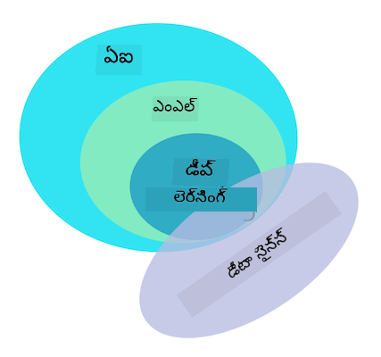

<!--
CO_OP_TRANSLATOR_METADATA:
{
  "original_hash": "69389392fa6346e0dfa30f664b7b6fec",
  "translation_date": "2025-12-19T13:22:38+00:00",
  "source_file": "1-Introduction/1-intro-to-ML/README.md",
  "language_code": "te"
}
-->
# మెషీన్ లెర్నింగ్ పరిచయం

## [ప్రీ-లెక్చర్ క్విజ్](https://ff-quizzes.netlify.app/en/ml/)

---

> 🎥 ఈ పాఠం ద్వారా పనిచేసే చిన్న వీడియో కోసం పై చిత్రాన్ని క్లిక్ చేయండి.

క్లాసికల్ మెషీన్ లెర్నింగ్ పై ఈ కోర్సుకు స్వాగతం! మీరు ఈ విషయం గురించి పూర్తిగా కొత్తవారైనా, లేదా ఒక అనుభవజ్ఞులైన ML ప్రాక్టిషనర్ అయినా, మేము మీకు జాయిన్ కావడం ఆనందంగా ఉంది! మేము మీ ML అధ్యయనానికి స్నేహపూర్వక ప్రారంభ స్థలాన్ని సృష్టించాలని కోరుకుంటున్నాము మరియు మీ [ఫీడ్‌బ్యాక్](https://github.com/microsoft/ML-For-Beginners/discussions) ను అంచనా వేయడానికి, స్పందించడానికి మరియు చేర్చడానికి సంతోషిస్తాము.

> 🎥 వీడియో కోసం పై చిత్రాన్ని క్లిక్ చేయండి: MIT యొక్క జాన్ గుట్‌టాగ్ మెషీన్ లెర్నింగ్‌ను పరిచయం చేస్తున్నారు

---
## మెషీన్ లెర్నింగ్‌తో ప్రారంభం

ఈ పాఠ్యాంశం ప్రారంభించడానికి ముందు, మీ కంప్యూటర్‌ను స్థానికంగా నోట్బుక్స్ నడపడానికి సెట్ చేయాలి.

- **ఈ వీడియోలతో మీ మెషీన్‌ను కాన్ఫిగర్ చేయండి**. మీ సిస్టమ్‌లో [Python ను ఎలా ఇన్‌స్టాల్ చేయాలో](https://youtu.be/CXZYvNRIAKM) మరియు అభివృద్ధి కోసం [టెక్స్ట్ ఎడిటర్‌ను ఎలా సెట్ చేయాలో](https://youtu.be/EU8eayHWoZg) తెలుసుకోడానికి క్రింది లింకులను ఉపయోగించండి.
- **Python నేర్చుకోండి**. ఈ కోర్సులో ఉపయోగించే డేటా సైంటిస్టులకు ఉపయోగకరమైన ప్రోగ్రామింగ్ భాష అయిన [Python](https://docs.microsoft.com/learn/paths/python-language/?WT.mc_id=academic-77952-leestott) యొక్క ప్రాథమిక అవగాహన కలిగి ఉండటం సిఫార్సు చేయబడింది.
- **Node.js మరియు JavaScript నేర్చుకోండి**. వెబ్ యాప్స్ నిర్మాణంలో ఈ కోర్సులో JavaScript ను కొన్ని సార్లు ఉపయోగిస్తాము, కాబట్టి [node](https://nodejs.org) మరియు [npm](https://www.npmjs.com/) ఇన్‌స్టాల్ చేయాలి, అలాగే Python మరియు JavaScript అభివృద్ధికి [Visual Studio Code](https://code.visualstudio.com/) అందుబాటులో ఉండాలి.
- **GitHub ఖాతా సృష్టించండి**. మీరు ఇక్కడ [GitHub](https://github.com) లో మమ్మల్ని కనుగొన్నందున, మీకు ఇప్పటికే ఖాతా ఉండవచ్చు, లేకపోతే ఒకటి సృష్టించి ఈ పాఠ్యాంశాన్ని ఫోర్క్ చేసుకోండి. (మాకు ఒక స్టార్ ఇవ్వడం మర్చిపోకండి 😊)
- **Scikit-learn ను అన్వేషించండి**. ఈ పాఠాలలో సూచించే ML లైబ్రరీల సమాహారం అయిన [Scikit-learn](https://scikit-learn.org/stable/user_guide.html) తో పరిచయం అవ్వండి.

---
## మెషీన్ లెర్నింగ్ అంటే ఏమిటి?

'మెషీన్ లెర్నింగ్' అనే పదం ఈ రోజుల్లో అత్యంత ప్రాచుర్యం పొందిన మరియు తరచుగా ఉపయోగించే పదాలలో ఒకటి. మీరు టెక్నాలజీతో కొంత పరిచయం ఉన్నట్లయితే, మీరు ఈ పదాన్ని కనీసం ఒకసారి వినే అవకాశం ఉంది, మీరు ఏ రంగంలో పనిచేస్తున్నా సరే. అయితే మెషీన్ లెర్నింగ్ యొక్క యాంత్రికత చాలా మందికి రహస్యమే. ఒక మెషీన్ లెర్నింగ్ ప్రారంభకుడికి, ఈ విషయం కొన్నిసార్లు భయంకరంగా అనిపించవచ్చు. అందుకే, మెషీన్ లెర్నింగ్ నిజంగా ఏమిటి అనే దానిని అర్థం చేసుకోవడం మరియు దాన్ని ప్రాక్టికల్ ఉదాహరణల ద్వారా దశలవారీగా నేర్చుకోవడం ముఖ్యం.

---
## హైప్ కర్వ్

> గూగుల్ ట్రెండ్స్ 'మెషీన్ లెర్నింగ్' పదం యొక్క తాజా 'హైప్ కర్వ్' ను చూపిస్తుంది

---
## ఒక రహస్యమైన విశ్వం

మనం ఆసక్తికరమైన రహస్యాలతో నిండిన విశ్వంలో జీవిస్తున్నాము. స్టీఫెన్ హాకింగ్, ఆల్బర్ట్ ఐన్‌స్టీన్ వంటి గొప్ప శాస్త్రవేత్తలు మరియు మరెన్నో వారు మన చుట్టూ ఉన్న ప్రపంచ రహస్యాలను వెలికితీయడానికి అర్థవంతమైన సమాచారాన్ని వెతుకుతూ తమ జీవితాలను అంకితం చేశారు. ఇది మానవుల నేర్చుకునే స్వభావం: ఒక మానవ శిశువు కొత్త విషయాలను నేర్చుకుంటూ, వారి ప్రపంచ నిర్మాణాన్ని సంవత్సరాలుగా తెలుసుకుంటూ పెద్దవాడవుతుంది.

---
## పిల్లల మెదడు

పిల్లల మెదడు మరియు ఇంద్రియాలు వారి చుట్టూ ఉన్న వాస్తవాలను గ్రహించి, జీవితం యొక్క దాగి ఉన్న నమూనాలను క్రమంగా నేర్చుకుంటాయి, ఇవి పిల్లలకు నేర్చుకున్న నమూనాలను గుర్తించడానికి తార్కిక నియమాలను రూపొందించడంలో సహాయపడతాయి. మానవ మెదడు యొక్క నేర్చుకునే ప్రక్రియ మానవులను ఈ ప్రపంచంలో అత్యంత సున్నితమైన జీవిగా చేస్తుంది. దాగి ఉన్న నమూనాలను కనుగొని, ఆ నమూనాలపై సృజనాత్మకత చూపుతూ నిరంతరం నేర్చుకోవడం మన జీవితకాలం మొత్తం మనల్ని మెరుగుపరుస్తుంది. ఈ నేర్చుకునే సామర్థ్యం మరియు అభివృద్ధి చెందే సామర్థ్యం [బ్రెయిన్ ప్లాస్టిసిటీ](https://www.simplypsychology.org/brain-plasticity.html) అనే భావనతో సంబంధం కలిగి ఉంది. ఉపరితలంగా, మానవ మెదడు యొక్క నేర్చుకునే ప్రక్రియ మరియు మెషీన్ లెర్నింగ్ భావనల మధ్య కొన్ని ప్రేరణాత్మక సమానతలను గీయవచ్చు.

---
## మానవ మెదడు

[మానవ మెదడు](https://www.livescience.com/29365-human-brain.html) వాస్తవ ప్రపంచం నుండి విషయాలను గ్రహించి, గ్రహించిన సమాచారాన్ని ప్రాసెస్ చేసి, తార్కిక నిర్ణయాలు తీసుకుని, పరిస్థితుల ఆధారంగా కొన్ని చర్యలను నిర్వహిస్తుంది. దీన్ని మేధోమయంగా ప్రవర్తించడం అంటారు. మేధోమయ ప్రవర్తనా ప్రక్రియ యొక్క ఒక ప్రతిరూపాన్ని యంత్రానికి ప్రోగ్రామ్ చేస్తే, దాన్ని కృత్రిమ మేధస్సు (AI) అంటారు.

---
## కొన్ని పదజాలం

పదాలు గందరగోళంగా ఉండవచ్చు, కానీ మెషీన్ లెర్నింగ్ (ML) కృత్రిమ మేధస్సు యొక్క ఒక ముఖ్యమైన ఉపసమూహం. **ML ప్రత్యేక అల్గోరిథమ్స్ ఉపయోగించి గ్రహించిన డేటా నుండి అర్థవంతమైన సమాచారాన్ని కనుగొని దాగి ఉన్న నమూనాలను గుర్తించి, తార్కిక నిర్ణయ ప్రక్రియను బలపరచడంలో ఆసక్తి కలిగి ఉంటుంది**.

---
## AI, ML, డీప్ లెర్నింగ్

> AI, ML, డీప్ లెర్నింగ్ మరియు డేటా సైన్స్ మధ్య సంబంధాలను చూపించే డయాగ్రామ్. ఇన్ఫోగ్రాఫిక్ [జెన్ లూపర్](https://twitter.com/jenlooper) ద్వారా, ఈ గ్రాఫిక్ ఆధారంగా [ఇది](https://softwareengineering.stackexchange.com/questions/366996/distinction-between-ai-ml-neural-networks-deep-learning-and-data-mining)

---
## కవర్ చేయాల్సిన భావనలు

ఈ పాఠ్యాంశంలో, ప్రారంభకుడు తెలుసుకోవలసిన మెషీన్ లెర్నింగ్ యొక్క ప్రాథమిక భావనలను మాత్రమే కవర్ చేయబోతున్నాము. మేము 'క్లాసికల్ మెషీన్ లెర్నింగ్' అని పిలిచే వాటిని ప్రధానంగా Scikit-learn ఉపయోగించి కవర్ చేస్తాము, ఇది చాలా మంది విద్యార్థులు ప్రాథమికాలు నేర్చుకోవడానికి ఉపయోగించే అద్భుతమైన లైబ్రరీ. కృత్రిమ మేధస్సు లేదా డీప్ లెర్నింగ్ యొక్క విస్తృత భావనలను అర్థం చేసుకోవడానికి, మెషీన్ లెర్నింగ్ యొక్క బలమైన ప్రాథమిక జ్ఞానం అవసరం, అందుకే మేము దీన్ని ఇక్కడ అందించాలనుకుంటున్నాము.

---
## ఈ కోర్సులో మీరు నేర్చుకుంటారు:

- మెషీన్ లెర్నింగ్ యొక్క ప్రాథమిక భావనలు
- ML చరిత్ర
- ML మరియు న్యాయం
- రిగ్రెషన్ ML సాంకేతికతలు
- క్లాసిఫికేషన్ ML సాంకేతికతలు
- క్లస్టరింగ్ ML సాంకేతికతలు
- సహజ భాషా ప్రాసెసింగ్ ML సాంకేతికతలు
- టైమ్ సిరీస్ ఫోర్కాస్టింగ్ ML సాంకేతికతలు
- రీఇన్ఫోర్స్‌మెంట్ లెర్నింగ్
- ML కోసం వాస్తవ ప్రపంచ అనువర్తనాలు

---
## మేము కవర్ చేయనిదే

- డీప్ లెర్నింగ్
- న్యూరల్ నెట్‌వర్క్స్
- AI

మంచి నేర్చుకునే అనుభవం కోసం, మేము న్యూరల్ నెట్‌వర్క్స్, 'డీప్ లెర్నింగ్' - న్యూరల్ నెట్‌వర్క్స్ ఉపయోగించి బహుళ-పొరల మోడల్ నిర్మాణం - మరియు AI యొక్క క్లిష్టతలను తప్పించుకుంటాము, ఇవి వేరే పాఠ్యాంశంలో చర్చిస్తాము. మేము ఈ పెద్ద రంగంలో డేటా సైన్స్ పై దృష్టి పెట్టే రాబోయే పాఠ్యాంశాన్ని కూడా అందిస్తాము.

---
## ఎందుకు మెషీన్ లెర్నింగ్ నేర్చుకోవాలి?

సిస్టమ్స్ దృష్టికోణం నుండి, మెషీన్ లెర్నింగ్ అనేది డేటా నుండి దాగి ఉన్న నమూనాలను నేర్చుకుని, మేధోమయ నిర్ణయాలు తీసుకోవడంలో సహాయపడే ఆటోమేటెడ్ సిస్టమ్స్ సృష్టించడం అని నిర్వచించబడింది.

ఈ ప్రేరణ మానవ మెదడు బయట ప్రపంచం నుండి గ్రహించే డేటా ఆధారంగా కొన్ని విషయాలను ఎలా నేర్చుకుంటుందో దానితో సన్నిహితంగా ప్రేరేపించబడింది.

✅ ఒక నిమిషం ఆలోచించండి, ఒక వ్యాపారం ఎందుకు హార్డ్-కోడ్ చేసిన నియమాల ఇంజిన్ సృష్టించడంకంటే మెషీన్ లెర్నింగ్ వ్యూహాలను ఉపయోగించాలనుకుంటుంది.

---
## మెషీన్ లెర్నింగ్ అనువర్తనాలు

మెషీన్ లెర్నింగ్ అనువర్తనాలు ఇప్పుడు దాదాపు ప్రతిదీ చోట్ల ఉన్నాయి, మరియు మన సమాజాల్లో ప్రవహిస్తున్న డేటా లాంటివి, మన స్మార్ట్ ఫోన్లు, కనెక్ట్ అయిన పరికరాలు మరియు ఇతర సిస్టమ్స్ ద్వారా ఉత్పత్తి అవుతున్నాయి. ఆధునిక మెషీన్ లెర్నింగ్ అల్గోరిథమ్స్ యొక్క అపారమైన సామర్థ్యాన్ని పరిగణనలోకి తీసుకుంటే, పరిశోధకులు బహుళ-పరిమాణ మరియు బహుళ-శాస్త్రీయ వాస్తవ జీవిత సమస్యలను గొప్ప సానుకూల ఫలితాలతో పరిష్కరించడానికి వారి సామర్థ్యాన్ని అన్వేషిస్తున్నారు.

---
## అన్వయించిన ML ఉదాహరణలు

**మీరు మెషీన్ లెర్నింగ్‌ను అనేక విధాల ఉపయోగించవచ్చు**:

- రోగి వైద్య చరిత్ర లేదా నివేదికల నుండి వ్యాధి సంభావ్యతను అంచనా వేయడానికి.
- వాతావరణ డేటాను ఉపయోగించి వాతావరణ సంఘటనలను అంచనా వేయడానికి.
- ఒక టెక్స్ట్ యొక్క భావాన్ని అర్థం చేసుకోవడానికి.
- ప్రచారం వ్యాప్తిని ఆపడానికి ఫేక్ న్యూస్‌ను గుర్తించడానికి.

ఫైనాన్స్, ఆర్థిక శాస్త్రం, భూగర్భ శాస్త్రం, అంతరిక్ష అన్వేషణ, బయోమెడికల్ ఇంజనీరింగ్, జ్ఞాన శాస్త్రం మరియు మానవ శాస్త్రాలలో కూడా తమ రంగంలోని క్లిష్టమైన, డేటా-ప్రాసెసింగ్ భారమైన సమస్యలను పరిష్కరించడానికి మెషీన్ లెర్నింగ్‌ను అనుసరించారు.

---
## ముగింపు

మెషీన్ లెర్నింగ్ వాస్తవ ప్రపంచం లేదా ఉత్పత్తి చేసిన డేటా నుండి అర్థవంతమైన అవగాహనలను కనుగొని నమూనాలను స్వయంచాలకంగా కనుగొంటుంది. ఇది వ్యాపారం, ఆరోగ్యం, ఆర్థిక అనువర్తనాలలో అత్యంత విలువైనదిగా నిరూపించుకుంది.

సమీప భవిష్యత్తులో, మెషీన్ లెర్నింగ్ యొక్క ప్రాథమికాలను అర్థం చేసుకోవడం ఏ రంగం నుండి వచ్చిన వారికైనా తప్పనిసరి అవుతుంది, ఎందుకంటే దీని విస్తృతమైన స్వీకరణ ఉంది.

---
# 🚀 సవాలు

[Excalidraw](https://excalidraw.com/) వంటి ఆన్‌లైన్ యాప్ లేదా కాగితం మీద, AI, ML, డీప్ లెర్నింగ్ మరియు డేటా సైన్స్ మధ్య తేడాలను మీ అవగాహనను స్కెచ్ చేయండి. ఈ సాంకేతికతలు ఏ సమస్యలను పరిష్కరించడంలో మంచి అనుభవం కలిగి ఉన్నాయో కొన్ని ఆలోచనలు జోడించండి.

# [పోస్ట్-లెక్చర్ క్విజ్](https://ff-quizzes.netlify.app/en/ml/)

---
# సమీక్ష & స్వీయ అధ్యయనం

క్లౌడ్‌లో ML అల్గోరిథమ్స్‌తో ఎలా పని చేయాలో మరింత తెలుసుకోవడానికి, ఈ [లెర్నింగ్ పాత్](https://docs.microsoft.com/learn/paths/create-no-code-predictive-models-azure-machine-learning/?WT.mc_id=academic-77952-leestott) ను అనుసరించండి.

ML ప్రాథమికాల గురించి ఒక [లెర్నింగ్ పాత్](https://docs.microsoft.com/learn/modules/introduction-to-machine-learning/?WT.mc_id=academic-77952-leestott) తీసుకోండి.

---
# అసైన్‌మెంట్

[Get up and running](assignment.md)

---

<!-- CO-OP TRANSLATOR DISCLAIMER START -->
**అస్పష్టత**:  
ఈ పత్రాన్ని AI అనువాద సేవ [Co-op Translator](https://github.com/Azure/co-op-translator) ఉపయోగించి అనువదించబడింది. మేము ఖచ్చితత్వానికి ప్రయత్నించినప్పటికీ, ఆటోమేటెడ్ అనువాదాల్లో పొరపాట్లు లేదా తప్పిదాలు ఉండవచ్చు. మూల పత్రం దాని స్వదేశీ భాషలో అధికారిక మూలంగా పరిగణించాలి. ముఖ్యమైన సమాచారానికి, ప్రొఫెషనల్ మానవ అనువాదం సిఫార్సు చేయబడుతుంది. ఈ అనువాదం వాడకం వల్ల కలిగే ఏవైనా అపార్థాలు లేదా తప్పుదారితీసే అర్థాలు కోసం మేము బాధ్యత వహించము.
<!-- CO-OP TRANSLATOR DISCLAIMER END -->