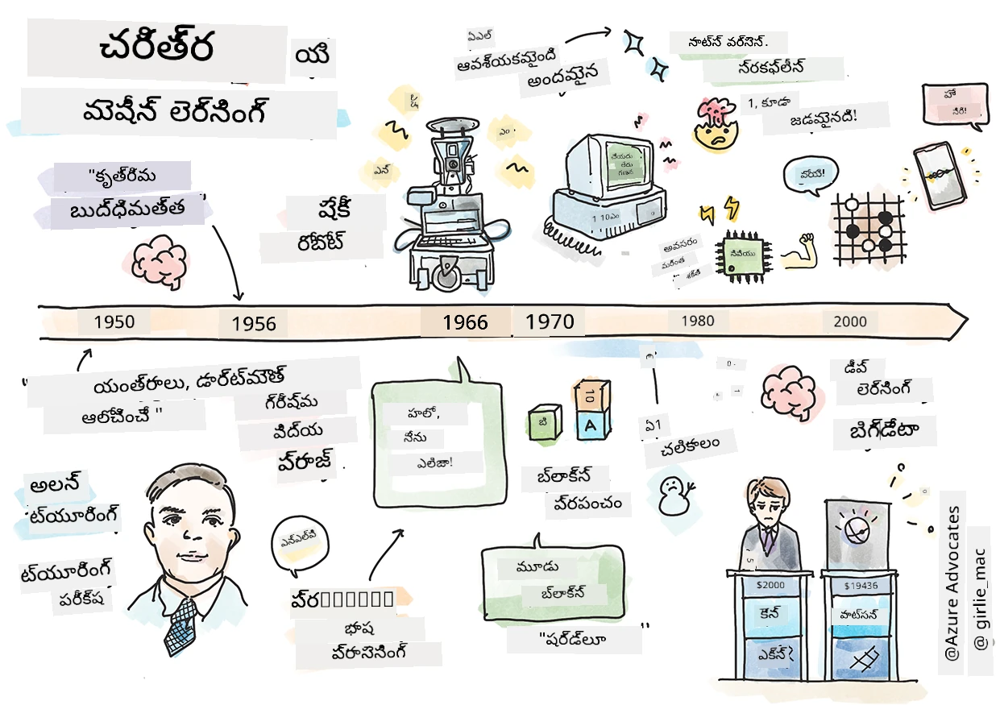
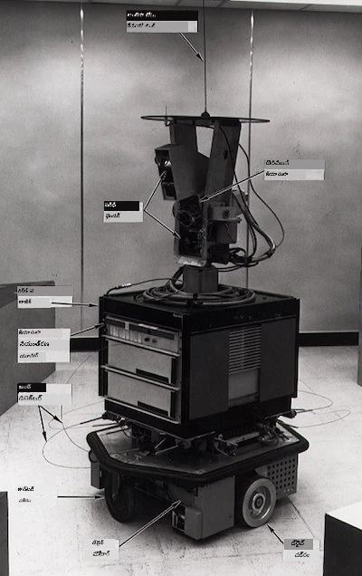
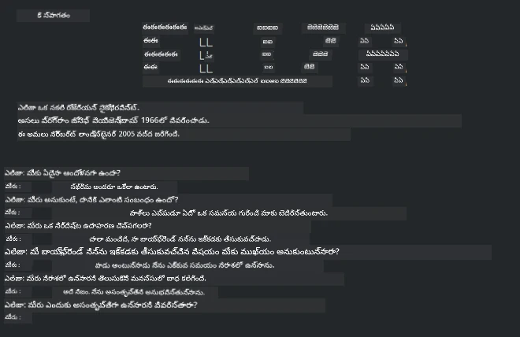

# మెషీన్ లెర్నింగ్ చరిత్ర

> స్కెచ్‌నోట్ [టొమోమి ఇమురా](https://www.twitter.com/girlie_mac) ద్వారా

## [పాఠం ముందు క్విజ్](https://ff-quizzes.netlify.app/en/ml/)

---

> 🎥 ఈ పాఠంలో పనిచేసే చిన్న వీడియో కోసం పై చిత్రంపై క్లిక్ చేయండి.

ఈ పాఠంలో, మేము మెషీన్ లెర్నింగ్ మరియు ఆర్టిఫిషియల్ ఇంటెలిజెన్స్ చరిత్రలో ప్రధాన మైలురాళ్లను పరిశీలిస్తాము.

ఆర్టిఫిషియల్ ఇంటెలిజెన్స్ (AI) రంగంగా ఉన్న చరిత్ర మెషీన్ లెర్నింగ్ చరిత్రతో కలిసి ఉంటుంది, ఎందుకంటే ML ని ఆధారపెట్టే అల్గోరిథములు మరియు గణనీయ ప్రగతులు AI అభివృద్ధికి తోడ్పడుతున్నాయి. ఈ రంగాలు 1950లలో వేరువేరుగా పరిశోధనా ప్రాంతాలుగా ప్రారంభమైనప్పటికీ, ముఖ్యమైన [అల్గోరిథమిక్, గణాంకా, గణిత, గణనీయ మరియు సాంకేతిక ఆవిష్కరణలు](https://wikipedia.org/wiki/Timeline_of_machine_learning) ఈ కాలాన్ని మించిపోయి సంభవించాయి మరియు అంతటికంటే ముందు కూడా ఉన్నాయి. నిజానికి, ఈ ప్రశ్నల గురించి ప్రజలు [వందల సంవత్సరాలుగా](https://wikipedia.org/wiki/History_of_artificial_intelligence) ఆలోచిస్తున్నారు: ఈ వ్యాసం 'ఆలోచించే యంత్రం' అనే ఆలోచన యొక్క చారిత్రక బౌద్ధిక పునాదులను చర్చిస్తుంది.

---
## ముఖ్యమైన ఆవిష్కరణలు

- 1763, 1812 [బేస్ సిద్ధాంతం](https://wikipedia.org/wiki/Bayes%27_theorem) మరియు దానికి సంబంధించిన ముందస్తు ఆవిష్కరణలు. ఈ సిద్ధాంతం మరియు దాని వినియోగాలు ప్రత్యక్షం మీద ఆధారపడే సంఘటన సంభవించే సంభావ్యతను వివరించేందుకు ఉపయోగపడతాయి.
- 1805 ఫ్రెంచ్ గణిత శాస్త్రజ్ఞుడు ఆద్రియన్-మారీ లెజాండ్ ద్వారా [లీస్ట్ స్క్వేర్ సిద్ధాంతం](https://wikipedia.org/wiki/Least_squares). మీరు మా రిగ్రెషన్ యూనిట్‌లో దీనిని నేర్చుకుంటారు, ఇది డేటాను సరిపోల్చడంలో సహాయపడుతుంది.
- 1913 రష్యన్ గణిత శాస్త్రజ్ఞుడు ఆండ్రే మార్కోవ్ పేరు మీద [మార్కోవ్ చైన్‌లు](https://wikipedia.org/wiki/Markov_chain), ఇది గత స్థితిపై ఆధారపడి సంభావ్య సంఘటనల శ్రేణిని వివరించడానికి ఉపయోగిస్తారు.
- 1957 అమెరికన్ మానసిక శాస్త్రవేత్త ఫ్రాంక్ రోసెన్‌బ్లాట్ ఆవిష్కరించిన ఒక రకమైన రేఖీయ వర్గీకరణ విధానం [పర్సెప్ట్రాన్](https://wikipedia.org/wiki/Perceptron), ఇది డీప్ లెర్నింగ్ అభివృద్ధికి ఆధారం.

---

- 1967 [నియర్‌స్ట నైబర్](https://wikipedia.org/wiki/Nearest_neighbor) ఒక అల్గోరిథం, మొదట భూమీ పుట మార్గాలు మ్యాప్ చేయడానికి రూపొందించబడింది. ML పరిధిలో ఇది నమూనాలను గుర్తించడంలో ఉపయోగిస్తారు.
- 1970 [బాక్ప్రొపగేషన్](https://wikipedia.org/wiki/Backpropagation) [ఫీట్‌ఫార్వర్డ్ న్యూరల్ నెట్‌వర్క్స్](https://wikipedia.org/wiki/Feedforward_neural_network)ను శిక్షణ ఇవ్వడానికి ఉపయోగిస్తారు.
- 1982 [రეკరెంట్ న్యూరల్ నెట్‌వర్క్స్](https://wikipedia.org/wiki/Recurrent_neural_network) ఫీట్‌ఫార్వర్డ్ న్యూరల్ నెట్‌వర్క్‌ల నుండి ఉత్పన్నమయ్యిన ఆర్టిఫిషియల్ న్యూరల్ నెట్‌వర్క్‌లు, ఇవి కాల తర సంబంధ గ్రాఫ్‌లను సృష్టిస్తాయి.

✅ కొద్దిగా పరిశోధన చేయండి. మెషీన్ లెర్నింగ్ మరియు AI చరిత్రలో మరిన్ని కీలక రუჩిక రోజులేమిటో తెలుసుకోండి.

---
## 1950: ఆలోచించే యంత్రాలు

అలన్ ట్యూరింగ్, 20వ శతాబ్దపు అగ్రశ్రేణి శాస్త్రవేత్తగా [ ప్రజల చేత 2019లో](https://wikipedia.org/wiki/Icons:_The_Greatest_Person_of_the_20th_Century) ఎన్నుకోబడ్డ అద్భుత వ్యక్తి, 'ఆలోచించే యంత్రం' అనే భావనకు ప్రాతిపదిక వేసిన వ్యక్తిగా గుర్తించబడుతాడు. ఈ భావనకు సాక్ష్యాలతో ఎదుర్కొనడానికి అతను [ట్యూరింగ్ పరీక్ష](https://www.bbc.com/news/technology-18475646)ని సృష్టించాడు, దీన్ని మీరు మా NLP పాఠాలలో అన్వేషిస్తారు.

---
## 1956: డార్తమ్ సం స 연구 프로젝트

"డార్తమ్ సమ్మర్ రీసెర్చ్ ప్రాజెక్ట్ ఆన్ ఆర్టిఫిషియల్ ఇంటెలిజెన్స్ ఒక రంగంగా ఆర్టిఫిషియల్ ఇంటలిజెన్స్ కోసం సంకేతాత్మక సంఘటన," ఇక్కడే 'ఆర్టిఫిషియల్ ఇంటెలిజెన్స్' అనే పదం కనిపించింది ([ మూలం ](https://250.dartmouth.edu/highlights/artificial-intelligence-ai-coined-dartmouth)).

> నేర్చుకోవడమనేది లేదా బుద్ధి యొక్క ఇతర లక్షణం ఏదైనా సూత్రప్రాయంగా అంతగా వివరించబడగలదు, యంత్రం దాన్ని అనుకరించగలదు.

---

ప్రధాన పరిశోధకుడు గణితం అధ్యాపకుడు జాన్ మాకార్థి, "నిలువుతున్న పునాది మీద ముందడుగు వేయాలని ఆశించారు, నేర్చుకోవడమంతా లేదా తెలివి లక్షణం సూత్రప్రాయంగా అంతగా వివరించబడితే యంత్రం దాన్ని అనుకరించగలదు". ఇందులో మరొక ప్రముఖుడు మార్విన్ మిన్స్కీ కూడా భాగము.

వర్క్‌షాప్ లక్షణాత్మక పద్ధతుల ఎదుగుదలను ప్రేరేపించినట్టు కూడా చెప్పబడింది, ఇందులో "సంకేతాత్మక పద్ధతులు, పరిమిత ప్రాంతాలపై కేంద్రీకృత వ్యవస్థలు (ప్రారంభ నిపుణుల వ్యవస్థలు), మరియు గణనాత్మక విశ్లేషణ వ్యతిరేక పద్ధతులు" చర్చలూ ఉన్నాయి. ([ మూలం ](https://wikipedia.org/wiki/Dartmouth_workshop)).

---
## 1956 - 1974: "సువర్ణ యుగం"

1950ల నుండి మధ్య 70లవరకు, AI అనేక సమస్యలను పరిష్కరించగలనని ఆశలు ఉన్నట్లు ఉన్నవి. 1967లో మార్విన్ మిన్స్కీ ధైర్యంగా పేర్కొన్నారు, "ఒక తరం లోపల ... 'ఆర్టిఫిషియల్ ఇంటెలిజెన్స్' సృష్టించడంలో సమస్యలు సాదారణంగా పరిష్కరించబడతాయి." (మిన్స్కీ, మార్విన్ (1967), కంప్యూటేషన్: ఫినైట్ అండ్ ఇన్ఫినిట్ మెషీన్స్, ఎంగిల్వుడ్ క్లిఫ్స్, N.J.: ప్రెంటిస్-హాల్)

సహజ భాషా ప్రాసెసింగ్ పరిశోధన విజృంభించింది, శోధన మరింత శక్తివంతమయ్యింది, మరియు 'మైక్రో-విశ్వాలు' అనే భావన సృష్టించబడింది, ఇక్కడ కొత్త పనులు సాధారణ భాషా సూచనలతో పూర్తి చేయబడ్డాయి.

---

పరిశోధన ప్రభుత్వ సంస్థల ద్వారా బాగా నిధి పొందింది, గణనశక్తి మరియు అల్గోరిథముల అభివృద్ధి జరిగింది, మరియు తెలివైన యంత్రాల నమూనాలు నిర్మించబడ్డాయి. కొన్ని యంత్రాలు:

* [షేకీ రోబోట్](https://wikipedia.org/wiki/Shakey_the_robot), ఎక్కడు మెలుకు తీసుకుని పనులు 'తెలివిగా' చేయగలిగింది.

    
    > 1972లో షేకీ

---

* ఎలిజా, ఒక ప్రారంభ 'చాటర్‌బాట్', ప్రజలతో సంభాషించగలిగింది మరియు ప్రాథమిక 'థెరపిస్ట్'గా వ్యవహరించింది. మీరు NLP పాఠాల్లో ఎలిజా గురించి మరింత తెలుసుకుంటారు.

    
    > ఎలిజా యొక్క ఒక వెర్షన్, చాట్బాట్

---

* "బ్లాక్స్ వరల్డ్" ఒక మైక్రో-విశ్వ ఉదాహరణ, ఇక్కడ బ్లాక్స్ నిల్వ చేసి వర్గీకరించవచ్చునని మరియు యంత్రాలను నిర్ణయాలు తీసుకునేలా నేర్పే ప్రయోగాలు జరపబడతాయి. [SHRDLU](https://wikipedia.org/wiki/SHRDLU) వంటి గ్రంథాలయాలతో అభివృద్ధులు భాషా ప్రాసెసింగ్‌ను ముందుకు తీసుకెళ్లాయి.

    

    > 🎥 పై చిత్రంపై క్లిక్ చేయండి వీడియో కోసం: SHRDLUతో బ్లాక్స్ వరల్డ్

---
## 1974 - 1980: "AI శీతాకాలం"

1970ల మధ్యలో, 'తెలివైన యంత్రాలు' సృష్టించడంలో క్లిష్టత తక్కువ అంచనా వేసినట్లు మారింది మరియు అందుబాటులో ఉన్న కంప్యూట్ శక్తి మార్చడంలో పెద్ద ప్రమాణంలో వాగ్దానం తప్పిపోయింది. నిధులు తగ్గిపోయాయి మరియు రంగం పట్ల నమ్మకం తగ్గిపోయింది. నమ్మకంపై ప్రభావం చూపిన కొన్ని సమస్యలు:
---
- ** పరిమితులు **. కంప్యూట్ శక్తి చాల తక్కువ.
- ** కాంబినేటోరియల్ పేలుడు **. కంప్యూటర్ల నుంచి బాగా అడగబడడమే పెరిగినప్పుడూ శిక్షణ పొందాల్సిన పరామితులు పెద్ద సంఖ్యలో పెరిగాయి, కానీ కంప్యూట్ శక్తి మరియు సామర్థ్యం సమాంతరంగా పెరగలేదు.
- ** డేటా చాలా తక్కువ **. అల్గోరిథముల పరీక్ష, అభివృద్ధి మరియు తీర్చిదిద్దడం అంతరాయం కలిగింది.
- ** మనం సరైన ప్రశ్నలు అడుగుతున్నామా? **. అడిగిన ప్రశ్నలే ఆందోళన కలిగించాయి. పరిశోధకుల దృష్టికోణాలపై విమర్శలు వచ్చాయి:
  - ట్యూరింగ్ పరీక్షలు ఇతర ఆలోచనలతో కూడిన 'చైనీస్ రూమ్ థియరీ' వల్ల సందేహాలు పొందాయి, దీనికి అనుగుణంగా "డిజిటల్ కంప్యూటర్ ప్రోగ్రామింగ్ భాషను అర్ధం చేసుకున్నట్టు చూపించవచ్చు కానీ నిజమైన అర్ధం ఇవ్వదు." ([ మూలం ](https://plato.stanford.edu/entries/chinese-room/))
  - "థెరపిస్ట్" ఎలిజా వంటి ఆర్టిఫిషియల్ ఇంటెలిజెన్స్‌లను సమాజంలో ప్రవేశపెట్టడంపై నైతికతమీద సవాలు వచ్చింది.

---

అదే సమయంలో, వివిధ AI ఆలోచనా పాఠశాలలు ఏర్పడనున్నాయి. ["స్క్రఫీ" మరియు "నీట్ AI"](https://wikipedia.org/wiki/Neats_and_scruffies) ప్రయోగాల మధ్య వివక్ష ఏర్పడింది. _స్క్రఫీ_ లాబ్‌లు గోల్‌ సాధించే వరకు గంటల తరబడి ప్రోగ్రామ్‌లను సవరించేవి. _నీట్_ లాబ్‌లు "లాజిక్ మరియు సరైన సమస్య పరిష్కరణపై దృష్టి సారించేవి". ఎలిజా మరియు SHRDLU ప్రసిద్ధ _స్క్రఫీ_ వ్యవస్థలు. 1980లలో, ML వ్యవస్థలను పునరుత్పాదకంగా చేయాలనే డిమాండ్ రావడంతో, _నీట్_ విధానం ముందుంటుంది, దాని ఫలితాలు మరింత వివరణాత్మకంగా ఉంటాయి.

---
## 1980లు నిపుణుల వ్యవస్థలు

రంగం అభివృద్ధి చెందడంతో, దీని వ్యాపార ప్రయోజనం స్పష్టమైంది, మరియు 1980లలో 'నిపుణుల వ్యవస్థలు' విస్తరించాయి. "నిపుణుల వ్యవస్థలు మొదటి వాస్తవ విభాగాలైన ఆర్టిఫిషియల్ ఇంటెలిజెన్స్ (AI) సాఫ్ట్‌వేర్" అని చెప్పబడింది. ([ మూలం ](https://wikipedia.org/wiki/Expert_system)).

ఈ రకం వ్యవస్థ వాస్తవానికి _హైబ్రిడ్_, ఇందులో క్రమంగా వ్యాపార అవసరాలను నిర్వచించే రూల్స్ ఇంజిన్ మరియు కొత్త నిజాలు గమనించే ఇన్ఫరెన్స్ ఇంజిన్ ఉంటుంది.

ఈ యుగంలో న్యూరల్ నెట్‌వర్క్స్ మీద కూడా ఎక్కువ శ్రద్ధ ఉంచబడింది.

---
## 1987 - 1993: AI 'తణుకు'

ప్రత్యేక నిపుణుల వ్యవస్థల హార్డ్వేర్ విస్తీర్ణం చాలా ప్రత్యేకమైనదిగా మారింది. పర్సనల్ కంప్యూటర్లు కూడా పెద్ద, ప్రత్యేక, కేంద్రనీయ వ్యవస్థలతో పోటీ పూర్తి చేయడంతో, కంప్యూటింగ్ ప్రజాదరణ ప్రారంభమైంది, మరియు ఇది పెద్ద డేటా విస్తరణకు దారి తీసింది.

---
## 1993 - 2011

ఈ కాలం ML మరియు AIకి ఒక కొత్త యుగాన్ని తెచ్చింది, ఇంతకు ముందు డేటా మరియు గణన శక్తి తక్కువగా ఉండటం వల్ల సృష్టమైన సమస్యలను పరిష్కరించడానికి. డేటా పరిమాణం వేగంగా పెరిగింది మరియు విస్తృతంగా అందుబాటులోకి వచ్చింది, ముఖ్యంగా 2007 స్మార్ట్‌ఫోన్ ప్రఖ్యాతితో. గణన శక్తి అనుపాతంగా పెరిగింది, అల్గోరిథములు కూడా అభివృద్ధి చెందాయి. రంగం ప్రౌఢిగా మారింది, గతపు స్వేచ్ఛా రోజులు క్రమంగా ఒక నిజమైన శాస్త్రంగా మారాయి.

---
## ఇప్పుడు

ఈ రోజు మెషీన్ లెర్నింగ్ మరియు AI మన జీవితాలలో ప్రతి భాగాన్ని స్పర్శిస్తున్నాయి. ఈ యుగం ఈ అల్గోరిథముల వల్ల మానవ జీవితాలపై వచ్చే ప్రమాదాలు మరియు సానుకూల ప్రభావాలను జాగ్రత్తగా అర్థం చేసుకోవాలనిస్తుంది. మైక్రోసాఫ్ట్‌ బ్రాడ్ స్మిత్ చెప్పినట్లుగా, "సాంకేతికత ప్రైవసీ మరియు వ్యక్తి స్వేచ్ఛలను వంటి ప్రాథమిక మానవ హక్కుల రక్షణకు సంబంధించిన సమస్యలను చర్యలకు తీసుకుంటుంది. ఈ సమస్యలు ఈ ఉత్పత్తులను సృష్టించే టెక్ కంపెనీల బాధ్యతను పెంచాయి. మా దృష్టిలో, వారు ఆలోచనయుక్త ప్రభుత్వ నియంత్రణ మరియు అనుకూల ఉపయోగాల చుట్టూ నియమాలు అభివృద్ధి చేయడం అవసరం" ([ మూలం ](https://www.technologyreview.com/2019/12/18/102365/the-future-of-ais-impact-on-society/)).

---

భవిష్యత్తు ఏమైతే అనేది చూద్దాం, కానీ ఈ కంప్యూటర్ వ్యవస్థలు, అవి నడుపుతున్న సాఫ్ట్‌వేర్ మరియు అల్గోరిథములను అర్థం చేసుకోవడం అవసరం. ఈ పాఠ్యक्रमం మీరు మంచి అవగాహన పొందడంలో సహాయపడుతుందని ఆశిస్తున్నాము, తద్వారా మీరు మీకటే నిర్ణయించవచ్చు.

> 🎥 ఈ పాఠంలో యాన్ లెకన్ డీప్ లెర్నింగ్ చరిత్రను చర్చిస్తున్న వీడియో కోసం పై చిత్రంపై క్లిక్ చేయండి

---
## 🚀సవాలు

ఈ చారిత్రక క్షణాలలో ఒకదానిని ఎంచుకుని అక్కడి వ్యక్తుల గురించి మరింత తెలుసుకోండి. ఆసక్తికరమైన వ్యక్తులు ఉన్నారు, మరియు ఎలాంటి శాస్త్రీయ ఆవిష్కరణ కూడా సాంస్కృతిక వాక్యూమ్ లో సృష్టించబడలేదు. మీరు ఏమి కనుగొన్నారు?

## [పాఠం తర్వాత క్విజ్](https://ff-quizzes.netlify.app/en/ml/)

---
## సమీక్ష & స్వయంసహాయం

చూడడానికి మరియు వినడానికి ఇక్కడ ఉన్నాయి:

[ఈ పోडकాస్ట్‌లో ఎమీ బాయిడ్ AI అభివృద్ధి గురించి చర్చిస్తున్నారు](http://runasradio.com/Shows/Show/739)

---

## అసైన్కెంట్

[ఒక టైమ్‌లైన్ సృష్టించండి](assignment.md)

---

<!-- CO-OP TRANSLATOR DISCLAIMER START -->
**అస్వీకరణ**:
ఈ పత్రం AI అనువాద సేవ [Co-op Translator](https://github.com/Azure/co-op-translator) ఉపయోగించి అనువదించబడింది. మేము ఖచ్చితత్వానికి ప్రయత్నిస్తున్నప్పటికీ, ఆటోమేటెడ్ అనువాదాలు తప్పులు లేదా అసమగ్రతలను కలిగి ఉండవచ్చు. దాని స్వదేశ భాషలో ఉన్న అసలు పత్రాన్ని అధికారం కలిగిన మూలంగా పరిగణించాలి. కీలకమైన సమాచారం కోసం, ప్రొఫెషనల్ మానవ అనువాదాన్ని సిఫారసు చేస్తాము. ఈ అనువాదం ఉపయోగం వల్ల కలిగే ఏవైనా అపార్థాలు లేదా తప్పుదారులు కోసం మేము బాధ్యత వహించము.
<!-- CO-OP TRANSLATOR DISCLAIMER END -->