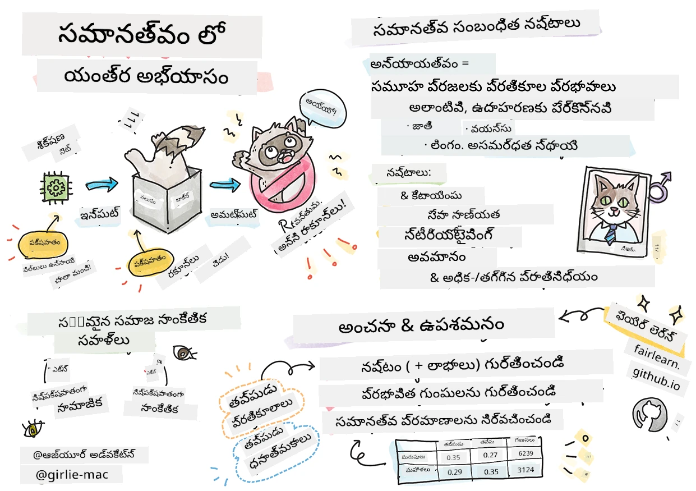
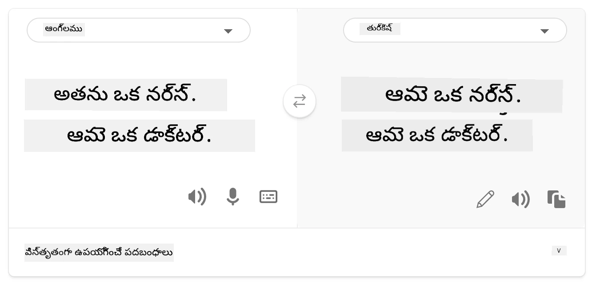
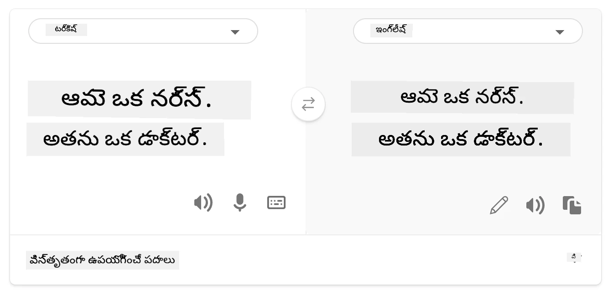
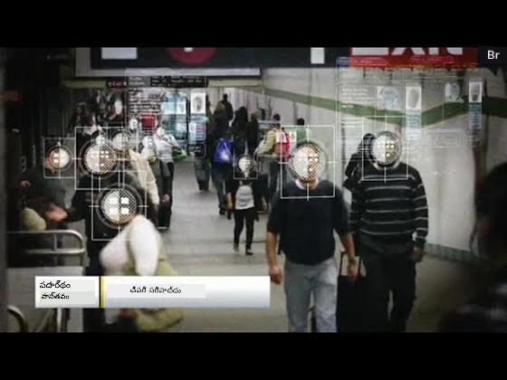

# బాధ్యతాయుత AIతో మెషీన్ లెర్నింగ్ పరిష్కారాలను నిర్మించడం
 

> స్కెచ్‌నోట్ రచయిత [Tomomi Imura](https://www.twitter.com/girlie_mac)

## [పాఠం ముందు క్విజ్](https://ff-quizzes.netlify.app/en/ml/)
 
## పరిచయం

ఈ కోర్సులో, మీరు మెషీన్ లెర్నింగ్ ఎలా ఆ మరియు మన రోజువారీ జీవితాలను ప్రభావితం చేస్తున్నదో కనుగొనడం ప్రారంభిస్తారు. ఇప్పటివరకు కూడా, వ్యవస్థలు మరియు మోడల్స్ ఆరోగ్య పరీక్షలు, ఋణ ఆమోదాలు లేదా మోసాన్ని కనుగొనడం వంటి రోజువారీ నిర్ణయం తీసుకునే పనుల్లో భాగమయ్యాయి. కాబట్టి, ఈ మోడల్స్ బాగా పనిచెయ్యడం, విశ్వసనీయమైన ఫలితాలను అందించడం చాలా ముఖ్యం. ఏ సాఫ్ట్వేర్ అప్లికేషన్ లాగే, AI వ్యవస్థలు కూడా అనుకున్నట్టుగా కాకపోవచ్చు లేదా అనుకోని ఫలితాలను ఇవ్వవచ్చు. అందుకే, AI మోడల్ ప్రవర్తనను అర్థం చేసుకోవడం మరియు వివరిస్తే కావాలి.

మీరు ఉపయోగించే డేటా కొన్ని వర్గాల వంటి వర్గాలు లేని లేదా అసంతులితంగా సూచించే వర్గాలు ఉంటే ఏమవుతుంది అనుకుంటే చూడండి. మోడల్ అవుట్‌పుట్ కొంత వర్గానికి అనుకూలంగా ఉండటం ఎలా అనిపిస్తే? ఆ అప్లికేషన్‌కు దాని పరిణామం ఏమిటి? అదనంగా, మోడల్ ఒక ప్రతికూల ఫలితాన్ని ఇవ్వగలిగితే అది మనుషులకి హానికరం అయితే ఏమవుతుంది? AI వ్యవస్థ ప్రవర్తనకు ఎవరు బాధ్యత వహించాలి? ఈ ప్రశ్నలు ఈ కోర్సులో పాల్గొంటము.

ఈ పాఠంలో మీరు:

- మెషీన్ లెర్నింగ్ లో న్యాయం మరియు న్యాయ సంబంధ హానుల ప్రాముఖ్యాన్ని మీ అవగాహన పెంచుకోండి.
- విశ్వసనీయత మరియు భద్రత కోసం అవుట్‌లైయర్స్ మరియు అసాధారణ పరిస్థితులను అన్వేషించడానికి అలవాటు పడండి.
- అందరికీ సాధ్యమైన విధంగా వ్యవస్థలను డిజైన్ చేసి మరియు శక్తివంతం చేయడం అవసరమని అర్థం చేసుకోండి.
- డేటా మరియు ప్రజల గోప్యత మరియు భద్రతను రక్షించడం ఎంత ముఖ్యమో తెలుసుకోండి.
- AI మోడల్స్ ప్రవర్తనను వివరించడానికి గ్లాస్ బాక్స్ విధానాన్ని అనుసరించడం ప్రాముఖ్యాన్ని చూడండి.
- AI వ్యవస్థలపై విశ్వాసాన్ని నిర్మించేందుకు బాధ్యత తలపెట్టడం అవసరం అని జాగ్రత్తగా ఉండండి.

## అవసరమైన మార్గదర్శకం

అవసరమైన మార్గదర్శకంగా, "బాధ్యతాయుత AI సూత్రాలు" నేర్చుకునే పాఠ్యాన్ని తీసుకోండి మరియు క్రింది వీడియో చూడండి:

ఈ [అభ్యాస పాఠ్యాన్ని](https://docs.microsoft.com/learn/modules/responsible-ai-principles/?WT.mc_id=academic-77952-leestott) అనుసరించి బాధ్యతాయుత AI గురించి మరింత తెలుసుకోండి

> 🎥 వీడియో కోసం పైచిత్రం క్లిక్ చేయండి: Microsoft యొక్క బాధ్యతాయుత AI దృష్టికోణం

## న్యాయం

AI వ్యవస్థలు అందరికీ సమానంగా వ్యవహరించాలి మరియు సమానమైన వర్గాల ప్రజలపై విభిన్న ভাবে ప్రభావితం కాకూడదు. ఉదాహరణకు, AI వ్యవస్థలు వైద్య చికిత్స, ఋణ రావడంలో లేదా ఉద్యోగంలో మార్గదర్శనం చేస్తే, ఒకటే లక్షణాలు, ఆర్థిక పరిస్థితులు లేదా నైపుణ్యాలు ఉన్న ప్రతి ఒక్కరికి సమాన సూచనలు ఇవ్వాలి. ప్రతి మనిషి లోపలే వారసత్వపు పక్షపాతాలు ఉంటాయి, ఇవి మన నిర్ణయాలకు మరియు చర్యలకు ప్రభావం చూపుతాయి. ఈ పక్షపాతాలు తరచుగా AI వ్యవస్థలను శిక్షణ ఇవ్వడానికి ఉపయోగించే డేటాలో కనిపిస్తాయి. ఇలాంటి మానిప్యులేషన్ అవివేచనగా జరుగుతుంది. మీరు డేటాలో పక్షపాతం చేర్చేసినపుడు అవి స意识గా గమనించటం చాలా కష్టం.

**“అన్యాయత”** అంటే కొన్ని వర్గాల వ్యక్తులకు ప్రతికూల ప్రభావాలు లేదా "హానులు", ఉదాహరణకు జాతి, లింగం, వయస్సు లేదా లోపల గల వికలాంగత స్థితి తో నిర్వచించబడినవారు. ప్రధాన న్యాయ సంబంధ హానులను కింది విధంగా వర్గీకరించవచ్చు:

- **పంపిణీ**, ఉదాహరణకు ఒక లింగం లేదా జాతి మరొకటి కంటే ప్రాధాన్యమిచ్చినప్పుడు.
- **సేవ యొక్క నాణ్యత**. మీరు ఒక ప్రత్యేక పరిస్థితి కోసం డేటా శిక్షణ ఇస్తే కానీ వాస్తవం చాలా క్లిష్టంగా ఉంటే, అది సేవ పనితీరులో కొంత లోపం కలిగిస్తుంది. ఉదాహరణకి, చర్మం గోకోట్లవంటి వ్యక్తులను గుర్తించలేకపోయే హ్యాండ్ సోప్ డిస్పెన్సర్. [సూచి](https://gizmodo.com/why-cant-this-soap-dispenser-identify-dark-skin-1797931773)
- **తరిగింపు**. ఏదో లేదా ఎవరినైనా అన్యాయంగా విమర్శించడం మరియు తగులికట్టడం. ఉదాహరణకి, పട చిత్రాలను పొరపాటుగా గుర్తింపు సాంకేతికత చీకటి చర్మం గల వ్యక్తులని గోరీళ్లుగా లేబుల్ చేసింది.
- **అధిక లేదా తక్కువ ప్రతినిధిత్వం**. ఒక నిర్దిష్ట వృత్తిలో ఒక వర్గం కనిపించకపోవడం, అందువల్ల ఆ వర్గానికి సంబంధించిన సేవ లేదా ఫంక్షన్ హాని కలిగిస్తుంది.
- **స్టీరియోటైపింగ్**. ఒక నిర్దిష్ట వర్గాన్ని ముందే తేల్చుకున్న లక్షణాలతో కలపడం. ఉదాహరణకి, ఇంగ్లిష్ నుంచి టర్కిష్ భాషా అనువాదం చేసే వ్యవస్థ లింగంతో సంబంధం ఉన్న స్టీరియోటైపిక్ పదాల వలన పొరపాట్లు కలగడం.

> తుర్కీష్ కు అనువాదం

> మళ్లీ ఇంగ్లీష్ కు అనువాదం

AI వ్యవస్థలను రూపకల్పన మరియు పరీక్షలో, AI న్యాయమైన మరియు పక్షపాత లేదా వివక్షాత్మక నిర్ణయాలు ఇవ్వకుండా ఉండేలా చూడాలి, మరియు మనుష్యులు కూడా ఇలాంటి నిర్ణయాలు తీసుకోవడానికి అనుమతించబడరు. AI మరియు మెషీన్ లెర్నింగ్ లో న్యాయాన్ని నిర్ధారించడం ఒక సంక్లిష్ట సామాజిక సాంకేతిక సవాలు.

### విశ్వసనీయత మరియు భద్రత

విశ్వాసం నిర్మించడానికి, AI వ్యవస్థలు సాధారణ మరియు అనుకోని పరిస్థితులలో విశ్వసనీయంగా, భద్రంగా మరియు స్థిరంగా ఉండాలి. వివిధ పరిస్థితుల్లో AI వ్యవస్థలు ఎలా ప్రవర్తిస్తాయో తెలుసుకోవడం ముఖ్యం, ముఖ్యంగా అవుట్‌లైయర్లు ఉన్నప్పుడు. AI పరిష్కారాలు నిర్మించేటప్పుడు, వారి ఎదురయ్యే పరిస్థులు ఎలా నిర్వహించాలో ఎక్కువ దృష్టి కావాలి. ఉదాహరణకు, స్వయం నడిచే కారు ప్రజల భద్రతను అత్యంత ప్రాధాన్యం గా పెట్టాలి. అందుకే, ఆ కారును నడపన AI అన్ని మాదిరి సంభవ పరిస్థితులు పరిశీలించాలి, ఉదాహరణకు రాత్రి, వర్షాలు, పిల్లలు వీధి దాటడం, పెంపుడు జంతువులు, రోడ్డు నిర్మాణాలు మొదలైనవి. AI వ్యవస్థ ఈ విస్తృత పరిస్థితులను ఎంత బాగా విశ్వసనీయంగా నిర్వహించగలదో డేటా శాస్త్రవేత్త లేదా AI అభివృద్ధి దారుడు వ్యవస్థ రూపకల్పనలో ఎన్ని అంచనాలు వేసుకున్నారో ప్రతిబింబిస్తుంది.

> [🎥 ఈ వీడియోను చూడటానికి ఇక్కడ క్లిక్ చేయండి: ](https://www.microsoft.com/videoplayer/embed/RE4vvIl)

### ఇంటిగ్రేటివ్నెస్ (అంతర్భాగం)

AI వ్యవస్థలు అందరిని కలుపుకోవడం మరియు శక్తిని నింపేలా రూపొందించాలి. AI రూపకల్పన మరియు అమలులో డేటా శాస్త్రవేత్తలు మరియు AI అభివృద్ధిపరులు తార్కికంగా ప్రజలను బయటపెట్టే అడ్డంకులను గుర్తించి వాటిని అధిగమిస్తారు. ఉదాహరణగా, ప్రపంచంలో 1 బిలియన్ మంది వికలాంగులు ఉన్నారు. AI అభివృద్ధితో, వారు వారీ రోజు జీవితాల్లో విస్తృత సమాచారం మరియు అవకాశాలను సులభంగా పొందగలుగుతారు. ఈ అడ్డంకులను తొలగించడం ద్వారా మంచి అనుభవాలు కలిగించే AI ఉత్పత్తులను రూపొందించే అవకాశాలు వస్తాయి.

> [🎥 AIలో ఇంటిగ్రేటివ్నెస్ వీడియో కోసం ఇక్కడ క్లిక్ చేయండి](https://www.microsoft.com/videoplayer/embed/RE4vl9v)

### భద్రత మరియు గోప్యత

AI వ్యవస్థలు భద్రంగా ఉండాలి మరియు ప్రజల గోప్యతను గౌరవించాలి. ప్రజలు తమ గోప్యత, సమాచారం లేదా జీవితాలు ప్రమాదంలో ఉంటే ఆ వ్యవస్థలు మీద తక్కువ విశ్వాసం పెడతారు. మెషీన్ లెర్నింగ్ మోడల్స్ శిక్షణకు డేటా వినియోగిస్తాం. అందువల్ల, డేటా మూలం మరియు అఖండత అన్వేషించడం అవసరం. ఉదాహరణకు, డేటా యూజర్ అందజేసినదా లేదా ప్రజలందుబాటులో ఉన్నదా? తదుపరి, డేటాతో పని చేసే సమయంలో, AI సిస్టమ్స్ గోప్యమైన సమాచారాన్ని రక్షించగలిగే విధంగా మరియు దాడులను ఎదుర్కొనగలిగే విధంగా రూపొందించాలి. AI పెరుగుతున్న కొద్దీ, గోప్యతను కాపాడటం మరియు వ్యక్తిగత, వ్యాపార డేటా భద్రతనియంత్రణ మరింత కీలకంగా మరియు సంక్లిష్టమవుతుంది. AIకి గోప్యతా మరియు డేటా భద్రత ముఖ్యమైనవి ఎందుకంటే AIకి మెరుగైన మరియు సరైన అంచనాలు తీసుకునేందుకు డేటా కు ప్రాప్తి అవసరం.

> [🎥 AI భద్రత వీడియో కోసం ఇక్కడ క్లిక్ చేయండి](https://www.microsoft.com/videoplayer/embed/RE4voJF)

- పరిశ్రమలో మేము గోప్యత మరియు భద్రతలో పరిశీలనీయమైన పురోగతులు సాధించాము, ముఖ్యంగా GDPR (సామాన్య డేటా రక్షణ నిబంధనలు) వంటి నియమాలతో.
- AI వ్యవస్థలతో మేము వ్యక్తిగతీకరణ మరియు గోప్యత మధ్య ఉద్వేగాన్ని గుర్తించాలి.
- ఇంటర్నెట్ తో కనెక్ట్ అయిన కంప్యూటర్ల పుట్టివేచేతటు, AIతో కూడిన భద్రతా సమస్యలు పెరుగుతున్నాయి.
- అదే సమయంలో, AI భద్రతను మెరుగుపరచడానికి ఉపయోగించబడుతున్నది. ఉదాహరణకు, చాలా ఆధునిక యాంటీ-వైరస్ స్కానర్లు AI హ్యూరిస్టిక్స్ తో నడుస్తున్నాయి.
- మా డేటా సైన్స్ ప్రక్రియలు తాజా గోప్యత మరియు భద్రత నిబంధనలతో సమన్వయంగా ఉండాలి.

### పారదర్శకత
AI వ్యవస్థలు అర్థమయ్యేలా ఉండాలి. పారదర్శకతకు ముఖ్యమైన భాగం AI వ్యవస్థల ప్రవర్తనను మరియు వాటి భాగాలను వివరించడం. AI వ్యవస్థల అర్థం చేసుకునే లేకుండా వాటి పనితీరు సమస్యలు, భద్రత, గోప్యతా చింతనలు, పక్షపాతాలు, తీసుకోకూడని విధానాలు లేదా అనుకోని ఫలితాలను గుర్తించటం కష్టం. AI వ్యవస్థలను ఉపయోగించే వారు ఎప్పుడు, ఎందుకు, ఎలా ఉపయోగిస్తారో నిజాయితీగా చెప్పాలి. వారు ఉపయోగించే వ్యవస్థల పరిమితులను కూడా తెలియజేయాలి. ఉదాహరణకు, బ్యాంకు ఎగ్జిక్యూటివ్ ఒక AI వ్యవస్థ వినియోగించి రుణ నిర్ణయాలను తీసుకుంటే, ఆ వ్యవస్థ పరిణామాలు, ఏ డేటా ప్రభావితం చేస్తుందో తెలుసుకోవడం ముఖ్యం. ప్రభుత్వాలు సంబంధిత పరిశ్రమలలో AIని నియంత్రించడం మొదలు పెట్టగా, డేటా శాస్త్రవేత్తలు మరియు సంస్థలు AI సిస్టమ్ నియంత్రక నిబంధనలకు అనుగుణంగా ఉందో లేదో వివరిచే బాధ్యత వహించాలి, ముఖ్యంగా అనుకోని ఫలితం ఉన్నప్పుడు.

> [🎥 AIలో పారదర్శకత వీడియో కోసం ఇక్కడ క్లిక్ చేయండి](https://www.microsoft.com/videoplayer/embed/RE4voJF)

- AI వ్యవస్థలు చాలా సంక్లిష్టమైనవిగా ఉండి, అవి ఎలా పనిచేస్తాయో అర్థం చేసుకోవడం మరియు ఫలితాలను విశ్లేషించడం కష్టంగా ఉంటుంది.
- అర్థం కాకపోవటం వాటి నిర్వహణ, ఉపయోగం మరియు డాక్యుమెంటేషన్ పై ప్రతికూల ప్రభావం చూపిస్తుంది.
- ఈ అర్థం మచ్చలు ముఖ్యంగా ఈ వ్యవస్థల ఫలితాలను ఉపయోగించి తీసుకునే నిర్ణయాలపై ప్రతికూల ప్రభావం చూపిస్తుంది.

### బాధ్యత
 
AI వ్యవస్థలను రూపకల్పన చేసి అమలు చేసే వారు తమ వ్యవస్థలు ఎలా పనిచేస్తాయో బాధ్యత వహించాలి. ముఖచిత్ర గుర్తింపు వంటి సున్నితమైన సాంకేతికతలకు బాధ్యత చాలా ముఖ్యము. ఇటీవల, అనేక ప్రాంతాల్లో ముఖచిత్ర గుర్తింపు సాంకేతికత కోసం డిమాండ్ పెరిగింది, ముఖ్యంగా పిల్లలు కనబడని సందర్భాలు కోసం. ఇంకా, ఈ సాంకేతికత ప్రభుత్వాలు వారు వారి పౌరుల మౌలిక స్వేచ్ఛలను ప్రమాదంలో పెట్టేందుకు ఉపయోగించవచ్చు, ఉదాహరణకు నిర్ధిష్ట వ్యక్తులపై నిరంతర సమీక్ష. అందుచేత, డేటా శాస్త్రవేత్తలు మరియు సంస్థలు తమ AI వ్యవస్థ వ్యక్తులకు లేదా సమాజానికి ప్రভাবం ఎంత తమ బాధ్యతగా భావించాలి.

> 🎥 వీడియో కోసం పైచిత్రం క్లిక్ చేయండి: ముఖచిత్ర గుర్తింపు ద్వారా భారీ పర్యవేక్షణ హెచ్చరికలు

చివరకి, AIని సమాజానికి సం�దిస్తూ మొదటి తరం మన సంతతి ఎంతో పెద్ద ప్రశ్నకు ఎదురు చూస్తున్నాం – కంప్యూటర్‌లు ప్రజలకూ బాధ్యత వహించడానికి ఎలా ఉండాలి మరియు కంప్యూటర్ రూపకల్పన దారులు ప్రతి ఒక్కరికీ బాధ్యత వహించేలా ఎలా చూడాలి.

## ప్రభావం అంచనా

మెషీన్ లెర్నింగ్ మోడల్ శిక్షణకు ముందుగా, AI వ్యవస్థ ప్రయోజనం, అవు ఉపయోగించబోవడం, ఎక్కడ అమలు అవుతుందో మరియు ఎవరు వ్యవస్థతో పరస్పరం ఉంటారో అర్థం చేసుకోవడానికి ప్రభావం అంచనాను నిర్వహించడం ముఖ్యం. ఇది వ్యవస్థను సమీక్షించే వారికి ప్రమాదాలు మరియు గమనిస్తున్న పరిణామాలు ఏమిటి అనే విషయాలను పరిశీలించడానికి ఉపయోగపడుతుంది.

ప్రభావం అంచనా సమయంలో కింది ప్రాంతాలు దృష్టి పెట్టవలసినవి:

* **వ్యక్తులపై ప్రతికూల ప్రభావం**. ఏవైనా పరిమితులు లేదా అవసరాలు, అసమర్థ వాడకం లేదా వ్యవస్థ పనితీరును అడ్డుకునే పరిమితులను గుర్తించడం ముఖ్యం, తద్వారానే తప్పదని ఉపయోగాన్ని నిరోధించడం.
* **డేటా అవసరాలు**. వ్యవస్థ ఎక్కడ మరియు ఎలా డేటాను ఉపయోగిస్తుందో అర్థం చేసుకోవడం, సమీక్షకులు నియమాలు మరియు ఆంక్షల (ఉదా. GDPR లేదా HIPAA) జాగ్రత్తలు తీసుకోవడానికి సహాయపడుతుంది. అదనంగా, శిక్షణకి సముచితం లేదా సరిపోతున్న డేటా వనరు యొక్క పరిమాణం పరిశీలించాలి.
* **ప్రభావ సారాంశం**. వ్యవస్థ వాడుకలో ప్రసంగించే హానుల జాబితాను సేకరించండి. ML జీవనచక్రంలో ఇబ్బందులు పరిష్కరించబడుతున్నాయో లేదా దృష్టిలో ఉన్నాయో సమీక్షించండి.
* **ఆరు ముఖ్య సూత్రాలకు అనుగుణంగా గోల్స్**. ప్రతి సూత్రానికి గోల్స్ పూర్తయ్యాయో లేదా లోపాలున్నాయో అంచనా వేయండి.

## బాధ్యతాయుత AIతో డీబగ్గింగ్  

సాఫ్ట్వేర్ అప్లికేషన్ డీబగ్గింగ్ లాగా, AI వ్యవస్థలో సమస్యలను గుర్తించడం మరియు పరిష్కరించడం అవసరం. మోడల్ అనుకున్నట్లు లేదా బాధ్యతాయుతంగా పని చేయకపోవటానికి అనేక కారణాలు ఉంటాయి. ఎక్కువగా స్థాణికతా ప్రమాణాలు మోడల్ పనితీరు యొక్క గణాంక సమ్మేళనాలు, అవి బాధ్యతాయుత AI సూత్రాలను లంఘించే విధానాన్ని విశ్లేషించేందుకు తగినవి కావు. అంతేకాదు, మెషీన్ లెర్నింగ్ మోడల్ ఒక బ్లాక్ బాక్స్ లాంటిది, దాని ఫలితానికి కారణమయ్యే అంశాల వివరాలు అర్థం చేసుకోవడం కష్టం. తరువాత ఈ కోర్సులో, బాధ్యతాయుత AI డ్యాష్‌బోర్డ్స్ ఉపయోగించి AI వ్యవస్థలను డీబగ్గింగ్ చేయడం నేర్చుకుంటాము. ఈ డ్యాష్‌బోర్డ్ డేటా శాస్త్రవేత్తలు మరియు AI అభివృద్ధిపరులకు సమగ్ర టూల్ అందిస్తుంది:

* **పొరపాటు విశ్లేషణ**. వ్యవస్థ న్యాయం లేదా విశ్వసనీయతపై ప్రభావం చూపే పొరపాటు పంపిణీని గుర్తించడానికి.
* **మోడల్ అవలోకనం**. డేటా వర్గాల మధ్య మోడల్ పనితీరులో అంతరం ఉన్న ప్రాంతాలను కనుగొనటానికి.
* **డేటా విశ్లేషణ**. డేటా పంపిణీని అర్థం చేసుకుని, న్యాయం, అంతర్ప్రవేశ, విశ్వసనీయత సమస్యలకు దారి తీయగలిగే పక్షపాతాన్ని గుర్తించడానికి.
* **మోడల్ వివరణాత్మకత**. మోడల్ అంచనాలపై ప్రభావం చూపే కారణాలను అర్థం చేసుకోవడానికి. ఇది మోడల్ ప్రవర్తనను వివరించడం సహాయపడుతుంది, ఇది పారదర్శకత మరియు బాధ్యతకు ముఖ్యమైనది.

## 🚀 సవాలు  
 
హానులను ముందుగా తప్పించే విధంగా మనం:

- వ్యవస్థలపై పనిచేసే ప్రజలలో విభిన్న నేపథ్యాలు మరియు దృష్టికోణాలు ఉన్నట్టుండేటట్లు చూసుకోవాలి
- మన సమాజ విభిన్నతలను ప్రతిబింబించే డేటాసెట్లలో పెట్టుబడి పెట్టాలి
- మెషీన్ లెర్నింగ్ జీవనచక్రం అంతటా బాధ్యతాయుత AIని గుర్తించి సరిదిద్దేందుకు మెరుగైన పద్ధతులు అభివృద్ధి చేయాలి

ఒక మోడల్ అవిశ్వసనీయత స్పష్టంగా కనిపించే శాస్త్ర మరియు వాడుక సందర్భాల గురించి ఆలోచించండి. ఇంకేమి పరిగణించాలి?

## [పాఠం తర్వాత క్విజ్](https://ff-quizzes.netlify.app/en/ml/)

## సమీక్ష & స్వఅధ్యయనం  
 

ఈ పాఠంలో, మీరు మిషన్ లెర్నింగ్‌లో సరసమైన మరియు అసరసమైన భావనల కొంత మౌలికాలు నేర్చుకున్నారు.  
 
ఈ వీడియో వర్క్షాప్‌ను వీక్షించి విషయాలను మరింత లోతుగా అర్థం చేసుకోండి: 

- బాధ్యతగల AI కోసం తపించడంలో: Besmira Nushi, Mehrnoosh Sameki మరియు Amit Sharma చేత సూత్రాలను ఆచరణలోకి తీసుకువెళ్లడం

> 🎥 వీడియో కోసం పై చిత్రం క్లిక్ చేయండి: Besmira Nushi, Mehrnoosh Sameki, మరియు Amit Sharma ద్వారా బాధ్యతగల AI టూల్‌బాక్స్: ఓపెన్శోర్స్ ఫ్రేమ్‌వర్క్

అదనంగా చదవండి: 

- Microsoft యొక్క RAI రిసోర్స్ సెంటర్: [బాధ్యతగల AI వనరులు – Microsoft AI](https://www.microsoft.com/ai/responsible-ai-resources?activetab=pivot1%3aprimaryr4) 

- Microsoft యొక్క FATE పరిశోధనా గుంపు: [FATE: ఎఫైర్‌నెస్, అకౌంటబిలిటీ, పారదర్శకత మరియు AIలో నైతికత - Microsoft రీసర్చ్](https://www.microsoft.com/research/theme/fate/) 

RAI టూల్‌బాక్స్: 

- [బాధ్యతగల AI టూల్‌బాక్స్ GitHub రిపాజిటరీ](https://github.com/microsoft/responsible-ai-toolbox)

Azure Machine Learning యొక్క సరసత్వాన్ని నిర్ధారించే టూల్స్ గురించి చదవండి:

- [Azure Machine Learning](https://docs.microsoft.com/azure/machine-learning/concept-fairness-ml?WT.mc_id=academic-77952-leestott) 

## అస్సైన్మెంట్

[RAI టూల్‌బాక్స్ అన్వేషించండి](assignment.md)

---

<!-- CO-OP TRANSLATOR DISCLAIMER START -->
**అస్వీకరణ**:
ఈ పత్రం AI అనువాద సేవ [Co-op Translator](https://github.com/Azure/co-op-translator) ఉపయోగించి అనువదించబడింది. మేము ఖచ్చితత్వానికి ప్రయత్నిస్తున్నప్పటికీ, ఆటోమేటెడ్ అనువాదాలు తప్పులు లేదా అసమగ్రతలను కలిగి ఉండవచ్చు. దాని స్వదేశ భాషలో ఉన్న అసలు పత్రాన్ని అధికారం కలిగిన మూలంగా పరిగణించాలి. కీలకమైన సమాచారం కోసం, ప్రొఫెషనల్ మానవ అనువాదాన్ని సిఫారసు చేస్తాము. ఈ అనువాదం ఉపయోగం వల్ల కలిగే ఏవైనా అపార్థాలు లేదా తప్పుదారులు కోసం మేము బాధ్యత వహించము.
<!-- CO-OP TRANSLATOR DISCLAIMER END -->