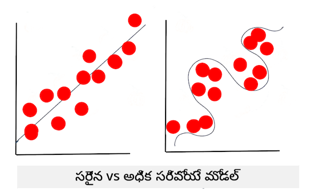

<!--
CO_OP_TRANSLATOR_METADATA:
{
  "original_hash": "9d91f3af3758fdd4569fb410575995ef",
  "translation_date": "2025-12-19T13:34:27+00:00",
  "source_file": "1-Introduction/4-techniques-of-ML/README.md",
  "language_code": "te"
}
-->
# మెషీన్ లెర్నింగ్ సాంకేతికతలు

మెషీన్ లెర్నింగ్ మోడల్స్ మరియు అవి ఉపయోగించే డేటాను నిర్మించడం, ఉపయోగించడం మరియు నిర్వహించడం అనేది అనేక ఇతర అభివృద్ధి వర్క్‌ఫ్లోల నుండి చాలా భిన్నమైన ప్రక్రియ. ఈ పాఠంలో, మేము ఈ ప్రక్రియను సులభతరం చేస్తాము, మరియు మీరు తెలుసుకోవలసిన ప్రధాన సాంకేతికతలను వివరించబోతున్నాము. మీరు:

- మెషీన్ లెర్నింగ్ ఆధారిత ప్రక్రియలను ఉన్నత స్థాయిలో అర్థం చేసుకుంటారు.
- 'మోడల్స్', 'పూర్వానుమానాలు', మరియు 'శిక్షణ డేటా' వంటి ప్రాథమిక భావనలను అన్వేషిస్తారు.

## [పూర్వ-లెక్చర్ క్విజ్](https://ff-quizzes.netlify.app/en/ml/)

> 🎥 ఈ పాఠం ద్వారా పనిచేసే చిన్న వీడియో కోసం పై చిత్రాన్ని క్లిక్ చేయండి.

## పరిచయం

ఉన్నత స్థాయిలో, మెషీన్ లెర్నింగ్ (ML) ప్రక్రియలను సృష్టించే కళ అనేక దశలతో కూడి ఉంటుంది:

1. **ప్రశ్నను నిర్ణయించండి**. చాలా ML ప్రక్రియలు సాధారణ కండిషనల్ ప్రోగ్రామ్ లేదా నియమాల ఆధారిత ఇంజిన్ ద్వారా సమాధానం ఇవ్వలేని ప్రశ్న అడగడం ద్వారా ప్రారంభమవుతాయి. ఈ ప్రశ్నలు తరచుగా డేటా సేకరణ ఆధారంగా పూర్వానుమానాల చుట్టూ ఉంటాయి.
2. **డేటాను సేకరించి సిద్ధం చేయండి**. మీ ప్రశ్నకు సమాధానం ఇవ్వడానికి, మీరు డేటా అవసరం. మీ డేటా నాణ్యత మరియు కొన్నిసార్లు పరిమాణం మీ ప్రారంభ ప్రశ్నకు మీరు ఎంత బాగా సమాధానం ఇవ్వగలరో నిర్ణయిస్తుంది. డేటాను దృశ్యీకరించడం ఈ దశలో ముఖ్యమైన అంశం. ఈ దశలో డేటాను శిక్షణ మరియు పరీక్షా సమూహాలుగా విభజించడం కూడా ఉంటుంది.
3. **శిక్షణ పద్ధతిని ఎంచుకోండి**. మీ ప్రశ్న మరియు డేటా స్వభావం ఆధారంగా, మీరు మీ డేటాను ప్రతిబింబించే మరియు దాని పై ఖచ్చితమైన పూర్వానుమానాలు చేయగలిగే మోడల్‌ను శిక్షణ ఇవ్వడానికి ఎలా శిక్షణ ఇవ్వాలనే నిర్ణయించుకోవాలి. ఇది మీ ML ప్రక్రియలో ప్రత్యేక నైపుణ్యం మరియు తరచుగా అనేక ప్రయోగాలు అవసరమయ్యే భాగం.
4. **మోడల్‌ను శిక్షణ ఇవ్వండి**. మీ శిక్షణ డేటాను ఉపయోగించి, మీరు వివిధ అల్గోరిథమ్స్ ఉపయోగించి డేటాలో నమూనాలను గుర్తించే మోడల్‌ను శిక్షణ ఇస్తారు. మోడల్ అంతర్గత బరువులను ఉపయోగించి, డేటా యొక్క కొన్ని భాగాలను ప్రాధాన్యం ఇవ్వడానికి సర్దుబాటు చేయవచ్చు.
5. **మోడల్‌ను మూల్యాంకనం చేయండి**. మీరు సేకరించిన డేటా నుండి ఇప్పటివరకు చూడని డేటా (మీ పరీక్షా డేటా) ఉపయోగించి మోడల్ ఎలా పనిచేస్తుందో చూడండి.
6. **పారామీటర్ ట్యూనింగ్**. మీ మోడల్ పనితీరు ఆధారంగా, మీరు మోడల్ శిక్షణకు ఉపయోగించే అల్గోరిథమ్స్ ప్రవర్తనను నియంత్రించే వివిధ పారామీటర్లను మార్చి ప్రక్రియను మళ్లీ చేయవచ్చు.
7. **పూర్వానుమానం చేయండి**. మీ మోడల్ ఖచ్చితత్వాన్ని పరీక్షించడానికి కొత్త ఇన్‌పుట్‌లను ఉపయోగించండి.

## ఏ ప్రశ్న అడగాలి

కంప్యూటర్లు డేటాలో దాగి ఉన్న నమూనాలను కనుగొనడంలో ప్రత్యేక నైపుణ్యం కలిగి ఉంటాయి. ఈ ఉపయోగం, ఒక నిర్దిష్ట డొమైన్ గురించి ప్రశ్నలు ఉన్న పరిశోధకులకు చాలా సహాయకరం, వీటిని సులభంగా కండిషనల్ నియమాల ఇంజిన్ సృష్టించడం ద్వారా సమాధానం ఇవ్వలేము. ఉదాహరణకు, ఒక ఆక్చ్యూరియల్ పని కోసం, డేటా సైంటిస్ట్ పొగతాగేవారు మరియు పొగతాగని వారి మరణాలపై చేతితో తయారు చేసిన నియమాలను నిర్మించవచ్చు.

అయితే, మరిన్ని వేరియబుల్స్ ఈ సమీకరణలో చేర్చినప్పుడు, గత ఆరోగ్య చరిత్ర ఆధారంగా భవిష్యత్ మరణాల రేట్లను పూర్వానుమానించడానికి ML మోడల్ మరింత సమర్థవంతంగా ఉండవచ్చు. మరింత సంతోషకరమైన ఉదాహరణగా, ఒక నిర్దిష్ట ప్రదేశంలో ఏప్రిల్ నెలకు వాతావరణ పూర్వానుమానాలు చేయడం, ఇందులో అక్షాంశం, రేఖాంశం, వాతావరణ మార్పు, సముద్రానికి సమీపత, జెట్ స్ట్రీమ్ నమూనాలు మరియు మరిన్ని డేటా ఉంటాయి.

✅ ఈ [స్లైడ్ డెక్](https://www2.cisl.ucar.edu/sites/default/files/2021-10/0900%20June%2024%20Haupt_0.pdf) వాతావరణ మోడల్స్ పై ML వాడకం కోసం చారిత్రక దృష్టికోణాన్ని అందిస్తుంది.

## నిర్మాణానికి ముందు పనులు

మీ మోడల్‌ను నిర్మించడం ప్రారంభించే ముందు, మీరు పూర్తి చేయవలసిన కొన్ని పనులు ఉన్నాయి. మీ ప్రశ్నను పరీక్షించడానికి మరియు మోడల్ పూర్వానుమానాల ఆధారంగా ఒక హైపోథసిస్ రూపొందించడానికి, మీరు కొన్ని అంశాలను గుర్తించి కాన్ఫిగర్ చేయాలి.

### డేటా

మీ ప్రశ్నకు ఏదైనా స్థాయిలో సమాధానం ఇవ్వడానికి, మీరు సరైన రకమైన మంచి పరిమాణంలో డేటా అవసరం. ఈ సమయంలో మీరు చేయవలసిన రెండు విషయాలు:

- **డేటాను సేకరించండి**. డేటా విశ్లేషణలో న్యాయసమ్మతతపై గత పాఠాన్ని గుర్తుంచుకుని, జాగ్రత్తగా డేటాను సేకరించండి. ఈ డేటా మూలాలను, దాని లోపభూయిష్టతలను తెలుసుకోండి మరియు మూలాన్ని డాక్యుమెంట్ చేయండి.
- **డేటాను సిద్ధం చేయండి**. డేటా సిద్ధం ప్రక్రియలో అనేక దశలు ఉంటాయి. మీరు డేటాను సేకరించి, వేర్వేరు మూలాల నుండి వచ్చినట్లయితే సాధారణీకరించవలసి ఉంటుంది. మీరు డేటా నాణ్యత మరియు పరిమాణాన్ని మెరుగుపరచడానికి వివిధ పద్ధతులు ఉపయోగించవచ్చు, ఉదాహరణకు స్ట్రింగ్స్‌ను సంఖ్యలుగా మార్చడం ([క్లస్టరింగ్](../../5-Clustering/1-Visualize/README.md) లో చేయడం లాంటిది). మీరు కొత్త డేటాను కూడా సృష్టించవచ్చు, అసలు డేటా ఆధారంగా ([వర్గీకరణ](../../4-Classification/1-Introduction/README.md) లో చేయడం లాంటిది). మీరు డేటాను శుభ్రపరచి సవరించవచ్చు ([వెబ్ యాప్](../../3-Web-App/README.md) పాఠం ముందు). చివరగా, మీరు శిక్షణ సాంకేతికతలపై ఆధారపడి డేటాను యాదృచ్ఛికంగా మార్చి కలపవలసి ఉండవచ్చు.

✅ డేటాను సేకరించి ప్రాసెస్ చేసిన తర్వాత, దాని ఆకారం మీ ఉద్దేశించిన ప్రశ్నను పరిష్కరించగలదా అని ఒక క్షణం పరిశీలించండి. మీ డేటా మీ పని లో బాగా పనిచేయకపోవచ్చు, ఇది మేము మా [క్లస్టరింగ్](../../5-Clustering/1-Visualize/README.md) పాఠాలలో కనుగొంటాము!

### లక్షణాలు మరియు లక్ష్యం

[లక్షణం](https://www.datasciencecentral.com/profiles/blogs/an-introduction-to-variable-and-feature-selection) అనేది మీ డేటా యొక్క కొలవదగిన లక్షణం. అనేక డేటాసెట్‌లలో ఇది 'తేదీ', 'పరిమాణం' లేదా 'రంగు' వంటి కాలమ్ శీర్షికగా వ్యక్తమవుతుంది. మీ లక్షణ వేరియబుల్, సాధారణంగా కోడ్‌లో `X` గా సూచించబడుతుంది, మోడల్ శిక్షణకు ఉపయోగించే ఇన్‌పుట్ వేరియబుల్‌ను సూచిస్తుంది.

లక్ష్యం మీరు పూర్వానుమానం చేయదలచిన విషయం. లక్ష్యం సాధారణంగా కోడ్‌లో `y` గా సూచించబడుతుంది, ఇది మీరు మీ డేటాకు అడగదలచిన ప్రశ్నకు సమాధానం సూచిస్తుంది: డిసెంబర్‌లో, ఏ **రంగు** గుమ్మడికాయలు చౌకగా ఉంటాయి? సాన్ ఫ్రాన్సిస్కోలో, ఏ ప్రాంతాల్లో ఉత్తమ రియల్ ఎస్టేట్ **ధర** ఉంటుంది? కొన్నిసార్లు లక్ష్యాన్ని లేబుల్ అట్రిబ్యూట్ అని కూడా పిలుస్తారు.

### మీ లక్షణ వేరియబుల్‌ను ఎంచుకోవడం

🎓 **లక్షణ ఎంపిక మరియు లక్షణ ఉత్పత్తి** మోడల్ నిర్మిస్తున్నప్పుడు మీరు ఏ వేరియబుల్ ఎంచుకోవాలో ఎలా తెలుసుకుంటారు? మీరు ఎక్కువగా పనితీరు ఉన్న మోడల్ కోసం సరైన వేరియబుల్స్ ఎంచుకోవడానికి లక్షణ ఎంపిక లేదా లక్షణ ఉత్పత్తి ప్రక్రియలోకి వెళ్తారు. అవి ఒకే విషయం కాదు: "లక్షణ ఉత్పత్తి అసలు లక్షణాల ఫంక్షన్ల నుండి కొత్త లక్షణాలను సృష్టిస్తుంది, అయితే లక్షణ ఎంపిక లక్షణాల ఉపసమితిని తిరిగి ఇస్తుంది." ([మూలం](https://wikipedia.org/wiki/Feature_selection))

### మీ డేటాను దృశ్యీకరించండి

డేటా సైంటిస్ట్ టూల్‌కిట్‌లో ఒక ముఖ్యమైన అంశం అనేక అద్భుతమైన లైబ్రరీలు వంటి Seaborn లేదా MatPlotLib ఉపయోగించి డేటాను దృశ్యీకరించడం. మీ డేటాను దృశ్య రూపంలో ప్రదర్శించడం దాగి ఉన్న సంబంధాలను కనుగొనడానికి సహాయపడవచ్చు. మీ దృశ్యీకరణలు పక్షపాతం లేదా అసమతులిత డేటాను కూడా కనుగొనడంలో సహాయపడవచ్చు ([వర్గీకరణ](../../4-Classification/2-Classifiers-1/README.md) లో మేము కనుగొంటాము).

### మీ డేటాసెట్‌ను విభజించండి

శిక్షణకు ముందు, మీరు మీ డేటాసెట్‌ను రెండు లేదా అంతకంటే ఎక్కువ భాగాలుగా విభజించాలి, ఇవి అసమాన పరిమాణాలైనప్పటికీ డేటాను బాగా ప్రతిబింబించాలి.

- **శిక్షణ**. డేటాసెట్ ఈ భాగం మీ మోడల్‌కు సరిపోతుంది, దీని ద్వారా మోడల్ శిక్షణ పొందుతుంది. ఇది అసలు డేటాసెట్‌లో ఎక్కువ భాగాన్ని కలిగి ఉంటుంది.
- **పరీక్ష**. పరీక్షా డేటాసెట్ స్వతంత్ర డేటా సమూహం, తరచుగా అసలు డేటా నుండి సేకరించబడినది, దీన్ని మీరు నిర్మించిన మోడల్ పనితీరును నిర్ధారించడానికి ఉపయోగిస్తారు.
- **ధృవీకరణ**. ధృవీకరణ సెట్ అనేది చిన్న స్వతంత్ర ఉదాహరణల సమూహం, దీన్ని మీరు మోడల్ యొక్క హైపర్‌పారామీటర్లను లేదా నిర్మాణాన్ని మెరుగుపరచడానికి ఉపయోగిస్తారు. మీ డేటా పరిమాణం మరియు మీరు అడుగుతున్న ప్రశ్న ఆధారంగా, మీరు ఈ మూడవ సెట్‌ను నిర్మించాల్సిన అవసరం ఉండకపోవచ్చు ([టైమ్ సిరీస్ ఫోర్కాస్టింగ్](../../7-TimeSeries/1-Introduction/README.md) లో మేము గమనిస్తాము).

## మోడల్ నిర్మాణం

మీ శిక్షణ డేటాను ఉపయోగించి, మీరు వివిధ అల్గోరిథమ్స్ ఉపయోగించి మీ డేటా యొక్క గణాంకాత్మక ప్రాతినిధ్యంగా ఒక మోడల్‌ను **శిక్షణ** ఇవ్వడం లక్ష్యం. మోడల్ శిక్షణ డేటాను చూసి, దాని లోపల ఉన్న నమూనాలను గుర్తించి, అంచనాలు వేస్తుంది, వాటిని ధృవీకరిస్తుంది మరియు అంగీకరిస్తుంది లేదా తిరస్కరిస్తుంది.

### శిక్షణ పద్ధతిని నిర్ణయించండి

మీ ప్రశ్న మరియు డేటా స్వభావం ఆధారంగా, మీరు శిక్షణ ఇవ్వడానికి ఒక పద్ధతిని ఎంచుకుంటారు. ఈ కోర్సులో మేము ఉపయోగించే [Scikit-learn డాక్యుమెంటేషన్](https://scikit-learn.org/stable/user_guide.html) ద్వారా మీరు మోడల్ శిక్షణకు అనేక మార్గాలను అన్వేషించవచ్చు. మీ అనుభవం ఆధారంగా, మీరు ఉత్తమ మోడల్ నిర్మించడానికి అనేక పద్ధతులను ప్రయత్నించవలసి ఉండవచ్చు. డేటా సైంటిస్ట్‌లు మోడల్ పనితీరును అంచనా వేయడానికి, దాన్ని చూడని డేటాతో పరీక్షించి, ఖచ్చితత్వం, పక్షపాతం మరియు ఇతర నాణ్యతను తగ్గించే సమస్యలను పరిశీలించి, ఆ పని కోసం సరైన శిక్షణ పద్ధతిని ఎంచుకుంటారు.

### మోడల్‌ను శిక్షణ ఇవ్వండి

మీ శిక్షణ డేటాతో, మీరు దాన్ని 'ఫిట్' చేయడానికి సిద్ధంగా ఉంటారు. మీరు అనేక ML లైబ్రరీలలో 'model.fit' కోడ్‌ను కనుగొంటారు - ఈ సమయంలో మీరు మీ లక్షణ వేరియబుల్‌ను విలువల శ్రేణిగా (సాధారణంగా 'X') మరియు లక్ష్య వేరియబుల్‌ను (సాధారణంగా 'y') పంపిస్తారు.

### మోడల్‌ను మూల్యాంకనం చేయండి

శిక్షణ ప్రక్రియ పూర్తయిన తర్వాత (పెద్ద మోడల్ శిక్షణకు అనేక పునరావృతాలు లేదా 'ఎపోక్స్' అవసరం కావచ్చు), మీరు పరీక్షా డేటాను ఉపయోగించి మోడల్ నాణ్యతను అంచనా వేయగలుగుతారు. ఈ డేటా మోడల్ ముందుగా విశ్లేషించని అసలు డేటా ఉపసమితి. మీరు మీ మోడల్ నాణ్యత గురించి మెట్రిక్స్ పట్టికను ప్రింట్ చేయవచ్చు.

🎓 **మోడల్ ఫిట్టింగ్**

మెషీన్ లెర్నింగ్ సందర్భంలో, మోడల్ ఫిట్టింగ్ అనేది మోడల్ యొక్క అంతర్గత ఫంక్షన్ ఖచ్చితత్వాన్ని సూచిస్తుంది, ఇది పరిచయమయ్యే డేటాను విశ్లేషించడానికి ప్రయత్నిస్తుంది.

🎓 **అండర్‌ఫిట్టింగ్** మరియు **ఓవర్‌ఫిట్టింగ్** సాధారణ సమస్యలు, ఇవి మోడల్ నాణ్యతను తగ్గిస్తాయి, ఎందుకంటే మోడల్ సరైన రీతిలో సరిపోలడం లేదా ఎక్కువగా సరిపోలడం లేదు. ఓవర్‌ఫిట్ మోడల్ శిక్షణ డేటాను చాలా బాగా పూర్వానుమానిస్తుంది, ఎందుకంటే అది డేటా వివరాలు మరియు శబ్దాన్ని బాగా నేర్చుకుంది. అండర్‌ఫిట్ మోడల్ ఖచ్చితంగా లేదు, ఎందుకంటే అది తన శిక్షణ డేటాను లేదా ఇప్పటి వరకు 'చూసిన' డేటాను సరిగ్గా విశ్లేషించలేకపోతుంది.

> ఇన్ఫోగ్రాఫిక్ [జెన్ లూపర్](https://twitter.com/jenlooper) ద్వారా

## పారామీటర్ ట్యూనింగ్

మీ ప్రారంభ శిక్షణ పూర్తయిన తర్వాత, మోడల్ నాణ్యతను గమనించి, దాని 'హైపర్‌పారామీటర్లను' సర్దుబాటు చేయడం ద్వారా మెరుగుపరచాలని పరిగణించండి. ఈ ప్రక్రియ గురించి మరింత చదవండి [డాక్యుమెంటేషన్‌లో](https://docs.microsoft.com/en-us/azure/machine-learning/how-to-tune-hyperparameters?WT.mc_id=academic-77952-leestott).

## పూర్వానుమానం

ఇది మీరు పూర్తిగా కొత్త డేటాను ఉపయోగించి మీ మోడల్ ఖచ్చితత్వాన్ని పరీక్షించే క్షణం. 'అప్లైడ్' ML సెట్టింగ్‌లో, మీరు ప్రొడక్షన్‌లో మోడల్ ఉపయోగించడానికి వెబ్ ఆస్తులను నిర్మిస్తున్నప్పుడు, ఈ ప్రక్రియలో యూజర్ ఇన్‌పుట్ (ఉదాహరణకు బటన్ నొక్కడం) సేకరించి, వేరియబుల్ సెట్ చేసి, మోడల్‌కు ఇన్ఫరెన్స్ లేదా మూల్యాంకన కోసం పంపడం ఉండవచ్చు.

ఈ పాఠాలలో, మీరు ఈ దశలను ఉపయోగించి ఎలా సిద్ధం చేయాలో, నిర్మించాలో, పరీక్షించాలో, మూల్యాంకనం చేయాలో, మరియు పూర్వానుమానం చేయాలో తెలుసుకుంటారు - డేటా సైంటిస్ట్ యొక్క అన్ని చర్యలు మరియు మరిన్ని, మీరు 'ఫుల్ స్టాక్' ML ఇంజనీర్‌గా మారే ప్రయాణంలో.

---

## 🚀సవాలు

ML ప్రాక్టిషనర్ దశలను ప్రతిబింబించే ఒక ఫ్లో చార్ట్ డ్రా చేయండి. మీరు ప్రస్తుతంలో ఈ ప్రక్రియలో ఎక్కడ ఉన్నారు? మీరు ఎక్కడ కష్టాన్ని ఎదుర్కొంటారని భావిస్తున్నారు? మీకు ఏది సులభంగా అనిపిస్తుంది?

## [పోస్ట్-లెక్చర్ క్విజ్](https://ff-quizzes.netlify.app/en/ml/)

## సమీక్ష & స్వీయ అధ్యయనం

డేటా సైంటిస్ట్‌లు వారి రోజువారీ పనిని చర్చించే ఇంటర్వ్యూలను ఆన్‌లైన్‌లో వెతకండి. ఇక్కడ [ఒకటి](https://www.youtube.com/watch?v=Z3IjgbbCEfs) ఉంది.

## అసైన్‌మెంట్

[డేటా సైంటిస్ట్‌ను ఇంటర్వ్యూ చేయండి](assignment.md)

---

<!-- CO-OP TRANSLATOR DISCLAIMER START -->
**అస్పష్టత**:  
ఈ పత్రాన్ని AI అనువాద సేవ [Co-op Translator](https://github.com/Azure/co-op-translator) ఉపయోగించి అనువదించబడింది. మేము ఖచ్చితత్వానికి ప్రయత్నించినప్పటికీ, ఆటోమేటెడ్ అనువాదాల్లో పొరపాట్లు లేదా తప్పిదాలు ఉండవచ్చు. మూల పత్రం దాని స్వదేశీ భాషలోనే అధికారిక మూలంగా పరిగణించాలి. ముఖ్యమైన సమాచారానికి, ప్రొఫెషనల్ మానవ అనువాదం సిఫార్సు చేయబడుతుంది. ఈ అనువాదం వాడకం వల్ల కలిగే ఏవైనా అపార్థాలు లేదా తప్పుదారుల బాధ్యత మేము తీసుకోము.
<!-- CO-OP TRANSLATOR DISCLAIMER END -->