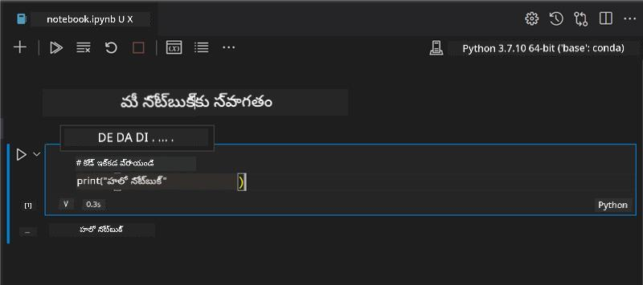

<!--
CO_OP_TRANSLATOR_METADATA:
{
  "original_hash": "fa81d226c71d5af7a2cade31c1c92b88",
  "translation_date": "2025-12-19T13:54:05+00:00",
  "source_file": "2-Regression/1-Tools/README.md",
  "language_code": "te"
}
-->
# రిగ్రెషన్ మోడల్స్ కోసం Python మరియు Scikit-learn తో ప్రారంభించండి


> Sketchnote by [Tomomi Imura](https://www.twitter.com/girlie_mac)

## [పూర్వ-లెక్చర్ క్విజ్](https://ff-quizzes.netlify.app/en/ml/)

> ### [ఈ పాఠం R లో అందుబాటులో ఉంది!](../../../../2-Regression/1-Tools/solution/R/lesson_1.html)

## పరిచయం

ఈ నాలుగు పాఠాలలో, మీరు రిగ్రెషన్ మోడల్స్ ఎలా నిర్మించాలో తెలుసుకుంటారు. వీటి ఉపయోగం గురించి త్వరలో చర్చిస్తాము. కానీ మీరు ఏదైనా చేయకముందు, ప్రారంభించడానికి సరైన సాధనాలు మీ వద్ద ఉన్నాయో లేదో నిర్ధారించుకోండి!

ఈ పాఠంలో, మీరు నేర్చుకుంటారు:

- స్థానిక మెషీన్ లెర్నింగ్ పనుల కోసం మీ కంప్యూటర్‌ను ఎలా కాన్ఫిగర్ చేయాలో.
- Jupyter నోట్బుక్స్‌తో ఎలా పని చేయాలో.
- Scikit-learn ఉపయోగించడం, ఇన్‌స్టాలేషన్ సహా.
- లీనియర్ రిగ్రెషన్‌ను ఒక ప్రాక్టికల్ వ్యాయామంతో అన్వేషించడం.

## ఇన్‌స్టాలేషన్లు మరియు కాన్ఫిగరేషన్లు

[](https://youtu.be/-DfeD2k2Kj0 "ML for beginners -Setup your tools ready to build Machine Learning models")

> 🎥 ML కోసం మీ కంప్యూటర్‌ను కాన్ఫిగర్ చేయడం గురించి చిన్న వీడియో కోసం పై చిత్రాన్ని క్లిక్ చేయండి.

1. **Python ఇన్‌స్టాల్ చేయండి**. మీ కంప్యూటర్‌లో [Python](https://www.python.org/downloads/) ఇన్‌స్టాల్ అయి ఉందని నిర్ధారించుకోండి. మీరు అనేక డేటా సైన్స్ మరియు మెషీన్ లెర్నింగ్ పనుల కోసం Python ఉపయోగిస్తారు. చాలా కంప్యూటర్ సిస్టమ్స్ ఇప్పటికే Python ఇన్‌స్టాలేషన్ కలిగి ఉంటాయి. కొంతమంది వినియోగదారుల కోసం సులభతరం చేయడానికి ఉపయోగకరమైన [Python కోడింగ్ ప్యాక్స్](https://code.visualstudio.com/learn/educators/installers?WT.mc_id=academic-77952-leestott) కూడా అందుబాటులో ఉన్నాయి.

   Python యొక్క కొన్ని ఉపయోగాలు ఒక వెర్షన్ అవసరం అవుతాయి, మరికొన్ని వేరే వెర్షన్ అవసరం అవుతాయి. అందుకే, [వర్చువల్ ఎన్విరాన్‌మెంట్](https://docs.python.org/3/library/venv.html) లో పని చేయడం ఉపయోగకరం.

2. **Visual Studio Code ఇన్‌స్టాల్ చేయండి**. మీ కంప్యూటర్‌లో Visual Studio Code ఇన్‌స్టాల్ అయి ఉందని నిర్ధారించుకోండి. ప్రాథమిక ఇన్‌స్టాలేషన్ కోసం [Visual Studio Code ఇన్‌స్టాల్ చేయడం](https://code.visualstudio.com/) గురించి సూచనలను అనుసరించండి. ఈ కోర్సులో మీరు Visual Studio Code లో Python ఉపయోగించబోతున్నారు, కాబట్టి Python అభివృద్ధి కోసం [Visual Studio Code ను ఎలా కాన్ఫిగర్ చేయాలో](https://docs.microsoft.com/learn/modules/python-install-vscode?WT.mc_id=academic-77952-leestott) తెలుసుకోవడం మంచిది.

   > ఈ [Learn modules](https://docs.microsoft.com/users/jenlooper-2911/collections/mp1pagggd5qrq7?WT.mc_id=academic-77952-leestott) సేకరణ ద్వారా Python తో సౌకర్యంగా అవ్వండి
   >
   > [](https://youtu.be/yyQM70vi7V8 "Setup Python with Visual Studio Code")
   >
   > 🎥 పై చిత్రాన్ని క్లిక్ చేసి VS Code లో Python ఉపయోగించడం గురించి వీడియో చూడండి.

3. **Scikit-learn ఇన్‌స్టాల్ చేయండి**, [ఈ సూచనలను](https://scikit-learn.org/stable/install.html) అనుసరించండి. మీరు Python 3 ఉపయోగిస్తున్నారని నిర్ధారించుకోవాలి, అందుకే వర్చువల్ ఎన్విరాన్‌మెంట్ ఉపయోగించడం సిఫార్సు చేయబడింది. మీరు M1 Mac పై ఈ లైబ్రరీని ఇన్‌స్టాల్ చేస్తుంటే, పై లింకులో ప్రత్యేక సూచనలు ఉన్నాయి.

1. **Jupyter Notebook ఇన్‌స్టాల్ చేయండి**. మీరు [Jupyter ప్యాకేజీని ఇన్‌స్టాల్ చేయాలి](https://pypi.org/project/jupyter/).

## మీ ML రచనా వాతావరణం

మీరు Python కోడ్ అభివృద్ధి చేయడానికి మరియు మెషీన్ లెర్నింగ్ మోడల్స్ సృష్టించడానికి **నోట్బుక్స్** ఉపయోగించబోతున్నారు. ఈ రకమైన ఫైల్ డేటా సైంటిస్టులకు సాధారణ సాధనం, మరియు అవి వారి సఫిక్స్ లేదా ఎక్స్‌టెన్షన్ `.ipynb` ద్వారా గుర్తించబడతాయి.

నోట్బుక్స్ అనేవి ఒక ఇంటరాక్టివ్ వాతావరణం, ఇది డెవలపర్‌కు కోడ్ రాయడమే కాకుండా, కోడ్ చుట్టూ గమనికలు మరియు డాక్యుమెంటేషన్ కూడా జోడించడానికి అనుమతిస్తుంది, ఇది ప్రయోగాత్మక లేదా పరిశోధన-ఆధారిత ప్రాజెక్టులకు చాలా సహాయకరం.

[](https://youtu.be/7E-jC8FLA2E "ML for beginners - Set up Jupyter Notebooks to start building regression models")

> 🎥 ఈ వ్యాయామం ద్వారా పని చేయడానికి పై చిత్రాన్ని క్లిక్ చేయండి.

### వ్యాయామం - నోట్బుక్‌తో పని చేయండి

ఈ ఫోల్డర్‌లో, మీరు _notebook.ipynb_ ఫైల్‌ను కనుగొంటారు.

1. Visual Studio Code లో _notebook.ipynb_ ను తెరవండి.

   Python 3+ తో Jupyter సర్వర్ ప్రారంభమవుతుంది. మీరు నోట్బుక్‌లో `run` చేయగల కోడ్ భాగాలను కనుగొంటారు. ప్లే బటన్ లాంటి ఐకాన్‌ను ఎంచుకుని కోడ్ బ్లాక్‌ను నడపవచ్చు.

1. `md` ఐకాన్‌ను ఎంచుకుని కొంత మార్క్డౌన్ జోడించండి, మరియు ఈ క్రింది టెక్స్ట్ **# Welcome to your notebook** ను జోడించండి.

   తరువాత, కొంత Python కోడ్ జోడించండి.

1. కోడ్ బ్లాక్‌లో **print('hello notebook')** టైప్ చేయండి.
1. కోడ్ నడపడానికి ఎరోను ఎంచుకోండి.

   మీరు ఈ ముద్రిత స్టేట్‌మెంట్‌ను చూడగలరు:

    ```output
    hello notebook
    ```



మీరు మీ కోడ్‌ను వ్యాఖ్యలతో కలిపి నోట్బుక్‌ను స్వయంగా డాక్యుమెంట్ చేయవచ్చు.

✅ ఒక వెబ్ డెవలపర్ వాతావరణం మరియు డేటా సైంటిస్ట్ వాతావరణం ఎంత భిన్నమో ఒక నిమిషం ఆలోచించండి.

## Scikit-learn తో ప్రారంభం

ఇప్పుడు Python మీ స్థానిక వాతావరణంలో సెట్ అయింది, మరియు మీరు Jupyter నోట్బుక్స్‌తో సౌకర్యంగా ఉన్నారు, Scikit-learn (దీనిని `sci` అని ఉచ్చరించండి, `science` లాగా) తో కూడా సౌకర్యంగా అవ్వండి. Scikit-learn మీకు ML పనులు చేయడానికి సహాయపడే [విస్తృత API](https://scikit-learn.org/stable/modules/classes.html#api-ref) అందిస్తుంది.

వారి [వెబ్‌సైట్](https://scikit-learn.org/stable/getting_started.html) ప్రకారం, "Scikit-learn అనేది ఓపెన్ సోర్స్ మెషీన్ లెర్నింగ్ లైబ్రరీ, ఇది సూపర్వైజ్డ్ మరియు అన్‌సూపర్వైజ్డ్ లెర్నింగ్‌ను మద్దతు ఇస్తుంది. ఇది మోడల్ ఫిట్టింగ్, డేటా ప్రీప్రాసెసింగ్, మోడల్ సెలెక్షన్ మరియు మూల్యాంకనం, మరియు అనేక ఇతర ఉపకరణాలను కూడా అందిస్తుంది."

ఈ కోర్సులో, మీరు Scikit-learn మరియు ఇతర సాధనాలను ఉపయోగించి మెషీన్ లెర్నింగ్ మోడల్స్ నిర్మించి 'సాంప్రదాయ మెషీన్ లెర్నింగ్' పనులు చేస్తారు. న్యూరల్ నెట్‌వర్క్స్ మరియు డీప్ లెర్నింగ్‌ను మేము ఉద్దేశపూర్వకంగా తప్పించుకున్నాము, అవి మా రాబోయే 'AI for Beginners' పాఠ్యాంశంలో బాగా కవర్ చేయబడతాయి.

Scikit-learn మోడల్స్ నిర్మించడం మరియు వాటిని ఉపయోగానికి మూల్యాంకనం చేయడం సులభం చేస్తుంది. ఇది ప్రధానంగా సంఖ్యాత్మక డేటాను ఉపయోగించడంపై దృష్టి సారిస్తుంది మరియు విద్యార్థుల కోసం ఉపయోగించడానికి సిద్ధంగా ఉన్న అనేక డేటాసెట్‌లను కలిగి ఉంటుంది. ఇది విద్యార్థులు ప్రయత్నించడానికి ముందుగా నిర్మించిన మోడల్స్‌ను కూడా కలిగి ఉంది. ముందుగా ప్యాకేజ్డ్ డేటాను లోడ్ చేయడం మరియు Scikit-learn తో ప్రాథమిక డేటాతో ఒక బిల్ట్-ఇన్ ఎస్టిమేటర్ ఉపయోగించి మొదటి ML మోడల్‌ను అన్వేషిద్దాం.

## వ్యాయామం - మీ మొదటి Scikit-learn నోట్బుక్

> ఈ ట్యుటోరియల్ Scikit-learn వెబ్‌సైట్‌లోని [లీనియర్ రిగ్రెషన్ ఉదాహరణ](https://scikit-learn.org/stable/auto_examples/linear_model/plot_ols.html#sphx-glr-auto-examples-linear-model-plot-ols-py) నుండి ప్రేరణ పొందింది.


[](https://youtu.be/2xkXL5EUpS0 "ML for beginners - Your First Linear Regression Project in Python")

> 🎥 ఈ వ్యాయామం ద్వారా పని చేయడానికి పై చిత్రాన్ని క్లిక్ చేయండి.

ఈ పాఠానికి సంబంధించిన _notebook.ipynb_ ఫైల్‌లో, 'trash can' ఐకాన్‌ను నొక్కి అన్ని సెల్స్‌ను క్లియర్ చేయండి.

ఈ విభాగంలో, మీరు Scikit-learn లో నేర్చుకునే ప్రయోజనాల కోసం నిర్మించిన డయాబెటిస్ గురించి చిన్న డేటాసెట్‌తో పని చేస్తారు. మీరు డయాబెటిక్ రోగుల కోసం చికిత్సను పరీక్షించాలనుకుంటున్నారని ఊహించండి. మెషీన్ లెర్నింగ్ మోడల్స్ వేరియబుల్స్ కలయికల ఆధారంగా ఏ రోగులు చికిత్సకు మెరుగ్గా స్పందిస్తారో నిర్ణయించడంలో సహాయపడవచ్చు. ఒక చాలా ప్రాథమిక రిగ్రెషన్ మోడల్ కూడా, దృశ్యీకరించినప్పుడు, వేరియబుల్స్ గురించి సమాచారం చూపించి మీ సైద్ధాంతిక క్లినికల్ ట్రయల్స్‌ను సక్రమంగా నిర్వహించడంలో సహాయపడవచ్చు.

✅ రిగ్రెషన్ పద్ధతుల అనేక రకాలు ఉన్నాయి, మీరు ఎంచుకునేది మీరు కోరుకునే సమాధానంపై ఆధారపడి ఉంటుంది. మీరు ఒక వ్యక్తి వయస్సుకు అనుగుణంగా ఎత్తును అంచనా వేయాలనుకుంటే, మీరు లీనియర్ రిగ్రెషన్ ఉపయోగిస్తారు, ఎందుకంటే మీరు **సంఖ్యాత్మక విలువ** కోసం చూస్తున్నారు. మీరు ఒక వంటకాన్ని వెగన్‌గా పరిగణించాలా లేదా అనేది తెలుసుకోవాలనుకుంటే, మీరు **వర్గీకరణ** కోసం చూస్తున్నారు కాబట్టి లాజిస్టిక్ రిగ్రెషన్ ఉపయోగిస్తారు. మీరు తర్వాత లాజిస్టిక్ రిగ్రెషన్ గురించి మరింత తెలుసుకుంటారు. డేటా నుండి అడగగల కొన్ని ప్రశ్నల గురించి మరియు ఏ పద్ధతులు ఎక్కువగా సరిపోతాయో కొంచెం ఆలోచించండి.

ఈ పనిని ప్రారంభిద్దాం.

### లైబ్రరీలను దిగుమతి చేసుకోండి

ఈ పనికి కొన్ని లైబ్రరీలను దిగుమతి చేసుకుంటాము:

- **matplotlib**. ఇది ఉపయోగకరమైన [గ్రాఫింగ్ టూల్](https://matplotlib.org/) మరియు లైన్ ప్లాట్ సృష్టించడానికి ఉపయోగిస్తాము.
- **numpy**. [numpy](https://numpy.org/doc/stable/user/whatisnumpy.html) అనేది Python లో సంఖ్యాత్మక డేటాను నిర్వహించడానికి ఉపయోగకరమైన లైబ్రరీ.
- **sklearn**. ఇది [Scikit-learn](https://scikit-learn.org/stable/user_guide.html) లైబ్రరీ.

మీ పనులకు సహాయపడే కొన్ని లైబ్రరీలను దిగుమతి చేసుకోండి.

1. క్రింది కోడ్ టైప్ చేసి దిగుమతులు జోడించండి:

   ```python
   import matplotlib.pyplot as plt
   import numpy as np
   from sklearn import datasets, linear_model, model_selection
   ```

   పై కోడ్‌లో మీరు `matplotlib`, `numpy` ను దిగుమతి చేసుకుంటున్నారు మరియు `sklearn` నుండి `datasets`, `linear_model` మరియు `model_selection` ను దిగుమతి చేసుకుంటున్నారు. `model_selection` డేటాను ట్రైనింగ్ మరియు టెస్ట్ సెట్లుగా విభజించడానికి ఉపయోగిస్తారు.

### డయాబెటిస్ డేటాసెట్

బిల్ట్-ఇన్ [డయాబెటిస్ డేటాసెట్](https://scikit-learn.org/stable/datasets/toy_dataset.html#diabetes-dataset) 442 నమూనాల డేటాను కలిగి ఉంది, 10 ఫీచర్ వేరియబుల్స్‌తో, వాటిలో కొన్ని:

- వయస్సు: సంవత్సరాలలో వయస్సు
- bmi: బాడీ మాస్ ఇండెక్స్
- bp: సగటు రక్తపోటు
- s1 tc: T-సెల్స్ (తెల్ల రక్త కణాల ఒక రకం)

✅ ఈ డేటాసెట్ 'sex' అనే ఫీచర్ వేరియబుల్‌ను కలిగి ఉంది, ఇది డయాబెటిస్ పరిశోధనలో ముఖ్యమైనది. అనేక వైద్య డేటాసెట్‌లు ఈ రకమైన ద్విభాగ వర్గీకరణను కలిగి ఉంటాయి. ఈ వర్గీకరణలు జనాభాలోని కొన్ని భాగాలను చికిత్సల నుండి ఎలా తప్పించవచ్చు అనేది కొంచెం ఆలోచించండి.

ఇప్పుడు, X మరియు y డేటాను లోడ్ చేయండి.

> 🎓 గుర్తుంచుకోండి, ఇది సూపర్వైజ్డ్ లెర్నింగ్, కాబట్టి 'y' అనే లక్ష్యాన్ని అవసరం.

కొత్త కోడ్ సెల్‌లో, `load_diabetes()` ను పిలిచి డయాబెటిస్ డేటాసెట్‌ను లోడ్ చేయండి. ఇన్‌పుట్ `return_X_y=True` అంటే `X` డేటా మ్యాట్రిక్స్ అవుతుంది, మరియు `y` రిగ్రెషన్ లక్ష్యం అవుతుంది.

1. డేటా మ్యాట్రిక్స్ ఆకారం మరియు మొదటి అంశాన్ని చూపించడానికి కొన్ని ప్రింట్ కమాండ్లను జోడించండి:

    ```python
    X, y = datasets.load_diabetes(return_X_y=True)
    print(X.shape)
    print(X[0])
    ```

    మీరు పొందుతున్నది ఒక టుపుల్. మీరు టుపుల్ యొక్క మొదటి రెండు విలువలను వరుసగా `X` మరియు `y` కు కేటాయిస్తున్నారు. [టుపుల్స్ గురించి మరింత తెలుసుకోండి](https://wikipedia.org/wiki/Tuple).

    ఈ డేటాలో 442 అంశాలు ఉన్నాయి, అవి 10 అంశాల అర్రేలుగా ఆకారంలో ఉన్నాయి:

    ```text
    (442, 10)
    [ 0.03807591  0.05068012  0.06169621  0.02187235 -0.0442235  -0.03482076
    -0.04340085 -0.00259226  0.01990842 -0.01764613]
    ```

    ✅ డేటా మరియు రిగ్రెషన్ లక్ష్యం మధ్య సంబంధం గురించి కొంచెం ఆలోచించండి. లీనియర్ రిగ్రెషన్ ఫీచర్ X మరియు లక్ష్య వేరియబుల్ y మధ్య సంబంధాలను అంచనా వేస్తుంది. డయాబెటిస్ డేటాసెట్ కోసం [లక్ష్యం](https://scikit-learn.org/stable/datasets/toy_dataset.html#diabetes-dataset) ఏమిటి అని డాక్యుమెంటేషన్‌లో చూడండి? ఈ డేటాసెట్ ఏం చూపిస్తోంది?

2. తరువాత, ఈ డేటాసెట్‌లోని 3వ కాలమ్‌ను ఎంచుకుని ప్లాట్ చేయడానికి ఒక భాగాన్ని ఎంచుకోండి. మీరు అన్ని వరుసలను ఎంచుకోవడానికి `:` ఆపరేటర్ ఉపయోగించి, తరువాత 3వ కాలమ్‌ను సూచిక (2) ఉపయోగించి ఎంచుకోవచ్చు. ప్లాటింగ్ కోసం అవసరమైన 2D అర్రేగా డేటాను మార్చడానికి `reshape(n_rows, n_columns)` ఉపయోగించవచ్చు. ఒక పారామీటర్ -1 అయితే, ఆ కొలత ఆటోమేటిక్‌గా లెక్కించబడుతుంది.

   ```python
   X = X[:, 2]
   X = X.reshape((-1,1))
   ```

   ✅ ఎప్పుడైనా డేటా ఆకారాన్ని తనిఖీ చేయడానికి ప్రింట్ చేయండి.

3. ఇప్పుడు మీరు ప్లాట్ చేయడానికి డేటా సిద్ధంగా ఉన్నందున, ఈ డేటాసెట్‌లో సంఖ్యల మధ్య తార్కిక విభజనను యంత్రం నిర్ణయించగలదా అని చూడండి. దీని కోసం, మీరు డేటా (X) మరియు లక్ష్యం (y) రెండింటినీ టెస్ట్ మరియు ట్రైనింగ్ సెట్లుగా విభజించాలి. Scikit-learn దీనిని సులభంగా చేయడానికి ఒక విధానం కలిగి ఉంది; మీరు టెస్ట్ డేటాను ఒక నిర్దిష్ట పాయింట్ వద్ద విభజించవచ్చు.

   ```python
   X_train, X_test, y_train, y_test = model_selection.train_test_split(X, y, test_size=0.33)
   ```

4. ఇప్పుడు మీరు మీ మోడల్‌ను ట్రైన్ చేయడానికి సిద్ధంగా ఉన్నారు! లీనియర్ రిగ్రెషన్ మోడల్‌ను లోడ్ చేసి, `model.fit()` ఉపయోగించి మీ X మరియు y ట్రైనింగ్ సెట్లతో ట్రైన్ చేయండి:

    ```python
    model = linear_model.LinearRegression()
    model.fit(X_train, y_train)
    ```

    ✅ `model.fit()` అనేది TensorFlow వంటి అనేక ML లైబ్రరీలలో కనిపించే ఫంక్షన్.

5. తరువాత, టెస్ట్ డేటా ఉపయోగించి `predict()` ఫంక్షన్ ద్వారా అంచనాను సృష్టించండి. ఇది డేటా గ్రూపుల మధ్య లైన్ డ్రా చేయడానికి ఉపయోగించబడుతుంది.

    ```python
    y_pred = model.predict(X_test)
    ```

6. ఇప్పుడు డేటాను ప్లాట్‌లో చూపించాల్సిన సమయం. Matplotlib ఈ పనికి చాలా ఉపయోగకరమైన సాధనం. అన్ని X మరియు y టెస్ట్ డేటా యొక్క స్కాటర్‌ప్లాట్ సృష్టించి, అంచనాను ఉపయోగించి మోడల్ డేటా గ్రూపుల మధ్య సరైన చోట లైన్ డ్రా చేయండి.

    ```python
    plt.scatter(X_test, y_test,  color='black')
    plt.plot(X_test, y_pred, color='blue', linewidth=3)
    plt.xlabel('Scaled BMIs')
    plt.ylabel('Disease Progression')
    plt.title('A Graph Plot Showing Diabetes Progression Against BMI')
    plt.show()
    ```

   
   ✅ ఇక్కడ ఏమి జరుగుతుందో కొంచెం ఆలోచించండి. ఒక సరళ రేఖ అనేక చిన్న డాటా బిందువుల ద్వారా నడుస్తోంది, కానీ అది నిజంగా ఏమి చేస్తోంది? మీరు ఈ రేఖను ఉపయోగించి కొత్త, చూడని డాటా పాయింట్ ప్లాట్ యొక్క y అక్షానికి సంబంధించి ఎక్కడ సరిపోతుందో ఎలా అంచనా వేయాలో చూడగలరా? ఈ మోడల్ యొక్క ప్రాక్టికల్ ఉపయోగాన్ని పదాలలో వ్యక్తం చేయడానికి ప్రయత్నించండి.

అభినందనలు, మీరు మీ మొదటి లీనియర్ రిగ్రెషన్ మోడల్‌ను నిర్మించారు, దానితో ఒక అంచనాను సృష్టించారు, మరియు దాన్ని ఒక ప్లాట్‌లో ప్రదర్శించారు!

---
## 🚀సవాలు

ఈ డేటాసెట్ నుండి వేరే వేరియబుల్‌ను ప్లాట్ చేయండి. సూచన: ఈ లైన్‌ను సవరించండి: `X = X[:,2]`. ఈ డేటాసెట్ లక్ష్యాన్ని దృష్టిలో ఉంచుకుని, మధుమేహం వ్యాధిగా ఎలా అభివృద్ధి చెందుతుందో మీరు ఏమి కనుగొనగలరు?
## [పోస్ట్-లెక్చర్ క్విజ్](https://ff-quizzes.netlify.app/en/ml/)

## సమీక్ష & స్వీయ అధ్యయనం

ఈ ట్యుటోరియల్‌లో, మీరు సింపుల్ లీనియర్ రిగ్రెషన్‌తో పని చేశారు, యూనివేరియట్ లేదా మల్టిపుల్ లీనియర్ రిగ్రెషన్ కాకుండా. ఈ పద్ధతుల మధ్య తేడాల గురించి కొంచెం చదవండి, లేదా [ఈ వీడియో](https://www.coursera.org/lecture/quantifying-relationships-regression-models/linear-vs-nonlinear-categorical-variables-ai2Ef) చూడండి.

రిగ్రెషన్ కాన్సెప్ట్ గురించి మరింత చదవండి మరియు ఈ సాంకేతికత ద్వారా ఏ రకమైన ప్రశ్నలకు సమాధానం ఇవ్వగలమో ఆలోచించండి. మీ అవగాహనను లోతుగా చేసుకోవడానికి ఈ [ట్యుటోరియల్](https://docs.microsoft.com/learn/modules/train-evaluate-regression-models?WT.mc_id=academic-77952-leestott) తీసుకోండి.

## అసైన్‌మెంట్

[వేరే డేటాసెట్](assignment.md)

---

<!-- CO-OP TRANSLATOR DISCLAIMER START -->
**అస్పష్టత**:  
ఈ పత్రాన్ని AI అనువాద సేవ [Co-op Translator](https://github.com/Azure/co-op-translator) ఉపయోగించి అనువదించబడింది. మేము ఖచ్చితత్వానికి ప్రయత్నించినప్పటికీ, ఆటోమేటెడ్ అనువాదాల్లో పొరపాట్లు లేదా తప్పిదాలు ఉండవచ్చు. మూల పత్రం దాని స్వదేశీ భాషలో అధికారిక మూలంగా పరిగణించాలి. ముఖ్యమైన సమాచారానికి, ప్రొఫెషనల్ మానవ అనువాదం సిఫార్సు చేయబడుతుంది. ఈ అనువాదం వాడకంలో ఏర్పడిన ఏవైనా అపార్థాలు లేదా తప్పుదారితీసే అర్థాలు కోసం మేము బాధ్యత వహించము.
<!-- CO-OP TRANSLATOR DISCLAIMER END -->