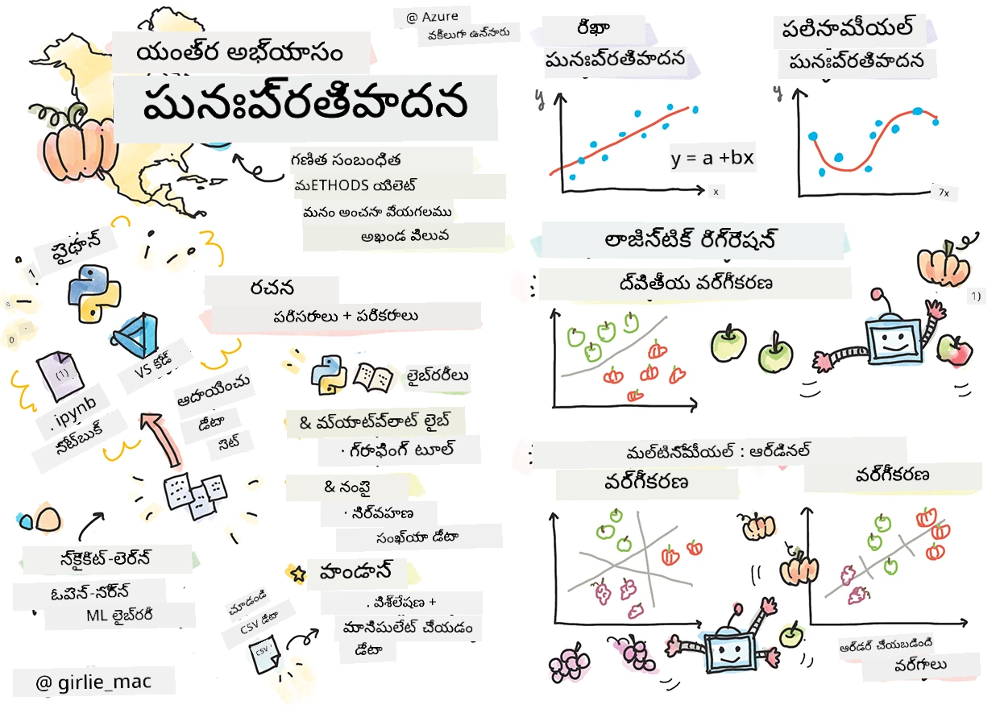
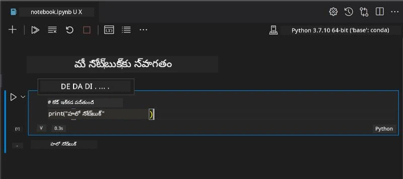
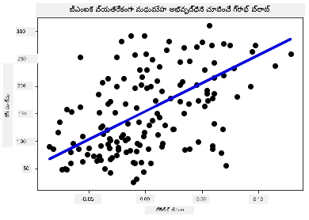

# రిగ్రెషన్ మోడల్స్ కోసం Python మరియు Scikit-learn తో ప్రారంభించండి



> స్కెచ్నోట్ రాసింది [Tomomi Imura](https://www.twitter.com/girlie_mac)

## [పాఠం ముందు క్విజ్](https://ff-quizzes.netlify.app/en/ml/)

> ### [ఈ పాఠం R లో కూడా అందుబాటులో ఉంది!](../../../../2-Regression/1-Tools/solution/R/lesson_1.html)

## పరిచయం

ఈ నాలుగు పాఠాల్లో, మీరు రిగ్రెషన్ మోడల్స్ ఎలా రూపొందించాలో తెలుసుకుంటారు. వీటికి గానీ మనం త్వరలో చర్చించబోతున్నాం. కానీ మీరు ఏదైనా చేయకముందు, ప్రారంభించడానికి సరైన సాధనాలు మీ వద్ద ఉన్నాయా చాలు చూడు!

ఈ పాఠంలో మీరు నేర్చుకోబోతున్న విషయాలు:

- స్థానిక మెషిన్ లెర్నింగ్ పనుల కోసం మీ కంప్యూటర్ కన్ఫిగర్ చేయడం.
- జుపిటర్ నోటबुक్స్ తో పని చేయడం.
- Scikit-learn ను ఉపయోగించడం, ఇన్స్టాలేషన్ సహా.
- హ్యాండ్స్-ఆన్ వ్యాయామంతో లీనియర్ రిగ్రెషన్ అన్వేషించడం.

## ఇన్స్టాలేషన్స్ మరియు కన్ఫిగరేషన్స్

[](https://youtu.be/-DfeD2k2Kj0 "నవ ప్రవేశికల కోసం - మీ సాధనాలను సెట్ చేసి మెషిన్ లెర్నింగ్ మోడల్స్ తయారు చేయండి")

> 🎥 ML కోసం మీ కంప్యూటర్‌ను ఎలా కన్ఫిగర్ చేయాలి అనే చిన్న వీడియో కోసం పై చిత్రం పై క్లిక్ చేయండి.

1. **Python ఇన్స్టాల్ చేయండి**. మీ కంప్యూటర్ లో [Python](https://www.python.org/downloads/) ఇన్స్టాప్ అయి ఉందో లేదో చూసుకోండి. మీరు చాలా డేటా సైన్స్ మరియు మెషిన్ లెర్నింగ్ పనుల కోసం Python ను ఉపయోగించబోతున్నారు. ఎక్కువ కంప్యూటర్ సిస్టమ్స్ లో Python ఇన్స్టాలేషన్ ముందే ఉంటుంది. కొందరు వినియోగదారుల కోసం నమూనా [Python కోడింగ్ ప్యాక్స్](https://code.visualstudio.com/learn/educators/installers?WT.mc_id=academic-77952-leestott) కూడా అందుబాటులో ఉన్నాయి, వీటిని సెట్ అప్ చేయడం సులభం.

   అయినప్పటికీ, Python ఉపయోగానికి కొన్నిసార్లు ఒక వెర్షన్ అవుతుంది, మరికొన్ని సందర్భాల్లో వేరే వెర్షన్ అవసరం. అందుకే మీరు [వర్చువల్ ఎన్‌విరాన్మెంట్](https://docs.python.org/3/library/venv.html) లో పనిచేసే విధానం మంచిదిగా ఉంటుంది.

2. **Visual Studio Code ఇన్స్టాల్ చేసుకోండి**. మీ కంప్యూటర్ లో Visual Studio Code ఉందో లేదో ధృవీకరించుకోండి. ప్రాథమిక ఇన్స్టాలేషన్ కోసం ఈ దిశానిర్దేశాల్ని ఫాలో అవ్వండి: [Visual Studio Code ఇన్స్టాలేషన్](https://code.visualstudio.com/). మీరు ఈ కోర్స్ లో Visual Studio Code లో Python ఉపయోగించబోతున్నందున, Python అభివృద్ధి కోసం [Visual Studio Code ను ఎలా సెటప్ చేసుకోవాలి](https://docs.microsoft.com/learn/modules/python-install-vscode?WT.mc_id=academic-77952-leestott) అనే విషయాన్ని కూడా నేర్చుకోవచ్చు.

   > Python లో నిపుణుడయ్యేందుకు ఈ [లెర్న్ మాడ్యూల్స్ సేకరణ](https://docs.microsoft.com/users/jenlooper-2911/collections/mp1pagggd5qrq7?WT.mc_id=academic-77952-leestott) చూసుకోండి
   >
   > [](https://youtu.be/yyQM70vi7V8 "Visual Studio Code తో Python సెటప్")
   >
   > 🎥 పై చిత్రం మీద క్లిక్ చేస్తే VS Code లో Python ఎలా వాడాలి అనే వీడియో తెరుచుకుంటుంది.

3. **Scikit-learn ఇన్స్టాల్ చేయండి**, [ఈ దిశానిర్దేశాలు](https://scikit-learn.org/stable/install.html) అనుసరించండి. మీరు Python 3 వాడాలని నిర్ధారించుకోండి, అందువల్ల వర్చువల్ ఎన్‌విరాన్మెంట్ ఉపయోగించడం సలహా ఇవ్వబడింది. మీరు M1 Mac లో ఈ లైబ్రరీ ని ఇన్స్టాల్ చేస్తున్నట్లయితే, ప్రత్యేక సూచనలు ఉన్నాయని పై లింకులో చూడండి.

1. **Jupyter Notebook ఇన్స్టాల్ చేయండి**. మీరు [Jupyter ప్యాకేజీ ఇన్స్టాల్](https://pypi.org/project/jupyter/) చేయాలి.

## మీ ML రచనా వాతావరణం

మీరు మీ Python కోడ్‌ను అభివృద్ధి చేయడానికి మరియు మెషిన్ లెర్నింగ్ మోడల్స్ సృష్టించడానికి **నోట్బుక్స్** ను ఉపయోగించబోతున్నారు. ఈ రకం ఫైల్ డేటా సైన్తిస్ట్‌ల సాధారణ పరికరం, మరియు ఇవి `.ipynb` విస్తరణతో గుర్తింపు పొందతాయి.

నోట్బుక్స్ అనేవి ఒక ఇంటరాక్టివ్ వాతావరణం, దీని ద్వారా డెవలపర్ కోడ్ రాయవచ్చు మరియు కోడ్ చుట్టూ గమనికలు మరియు డాక్యుమెంటేషన్ చేర్చవచ్చు, ఇది ప్రయోగాత్మక లేదా పరిశోధనా ప్రాజెక్టుల కోసం చాలా ఉపయోగకరం.

[](https://youtu.be/7E-jC8FLA2E "నవ ప్రవేశికల కోసం - రిగ్రెషన్ మోడల్స్ ప్రారంభించడానికి Jupyter Notebooks సెట్ చేయడం")

> 🎥 ఈ వ్యాయామాన్ని పూర్తి చేయడం చూపించే చిన్న వీడియో కోసం పై చిత్రంపై క్లిక్ చేయండి.

### వ్యాయామం - ఒక నోట్బుకుతో పని చేయండి

ఈ ఫోల్‌డర్‌లో మీరు _notebook.ipynb_ ఫైల్‌ను కనుగొంటారు.

1. Visual Studio Code లో _notebook.ipynb_ ని తెరవండి.

   ఒక Jupyter సర్వర్ ప్రారంభమవుతుంది, Python 3+ తో ప్రారంభం అవుతుంది. నోట్బుక్‌లో `run` చేయగల కోడ్ భాగాలు ఉంటాయి. ప్లే బటన్‌లా కనిపించే చిహ్నం ఎంచుకుని మీరు కోడ్ బ్లాక్ నడిపించవచ్చు.

1. `md` చిహ్నాన్ని ఎంచుకుని కొంత మార్క్డౌన్ జోడించండి, టెక్స్ట్ గా **# Welcome to your notebook** వ్రాయండి.

   తరువాత కొంత Python కోడ్ జోడించండి.

1. కోడ్ బ్లాక్‌లో **print('hello notebook')** టైప్ చేయండి.
1. కోడ్ నడిపేందుకు ఎరో బటన్ ని ఎంచుకోండి.

   మీరు క్రింద చూపించిన వాక్యాన్ని ప్రింట్ అవ్వడం చూడాలి:

    ```output
    hello notebook
    ```



మీ కోడ్‌ను సొంతంగా డాక్యుమెంట్ చేయడానికి వ్యాఖ్యలతో కలిపి నోట్బుక్‌లో చేర్చవచ్చు.

✅ ఒక నిమిషం ఆలోచించండి: వెబ్ డెవలపర్ పని వాతావరణం మరియు డేటా సైన్తిస్ట్ పని వాతావరణం ఎంత భిన్నమో.

## Scikit-learn తో వర్కింగ్ ప్రారంభం

ఇప్పటికే Python మీ లోకల్ వాతావరణంలో సెటప్ అయింది, మీరు జుపిటర్ నోట్బుక్‌లతో సౌకర్యవంతంగా ఉన్నారు, ఇప్పుడు Scikit-learn (దీన్ని `'sci'` అని ఉచ్చరించాలి, `science` లాగా) తో కూడా సమానంగా సులభంగా పరిచయం కావచ్చు. Scikit-learn మీకు మెషిన్ లెర్నింగ్ పనులు సులభం చేసే [విస్తృత API](https://scikit-learn.org/stable/modules/classes.html#api-ref) అందిస్తుంది.

వారి [వెబ్సైట్](https://scikit-learn.org/stable/getting_started.html) ప్రకారం, "Scikit-learn అనేది ఓపెన్ సోర్స్ మెషిన్ లెర్నింగ్ లైబ్రరీ, ఇది సూపర్వైజ్డ్ మరియు అన్సూపర్వైజ్డ్ లెర్నింగ్‌ను మద్దతు ఇస్తుంది. ఇది మోడల్ ఫిట్టింగ్, డేటా ప్రీప్రాసెసింగ్, మోడల్ సెలెక్షన్, ఇవాల్యుయేషన్ మరియు అనేక ఇతర టూల్స్ అందిస్తుంది."

ఈ కోర్సులో మీరు Scikit-learn మరియు ఇతర సాధనాలు ఉపయోగించి మేము 'సాంప్రదాయ మెషిన్ లెర్నింగ్' పనులు చేయడానికి మోడల్స్ తయారుచేస్తారు. న్యూరల్ నెట్‌వర్క్స్ మరియు డీప్ లెర్నింగ్ నుండి deliberate గా దూరంగా ఉన్నాము, అవి రాబోయే 'AI ఫర్ బిగినర్స్' కార్యక్రమంలో మెరుగుగా చర్చించబడతాయి.

Scikit-learn మోడల్స్ తయారుచేయడం మరియు వాటిని వాడుకునేలా ఈవాల్యుయేట్ చేయడం సులభం చేస్తుంది. ఇది ప్రధానంగా న్యూమరిక్ డేటాను ఫోకస్ చేస్తుంది మరియు అనుకరణకు కొంత సిద్ధ డేటా సెట్‌లు కలిగి ఉంది. ఇది విద్యార్థులకు ప్రయత్నించడానికి ప్రీ-బిల్ట్ మోడల్స్ కూడా కలిగి ఉంది. ముందుగా ప్యాకేజీవై డేటాను లోడ్ చేసుకోవడం, ఇన్-బిల్ట్ ఎస్టిమేటర్ తో ప్రాథమిక ML మోడల్ సృష్టించటం చూద్దాం.

## వ్యాయామం - మీ మొదటి Scikit-learn నోట్బుక్

> ఈ ట్యుటోరియల్ Scikit-learn వెబ్‌సైట్ లోని [లీనియర్ రిగ్రెషన్ ఉదాహరణ](https://scikit-learn.org/stable/auto_examples/linear_model/plot_ols.html#sphx-glr-auto-examples-linear-model-plot-ols-py) ఆధారంగా రూపొందింది.


[](https://youtu.be/2xkXL5EUpS0 "Pythonలో మీ మొదటి లీనియర్ రిగ్రెషన్ ప్రాజెక్ట్")

> 🎥 ఈ వ్యాయామం ఆచరణలో చూపించే వీడియో కోసం పై చిత్రంపై క్లిక్ చేయండి.

ఈ పాఠానికి సంబంధించిన _notebook.ipynb_ ఫైల్‌లో, 'trash can' ఐకాన్ నొక్కి అన్ని సెల్‌లను క్లియర్ చేయండి.

ఈ భాగంలో, మీరు సన్నని డయాబెటిస్ డేటాసెట్ తో పని చేస్తారు, ఇది Scikit-learn లో నేర్చుకునే ఉద్దేశ్యంతో ఉండి ఉంటుంది. మీరు ఓ చికిత్సని పరీక్షించాలనుకుంటున్న డయాబెటిస్ రోగుల గురించి ఆలోచించండి. మెషిన్ లెర్నింగ్ మోడల్స్ వీరు ఎవరికి మెరుగుగా స్పందించగలరో అంచనా వేయడంలో సహాయపడతాయి. సరళమైన రిగ్రెషన్ మోడల్ కూడా విజువలైజ్ చేస్తే, వేరియబుల్స్ గురించి ఉపయోగకరమైన సమాచారాన్ని చూపించి, తౌరైటికల్ క్లినికల్ ట్రయల్స్‌ను ఏర్పాటు చేయడంలో సహాయపడుతుంది.

✅ రిగ్రెషన్ పద్ధతులు అనేక రకాలున్నాయి, మీరు ఎంచుకునేది మీకు కావలసిన సమాధానంపై ఆధారపడి ఉంటుంది. ఒక వ్యక్తి వయస్సుకు తగిన ఎత్తును అంచనా వేయాలనుకుంటే, లీనియర్ రిగ్రెషన్ ఉపయోగిస్తారు, ఎందుకంటే మీరు ఒక **సంఖ్యా విలువ** కోరుతున్నారు. ఒక వంటకాన్ని వეგన్ లో పెట్టాలా లేదా అనేది తెలుసుకోవాలనుకుంటే, మీరు **వర్గీకరణ** కోసం చూస్తున్నారు, అందుకే లాజిస్టిక్ రిగ్రెషన్ ఉపయోగిస్తారు. లాజిస్టిక్ రిగ్రెషన్ గురించి తర్వాత నేర్చుతారు. మీరు డేటాను అడిగే ప్రశ్నల గురించి ఆలోచించండి, ఏ పద్ధతి అనుకూలమో తెలుసుకోండి.

మనం ఈ పనిని ప్రారంభిద్దాము.

### లైబ్రరీలు దిగుమతి చేసుకోండి

ఈ పనికి మనం కొన్ని లైబ్రరీలు దిగుమతి చేసుకోబోతున్నాం:

- **matplotlib**. ఇది ఉపయోగకరమైన [గ్రాఫింగ్ టూల్](https://matplotlib.org/) మరియు గీయడానికి మనం లైన్ ప్లాట్ తయారుచేస్తాం.
- **numpy**. [numpy](https://numpy.org/doc/stable/user/whatisnumpy.html) పాఠ్య రాశిగ ఉత్పత్తుల కోసం ఉపయోగపడే లైబ్రరీ.
- **sklearn**. ఇది [Scikit-learn](https://scikit-learn.org/stable/user_guide.html) లైబ్రరీ.

మీ పనులకు సహాయం కోసం కొన్ని లైబ్రరీలను దిగుమతి చేసుకోండి.

1. ఈ క్రింది కోడ్ టైప్ చేసి దిగుమతులు జోడించండి:

   ```python
   import matplotlib.pyplot as plt
   import numpy as np
   from sklearn import datasets, linear_model, model_selection
   ```

   ఇక్కడ మీరు `matplotlib`, `numpy` మరియు `sklearn` నుండి `datasets`, `linear_model` మరియు `model_selection` లను దిగుమతి చేసుకుంటున్నారు. `model_selection` ను డేటాను శిక్షణ మరియు పరీక్ష సెట్లుగా విడగొట్టడానికి వాడతారు.

### డయాబెటిస్ డేటాసెట్

బిల్ట్-ఇన్ [డయాబెటిస్ డేటాసెట్](https://scikit-learn.org/stable/datasets/toy_dataset.html#diabetes-dataset) 442 నమూనాలు కలిగి ఉంది, 10 ఫీచర్ వేరియబుల్స్‌తో, వాటిలో కొన్ని:

- వయసు: సంవత్సరాలతో వయస్సు
- బిఎమ్ఐ: బాడీ మాస్ ఇండెక్స్
- బిపి: సగటు రక్తపోటు
- s1 tc: టీ-సెల్స్ (తెల్ల రక్త కణాలు)

✅ ఈ డేటాసెట్ లో 'లింగం' అనే సంకల్పన ఒక ముఖ్యమైన ఫీచర్ వేరియబుల్ గా ఉంది, ఇది డయాబెటిస్ పరిశోధనకు అవసరం. అనేక వైద్య డేటాసెట్‌లు ఈ రకమైన ద్విభాగ వర్గీకరణ కలిగి ఉంటాయి. ఈ వర్గీకరణలు జనాభాలోని కొన్ని భాగాలను చికిత్సల నుంచి ఎలా మినహాయించవచ్చో ఆలోచించండి.

ఇప్పుడు, X మరియు y డేటాను లోడ్ చేయండి.

> 🎓 గుర్తుంచుకోండి, ఇది సుపర్వైజ్డ్ లెర్నింగ్, అందుకే 'y' అనే లక్ష్య సంబంధించినది ఉండాలి.

కొత్త కోడ్ సెల్‌లో, `load_diabetes()` ను పిలిచి డయాబెటిస్ డేటాను లోడ్ చేయండి. `return_X_y=True` అంటే `X` డేటా మ్యాట్రిక్సు, `y` రిగ్రెషన్ లక్ష్యం.

1. డేటా మ్యాట్రిక్స్ ఆకారాన్ని మరియు మొదటి అంశాన్ని ప్రింట్ చేయడానికి కొన్ని ఆదేశాలు జోడించండి:

    ```python
    X, y = datasets.load_diabetes(return_X_y=True)
    print(X.shape)
    print(X[0])
    ```

    మీరు పొందేది ఒక టూపుల్. మీరు టూపుల్ మొదటి ఇద్దరు విలువలను వరుసగా `X` మరియు `y` లో ఉంచుతున్నారు. [టూపుల్స్ గురించి](https://wikipedia.org/wiki/Tuple) మరింత తెలుసుకోండి.

    ఈ డేటా 442 అంశాలతో 10 అంశాల అర್ರೆల్లో ఉందని చూడవచ్చు:

    ```text
    (442, 10)
    [ 0.03807591  0.05068012  0.06169621  0.02187235 -0.0442235  -0.03482076
    -0.04340085 -0.00259226  0.01990842 -0.01764613]
    ```

    ✅ డేటా మరియు రిగ్రెషన్ లక్ష్యానికి మధ్య సంబంధంపై కాస్త ఆలోచించండి. లీనియర్ రిగ్రెషన్ X మరియు y మధ్య సంబంధాలను అంచనా వేస్తుంది. డయాబెటిస్ డేటాసెట్ కోసం [లక్ష్యం](https://scikit-learn.org/stable/datasets/toy_dataset.html#diabetes-dataset) డాక్యుమెంటేషన్‌లో ఎక్కడ ఉందో చూడండి? ఈ డేటాసెట్ ఏాన్ని నిరూపిస్తోంది అని అర్థం చేసుకోండి.

2. తర్వాత, ఈ డేటాసెట్ నుండి ఒక భాగాన్ని ప్లాట్ చేయడానికి 3వ కాలమ్‌ని ఎంచుకోండి. `:` ఆపరేటర్ ఉపయోగించి అన్ని వరుసలను ఎంచుకొండి, ఆపై సూచీలు (ఇండెక్స్ 2) తో 3వ కాలమ్ ఎంచుకోండి. ప్లాటింగ్ కోసం డేటాను 2D అర్రేగా మార్చేందుకు `reshape(n_rows, n_columns)` ఉపయోగించవచ్చు. ఒక పారామీటరు -1 అయితే, ఆ మియాన్ని ఆటోమేటిగానే లెక్కిస్తుంది.

   ```python
   X = X[:, 2]
   X = X.reshape((-1,1))
   ```

   ✅ ఎప్పుడైనా డేటా ఆకారాన్ని ప్రింట్ చేసి తనిఖీ చేయండి.

3. ఇప్పుడు మీకు ప్లాట్ చేసేటటువంటి డేటా సిద్ధంగా ఉంది, మిషన్ ఇప్పటికే సరిపోయే సరిహద్దును గుర్తించగలదో చూద్దాం. దీనికై, మీరు X మరియు y రెండింటిని టెస్ట్ మరియు ట్రైన్ సెట్లుగా విడగొట్టాలి. Scikit-learn తో దీన్ని చేయడం సులభం; మీరు టెస్ట్ డేటాను ఒక నిర్దిష్ట పాయింట్ వద్ద విభజించవచ్చు.

   ```python
   X_train, X_test, y_train, y_test = model_selection.train_test_split(X, y, test_size=0.33)
   ```

4. ఇప్పుడు మీరు మీ మోడల్ శిక్షణకు సిద్ధంగా ఉన్నారు! లీనియర్ రిగ్రెషన్ మోడల్ లోడ్ చేసి `model.fit()` ఉపయోగించి మీ X, y శిక్షణ సెట్‌లతో శిక్షణ చేయండి:

    ```python
    model = linear_model.LinearRegression()
    model.fit(X_train, y_train)
    ```

    ✅ `model.fit()` అనేది మీరు TensorFlow వంటి ML లైబ్రరీస్ లో చూడగల ఫంక్షన్.

5. తరువాత, `predict()` ఫంక్షన్ ఉపయోగించి టెస్ట్ డేటాతో అంచనా (prediction) సృష్టించండి. ఇది డేటా గ్రూపుల మధ్య గానీ లైన్ గీయడానికి ఉపయోగించబడుతుంది.

    ```python
    y_pred = model.predict(X_test)
    ```

6. ఇప్పుడు డేటాను ప్లాట్ చేయడానికి సమయం. Matplotlib ఈ పనికి చాలా ఉపయోగకరం. X మరియు y టెస్ట్ డేటాలోని డేటాపాయింట్ల scatterplot ను సృష్టించి, అంచనా తీసుకున్న లైన్ ని మోడల్ డేటా గ్రూపుల మధ్య తగిన చోట గీయండి.

    ```python
    plt.scatter(X_test, y_test,  color='black')
    plt.plot(X_test, y_pred, color='blue', linewidth=3)
    plt.xlabel('Scaled BMIs')
    plt.ylabel('Disease Progression')
    plt.title('A Graph Plot Showing Diabetes Progression Against BMI')
    plt.show()
    ```

   


   ✅ ఇక్కడ ఏమి జరుగుతుందో కొంచెం ఆలోచించండి. ఒక సూటా రేఖ చాలా చిన్న డేటా డాట్లన్ను దాటి పోతుంది, కానీ అది ఏమి చేస్తున్నది తేల్చుకోవాలి? మీరు కొత్త, కనిపించని డేటా పాయింట్ ఎక్కడ ఉంటుందో ఈ రేఖ ఉపయోగించి ముందస్తుగా అంచనా వేయడం ఎలా సాధ్యం అవుతుందో చూడగలరా? ఈ మోడల్ యొక్క ప్రాక్టికల్ ఉపయోగాన్ని పదాల్లో వ్యక్తం చేయడానికి ప్రయత్నించండి.

అభినందనలు, మీరు మీ మొదటి లీనియర్ రిగ్రెషన్ మోడల్ నిర్మించి, దానితో ఒక అంచನాను సృష్టించి, దీనిని ఒక ప్లాట్‌లో ప్రదర్శించారూ!

---
## 🚀సవాలు

ఈ డేటాసెట్ నుండి వేరొక వేరియబుల్‌ను ప్లాట్ చేయండి. సూచన: ఈ లైన్‌ను సవరించండి: `X = X[:,2]`. ఈ డాటాసెట్ లక్ష్యాన్ని ఇచ్చినా డయాబెటిస్ వ్యాధిగా ఎలా ప్రగతిస్తుంది అనేదానిపై మీరు ఏమి కనుగొనగలరు?
## [పోస్టు-లెక్చర్ క్విజ్](https://ff-quizzes.netlify.app/en/ml/)

## సమీక్ష & స్వీయ అధ్యయనం

ఈ ట్యూటోరియల్‌లో, మీరు సింపుల్ లీనియర్ రిగ్రెషన్‌తో పనిచేశారు, యూనివేరియట్ లేదా మల్టీపుల్ లీనియర్ రిగ్రెషన్ కాకుండా. ఈ విధానాల మధ్య తేడాలను కొంచెం చదవండి, లేదా [ఈ వీడియో](https://www.coursera.org/lecture/quantifying-relationships-regression-models/linear-vs-nonlinear-categorical-variables-ai2Ef)ను చూడండి.

రిగ్రెషన్ పదార్థం గురించి ఇంకా చదవండి మరియు ఈ సాంకేతికత ద్వారా ఎలాంటి ప్రశ్నలకు సమాధానాలు పొందగలమో ఆలోచించండి. మీ అవగాహనను మరింత లోతుగా చేసుకోవడానికి ఈ [ట్యూటోరియల్](https://docs.microsoft.com/learn/modules/train-evaluate-regression-models?WT.mc_id=academic-77952-leestott) ను అనుసరించండి.

## అసైన్‌మెంట్

[వేరొక డేటాసెట్](assignment.md)

---

<!-- CO-OP TRANSLATOR DISCLAIMER START -->
**అస్వీకరణ**:
ఈ పత్రం AI అనువాద సేవ [Co-op Translator](https://github.com/Azure/co-op-translator) ఉపయోగించి అనువదించబడింది. మేము ఖచ్చితత్వానికి ప్రయత్నిస్తున్నప్పటికీ, ఆటోమేటెడ్ అనువాదాలు తప్పులు లేదా అసమగ్రతలను కలిగి ఉండవచ్చు. దాని స్వదేశ భాషలో ఉన్న అసలు పత్రాన్ని అధికారం కలిగిన మూలంగా పరిగణించాలి. కీలకమైన సమాచారం కోసం, ప్రొఫెషనల్ మానవ అనువాదాన్ని సిఫారసు చేస్తాము. ఈ అనువాదం ఉపయోగం వల్ల కలిగే ఏవైనా అపార్థాలు లేదా తప్పుదారులు కోసం మేము బాధ్యత వహించము.
<!-- CO-OP TRANSLATOR DISCLAIMER END -->