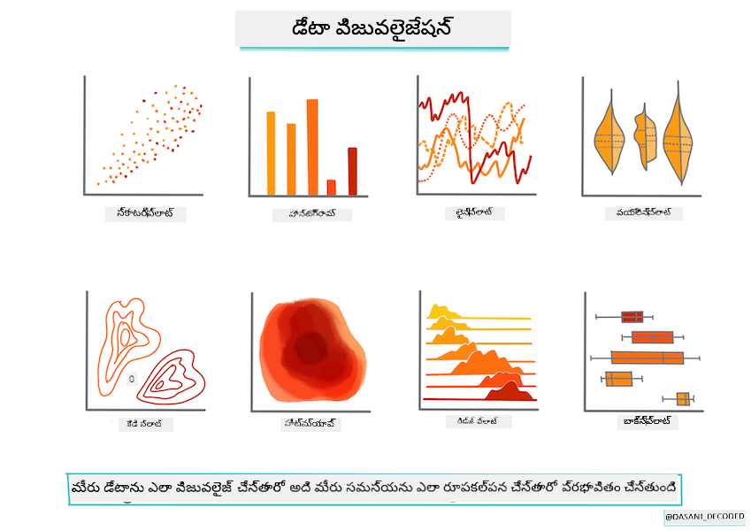

<!--
CO_OP_TRANSLATOR_METADATA:
{
  "original_hash": "7c077988328ebfe33b24d07945f16eca",
  "translation_date": "2025-12-19T13:58:37+00:00",
  "source_file": "2-Regression/2-Data/README.md",
  "language_code": "te"
}
-->
# Scikit-learn ఉపయోగించి రిగ్రెషన్ మోడల్ నిర్మించండి: డేటాను సిద్ధం చేయండి మరియు విజువలైజ్ చేయండి



ఇన్ఫోగ్రాఫిక్ [దాసాని మడిపల్లి](https://twitter.com/dasani_decoded) ద్వారా

## [ప్రీ-లెక్చర్ క్విజ్](https://ff-quizzes.netlify.app/en/ml/)

> ### [ఈ పాఠం R లో అందుబాటులో ఉంది!](../../../../2-Regression/2-Data/solution/R/lesson_2.html)

## పరిచయం

Scikit-learn తో మెషీన్ లెర్నింగ్ మోడల్ నిర్మాణాన్ని ప్రారంభించడానికి మీరు అవసరమైన టూల్స్ సెట్ చేసుకున్న తర్వాత, మీరు మీ డేటాను ప్రశ్నించడానికి సిద్ధంగా ఉన్నారు. డేటాతో పని చేయడం మరియు ML పరిష్కారాలను వర్తింపజేయడం సమయంలో, మీ డేటాసెట్ యొక్క సామర్థ్యాలను సరిగ్గా అన్‌లాక్ చేయడానికి సరైన ప్రశ్నను అడగడం చాలా ముఖ్యం.

ఈ పాఠంలో, మీరు నేర్చుకుంటారు:

- మోడల్-నిర్మాణం కోసం మీ డేటాను ఎలా సిద్ధం చేయాలి.
- డేటా విజువలైజేషన్ కోసం Matplotlib ను ఎలా ఉపయోగించాలి.

## మీ డేటాకు సరైన ప్రశ్న అడగడం

మీరు సమాధానం కావలసిన ప్రశ్న మీకు ఉపయోగించే ML అల్గోరిథమ్స్ రకాన్ని నిర్ణయిస్తుంది. మీరు పొందే సమాధానం నాణ్యత మీ డేటా స్వభావంపై బలంగా ఆధారపడి ఉంటుంది.

ఈ పాఠం కోసం అందించిన [డేటాను](https://github.com/microsoft/ML-For-Beginners/blob/main/2-Regression/data/US-pumpkins.csv) చూడండి. మీరు ఈ .csv ఫైల్‌ను VS Code లో తెరవవచ్చు. ఒక వేగవంతమైన పరిశీలనలోనే ఖాళీలు మరియు స్ట్రింగ్స్ మరియు న్యూమరిక్ డేటా మిశ్రమం ఉన్నట్లు కనిపిస్తుంది. 'Package' అనే విచిత్రమైన కాలమ్ కూడా ఉంది, ఇందులో డేటా 'sacks', 'bins' మరియు ఇతర విలువల మిశ్రమం. వాస్తవానికి, డేటా కొంత గందరగోళంగా ఉంది.

[](https://youtu.be/5qGjczWTrDQ "ML for beginners - How to Analyze and Clean a Dataset")

> 🎥 ఈ పాఠం కోసం డేటాను సిద్ధం చేయడాన్ని చూపించే చిన్న వీడియో కోసం పై చిత్రాన్ని క్లిక్ చేయండి.

వాస్తవానికి, పూర్తిగా ఉపయోగించడానికి సిద్ధంగా ఉన్న డేటాసెట్‌ను బహుమతిగా పొందడం చాలా సాధారణం కాదు. ఈ పాఠంలో, మీరు ప్రామాణిక Python లైబ్రరీలను ఉపయోగించి రా డేటాసెట్‌ను ఎలా సిద్ధం చేయాలో నేర్చుకుంటారు. మీరు డేటాను విజువలైజ్ చేయడానికి వివిధ సాంకేతికతలను కూడా నేర్చుకుంటారు.

## కేసు అధ్యయనం: 'పంప్కిన్ మార్కెట్'

ఈ ఫోల్డర్‌లో మీరు రూట్ `data` ఫోల్డర్‌లో [US-pumpkins.csv](https://github.com/microsoft/ML-For-Beginners/blob/main/2-Regression/data/US-pumpkins.csv) అనే .csv ఫైల్‌ను కనుగొంటారు, ఇది నగరాల వారీగా వర్గీకరించిన పంప్కిన్ మార్కెట్ గురించి 1757 లైన్ల డేటాను కలిగి ఉంది. ఇది యునైటెడ్ స్టేట్స్ డిపార్ట్‌మెంట్ ఆఫ్ అగ్రికల్చర్ పంపిణీ చేసే [Specialty Crops Terminal Markets Standard Reports](https://www.marketnews.usda.gov/mnp/fv-report-config-step1?type=termPrice) నుండి తీసుకున్న రా డేటా.

### డేటా సిద్ధం చేయడం

ఈ డేటా పబ్లిక్ డొమైన్‌లో ఉంది. USDA వెబ్ సైట్ నుండి ప్రతి నగరానికి వేర్వేరు ఫైళ్లలో డౌన్లోడ్ చేసుకోవచ్చు. చాలా వేర్వేరు ఫైళ్లను నివారించడానికి, మేము అన్ని నగరాల డేటాను ఒక స్ప్రెడ్షీట్‌లో కలిపాము, అందువల్ల మేము ఇప్పటికే డేటాను కొంతమేర _సిద్ధం_ చేసాము. తరువాత, డేటాను మరింత దగ్గరగా పరిశీలిద్దాం.

### పంప్కిన్ డేటా - ప్రారంభ తాత్త్వికాలు

ఈ డేటా గురించి మీరు ఏమి గమనించారు? మీరు ఇప్పటికే స్ట్రింగ్స్, నంబర్లు, ఖాళీలు మరియు విచిత్రమైన విలువల మిశ్రమం ఉన్నట్లు చూశారు, వాటిని అర్థం చేసుకోవాలి.

రిగ్రెషన్ సాంకేతికతను ఉపయోగించి ఈ డేటాకు మీరు ఏ ప్రశ్న అడగవచ్చు? "నిర్దిష్ట నెలలో అమ్మకానికి ఉన్న పంప్కిన్ ధరను అంచనా వేయండి" అని ఎలా ఉంటుంది? డేటాను మళ్లీ చూసినప్పుడు, ఈ పనికి అవసరమైన డేటా నిర్మాణాన్ని సృష్టించడానికి మీరు కొన్ని మార్పులు చేయాలి.

## వ్యాయామం - పంప్కిన్ డేటాను విశ్లేషించండి

డేటాను ఆకారంలోకి తెచ్చేందుకు చాలా ఉపయోగకరమైన పాండాస్ ([Pandas](https://pandas.pydata.org/)) ను ఉపయోగించి ఈ పంప్కిన్ డేటాను విశ్లేషించండి మరియు సిద్ధం చేయండి.

### మొదట, మిస్సింగ్ తేదీలను తనిఖీ చేయండి

ముందుగా మిస్సింగ్ తేదీలను తనిఖీ చేయడానికి చర్యలు తీసుకోవాలి:

1. తేదీలను నెల ఫార్మాట్‌కు మార్చండి (ఇవి US తేదీలు, కాబట్టి ఫార్మాట్ `MM/DD/YYYY`).
2. నెలను కొత్త కాలమ్‌గా తీసుకోండి.

Visual Studio Code లో _notebook.ipynb_ ఫైల్‌ను తెరవండి మరియు స్ప్రెడ్షీట్‌ను కొత్త Pandas డేటాఫ్రేమ్‌లో దిగుమతి చేసుకోండి.

1. మొదటి ఐదు వరుసలను చూడడానికి `head()` ఫంక్షన్‌ను ఉపయోగించండి.

    ```python
    import pandas as pd
    pumpkins = pd.read_csv('../data/US-pumpkins.csv')
    pumpkins.head()
    ```

    ✅ చివరి ఐదు వరుసలను చూడడానికి మీరు ఏ ఫంక్షన్ ఉపయోగిస్తారు?

1. ప్రస్తుత డేటాఫ్రేమ్‌లో మిస్సింగ్ డేటా ఉందా అని తనిఖీ చేయండి:

    ```python
    pumpkins.isnull().sum()
    ```

    మిస్సింగ్ డేటా ఉంది, కానీ ఇది ప్రస్తుత పనికి ప్రభావం చూపకపోవచ్చు.

1. మీ డేటాఫ్రేమ్‌తో పని చేయడం సులభం కావడానికి, మీరు అవసరమైన కాలమ్స్ మాత్రమే `loc` ఫంక్షన్ ఉపయోగించి ఎంచుకోండి, ఇది ఒరిజినల్ డేటాఫ్రేమ్ నుండి వరుసలు (మొదటి పారామీటర్‌గా) మరియు కాలమ్స్ (రెండవ పారామీటర్‌గా) తీసుకుంటుంది. క్రింద ఉన్న `:` అన్నది "అన్ని వరుసలు" అని అర్థం.

    ```python
    columns_to_select = ['Package', 'Low Price', 'High Price', 'Date']
    pumpkins = pumpkins.loc[:, columns_to_select]
    ```

### రెండవది, పంప్కిన్ సగటు ధరను నిర్ణయించండి

నిర్దిష్ట నెలలో పంప్కిన్ సగటు ధరను ఎలా నిర్ణయించాలో ఆలోచించండి. ఈ పనికి మీరు ఏ కాలమ్స్ ఎంచుకుంటారు? సూచన: మీరు 3 కాలమ్స్ అవసరం.

పరిష్కారం: `Low Price` మరియు `High Price` కాలమ్స్ సగటు తీసుకుని కొత్త Price కాలమ్‌ను పూరించండి, మరియు Date కాలమ్‌ను నెల మాత్రమే చూపించేలా మార్చండి. అదృష్టవశాత్తు, పై తనిఖీ ప్రకారం, తేదీలు లేదా ధరల కోసం మిస్సింగ్ డేటా లేదు.

1. సగటు లెక్కించడానికి, క్రింది కోడ్ జోడించండి:

    ```python
    price = (pumpkins['Low Price'] + pumpkins['High Price']) / 2

    month = pd.DatetimeIndex(pumpkins['Date']).month

    ```

   ✅ మీరు `print(month)` ఉపయోగించి ఏ డేటా అయినా తనిఖీ చేయడానికి ప్రింట్ చేయవచ్చు.

2. ఇప్పుడు, మీ మార్చిన డేటాను కొత్త Pandas డేటాఫ్రేమ్‌లో కాపీ చేయండి:

    ```python
    new_pumpkins = pd.DataFrame({'Month': month, 'Package': pumpkins['Package'], 'Low Price': pumpkins['Low Price'],'High Price': pumpkins['High Price'], 'Price': price})
    ```

    మీ డేటాఫ్రేమ్‌ను ప్రింట్ చేస్తే, మీరు కొత్త రిగ్రెషన్ మోడల్ నిర్మించడానికి శుభ్రమైన, సజావుగా ఉన్న డేటాసెట్‌ను చూడగలుగుతారు.

### కానీ వేచి ఉండండి! ఇక్కడ ఒక విచిత్ర విషయం ఉంది

`Package` కాలమ్‌ను చూస్తే, పంప్కిన్లు అనేక వేర్వేరు ఆకృతుల్లో అమ్మబడుతున్నాయి. కొన్ని '1 1/9 బుషెల్' కొలతలలో, కొన్ని '1/2 బుషెల్' కొలతలలో, కొన్ని ఒక్కొక్క పంప్కిన్‌కు, కొన్ని పౌండ్లకు, మరియు కొన్ని విభిన్న వెడల్పుల పెద్ద బాక్స్‌లలో అమ్మబడుతున్నాయి.

> పంప్కిన్లను సరిగ్గా తూగడం చాలా కష్టం అనిపిస్తుంది

మూల డేటాలో లోతుగా చూస్తే, `Unit of Sale` 'EACH' లేదా 'PER BIN' ఉన్న వాటికి `Package` రకం అంగుళం, బిన్ లేదా 'each' అని ఉంటుంది. పంప్కిన్లను సరిగ్గా తూగడం చాలా కష్టం కనుక, `Package` కాలమ్‌లో 'bushel' స్ట్రింగ్ ఉన్న పంప్కిన్లను మాత్రమే ఎంచుకుని ఫిల్టర్ చేద్దాం.

1. ఫైల్ ప్రారంభంలో, మొదటి .csv దిగుమతి కింద ఫిల్టర్ జోడించండి:

    ```python
    pumpkins = pumpkins[pumpkins['Package'].str.contains('bushel', case=True, regex=True)]
    ```

    ఇప్పుడు మీరు డేటాను ప్రింట్ చేస్తే, మీరు బుషెల్ ద్వారా పంప్కిన్లను కలిగిన సుమారు 415 వరుసల డేటాను మాత్రమే పొందుతున్నారని చూడగలుగుతారు.

### కానీ వేచి ఉండండి! ఇంకా ఒక పని చేయాలి

మీరు గమనించారా, బుషెల్ పరిమాణం వరుసల వారీగా మారుతుంది? మీరు ధరలను బుషెల్‌కు అనుగుణంగా సాధారణీకరించాలి, కాబట్టి ధరలను బుషెల్‌కు సరిపడేలా గణితం చేయండి.

1. కొత్త_pumpkins డేటాఫ్రేమ్ సృష్టించిన తర్వాత ఈ లైన్లను జోడించండి:

    ```python
    new_pumpkins.loc[new_pumpkins['Package'].str.contains('1 1/9'), 'Price'] = price/(1 + 1/9)

    new_pumpkins.loc[new_pumpkins['Package'].str.contains('1/2'), 'Price'] = price/(1/2)
    ```

✅ [The Spruce Eats](https://www.thespruceeats.com/how-much-is-a-bushel-1389308) ప్రకారం, బుషెల్ బరువు ఉత్పత్తి రకంపై ఆధారపడి ఉంటుంది, ఎందుకంటే ఇది వాల్యూమ్ కొలత. "ఉదాహరణకు, టమోటాలు బుషెల్ 56 పౌండ్ల బరువు ఉండాలి... ఆకులు మరియు ఆకుకూరలు తక్కువ బరువుతో ఎక్కువ స్థలం తీసుకుంటాయి, కాబట్టి స్పినాచ్ బుషెల్ 20 పౌండ్లే ఉంటుంది." ఇది చాలా క్లిష్టం! బుషెల్-టు-పౌండ్ మార్పిడి చేయకుండా, బుషెల్ ప్రకారం ధర నిర్ణయిద్దాం. ఈ పంప్కిన్ బుషెల్ అధ్యయనం మీ డేటా స్వభావాన్ని అర్థం చేసుకోవడం ఎంత ముఖ్యమో చూపిస్తుంది!

ఇప్పుడు, మీరు బుషెల్ కొలత ఆధారంగా యూనిట్ ధరలను విశ్లేషించవచ్చు. మీరు డేటాను మరలా ప్రింట్ చేస్తే, అది ఎలా సాధారణీకరించబడిందో చూడవచ్చు.

✅ మీరు గమనించారా, సగం బుషెల్ ద్వారా అమ్మే పంప్కిన్లు చాలా ఖరీదైనవి? ఎందుకని మీరు అర్థం చేసుకోగలరా? సూచన: చిన్న పంప్కిన్లు పెద్ద వాటికంటే చాలా ఎక్కువ ధర కలిగి ఉంటాయి, ఎందుకంటే పెద్ద హాలో పాయ్ పంప్కిన్ తీసుకునే ఉపయోగించని స్థలం కారణంగా బుషెల్‌కు చాలా ఎక్కువ చిన్న పంప్కిన్లు ఉంటాయి.

## విజువలైజేషన్ వ్యూహాలు

డేటా సైంటిస్ట్ పాత్రలో భాగంగా వారు పని చేస్తున్న డేటా నాణ్యత మరియు స్వభావాన్ని ప్రదర్శించడం ఉంటుంది. దీని కోసం, వారు తరచుగా ఆసక్తికరమైన విజువలైజేషన్లు, ప్లాట్లు, గ్రాఫ్లు మరియు చార్ట్లు సృష్టిస్తారు, డేటా వివిధ కోణాలను చూపిస్తూ. ఈ విధంగా, వారు بصریంగా సంబంధాలు మరియు గ్యాప్స్ చూపగలుగుతారు, ఇవి ఇతరथा కనుగొనడం కష్టం.

[](https://youtu.be/SbUkxH6IJo0 "ML for beginners - How to Visualize Data with Matplotlib")

> 🎥 ఈ పాఠం కోసం డేటాను విజువలైజ్ చేయడాన్ని చూపించే చిన్న వీడియో కోసం పై చిత్రాన్ని క్లిక్ చేయండి.

విజువలైజేషన్లు డేటాకు అత్యంత అనుకూలమైన మెషీన్ లెర్నింగ్ సాంకేతికతను నిర్ణయించడంలో కూడా సహాయపడతాయి. ఉదాహరణకు, ఒక స్కాటర్‌ప్లాట్ ఒక రేఖను అనుసరిస్తున్నట్లయితే, ఆ డేటా లీనియర్ రిగ్రెషన్ వ్యాయామానికి మంచి అభ్యర్థిగా ఉంటుంది.

Jupyter నోట్బుక్స్‌లో బాగా పనిచేసే ఒక డేటా విజువలైజేషన్ లైబ్రరీ [Matplotlib](https://matplotlib.org/) (ముందటి పాఠంలో మీరు చూసినది).

> [ఈ ట్యుటోరియల్స్](https://docs.microsoft.com/learn/modules/explore-analyze-data-with-python?WT.mc_id=academic-77952-leestott) లో డేటా విజువలైజేషన్ పై మరింత అనుభవం పొందండి.

## వ్యాయామం - Matplotlib తో ప్రయోగం చేయండి

మీరు సృష్టించిన కొత్త డేటాఫ్రేమ్‌ను ప్రదర్శించడానికి కొన్ని ప్రాథమిక ప్లాట్లు సృష్టించడానికి ప్రయత్నించండి. ఒక ప్రాథమిక లైన్ ప్లాట్ ఏమి చూపిస్తుంది?

1. ఫైల్ ప్రారంభంలో, Pandas దిగుమతి కింద Matplotlib ను దిగుమతి చేసుకోండి:

    ```python
    import matplotlib.pyplot as plt
    ```

1. మొత్తం నోట్బుక్‌ను రీఫ్రెష్ చేయడానికి మళ్లీ నడపండి.
1. నోట్బుక్ చివరలో, డేటాను బాక్స్‌గా ప్లాట్ చేయడానికి ఒక సెల్ జోడించండి:

    ```python
    price = new_pumpkins.Price
    month = new_pumpkins.Month
    plt.scatter(price, month)
    plt.show()
    ```

    

    ఇది ఉపయోగకరమైన ప్లాట్నా? ఇందులో ఏదైనా ఆశ్చర్యకరమైనది ఉందా?

    ఇది ప్రత్యేకంగా ఉపయోగకరం కాదు, ఎందుకంటే ఇది మీ డేటాను ఒక నెలలో పాయింట్ల విస్తరణగా మాత్రమే ప్రదర్శిస్తుంది.

### దీన్ని ఉపయోగకరంగా చేయండి

చార్ట్లు ఉపయోగకరమైన డేటాను ప్రదర్శించాలంటే, మీరు సాధారణంగా డేటాను ఏదో విధంగా గ్రూప్ చేయాలి. నెలలను y అక్షంగా చూపించే మరియు డేటా పంపిణీని ప్రదర్శించే ప్లాట్ సృష్టించడానికి ప్రయత్నిద్దాం.

1. గ్రూప్ చేసిన బార్ చార్ట్ సృష్టించడానికి ఒక సెల్ జోడించండి:

    ```python
    new_pumpkins.groupby(['Month'])['Price'].mean().plot(kind='bar')
    plt.ylabel("Pumpkin Price")
    ```

    

    ఇది మరింత ఉపయోగకరమైన డేటా విజువలైజేషన్! ఇది పంప్కిన్ ధర సెప్టెంబర్ మరియు అక్టోబర్‌లో అత్యధికంగా ఉంటుందని సూచిస్తుంది. ఇది మీ అంచనాకు సరిపోతుందా? ఎందుకు లేదా ఎందుకు కాదు?

---

## 🚀సవాలు

Matplotlib అందించే వివిధ రకాల విజువలైజేషన్లను అన్వేషించండి. రిగ్రెషన్ సమస్యలకు ఏ రకాలు అత్యంత అనుకూలంగా ఉంటాయి?

## [పోస్ట్-లెక్చర్ క్విజ్](https://ff-quizzes.netlify.app/en/ml/)

## సమీక్ష & స్వీయ అధ్యయనం

డేటాను విజువలైజ్ చేయడానికి అనేక మార్గాలను పరిశీలించండి. వివిధ లైబ్రరీల జాబితాను తయారుచేసి, ఏవి ఏ రకాల పనులకు ఉత్తమం అవుతాయో గమనించండి, ఉదాహరణకు 2D విజువలైజేషన్లు vs. 3D విజువలైజేషన్లు. మీరు ఏమి కనుగొంటారు?

## అసైన్‌మెంట్

[విజువలైజేషన్ అన్వేషణ](assignment.md)

---

<!-- CO-OP TRANSLATOR DISCLAIMER START -->
**అస్పష్టత**:  
ఈ పత్రాన్ని AI అనువాద సేవ [Co-op Translator](https://github.com/Azure/co-op-translator) ఉపయోగించి అనువదించబడింది. మేము ఖచ్చితత్వానికి ప్రయత్నించినప్పటికీ, ఆటోమేటెడ్ అనువాదాల్లో పొరపాట్లు లేదా తప్పిదాలు ఉండవచ్చు. మూల పత్రం దాని స్వదేశీ భాషలో అధికారిక మూలంగా పరిగణించాలి. ముఖ్యమైన సమాచారానికి, ప్రొఫెషనల్ మానవ అనువాదం సిఫార్సు చేయబడుతుంది. ఈ అనువాదం వాడకంలో ఏర్పడిన ఏవైనా అపార్థాలు లేదా తప్పుదారితీసే అర్థాలు కోసం మేము బాధ్యత వహించము.
<!-- CO-OP TRANSLATOR DISCLAIMER END -->