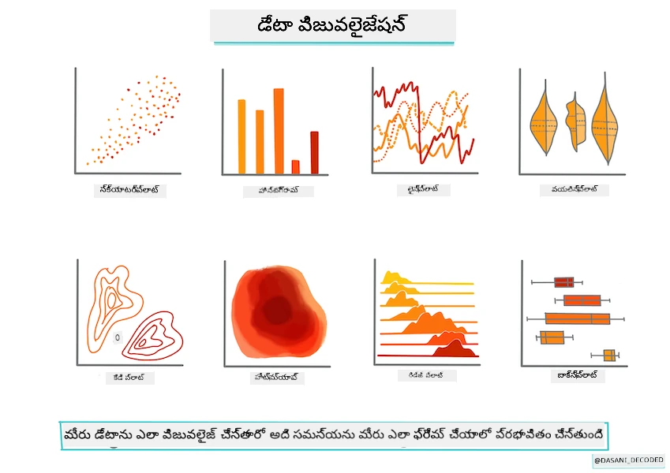
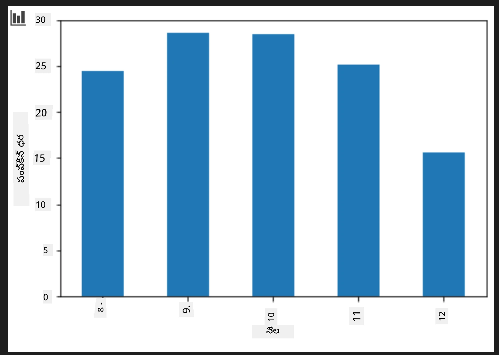
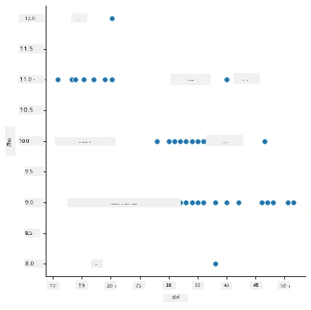
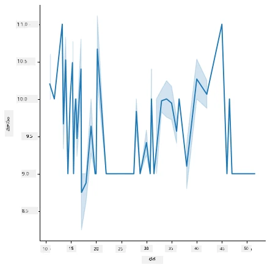
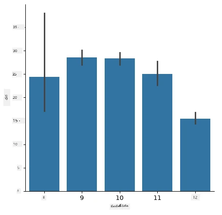
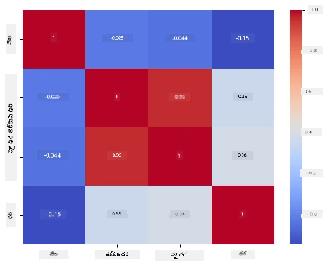

# Scikit-learn ఉపయోగించి రిగ్రెషన్ మోడల్‌ను నిర్మించండి: డేటా సిద్ధం చేయండి మరియు విజువలైజ్ చేయండి



ఇన్ఫోగ్రాఫిక్ [Dasani Madipalli](https://twitter.com/dasani_decoded) చేత

## [ప్రీ-లెక్చర్ క్విజ్](https://ff-quizzes.netlify.app/en/ml/)

> ### [ఈ పాఠం R లో అందుబాటులో ఉంది!](../../../../2-Regression/2-Data/solution/R/lesson_2.html)

## పరిచయం

మీరు Scikit-learn తో యాంత్రిక అభ్యాస నమూనా నిర్మాణాన్ని ప్రారంభించడానికి అవసరమైన సాధనాలతో సన్నద్ధంగా ఉన్నప్పుడు, మీ డేటాపై ప్రశ్నలు అడగడానికి సిద్ధంగా ఉన్నారు. మీరు డేటాతో పని చేస్తూ ML పరిష్కారాలను అన్వయించినప్పుడు, మీ డేటాసెట్ యొక్క శక్తులను సక్రమంగా విశ్లేషించేందుకు సరైన ప్రశ్న ఎలా అడగాలి అనేది అర్థం చేసుకోవడం చాలా ముఖ్యం.

ఈ పాఠంలో మీరు నేర్చుకుంటారు:

- మోడల్-బిల్డింగ్ కోసం మీ డేటాను ఎలా తయారు చేసుకోవాలి.
- డేటా విజువలైజేషన్ కోసం Matplotlib ను ఎలా ఉపయోగించాలి.
- మరింత స్పష్టమైన డేటా విజువలైజేషన్ కోసం Seaborn ను ఎలా ఉపయోగించాలి.

## మీ డేటాకు సరైన ప్రశ్న అడగడం

మీరు సమాధానం కావలసిన ప్రశ్న మీరు ఉపయోగించబోయే ML ఆల్గోరిథమ్స్ రకాన్ని నిర్ణయిస్తుంది. మీరు పొందే సమాధానం నాణ్యత మీ డేటా స్వభావంపై బరువుగా ఆధారపడి ఉంటుంది.

ఈ పాఠానికి అందుబాటులో ఉన్న [డేటా](https://github.com/microsoft/ML-For-Beginners/blob/main/2-Regression/data/US-pumpkins.csv) ను పరిశీలించండి. ఈ .csv ఫైల్‌ను VS Code లో తెరవొచ్చు. చురుకైన పరిశీలన వెంటనే తెలియజేస్తుంది ఈ డేటాలో ఖాళీలు, స్ట్రింగ్స్ మరియు సంఖ్యల మిశ్రమం ఉందని. 'Package' అనే విచిత్రమైన కాలమ్ కూడా ఉంది, డేటా 'sacks', 'bins' మరియు ఇతర విలువల మిశ్రమంగా ఉంది. వాస్తవానికి, డేటా కొంత అసమంజసంగా ఉంది.

[](https://youtu.be/5qGjczWTrDQ "ML for beginners - ఒక డేటాసెట్‌ను ఎలా విశ్లేషించి శుభ్రం చేయాలి")

> 🎥 ఈ పాఠానికి డేటాను సిద్ధం చేసే సంక్షిప్త వీడియో కోసం పై చిత్రం క్లిక్ చేయండి.

వాస్తవానికి, ఓ డేటాసెట్‌ను పూర్తిగా ఉపయోగించడానికి సన్నద్ధంగా మిళితం చేయబడినట్లు అందుకోవడం అరుదు. ఈ పాఠంలో, మీరు ప్రామాణిక Python లైబ్రరీలు ఉపయోగించి రా డేటాను ఎలా సిద్దం చేయాలో నేర్చుకుంటారు. మీరు డేటాను విజువలైజ్ చేసే వివిధ సాంకేతికాలను కూడా నేర్చుకుంటారు.

## కేస్ స్టడీ: 'పంప్కిన్ మార్కెట్'

ఈ ఫోల్డర్‌లో మీరు రూట్ `data` ఫోల్డర్‌లో [US-pumpkins.csv](https://github.com/microsoft/ML-For-Beginners/blob/main/2-Regression/data/US-pumpkins.csv) అనే .csv ఫైల్‌ను కనుగొంటారు, దీనిలో సిటీల వారీగా వర్గీకరించిన 1757 లైన్లుగా pumpkins మార్కెట్ గురించి డేటా ఉంది. ఇది యునైటెడ్ స్టేట్స్ డిపార్ట్‌మెంట్ ఆఫ్ అగ్రికల్చర్ పంపిణీ చేసే [Specialty Crops Terminal Markets Standard Reports](https://www.marketnews.usda.gov/mnp/fv-report-config-step1?type=termPrice) నుండి వెలికి తీయబడిన రా డేటా.

### డేటా సిద్ధం చేయడం

ఈ డేటా పబ్లిక్ డొమైన్ లో ఉంది. USDA వెబ్‌సైట్ నుండి సిటీ వారీగా వేరే వేరే ఫైళ్లలో డౌన్‌లోడ్ చేయవచ్చు. చాలా వేర్వేరు ఫైళ్లను సృష్టించకుండా ఉండేందుకు, మేము అన్ని సిటీ డేటాను ఒక స్ప్రెడ్షీట్‌లో మిళితం చేశాము, కాబట్టి కొంత వరకు మేము డేటాను _సిద్ధం_ చేసినట్టే. ఇప్పుడు, డేటాను మరింత దగ్గరగా పరిశీలిద్దాం.

### సంపూర్ణ పంప్కిన్ డేటా - ప్రారంభ నిష్కర్షలు

ఈ డేటా గురించి మీరు ఏమి గమనిస్తారు? మీరు ఇప్పటికే స్ట్రింగ్స్, సంఖ్యలు, ఖాళీలు మరియు విచిత్రమైన విలువల మిశ్రమం ఉందని చూశారు, ఇవి మీరు అర్థం చేసుకోవాలి.

రిగ్రెషన్ సాంకేతికత వాడి ఈ డేటాకు మీరు ఏమి ప్రశ్న అడగగలరు? ఉదాహరణకు "నిర్దిష్ట నెలలో అమ్మకానికి ఉండే పంప్కిన్ ధరను అంచనా వేయండి" అనే ప్రశ్న ఎలానో చూడండి. డేటాను మరోసారి పరిశీలిస్తే, ఈ పని కోసం అవసరమైన డేటా నిర్మాణాన్ని సృష్టించడానికి కొన్ని మార్పులు అవసరం.
## వ్యాయామం - పంప్కిన్ డేటా విశ్లేషణ

[Pandas](https://pandas.pydata.org/), (పేరు `Python Data Analysis` కి సంక్షిప్తం), డేటా ఆకారాన్ని మార్చటానికి చాలా ఉపయోగకరమైన సాధనం, ఉపయోగించి ఈ పంప్కిన్ డేటాను విశ్లేషించి సిద్దం చేయండి.

### ముందుగా, మిస్సింగ్ తేదీలను పరిశీలించండి

ముందుగా మీరు మిస్సింగ్ తేదీలు ఉన్నాయో లేదో పరిశీలించండి:

1. తేదీలను నెల ఫార్మాట్‌గా మార్చండి (ఇవి US తేదీలు, కాబట్టి ఫార్మాట్ `MM/DD/YYYY`).
2. నెలను కొత్త కాలమ్‌లో తీసుకోండి.

Visual Studio Code లో _notebook.ipynb_ ఫైల్ తెరవండి మరియు స్ప్రెడ్షీట్‌ను కొత్త Pandas డేటాఫ్రేమ్‌లో దిగుమతి చేయండి.

1. మొదటి ఐదు పంగ్తులను చూడటానికి `head()` ఫంక్షన్ వాడండి.

    ```python
    import pandas as pd
    pumpkins = pd.read_csv('../data/US-pumpkins.csv')
    pumpkins.head()
    ```

    ✅ చివరి ఐదు పంగ్తులను చూడటానికి మీరు ఏ ఫంక్షన్ వాడతారు?

1. ప్రస్తుత డేటాఫ్రేమ్ లో మిస్సింగ్ డేటా ఉన్నదేమో చూడండి:

    ```python
    pumpkins.isnull().sum()
    ```

    మిస్సింగ్ డేటా ఉంది, కానీ మీరు చేసే పనికి అది ప్రాముఖ్యం కాకపోవచ్చు.

1. మీ డేటాఫ్రేమ్‌తో పని సులభం చేయడానికి, అవసరమైన కాలమ్స్ ని మాత్రమే `loc` ఫంక్షన్ ద్వారా ఎంచుకోండి, ఇది ఒరిజినల్ డేటాఫ్రేమ్ నుండి పంగ్తులు (మొదటి పారామీటర్) మరియు కాలమ్స్ (రెండవ పారామీటర్) ను తీసుకుంటుంది. క్రింద ఉన్న `:` అర్థం "అన్ని పంగ్తులు".

    ```python
    columns_to_select = ['Package', 'Low Price', 'High Price', 'Date']
    pumpkins = pumpkins.loc[:, columns_to_select]
    ```

### రెండవది, పంప్కిన్ సగటు ధర నిర్ణయించండి

ఒక నెలలో పంప్కిన్ సగటు ధర ఎలా నిర్ణయించాలో ఆలోచించండి. ఈ పనికి మీరు ఏ కాలమ్స్ ఎంచుకుంటారు? సూచన: మీరు 3 కాలమ్స్ అవసరం.

పరిష్కారం: కొత్త ధర కాలమ్ నింపడానికి `Low Price` మరియు `High Price` కాలమ్స్ సగటు తీసుకోవడం, మరియు Date కాలమ్‌ను కేవలం నెలను చూపించేలా మార్చడం. అదృష్టవశాత్తూ, పై తనిఖీ ప్రకారం, తేదీలు లేదా ధరల కోసం మిస్సింగ్ డేటా లేదు.

1. సగటు ధర ఖరారుచేయడానికి ఈ కోడ్ జోడించండి:

    ```python
    price = (pumpkins['Low Price'] + pumpkins['High Price']) / 2

    month = pd.DatetimeIndex(pumpkins['Date']).month

    ```

   ✅ మీరు `print(month)` ఉపయోగించి ఏ డేటా అయినా చూడవచ్చు.

2. ఇప్పుడు, మార్చిన డేటాను కొత్త Pandas డేటాఫ్రేమ్‌లో నకలుచేసుకోండి:

    ```python
    new_pumpkins = pd.DataFrame({'Month': month, 'Package': pumpkins['Package'], 'Low Price': pumpkins['Low Price'],'High Price': pumpkins['High Price'], 'Price': price})
    ```

    మీ డేటాఫ్రేమ్ ముద్రించితే, మీరు ఒక శుభ్ర మరియు సముచితమైన డేటాసెట్ చూస్తారు, దీని పై మీరు కొత్త రిగ్రెషన్ మోడల్ నిర్మించవచ్చు.

### అయితే! ఇక్కడ కొంత విచిత్రత ఉంది

మీరు `Package` కాలమ్ గమనిస్తే, pumpkins అనేక రకాలుగా అమ్మబడుతున్నాయి. కొంత '1 1/9 bushel' కొలమానం, కొంత '1/2 bushel', కొంత pumpkin ప్రాతినిథ్యం, మరికొంత పౌండ్ల అనుగుణంగా, ఇంకా కొంత పెద్ద బాక్సుల్లో వివిధ వెడల్పులతో.

> pumpkins ని స్థిరంగా తూకం పంపించడం చాలా కష్టం అని కనిపిస్తోంది

అసలు డేటాలో చూపిస్తున్నట్లుగా, `Unit of Sale` 'EACH' లేదా 'PER BIN' గా ఉన్న ఏదైనా `Package` రకం అంగుళం, బిన్, లేదా 'each'గా వుంది. pumpkins ని స్థిరంగా తూకం పంపించడం చాలా కష్టం కనుక, వారి `Package` కాలమ్లో 'bushel' స్ట్రింగ్ ఉన్న pumpkins మాత్రమే ఎంచుకుని ఫిల్టర్ చేయండి.

1. ఫైల్ ప్రారంభంలో, మొదటి .csv దిగుమతుల తర్వాత ఫిల్టర్ జోడించండి:

    ```python
    pumpkins = pumpkins[pumpkins['Package'].str.contains('bushel', case=True, regex=True)]
    ```

    మీరు ఇప్పుడు డేటాను ప్రింట్ చేస్తే, మీరు బస్సెల్ ద్వారా pumpkins కలిగి ఉన్న సుమారు 415 ఎంట్రీలను మాత్రమే చూస్తారు.

### కానీ! ఇంకో పని ఒకది చేయాల్సి ఉంది

మీరు గమనిస్తారా, ప్రతి పంగ్తిలో బస్సెల్ పరిమాణం మారుతుంది? మీరు ధరలను ఒకే ప్రమాణంలో చూపించాలంటే, బస్సెల్ ప్రామాణానికి సరిపడ도록 గణితశాస్త్రం చేయాలి.

1. ఈ క్రొత్త_new_pumpkins డేటాఫ్రేమ్ సృష్టించిన బ్లాక్ తరువాత ఈ వరుసలు జోడించండి:

    ```python
    new_pumpkins.loc[new_pumpkins['Package'].str.contains('1 1/9'), 'Price'] = price/(1 + 1/9)

    new_pumpkins.loc[new_pumpkins['Package'].str.contains('1/2'), 'Price'] = price/(1/2)
    ```

✅ [The Spruce Eats](https://www.thespruceeats.com/how-much-is-a-bushel-1389308) ప్రకారం, బస్సెల్ యొక్క బరువు ఉత్పత్తి రకంపై ఆధారపడి ఉంటుంది, ఇది వాల్యూమ్ కొలత. "ఉదాహరణకు, టమాటోలు బస్సెల్ 56 పౌండ్ల బరువు కలిగి ఉండాలి... ఆకు కూరగాయలు తక్కువ బరువుతో ఎక్కువ స్థలాన్ని తీసుకుంటాయి, కాబట్టి స్పిన్నాచ్ బస్సెల్ 20 పౌండ్ల మాత్రమే ఉంటుంది." ఇది చాలా జటిలం! బస్సెల్ నుండి పౌండ్లకు మార్పిడి చేయకుండా బస్సెల్ ప్రకారం ధరను చూపిద్దాం. పంప్కిన్ బస్సెల్స్ పై ఈ అధ్యయనం మీ డేటా స్వభావాన్ని అర్థం చేసుకోవటం ఎంత ముఖ్యం అనేది చూపిస్తుంది!

ఇప్పుడు, మీరు బస్సెల్ కొలత ఆధారంగా యూనిట్ ప్రైసింగ్‌ను విశ్లేషించవచ్చు. మీరు ఒక దఫా మరల డేటా ప్రింట్ చేస్తే, అది ఎలా ప్రమాణీకరించబడిందో చూడగలరు.

✅ మీరు గమనించారా, అর্ধ బస్సెల్ ద్వారా అమ్ముతున్న pumpkins చాలా ఖరీదైనవి. దీని కారణం మీకు అర్థమవుతుందా? సూచన: చిన్న pumpkins పెద్ద pumpkins కంటే చాలా ఎక్కువ ధర కలుగుతుంది, ఎందుకంటే పెద్ద బస్సెల్ ఓ పెద్ద, ఖాళీ పిండి పంప్కిన్ తీసుకునే స్థలాన్ని తగ్గిస్తుంది, అందుబాటులో లేని స్థలం కారణంగా ఎక్కువ pumpkins ఉంటాయి.

## విజువలైజేషన్ యుక్తులు

డేటా శాస్త్రవేత్తగా మీ పని భాగం మీరు పని చేస్తున్న డేటా నాణ్యత మరియు స్వభావాన్ని ప్రదర్శించడం. దీని కోసం, వారు తరచుగా వివిధ డేటా పార్శ్వాలను చూపించే ఆసక్తికరమైన విజువలైజేషన్లు, ప్లాట్లు, గ్రాఫ్లు, చార్ట్లు తయారుచేస్తారు. అలా చేస్తే, సానుకూల సంబంధాలు మరియు గ్యాప్‌లు చూపించబడతాయి, ఇవి మరలా కనుగొనడం కష్టమైనవి.

[](https://youtu.be/SbUkxH6IJo0 "ML for beginners - Matplotlib తో డేటా విజువలైజ్ ఎలా చేయాలి")

> 🎥 ఈ పాఠానికి డేటా విజువలైజ్ చేసే సంక్షిప్త వీడియో కోసం పై చిత్రం క్లిక్ చేయండి.

విజువలైజేషన్లు డేటాకు అత్యుత్తమ యాంత్రిక అభ్యాస సాంకేతికాన్ని ఎంపిక చేయడంలో కూడా సహాయపడతాయి. ఉదాహరణకు, ఒక స్కాటర్‌ప్లాట్ లైన్‌ను అనుసరిస్తుందని కనిపిస్తే, ఆ డేటా లీనియర్ రిగ్రెషన్ ఉపయోగించడానికి అనుకూలంగా ఉండవచ్చు.

Jupyter నోట్బుక్‌లలో బాగా పనిచేసే ఒక డేటా విజువలైజేషన్ లైబ్రరీ [Matplotlib](https://matplotlib.org/) (ముందరి పాఠంలో మీరు దీనిని చూశారు).

> మరింత అనుభవం కోసం [ఈ ట్యుటోరియల్స్](https://docs.microsoft.com/learn/modules/explore-analyze-data-with-python?WT.mc_id=academic-77952-leestott) చూడండి.

## వ్యాయామం - Matplotlib తో ప్రయోగం చేయండి

మీరు సృష్టించిన కొత్త డేటాఫ్రేమ్ ప్రదర్శించడానికి కొంత సరళమైన ప్లాట్లు తయారుచేయండి. ఒక సాధారణ లైన్ ప్లాట్ ఏం చూపిస్తుంది?

1. ఫైల్ టాప్‌లో Pandas దిగుమతి కింద Matplotlib దిగుమతి చేయండి:

    ```python
    import matplotlib.pyplot as plt
    ```

1. మొత్తం నోట్బుక్‌ను తిరిగి పరుగెత్తించండి.
1. నోట్బుక్ దిగువ భాగంలో, డేటాను బాక్స్ ప్లాట్‌గా చూపడానికి ఒక సెల్ జోడించండి:

    ```python
    price = new_pumpkins.Price
    month = new_pumpkins.Month
    plt.scatter(price, month)
    plt.show()
    ```

    

    ఇది ఉపయోగకరమైన ప్లాట్ అని మీరు అనుకుంటారా? ఏమీ మీరు ఆశ్చర్యపరుస్తుందా?

    ఇది అంతగా ఉపయోగకరం కాదు, ఎందుకంటే ఇది కేవలం మీ డేటాను ఒక నెలలో పాయింట్లు ఆవర్తనంగా మాత్రమే చూపుతోంది.

### ఉపయోగకరంగా మార్చండి

డేటాను ఉపయోగకరంగా చూపించాలంటే, మీరు సాధారణంగా డేటాను ఏదో విధంగా సమూహాలుగా పంచడం చాలా అవసరం. y అక్షం నెలలను చూపిస్తూ, డేటా పంపిణీని చూపించే ప్లాట్ తయారుచేయాలని ప్రయత్నిద్దాం.

1. సమూహ బార్ చార్ట్ సృష్టించడానికి సెల్ జోడించండి:

    ```python
    new_pumpkins.groupby(['Month'])['Price'].mean().plot(kind='bar')
    plt.ylabel("Pumpkin Price")
    ```

    

    ఇది మరింత ఉపయోగకరమైన డేటా విజువలైజేషన్! pumpkins కి అత్యధిక ధర సెప్టెంబర్ మరియు అక్టోబర్ నెలల్లో ఉందని ఇది సూచిస్తుంది. మీ అంచనాలకు ఇది సరిపోతుందా? ఎందుకు లేదా ఎందుకు కాదు?

## వ్యాయామం - Seaborn తో ప్రయోగం చేయండి

Matplotlib శక్తివంతమైనది, కానీ మంచి ప్లాట్ తయారుచేసేందుకు చాలా కోడ్ అవసరం. [Seaborn](https://seaborn.pydata.org/) Matplotlib పై నిర్మించిన లైబ్రరీ, ఇది గణాంక డేటా విజువలైజేషన్ కోసం రూపొందించబడింది. ఇది ప్రత్యక్షంగా Pandas డేటాఫ్రేమ్‌లతో పనిచేస్తుంది, ఆకర్షణీయ డిఫాల్ట్ శైలులు వర్తింపజేస్తుంది, మరియు బాగున్న కోడ్ తో సమాచారం పూర్వకమైన ప్లాట్‌లను సృష్టిస్తుంది. Seaborn Matplotlib ఆబ్జెక్టులనిస్తాయి, అందువల్ల మీరు Matplotlib గురించి ఇప్పటికే తెలిసిన వాటితో ఫలితాన్ని మెరిట్వారుగా మార్చుకోవచ్చు.

> మీరు ఇప్పటికే Seaborn ఇన్‌స్టాల్ చేయలేదు అయితే, `pip install seaborn`తో ఇన్‌స్టాల్ చేయండి.

1. ఇతర దిగుమతుల కింద నోట్బుక్ టాప్ లో Seaborn ను దిగుమతి చేయండి. ఇది సాధారణంగా `sns` గా దిగుమతి చేయబడుతుంది:

    ```python
    import seaborn as sns
    ```

### సంబంధాలు చూపించే స్కాటర్ ప్లాట్లు

నమూనా నిర్మించే ముందు డేటాను పరిశీలించడం లో పెద్ద భాగం వేరియబుల్స్ మధ్య _సంభందాలు_ చూడటం. ఒక [scatter plot](https://en.wikipedia.org/wiki/Scatter_plot) ఈకార్యం కోసం మంచి సాధనం: పాయింట్లు ఒక లైన్‌ను అనుసరిస్తే, రెండు వేరియబుల్స్ సంబంధం కలిగి ఉండవచ్చు, ఇది ఒక లీనియర్ రిగ్రెషన్ మోడల్ పనిచేయవచ్చని మంచి సంకేతం.

1. కూర్మిక కాలమ్‌లతో నేరుగా పనిచేసే Seaborn యొక్క [`relplot()`](https://seaborn.pydata.org/generated/seaborn.relplot.html) (సంబంధిత ప్లాట్) ఉపయోగించి గతంలో చేసిన ధర-నెల స్కాటర్ ప్లాట్ పునఃసృష్టించండి:

    ```python
    sns.relplot(x="Price", y="Month", data=new_pumpkins)
    ```

    

    మీరు కాలమ్ పేర్లను మరియు డేటాఫ్రేమ్‌ని ఎలా పాస్ చేస్తున్నారో గమనించండి, Seaborn ఆక్సిస్ లేబుల్స్‌ను మీ తరఫున చూసుకుంటుంది.

2. `kind="line"` ను పాస్ చేసి లైన్ ప్లాట్‌కు మారవచ్చు. Seaborn లైన్ చుట్టూ విశ్వసనతా అంతరాన్ని చూపించే షేడెడ్ బ్యాండ్ కూడా డ్రా చేస్తుంది:

    ```python
    sns.relplot(x="Price", y="Month", kind="line", data=new_pumpkins)
    ```

    

    ఈ విశిష్ట డేటా చాలా శబ్దంతో ఉందని, కాబట్టి లైన్ ప్లాట్ స్పష్టమైన ఎంపిక కాదు — కానీ Seaborn లో మీరు చార్ట్ రకాలను సులభంగా మార్చగలుతారు.

### పంపిణీలు చూపించే బార్ చార్ట్‌లు


ముందుగా మీరు Matplotlibతో బార్ చార్ట్ సృష్టించడానికి డేటాను చేతితో సమూహీకరించారు. Seaborn యొక్క [`catplot()`](https://seaborn.pydata.org/generated/seaborn.catplot.html) (వర్గీకరణ ప్లాట్) మీ కోసం సమూహీకరణ మరియు సమాహరణ చేయవచ్చు. డీఫాల్ట్‌గా `kind="bar"` ప్రతి వర్గం సగటును చూపిస్తుంది మరియు నమ్మక పరిధిని సూచించే బ్లాక్ లైన్ ఉంటుంది.

1. నెలకు సగటు ధర యొక్క బార్ చార్ట్ సృష్టించండి:

    ```python
    sns.catplot(x="Month", y="Price", data=new_pumpkins, kind="bar")
    ```

    

    ఇది మీరు Matplotlibతో చూశినదాన్ని నిర్ధారిస్తుంది — ధరలు సెప్టెంబర్ మరియు అక్టోబర్ లో శీఖరానికి చేరతాయి — కానీ Seaborn ప్రతి నెలలో ధర ఎంత _మారుతుందో_ కూడా చూపిస్తుంది.

### హీట్మ్యాప్లు సంబంధాలను చూపుటకు

స్కాటర్ ప్లాట్లు ఒకేసారి ఇద్దరు చొప్పున వేరియబుల్స్‌ను పోల్చుతాయి. మీరు చాలా సంఖ్యాత్మక కాలమ్స్ ఉన్నప్పుడు, ఒక [హీట్మ్యాప్](https://en.wikipedia.org/wiki/Heat_map) ప్రతి జోడిలోని సంబంధ బలాన్ని ఒక్కసారిగా చూడడానికి సహాయపడుతుంది. మోడల్‌కు ఎం పెట్టాలో ఎంచుకునే ముందు ఏ లక్షణాలు ఎక్కువగా సంబంధం ఉన్నాయో పరిక్షించడానికి ఇది సాధారణ పద్ధతి (మరియు తరచూ వర్గీకరణలో కన్ఫ్యూజన్ మ్యాట్రిసెస్ చూపించడానికి కూడా ఇదే చార్ట్ ఉపయోగిస్తారు).

1. Pandasతో సంబంధ మ్యాట్రిక్స్ సృష్టించండి, తరువాత Seaborn యొక్క [`heatmap()`](https://seaborn.pydata.org/generated/seaborn.heatmap.html) తో దానిని வரைచండి. `annot=True` ఎంపిక ప్రతి సెల్‌పై సంబంధ విలువలను ప్రింట్ చేస్తుంది:

    ```python
    correlations = new_pumpkins[['Month', 'Low Price', 'High Price', 'Price']].corr()
    sns.heatmap(correlations, annot=True, cmap="coolwarm")
    ```

    

    `1` (లేదా `-1`) కి దగ్గరగా విలువలు అంటే కాలమ్స్ బలమైన _రేఖీయ_ సంబంధాన్ని కలిగి ఉంటాయి. `Low Price` మరియు `High Price` చాలా తగిన విధంగా సంబంధం ఉన్నట్లు గమనించండి. మరోవైపు, `Month` ధరతో బలమైన రేఖీయ సంబంధం చూపించదు — అయితే పై బార్ చార్ట్ సెప్టెంబర్ మరియు అక్టోబర్‌లో స్పష్టమైన సీజనల్ శిఖరం చూపించింది. ఇది ముఖ్యమైన పాఠం: సంబంధ గుణకము _సరియైన_ సంబంధాలను మాత్రమే కొలుస్తుంది, కాబట్టి సీజనల్ లేదా ఇతర రీతిలో రేఖీయ కాని నమూనాలను మూసివేయొచ్చు. ✅ బార్ చార్ట్ వంటి చార్ట్‌లు మరియు హీట్మ్యాప్ రెండింటినీ చూడటం ఎందుకు ఉపయోగకరమో?

### Matplotlib లేదా Seaborn?

రెండు లైబ్రరీలు తెలుసుకోవడం లాభదాయకం:

- **Matplotlib** ప్రతి చార్ట్ మూలకం మీద మీరు శ్రేణిపరమైన నియంత్రణను అందిస్తుంది మరియు ఇది మరిన్ని Python ప్లాటింగ్ లైబ్రరీలు స్థాపించునప్పుడు ఆదారంగా ఉంటుంది.
- **Seaborn** గణాంక చార్ట్స్ కోసం అధిక-స్థాయి ఫంక్షన్లు మరియు ఆకర్షణీయమైన డీఫాల్ట్‌లు అందిస్తుంది, నేరుగా డేటాఫ్రేమ్‌లతో పని చేస్తుంది, మరియు అన్వేషణాత్మక డేటా విశ్లేషణ కోసం త్వరగా ఉంటుంది.

సాధారణ వర్క్‌ఫ్లోగా, మీరు మీ డేటాను త్వరగా అన్వేషించడానికి Seaborn ఉపయోగించి, తరువాత వివరాలను సరిచేసుకోవడానికి Matplotlib కి దిగండి.

---

## 🚀సవాలు

Matplotlib మరియు Seaborn అందించే వేర్వేరు దృశ్య రూపీకరణ రకాలను అన్వేషించండి. రిగ్రెషన్ సమస్యలకు ఏ రకాలు ఎక్కువగా తగినవిగా ఉంటాయి?

## [లెక్చర్ తర్వాత క్విజ్](https://ff-quizzes.netlify.app/en/ml/)

## సమీక్ష & స్వీయ అధ్యయనం

వివిధ మార్గాల్లో డేటాను దృశ్యీకరించే పద్ధతులను పరిశీలించండి. వివిధ లైబ్రరీలను జతచేసి వాటిలో ఏవి ఏ రకమైన పనులకు ఉత్తమమో గుర్తించండి, ఉదాహరణకు 2D vs 3D దృశ్యీకరణ. మీరు ఏమి కనుగొంటారు?

## అసైన్మెంట్

[దృశ్యీకరణ అన్వేషణ](assignment.md)

---

<!-- CO-OP TRANSLATOR DISCLAIMER START -->
**అస్వీకరణ**:
ఈ పత్రం AI అనువాద సేవ [Co-op Translator](https://github.com/Azure/co-op-translator) ఉపయోగించి అనువదించబడింది. మేము ఖచ్చితత్వానికి ప్రయత్నిస్తున్నప్పటికీ, ఆటోమేటెడ్ అనువాదాలు తప్పులు లేదా అసమగ్రతలను కలిగి ఉండవచ్చు. దాని స్వదేశ భాషలో ఉన్న అసలు పత్రాన్ని అధికారం కలిగిన మూలంగా పరిగణించాలి. కీలకమైన సమాచారం కోసం, ప్రొఫెషనల్ మానవ అనువాదాన్ని సిఫారసు చేస్తాము. ఈ అనువాదం ఉపయోగం వల్ల కలిగే ఏవైనా అపార్థాలు లేదా తప్పుదారులు కోసం మేము బాధ్యత వహించము.
<!-- CO-OP TRANSLATOR DISCLAIMER END -->