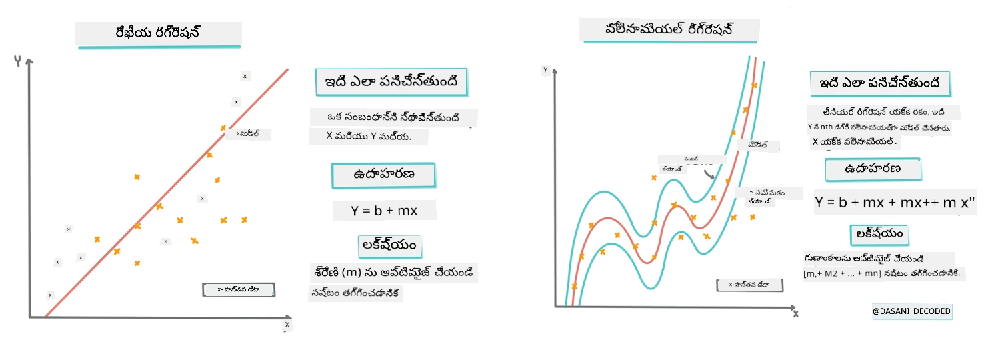
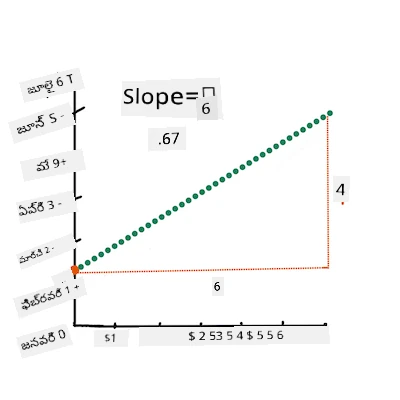
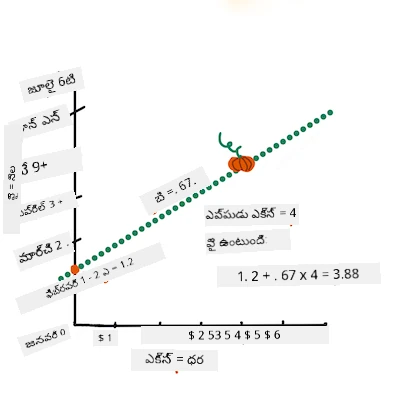
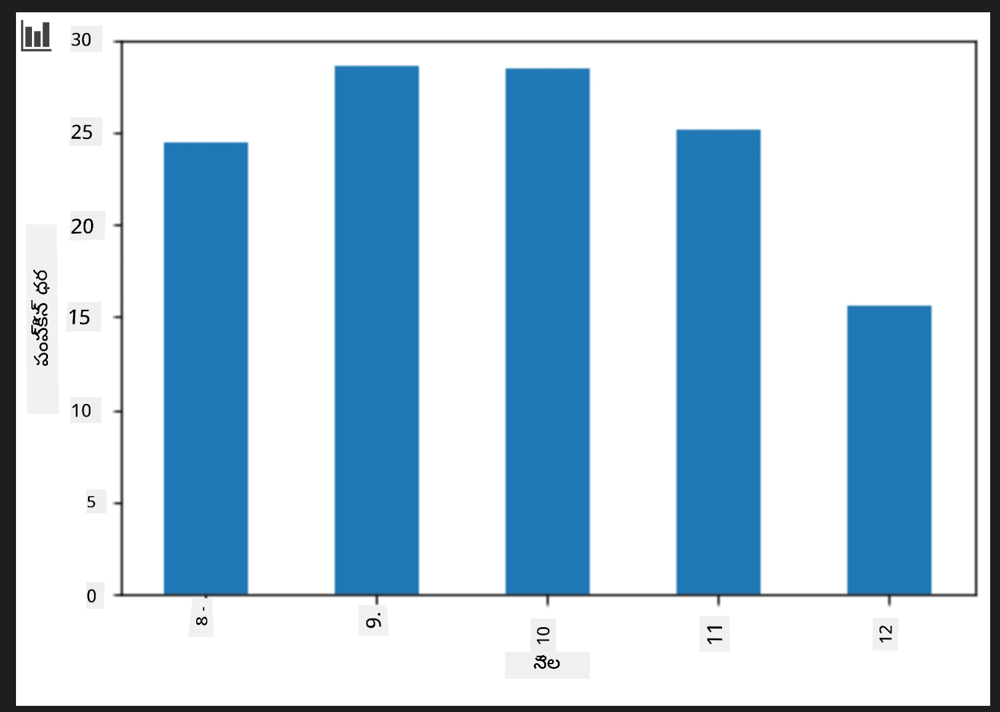
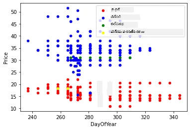

<!--
CO_OP_TRANSLATOR_METADATA:
{
  "original_hash": "40e64f004f3cb50aa1d8661672d3cd92",
  "translation_date": "2025-12-19T13:45:41+00:00",
  "source_file": "2-Regression/3-Linear/README.md",
  "language_code": "te"
}
-->
# Scikit-learn ఉపయోగించి రిగ్రెషన్ మోడల్ నిర్మించండి: రిగ్రెషన్ నాలుగు విధానాలు


> ఇన్ఫోగ్రాఫిక్ [దాసాని మడిపల్లి](https://twitter.com/dasani_decoded) ద్వారా
## [ప్రీ-లెక్చర్ క్విజ్](https://ff-quizzes.netlify.app/en/ml/)

> ### [ఈ పాఠం R లో అందుబాటులో ఉంది!](../../../../2-Regression/3-Linear/solution/R/lesson_3.html)
### పరిచయం

ఇప్పటివరకు మీరు రిగ్రెషన్ అంటే ఏమిటి అనేది పంప్కిన్ ధరల డేటాసెట్ నుండి సేకరించిన నమూనా డేటాతో అన్వేషించారు, దీన్ని ఈ పాఠం మొత్తం ఉపయోగిస్తాము. మీరు Matplotlib ఉపయోగించి దాన్ని విజువలైజ్ కూడా చేసారు.

ఇప్పుడు మీరు ML కోసం రిగ్రెషన్ లో మరింత లోతుగా ప్రవేశించడానికి సిద్ధంగా ఉన్నారు. విజువలైజేషన్ డేటాను అర్థం చేసుకోవడానికి సహాయపడుతుంది, కానీ మెషీన్ లెర్నింగ్ యొక్క నిజమైన శక్తి _మోడల్స్ శిక్షణ_ నుండి వస్తుంది. మోడల్స్ చరిత్రాత్మక డేటాపై శిక్షణ పొందుతాయి, డేటా ఆధారిత సంబంధాలను ఆటోమేటిక్‌గా పట్టుకోవడానికి, మరియు మోడల్ ఇప్పటివరకు చూడని కొత్త డేటాకు ఫలితాలను అంచనా వేయడానికి వీలు కల్పిస్తాయి.

ఈ పాఠంలో, మీరు రెండు రకాల రిగ్రెషన్ గురించి మరింత తెలుసుకుంటారు: _బేసిక్ లీనియర్ రిగ్రెషన్_ మరియు _పాలినోమియల్ రిగ్రెషన్_, మరియు ఈ సాంకేతికతల వెనుక ఉన్న కొన్ని గణిత శాస్త్రం. ఆ మోడల్స్ మాకు వివిధ ఇన్‌పుట్ డేటాపై ఆధారపడి పంప్కిన్ ధరలను అంచనా వేయడానికి సహాయపడతాయి.

[](https://youtu.be/CRxFT8oTDMg "ML for beginners - Understanding Linear Regression")

> 🎥 లీనియర్ రిగ్రెషన్ యొక్క సంక్షిప్త వీడియో అవలోకనానికి పై చిత్రం క్లిక్ చేయండి.

> ఈ పాఠ్యాంశం మొత్తం, మేము గణితంపై కనీస జ్ఞానం ఉన్నట్లు భావించి, ఇతర రంగాల నుండి వచ్చిన విద్యార్థులకు సులభంగా అర్థమయ్యేలా చేయడానికి ప్రయత్నిస్తాము, కాబట్టి గమనికలు, 🧮 కాల్ అవుట్లు, చిత్రాలు మరియు ఇతర అభ్యాస సాధనాలను గమనించండి.

### ముందస్తు అవగాహన

మీకు ఇప్పటివరకు పరిశీలిస్తున్న పంప్కిన్ డేటా నిర్మాణం గురించి పరిచయం కలిగి ఉండాలి. మీరు ఈ పాఠం యొక్క _notebook.ipynb_ ఫైల్‌లో ముందుగా లోడ్ చేసి శుభ్రపరిచిన డేటాను కనుగొనవచ్చు. ఆ ఫైల్‌లో, పంప్కిన్ ధర బషెల్‌కు ప్రదర్శించబడుతుంది. మీరు Visual Studio Code లో కర్నెల్స్‌లో ఈ నోట్‌బుక్స్ నడపగలగాలి.

### సిద్ధం కావడం

మరలా గుర్తు చేసుకోవడానికి, మీరు ఈ డేటాను లోడ్ చేస్తున్నారంటే దానిపై ప్రశ్నలు అడగడానికి.

- పంప్కిన్లను కొనుగోలు చేయడానికి ఉత్తమ సమయం ఎప్పుడు?
- మినీ పంప్కిన్ల కేసు ధర ఎంత ఉండవచ్చు?
- వాటిని అర్ధ బషెల్ బాస్కెట్లలో కొనాలా లేదా 1 1/9 బషెల్ బాక్స్ ద్వారా కొనాలా?
మనం ఈ డేటాలో మరింత లోతుగా వెళ్దాం.

మునుపటి పాఠంలో, మీరు Pandas డేటా ఫ్రేమ్ సృష్టించి, అసలు డేటాసెట్‌లోని భాగాన్ని బషెల్ ద్వారా ధరను ప్రమాణీకరించి నింపారు. అయితే, మీరు సుమారు 400 డేటాపాయింట్లు మాత్రమే సేకరించగలిగారు మరియు అవి కేవలం శరదృతువు నెలల కోసం మాత్రమే.

ఈ పాఠం యొక్క సహాయక నోట్‌బుక్‌లో ముందుగా లోడ్ చేసిన డేటాను చూడండి. డేటా ముందుగా లోడ్ చేయబడింది మరియు నెల డేటాను చూపించడానికి ప్రారంభ స్కాటర్‌ప్లాట్ రూపొందించబడింది. డేటా స్వభావం గురించి మరింత వివరాలు తెలుసుకోవడానికి మరింత శుభ్రపరచడం చేయవచ్చు.

## లీనియర్ రిగ్రెషన్ లైన్

పాఠం 1 లో మీరు నేర్చుకున్నట్లుగా, లీనియర్ రిగ్రెషన్ వ్యాయామం యొక్క లక్ష్యం ఒక లైన్‌ను ప్లాట్ చేయగలగడం:

- **వేరియబుల్ సంబంధాలను చూపించండి**. వేరియబుల్స్ మధ్య సంబంధాన్ని చూపించండి
- **అంచనాలు చేయండి**. కొత్త డేటాపాయింట్ ఆ లైన్‌కు సంబంధించి ఎక్కడ పడుతుందో ఖచ్చితంగా అంచనా వేయండి.

**లీస్ట్-స్క్వేర్ రిగ్రెషన్**లో ఈ రకమైన లైన్ డ్రా చేయడం సాధారణం. 'లీస్ట్-స్క్వేర్' అనే పదం అంటే రిగ్రెషన్ లైన్ చుట్టూ ఉన్న అన్ని డేటాపాయింట్లు స్క్వేర్ చేసి, వాటిని జోడించడం. ఆ తుది మొత్తం సాధ్యమైనంత తక్కువగా ఉండాలి, ఎందుకంటే మేము తప్పుల సంఖ్యను తక్కువగా ఉంచాలనుకుంటున్నాము, అంటే `లీస్ట్-స్క్వేర్`.

మేము ఈ విధంగా చేస్తాము ఎందుకంటే మేము మా డేటా పాయింట్లన్నింటి నుండి కనీస సమ్మిళిత దూరం కలిగిన లైన్‌ను మోడల్ చేయాలనుకుంటున్నాము. దిశ కాకుండా పరిమాణం గురించి ఆందోళన కలిగినందున, జోడించే ముందు పదాలను స్క్వేర్ చేస్తాము.

> **🧮 గణితం చూపించండి**  
> 
> ఈ లైన్, _లైన్ ఆఫ్ బెస్ట్ ఫిట్_ అని పిలవబడుతుంది, [సమీకరణ](https://en.wikipedia.org/wiki/Simple_linear_regression) ద్వారా వ్యక్తం చేయవచ్చు:  
> 
> ```
> Y = a + bX
> ```
>
> `X` అనేది 'వివరణాత్మక వేరియబుల్'. `Y` అనేది 'ఆధారిత వేరియబుల్'. లైన్ యొక్క స్లోప్ `b` మరియు `a` y-ఇంటర్సెప్ట్, అంటే `X = 0` ఉన్నప్పుడు `Y` విలువ.
>
>
>
> మొదట, స్లోప్ `b` లెక్కించండి. ఇన్ఫోగ్రాఫిక్ [జెన్ లూపర్](https://twitter.com/jenlooper) ద్వారా
>
> మరొక మాటలో చెప్పాలంటే, మా పంప్కిన్ డేటా యొక్క అసలు ప్రశ్నకు సంబంధించి: "నెల వారీగా పంప్కిన్ ధర అంచనా వేయండి", `X` ధరకు సూచిస్తుంది మరియు `Y` అమ్మకాల నెలకు సూచిస్తుంది.
>
>
>
> Y విలువ లెక్కించండి. మీరు సుమారు $4 చెల్లిస్తుంటే, అది ఏప్రిల్ కావాలి! ఇన్ఫోగ్రాఫిక్ [జెన్ లూపర్](https://twitter.com/jenlooper) ద్వారా
>
> లైన్ లెక్కించే గణితం స్లోప్‌ను చూపించాలి, ఇది ఇంటర్సెప్ట్‌పై ఆధారపడి ఉంటుంది, అంటే `X = 0` ఉన్నప్పుడు `Y` ఎక్కడ ఉంటుంది.
>
> ఈ విలువల లెక్కింపు పద్ధతిని మీరు [Math is Fun](https://www.mathsisfun.com/data/least-squares-regression.html) వెబ్‌సైట్‌లో చూడవచ్చు. అలాగే [ఈ లీస్ట్-స్క్వేర్ కాలిక్యులేటర్](https://www.mathsisfun.com/data/least-squares-calculator.html) ను సందర్శించి సంఖ్యల విలువలు లైన్‌పై ఎలా ప్రభావం చూపిస్తాయో చూడండి.

## సహసంబంధం

మరొక పదం అర్థం చేసుకోవాలి అంటే **సహసంబంధ గుణకం** X మరియు Y వేరియబుల్స్ మధ్య. స్కాటర్‌ప్లాట్ ఉపయోగించి మీరు ఈ గుణకాన్ని త్వరగా విజువలైజ్ చేయవచ్చు. డేటాపాయింట్లు ఒక సూటిగా పడ్డ స్కాటర్‌ప్లాట్‌కు ఉన్నత సహసంబంధం ఉంటుంది, కానీ డేటాపాయింట్లు X మరియు Y మధ్య ఎక్కడైనా పడ్డ స్కాటర్‌ప్లాట్‌కు తక్కువ సహసంబంధం ఉంటుంది.

మంచి లీనియర్ రిగ్రెషన్ మోడల్ అనేది లీస్ట్-స్క్వేర్ రిగ్రెషన్ పద్ధతితో రిగ్రెషన్ లైన్ ఉన్నప్పుడు 1 కి దగ్గరగా ఉన్న (0 కంటే ఎక్కువ) సహసంబంధ గుణకం కలిగి ఉంటుంది.

✅ ఈ పాఠం సహాయక నోట్‌బుక్ నడపండి మరియు నెల నుండి ధర స్కాటర్‌ప్లాట్ చూడండి. పంప్కిన్ అమ్మకాల కోసం నెల మరియు ధర మధ్య డేటా మీ విజువల్ అర్థం ప్రకారం అధిక లేదా తక్కువ సహసంబంధం ఉందా? మీరు `నెల` బదులు మరింత సూక్ష్మమైన కొలత ఉపయోగిస్తే, ఉదాహరణకు *సంవత్సరంలో రోజు* (అంటే సంవత్సర ప్రారంభం నుండి గడిచిన రోజుల సంఖ్య), అది మారుతుందా?

క్రింది కోడ్‌లో, మేము డేటాను శుభ్రపరిచినట్లు భావిస్తాము, మరియు `new_pumpkins` అనే డేటా ఫ్రేమ్ పొందాము, ఇది ఈ క్రింది విధంగా ఉంటుంది:

ID | నెల | సంవత్సరం లో రోజు | రకం | నగరం | ప్యాకేజీ | తక్కువ ధర | ఎక్కువ ధర | ధర
---|-------|-----------|---------|------|---------|-----------|------------|-------
70 | 9 | 267 | పై టైప్ | బాల్టిమోర్ | 1 1/9 బషెల్ కార్టన్లు | 15.0 | 15.0 | 13.636364
71 | 9 | 267 | పై టైప్ | బాల్టిమోర్ | 1 1/9 బషెల్ కార్టన్లు | 18.0 | 18.0 | 16.363636
72 | 10 | 274 | పై టైప్ | బాల్టిమోర్ | 1 1/9 బషెల్ కార్టన్లు | 18.0 | 18.0 | 16.363636
73 | 10 | 274 | పై టైప్ | బాల్టిమోర్ | 1 1/9 బషెల్ కార్టన్లు | 17.0 | 17.0 | 15.454545
74 | 10 | 281 | పై టైప్ | బాల్టిమోర్ | 1 1/9 బషెల్ కార్టన్లు | 15.0 | 15.0 | 13.636364

> డేటాను శుభ్రపరచడానికి కోడ్ [`notebook.ipynb`](notebook.ipynb) లో అందుబాటులో ఉంది. మేము మునుపటి పాఠంలో చేసిన శుభ్రపరిచే దశలను అమలు చేసాము, మరియు `DayOfYear` కాలమ్‌ను క్రింది వ్యక్తీకరణతో లెక్కించాము:

```python
day_of_year = pd.to_datetime(pumpkins['Date']).apply(lambda dt: (dt-datetime(dt.year,1,1)).days)
```

లీనియర్ రిగ్రెషన్ వెనుక గణితాన్ని మీరు అర్థం చేసుకున్న తర్వాత, పంప్కిన్ ప్యాకేజీలలో ఏది ఉత్తమ ధర కలిగి ఉంటుందో అంచనా వేయడానికి రిగ్రెషన్ మోడల్ సృష్టిద్దాం. సెలవుల పంప్కిన్ ప్యాచ్ కోసం పంప్కిన్లు కొనుగోలు చేసే వారు ఈ సమాచారాన్ని ఉపయోగించి తమ కొనుగోళ్లను ఆప్టిమైజ్ చేసుకోవచ్చు.

## సహసంబంధం కోసం వెతుకుతున్నాం

[](https://youtu.be/uoRq-lW2eQo "ML for beginners - Looking for Correlation: The Key to Linear Regression")

> 🎥 సహసంబంధం యొక్క సంక్షిప్త వీడియో అవలోకనానికి పై చిత్రం క్లిక్ చేయండి.

మునుపటి పాఠం నుండి మీరు చూసినట్లయితే, వివిధ నెలల సగటు ధర ఇలా ఉంటుంది:



ఇది కొంత సహసంబంధం ఉండాలని సూచిస్తుంది, మరియు మేము `నెల` మరియు `ధర` మధ్య లేదా `DayOfYear` మరియు `ధర` మధ్య సంబంధాన్ని అంచనా వేయడానికి లీనియర్ రిగ్రెషన్ మోడల్ శిక్షణ ఇవ్వవచ్చు. క్రింది స్కాటర్ ప్లాట్ ఆ తర్వాత సంబంధాన్ని చూపిస్తుంది:

 

`corr` ఫంక్షన్ ఉపయోగించి సహసంబంధం ఉందా చూద్దాం:

```python
print(new_pumpkins['Month'].corr(new_pumpkins['Price']))
print(new_pumpkins['DayOfYear'].corr(new_pumpkins['Price']))
```

సహసంబంధం చాలా తక్కువగా ఉంది, `నెల` ద్వారా -0.15 మరియు `DayOfMonth` ద్వారా -0.17, కానీ మరో ముఖ్యమైన సంబంధం ఉండవచ్చు. వివిధ పంప్కిన్ రకాల ధరల వేర్వేరు క్లస్టర్లు ఉన్నట్లు కనిపిస్తోంది. ఈ హైపోథసిస్ నిర్ధారించడానికి, ప్రతి పంప్కిన్ వర్గాన్ని వేరే రంగుతో ప్లాట్ చేద్దాం. `scatter` ప్లాటింగ్ ఫంక్షన్‌కు `ax` పారామీటర్ ఇవ్వడం ద్వారా అన్ని పాయింట్లను ఒకే గ్రాఫ్‌లో ప్లాట్ చేయవచ్చు:

```python
ax=None
colors = ['red','blue','green','yellow']
for i,var in enumerate(new_pumpkins['Variety'].unique()):
    df = new_pumpkins[new_pumpkins['Variety']==var]
    ax = df.plot.scatter('DayOfYear','Price',ax=ax,c=colors[i],label=var)
```

 

మా పరిశీలన ప్రకారం, రకం అమ్మకాల తేదీ కంటే మొత్తం ధరపై ఎక్కువ ప్రభావం చూపుతుంది. దీన్ని బార్ గ్రాఫ్‌తో చూడవచ్చు:

```python
new_pumpkins.groupby('Variety')['Price'].mean().plot(kind='bar')
```

 

ఇప్పుడు మనం కేవలం ఒక పంప్కిన్ రకం, 'పై టైప్' పై దృష్టి పెట్టి, తేదీ ధరపై ఎలాంటి ప్రభావం చూపుతుందో చూద్దాం:

```python
pie_pumpkins = new_pumpkins[new_pumpkins['Variety']=='PIE TYPE']
pie_pumpkins.plot.scatter('DayOfYear','Price') 
```
 

ఇప్పుడు `corr` ఫంక్షన్ ఉపయోగించి `ధర` మరియు `DayOfYear` మధ్య సహసంబంధం లెక్కిస్తే, సుమారు `-0.27` వస్తుంది - అంటే అంచనా వేయగల మోడల్ శిక్షణ ఇవ్వడం అర్థం.

> లీనియర్ రిగ్రెషన్ మోడల్ శిక్షణకు ముందు, మా డేటా శుభ్రంగా ఉందని నిర్ధారించుకోవడం ముఖ్యం. లీనియర్ రిగ్రెషన్ లో మిస్సింగ్ విలువలతో పని చేయడం సరిగా ఉండదు, కాబట్టి అన్ని ఖాళీ సెల్స్ తొలగించడం మంచిది:

```python
pie_pumpkins.dropna(inplace=True)
pie_pumpkins.info()
```

మరొక విధానం ఖాళీ విలువలను సంబంధిత కాలమ్ యొక్క సగటు విలువలతో భర్తీ చేయడం.

## సింపుల్ లీనియర్ రిగ్రెషన్

[](https://youtu.be/e4c_UP2fSjg "ML for beginners - Linear and Polynomial Regression using Scikit-learn")

> 🎥 లీనియర్ మరియు పాలినోమియల్ రిగ్రెషన్ యొక్క సంక్షిప్త వీడియో అవలోకనానికి పై చిత్రం క్లిక్ చేయండి.

మా లీనియర్ రిగ్రెషన్ మోడల్ శిక్షణకు, మేము **Scikit-learn** లైబ్రరీని ఉపయోగిస్తాము.

```python
from sklearn.linear_model import LinearRegression
from sklearn.metrics import mean_squared_error
from sklearn.model_selection import train_test_split
```

మేము మొదట ఇన్‌పుట్ విలువలు (ఫీచర్లు) మరియు అంచనా వేయాల్సిన అవుట్‌పుట్ (లేబుల్) ను వేర్వేరు numpy అర్రేలలో విడగొడతాము:

```python
X = pie_pumpkins['DayOfYear'].to_numpy().reshape(-1,1)
y = pie_pumpkins['Price']
```

> గమనించండి, లీనియర్ రిగ్రెషన్ ప్యాకేజీ సరిగ్గా అర్థం చేసుకోవడానికి ఇన్‌పుట్ డేటాపై `reshape` చేయాల్సి వచ్చింది. లీనియర్ రిగ్రెషన్ 2D-అర్రేను ఇన్‌పుట్‌గా ఆశిస్తుంది, ఇందులో ప్రతి వరుస ఒక ఫీచర్ వెక్టర్‌కు సరిపోతుంది. మన కేసులో, ఒక్క ఇన్‌పుట్ ఉన్నందున, N×1 ఆకారంలో అర్రే కావాలి, ఇక్కడ N డేటాసెట్ పరిమాణం.

తర్వాత, మేము డేటాను శిక్షణ మరియు పరీక్ష డేటాసెట్‌లుగా విభజించాలి, తద్వారా శిక్షణ తర్వాత మోడల్‌ను ధృవీకరించవచ్చు:

```python
X_train, X_test, y_train, y_test = train_test_split(X, y, test_size=0.2, random_state=0)
```

చివరగా, లీనియర్ రిగ్రెషన్ మోడల్ శిక్షణ రెండు కోడ్ లైన్లలోనే జరుగుతుంది. మేము `LinearRegression` ఆబ్జెక్ట్‌ను నిర్వచించి, `fit` మెథడ్ ఉపయోగించి మా డేటాకు అనుగుణంగా చేస్తాము:

```python
lin_reg = LinearRegression()
lin_reg.fit(X_train,y_train)
```

`fit` చేసిన తర్వాత `LinearRegression` ఆబ్జెక్ట్‌లో రిగ్రెషన్ యొక్క అన్ని కోఎఫిషియెంట్లు ఉంటాయి, వాటిని `.coef_` ప్రాపర్టీ ద్వారా యాక్సెస్ చేయవచ్చు. మన కేసులో, ఒక్క కోఎఫిషియెంట్ ఉంటుంది, అది సుమారు `-0.017` ఉంటుంది. అంటే ధరలు కాలంతో కొంత తగ్గుతున్నట్లు కనిపిస్తుంది, రోజుకు సుమారు 2 సెంట్లు. మేము రిగ్రెషన్ యొక్క Y-అక్షంతో ఇంటర్సెక్షన్ పాయింట్‌ను `lin_reg.intercept_` ద్వారా కూడా పొందవచ్చు - ఇది మన కేసులో సుమారు `21` ఉంటుంది, సంవత్సర ప్రారంభంలో ధరను సూచిస్తుంది.
మా మోడల్ ఎంత ఖచ్చితంగా ఉందో చూడటానికి, మేము టెస్ట్ డేటాసెట్‌పై ధరలను అంచనా వేయవచ్చు, ఆపై మా అంచనాలు ఆశించిన విలువలకు ఎంత దగ్గరగా ఉన్నాయో కొలవవచ్చు. ఇది మినీ స్క్వేర్ ఎర్రర్ (MSE) మెట్రిక్స్ ఉపయోగించి చేయవచ్చు, ఇది ఆశించిన మరియు అంచనా విలువల మధ్య అన్ని చదరపు తేడాల సగటు.

```python
pred = lin_reg.predict(X_test)

mse = np.sqrt(mean_squared_error(y_test,pred))
print(f'Mean error: {mse:3.3} ({mse/np.mean(pred)*100:3.3}%)')
```

మా పొరపాటు సుమారు 2 పాయింట్ల చుట్టూ ఉంది, ఇది సుమారు 17%. చాలా బాగాలేదు. మోడల్ నాణ్యతకు మరో సూచిక **నిర్ణయ సహగుణం** (coefficient of determination), ఇది ఇలా పొందవచ్చు:

```python
score = lin_reg.score(X_train,y_train)
print('Model determination: ', score)
```

విలువ 0 అయితే, అంటే మోడల్ ఇన్‌పుట్ డేటాను పరిగణలోకి తీసుకోదు, మరియు *చెత్త లీనియర్ అంచనా వేయగలిగే* మోడల్‌గా పనిచేస్తుంది, ఇది ఫలితాల సగటు విలువ మాత్రమే. విలువ 1 అంటే మేము అన్ని ఆశించిన అవుట్‌పుట్‌లను పూర్తిగా అంచనా వేయగలమని అర్థం. మా సందర్భంలో, సహగుణం సుమారు 0.06, ఇది చాలా తక్కువ.

మేము టెస్ట్ డేటాను రిగ్రెషన్ లైన్‌తో కలిసి ప్లాట్ చేయవచ్చు, మా సందర్భంలో రిగ్రెషన్ ఎలా పనిచేస్తుందో మెరుగ్గా చూడటానికి:

```python
plt.scatter(X_test,y_test)
plt.plot(X_test,pred)
```


## పాలినోమియల్ రిగ్రెషన్

లీనియర్ రిగ్రెషన్ యొక్క మరో రకం పాలినోమియల్ రిగ్రెషన్. కొన్ని సార్లు వేరియబుల్స్ మధ్య లీనియర్ సంబంధం ఉంటుంది - వాల్యూమ్ లో పెద్ద పంక్‌కిన్ ఉంటే ధర ఎక్కువ - కానీ కొన్ని సార్లు ఈ సంబంధాలను ప్లేన్ లేదా సూటి రేఖగా చిత్రీకరించలేము.

✅ ఇక్కడ [మరిన్ని ఉదాహరణలు](https://online.stat.psu.edu/stat501/lesson/9/9.8) ఉన్నాయి, ఇవి పాలినోమియల్ రిగ్రెషన్ ఉపయోగించవచ్చు

తేదీ మరియు ధర మధ్య సంబంధాన్ని మరోసారి చూడండి. ఈ స్కాటర్‌ప్లాట్ తప్పనిసరిగా సూటి రేఖతో విశ్లేషించాల్సినదిగా అనిపిస్తుందా? ధరలు మారవచ్చునా? ఈ సందర్భంలో, మీరు పాలినోమియల్ రిగ్రెషన్ ప్రయత్నించవచ్చు.

✅ పాలినోమియల్స్ అనేవి ఒకటి లేదా ఎక్కువ వేరియబుల్స్ మరియు సహగుణాలతో కూడిన గణితీయ వ్యక్తీకరణలు

పాలినోమియల్ రిగ్రెషన్ వక్రీకృత రేఖను సృష్టించి, నాన్‌లీనియర్ డేటాకు మెరుగైన సరిపోయేలా చేస్తుంది. మా సందర్భంలో, ఇన్‌పుట్ డేటాలో స్క్వేర్ చేసిన `DayOfYear` వేరియబుల్‌ను చేర్చితే, మేము మా డేటాను ఒక పారబాలిక్ వక్రీకరణతో సరిపోల్చగలము, ఇది సంవత్సరంలో ఒక నిర్దిష్ట బిందువులో కనిష్ఠం ఉంటుంది.

Scikit-learn ఒక సహాయక [pipeline API](https://scikit-learn.org/stable/modules/generated/sklearn.pipeline.make_pipeline.html?highlight=pipeline#sklearn.pipeline.make_pipeline) కలిగి ఉంది, ఇది డేటా ప్రాసెసింగ్ యొక్క వివిధ దశలను కలిపేందుకు ఉపయోగపడుతుంది. ఒక **pipeline** అనేది **estimators** యొక్క గొలుసు. మా సందర్భంలో, మేము మొదట మా మోడల్‌కు పాలినోమియల్ ఫీచర్లను జోడించి, ఆపై రిగ్రెషన్‌ను ట్రెయిన్ చేసే pipeline సృష్టిస్తాము:

```python
from sklearn.preprocessing import PolynomialFeatures
from sklearn.pipeline import make_pipeline

pipeline = make_pipeline(PolynomialFeatures(2), LinearRegression())

pipeline.fit(X_train,y_train)
```

`PolynomialFeatures(2)` ఉపయోగించడం అంటే మేము ఇన్‌పుట్ డేటా నుండి అన్ని రెండవ-డిగ్రీ పాలినోమియల్స్‌ను చేర్చుతాము. మా సందర్భంలో ఇది కేవలం `DayOfYear`<sup>2</sup> మాత్రమే, కానీ రెండు ఇన్‌పుట్ వేరియబుల్స్ X మరియు Y ఉంటే, ఇది X<sup>2</sup>, XY మరియు Y<sup>2</sup> ను జోడిస్తుంది. మేము కావాలంటే ఎక్కువ డిగ్రీ పాలినోమియల్స్ కూడా ఉపయోగించవచ్చు.

Pipelines ను అసలు `LinearRegression` ఆబ్జెక్ట్ లాగా ఉపయోగించవచ్చు, అంటే మేము pipeline ను `fit` చేసి, ఆపై `predict` ఉపయోగించి అంచనా ఫలితాలు పొందవచ్చు. ఇక్కడ టెస్ట్ డేటా మరియు సన్నిహిత వక్రీకరణ వక్రాన్ని చూపించే గ్రాఫ్ ఉంది:


పాలినోమియల్ రిగ్రెషన్ ఉపయోగించి, మేము కొంచెం తక్కువ MSE మరియు ఎక్కువ నిర్ణయ సహగుణం పొందవచ్చు, కానీ గణనీయంగా కాదు. మేము ఇతర ఫీచర్లను కూడా పరిగణలోకి తీసుకోవాలి!

> మీరు గమనించవచ్చు, కనిష్ఠ పంక్‌కిన్ ధరలు హాలోవీన్ సమీపంలో ఉంటాయి. దీన్ని మీరు ఎలా వివరిస్తారు?

🎃 అభినందనలు, మీరు ఇప్పుడు పాయ్ పంక్‌కిన్ ధర అంచనా వేయగలిగే మోడల్ సృష్టించారు. మీరు అన్ని పంక్‌కిన్ రకాల కోసం ఇదే ప్రక్రియను పునరావృతం చేయవచ్చు, కానీ అది కష్టమైన పని. ఇప్పుడు మనం మా మోడల్‌లో పంక్‌కిన్ రకాన్ని ఎలా పరిగణలోకి తీసుకోవాలో నేర్చుకుందాం!

## వర్గీకృత ఫీచర్లు

స идеల్ ప్రపంచంలో, మేము ఒకే మోడల్ ఉపయోగించి వివిధ పంక్‌కిన్ రకాల ధరలను అంచనా వేయగలగాలి. అయితే, `Variety` కాలమ్ `Month` లాంటి కాలమ్స్ నుండి కొంత భిన్నంగా ఉంటుంది, ఎందుకంటే ఇది సంఖ్యాత్మక విలువలు కాకుండా ఉంటుంది. ఇలాంటి కాలమ్స్‌ను **వర్గీకృత** (categorical) అంటారు.

[](https://youtu.be/DYGliioIAE0 "ML for beginners - Categorical Feature Predictions with Linear Regression")

> 🎥 పై చిత్రాన్ని క్లిక్ చేసి వర్గీకృత ఫీచర్ల ఉపయోగంపై చిన్న వీడియో అవలోకనం చూడండి.

ఇక్కడ మీరు వేరియటీపై సగటు ధర ఎలా ఆధారపడి ఉందో చూడవచ్చు:


వేరియటీని పరిగణలోకి తీసుకోవడానికి, ముందుగా దాన్ని సంఖ్యాత్మక రూపంలోకి మార్చాలి, లేదా **ఎంకోడ్** చేయాలి. దీని కోసం కొన్ని మార్గాలు ఉన్నాయి:

* సాదా **సంఖ్యాత్మక ఎంకోడింగ్** వేరియటీల పట్టికను సృష్టించి, ఆ పట్టికలోని సూచికతో వేరియటీ పేరును మార్చుతుంది. ఇది లీనియర్ రిగ్రెషన్‌కు ఉత్తమ ఆలోచన కాదు, ఎందుకంటే లీనియర్ రిగ్రెషన్ సూచిక యొక్క అసలు సంఖ్యాత్మక విలువను తీసుకుని, దానిని కొంత సహగుణంతో గుణించి ఫలితానికి జోడిస్తుంది. మా సందర్భంలో, సూచిక సంఖ్య మరియు ధర మధ్య సంబంధం స్పష్టంగా నాన్-లీనియర్, ఎప్పటికైనా సూచికలు నిర్దిష్ట రీతిలో క్రమబద్ధీకరించినా కూడా.
* **వన్-హాట్ ఎంకోడింగ్** `Variety` కాలమ్‌ను 4 వేర్వేరు కాలమ్స్‌గా మార్చుతుంది, ఒక్కో వేరియటీకి ఒకటి. ప్రతి కాలమ్‌లో ఆ వరుస ఆ వేరియటీకి చెందినదైతే `1`, లేకపోతే `0` ఉంటుంది. అంటే లీనియర్ రిగ్రెషన్‌లో నాలుగు సహగుణాలు ఉంటాయి, ఒక్కో పంక్‌కిన్ వేరియటీకి ఒకటి, ఆ ప్రత్యేక వేరియటీకి "ప్రారంభ ధర" (లేదా "అదనపు ధర") బాధ్యత వహిస్తుంది.

క్రింది కోడ్ వన్-హాట్ ఎంకోడింగ్ ఎలా చేయాలో చూపిస్తుంది:

```python
pd.get_dummies(new_pumpkins['Variety'])
```

 ID | FAIRYTALE | MINIATURE | MIXED HEIRLOOM VARIETIES | PIE TYPE
----|-----------|-----------|--------------------------|----------
70 | 0 | 0 | 0 | 1
71 | 0 | 0 | 0 | 1
... | ... | ... | ... | ...
1738 | 0 | 1 | 0 | 0
1739 | 0 | 1 | 0 | 0
1740 | 0 | 1 | 0 | 0
1741 | 0 | 1 | 0 | 0
1742 | 0 | 1 | 0 | 0

వన్-హాట్ ఎంకోడెడ్ వేరియటీని ఇన్‌పుట్‌గా ఉపయోగించి లీనియర్ రిగ్రెషన్ ట్రెయిన్ చేయడానికి, మేము కేవలం `X` మరియు `y` డేటాను సరిగ్గా ప్రారంభించాలి:

```python
X = pd.get_dummies(new_pumpkins['Variety'])
y = new_pumpkins['Price']
```

మిగతా కోడ్ మేము పైగా లీనియర్ రిగ్రెషన్ ట్రెయిన్ చేయడానికి ఉపయోగించినదే. మీరు ప్రయత్నిస్తే, సగటు చదరపు పొరపాటు సుమారు అదే ఉంటుంది, కానీ నిర్ణయ సహగుణం చాలా ఎక్కువగా ఉంటుంది (~77%). మరింత ఖచ్చితమైన అంచనాల కోసం, మేము మరిన్ని వర్గీకృత ఫీచర్లు మరియు సంఖ్యాత్మక ఫీచర్లు, ఉదాహరణకు `Month` లేదా `DayOfYear` కూడా పరిగణలోకి తీసుకోవచ్చు. ఒక పెద్ద ఫీచర్ అర్రే పొందడానికి, మేము `join` ఉపయోగించవచ్చు:

```python
X = pd.get_dummies(new_pumpkins['Variety']) \
        .join(new_pumpkins['Month']) \
        .join(pd.get_dummies(new_pumpkins['City'])) \
        .join(pd.get_dummies(new_pumpkins['Package']))
y = new_pumpkins['Price']
```

ఇక్కడ మేము `City` మరియు `Package` రకాలను కూడా పరిగణలోకి తీసుకుంటున్నాము, ఇది మాకు MSE 2.84 (10%) మరియు నిర్ణయ సహగుణం 0.94 ఇస్తుంది!

## అన్నింటినీ కలిపి

ఉత్తమ మోడల్ తయారుచేయడానికి, మేము పై ఉదాహరణలోని కలిపిన (వన్-హాట్ ఎంకోడెడ్ వర్గీకృత + సంఖ్యాత్మక) డేటాను పాలినోమియల్ రిగ్రెషన్‌తో కలిపి ఉపయోగించవచ్చు. మీ సౌకర్యానికి పూర్తి కోడ్ ఇక్కడ ఉంది:

```python
# శిక్షణ డేటాను సెట్ చేయండి
X = pd.get_dummies(new_pumpkins['Variety']) \
        .join(new_pumpkins['Month']) \
        .join(pd.get_dummies(new_pumpkins['City'])) \
        .join(pd.get_dummies(new_pumpkins['Package']))
y = new_pumpkins['Price']

# శిక్షణ-పరీక్ష విభజన చేయండి
X_train, X_test, y_train, y_test = train_test_split(X, y, test_size=0.2, random_state=0)

# పైప్‌లైన్‌ను సెట్ చేసి శిక్షణ ఇవ్వండి
pipeline = make_pipeline(PolynomialFeatures(2), LinearRegression())
pipeline.fit(X_train,y_train)

# పరీక్ష డేటాకు ఫలితాలను అంచనా వేయండి
pred = pipeline.predict(X_test)

# MSE మరియు నిర్ణయాన్ని లెక్కించండి
mse = np.sqrt(mean_squared_error(y_test,pred))
print(f'Mean error: {mse:3.3} ({mse/np.mean(pred)*100:3.3}%)')

score = pipeline.score(X_train,y_train)
print('Model determination: ', score)
```

ఇది సుమారు 97% నిర్ణయ సహగుణం మరియు MSE=2.23 (~8% అంచనా పొరపాటు) ఇస్తుంది.

| మోడల్ | MSE | నిర్ణయ సహగుణం |
|-------|-----|---------------|
| `DayOfYear` లీనియర్ | 2.77 (17.2%) | 0.07 |
| `DayOfYear` పాలినోమియల్ | 2.73 (17.0%) | 0.08 |
| `Variety` లీనియర్ | 5.24 (19.7%) | 0.77 |
| అన్ని ఫీచర్లు లీనియర్ | 2.84 (10.5%) | 0.94 |
| అన్ని ఫీచర్లు పాలినోమియల్ | 2.23 (8.25%) | 0.97 |

🏆 బాగుంది! మీరు ఒక పాఠంలో నాలుగు రిగ్రెషన్ మోడల్స్ సృష్టించి, మోడల్ నాణ్యతను 97%కి పెంచారు. రిగ్రెషన్ చివరి భాగంలో, మీరు వర్గాలను నిర్ణయించడానికి లాజిస్టిక్ రిగ్రెషన్ గురించి నేర్చుకుంటారు.

---
## 🚀సవాలు

ఈ నోట్‌బుక్‌లో వివిధ వేరియబుల్స్‌ను పరీక్షించి, సహసంబంధం మోడల్ ఖచ్చితత్వానికి ఎలా అనుగుణంగా ఉందో చూడండి.

## [పోస్ట్-లెక్చర్ క్విజ్](https://ff-quizzes.netlify.app/en/ml/)

## సమీక్ష & స్వీయ అధ్యయనం

ఈ పాఠంలో మేము లీనియర్ రిగ్రెషన్ గురించి నేర్చుకున్నాము. ఇతర ముఖ్యమైన రిగ్రెషన్ రకాలు కూడా ఉన్నాయి. స్టెప్వైజ్, రిడ్జ్, లాస్సో మరియు ఎలాస్టిక్‌నెట్ సాంకేతికతల గురించి చదవండి. మరింత నేర్చుకోవడానికి మంచి కోర్సు [స్టాన్‌ఫర్డ్ స్టాటిస్టికల్ లెర్నింగ్ కోర్సు](https://online.stanford.edu/courses/sohs-ystatslearning-statistical-learning) 

## అసైన్‌మెంట్

[మోడల్ నిర్మించండి](assignment.md)

---

<!-- CO-OP TRANSLATOR DISCLAIMER START -->
**అస్పష్టత**:  
ఈ పత్రాన్ని AI అనువాద సేవ [Co-op Translator](https://github.com/Azure/co-op-translator) ఉపయోగించి అనువదించబడింది. మేము ఖచ్చితత్వానికి ప్రయత్నించినప్పటికీ, ఆటోమేటెడ్ అనువాదాల్లో పొరపాట్లు లేదా తప్పిదాలు ఉండవచ్చు. అసలు పత్రం దాని స్వదేశీ భాషలోనే అధికారిక మూలంగా పరిగణించాలి. ముఖ్యమైన సమాచారానికి, ప్రొఫెషనల్ మానవ అనువాదం చేయించుకోవడం మంచిది. ఈ అనువాదం వలన కలిగే ఏవైనా అపార్థాలు లేదా తప్పుదారుల బాధ్యత మేము తీసుకోము.
<!-- CO-OP TRANSLATOR DISCLAIMER END -->