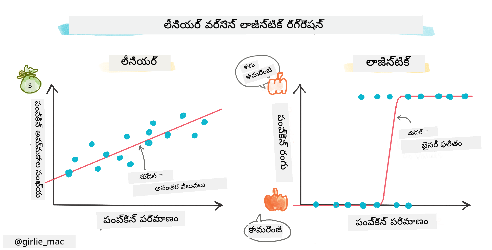
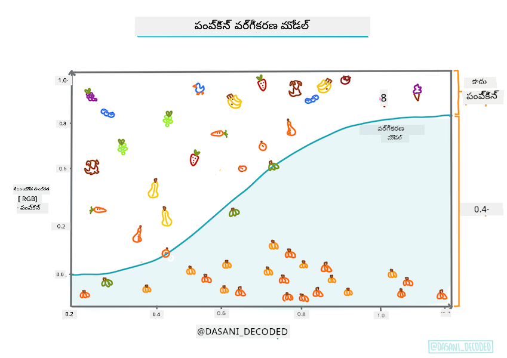
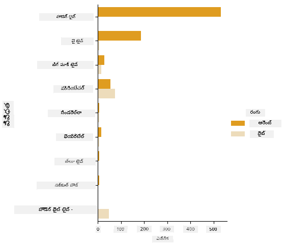
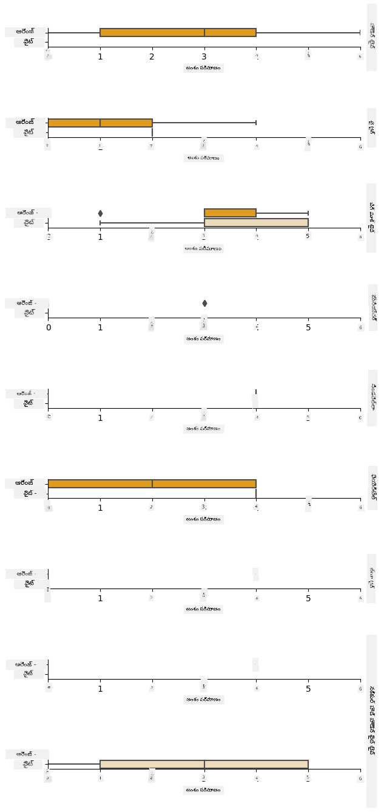
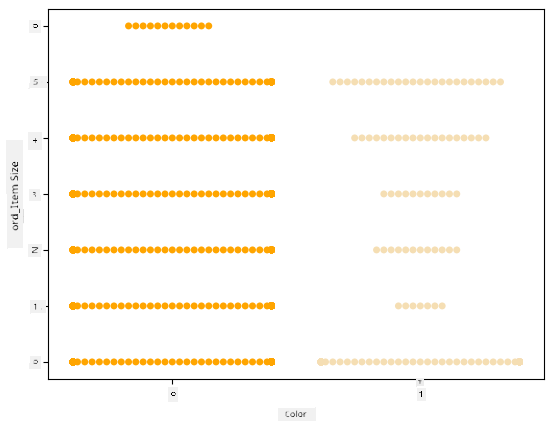
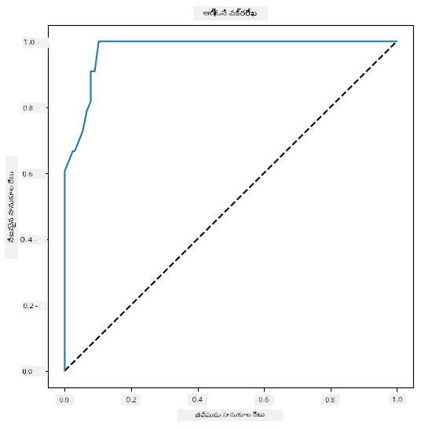

<!--
CO_OP_TRANSLATOR_METADATA:
{
  "original_hash": "abf86d845c84330bce205a46b382ec88",
  "translation_date": "2025-12-19T14:03:43+00:00",
  "source_file": "2-Regression/4-Logistic/README.md",
  "language_code": "te"
}
-->
# వర్గాలను అంచనా వేయడానికి లాజిస్టిక్ రిగ్రెషన్



## [ప్రీ-లెక్చర్ క్విజ్](https://ff-quizzes.netlify.app/en/ml/)

> ### [ఈ పాఠం R లో అందుబాటులో ఉంది!](../../../../2-Regression/4-Logistic/solution/R/lesson_4.html)

## పరిచయం

రిగ్రెషన్ పై ఈ చివరి పాఠంలో, ఒక ప్రాథమిక _క్లాసిక్_ ML సాంకేతికత అయిన లాజిస్టిక్ రిగ్రెషన్ ను చూద్దాం. మీరు ఈ సాంకేతికతను ద్విభాగ వర్గాలను అంచనా వేయడానికి నమూనాలు కనుగొనడానికి ఉపయోగిస్తారు. ఈ కాండీ చాక్లెట్ కాదా? ఈ వ్యాధి సంక్రమణీయమా? ఈ కస్టమర్ ఈ ఉత్పత్తిని ఎంచుకుంటాడా?

ఈ పాఠంలో మీరు నేర్చుకుంటారు:

- డేటా విజువలైజేషన్ కోసం కొత్త లైబ్రరీ
- లాజిస్టిక్ రిగ్రెషన్ సాంకేతికతలు

✅ ఈ రకమైన రిగ్రెషన్ తో పని చేయడంపై మీ అవగాహనను ఈ [Learn మాడ్యూల్](https://docs.microsoft.com/learn/modules/train-evaluate-classification-models?WT.mc_id=academic-77952-leestott) లో మరింత లోతుగా పెంచుకోండి

## ముందస్తు అవసరాలు

పంప్కిన్ డేటాతో పని చేసినందున, ఇప్పుడు మనకు ఒక ద్విభాగ వర్గం ఉంది అని తెలుసుకున్నాం: `Color`.

కొన్ని వేరియబుల్స్ ఇచ్చినప్పుడు, ఒక పంప్కిన్ ఏ రంగులో ఉండే అవకాశం ఉందో అంచనా వేయడానికి లాజిస్టిక్ రిగ్రెషన్ మోడల్ నిర్మిద్దాం (ఆరెంజ్ 🎃 లేదా వైట్ 👻).

> రిగ్రెషన్ గురించి ఉన్న పాఠం సమూహంలో ద్విభాగ వర్గీకరణ గురించి ఎందుకు మాట్లాడుతున్నాం? భాషా సౌలభ్యం కోసం మాత్రమే, ఎందుకంటే లాజిస్టిక్ రిగ్రెషన్ [నిజానికి వర్గీకరణ పద్ధతి](https://scikit-learn.org/stable/modules/linear_model.html#logistic-regression), అయినా లీనియర్ ఆధారితది. తదుపరి పాఠం సమూహంలో డేటాను వర్గీకరించే ఇతర మార్గాలను తెలుసుకోండి.

## ప్రశ్న నిర్వచించండి

మన ప్రయోజనాల కోసం, దీన్ని ద్విభాగంగా వ్యక్తీకరిస్తాము: 'వైట్' లేదా 'వైట్ కాదు'. మా డేటాసెట్‌లో 'స్ట్రైప్డ్' అనే వర్గం కూడా ఉంది కానీ దాని ఉదాహరణలు చాలా తక్కువగా ఉన్నందున దాన్ని ఉపయోగించము. నల్ విలువలను తొలగించిన తర్వాత అది కనబడదు.

> 🎃 సరదా విషయం, కొన్నిసార్లు వైట్ పంప్కిన్లను 'గోస్ట్' పంప్కిన్లు అంటాము. అవి తీయడం అంత సులభం కాదు, అందుకే ఆరెంజ్ పంప్కిన్లంతా ప్రాచుర్యం పొందలేదు కానీ అవి చల్లగా కనిపిస్తాయి! కాబట్టి మన ప్రశ్నను ఇలా కూడా మార్చుకోవచ్చు: 'గోస్ట్' లేదా 'గోస్ట్ కాదు'. 👻

## లాజిస్టిక్ రిగ్రెషన్ గురించి

లాజిస్టిక్ రిగ్రెషన్, మీరు ముందుగా నేర్చుకున్న లీనియర్ రిగ్రెషన్ నుండి కొన్ని ముఖ్యమైన మార్గాల్లో భిన్నంగా ఉంటుంది.

[](https://youtu.be/KpeCT6nEpBY "ML ప్రారంభకులకు - మెషీన్ లెర్నింగ్ వర్గీకరణ కోసం లాజిస్టిక్ రిగ్రెషన్ అర్థం చేసుకోవడం")

> 🎥 లాజిస్టిక్ రిగ్రెషన్ పై చిన్న వీడియో అవలోకనం కోసం పై చిత్రాన్ని క్లిక్ చేయండి.

### ద్విభాగ వర్గీకరణ

లాజిస్టిక్ రిగ్రెషన్ లీనియర్ రిగ్రెషన్ లాంటి లక్షణాలను అందించదు. మొదటిది ద్విభాగ వర్గం గురించి అంచనా ఇస్తుంది ("వైట్ లేదా వైట్ కాదు") కానీ రెండవది నిరంతర విలువలను అంచనా వేయగలదు, ఉదాహరణకు పంప్కిన్ మూలం మరియు పంట కోత సమయం ఇచ్చినప్పుడు, _దాని ధర ఎంత పెరుగుతుందో_.


> ఇన్ఫోగ్రాఫిక్: [దాసాని మడిపల్లి](https://twitter.com/dasani_decoded)

### ఇతర వర్గీకరణలు

మల్టినోమియల్ మరియు ఆర్డినల్ సహా ఇతర రకాల లాజిస్టిక్ రిగ్రెషన్ ఉన్నాయి:

- **మల్టినోమియల్**, అంటే ఒక కంటే ఎక్కువ వర్గాలు ఉండటం - "ఆరెంజ్, వైట్, మరియు స్ట్రైప్డ్".
- **ఆర్డినల్**, అంటే క్రమబద్ధమైన వర్గాలు, ఉదాహరణకు మన పంప్కిన్లు పరిమాణాల క్రమంలో (మినీ, చిన్న, మధ్య, పెద్ద, ఎక్స్ ఎల్, డబుల్ ఎక్స్ ఎల్) ఉంటే ఉపయోగపడుతుంది.


### వేరియబుల్స్ తప్పనిసరిగా సంబంధం ఉండాల్సిన అవసరం లేదు

లీనియర్ రిగ్రెషన్ ఎక్కువ సంబంధిత వేరియబుల్స్ తో బాగా పనిచేస్తుంది అని గుర్తుంచుకోండి? లాజిస్టిక్ రిగ్రెషన్ మాత్రం విరుద్ధం - వేరియబుల్స్ సరిపోవాల్సిన అవసరం లేదు. ఇది కొంతమేర బలహీన సంబంధాలు ఉన్న డేటాకు సరిపోతుంది.

### మీరు చాలా శుభ్రమైన డేటా అవసరం

లాజిస్టిక్ రిగ్రెషన్ ఎక్కువ డేటా ఉపయోగిస్తే మరింత ఖచ్చితమైన ఫలితాలు ఇస్తుంది; మన చిన్న డేటాసెట్ ఈ పనికి సరిపోదు, దాన్ని గమనించండి.

[](https://youtu.be/B2X4H9vcXTs "ML ప్రారంభకులకు - లాజిస్టిక్ రిగ్రెషన్ కోసం డేటా విశ్లేషణ మరియు సిద్ధత")

> 🎥 లీనియర్ రిగ్రెషన్ కోసం డేటా సిద్ధత పై చిన్న వీడియో అవలోకనం కోసం పై చిత్రాన్ని క్లిక్ చేయండి

✅ లాజిస్టిక్ రిగ్రెషన్ కు అనుకూలమైన డేటా రకాలను గురించి ఆలోచించండి

## వ్యాయామం - డేటాను శుభ్రపరచండి

ముందుగా, డేటాను కొంచెం శుభ్రపరచండి, నల్ విలువలను తొలగించి కొన్ని కాలమ్స్ మాత్రమే ఎంచుకోండి:

1. క్రింది కోడ్ జోడించండి:

    ```python
  
    columns_to_select = ['City Name','Package','Variety', 'Origin','Item Size', 'Color']
    pumpkins = full_pumpkins.loc[:, columns_to_select]

    pumpkins.dropna(inplace=True)
    ```

    మీ కొత్త డేటాఫ్రేమ్ ను ఎప్పుడైనా చూడవచ్చు:

    ```python
    pumpkins.info
    ```

### విజువలైజేషన్ - వర్గీకరణ ప్లాట్

ఇప్పటికే మీరు [స్టార్టర్ నోట్‌బుక్](./notebook.ipynb) లో పంప్కిన్ డేటాను మళ్లీ లోడ్ చేసి, కొన్ని వేరియబుల్స్ తో కూడిన డేటాసెట్ ను నిలుపుకున్నారు, అందులో `Color` కూడా ఉంది. ఇప్పుడు మనం వేరే లైబ్రరీ ఉపయోగించి డేటాఫ్రేమ్ ను విజువలైజ్ చేద్దాం: [Seaborn](https://seaborn.pydata.org/index.html), ఇది Matplotlib పై నిర్మించబడింది, మనం ముందుగా ఉపయోగించాము.

Seaborn మీ డేటాను విజువలైజ్ చేయడానికి కొన్ని చక్కటి మార్గాలను అందిస్తుంది. ఉదాహరణకు, మీరు ప్రతి `Variety` మరియు `Color` కోసం డేటా పంపిణీలను వర్గీకరణ ప్లాట్ లో పోల్చవచ్చు.

1. `catplot` ఫంక్షన్ ఉపయోగించి ఇలాంటి ప్లాట్ సృష్టించండి, మన పంప్కిన్ డేటా `pumpkins` ఉపయోగించి, ప్రతి పంప్కిన్ వర్గానికి రంగు మ్యాపింగ్ (ఆరెంజ్ లేదా వైట్) నిర్దేశించండి:

    ```python
    import seaborn as sns
    
    palette = {
    'ORANGE': 'orange',
    'WHITE': 'wheat',
    }

    sns.catplot(
    data=pumpkins, y="Variety", hue="Color", kind="count",
    palette=palette, 
    )
    ```

    

    డేటాను పరిశీలించి, మీరు Color డేటా Variety తో ఎలా సంబంధం ఉన్నదో చూడవచ్చు.

    ✅ ఈ వర్గీకరణ ప్లాట్ ఇచ్చినప్పుడు, మీరు ఊహించగల కొన్ని ఆసక్తికర అన్వేషణలు ఏమిటి?

### డేటా ప్రీ-ప్రాసెసింగ్: ఫీచర్ మరియు లేబుల్ ఎంకోడింగ్
మన పంప్కిన్ల డేటాసెట్ లో అన్ని కాలమ్స్ స్ట్రింగ్ విలువలు కలిగి ఉన్నాయి. వర్గీకరణ డేటాతో పని చేయడం మనుషులకు సులభం కానీ యంత్రాలకు కాదు. మెషీన్ లెర్నింగ్ అల్గోరిథమ్స్ సంఖ్యలతో బాగా పనిచేస్తాయి. అందుకే ఎంకోడింగ్ డేటా ప్రీ-ప్రాసెసింగ్ దశలో చాలా ముఖ్యమైన దశ, ఇది వర్గీకరణ డేటాను సంఖ్యాత్మక డేటాగా మార్చడానికి సహాయపడుతుంది, ఎలాంటి సమాచారం కోల్పోకుండా. మంచి ఎంకోడింగ్ మంచి మోడల్ నిర్మాణానికి దారితీస్తుంది.

ఫీచర్ ఎంకోడింగ్ కోసం రెండు ప్రధాన రకాల ఎంకోడర్లు ఉన్నాయి:

1. ఆర్డినల్ ఎంకోడర్: ఇది ఆర్డినల్ వేరియబుల్స్ కు సరిపోతుంది, అవి వర్గీకరణ వేరియబుల్స్, వాటి డేటా తార్కిక క్రమంలో ఉంటుంది, మన డేటాసెట్ లో `Item Size` కాలమ్ లాంటిది. ఇది ప్రతి వర్గం ఒక సంఖ్యతో ప్రాతినిధ్యం వహించే మ్యాపింగ్ సృష్టిస్తుంది, అది ఆ కాలమ్ లో వర్గం క్రమం.

    ```python
    from sklearn.preprocessing import OrdinalEncoder

    item_size_categories = [['sml', 'med', 'med-lge', 'lge', 'xlge', 'jbo', 'exjbo']]
    ordinal_features = ['Item Size']
    ordinal_encoder = OrdinalEncoder(categories=item_size_categories)
    ```

2. వర్గీకరణ ఎంకోడర్: ఇది నామినల్ వేరియబుల్స్ కు సరిపోతుంది, అవి వర్గీకరణ వేరియబుల్స్, వాటి డేటా తార్కిక క్రమంలో ఉండదు, మన డేటాసెట్ లో `Item Size` తప్ప అన్ని ఫీచర్స్. ఇది వన్-హాట్ ఎంకోడింగ్, అంటే ప్రతి వర్గం ఒక బైనరీ కాలమ్ తో ప్రాతినిధ్యం వహిస్తుంది: ఎంకోడెడ్ వేరియబుల్ 1 అవుతుంది ఆ పంప్కిన్ ఆ Variety కి చెందితే, లేకపోతే 0.

    ```python
    from sklearn.preprocessing import OneHotEncoder

    categorical_features = ['City Name', 'Package', 'Variety', 'Origin']
    categorical_encoder = OneHotEncoder(sparse_output=False)
    ```
తర్వాత, `ColumnTransformer` ఉపయోగించి అనేక ఎంకోడర్లను ఒకే దశలో కలిపి సరైన కాలమ్స్ కు వర్తింపజేస్తారు.

```python
    from sklearn.compose import ColumnTransformer
    
    ct = ColumnTransformer(transformers=[
        ('ord', ordinal_encoder, ordinal_features),
        ('cat', categorical_encoder, categorical_features)
        ])
    
    ct.set_output(transform='pandas')
    encoded_features = ct.fit_transform(pumpkins)
```
మరొకవైపు, లేబుల్ ఎంకోడింగ్ కోసం, మనం scikit-learn `LabelEncoder` క్లాస్ ఉపయోగిస్తాము, ఇది లేబుల్స్ ను 0 నుండి n_classes-1 (ఇక్కడ 0 మరియు 1) మధ్య విలువలుగా సాధారణీకరించడానికి సహాయపడే యుటిలిటీ క్లాస్.

```python
    from sklearn.preprocessing import LabelEncoder

    label_encoder = LabelEncoder()
    encoded_label = label_encoder.fit_transform(pumpkins['Color'])
```
ఫీచర్స్ మరియు లేబుల్ ఎంకోడింగ్ చేసిన తర్వాత, వాటిని కొత్త డేటాఫ్రేమ్ `encoded_pumpkins` లో విలీనం చేయవచ్చు.

```python
    encoded_pumpkins = encoded_features.assign(Color=encoded_label)
```
✅ `Item Size` కాలమ్ కోసం ఆర్డినల్ ఎంకోడర్ ఉపయోగించడంలో లాభాలు ఏమిటి?

### వేరియబుల్స్ మధ్య సంబంధాలను విశ్లేషించండి

ఇప్పుడు మనం డేటాను ప్రీ-ప్రాసెస్ చేశాము, ఫీచర్స్ మరియు లేబుల్ మధ్య సంబంధాలను విశ్లేషించి, ఫీచర్స్ ఇచ్చినప్పుడు మోడల్ లేబుల్ ను ఎంత బాగా అంచనా వేయగలదో అర్థం చేసుకోవచ్చు.
ఇలాంటి విశ్లేషణ చేయడానికి ఉత్తమ మార్గం డేటాను ప్లాట్ చేయడం. మళ్లీ Seaborn `catplot` ఫంక్షన్ ఉపయోగించి `Item Size`, `Variety` మరియు `Color` మధ్య సంబంధాలను వర్గీకరణ ప్లాట్ లో చూపిస్తాము. డేటాను మెరుగ్గా ప్లాట్ చేయడానికి ఎంకోడెడ్ `Item Size` కాలమ్ మరియు ఎంకోడింగ్ చేయని `Variety` కాలమ్ ఉపయోగిస్తాము.

```python
    palette = {
    'ORANGE': 'orange',
    'WHITE': 'wheat',
    }
    pumpkins['Item Size'] = encoded_pumpkins['ord__Item Size']

    g = sns.catplot(
        data=pumpkins,
        x="Item Size", y="Color", row='Variety',
        kind="box", orient="h",
        sharex=False, margin_titles=True,
        height=1.8, aspect=4, palette=palette,
    )
    g.set(xlabel="Item Size", ylabel="").set(xlim=(0,6))
    g.set_titles(row_template="{row_name}")
```


### స్వార్మ్ ప్లాట్ ఉపయోగించండి

Color ఒక ద్విభాగ వర్గం (వైట్ లేదా కాదు) కావడంతో, దానికి 'విశేషమైన విజువలైజేషన్ దృష్టికోణం' అవసరం. ఈ వర్గం మరియు ఇతర వేరియబుల్స్ మధ్య సంబంధాన్ని చూపడానికి ఇతర మార్గాలు ఉన్నాయి.

Seaborn ప్లాట్లతో వేరియబుల్స్ ను పక్కపక్కన చూపవచ్చు.

1. విలువల పంపిణీ చూపడానికి 'స్వార్మ్' ప్లాట్ ప్రయత్నించండి:

    ```python
    palette = {
    0: 'orange',
    1: 'wheat'
    }
    sns.swarmplot(x="Color", y="ord__Item Size", data=encoded_pumpkins, palette=palette)
    ```

    

**జాగ్రత్త**: పై కోడ్ ఒక హెచ్చరికను ఉత్పత్తి చేయవచ్చు, ఎందుకంటే seaborn ఇంత పెద్ద డేటా పాయింట్లను స్వార్మ్ ప్లాట్ లో చూపించలేకపోవచ్చు. ఒక పరిష్కారం 'size' పారామీటర్ ఉపయోగించి మార్కర్ పరిమాణం తగ్గించడం. అయితే, ఇది ప్లాట్ చదవడాన్ని ప్రభావితం చేస్తుంది.

> **🧮 గణితం చూపించండి**
>
> లాజిస్టిక్ రిగ్రెషన్ 'మాక్సిమమ్ లైక్లిహుడ్' సూత్రంపై ఆధారపడి ఉంటుంది, [సిగ్మాయిడ్ ఫంక్షన్లు](https://wikipedia.org/wiki/Sigmoid_function) ఉపయోగించి. ఒక 'సిగ్మాయిడ్ ఫంక్షన్' ప్లాట్ లో 'S' ఆకారంలో ఉంటుంది. ఇది ఒక విలువ తీసుకుని 0 మరియు 1 మధ్య ఎక్కడో మ్యాప్ చేస్తుంది. దీని వక్రరేఖను 'లాజిస్టిక్ వక్రరేఖ' అంటారు. దీని సూత్రం ఇలా ఉంటుంది:
>
> 
>
> ఇక్కడ సిగ్మాయిడ్ మధ్యబిందువు x యొక్క 0 పాయింట్ వద్ద ఉంటుంది, L వక్రరేఖ గరిష్ట విలువ, k వక్రత యొక్క తీవ్రత. ఫంక్షన్ ఫలితం 0.5 కంటే ఎక్కువ అయితే, ఆ లేబుల్ '1' అనే ద్విభాగ ఎంపికకు ఇవ్వబడుతుంది. లేకపోతే, '0' గా వర్గీకరించబడుతుంది.

## మీ మోడల్ నిర్మించండి

ఈ ద్విభాగ వర్గీకరణను కనుగొనడానికి మోడల్ నిర్మించడం Scikit-learn లో ఆశ్చర్యకరంగా సులభం.

[](https://youtu.be/MmZS2otPrQ8 "ML ప్రారంభకులకు - డేటా వర్గీకరణ కోసం లాజిస్టిక్ రిగ్రెషన్")

> 🎥 లీనియర్ రిగ్రెషన్ మోడల్ నిర్మాణం పై చిన్న వీడియో అవలోకనం కోసం పై చిత్రాన్ని క్లిక్ చేయండి

1. మీరు వర్గీకరణ మోడల్ లో ఉపయోగించదలచిన వేరియబుల్స్ ఎంచుకుని, `train_test_split()` పిలిచి ట్రైనింగ్ మరియు టెస్ట్ సెట్ లను విడగొట్టండి:

    ```python
    from sklearn.model_selection import train_test_split
    
    X = encoded_pumpkins[encoded_pumpkins.columns.difference(['Color'])]
    y = encoded_pumpkins['Color']

    X_train, X_test, y_train, y_test = train_test_split(X, y, test_size=0.2, random_state=0)
    
    ```

2. ఇప్పుడు మీరు మీ మోడల్ ను ట్రైన్ చేయవచ్చు, ట్రైనింగ్ డేటాతో `fit()` పిలిచి, ఫలితాన్ని ప్రింట్ చేయండి:

    ```python
    from sklearn.metrics import f1_score, classification_report 
    from sklearn.linear_model import LogisticRegression

    model = LogisticRegression()
    model.fit(X_train, y_train)
    predictions = model.predict(X_test)

    print(classification_report(y_test, predictions))
    print('Predicted labels: ', predictions)
    print('F1-score: ', f1_score(y_test, predictions))
    ```

    మీ మోడల్ స్కోర్బోర్డ్ ను చూడండి. ఇది చెడిగా లేదు, మీరు సుమారు 1000 వరుసల డేటా మాత్రమే కలిగి ఉన్నప్పటికీ:

    ```output
                       precision    recall  f1-score   support
    
                    0       0.94      0.98      0.96       166
                    1       0.85      0.67      0.75        33
    
        accuracy                                0.92       199
        macro avg           0.89      0.82      0.85       199
        weighted avg        0.92      0.92      0.92       199
    
        Predicted labels:  [0 0 0 0 0 0 0 0 0 0 0 0 0 0 0 0 0 0 0 0 1 0 0 1 0 0 0 0 0 0 0 0 1 0 0 0 0
        0 0 0 0 0 1 0 1 0 0 1 0 0 0 0 0 1 0 1 0 1 0 1 0 0 0 0 0 0 0 0 0 0 0 0 0 0
        1 0 0 0 0 0 0 0 1 0 0 0 0 0 0 0 1 0 0 0 0 0 0 0 0 1 0 1 0 0 0 0 0 0 0 1 0
        0 0 0 0 0 0 0 0 0 0 0 0 0 0 0 0 0 0 0 0 0 1 0 0 0 0 0 0 0 0 1 0 0 0 1 1 0
        0 0 0 0 1 0 0 0 0 0 1 0 0 0 0 0 0 0 0 0 0 0 0 0 0 0 0 0 0 0 0 0 0 0 0 0 1
        0 0 0 1 0 0 0 0 0 0 0 0 1 1]
        F1-score:  0.7457627118644068
    ```

## కన్ఫ్యూజన్ మ్యాట్రిక్స్ ద్వారా మెరుగైన అవగాహన

మీరు పై అంశాలను ప్రింట్ చేసి స్కోర్బోర్డ్ నివేదిక పొందవచ్చు [terms](https://scikit-learn.org/stable/modules/generated/sklearn.metrics.classification_report.html?highlight=classification_report#sklearn.metrics.classification_report), కానీ మోడల్ పనితీరును అర్థం చేసుకోవడానికి [కన్ఫ్యూజన్ మ్యాట్రిక్స్](https://scikit-learn.org/stable/modules/model_evaluation.html#confusion-matrix) ఉపయోగించడం సులభం.

> 🎓 '[కన్ఫ్యూజన్ మ్యాట్రిక్స్](https://wikipedia.org/wiki/Confusion_matrix)' (లేదా 'ఎర్రర్ మ్యాట్రిక్స్') అనేది మీ మోడల్ నిజమైన మరియు తప్పుడు పాజిటివ్ మరియు నెగటివ్ లను వ్యక్తం చేసే పట్టిక, తద్వారా అంచనాల ఖచ్చితత్వాన్ని కొలుస్తుంది.

1. కన్ఫ్యూజన్ మ్యాట్రిక్స్ ఉపయోగించడానికి, `confusion_matrix()` పిలవండి:

    ```python
    from sklearn.metrics import confusion_matrix
    confusion_matrix(y_test, predictions)
    ```

    మీ మోడల్ కన్ఫ్యూజన్ మ్యాట్రిక్స్ ను చూడండి:

    ```output
    array([[162,   4],
           [ 11,  22]])
    ```

Scikit-learn లో, కన్ఫ్యూజన్ మ్యాట్రిక్స్ లో వరుసలు (అక్షం 0) నిజమైన లేబుల్స్, కాలమ్స్ (అక్షం 1) అంచనా లేబుల్స్.

|       |   0   |   1   |
| :---: | :---: | :---: |
|   0   |  TN   |  FP   |
|   1   |  FN   |  TP   |

ఇక్కడ ఏమి జరుగుతోంది? మన మోడల్ పంప్కిన్లను రెండు ద్విభాగ వర్గాలుగా వర్గీకరించమని అడిగితే, 'వైట్' మరియు 'వైట్ కాదు' వర్గాలు.

- మీ మోడల్ ఒక పంప్కిన్ ను 'వైట్ కాదు' అని అంచనా వేసి, అది నిజంగా 'వైట్ కాదు' వర్గానికి చెందితే, దాన్ని నిజమైన నెగటివ్ అంటాము, ఇది ఎడమ పై సంఖ్యతో చూపబడుతుంది.
- మీ మోడల్ ఒక పంప్కిన్ ను 'వైట్' అని అంచనా వేసి, అది నిజంగా 'వైట్ కాదు' వర్గానికి చెందితే, దాన్ని తప్పుడు పాజిటివ్ అంటాము, ఇది ఎడమ కింద సంఖ్యతో చూపబడుతుంది.
- మీ మోడల్ ఒక పంప్కిన్ ను 'వైట్ కాదు' అని అంచనా వేసి, అది నిజంగా 'వైట్' వర్గానికి చెందితే, దాన్ని తప్పుడు నెగటివ్ అంటాము, ఇది కుడి పై సంఖ్యతో చూపబడుతుంది.
- మీ మోడల్ ఒక పంప్కిన్ ను 'వైట్' అని అంచనా వేసి, అది నిజంగా 'వైట్' వర్గానికి చెందితే, దాన్ని నిజమైన పాజిటివ్ అంటాము, ఇది కుడి కింద సంఖ్యతో చూపబడుతుంది.
మీరు ఊహించినట్లుగా, నిజమైన పాజిటివ్స్ మరియు నిజమైన నెగటివ్స్ సంఖ్య ఎక్కువగా ఉండటం మరియు తప్పు పాజిటివ్స్ మరియు తప్పు నెగటివ్స్ సంఖ్య తక్కువగా ఉండటం మంచిది, ఇది మోడల్ మెరుగ్గా పనిచేస్తుందని సూచిస్తుంది.

కన్ఫ్యూజన్ మ్యాట్రిక్స్ precision మరియు recall కు ఎలా సంబంధించిందో తెలుసుకుందాం? పైగా ప్రింట్ చేసిన classification report లో precision (0.85) మరియు recall (0.67) చూపించబడింది.

Precision = tp / (tp + fp) = 22 / (22 + 4) = 0.8461538461538461

Recall = tp / (tp + fn) = 22 / (22 + 11) = 0.6666666666666666

✅ ప్రశ్న: కన్ఫ్యూజన్ మ్యాట్రిక్స్ ప్రకారం, మోడల్ ఎలా పని చేసింది? జవాబు: బాగుంది; నిజమైన నెగటివ్స్ మంచి సంఖ్యలో ఉన్నాయి కానీ కొన్ని తప్పు నెగటివ్స్ కూడా ఉన్నాయి.

ముందుగా చూచిన పదాలను మళ్లీ చూడండి, కన్ఫ్యూజన్ మ్యాట్రిక్స్ లో TP/TN మరియు FP/FN మ్యాపింగ్ సహాయంతో:

🎓 Precision: TP/(TP + FP) తిరిగి పొందిన ఉదాహరణలలో సంబంధిత ఉదాహరణల శాతం (ఉదా: ఏ లేబుల్స్ బాగా లేబుల్ చేయబడ్డాయో)

🎓 Recall: TP/(TP + FN) సంబంధిత ఉదాహరణలలో తిరిగి పొందిన వాటి శాతం, బాగా లేబుల్ అయినా లేదా కాకపోయినా

🎓 f1-score: (2 * precision * recall)/(precision + recall) precision మరియు recall యొక్క బరువు కలిగిన సగటు, ఉత్తమం 1 మరియు చెత్తది 0

🎓 Support: ప్రతి లేబుల్ తిరిగి పొందిన సందర్భాల సంఖ్య

🎓 Accuracy: (TP + TN)/(TP + TN + FP + FN) నమూనా కోసం సరిగ్గా అంచనా వేసిన లేబుల్స్ శాతం

🎓 Macro Avg: ప్రతి లేబుల్ కోసం బరువు లేని సగటు గణన, లేబుల్ అసమతుల్యతను పరిగణలోకి తీసుకోదు

🎓 Weighted Avg: ప్రతి లేబుల్ కోసం సగటు గణన, లేబుల్ అసమతుల్యతను పరిగణలోకి తీసుకుని వాటి support (ప్రతి లేబుల్ కోసం నిజమైన ఉదాహరణల సంఖ్య) తో బరువు వేస్తుంది

✅ మీరు మీ మోడల్ తప్పు నెగటివ్స్ సంఖ్యను తగ్గించాలని అనుకుంటే ఏ మెట్రిక్ ను గమనించాలి అనుకుంటున్నారా?

## ఈ మోడల్ యొక్క ROC వక్రాన్ని దృశ్యీకరించండి

[](https://youtu.be/GApO575jTA0 "ML for beginners - Analyzing Logistic Regression Performance with ROC Curves")

> 🎥 పై చిత్రాన్ని క్లిక్ చేసి ROC వక్రాలపై చిన్న వీడియో అవలోకనం చూడండి

మరి ఒక దృశ్యీకరణ చేద్దాం, దీనిని 'ROC' వక్రం అంటారు:

```python
from sklearn.metrics import roc_curve, roc_auc_score
import matplotlib
import matplotlib.pyplot as plt
%matplotlib inline

y_scores = model.predict_proba(X_test)
fpr, tpr, thresholds = roc_curve(y_test, y_scores[:,1])

fig = plt.figure(figsize=(6, 6))
plt.plot([0, 1], [0, 1], 'k--')
plt.plot(fpr, tpr)
plt.xlabel('False Positive Rate')
plt.ylabel('True Positive Rate')
plt.title('ROC Curve')
plt.show()
```

Matplotlib ఉపయోగించి, మోడల్ యొక్క [Receiving Operating Characteristic](https://scikit-learn.org/stable/auto_examples/model_selection/plot_roc.html?highlight=roc) లేదా ROC ను ప్లాట్ చేయండి. ROC వక్రాలు తరచుగా క్లాసిఫయర్ అవుట్పుట్ ను నిజమైన మరియు తప్పు పాజిటివ్స్ పరంగా చూడటానికి ఉపయోగిస్తారు. "ROC వక్రాలు సాధారణంగా Y అక్షంపై నిజమైన పాజిటివ్ రేటును, X అక్షంపై తప్పు పాజిటివ్ రేటును చూపిస్తాయి." కాబట్టి వక్రం యొక్క తిప్పట మరియు మధ్య రేఖ మరియు వక్రం మధ్య ఉన్న స్థలం ముఖ్యం: మీరు త్వరగా పైకి వెళ్లి రేఖను దాటే వక్రం కావాలి. మన కేసులో, మొదట కొన్ని తప్పు పాజిటివ్స్ ఉన్నాయి, ఆ తర్వాత రేఖ సరిగ్గా పైకి వెళ్లి దాటుతుంది:



చివరగా, Scikit-learn యొక్క [`roc_auc_score` API](https://scikit-learn.org/stable/modules/generated/sklearn.metrics.roc_auc_score.html?highlight=roc_auc#sklearn.metrics.roc_auc_score) ఉపయోగించి వాస్తవ 'Area Under the Curve' (AUC) ను లెక్కించండి:

```python
auc = roc_auc_score(y_test,y_scores[:,1])
print(auc)
```
ఫలితం `0.9749908725812341`. AUC 0 నుండి 1 వరకు ఉంటుంది, మీరు పెద్ద స్కోరు కావాలి, ఎందుకంటే 100% సరిగ్గా అంచనా వేసే మోడల్ కు AUC 1 ఉంటుంది; ఈ సందర్భంలో, మోడల్ _చాలా బాగుంది_.

భవిష్యత్తు తరగతుల్లో మీరు మీ మోడల్ స్కోర్లు మెరుగుపరచడానికి ఎలా పునరావృతం చేయాలో నేర్చుకుంటారు. కానీ ఇప్పటికీ, అభినందనలు! మీరు ఈ రిగ్రెషన్ పాఠాలు పూర్తి చేసారు!

---
## 🚀సవాలు

లాజిస్టిక్ రిగ్రెషన్ గురించి ఇంకా చాలా తెలుసుకోవాల్సి ఉంది! కానీ నేర్చుకోవడానికి ఉత్తమ మార్గం ప్రయోగం చేయడం. ఈ రకమైన విశ్లేషణకు అనువైన డేటాసెట్ కనుగొని దానితో మోడల్ నిర్మించండి. మీరు ఏమి నేర్చుకుంటారు? సూచన: ఆసక్తికరమైన డేటాసెట్ల కోసం [Kaggle](https://www.kaggle.com/search?q=logistic+regression+datasets) ప్రయత్నించండి.

## [పోస్ట్-లెక్చర్ క్విజ్](https://ff-quizzes.netlify.app/en/ml/)

## సమీక్ష & స్వీయ అధ్యయనం

లాజిస్టిక్ రిగ్రెషన్ యొక్క కొన్ని ప్రాక్టికల్ ఉపయోగాలపై [స్టాన్‌ఫర్డ్ నుండి ఈ పేపర్](https://web.stanford.edu/~jurafsky/slp3/5.pdf) మొదటి కొన్ని పేజీలను చదవండి. ఇప్పటివరకు నేర్చుకున్న రిగ్రెషన్ పనులలో ఏది ఏ పనికి బాగా సరిపోతుందో ఆలోచించండి. ఏది ఉత్తమంగా పనిచేస్తుంది?

## అసైన్‌మెంట్

[ఈ రిగ్రెషన్ మళ్లీ ప్రయత్నించడం](assignment.md)

---

<!-- CO-OP TRANSLATOR DISCLAIMER START -->
**అస్పష్టత**:  
ఈ పత్రాన్ని AI అనువాద సేవ [Co-op Translator](https://github.com/Azure/co-op-translator) ఉపయోగించి అనువదించబడింది. మేము ఖచ్చితత్వానికి ప్రయత్నించినప్పటికీ, ఆటోమేటెడ్ అనువాదాల్లో పొరపాట్లు లేదా తప్పిదాలు ఉండవచ్చు. అసలు పత్రం దాని స్వదేశీ భాషలోనే అధికారిక మూలంగా పరిగణించాలి. ముఖ్యమైన సమాచారానికి, ప్రొఫెషనల్ మానవ అనువాదం సిఫార్సు చేయబడుతుంది. ఈ అనువాదం వాడకంలో ఏర్పడిన ఏవైనా అపార్థాలు లేదా తప్పుదారితీసే అర్థాలు కోసం మేము బాధ్యత వహించము.
<!-- CO-OP TRANSLATOR DISCLAIMER END -->