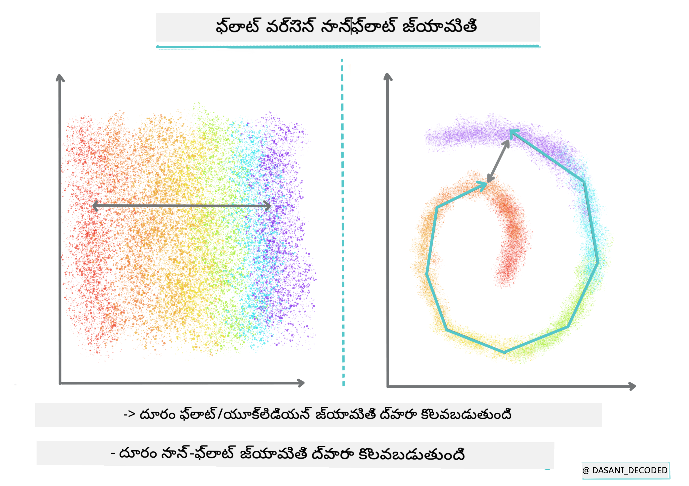
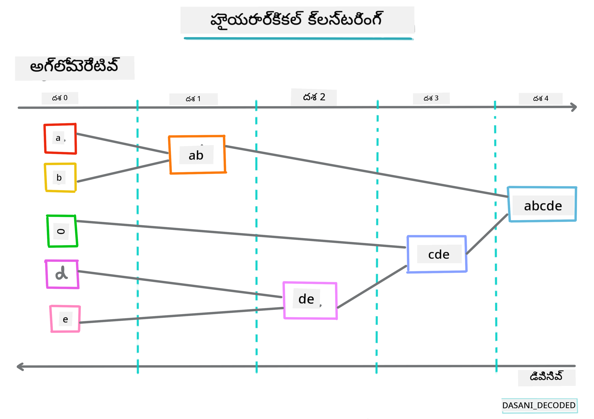
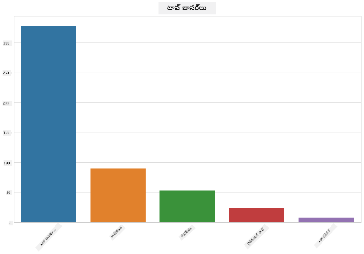
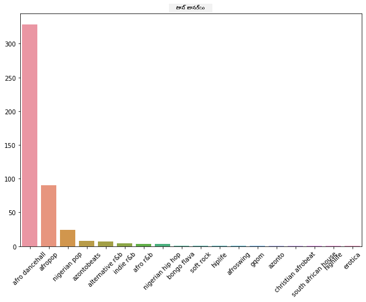
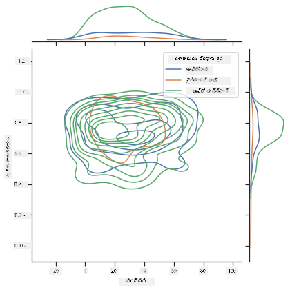
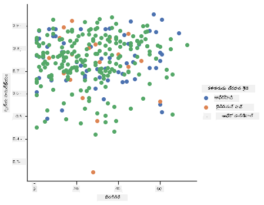

<!--
CO_OP_TRANSLATOR_METADATA:
{
  "original_hash": "730225ea274c9174fe688b21d421539d",
  "translation_date": "2025-12-19T14:56:36+00:00",
  "source_file": "5-Clustering/1-Visualize/README.md",
  "language_code": "te"
}
-->
# క్లస్టరింగ్ పరిచయం

క్లస్టరింగ్ అనేది [అనియంత్రిత అభ్యాసం](https://wikipedia.org/wiki/Unsupervised_learning) యొక్క ఒక రకం, ఇది ఒక డేటాసెట్ లేబుల్ చేయబడలేదు లేదా దాని ఇన్‌పుట్లు ముందుగా నిర్వచించిన అవుట్‌పుట్లతో సరిపోలడం లేదు అని ఊహిస్తుంది. ఇది వివిధ అల్గోరిథమ్లను ఉపయోగించి లేబుల్ చేయబడని డేటాను వర్గీకరించి, డేటాలో కనిపించే నమూనాల ప్రకారం సమూహాలను అందిస్తుంది.

[](https://youtu.be/ty2advRiWJM "No One Like You by PSquare")

> 🎥 పై చిత్రాన్ని క్లిక్ చేయండి వీడియో కోసం. మీరు క్లస్టరింగ్‌తో మెషీన్ లెర్నింగ్ అధ్యయనం చేస్తున్నప్పుడు, కొన్ని నైజీరియన్ డాన్స్ హాల్ ట్రాక్స్‌ను ఆస్వాదించండి - ఇది 2014లో PSquare నుండి అత్యధిక రేటింగ్ పొందిన పాట.

## [పూర్వ-లెక్చర్ క్విజ్](https://ff-quizzes.netlify.app/en/ml/)

### పరిచయం

[క్లస్టరింగ్](https://link.springer.com/referenceworkentry/10.1007%2F978-0-387-30164-8_124) డేటా అన్వేషణకు చాలా ఉపయోగకరం. నైజీరియన్ ప్రేక్షకులు సంగీతాన్ని ఎలా వినుతారో దాని లోపల ధోరణులు మరియు నమూనాలను కనుగొనడంలో ఇది సహాయపడుతుందో చూద్దాం.

✅ క్లస్టరింగ్ ఉపయోగాల గురించి ఒక నిమిషం ఆలోచించండి. వాస్తవ జీవితంలో, మీరు ఒక బట్టల గుంపు ఉన్నప్పుడు మరియు మీ కుటుంబ సభ్యుల బట్టలను వర్గీకరించాల్సినప్పుడు క్లస్టరింగ్ జరుగుతుంది 🧦👕👖🩲. డేటా సైన్స్‌లో, క్లస్టరింగ్ ఒక వినియోగదారుడి అభిరుచులను విశ్లేషించేటప్పుడు లేదా ఏదైనా లేబుల్ చేయబడని డేటాసెట్ లక్షణాలను నిర్ణయించేటప్పుడు జరుగుతుంది. క్లస్టరింగ్, ఒక విధంగా, గందరగోళాన్ని అర్థం చేసుకోవడంలో సహాయపడుతుంది, ఒక మోజు డ్రాయర్ లాగా.

[](https://youtu.be/esmzYhuFnds "Introduction to Clustering")

> 🎥 పై చిత్రాన్ని క్లిక్ చేయండి వీడియో కోసం: MIT యొక్క జాన్ గుట్‌టాగ్ క్లస్టరింగ్‌ను పరిచయం చేస్తారు

వృత్తిపరమైన పరిసరాల్లో, క్లస్టరింగ్ మార్కెట్ విభజన, వయస్సు గుంపులు ఏ వస్తువులు కొనుగోలు చేస్తాయో నిర్ణయించడం వంటి విషయాలను నిర్ణయించడానికి ఉపయోగించవచ్చు. మరో ఉపయోగం అనామలీ గుర్తింపు, ఉదాహరణకు క్రెడిట్ కార్డ్ లావాదేవీల డేటాసెట్ నుండి మోసం గుర్తించడానికి. లేదా మీరు క్లస్టరింగ్‌ను వైద్య స్కాన్ల బ్యాచ్‌లో ట్యూమర్లను గుర్తించడానికి ఉపయోగించవచ్చు.

✅ బ్యాంకింగ్, ఈ-కామర్స్ లేదా వ్యాపార పరిసరాల్లో మీరు క్లస్టరింగ్‌ను 'వనంలో' ఎలా ఎదుర్కొన్నారో ఒక నిమిషం ఆలోచించండి.

> 🎓 ఆసక్తికరంగా, క్లస్టర్ విశ్లేషణ 1930లలో మానవ శాస్త్రం మరియు మానసిక శాస్త్రం రంగాలలో ప్రారంభమైంది. మీరు దీన్ని ఎలా ఉపయోగించారో ఊహించగలరా?

వేరే విధంగా, మీరు శోధన ఫలితాలను వర్గీకరించడానికి ఉపయోగించవచ్చు - ఉదాహరణకు షాపింగ్ లింకులు, చిత్రాలు లేదా సమీక్షల ద్వారా. క్లస్టరింగ్ పెద్ద డేటాసెట్ ఉన్నప్పుడు మరియు మీరు దానిని తగ్గించి మరింత సూక్ష్మ విశ్లేషణ చేయాలనుకుంటే ఉపయోగకరం, కాబట్టి ఈ సాంకేతికతను ఇతర మోడల్స్ నిర్మించకముందు డేటా గురించి తెలుసుకోవడానికి ఉపయోగించవచ్చు.

✅ ఒకసారి మీ డేటా క్లస్టర్లలో సక్రమంగా ఏర్పాటు చేసిన తర్వాత, మీరు దానికి క్లస్టర్ ID కేటాయిస్తారు, మరియు ఈ సాంకేతికత డేటాసెట్ గోప్యతను కాపాడటంలో ఉపయోగకరంగా ఉంటుంది; మీరు డేటా పాయింట్‌ను మరింత వెల్లడించే గుర్తింపు డేటా ద్వారా కాకుండా దాని క్లస్టర్ ID ద్వారా సూచించవచ్చు. మీరు మరే ఇతర కారణాలు గుర్తించగలరా ఎందుకు మీరు క్లస్టర్ ID ద్వారా దానిని గుర్తించాలనుకుంటారు?

ఈ [Learn module](https://docs.microsoft.com/learn/modules/train-evaluate-cluster-models?WT.mc_id=academic-77952-leestott) లో క్లస్టరింగ్ సాంకేతికతలపై మీ అవగాహనను లోతుగా చేసుకోండి
## క్లస్టరింగ్ ప్రారంభం

[Scikit-learn పెద్ద శ్రేణి](https://scikit-learn.org/stable/modules/clustering.html) పద్ధతులను క్లస్టరింగ్ కోసం అందిస్తుంది. మీరు ఎంచుకునే రకం మీ ఉపయోగ కేసుపై ఆధారపడి ఉంటుంది. డాక్యుమెంటేషన్ ప్రకారం, ప్రతి పద్ధతికి వివిధ లాభాలు ఉన్నాయి. ఇక్కడ Scikit-learn మద్దతు ఇచ్చే పద్ధతులు మరియు వాటి సరైన ఉపయోగాల సరళమైన పట్టిక ఉంది:

| పద్ధతి పేరు                  | ఉపయోగం                                                               |
| :--------------------------- | :--------------------------------------------------------------------- |
| K-Means                      | సాధారణ ప్రయోజనం, సూచనాత్మక                                             |
| Affinity propagation         | చాలా, అసమాన క్లస్టర్లు, సూచనాత్మక                                       |
| Mean-shift                   | చాలా, అసమాన క్లస్టర్లు, సూచనాత్మక                                       |
| Spectral clustering          | కొద్దిగా, సమాన క్లస్టర్లు, ప్రత్యక్షాత్మక                                       |
| Ward hierarchical clustering | చాలా, పరిమిత క్లస్టర్లు, ప్రత్యక్షాత్మక                               |
| Agglomerative clustering     | చాలా, పరిమిత, నాన్ యూక్లిడియన్ దూరాలు, ప్రత్యక్షాత్మక               |
| DBSCAN                       | నాన్-ఫ్లాట్ జ్యామితి, అసమాన క్లస్టర్లు, ప్రత్యక్షాత్మక                       |
| OPTICS                       | నాన్-ఫ్లాట్ జ్యామితి, మార్పిడి సాంద్రతతో అసమాన క్లస్టర్లు, ప్రత్యక్షాత్మక |
| Gaussian mixtures            | ఫ్లాట్ జ్యామితి, సూచనాత్మక                                               |
| BIRCH                        | పెద్ద డేటాసెట్ అవుట్లయర్స్‌తో, సూచనాత్మక                                 |

> 🎓 మనం క్లస్టర్లు ఎలా సృష్టిస్తామో అనేది డేటా పాయింట్లను సమూహాలుగా ఎలా సేకరిస్తామో చాలా సంబంధం కలిగి ఉంటుంది. కొన్ని పదజాలాన్ని వివరించుకుందాం:
>
> 🎓 ['ప్రత్యక్షాత్మక' vs. 'సూచనాత్మక'](https://wikipedia.org/wiki/Transduction_(machine_learning))
> 
> ప్రత్యక్షాత్మక నిర్ధారణ అనేది నిర్దిష్ట పరీక్ష కేసులకు మ్యాప్ అయ్యే పరిశీలించిన శిక్షణ కేసుల నుండి ఉత్పన్నమవుతుంది. సూచనాత్మక నిర్ధారణ సాధారణ నియమాలకు మ్యాప్ అయ్యే శిక్షణ కేసుల నుండి ఉత్పన్నమవుతుంది, అవి తరువాత మాత్రమే పరీక్ష కేసులకు వర్తింపజేయబడతాయి.
> 
> ఉదాహరణ: మీ దగ్గర ఒక డేటాసెట్ భాగంగా మాత్రమే లేబుల్ చేయబడింది అని ఊహించండి. కొన్ని వస్తువులు 'రికార్డులు', కొన్ని 'సీడీలు', మరియు కొన్ని ఖాళీగా ఉన్నాయి. ఖాళీలకు లేబుళ్లు ఇవ్వడం మీ పని. మీరు సూచనాత్మక దృష్టికోణాన్ని ఎంచుకుంటే, మీరు 'రికార్డులు' మరియు 'సీడీలు' కోసం మోడల్ శిక్షణ ఇస్తారు, మరియు ఆ లేబుళ్లను లేబుల్ చేయబడని డేటాకు వర్తింపజేస్తారు. ఈ దృష్టికోణం వాస్తవానికి 'కాసెట్‌లు' అయిన వస్తువులను వర్గీకరించడంలో ఇబ్బంది పడుతుంది. ప్రత్యక్షాత్మక దృష్టికోణం, మరోవైపు, ఈ తెలియని డేటాను సమర్థవంతంగా నిర్వహిస్తుంది, ఇది సమాన వస్తువులను సమూహాలుగా కూర్చి, ఆ సమూహానికి లేబుల్ వర్తింపజేస్తుంది. ఈ సందర్భంలో, క్లస్టర్లు 'వృత్తాకార సంగీత వస్తువులు' మరియు 'చతురస్ర సంగీత వస్తువులు'ని ప్రతిబింబించవచ్చు.
> 
> 🎓 ['నాన్-ఫ్లాట్' vs. 'ఫ్లాట్' జ్యామితి](https://datascience.stackexchange.com/questions/52260/terminology-flat-geometry-in-the-context-of-clustering)
> 
> గణిత శాస్త్ర పదజాలం నుండి ఉద్భవించిన, నాన్-ఫ్లాట్ vs. ఫ్లాట్ జ్యామితి అనేది పాయింట్ల మధ్య దూరాలను 'ఫ్లాట్' ([యూక్లిడియన్](https://wikipedia.org/wiki/Euclidean_geometry)) లేదా 'నాన్-ఫ్లాట్' (నాన్-యూక్లిడియన్) జ్యామితి పద్ధతుల ద్వారా కొలవడాన్ని సూచిస్తుంది.
>
>'ఫ్లాట్' ఈ సందర్భంలో యూక్లిడియన్ జ్యామితిని సూచిస్తుంది (దాని భాగాలు 'ప్లేన్' జ్యామితిగా బోధించబడతాయి), మరియు నాన్-ఫ్లాట్ అనేది నాన్-యూక్లిడియన్ జ్యామితి. జ్యామితి మెషీన్ లెర్నింగ్‌కు ఏమి సంబంధం? గణితంలో ఆధారపడిన రెండు రంగాలుగా, క్లస్టర్లలో పాయింట్ల మధ్య దూరాలను కొలవడానికి సాధారణ మార్గం ఉండాలి, అది 'ఫ్లాట్' లేదా 'నాన్-ఫ్లాట్' విధంగా చేయవచ్చు, డేటా స్వభావం ఆధారంగా. [యూక్లిడియన్ దూరాలు](https://wikipedia.org/wiki/Euclidean_distance) రెండు పాయింట్ల మధ్య రేఖా భాగం పొడవుగా కొలవబడతాయి. [నాన్-యూక్లిడియన్ దూరాలు](https://wikipedia.org/wiki/Non-Euclidean_geometry) వక్రరేఖపై కొలవబడతాయి. మీ డేటా, దృశ్యరూపంలో, ఒక సమతలంపై లేనట్టుగా కనిపిస్తే, మీరు దానిని నిర్వహించడానికి ప్రత్యేక అల్గోరిథం అవసరం కావచ్చు.
>

> ఇన్ఫోగ్రాఫిక్ [దాసాని మడిపల్లి](https://twitter.com/dasani_decoded) ద్వారా
> 
> 🎓 ['దూరాలు'](https://web.stanford.edu/class/cs345a/slides/12-clustering.pdf)
> 
> క్లస్టర్లు వాటి దూర మ్యాట్రిక్స్ ద్వారా నిర్వచించబడతాయి, ఉదా: పాయింట్ల మధ్య దూరాలు. ఈ దూరం కొన్ని మార్గాల్లో కొలవబడవచ్చు. యూక్లిడియన్ క్లస్టర్లు పాయింట్ విలువల సగటు ద్వారా నిర్వచించబడతాయి, మరియు 'సెంట్రాయిడ్' లేదా కేంద్ర పాయింట్ కలిగి ఉంటాయి. దూరాలు ఆ సెంట్రాయిడ్ దూరం ద్వారా కొలవబడతాయి. నాన్-యూక్లిడియన్ దూరాలు 'క్లస్ట్రాయిడ్స్'ను సూచిస్తాయి, అంటే ఇతర పాయింట్లకు అత్యంత సమీపమైన పాయింట్. క్లస్ట్రాయిడ్స్ వివిధ రకాలుగా నిర్వచించబడవచ్చు.
> 
> 🎓 ['పరిమిత'](https://wikipedia.org/wiki/Constrained_clustering)
> 
> [పరిమిత క్లస్టరింగ్](https://web.cs.ucdavis.edu/~davidson/Publications/ICDMTutorial.pdf) ఈ అనియంత్రిత పద్ధతిలో 'సెమీ-సూపర్వైజ్డ్' అభ్యాసాన్ని పరిచయం చేస్తుంది. పాయింట్ల మధ్య సంబంధాలు 'లింక్ చేయకూడదు' లేదా 'లింక్ చేయాలి' అని గుర్తించబడతాయి కాబట్టి కొన్ని నియమాలు డేటాసెట్‌పై బలవంతంగా అమలవుతాయి.
>
>ఉదాహరణ: ఒక అల్గోరిథం లేబుల్ చేయబడని లేదా సెమీ-లేబుల్ చేయబడిన డేటా బ్యాచ్‌పై స్వేచ్ఛగా అమలవుతే, అది ఉత్పత్తి చేసే క్లస్టర్లు తక్కువ నాణ్యత కలిగి ఉండవచ్చు. పై ఉదాహరణలో, క్లస్టర్లు 'వృత్తాకార సంగీత వస్తువులు', 'చతురస్ర సంగీత వస్తువులు', 'త్రిభుజాకార వస్తువులు' మరియు 'కుకీలు'గా వర్గీకరించవచ్చు. కొన్ని పరిమితులు లేదా నియమాలు ("వస్తువు ప్లాస్టిక్‌తో తయారవాలి", "వస్తువు సంగీతం ఉత్పత్తి చేయగలగాలి") ఇవ్వబడితే, ఇది అల్గోరిథం మెరుగైన ఎంపికలు చేయడానికి సహాయపడుతుంది.
> 
> 🎓 'సాంద్రత'
> 
> 'శబ్దం' ఉన్న డేటాను 'సాంద్రంగా' పరిగణిస్తారు. దాని ప్రతి క్లస్టర్‌లో పాయింట్ల మధ్య దూరాలు పరిశీలనలో ఎక్కువ లేదా తక్కువ సాంద్రత లేదా 'గొడవ'గా ఉండవచ్చు, కాబట్టి ఈ డేటాను సరైన క్లస్టరింగ్ పద్ధతితో విశ్లేషించాలి. [ఈ వ్యాసం](https://www.kdnuggets.com/2020/02/understanding-density-based-clustering.html) K-Means క్లస్టరింగ్ మరియు HDBSCAN అల్గోరిథమ్లను ఉపయోగించి అసమాన క్లస్టర్ సాంద్రతతో శబ్దం ఉన్న డేటాసెట్‌ను అన్వేషించడంలో తేడాను చూపిస్తుంది.

## క్లస్టరింగ్ అల్గోరిథమ్లు

100కి పైగా క్లస్టరింగ్ అల్గోరిథమ్లు ఉన్నాయి, మరియు వాటి ఉపయోగం డేటా స్వభావంపై ఆధారపడి ఉంటుంది. కొన్ని ప్రధానమైన వాటిని చర్చిద్దాం:

- **హైరార్కికల్ క్లస్టరింగ్**. ఒక వస్తువు దాని సమీప వస్తువుతో సమీపత ఆధారంగా వర్గీకరించబడితే, దూరం ఆధారంగా క్లస్టర్లు ఏర్పడతాయి. Scikit-learn యొక్క అగ్లోమెరేటివ్ క్లస్టరింగ్ హైరార్కికల్.

   
   > ఇన్ఫోగ్రాఫిక్ [దాసాని మడిపల్లి](https://twitter.com/dasani_decoded) ద్వారా

- **సెంట్రాయిడ్ క్లస్టరింగ్**. ఈ ప్రాచుర్యం పొందిన అల్గోరిథం 'k' లేదా ఏర్పరచాల్సిన క్లస్టర్ల సంఖ్యను ఎంచుకోవాలి, ఆ తర్వాత అల్గోరిథం క్లస్టర్ కేంద్ర పాయింట్‌ను నిర్ణయించి ఆ పాయింట్ చుట్టూ డేటాను సేకరిస్తుంది. [K-means క్లస్టరింగ్](https://wikipedia.org/wiki/K-means_clustering) సెంట్రాయిడ్ క్లస్టరింగ్ యొక్క ప్రాచుర్యం పొందిన వెర్షన్. కేంద్రం సమీప సగటు ద్వారా నిర్ణయించబడుతుంది, అందుకే పేరు. క్లస్టర్ నుండి చతురస్ర దూరం తగ్గించబడుతుంది.

   
   > ఇన్ఫోగ్రాఫిక్ [దాసాని మడిపల్లి](https://twitter.com/dasani_decoded) ద్వారా

- **వితరణ ఆధారిత క్లస్టరింగ్**. గణాంక నమూనాలపై ఆధారపడి, వితరణ ఆధారిత క్లస్టరింగ్ ఒక డేటా పాయింట్ ఒక క్లస్టర్‌కు చెందే సంభావ్యతను నిర్ణయించి, దానికి అనుగుణంగా కేటాయిస్తుంది. గౌసియన్ మిశ్రమ పద్ధతులు ఈ రకానికి చెందుతాయి.

- **సాంద్రత ఆధారిత క్లస్టరింగ్**. డేటా పాయింట్లు వారి సాంద్రత లేదా ఒకరితో ఒకరు సమూహంగా ఉండటం ఆధారంగా క్లస్టర్లకు కేటాయించబడతాయి. సమూహం నుండి దూరంగా ఉన్న డేటా పాయింట్లు అవుట్లయర్స్ లేదా శబ్దంగా పరిగణించబడతాయి. DBSCAN, Mean-shift మరియు OPTICS ఈ రకమైన క్లస్టరింగ్‌కు చెందుతాయి.

- **గ్రిడ్ ఆధారిత క్లస్టరింగ్**. బహుమాణ డేటాసెట్‌ల కోసం, ఒక గ్రిడ్ సృష్టించి డేటాను గ్రిడ్ సెల్‌ల మధ్య విభజించి క్లస్టర్లు సృష్టిస్తారు.

## వ్యాయామం - మీ డేటాను క్లస్టర్ చేయండి

క్లస్టరింగ్ సాంకేతికత సరైన దృశ్యీకరణతో చాలా సహాయపడుతుంది, కాబట్టి మన సంగీత డేటాను దృశ్యీకరించడం ప్రారంభిద్దాం. ఈ వ్యాయామం మనకు ఈ డేటా స్వభావానికి ఏ క్లస్టరింగ్ పద్ధతిని సమర్థవంతంగా ఉపయోగించాలో నిర్ణయించడంలో సహాయపడుతుంది.

1. ఈ ఫోల్డర్‌లోని [_notebook.ipynb_](https://github.com/microsoft/ML-For-Beginners/blob/main/5-Clustering/1-Visualize/notebook.ipynb) ఫైల్‌ను తెరవండి.

1. మంచి డేటా దృశ్యీకరణ కోసం `Seaborn` ప్యాకేజీని దిగుమతి చేసుకోండి.

    ```python
    !pip install seaborn
    ```

1. [_nigerian-songs.csv_](https://github.com/microsoft/ML-For-Beginners/blob/main/5-Clustering/data/nigerian-songs.csv) నుండి పాటల డేటాను జోడించండి. పాటల గురించి కొంత డేటాతో డేటాఫ్రేమ్‌ను లోడ్ చేయండి. లైబ్రరీలను దిగుమతి చేసుకుని డేటాను ప్రదర్శించడానికి సిద్ధంగా ఉండండి:

    ```python
    import matplotlib.pyplot as plt
    import pandas as pd
    
    df = pd.read_csv("../data/nigerian-songs.csv")
    df.head()
    ```

    మొదటి కొన్ని లైన్ల డేటాను తనిఖీ చేయండి:

    |     | name                     | album                        | artist              | artist_top_genre | release_date | length | popularity | danceability | acousticness | energy | instrumentalness | liveness | loudness | speechiness | tempo   | time_signature |
    | --- | ------------------------ | ---------------------------- | ------------------- | ---------------- | ------------ | ------ | ---------- | ------------ | ------------ | ------ | ---------------- | -------- | -------- | ----------- | ------- | -------------- |
    | 0   | Sparky                   | Mandy & The Jungle           | Cruel Santino       | alternative r&b  | 2019         | 144000 | 48         | 0.666        | 0.851        | 0.42   | 0.534            | 0.11     | -6.699   | 0.0829      | 133.015 | 5              |
    | 1   | shuga rush               | EVERYTHING YOU HEARD IS TRUE | Odunsi (The Engine) | afropop          | 2020         | 89488  | 30         | 0.71         | 0.0822       | 0.683  | 0.000169         | 0.101    | -5.64    | 0.36        | 129.993 | 3              |
    | 2   | LITT!                    | LITT!                        | AYLØ                | ఇండీ ఆర్&బి        | 2018         | 207758 | 40         | 0.836        | 0.272        | 0.564  | 0.000537         | 0.11     | -7.127   | 0.0424      | 130.005 | 4              |
    | 3   | Confident / Feeling Cool | Enjoy Your Life              | Lady Donli          | నైజీరియన్ పాప్     | 2019         | 175135 | 14         | 0.894        | 0.798        | 0.611  | 0.000187         | 0.0964   | -4.961   | 0.113       | 111.087 | 4              |
    | 4   | wanted you               | rare.                        | Odunsi (The Engine) | ఆఫ్రోపాప్          | 2018         | 152049 | 25         | 0.702        | 0.116        | 0.833  | 0.91             | 0.348    | -6.044   | 0.0447      | 105.115 | 4              |

1. డేటాఫ్రేమ్ గురించి కొంత సమాచారం పొందండి, `info()` ను పిలవండి:

    ```python
    df.info()
    ```

   అవుట్పుట్ ఇలా ఉంటుంది:

    ```output
    <class 'pandas.core.frame.DataFrame'>
    RangeIndex: 530 entries, 0 to 529
    Data columns (total 16 columns):
     #   Column            Non-Null Count  Dtype  
    ---  ------            --------------  -----  
     0   name              530 non-null    object 
     1   album             530 non-null    object 
     2   artist            530 non-null    object 
     3   artist_top_genre  530 non-null    object 
     4   release_date      530 non-null    int64  
     5   length            530 non-null    int64  
     6   popularity        530 non-null    int64  
     7   danceability      530 non-null    float64
     8   acousticness      530 non-null    float64
     9   energy            530 non-null    float64
     10  instrumentalness  530 non-null    float64
     11  liveness          530 non-null    float64
     12  loudness          530 non-null    float64
     13  speechiness       530 non-null    float64
     14  tempo             530 non-null    float64
     15  time_signature    530 non-null    int64  
    dtypes: float64(8), int64(4), object(4)
    memory usage: 66.4+ KB
    ```

1. నల్ విలువల కోసం డబుల్-చెక్ చేయండి, `isnull()` ను పిలవడం ద్వారా మరియు మొత్తం 0 అని నిర్ధారించండి:

    ```python
    df.isnull().sum()
    ```

    బాగుంది:

    ```output
    name                0
    album               0
    artist              0
    artist_top_genre    0
    release_date        0
    length              0
    popularity          0
    danceability        0
    acousticness        0
    energy              0
    instrumentalness    0
    liveness            0
    loudness            0
    speechiness         0
    tempo               0
    time_signature      0
    dtype: int64
    ```

1. డేటాను వివరించండి:

    ```python
    df.describe()
    ```

    |       | విడుదల తేదీ | పొడవు      | ప్రాచుర్యం | డ్యాన్సబిలిటీ | అకౌస్టిక్‌నెస్ | ఎనర్జీ   | ఇన్‌స్ట్రుమెంటల్‌నెస్ | లైవ్‌నెస్ | లౌడ్నెస్  | స్పీచినెస్ | టెంపో      | టైమ్ సిగ్నేచర్ |
    | ----- | ------------ | ----------- | ---------- | ------------ | ------------ | -------- | ---------------- | -------- | --------- | ----------- | ---------- | -------------- |
    | కౌంట్ | 530          | 530         | 530        | 530          | 530          | 530      | 530              | 530      | 530       | 530         | 530        | 530            |
    | సగటు  | 2015.390566  | 222298.1698 | 17.507547  | 0.741619     | 0.265412     | 0.760623 | 0.016305         | 0.147308 | -4.953011 | 0.130748    | 116.487864 | 3.986792       |
    | స్టాండర్డ్ డెవియేషన్ | 3.131688     | 39696.82226 | 18.992212  | 0.117522     | 0.208342     | 0.148533 | 0.090321         | 0.123588 | 2.464186  | 0.092939    | 23.518601  | 0.333701       |
    | కనిష్ఠం | 1998         | 89488       | 0          | 0.255        | 0.000665     | 0.111    | 0                | 0.0283   | -19.362   | 0.0278      | 61.695     | 3              |
    | 25%   | 2014         | 199305      | 0          | 0.681        | 0.089525     | 0.669    | 0                | 0.07565  | -6.29875  | 0.0591      | 102.96125  | 4              |
    | 50%   | 2016         | 218509      | 13         | 0.761        | 0.2205       | 0.7845   | 0.000004         | 0.1035   | -4.5585   | 0.09795     | 112.7145   | 4              |
    | 75%   | 2017         | 242098.5    | 31         | 0.8295       | 0.403        | 0.87575  | 0.000234         | 0.164    | -3.331    | 0.177       | 125.03925  | 4              |
    | గరిష్ఠం | 2020         | 511738      | 73         | 0.966        | 0.954        | 0.995    | 0.91             | 0.811    | 0.582     | 0.514       | 206.007    | 5              |

> 🤔 మనం క్లస్టరింగ్‌తో పని చేస్తున్నప్పుడు, లేబుల్డ్ డేటా అవసరం లేని ఒక అన్‌సూపర్వైజ్డ్ పద్ధతి, ఎందుకు ఈ డేటాను లేబుల్స్‌తో చూపిస్తున్నాం? డేటా అన్వేషణ దశలో అవి ఉపయోగకరంగా ఉంటాయి, కానీ క్లస్టరింగ్ అల్గోరిథమ్స్ పనిచేయడానికి అవి అవసరం కాదు. మీరు కాలమ్ హెడ్డర్లను తీసేసి కాలమ్ నంబర్ ద్వారా డేటాను సూచించవచ్చు.

డేటా యొక్క సాధారణ విలువలను చూడండి. ప్రాచుర్యం '0' కావచ్చు, అంటే ర్యాంకింగ్ లేని పాటలు. వాటిని త్వరలో తీసివేద్దాం.

1. అత్యంత ప్రాచుర్యం ఉన్న జానర్లను కనుగొనడానికి బార్ప్లాట్ ఉపయోగించండి:

    ```python
    import seaborn as sns
    
    top = df['artist_top_genre'].value_counts()
    plt.figure(figsize=(10,7))
    sns.barplot(x=top[:5].index,y=top[:5].values)
    plt.xticks(rotation=45)
    plt.title('Top genres',color = 'blue')
    ```

    

✅ మీరు ఎక్కువ టాప్ విలువలు చూడాలనుకుంటే, టాప్ `[:5]` ను పెద్ద విలువగా మార్చండి లేదా అన్ని చూడటానికి తీసివేయండి.

గమనించండి, టాప్ జానర్ 'Missing' గా ఉంటే, అంటే Spotify దాన్ని వర్గీకరించలేదు, కాబట్టి దాన్ని తీసివేయండి.

1. మిస్సింగ్ డేటాను ఫిల్టర్ చేసి తీసివేయండి

    ```python
    df = df[df['artist_top_genre'] != 'Missing']
    top = df['artist_top_genre'].value_counts()
    plt.figure(figsize=(10,7))
    sns.barplot(x=top.index,y=top.values)
    plt.xticks(rotation=45)
    plt.title('Top genres',color = 'blue')
    ```

    ఇప్పుడు జానర్లను మళ్లీ తనిఖీ చేయండి:

    

1. ఇప్పటి వరకు, టాప్ మూడు జానర్లు ఈ డేటాసెట్‌ను ఆధిపత్యం చేస్తాయి. `afro dancehall`, `afropop`, మరియు `nigerian pop` పై దృష్టి పెట్టండి, అదనంగా 0 ప్రాచుర్యం విలువ ఉన్న ఏదైనా డేటాను తీసివేయండి (అంటే డేటాసెట్‌లో ప్రాచుర్యం తో వర్గీకరించబడలేదు మరియు మన ప్రయోజనాలకు శబ్దం గా పరిగణించవచ్చు):

    ```python
    df = df[(df['artist_top_genre'] == 'afro dancehall') | (df['artist_top_genre'] == 'afropop') | (df['artist_top_genre'] == 'nigerian pop')]
    df = df[(df['popularity'] > 0)]
    top = df['artist_top_genre'].value_counts()
    plt.figure(figsize=(10,7))
    sns.barplot(x=top.index,y=top.values)
    plt.xticks(rotation=45)
    plt.title('Top genres',color = 'blue')
    ```

1. డేటా ఏదైనా బలమైన సంబంధం కలిగి ఉందా అని త్వరిత పరీక్ష చేయండి:

    ```python
    corrmat = df.corr(numeric_only=True)
    f, ax = plt.subplots(figsize=(12, 9))
    sns.heatmap(corrmat, vmax=.8, square=True)
    ```

    

    ఒకే బలమైన సంబంధం `energy` మరియు `loudness` మధ్య ఉంది, ఇది ఆశ్చర్యకరం కాదు, ఎందుకంటే శబ్దమైన సంగీతం సాధారణంగా చాలా శక్తివంతంగా ఉంటుంది. మిగతా సంబంధాలు తక్కువ బలంగా ఉన్నాయి. ఈ డేటాను క్లస్టరింగ్ అల్గోరిథం ఎలా ఉపయోగిస్తుందో చూడటం ఆసక్తికరం.

    > 🎓 సంబంధం కారణాన్ని సూచించదు! మనకు సంబంధం ఉన్నదని సాక్ష్యం ఉంది కానీ కారణం ఉన్నదని లేదు. ఒక [వినోదాత్మక వెబ్ సైట్](https://tylervigen.com/spurious-correlations) ఈ విషయాన్ని హైలైట్ చేస్తుంది.

ఈ డేటాసెట్‌లో పాట యొక్క భావిత ప్రాచుర్యం మరియు డ్యాన్సబిలిటీ మధ్య ఏదైనా సమీకరణ ఉందా? ఒక FacetGrid చూపిస్తుంది, జానర్‌ను పక్కన పెట్టినా, సెంట్రిక్ సర్కిల్స్ సరిపోతున్నాయి. నైజీరియన్ రుచులు ఈ జానర్ కోసం ఒక నిర్దిష్ట డ్యాన్సబిలిటీ స్థాయిలో సమీకరించవచ్చా?

✅ వేరే డేటాపాయింట్లు (energy, loudness, speechiness) మరియు మరిన్ని లేదా వేరే సంగీత జానర్లను ప్రయత్నించండి. మీరు ఏమి కనుగొంటారు? `df.describe()` పట్టికను చూడండి డేటా పాయింట్ల సాధారణ వ్యాప్తిని తెలుసుకోవడానికి.

### వ్యాయామం - డేటా పంపిణీ

ఈ మూడు జానర్లు వారి డ్యాన్సబిలిటీ భావనలో ప్రాచుర్యం ఆధారంగా గణనీయంగా భిన్నమా?

1. మన టాప్ మూడు జానర్ల డేటా పంపిణీని ప్రాచుర్యం మరియు డ్యాన్సబిలిటీ కోసం ఒక నిర్దిష్ట x మరియు y అక్షాలపై పరిశీలించండి.

    ```python
    sns.set_theme(style="ticks")
    
    g = sns.jointplot(
        data=df,
        x="popularity", y="danceability", hue="artist_top_genre",
        kind="kde",
    )
    ```

    మీరు సెంట్రిక్ సర్కిల్స్ కనుగొనవచ్చు, ఒక సాధారణ సమీకరణ పాయింట్ చుట్టూ, పాయింట్ల పంపిణీని చూపిస్తూ.

    > 🎓 ఈ ఉదాహరణలో KDE (కర్నెల్ డెన్సిటీ ఎస్టిమేట్) గ్రాఫ్ ఉపయోగించబడింది, ఇది డేటాను నిరంతర ప్రాబబిలిటీ డెన్సిటీ వక్రంగా ప్రదర్శిస్తుంది. ఇది బహుళ పంపిణీలతో పని చేసే సమయంలో డేటాను అర్థం చేసుకోవడానికి సహాయపడుతుంది.

    సాధారణంగా, ఈ మూడు జానర్లు వారి ప్రాచుర్యం మరియు డ్యాన్సబిలిటీ పరంగా సడలిన సరిపోలికలో ఉంటాయి. ఈ సడలిన సరిపోలిక డేటాలో క్లస్టర్లను నిర్ణయించడం ఒక సవాలు:

    

1. ఒక స్కాటర్ ప్లాట్ సృష్టించండి:

    ```python
    sns.FacetGrid(df, hue="artist_top_genre", height=5) \
       .map(plt.scatter, "popularity", "danceability") \
       .add_legend()
    ```

    అదే అక్షాల స్కాటర్‌ప్లాట్ ఒక సమానమైన సమీకరణ నమూనాను చూపిస్తుంది

    

సాధారణంగా, క్లస్టరింగ్ కోసం, మీరు డేటా క్లస్టర్లను చూపించడానికి స్కాటర్‌ప్లాట్లను ఉపయోగించవచ్చు, కాబట్టి ఈ రకమైన విజువలైజేషన్‌ను నేర్చుకోవడం చాలా ఉపయోగకరం. తదుపరి పాఠంలో, మనం ఈ ఫిల్టర్ చేసిన డేటాను తీసుకుని k-means క్లస్టరింగ్ ఉపయోగించి ఈ డేటాలో ఆసక్తికరమైన రీతిలో ఓవర్‌ల్యాప్ అయ్యే గ్రూపులను కనుగొంటాము.

---

## 🚀సవాలు

తదుపరి పాఠానికి సిద్ధంగా, మీరు కనుగొనగల మరియు ఉత్పత్తి వాతావరణంలో ఉపయోగించగల వివిధ క్లస్టరింగ్ అల్గోరిథమ్స్ గురించి ఒక చార్ట్ తయారుచేయండి. క్లస్టరింగ్ ఏ రకాల సమస్యలను పరిష్కరించడానికి ప్రయత్నిస్తోంది?

## [పోస్ట్-లెక్చర్ క్విజ్](https://ff-quizzes.netlify.app/en/ml/)

## సమీక్ష & స్వీయ అధ్యయనం

క్లస్టరింగ్ అల్గోరిథమ్స్‌ను వర్తింపజేసే ముందు, మనం నేర్చుకున్నట్లుగా, మీ డేటాసెట్ స్వభావాన్ని అర్థం చేసుకోవడం మంచిది. ఈ విషయంపై మరింత చదవండి [ఇక్కడ](https://www.kdnuggets.com/2019/10/right-clustering-algorithm.html)

[ఈ సహాయక వ్యాసం](https://www.freecodecamp.org/news/8-clustering-algorithms-in-machine-learning-that-all-data-scientists-should-know/) వివిధ డేటా ఆకారాలపై వివిధ క్లస్టరింగ్ అల్గోరిథమ్స్ ఎలా ప్రవర్తిస్తాయో మీకు చూపిస్తుంది.

## అసైన్‌మెంట్

[క్లస్టరింగ్ కోసం ఇతర విజువలైజేషన్లపై పరిశోధన చేయండి](assignment.md)

---

<!-- CO-OP TRANSLATOR DISCLAIMER START -->
**అస్పష్టత**:  
ఈ పత్రాన్ని AI అనువాద సేవ [Co-op Translator](https://github.com/Azure/co-op-translator) ఉపయోగించి అనువదించబడింది. మేము ఖచ్చితత్వానికి ప్రయత్నించినప్పటికీ, ఆటోమేటెడ్ అనువాదాల్లో పొరపాట్లు లేదా తప్పిదాలు ఉండవచ్చు. మూల పత్రం దాని స్వదేశీ భాషలో అధికారిక మూలంగా పరిగణించాలి. ముఖ్యమైన సమాచారానికి, ప్రొఫెషనల్ మానవ అనువాదం సిఫార్సు చేయబడుతుంది. ఈ అనువాదం వాడకంలో ఏర్పడిన ఏవైనా అపార్థాలు లేదా తప్పుదారుల కోసం మేము బాధ్యత వహించము.
<!-- CO-OP TRANSLATOR DISCLAIMER END -->