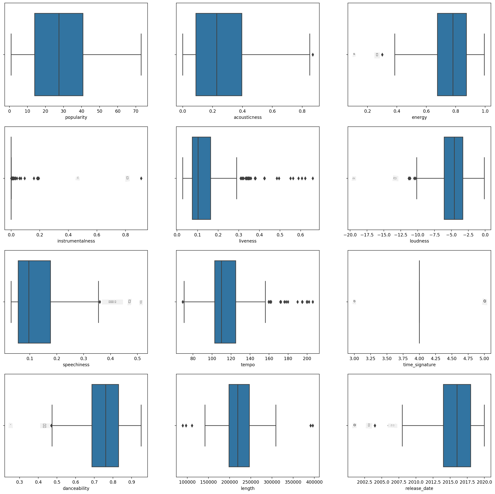
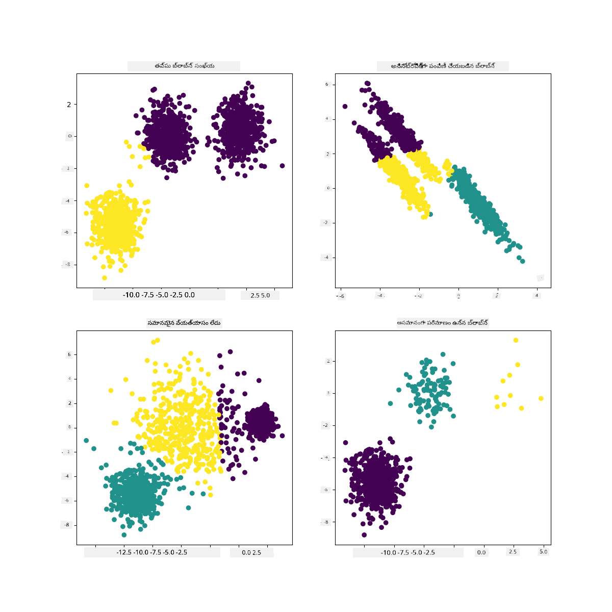

<!--
CO_OP_TRANSLATOR_METADATA:
{
  "original_hash": "7cdd17338d9bbd7e2171c2cd462eb081",
  "translation_date": "2025-12-19T14:50:18+00:00",
  "source_file": "5-Clustering/2-K-Means/README.md",
  "language_code": "te"
}
-->
# K-Means క్లస్టరింగ్

## [పూర్వ-లెక్చర్ క్విజ్](https://ff-quizzes.netlify.app/en/ml/)

ఈ పాఠంలో, మీరు Scikit-learn మరియు మీరు ముందుగా దిగుమతి చేసుకున్న నైజీరియన్ సంగీత డేటాసెట్ ఉపయోగించి క్లస్టర్లను ఎలా సృష్టించాలో నేర్చుకుంటారు. మేము K-Means క్లస్టరింగ్ యొక్క ప్రాథమిక అంశాలను కవర్ చేస్తాము. మీరు ముందుగా నేర్చుకున్నట్లుగా, క్లస్టర్లతో పని చేయడానికి అనేక మార్గాలు ఉన్నాయి మరియు మీరు ఉపయోగించే పద్ధతి మీ డేటాపై ఆధారపడి ఉంటుంది. K-Means ను ప్రయత్నిస్తాము ఎందుకంటే ఇది అత్యంత సాధారణ క్లస్టరింగ్ సాంకేతికత. మొదలు పెడదాం!

మీరు నేర్చుకునే పదాలు:

- సిల్హౌట్ స్కోరింగ్
- ఎల్బో పద్ధతి
- ఇనర్షియా
- వైవిధ్యం

## పరిచయం

[K-Means క్లస్టరింగ్](https://wikipedia.org/wiki/K-means_clustering) సిగ్నల్ ప్రాసెసింగ్ డొమైన్ నుండి ఉద్భవించిన పద్ధతి. ఇది డేటా సమూహాలను 'k' క్లస్టర్లుగా విభజించడానికి మరియు విభజించడానికి ఉపయోగిస్తారు, ఒక శ్రేణి పరిశీలనల ద్వారా. ప్రతి పరిశీలన ఒక నిర్దిష్ట డేటాపాయింట్‌ను దాని సమీప 'మీన' లేదా క్లస్టర్ యొక్క కేంద్ర బిందువు దగ్గరగా సమూహీకరించడానికి పనిచేస్తుంది.

క్లస్టర్లు [Voronoi డయాగ్రామ్స్](https://wikipedia.org/wiki/Voronoi_diagram) గా దృశ్యమానమవుతాయి, ఇవి ఒక బిందువు (లేదా 'సీడ్') మరియు దాని సంబంధిత ప్రాంతాన్ని కలిగి ఉంటాయి.


> ఇన్ఫోగ్రాఫిక్ [Jen Looper](https://twitter.com/jenlooper) ద్వారా

K-Means క్లస్టరింగ్ ప్రక్రియ [మూడు దశల ప్రక్రియలో అమలు అవుతుంది](https://scikit-learn.org/stable/modules/clustering.html#k-means):

1. అల్గోరిథం డేటాసెట్ నుండి నమూనాలు తీసుకుని k-సంఖ్యా కేంద్ర బిందువులను ఎంచుకుంటుంది. దీని తర్వాత, ఇది లూప్ చేస్తుంది:
    1. ప్రతి నమూనాను సమీప సెంట్రాయిడ్‌కు కేటాయిస్తుంది.
    2. గత సెంట్రాయిడ్‌లకు కేటాయించిన అన్ని నమూనాల సగటు విలువ తీసుకుని కొత్త సెంట్రాయిడ్‌లను సృష్టిస్తుంది.
    3. ఆపై, కొత్త మరియు పాత సెంట్రాయిడ్‌ల మధ్య తేడాను లెక్కించి, సెంట్రాయిడ్‌లు స్థిరపడేవరకు పునరావృతం చేస్తుంది.

K-Means ఉపయోగించడంలో ఒక లోపం ఏమిటంటే, మీరు 'k' అంటే సెంట్రాయిడ్‌ల సంఖ్యను నిర్ణయించాలి. అదృష్టవశాత్తు 'ఎల్బో పద్ధతి' మంచి ప్రారంభ విలువను అంచనా వేయడంలో సహాయపడుతుంది. మీరు దీన్ని కొద్దిసేపట్లో ప్రయత్నిస్తారు.

## ముందస్తు అవసరాలు

ఈ పాఠంలో మీరు [_notebook.ipynb_](https://github.com/microsoft/ML-For-Beginners/blob/main/5-Clustering/2-K-Means/notebook.ipynb) ఫైల్‌లో పని చేస్తారు, ఇందులో మీరు గత పాఠంలో చేసిన డేటా దిగుమతి మరియు ప్రాథమిక శుభ్రపరిచే పనులు ఉన్నాయి.

## వ్యాయామం - సిద్ధం కావడం

మళ్లీ పాటల డేటాను పరిశీలించడం ప్రారంభించండి.

1. ప్రతి కాలమ్ కోసం `boxplot()` పిలిచి బాక్స్‌ప్లాట్ సృష్టించండి:

    ```python
    plt.figure(figsize=(20,20), dpi=200)
    
    plt.subplot(4,3,1)
    sns.boxplot(x = 'popularity', data = df)
    
    plt.subplot(4,3,2)
    sns.boxplot(x = 'acousticness', data = df)
    
    plt.subplot(4,3,3)
    sns.boxplot(x = 'energy', data = df)
    
    plt.subplot(4,3,4)
    sns.boxplot(x = 'instrumentalness', data = df)
    
    plt.subplot(4,3,5)
    sns.boxplot(x = 'liveness', data = df)
    
    plt.subplot(4,3,6)
    sns.boxplot(x = 'loudness', data = df)
    
    plt.subplot(4,3,7)
    sns.boxplot(x = 'speechiness', data = df)
    
    plt.subplot(4,3,8)
    sns.boxplot(x = 'tempo', data = df)
    
    plt.subplot(4,3,9)
    sns.boxplot(x = 'time_signature', data = df)
    
    plt.subplot(4,3,10)
    sns.boxplot(x = 'danceability', data = df)
    
    plt.subplot(4,3,11)
    sns.boxplot(x = 'length', data = df)
    
    plt.subplot(4,3,12)
    sns.boxplot(x = 'release_date', data = df)
    ```

    ఈ డేటా కొంత శబ్దంగా ఉంది: ప్రతి కాలమ్‌ను బాక్స్‌ప్లాట్‌గా పరిశీలించడం ద్వారా మీరు అవుట్లయర్స్‌ను చూడవచ్చు.

    

మీరు డేటాసెట్‌ను పరిశీలించి అవుట్లయర్స్‌ను తొలగించవచ్చు, కానీ అది డేటాను చాలా తక్కువగా చేస్తుంది.

1. ఇప్పటికీ, మీరు క్లస్టరింగ్ వ్యాయామం కోసం ఉపయోగించబోయే కాలమ్‌లను ఎంచుకోండి. సమాన పరిధులున్న వాటిని ఎంచుకోండి మరియు `artist_top_genre` కాలమ్‌ను సంఖ్యాత్మక డేటాగా ఎన్‌కోడ్ చేయండి:

    ```python
    from sklearn.preprocessing import LabelEncoder
    le = LabelEncoder()
    
    X = df.loc[:, ('artist_top_genre','popularity','danceability','acousticness','loudness','energy')]
    
    y = df['artist_top_genre']
    
    X['artist_top_genre'] = le.fit_transform(X['artist_top_genre'])
    
    y = le.transform(y)
    ```

1. ఇప్పుడు మీరు ఎన్ని క్లస్టర్లను లక్ష్యంగా పెట్టుకోవాలో ఎంచుకోవాలి. మీరు డేటాసెట్ నుండి 3 పాటల జానర్లను తీసుకున్నారని తెలుసు, కాబట్టి 3 ను ప్రయత్నిద్దాం:

    ```python
    from sklearn.cluster import KMeans
    
    nclusters = 3 
    seed = 0
    
    km = KMeans(n_clusters=nclusters, random_state=seed)
    km.fit(X)
    
    # ప్రతి డేటా పాయింట్ కోసం క్లస్టర్‌ను అంచనా వేయండి
    
    y_cluster_kmeans = km.predict(X)
    y_cluster_kmeans
    ```

మీరు డేటాఫ్రేమ్ యొక్క ప్రతి వరుసకు అంచనా వేయబడిన క్లస్టర్ల (0, 1, లేదా 2)తో కూడిన ఒక అర్రే ప్రింట్ అవుతుందని చూస్తారు.

1. ఈ అర్రే ఉపయోగించి 'సిల్హౌట్ స్కోర్' లెక్కించండి:

    ```python
    from sklearn import metrics
    score = metrics.silhouette_score(X, y_cluster_kmeans)
    score
    ```

## సిల్హౌట్ స్కోర్

1కి దగ్గరగా ఉన్న సిల్హౌట్ స్కోర్ కోసం చూడండి. ఈ స్కోర్ -1 నుండి 1 వరకు మారుతుంది, మరియు స్కోర్ 1 అయితే, క్లస్టర్ సాంద్రంగా ఉంటుంది మరియు ఇతర క్లస్టర్ల నుండి బాగా వేరుగా ఉంటుంది. 0కి సమీపమైన విలువ సమీప క్లస్టర్ల మధ్య నమూనాలు నిర్ణయ సరిహద్దు దగ్గరగా ఉండే ఓవర్‌ల్యాపింగ్ క్లస్టర్లను సూచిస్తుంది. [(మూలం)](https://dzone.com/articles/kmeans-silhouette-score-explained-with-python-exam)

మన స్కోర్ **.53** ఉంది, అంటే మధ్యలో ఉంది. ఇది మన డేటా ఈ రకమైన క్లస్టరింగ్‌కు ప్రత్యేకంగా అనుకూలంగా లేనట్టుగా సూచిస్తుంది, కానీ మనం కొనసాగుదాం.

### వ్యాయామం - మోడల్ నిర్మాణం

1. `KMeans` ను దిగుమతి చేసుకుని క్లస్టరింగ్ ప్రక్రియ ప్రారంభించండి.

    ```python
    from sklearn.cluster import KMeans
    wcss = []
    
    for i in range(1, 11):
        kmeans = KMeans(n_clusters = i, init = 'k-means++', random_state = 42)
        kmeans.fit(X)
        wcss.append(kmeans.inertia_)
    
    ```

    ఇక్కడ కొన్ని భాగాలు వివరణ అవసరం.

    > 🎓 range: ఇవి క్లస్టరింగ్ ప్రక్రియ యొక్క పునరావృతాలు

    > 🎓 random_state: "సెంట్రాయిడ్ ప్రారంభానికి రాండమ్ నంబర్ జనరేషన్‌ను నిర్ణయిస్తుంది." [మూలం](https://scikit-learn.org/stable/modules/generated/sklearn.cluster.KMeans.html#sklearn.cluster.KMeans)

    > 🎓 WCSS: "within-cluster sums of squares" అనేది క్లస్టర్‌లోని అన్ని పాయింట్ల సెంట్రాయిడ్‌కు సగటు చతురస్ర దూరాన్ని కొలుస్తుంది. [మూలం](https://medium.com/@ODSC/unsupervised-learning-evaluating-clusters-bd47eed175ce). 

    > 🎓 ఇనర్షియా: K-Means అల్గోరిథమ్స్ 'ఇనర్షియా'ని తగ్గించేలా సెంట్రాయిడ్‌లను ఎంచుకోవడానికి ప్రయత్నిస్తాయి, ఇది "క్లస్టర్లు అంతర్గతంగా ఎంత సुसంబద్ధంగా ఉన్నాయో కొలిచే కొలమానం." [మూలం](https://scikit-learn.org/stable/modules/clustering.html). ఈ విలువ ప్రతి పునరావృతంలో wcss వేరియబుల్‌కు జతచేయబడుతుంది.

    > 🎓 k-means++: [Scikit-learn](https://scikit-learn.org/stable/modules/clustering.html#k-means)లో మీరు 'k-means++' ఆప్టిమైజేషన్‌ను ఉపయోగించవచ్చు, ఇది "సెంట్రాయిడ్‌లను సాధారణంగా ఒకరినొకరు దూరంగా ప్రారంభిస్తుంది, ఇది రాండమ్ ప్రారంభం కంటే మెరుగైన ఫలితాలు ఇస్తుంది."

### ఎల్బో పద్ధతి

ముందుగా, మీరు 3 పాటల జానర్లను లక్ష్యంగా పెట్టుకున్నందున 3 క్లస్టర్లను ఎంచుకోవాలని అనుకున్నారు. కానీ అది నిజమేనా?

1. 'ఎల్బో పద్ధతి' ఉపయోగించి నిర్ధారించండి.

    ```python
    plt.figure(figsize=(10,5))
    sns.lineplot(x=range(1, 11), y=wcss, marker='o', color='red')
    plt.title('Elbow')
    plt.xlabel('Number of clusters')
    plt.ylabel('WCSS')
    plt.show()
    ```

    మీరు గత దశలో నిర్మించిన `wcss` వేరియబుల్ ఉపయోగించి ఒక చార్ట్ సృష్టించండి, ఇందులో ఎల్బోలో 'వంక' ఎక్కడ ఉందో చూపిస్తుంది, ఇది ఉత్తమ క్లస్టర్ సంఖ్యను సూచిస్తుంది. కావచ్చు అది **3**నే!

    

## వ్యాయామం - క్లస్టర్లను ప్రదర్శించండి

1. మళ్లీ ప్రక్రియను ప్రయత్నించండి, ఈసారి మూడు క్లస్టర్లను సెట్ చేసి, క్లస్టర్లను స్కాటర్‌ప్లాట్‌గా ప్రదర్శించండి:

    ```python
    from sklearn.cluster import KMeans
    kmeans = KMeans(n_clusters = 3)
    kmeans.fit(X)
    labels = kmeans.predict(X)
    plt.scatter(df['popularity'],df['danceability'],c = labels)
    plt.xlabel('popularity')
    plt.ylabel('danceability')
    plt.show()
    ```

1. మోడల్ యొక్క ఖచ్చితత్వాన్ని తనిఖీ చేయండి:

    ```python
    labels = kmeans.labels_
    
    correct_labels = sum(y == labels)
    
    print("Result: %d out of %d samples were correctly labeled." % (correct_labels, y.size))
    
    print('Accuracy score: {0:0.2f}'. format(correct_labels/float(y.size)))
    ```

    ఈ మోడల్ యొక్క ఖచ్చితత్వం చాలా మంచిది కాదు, మరియు క్లస్టర్ల ఆకారం మీకు కారణాన్ని సూచిస్తుంది.

    

    ఈ డేటా చాలా అసమతుల్యంగా ఉంది, తక్కువ సంబంధం కలిగి ఉంది మరియు కాలమ్ విలువల మధ్య చాలా వైవిధ్యం ఉంది కాబట్టి బాగా క్లస్టర్ చేయడం కష్టం. వాస్తవానికి, ఏర్పడిన క్లస్టర్లు పై పేర్కొన్న మూడు జానర్ వర్గాల ప్రభావంతో లేదా వక్రీకృతమై ఉండవచ్చు. అది ఒక నేర్చుకునే ప్రక్రియ!

    Scikit-learn డాక్యుమెంటేషన్‌లో, మీరు ఇలాంటి మోడల్, అంటే క్లస్టర్లు బాగా వేరుగా లేని మోడల్, 'వైవిధ్యం' సమస్యను కలిగి ఉందని చూడవచ్చు:

    
    > Scikit-learn నుండి ఇన్ఫోగ్రాఫిక్

## వైవిధ్యం

వైవిధ్యం అంటే "సగటు నుండి చతురస్ర తేడాల సగటు" [(మూలం)](https://www.mathsisfun.com/data/standard-deviation.html). ఈ క్లస్టరింగ్ సమస్య సందర్భంలో, ఇది మన డేటాసెట్ సంఖ్యలు సగటు నుండి కొంత ఎక్కువగా విభిన్నమవుతాయని సూచిస్తుంది.

✅ ఇది ఈ సమస్యను సరిచేయడానికి మీరు చేయగల అన్ని మార్గాల గురించి ఆలోచించడానికి మంచి సమయం. డేటాను మరింత సవరించాలా? వేరే కాలమ్‌లను ఉపయోగించాలా? వేరే అల్గోరిథమ్ ఉపయోగించాలా? సూచన: [మీ డేటాను స్కేల్ చేయడం](https://www.mygreatlearning.com/blog/learning-data-science-with-k-means-clustering/) ద్వారా సాధారణీకరించి ఇతర కాలమ్‌లను పరీక్షించండి.

> ఈ '[వైవిధ్యం క్యాల్క్యులేటర్](https://www.calculatorsoup.com/calculators/statistics/variance-calculator.php)' ను ప్రయత్నించి ఈ భావనను మరింత అర్థం చేసుకోండి.

---

## 🚀సవాలు

ఈ నోట్‌బుక్‌తో కొంత సమయం గడపండి, పారామితులను సవరించండి. డేటాను మరింత శుభ్రపరిచి (ఉదాహరణకు అవుట్లయర్స్ తొలగించడం) మోడల్ ఖచ్చితత్వాన్ని మెరుగుపరచగలరా? మీరు కొన్ని డేటా నమూనాలకు ఎక్కువ బరువు ఇవ్వడానికి వెయిట్స్ ఉపయోగించవచ్చు. మరేమి చేయగలరు మంచి క్లస్టర్లు సృష్టించడానికి?

సూచన: మీ డేటాను స్కేల్ చేయడానికి ప్రయత్నించండి. నోట్‌బుక్‌లో కామెంట్ చేసిన కోడ్ ఉంది, ఇది డేటా కాలమ్‌లను పరస్పరం సమాన పరిధిలో ఉండేలా స్టాండర్డ్ స్కేలింగ్ జోడిస్తుంది. మీరు గమనిస్తారు సిల్హౌట్ స్కోర్ తగ్గినా, ఎల్బో గ్రాఫ్‌లో 'కింక్' సాఫీగా మారుతుంది. ఇది డేటాను స్కేల్ చేయకుండా వదిలివేయడం వల్ల తక్కువ వైవిధ్యం ఉన్న డేటాకు ఎక్కువ బరువు వస్తుంది. ఈ సమస్య గురించి మరింత చదవండి [ఇక్కడ](https://stats.stackexchange.com/questions/21222/are-mean-normalization-and-feature-scaling-needed-for-k-means-clustering/21226#21226).

## [పోస్ట్-లెక్చర్ క్విజ్](https://ff-quizzes.netlify.app/en/ml/)

## సమీక్ష & స్వీయ అధ్యయనం

K-Means సిమ్యులేటర్‌ను చూడండి [ఇలా ఒకటి](https://user.ceng.metu.edu.tr/~akifakkus/courses/ceng574/k-means/). మీరు ఈ టూల్ ఉపయోగించి నమూనా డేటా పాయింట్లను దృశ్యమానపరచవచ్చు మరియు దాని సెంట్రాయిడ్‌లను నిర్ణయించవచ్చు. మీరు డేటా రాండమ్నెస్, క్లస్టర్ల సంఖ్య మరియు సెంట్రాయిడ్‌ల సంఖ్యను సవరించవచ్చు. ఇది డేటాను ఎలా సమూహీకరించవచ్చో మీకు ఆలోచన ఇస్తుందా?

అలాగే, స్టాన్ఫోర్డ్ నుండి [K-Means పై ఈ హ్యాండౌట్](https://stanford.edu/~cpiech/cs221/handouts/kmeans.html) ను చూడండి.

## అసైన్‌మెంట్

[వేరే క్లస్టరింగ్ పద్ధతులను ప్రయత్నించండి](assignment.md)

---

<!-- CO-OP TRANSLATOR DISCLAIMER START -->
**అస్పష్టత**:  
ఈ పత్రాన్ని AI అనువాద సేవ [Co-op Translator](https://github.com/Azure/co-op-translator) ఉపయోగించి అనువదించబడింది. మేము ఖచ్చితత్వానికి ప్రయత్నించినప్పటికీ, ఆటోమేటెడ్ అనువాదాల్లో పొరపాట్లు లేదా తప్పిదాలు ఉండవచ్చు. మూల పత్రం దాని స్వదేశీ భాషలోనే అధికారిక మూలంగా పరిగణించాలి. ముఖ్యమైన సమాచారానికి, ప్రొఫెషనల్ మానవ అనువాదం సిఫార్సు చేయబడుతుంది. ఈ అనువాదం వాడకంలో ఏర్పడిన ఏవైనా అపార్థాలు లేదా తప్పుదారుల కోసం మేము బాధ్యత వహించము.
<!-- CO-OP TRANSLATOR DISCLAIMER END -->