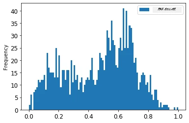

<!--
CO_OP_TRANSLATOR_METADATA:
{
  "original_hash": "917dbf890db71a322f306050cb284749",
  "translation_date": "2025-12-19T16:08:40+00:00",
  "source_file": "7-TimeSeries/2-ARIMA/README.md",
  "language_code": "te"
}
-->
# ARIMA తో టైమ్ సిరీస్ ఫోర్కాస్టింగ్

మునుపటి పాఠంలో, మీరు టైమ్ సిరీస్ ఫోర్కాస్టింగ్ గురించి కొంత తెలుసుకున్నారు మరియు ఒక డేటాసెట్‌ను లోడ్ చేసుకున్నారు, ఇది ఒక కాల వ్యవధిలో విద్యుత్ లోడ్ మార్పులను చూపిస్తుంది.

[](https://youtu.be/IUSk-YDau10 "Introduction to ARIMA")

> 🎥 పై చిత్రాన్ని క్లిక్ చేయండి వీడియో కోసం: ARIMA మోడల్స్ కు సంక్షిప్త పరిచయం. ఉదాహరణ R లో చేయబడింది, కానీ కాన్సెప్ట్‌లు సార్వత్రికం.

## [పూర్వ-లెక్చర్ క్విజ్](https://ff-quizzes.netlify.app/en/ml/)

## పరిచయం

ఈ పాఠంలో, మీరు [ARIMA: *A*uto*R*egressive *I*ntegrated *M*oving *A*verage](https://wikipedia.org/wiki/Autoregressive_integrated_moving_average) తో మోడల్స్ నిర్మించడానికి ఒక ప్రత్యేక విధానాన్ని కనుగొంటారు. ARIMA మోడల్స్ ముఖ్యంగా [నాన్-స్టేషనరీ](https://wikipedia.org/wiki/Stationary_process) డేటాను సరిపోయేలా రూపొందించడానికి అనుకూలంగా ఉంటాయి.

## సాధారణ కాన్సెప్ట్‌లు

ARIMA తో పని చేయడానికి, మీరు తెలుసుకోవలసిన కొన్ని కాన్సెప్ట్‌లు ఉన్నాయి:

- 🎓 **స్టేషనరీటీ**. గణాంక పరంగా, స్టేషనరీటీ అనగా డేటా పంపిణీ కాలంతో మారదు. నాన్-స్టేషనరీ డేటా అంటే ట్రెండ్ల కారణంగా మార్పులు చూపుతుంది, వాటిని విశ్లేషించడానికి మార్చాలి. ఉదాహరణకు, సీజనాలిటీ డేటాలో మార్పులు తీసుకురావచ్చు, దీన్ని 'సీజనల్-డిఫరెన్సింగ్' ప్రక్రియ ద్వారా తొలగించవచ్చు.

- 🎓 **[డిఫరెన్సింగ్](https://wikipedia.org/wiki/Autoregressive_integrated_moving_average#Differencing)**. గణాంక పరంగా, డిఫరెన్సింగ్ అనగా నాన్-స్టేషనరీ డేటాను స్టేషనరీగా మార్చే ప్రక్రియ, దీని ద్వారా ట్రెండ్ తొలగించబడుతుంది. "డిఫరెన్సింగ్ టైమ్ సిరీస్ స్థాయిలో మార్పులను తొలగించి, ట్రెండ్ మరియు సీజనాలిటీని తొలగించి, టైమ్ సిరీస్ సగటును స్థిరపరుస్తుంది." [షిక్సియాంగ్ మరియు ఇతరుల పేపర్](https://arxiv.org/abs/1904.07632)

## టైమ్ సిరీస్ సందర్భంలో ARIMA

ARIMA భాగాలను విప్పి చూద్దాం, ఇది టైమ్ సిరీస్ మోడలింగ్ మరియు ఫోర్కాస్టింగ్ లో ఎలా సహాయపడుతుందో అర్థం చేసుకుందాం.

- **AR - ఆటోరెగ్రెసివ్ కోసం**. ఆటోరెగ్రెసివ్ మోడల్స్, పేరుకి అనుగుణంగా, గత విలువలను విశ్లేషించి అంచనాలు వేస్తాయి. ఈ గత విలువలను 'లాగ్స్' అంటారు. ఉదాహరణకు, నెలవారీ పెన్సిల్ అమ్మకాలు డేటా. ప్రతి నెల అమ్మకాలు 'ఎవల్వింగ్ వేరియబుల్' గా పరిగణించబడతాయి. ఈ మోడల్ "ఎవల్వింగ్ వేరియబుల్ తన స్వంత లాగ్డ్ (మునుపటి) విలువలపై రిగ్రెషన్ చేయబడుతుంది." [వికీపీడియా](https://wikipedia.org/wiki/Autoregressive_integrated_moving_average)

- **I - ఇంటిగ్రేటెడ్ కోసం**. ARMA మోడల్స్ తో పోల్చితే, ARIMA లో 'I' దాని *[ఇంటిగ్రేటెడ్](https://wikipedia.org/wiki/Order_of_integration)* అంశాన్ని సూచిస్తుంది. డిఫరెన్సింగ్ దశలు వర్తింపజేసి నాన్-స్టేషనరీతను తొలగిస్తారు.

- **MA - మూవింగ్ అవరేజ్ కోసం**. ఈ మోడల్ యొక్క [మూవింగ్-అవరేజ్](https://wikipedia.org/wiki/Moving-average_model) అంశం ప్రస్తుత మరియు గత లాగ్ విలువలను పరిశీలించి అవుట్‌పుట్ వేరియబుల్‌ను నిర్ణయిస్తుంది.

మొత్తం: ARIMA ప్రత్యేక టైమ్ సిరీస్ డేటాను అత్యంత సమీపంగా సరిపోల్చడానికి ఉపయోగిస్తారు.

## వ్యాయామం - ARIMA మోడల్ నిర్మించండి

ఈ పాఠంలో [_/working_](https://github.com/microsoft/ML-For-Beginners/tree/main/7-TimeSeries/2-ARIMA/working) ఫోల్డర్ తెరవండి మరియు [_notebook.ipynb_](https://github.com/microsoft/ML-For-Beginners/blob/main/7-TimeSeries/2-ARIMA/working/notebook.ipynb) ఫైల్ కనుగొనండి.

1. `statsmodels` Python లైబ్రరీని లోడ్ చేయడానికి నోట్బుక్ నడపండి; ARIMA మోడల్స్ కోసం ఇది అవసరం.

1. అవసరమైన లైబ్రరీలను లోడ్ చేయండి

1. ఇప్పుడు, డేటా ప్లాటింగ్ కోసం మరిన్ని లైబ్రరీలను లోడ్ చేయండి:

    ```python
    import os
    import warnings
    import matplotlib.pyplot as plt
    import numpy as np
    import pandas as pd
    import datetime as dt
    import math

    from pandas.plotting import autocorrelation_plot
    from statsmodels.tsa.statespace.sarimax import SARIMAX
    from sklearn.preprocessing import MinMaxScaler
    from common.utils import load_data, mape
    from IPython.display import Image

    %matplotlib inline
    pd.options.display.float_format = '{:,.2f}'.format
    np.set_printoptions(precision=2)
    warnings.filterwarnings("ignore") # హెచ్చరిక సందేశాలను నిర్లక్ష్యం చేయాలని పేర్కొనండి
    ```

1. `/data/energy.csv` ఫైల్ నుండి డేటాను పాండాస్ డేటాఫ్రేమ్ లో లోడ్ చేసి చూడండి:

    ```python
    energy = load_data('./data')[['load']]
    energy.head(10)
    ```

1. జనవరి 2012 నుండి డిసెంబర్ 2014 వరకు అందుబాటులో ఉన్న అన్ని ఎనర్జీ డేటాను ప్లాట్ చేయండి. గత పాఠంలో ఈ డేటాను చూశాము కాబట్టి ఆశ్చర్యం ఉండకూడదు:

    ```python
    energy.plot(y='load', subplots=True, figsize=(15, 8), fontsize=12)
    plt.xlabel('timestamp', fontsize=12)
    plt.ylabel('load', fontsize=12)
    plt.show()
    ```

    ఇప్పుడు, మోడల్ నిర్మిద్దాం!

### ట్రైనింగ్ మరియు టెస్టింగ్ డేటాసెట్‌లను సృష్టించండి

ఇప్పుడు మీ డేటా లోడ్ అయింది, కాబట్టి దాన్ని ట్రైన్ మరియు టెస్ట్ సెట్లుగా విడగొట్టవచ్చు. మీరు ట్రైన్ సెట్లో మీ మోడల్‌ను ట్రైన్ చేస్తారు. సాధారణంగా, మోడల్ ట్రైనింగ్ పూర్తయిన తర్వాత, టెస్ట్ సెట్ను ఉపయోగించి దాని ఖచ్చితత్వాన్ని అంచనా వేస్తారు. టెస్ట్ సెట్లో ట్రైన్ సెట్లోని కాలం తర్వాతి కాలం ఉండాలి, తద్వారా మోడల్ భవిష్యత్ కాలం సమాచారం పొందదు.

1. సెప్టెంబర్ 1 నుండి అక్టోబర్ 31, 2014 వరకు రెండు నెలల కాలాన్ని ట్రైనింగ్ సెట్కు కేటాయించండి. టెస్ట్ సెట్లో నవంబర్ 1 నుండి డిసెంబర్ 31, 2014 వరకు రెండు నెలల కాలం ఉంటుంది:

    ```python
    train_start_dt = '2014-11-01 00:00:00'
    test_start_dt = '2014-12-30 00:00:00'
    ```

    ఈ డేటా రోజువారీ ఎనర్జీ వినియోగాన్ని ప్రతిబింబిస్తుంది, కాబట్టి ఒక బలమైన సీజనల్ ప్యాటర్న్ ఉంది, కానీ వినియోగం ఇటీవల రోజుల వినియోగానికి ఎక్కువ సమానంగా ఉంటుంది.

1. తేడాలను విజువలైజ్ చేయండి:

    ```python
    energy[(energy.index < test_start_dt) & (energy.index >= train_start_dt)][['load']].rename(columns={'load':'train'}) \
        .join(energy[test_start_dt:][['load']].rename(columns={'load':'test'}), how='outer') \
        .plot(y=['train', 'test'], figsize=(15, 8), fontsize=12)
    plt.xlabel('timestamp', fontsize=12)
    plt.ylabel('load', fontsize=12)
    plt.show()
    ```

    

    కాబట్టి, ట్రైనింగ్ కోసం తక్కువ సమయ విండో ఉపయోగించడం సరిపోతుంది.

    > గమనిక: ARIMA మోడల్ ఫిట్ చేయడానికి ఉపయోగించే ఫంక్షన్ ఇన్-సాంపుల్ వాలిడేషన్ ఉపయోగిస్తుందని, వాలిడేషన్ డేటాను మినహాయిస్తాము.

### ట్రైనింగ్ కోసం డేటాను సిద్ధం చేయండి

ఇప్పుడు, డేటాను ఫిల్టరింగ్ మరియు స్కేలింగ్ చేసి ట్రైనింగ్ కోసం సిద్ధం చేయాలి. మీ డేటాసెట్‌ను అవసరమైన కాలాలు మరియు కాలమ్స్ మాత్రమే కలిగి ఉండేలా ఫిల్టర్ చేయండి, మరియు డేటాను 0,1 మధ్యలో ప్రాజెక్ట్ చేయడానికి స్కేల్ చేయండి.

1. ఒరిజినల్ డేటాసెట్‌ను పై పేర్కొన్న కాలాలు మరియు 'load' కాలమ్ మరియు తేదీ మాత్రమే కలిగి ఉండేలా ఫిల్టర్ చేయండి:

    ```python
    train = energy.copy()[(energy.index >= train_start_dt) & (energy.index < test_start_dt)][['load']]
    test = energy.copy()[energy.index >= test_start_dt][['load']]

    print('Training data shape: ', train.shape)
    print('Test data shape: ', test.shape)
    ```

    డేటా ఆకారాన్ని చూడండి:

    ```output
    Training data shape:  (1416, 1)
    Test data shape:  (48, 1)
    ```

1. డేటాను (0, 1) పరిధిలో స్కేల్ చేయండి.

    ```python
    scaler = MinMaxScaler()
    train['load'] = scaler.fit_transform(train)
    train.head(10)
    ```

1. ఒరిజినల్ మరియు స్కేల్ చేసిన డేటాను విజువలైజ్ చేయండి:

    ```python
    energy[(energy.index >= train_start_dt) & (energy.index < test_start_dt)][['load']].rename(columns={'load':'original load'}).plot.hist(bins=100, fontsize=12)
    train.rename(columns={'load':'scaled load'}).plot.hist(bins=100, fontsize=12)
    plt.show()
    ```

    

    > ఒరిజినల్ డేటా

    

    > స్కేల్ చేసిన డేటా

1. ఇప్పుడు మీరు స్కేల్ చేసిన డేటాను కేలిబ్రేట్ చేసుకున్నందున, టెస్ట్ డేటాను కూడా స్కేల్ చేయండి:

    ```python
    test['load'] = scaler.transform(test)
    test.head()
    ```

### ARIMA అమలు చేయండి

ఇప్పుడు ARIMA అమలు చేయాల్సి ఉంది! మీరు ముందుగా ఇన్‌స్టాల్ చేసిన `statsmodels` లైబ్రరీని ఉపయోగిస్తారు.

ఇప్పుడు మీరు కొన్ని దశలను అనుసరించాలి

   1. `SARIMAX()` ను పిలిచి మోడల్ పరామితులు p, d, q మరియు P, D, Q ను అందించి మోడల్ నిర్వచించండి.
   2. ట్రైనింగ్ డేటాకు మోడల్‌ను `fit()` ఫంక్షన్ పిలిచి సిద్ధం చేయండి.
   3. `forecast()` ఫంక్షన్ పిలిచి, ముందస్తు కాలం (horizon) ను పేర్కొని అంచనాలు చేయండి.

> 🎓 ఈ అన్ని పరామితులు ఏమికో? ARIMA మోడల్‌లో మూడు పరామితులు ఉంటాయి, ఇవి టైమ్ సిరీస్ యొక్క ప్రధాన అంశాలను మోడల్ చేయడానికి ఉపయోగిస్తారు: సీజనాలిటీ, ట్రెండ్, మరియు శబ్దం. ఈ పరామితులు:

`p`: ఆటో-రెగ్రెసివ్ అంశానికి సంబంధించిన పరామితి, ఇది *గత* విలువలను కలిగి ఉంటుంది.
`d`: ఇంటిగ్రేటెడ్ భాగానికి సంబంధించిన పరామితి, ఇది టైమ్ సిరీస్‌కు *డిఫరెన్సింగ్* (🎓 మళ్లీ డిఫరెన్సింగ్ గుర్తు చేసుకోండి 👆?) వర్తింపజేస్తుంది.
`q`: మూవింగ్-అవరేజ్ భాగానికి సంబంధించిన పరామితి.

> గమనిక: మీ డేటాలో సీజనల్ అంశం ఉంటే - ఇది ఇక్కడ ఉంది - సీజనల్ ARIMA మోడల్ (SARIMA) ఉపయోగిస్తారు. ఆ సందర్భంలో మీరు మరో పరామితుల సెట్ ఉపయోగించాలి: `P`, `D`, మరియు `Q`, ఇవి `p`, `d`, మరియు `q` లాంటి సంబంధాలను సూచిస్తాయి, కానీ మోడల్ యొక్క సీజనల్ భాగాలకు సంబంధించినవి.

1. మీ ఇష్టమైన హోరిజన్ విలువను సెట్ చేయడం ప్రారంభించండి. 3 గంటలు ప్రయత్నిద్దాం:

    ```python
    # ముందుగా అంచనా వేయడానికి దశల సంఖ్యను నిర్దేశించండి
    HORIZON = 3
    print('Forecasting horizon:', HORIZON, 'hours')
    ```

    ARIMA మోడల్ పరామితుల ఉత్తమ విలువలను ఎంచుకోవడం కష్టం, ఇది కొంతవరకు సబ్జెక్టివ్ మరియు సమయం తీసుకుంటుంది. మీరు [`pyramid` లైబ్రరీ](https://alkaline-ml.com/pmdarima/0.9.0/modules/generated/pyramid.arima.auto_arima.html) నుండి `auto_arima()` ఫంక్షన్ ఉపయోగించవచ్చు.

1. ఇప్పటికీ, మంచి మోడల్ కనుగొనడానికి కొంత మాన్యువల్ ఎంపికలు ప్రయత్నించండి.

    ```python
    order = (4, 1, 0)
    seasonal_order = (1, 1, 0, 24)

    model = SARIMAX(endog=train, order=order, seasonal_order=seasonal_order)
    results = model.fit()

    print(results.summary())
    ```

    ఫలితాల పట్టిక ప్రింట్ అవుతుంది.

మీ మొదటి మోడల్‌ను నిర్మించారు! ఇప్పుడు దాన్ని ఎలా అంచనా వేయాలో చూద్దాం.

### మీ మోడల్‌ను అంచనా వేయండి

మీ మోడల్‌ను అంచనా వేయడానికి, మీరు `walk forward` వాలిడేషన్ చేయవచ్చు. ప్రాక్టికల్‌గా, టైమ్ సిరీస్ మోడల్స్ ప్రతి కొత్త డేటా అందుకున్నప్పుడు మళ్లీ ట్రైన్ చేయబడతాయి. ఇది ప్రతి టైమ్ స్టెప్‌లో ఉత్తమ ఫోర్కాస్ట్ చేయడానికి సహాయపడుతుంది.

టైమ్ సిరీస్ ప్రారంభంలో ఈ పద్ధతిని ఉపయోగించి, ట్రైన్ డేటా సెట్లో మోడల్‌ను ట్రైన్ చేయండి. తరువాత తదుపరి టైమ్ స్టెప్‌పై అంచనాలు చేయండి. అంచనా తెలిసిన విలువతో పోల్చబడుతుంది. ట్రైన్ సెట్లో ఆ విలువను చేర్చడం ద్వారా విస్తరించబడుతుంది మరియు ప్రక్రియ పునరావృతమవుతుంది.

> గమనిక: ట్రైనింగ్ సమయాన్ని సమర్థవంతంగా ఉంచడానికి, ట్రైన్ సెట్లో కొత్త ఆబ్జర్వేషన్ చేర్చినప్పుడు, మొదటి ఆబ్జర్వేషన్ తొలగించాలి.

ఈ ప్రక్రియ మోడల్ ప్రాక్టికల్‌లో ఎలా పనిచేస్తుందో మరింత బలమైన అంచనాను ఇస్తుంది. అయితే, ఇది చాలా మోడల్స్ సృష్టించాల్సిన కంప్యూటేషన్ ఖర్చుతో వస్తుంది. డేటా చిన్నదైతే లేదా మోడల్ సింపుల్ అయితే ఇది అనుకూలం, కానీ పెద్ద స్థాయిలో సమస్య కావచ్చు.

వాక్-ఫార్వర్డ్ వాలిడేషన్ టైమ్ సిరీస్ మోడల్ అంచనా వేయడంలో గోల్డ్ స్టాండర్డ్ మరియు మీ ప్రాజెక్టులకు సిఫార్సు చేయబడుతుంది.

1. మొదట, ప్రతి HORIZON స్టెప్ కోసం టెస్ట్ డేటా పాయింట్ సృష్టించండి.

    ```python
    test_shifted = test.copy()

    for t in range(1, HORIZON+1):
        test_shifted['load+'+str(t)] = test_shifted['load'].shift(-t, freq='H')

    test_shifted = test_shifted.dropna(how='any')
    test_shifted.head(5)
    ```

    |            |          | load | load+1 | load+2 |
    | ---------- | -------- | ---- | ------ | ------ |
    | 2014-12-30 | 00:00:00 | 0.33 | 0.29   | 0.27   |
    | 2014-12-30 | 01:00:00 | 0.29 | 0.27   | 0.27   |
    | 2014-12-30 | 02:00:00 | 0.27 | 0.27   | 0.30   |
    | 2014-12-30 | 03:00:00 | 0.27 | 0.30   | 0.41   |
    | 2014-12-30 | 04:00:00 | 0.30 | 0.41   | 0.57   |

    డేటా దాని హోరిజన్ పాయింట్ ప్రకారం హారిజాంటల్‌గా షిఫ్ట్ చేయబడింది.

1. ఈ స్లైడింగ్ విండో పద్ధతిలో టెస్ట్ డేటాపై అంచనాలు చేయండి, టెస్ట్ డేటా పొడవు పరిమాణంలో లూప్ లో:

    ```python
    %%time
    training_window = 720 # శిక్షణ కోసం 30 రోజులు (720 గంటలు) కేటాయించండి

    train_ts = train['load']
    test_ts = test_shifted

    history = [x for x in train_ts]
    history = history[(-training_window):]

    predictions = list()

    order = (2, 1, 0)
    seasonal_order = (1, 1, 0, 24)

    for t in range(test_ts.shape[0]):
        model = SARIMAX(endog=history, order=order, seasonal_order=seasonal_order)
        model_fit = model.fit()
        yhat = model_fit.forecast(steps = HORIZON)
        predictions.append(yhat)
        obs = list(test_ts.iloc[t])
        # శిక్షణ విండోను కదిలించండి
        history.append(obs[0])
        history.pop(0)
        print(test_ts.index[t])
        print(t+1, ': predicted =', yhat, 'expected =', obs)
    ```

    మీరు ట్రైనింగ్ జరుగుతున్నదాన్ని చూడవచ్చు:

    ```output
    2014-12-30 00:00:00
    1 : predicted = [0.32 0.29 0.28] expected = [0.32945389435989236, 0.2900626678603402, 0.2739480752014323]

    2014-12-30 01:00:00
    2 : predicted = [0.3  0.29 0.3 ] expected = [0.2900626678603402, 0.2739480752014323, 0.26812891674127126]

    2014-12-30 02:00:00
    3 : predicted = [0.27 0.28 0.32] expected = [0.2739480752014323, 0.26812891674127126, 0.3025962399283795]
    ```

1. అంచనాలను వాస్తవ లోడ్‌తో పోల్చండి:

    ```python
    eval_df = pd.DataFrame(predictions, columns=['t+'+str(t) for t in range(1, HORIZON+1)])
    eval_df['timestamp'] = test.index[0:len(test.index)-HORIZON+1]
    eval_df = pd.melt(eval_df, id_vars='timestamp', value_name='prediction', var_name='h')
    eval_df['actual'] = np.array(np.transpose(test_ts)).ravel()
    eval_df[['prediction', 'actual']] = scaler.inverse_transform(eval_df[['prediction', 'actual']])
    eval_df.head()
    ```

    అవుట్‌పుట్
    |     |            | timestamp | h   | prediction | actual   |
    | --- | ---------- | --------- | --- | ---------- | -------- |
    | 0   | 2014-12-30 | 00:00:00  | t+1 | 3,008.74   | 3,023.00 |
    | 1   | 2014-12-30 | 01:00:00  | t+1 | 2,955.53   | 2,935.00 |
    | 2   | 2014-12-30 | 02:00:00  | t+1 | 2,900.17   | 2,899.00 |
    | 3   | 2014-12-30 | 03:00:00  | t+1 | 2,917.69   | 2,886.00 |
    | 4   | 2014-12-30 | 04:00:00  | t+1 | 2,946.99   | 2,963.00 |

    గంటల వారీ డేటా అంచనాను వాస్తవ లోడ్‌తో పోల్చండి. ఇది ఎంత ఖచ్చితంగా ఉంది?

### మోడల్ ఖచ్చితత్వాన్ని తనిఖీ చేయండి

మీ మోడల్ ఖచ్చితత్వాన్ని తనిఖీ చేయడానికి, అన్ని అంచనాలపై మాధ్యమ సగటు శాతం పొరపాటు (MAPE) ను పరీక్షించండి.

> **🧮 గణితం చూపించండి**
>
> 
>
>  [MAPE](https://www.linkedin.com/pulse/what-mape-mad-msd-time-series-allameh-statistics/) ను పై సూత్రం ద్వారా నిర్వచించబడిన నిష్పత్తిగా అంచనా ఖచ్చితత్వాన్ని చూపడానికి ఉపయోగిస్తారు. actual<sub>t</sub> మరియు predicted<sub>t</sub> మధ్య తేడా actual<sub>t</sub> తో భాగించబడుతుంది. "ఈ లెక్కింపులో పరమాన్న విలువ ప్రతి అంచనా వేయబడిన సమయ బిందువు కోసం సమీకరించబడుతుంది మరియు సరిపోయిన బిందువుల సంఖ్య n తో భాగించబడుతుంది." [wikipedia](https://wikipedia.org/wiki/Mean_absolute_percentage_error)

1. సూత్రాన్ని కోడ్‌లో వ్యక్తం చేయండి:

    ```python
    if(HORIZON > 1):
        eval_df['APE'] = (eval_df['prediction'] - eval_df['actual']).abs() / eval_df['actual']
        print(eval_df.groupby('h')['APE'].mean())
    ```

1. ఒక దశ MAPE లెక్కించండి:

    ```python
    print('One step forecast MAPE: ', (mape(eval_df[eval_df['h'] == 't+1']['prediction'], eval_df[eval_df['h'] == 't+1']['actual']))*100, '%')
    ```

    ఒక దశ అంచనా MAPE:  0.5570581332313952 %

1. బహుళ దశ అంచనా MAPE ముద్రించండి:

    ```python
    print('Multi-step forecast MAPE: ', mape(eval_df['prediction'], eval_df['actual'])*100, '%')
    ```

    ```output
    Multi-step forecast MAPE:  1.1460048657704118 %
    ```

    మంచి తక్కువ సంఖ్య ఉత్తమం: MAPE 10 ఉన్న అంచనా 10% తప్పు అని భావించండి.

1. కానీ ఎప్పుడూ లాగా, ఈ రకమైన ఖచ్చితత్వ కొలతను దృశ్యంగా చూడటం సులభం, కాబట్టి దీన్ని చిత్రీకరించుకుందాం:

    ```python
     if(HORIZON == 1):
        ## ఒక దశ ముందస్తు అంచనాను చిత్రీకరించడం
        eval_df.plot(x='timestamp', y=['actual', 'prediction'], style=['r', 'b'], figsize=(15, 8))

    else:
        ## బహుళ దశల ముందస్తు అంచనాను చిత్రీకరించడం
        plot_df = eval_df[(eval_df.h=='t+1')][['timestamp', 'actual']]
        for t in range(1, HORIZON+1):
            plot_df['t+'+str(t)] = eval_df[(eval_df.h=='t+'+str(t))]['prediction'].values

        fig = plt.figure(figsize=(15, 8))
        ax = plt.plot(plot_df['timestamp'], plot_df['actual'], color='red', linewidth=4.0)
        ax = fig.add_subplot(111)
        for t in range(1, HORIZON+1):
            x = plot_df['timestamp'][(t-1):]
            y = plot_df['t+'+str(t)][0:len(x)]
            ax.plot(x, y, color='blue', linewidth=4*math.pow(.9,t), alpha=math.pow(0.8,t))

        ax.legend(loc='best')

    plt.xlabel('timestamp', fontsize=12)
    plt.ylabel('load', fontsize=12)
    plt.show()
    ```

    

🏆 చాలా మంచి ప్లాట్, మంచి ఖచ్చితత్వం ఉన్న మోడల్‌ను చూపిస్తోంది. బాగుంది!

---

## 🚀సవాలు

టైమ్ సిరీస్ మోడల్ యొక్క ఖచ్చితత్వాన్ని పరీక్షించే మార్గాలను లోతుగా పరిశీలించండి. ఈ పాఠంలో మేము MAPE గురించి మాట్లాడాము, కానీ మీరు ఉపయోగించగల ఇతర పద్ధతులు ఉన్నాయా? వాటిని పరిశోధించి వ్యాఖ్యానించండి. సహాయక పత్రం [ఇక్కడ](https://otexts.com/fpp2/accuracy.html) లభిస్తుంది

## [పోస్ట్-లెక్చర్ క్విజ్](https://ff-quizzes.netlify.app/en/ml/)

## సమీక్ష & స్వీయ అధ్యయనం

ఈ పాఠం ARIMA తో టైమ్ సిరీస్ ఫోర్కాస్టింగ్ యొక్క ప్రాథమిక అంశాలను మాత్రమే స్పర్శిస్తుంది. టైమ్ సిరీస్ మోడల్స్ నిర్మించడానికి ఇతర మార్గాలను తెలుసుకోవడానికి [ఈ రిపోజిటరీ](https://microsoft.github.io/forecasting/) మరియు దాని వివిధ మోడల్ రకాలలో లోతుగా తెలుసుకోవడానికి కొంత సమయం కేటాయించండి.

## అసైన్‌మెంట్

[కొత్త ARIMA మోడల్](assignment.md)

---

<!-- CO-OP TRANSLATOR DISCLAIMER START -->
**అస్పష్టత**:  
ఈ పత్రాన్ని AI అనువాద సేవ [Co-op Translator](https://github.com/Azure/co-op-translator) ఉపయోగించి అనువదించబడింది. మేము ఖచ్చితత్వానికి ప్రయత్నించినప్పటికీ, ఆటోమేటెడ్ అనువాదాల్లో పొరపాట్లు లేదా తప్పిదాలు ఉండవచ్చు. మూల పత్రం దాని స్వదేశీ భాషలో అధికారిక మూలంగా పరిగణించాలి. ముఖ్యమైన సమాచారానికి, ప్రొఫెషనల్ మానవ అనువాదం సిఫార్సు చేయబడుతుంది. ఈ అనువాదం వాడకంలో ఏర్పడిన ఏవైనా అపార్థాలు లేదా తప్పుదారుల కోసం మేము బాధ్యత వహించము.
<!-- CO-OP TRANSLATOR DISCLAIMER END -->