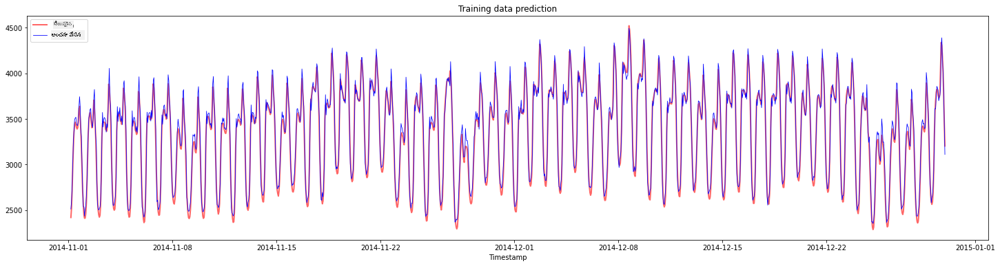
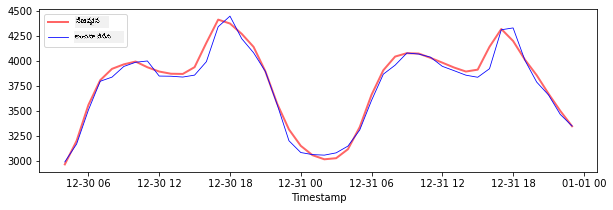

<!--
CO_OP_TRANSLATOR_METADATA:
{
  "original_hash": "482bccabe1df958496ea71a3667995cd",
  "translation_date": "2025-12-19T15:56:34+00:00",
  "source_file": "7-TimeSeries/3-SVR/README.md",
  "language_code": "te"
}
-->
# టైమ్ సిరీస్ ఫోర్కాస్టింగ్ విత్ సపోర్ట్ వెక్టర్ రిగ్రెసర్

మునుపటి పాఠంలో, మీరు టైమ్ సిరీస్ అంచనాలు చేయడానికి ARIMA మోడల్‌ను ఎలా ఉపయోగించాలో నేర్చుకున్నారు. ఇప్పుడు మీరు సపోర్ట్ వెక్టర్ రిగ్రెసర్ మోడల్‌ను చూడబోతున్నారు, ఇది నిరంతర డేటాను అంచనా వేయడానికి ఉపయోగించే రిగ్రెసర్ మోడల్.

## [ప్రీ-లెక్చర్ క్విజ్](https://ff-quizzes.netlify.app/en/ml/) 

## పరిచయం

ఈ పాఠంలో, మీరు రిగ్రెషన్ కోసం [**SVM**: **S**పోర్ట్ **V**ెక్టర్ **M**షీన్](https://en.wikipedia.org/wiki/Support-vector_machine) తో మోడల్స్‌ను నిర్మించే ఒక ప్రత్యేక విధానాన్ని కనుగొంటారు, లేదా **SVR: సపోర్ట్ వెక్టర్ రిగ్రెసర్**.

### టైమ్ సిరీస్ సందర్భంలో SVR [^1]

టైమ్ సిరీస్ అంచనాలో SVR ప్రాముఖ్యతను అర్థం చేసుకోవడానికి ముందు, మీరు తెలుసుకోవలసిన కొన్ని ముఖ్యమైన భావనలు ఇవి:

- **రిగా్రెషన్:** నిర్దేశిత ఇన్‌పుట్‌ల నుండి నిరంతర విలువలను అంచనా వేయడానికి సూపర్వైజ్డ్ లెర్నింగ్ సాంకేతికత. ఆలోచన ఏమిటంటే ఫీచర్ స్పేస్‌లో గరిష్ట సంఖ్యలో డేటా పాయింట్లను కలిగిన వక్రరేఖ (లేదా రేఖ) ను సరిపోల్చడం. మరింత సమాచారం కోసం [ఇక్కడ క్లిక్ చేయండి](https://en.wikipedia.org/wiki/Regression_analysis).
- **సపోర్ట్ వెక్టర్ మెషీన్ (SVM):** వర్గీకరణ, రిగ్రెషన్ మరియు అవుట్లయర్స్ గుర్తింపు కోసం ఉపయోగించే ఒక రకమైన సూపర్వైజ్డ్ మెషీన్ లెర్నింగ్ మోడల్. ఈ మోడల్ ఫీచర్ స్పేస్‌లో ఒక హైపర్ప్లేన్, వర్గీకరణ సందర్భంలో ఇది సరిహద్దుగా పనిచేస్తుంది, రిగ్రెషన్ సందర్భంలో ఇది ఉత్తమ సరిపోలే రేఖగా పనిచేస్తుంది. SVMలో, సాధారణంగా కర్నెల్ ఫంక్షన్ ఉపయోగించి డేటాసెట్‌ను ఎక్కువ కొలతల స్థలానికి మార్చుతారు, తద్వారా అవి సులభంగా వేరుచేయగలవు. SVMs గురించి మరింత సమాచారం కోసం [ఇక్కడ క్లిక్ చేయండి](https://en.wikipedia.org/wiki/Support-vector_machine).
- **సపోర్ట్ వెక్టర్ రిగ్రెసర్ (SVR):** SVM రకం, గరిష్ట సంఖ్యలో డేటా పాయింట్లను కలిగిన ఉత్తమ సరిపోలే రేఖ (SVM సందర్భంలో హైపర్ప్లేన్) కనుగొనడానికి.

### ఎందుకు SVR? [^1]

గత పాఠంలో మీరు ARIMA గురించి నేర్చుకున్నారు, ఇది టైమ్ సిరీస్ డేటాను అంచనా వేయడానికి చాలా విజయవంతమైన గణాంక రేఖీయ పద్ధతి. అయితే, చాలా సందర్భాల్లో టైమ్ సిరీస్ డేటాలో *నాన్-లినియారిటీ* ఉంటుంది, ఇది రేఖీయ మోడల్స్ ద్వారా మ్యాప్ చేయలేము. ఇలాంటి సందర్భాల్లో, డేటాలోని నాన్-లినియారిటీని రిగ్రెషన్ పనుల కోసం పరిగణలోకి తీసుకునే SVM సామర్థ్యం SVRని టైమ్ సిరీస్ ఫోర్కాస్టింగ్‌లో విజయవంతంగా చేస్తుంది.

## వ్యాయామం - SVR మోడల్ నిర్మించండి

డేటా సిద్ధం కోసం మొదటి కొన్ని దశలు [ARIMA](https://github.com/microsoft/ML-For-Beginners/tree/main/7-TimeSeries/2-ARIMA) పై గత పాఠంలో ఉన్నవేలా ఉంటాయి.

ఈ పాఠంలో [_/working_](https://github.com/microsoft/ML-For-Beginners/tree/main/7-TimeSeries/3-SVR/working) ఫోల్డర్‌ను తెరవండి మరియు [_notebook.ipynb_](https://github.com/microsoft/ML-For-Beginners/blob/main/7-TimeSeries/3-SVR/working/notebook.ipynb) ఫైల్‌ను కనుగొనండి.[^2]

1. నోట్బుక్‌ను రన్ చేసి అవసరమైన లైబ్రరీలను దిగుమతి చేసుకోండి:  [^2]

   ```python
   import sys
   sys.path.append('../../')
   ```

   ```python
   import os
   import warnings
   import matplotlib.pyplot as plt
   import numpy as np
   import pandas as pd
   import datetime as dt
   import math
   
   from sklearn.svm import SVR
   from sklearn.preprocessing import MinMaxScaler
   from common.utils import load_data, mape
   ```

2. `/data/energy.csv` ఫైల్ నుండి డేటాను పాండాస్ డేటాఫ్రేమ్‌లో లోడ్ చేసి చూడండి:  [^2]

   ```python
   energy = load_data('../../data')[['load']]
   ```

3. జనవరి 2012 నుండి డిసెంబర్ 2014 వరకు అందుబాటులో ఉన్న అన్ని ఎనర్జీ డేటాను ప్లాట్ చేయండి: [^2]

   ```python
   energy.plot(y='load', subplots=True, figsize=(15, 8), fontsize=12)
   plt.xlabel('timestamp', fontsize=12)
   plt.ylabel('load', fontsize=12)
   plt.show()
   ```

   

   ఇప్పుడు, మన SVR మోడల్‌ను నిర్మిద్దాం.

### శిక్షణ మరియు పరీక్ష డేటాసెట్‌లను సృష్టించండి

ఇప్పుడు మీ డేటా లోడ్ అయింది, కాబట్టి మీరు దాన్ని శిక్షణ మరియు పరీక్ష సెట్లుగా విడగొట్టవచ్చు. ఆపై మీరు SVR కోసం అవసరమైన టైమ్-స్టెప్ ఆధారిత డేటాసెట్ సృష్టించడానికి డేటాను పునఃరూపకల్పన చేస్తారు. మీరు మీ మోడల్‌ను శిక్షణ సెట్లో శిక్షణ ఇస్తారు. మోడల్ శిక్షణ పూర్తయిన తర్వాత, మీరు దాని ఖచ్చితత్వాన్ని శిక్షణ సెట్లో, పరీక్ష సెట్లో మరియు మొత్తం డేటాసెట్‌పై అంచనా వేస్తారు. మోడల్ భవిష్యత్తు కాలం నుండి సమాచారం పొందకుండా ఉండేందుకు పరీక్ష సెట్లో శిక్షణ సెట్లో కంటే తర్వాతి కాలం ఉండాలి [^2] (ఇది *ఓవర్‌ఫిట్టింగ్* అని పిలవబడే పరిస్థితి).

1. సెప్టెంబర్ 1 నుండి అక్టోబర్ 31, 2014 వరకు రెండు నెలల కాలాన్ని శిక్షణ సెట్కు కేటాయించండి. పరీక్ష సెట్లో నవంబర్ 1 నుండి డిసెంబర్ 31, 2014 వరకు రెండు నెలల కాలం ఉంటుంది: [^2]

   ```python
   train_start_dt = '2014-11-01 00:00:00'
   test_start_dt = '2014-12-30 00:00:00'
   ```

2. తేడాలను విజువలైజ్ చేయండి: [^2]

   ```python
   energy[(energy.index < test_start_dt) & (energy.index >= train_start_dt)][['load']].rename(columns={'load':'train'}) \
       .join(energy[test_start_dt:][['load']].rename(columns={'load':'test'}), how='outer') \
       .plot(y=['train', 'test'], figsize=(15, 8), fontsize=12)
   plt.xlabel('timestamp', fontsize=12)
   plt.ylabel('load', fontsize=12)
   plt.show()
   ```

   


### శిక్షణ కోసం డేటాను సిద్ధం చేయండి

ఇప్పుడు, మీరు డేటాను ఫిల్టరింగ్ మరియు స్కేలింగ్ చేయడం ద్వారా శిక్షణ కోసం సిద్ధం చేయాలి. మీరు అవసరమైన కాలాలు మరియు కాలమ్స్ మాత్రమే ఉండేలా డేటాసెట్‌ను ఫిల్టర్ చేయండి, మరియు డేటా 0,1 మధ్యలో ప్రాజెక్ట్ అయ్యేలా స్కేలు చేయండి.

1. ప్రాథమిక డేటాసెట్‌ను పై పేర్కొన్న కాలాలు మరియు 'load' కాలమ్ మరియు తేదీ మాత్రమే ఉండేలా ఫిల్టర్ చేయండి: [^2]

   ```python
   train = energy.copy()[(energy.index >= train_start_dt) & (energy.index < test_start_dt)][['load']]
   test = energy.copy()[energy.index >= test_start_dt][['load']]
   
   print('Training data shape: ', train.shape)
   print('Test data shape: ', test.shape)
   ```

   ```output
   Training data shape:  (1416, 1)
   Test data shape:  (48, 1)
   ```
   
2. శిక్షణ డేటాను (0, 1) పరిధిలో స్కేలు చేయండి: [^2]

   ```python
   scaler = MinMaxScaler()
   train['load'] = scaler.fit_transform(train)
   ```
   
4. ఇప్పుడు, పరీక్ష డేటాను స్కేలు చేయండి: [^2]

   ```python
   test['load'] = scaler.transform(test)
   ```

### టైమ్-స్టెప్స్‌తో డేటాను సృష్టించండి [^1]

SVR కోసం, మీరు ఇన్‌పుట్ డేటాను `[batch, timesteps]` రూపంలో మార్చాలి. కాబట్టి, మీరు ఉన్న `train_data` మరియు `test_data` ను పునఃరూపకల్పన చేసి, టైమ్‌స్టెప్స్‌కు సంబంధించిన కొత్త కొలతను కలిగి ఉండేలా చేస్తారు.

```python
# నంపై అర్రేలుగా మార్చడం
train_data = train.values
test_data = test.values
```

ఈ ఉదాహరణకు, మనం `timesteps = 5` తీసుకుంటాము. కాబట్టి, మోడల్‌కు ఇన్‌పుట్స్ మొదటి 4 టైమ్‌స్టెప్స్ డేటా, అవుట్‌పుట్ 5వ టైమ్‌స్టెప్ డేటా అవుతుంది.

```python
timesteps=5
```

నెస్టెడ్ లిస్ట్ కంప్రెహెన్షన్ ఉపయోగించి శిక్షణ డేటాను 2D టెన్సర్‌గా మార్చడం:

```python
train_data_timesteps=np.array([[j for j in train_data[i:i+timesteps]] for i in range(0,len(train_data)-timesteps+1)])[:,:,0]
train_data_timesteps.shape
```

```output
(1412, 5)
```

పరీక్ష డేటాను 2D టెన్సర్‌గా మార్చడం:

```python
test_data_timesteps=np.array([[j for j in test_data[i:i+timesteps]] for i in range(0,len(test_data)-timesteps+1)])[:,:,0]
test_data_timesteps.shape
```

```output
(44, 5)
```

శిక్షణ మరియు పరీక్ష డేటా నుండి ఇన్‌పుట్స్ మరియు అవుట్‌పుట్స్ ఎంపిక:

```python
x_train, y_train = train_data_timesteps[:,:timesteps-1],train_data_timesteps[:,[timesteps-1]]
x_test, y_test = test_data_timesteps[:,:timesteps-1],test_data_timesteps[:,[timesteps-1]]

print(x_train.shape, y_train.shape)
print(x_test.shape, y_test.shape)
```

```output
(1412, 4) (1412, 1)
(44, 4) (44, 1)
```

### SVR అమలు చేయండి [^1]

ఇప్పుడు, SVR అమలు చేయాల్సిన సమయం వచ్చింది. ఈ అమలుపై మరింత చదవడానికి, మీరు [ఈ డాక్యుమెంటేషన్](https://scikit-learn.org/stable/modules/generated/sklearn.svm.SVR.html) ను చూడవచ్చు. మన అమలులో, ఈ దశలను అనుసరిస్తాము:

  1. `SVR()` ను పిలిచి మోడల్‌ను నిర్వచించండి మరియు మోడల్ హైపర్‌పారామీటర్లను (kernel, gamma, c, epsilon) ఇవ్వండి
  2. `fit()` ఫంక్షన్ పిలిచి శిక్షణ డేటాకు మోడల్ సిద్ధం చేయండి
  3. `predict()` ఫంక్షన్ పిలిచి అంచనాలు చేయండి

ఇప్పుడు మనం SVR మోడల్‌ను సృష్టిస్తాము. ఇక్కడ మనం [RBF కర్నెల్](https://scikit-learn.org/stable/modules/svm.html#parameters-of-the-rbf-kernel) ఉపయోగిస్తాము, మరియు హైపర్‌పారామీటర్ల gamma, C మరియు epsilon ను వరుసగా 0.5, 10 మరియు 0.05 గా సెట్ చేస్తాము.

```python
model = SVR(kernel='rbf',gamma=0.5, C=10, epsilon = 0.05)
```

#### శిక్షణ డేటాపై మోడల్‌ను ఫిట్ చేయండి [^1]

```python
model.fit(x_train, y_train[:,0])
```

```output
SVR(C=10, cache_size=200, coef0=0.0, degree=3, epsilon=0.05, gamma=0.5,
    kernel='rbf', max_iter=-1, shrinking=True, tol=0.001, verbose=False)
```

#### మోడల్ అంచనాలు చేయండి [^1]

```python
y_train_pred = model.predict(x_train).reshape(-1,1)
y_test_pred = model.predict(x_test).reshape(-1,1)

print(y_train_pred.shape, y_test_pred.shape)
```

```output
(1412, 1) (44, 1)
```

మీరు మీ SVRని నిర్మించారు! ఇప్పుడు దాన్ని అంచనా వేయాలి.

### మీ మోడల్‌ను అంచనా వేయండి [^1]

అంచనా కోసం, ముందుగా మనం డేటాను మళ్లీ అసలు స్కేల్‌కు తీసుకువస్తాము. ఆపై, పనితీరు తనిఖీ కోసం, అసలు మరియు అంచనా టైమ్ సిరీస్ ప్లాట్‌ను చిత్రిస్తాము, అలాగే MAPE ఫలితాన్ని ముద్రిస్తాము.

అంచనా మరియు అసలు అవుట్‌పుట్‌ను స్కేలు చేయండి:

```python
# అంచనాలను స్కేలింగ్ చేయడం
y_train_pred = scaler.inverse_transform(y_train_pred)
y_test_pred = scaler.inverse_transform(y_test_pred)

print(len(y_train_pred), len(y_test_pred))
```

```python
# అసలు విలువలను స్కేలింగ్ చేయడం
y_train = scaler.inverse_transform(y_train)
y_test = scaler.inverse_transform(y_test)

print(len(y_train), len(y_test))
```

#### శిక్షణ మరియు పరీక్ష డేటాపై మోడల్ పనితీరు తనిఖీ [^1]

మనం ప్లాట్ యొక్క x-అక్షంపై చూపించడానికి డేటాసెట్ నుండి టైమ్‌స్టాంప్‌లను తీసుకుంటాము. మనం మొదటి ```timesteps-1``` విలువలను మొదటి అవుట్‌పుట్ కోసం ఇన్‌పుట్‌గా ఉపయోగిస్తున్నాము కాబట్టి, అవుట్‌పుట్ టైమ్‌స్టాంప్‌లు ఆ తర్వాత ప్రారంభమవుతాయి.

```python
train_timestamps = energy[(energy.index < test_start_dt) & (energy.index >= train_start_dt)].index[timesteps-1:]
test_timestamps = energy[test_start_dt:].index[timesteps-1:]

print(len(train_timestamps), len(test_timestamps))
```

```output
1412 44
```

శిక్షణ డేటా కోసం అంచనాలను ప్లాట్ చేయండి:

```python
plt.figure(figsize=(25,6))
plt.plot(train_timestamps, y_train, color = 'red', linewidth=2.0, alpha = 0.6)
plt.plot(train_timestamps, y_train_pred, color = 'blue', linewidth=0.8)
plt.legend(['Actual','Predicted'])
plt.xlabel('Timestamp')
plt.title("Training data prediction")
plt.show()
```



శిక్షణ డేటా కోసం MAPE ముద్రించండి

```python
print('MAPE for training data: ', mape(y_train_pred, y_train)*100, '%')
```

```output
MAPE for training data: 1.7195710200875551 %
```

పరీక్ష డేటా కోసం అంచనాలను ప్లాట్ చేయండి

```python
plt.figure(figsize=(10,3))
plt.plot(test_timestamps, y_test, color = 'red', linewidth=2.0, alpha = 0.6)
plt.plot(test_timestamps, y_test_pred, color = 'blue', linewidth=0.8)
plt.legend(['Actual','Predicted'])
plt.xlabel('Timestamp')
plt.show()
```



పరీక్ష డేటా కోసం MAPE ముద్రించండి

```python
print('MAPE for testing data: ', mape(y_test_pred, y_test)*100, '%')
```

```output
MAPE for testing data:  1.2623790187854018 %
```

🏆 మీరు పరీక్ష డేటాసెట్‌పై చాలా మంచి ఫలితాన్ని పొందారు!

### మొత్తం డేటాసెట్‌పై మోడల్ పనితీరు తనిఖీ చేయండి [^1]

```python
# లోడ్ విలువలను numpy అర్రేగా తీసుకోవడం
data = energy.copy().values

# స్కేలింగ్
data = scaler.transform(data)

# మోడల్ ఇన్‌పుట్ అవసరానికి అనుగుణంగా 2D టెన్సర్‌గా మార్చడం
data_timesteps=np.array([[j for j in data[i:i+timesteps]] for i in range(0,len(data)-timesteps+1)])[:,:,0]
print("Tensor shape: ", data_timesteps.shape)

# డేటా నుండి ఇన్‌పుట్లు మరియు అవుట్‌పుట్లను ఎంచుకోవడం
X, Y = data_timesteps[:,:timesteps-1],data_timesteps[:,[timesteps-1]]
print("X shape: ", X.shape,"\nY shape: ", Y.shape)
```

```output
Tensor shape:  (26300, 5)
X shape:  (26300, 4) 
Y shape:  (26300, 1)
```

```python
# మోడల్ అంచనాలు చేయండి
Y_pred = model.predict(X).reshape(-1,1)

# వ్యతిరేక స్కేలు చేసి ఆకారాన్ని మార్చండి
Y_pred = scaler.inverse_transform(Y_pred)
Y = scaler.inverse_transform(Y)
```

```python
plt.figure(figsize=(30,8))
plt.plot(Y, color = 'red', linewidth=2.0, alpha = 0.6)
plt.plot(Y_pred, color = 'blue', linewidth=0.8)
plt.legend(['Actual','Predicted'])
plt.xlabel('Timestamp')
plt.show()
```


```python
print('MAPE: ', mape(Y_pred, Y)*100, '%')
```

```output
MAPE:  2.0572089029888656 %
```


🏆 చాలా మంచి ప్లాట్లు, మంచి ఖచ్చితత్వం కలిగిన మోడల్‌ను చూపిస్తున్నాయి. బాగుంది!

---

## 🚀సవాలు

- మోడల్ సృష్టించే సమయంలో హైపర్‌పారామీటర్లను (gamma, C, epsilon) మార్చి పరీక్ష డేటాపై అంచనా వేయండి, ఏ హైపర్‌పారామీటర్ల సమూహం ఉత్తమ ఫలితాలు ఇస్తుందో చూడండి. ఈ హైపర్‌పారామీటర్ల గురించి మరింత తెలుసుకోవడానికి, మీరు [ఇక్కడ](https://scikit-learn.org/stable/modules/svm.html#parameters-of-the-rbf-kernel) ఉన్న డాక్యుమెంటేషన్‌ను చూడవచ్చు.
- మోడల్ కోసం వేరే కర్నెల్ ఫంక్షన్లను ఉపయోగించి వాటి పనితీరును విశ్లేషించండి. సహాయక డాక్యుమెంటేషన్ [ఇక్కడ](https://scikit-learn.org/stable/modules/svm.html#kernel-functions) ఉంది.
- అంచనా కోసం వెనుకకు చూడటానికి మోడల్‌లో `timesteps` కు వేరే విలువలను ప్రయత్నించండి.

## [పోస్ట్-లెక్చర్ క్విజ్](https://ff-quizzes.netlify.app/en/ml/)

## సమీక్ష & స్వీయ అధ్యయనం

ఈ పాఠం టైమ్ సిరీస్ ఫోర్కాస్టింగ్ కోసం SVR అప్లికేషన్‌ను పరిచయం చేయడానికి ఉంది. SVR గురించి మరింత చదవడానికి, మీరు [ఈ బ్లాగ్](https://www.analyticsvidhya.com/blog/2020/03/support-vector-regression-tutorial-for-machine-learning/) ను చూడవచ్చు. ఈ [scikit-learn డాక్యుమెంటేషన్](https://scikit-learn.org/stable/modules/svm.html) SVMs గురించి సాధారణంగా, [SVRs](https://scikit-learn.org/stable/modules/svm.html#regression) మరియు వేరే అమలు వివరాలు, వాడే వేర్వేరు [కర్నెల్ ఫంక్షన్లు](https://scikit-learn.org/stable/modules/svm.html#kernel-functions) మరియు వాటి పారామీటర్ల గురించి సమగ్ర వివరణ ఇస్తుంది.

## అసైన్‌మెంట్

[కొత్త SVR మోడల్](assignment.md)


## క్రెడిట్స్


[^1]: ఈ విభాగంలోని టెక్స్ట్, కోడ్ మరియు అవుట్‌పుట్ [@AnirbanMukherjeeXD](https://github.com/AnirbanMukherjeeXD) ద్వారా అందించబడ్డాయి
[^2]: ఈ విభాగంలోని టెక్స్ట్, కోడ్ మరియు అవుట్‌పుట్ [ARIMA](https://github.com/microsoft/ML-For-Beginners/tree/main/7-TimeSeries/2-ARIMA) నుండి తీసుకోబడ్డాయి

---

<!-- CO-OP TRANSLATOR DISCLAIMER START -->
**అస్పష్టత**:  
ఈ పత్రాన్ని AI అనువాద సేవ [Co-op Translator](https://github.com/Azure/co-op-translator) ఉపయోగించి అనువదించబడింది. మేము ఖచ్చితత్వానికి ప్రయత్నించినప్పటికీ, ఆటోమేటెడ్ అనువాదాల్లో పొరపాట్లు లేదా తప్పిదాలు ఉండవచ్చు. మూల పత్రం దాని స్వదేశీ భాషలో అధికారిక మూలంగా పరిగణించాలి. ముఖ్యమైన సమాచారానికి, ప్రొఫెషనల్ మానవ అనువాదం సిఫార్సు చేయబడుతుంది. ఈ అనువాదం వాడకంలో ఏర్పడిన ఏవైనా అపార్థాలు లేదా తప్పుదారుల కోసం మేము బాధ్యత వహించము.
<!-- CO-OP TRANSLATOR DISCLAIMER END -->