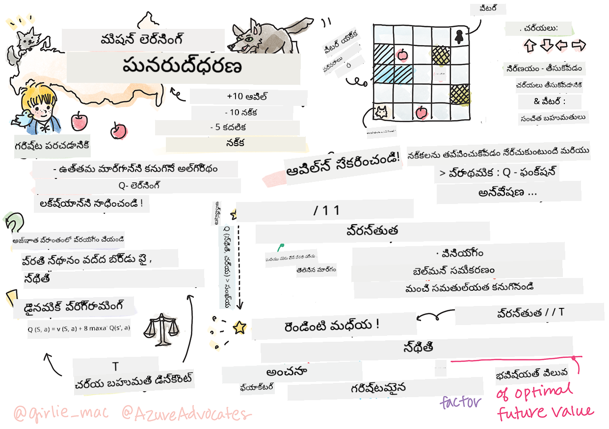

<!--
CO_OP_TRANSLATOR_METADATA:
{
  "original_hash": "911efd5e595089000cb3c16fce1beab8",
  "translation_date": "2025-12-19T15:44:59+00:00",
  "source_file": "8-Reinforcement/1-QLearning/README.md",
  "language_code": "te"
}
-->
# రీన్ఫోర్స్‌మెంట్ లెర్నింగ్ మరియు క్యూ-లెర్నింగ్ పరిచయం


> స్కెచ్‌నోట్ [టోమోమీ ఇమురా](https://www.twitter.com/girlie_mac) ద్వారా

రీన్ఫోర్స్‌మెంట్ లెర్నింగ్ మూడు ముఖ్యమైన భావనలను కలిగి ఉంటుంది: ఏజెంట్, కొన్ని స్టేట్స్, మరియు ప్రతి స్టేట్‌కు చర్యల సమూహం. ఒక నిర్దిష్ట స్టేట్‌లో చర్యను అమలు చేయడం ద్వారా, ఏజెంట్‌కు రివార్డు ఇవ్వబడుతుంది. మళ్లీ కంప్యూటర్ గేమ్ సూపర్ మారియోని ఊహించండి. మీరు మారియో, మీరు ఒక గేమ్ లెవెల్లో ఉన్నారు, ఒక క్లిఫ్ ఎడ్జ్ పక్కన నిలబడి ఉన్నారు. మీ పై ఒక నాణెం ఉంది. మీరు మారియోగా, ఒక గేమ్ లెవెల్లో, ఒక నిర్దిష్ట స్థితిలో ఉన్నారు ... అది మీ స్టేట్. కుడి వైపు ఒక అడుగు కదలడం (చర్య) మీను ఎడ్జ్ మీదకు తీసుకెళ్తుంది, మరియు అది తక్కువ సంఖ్యా స్కోర్ ఇస్తుంది. అయితే, జంప్ బటన్ నొక్కడం ద్వారా మీరు ఒక పాయింట్ పొందగలరు మరియు మీరు బతుకుతారు. అది ఒక సానుకూల ఫలితం మరియు అది మీకు సానుకూల సంఖ్యా స్కోర్ ఇవ్వాలి.

రీన్ఫోర్స్‌మెంట్ లెర్నింగ్ మరియు సిమ్యులేటర్ (గేమ్) ఉపయోగించి, మీరు గేమ్ ఆడటం నేర్చుకోవచ్చు, బతుకుతూ ఎక్కువ పాయింట్లు సాధించడానికి రివార్డును గరిష్టం చేయడానికి.

[](https://www.youtube.com/watch?v=lDq_en8RNOo)

> 🎥 పై చిత్రాన్ని క్లిక్ చేసి డ్మిత్రి రీన్ఫోర్స్‌మెంట్ లెర్నింగ్ గురించి మాట్లాడుతున్నది వినండి

## [పూర్వ-లెక్చర్ క్విజ్](https://ff-quizzes.netlify.app/en/ml/)

## ముందస్తు అవసరాలు మరియు సెటప్

ఈ పాఠంలో, మనం పాథాన్‌లో కొంత కోడ్‌తో ప్రయోగాలు చేస్తాము. మీరు ఈ పాఠం నుండి జూపిటర్ నోట్‌బుక్ కోడ్‌ను మీ కంప్యూటర్ లేదా క్లౌడ్‌లో ఎక్కడైనా నడపగలగాలి.

మీరు [పాఠం నోట్‌బుక్](https://github.com/microsoft/ML-For-Beginners/blob/main/8-Reinforcement/1-QLearning/notebook.ipynb) తెరవవచ్చు మరియు ఈ పాఠం ద్వారా నడవవచ్చు.

> **గమనిక:** మీరు ఈ కోడ్‌ను క్లౌడ్ నుండి తెరవుతున్నట్లయితే, మీరు కూడా [`rlboard.py`](https://github.com/microsoft/ML-For-Beginners/blob/main/8-Reinforcement/1-QLearning/rlboard.py) ఫైల్‌ను పొందాలి, ఇది నోట్‌బుక్ కోడ్‌లో ఉపయోగించబడుతుంది. దాన్ని నోట్‌బుక్ ఉన్న అదే డైరెక్టరీలో జోడించండి.

## పరిచయం

ఈ పాఠంలో, మనం **[పీటర్ మరియు వోల్ఫ్](https://en.wikipedia.org/wiki/Peter_and_the_Wolf)** ప్రపంచాన్ని అన్వేషిస్తాము, ఇది రష్యన్ కంపోజర్ [సెర్గే ప్రోకోఫీవ్](https://en.wikipedia.org/wiki/Sergei_Prokofiev) యొక్క సంగీత కథనంతో ప్రేరణ పొందింది. మనం **రీన్ఫోర్స్‌మెంట్ లెర్నింగ్** ఉపయోగించి, పీటర్ తన పరిసరాలను అన్వేషించి, రుచికరమైన ఆపిల్స్ సేకరించి, వోల్ఫ్‌ను కలవకుండా ఉండేందుకు సహాయపడతాము.

**రీన్ఫోర్స్‌మెంట్ లెర్నింగ్** (RL) అనేది ఒక లెర్నింగ్ సాంకేతికత, ఇది మనకు ఒక **ఏజెంట్** యొక్క ఆప్టిమల్ ప్రవర్తనను కొన్ని **పరిసరాల్లో** అనేక ప్రయోగాలు నిర్వహించడం ద్వారా నేర్చుకోవడానికి అనుమతిస్తుంది. ఈ పరిసరంలో ఏజెంట్‌కు ఒక **లక్ష్యం** ఉండాలి, ఇది **రివార్డ్ ఫంక్షన్** ద్వారా నిర్వచించబడుతుంది.

## పరిసరం

సరళత కోసం, మనం పీటర్ ప్రపంచాన్ని `width` x `height` పరిమాణం గల చతురస్ర బోర్డు అని పరిగణిద్దాం, ఇలా:


ఈ బోర్డు లో ప్రతి సెల్:

* **భూమి**, పీటర్ మరియు ఇతర జీవులు నడవగలిగే స్థలం.
* **నీరు**, ఇది మీరు స్పష్టంగా నడవలేరు.
* **చెట్టు** లేదా **గడ్డి**, మీరు విశ్రాంతి తీసుకునే స్థలం.
* **ఆపిల్**, ఇది పీటర్ తనకు ఆహారం కోసం కనుగొనడం ఇష్టపడే వస్తువు.
* **వోల్ఫ్**, ఇది ప్రమాదకరం మరియు దూరంగా ఉండాలి.

ఈ పరిసరంతో పని చేయడానికి ప్రత్యేకమైన పాథాన్ మాడ్యూల్ [`rlboard.py`](https://github.com/microsoft/ML-For-Beginners/blob/main/8-Reinforcement/1-QLearning/rlboard.py) ఉంది. ఈ కోడ్ మన భావనలను అర్థం చేసుకోవడానికి ముఖ్యమైనది కాదని, మనం మాడ్యూల్‌ను దిగుమతి చేసుకుని నమూనా బోర్డును సృష్టించడానికి ఉపయోగిస్తాము (కోడ్ బ్లాక్ 1):

```python
from rlboard import *

width, height = 8,8
m = Board(width,height)
m.randomize(seed=13)
m.plot()
```

ఈ కోడ్ పై ఉన్న పరిసర చిత్రాన్ని ముద్రించాలి.

## చర్యలు మరియు పాలసీ

మన ఉదాహరణలో, పీటర్ లక్ష్యం ఆపిల్ కనుగొనడం, వోల్ఫ్ మరియు ఇతర అడ్డంకులను దూరంగా ఉంచడం. దీని కోసం, అతను సాదారణంగా నడవగలడు ఆపిల్ కనుగొనేవరకు.

కాబట్టి, ఏ స్థితిలోనైనా, అతను క్రింది చర్యలలో ఒకదాన్ని ఎంచుకోవచ్చు: పైకి, కిందకి, ఎడమకి, కుడికి.

మనం ఆ చర్యలను డిక్షనరీగా నిర్వచించి, వాటిని సంబంధిత కోఆర్డినేట్ మార్పుల జంటలకు మ్యాప్ చేస్తాము. ఉదాహరణకు, కుడికి కదలడం (`R`) జంట `(1,0)`కి సరిపోతుంది. (కోడ్ బ్లాక్ 2):

```python
actions = { "U" : (0,-1), "D" : (0,1), "L" : (-1,0), "R" : (1,0) }
action_idx = { a : i for i,a in enumerate(actions.keys()) }
```

మొత్తం చెప్పాలంటే, ఈ సన్నివేశం యొక్క వ్యూహం మరియు లక్ష్యం ఇలా ఉన్నాయి:

- **వ్యూహం**, మన ఏజెంట్ (పీటర్) యొక్క, ఒక **పాలసీ** ద్వారా నిర్వచించబడుతుంది. పాలసీ అనేది ఏదైనా స్టేట్‌లో చర్యను తిరిగి ఇచ్చే ఫంక్షన్. మన సందర్భంలో, సమస్య యొక్క స్టేట్ బోర్డు ద్వారా ప్రాతినిధ్యం వహిస్తుంది, ఇందులో ప్లేయర్ ప్రస్తుత స్థానం కూడా ఉంటుంది.

- **లక్ష్యం**, రీన్ఫోర్స్‌మెంట్ లెర్నింగ్ యొక్క, చివరికి మంచి పాలసీ నేర్చుకోవడం, ఇది సమస్యను సమర్థవంతంగా పరిష్కరించడానికి అనుమతిస్తుంది. అయితే, ప్రాథమికంగా, మనం సులభమైన పాలసీ అయిన **రాండమ్ వాక్**ను పరిగణిద్దాం.

## రాండమ్ వాక్

ముందుగా మన సమస్యను రాండమ్ వాక్ వ్యూహం అమలు చేసి పరిష్కరించుకుందాం. రాండమ్ వాక్‌తో, మనం అనుమతించబడిన చర్యల నుండి యాదృచ్ఛికంగా తదుపరి చర్యను ఎంచుకుంటాము, ఆపిల్ చేరేవరకు (కోడ్ బ్లాక్ 3).

1. క్రింది కోడ్‌తో రాండమ్ వాక్‌ను అమలు చేయండి:

    ```python
    def random_policy(m):
        return random.choice(list(actions))
    
    def walk(m,policy,start_position=None):
        n = 0 # దశల సంఖ్య
        # ప్రారంభ స్థానాన్ని సెట్ చేయండి
        if start_position:
            m.human = start_position 
        else:
            m.random_start()
        while True:
            if m.at() == Board.Cell.apple:
                return n # విజయం!
            if m.at() in [Board.Cell.wolf, Board.Cell.water]:
                return -1 # నక్క చేత తినబడింది లేదా మునిగిపోయింది
            while True:
                a = actions[policy(m)]
                new_pos = m.move_pos(m.human,a)
                if m.is_valid(new_pos) and m.at(new_pos)!=Board.Cell.water:
                    m.move(a) # నిజమైన కదలికను చేయండి
                    break
            n+=1
    
    walk(m,random_policy)
    ```

    `walk` కాల్ సంబంధిత మార్గం పొడవును తిరిగి ఇవ్వాలి, ఇది ఒక్కో రన్‌లో మారవచ్చు.

1. వాక్ ప్రయోగాన్ని అనేక సార్లు (ఉదా: 100) నడిపించి, ఫలిత గణాంకాలను ముద్రించండి (కోడ్ బ్లాక్ 4):

    ```python
    def print_statistics(policy):
        s,w,n = 0,0,0
        for _ in range(100):
            z = walk(m,policy)
            if z<0:
                w+=1
            else:
                s += z
                n += 1
        print(f"Average path length = {s/n}, eaten by wolf: {w} times")
    
    print_statistics(random_policy)
    ```

    గమనించండి, మార్గం సగటు పొడవు సుమారు 30-40 అడుగులు, ఇది చాలా ఎక్కువ, ఎందుకంటే సమీప ఆపిల్ దూరం సగటు 5-6 అడుగులు మాత్రమే.

    మీరు రాండమ్ వాక్ సమయంలో పీటర్ కదలిక ఎలా ఉందో కూడా చూడవచ్చు:

    

## రివార్డ్ ఫంక్షన్

మన పాలసీని మరింత తెలివైనదిగా చేయడానికి, ఏ కదలికలు "మంచివి" అన్నది అర్థం చేసుకోవాలి. దీని కోసం, మన లక్ష్యాన్ని నిర్వచించాలి.

లక్ష్యం **రివార్డ్ ఫంక్షన్** రూపంలో నిర్వచించవచ్చు, ఇది ప్రతి స్టేట్‌కు కొంత స్కోర్ విలువను ఇస్తుంది. సంఖ్య ఎక్కువైతే, రివార్డ్ ఫంక్షన్ మెరుగైనది. (కోడ్ బ్లాక్ 5)

```python
move_reward = -0.1
goal_reward = 10
end_reward = -10

def reward(m,pos=None):
    pos = pos or m.human
    if not m.is_valid(pos):
        return end_reward
    x = m.at(pos)
    if x==Board.Cell.water or x == Board.Cell.wolf:
        return end_reward
    if x==Board.Cell.apple:
        return goal_reward
    return move_reward
```

రివార్డ్ ఫంక్షన్‌ల గురించి ఆసక్తికరమైన విషయం ఏమిటంటే, చాలా సందర్భాల్లో, *మనం గేమ్ చివరలోనే పెద్ద రివార్డ్ పొందుతాము*. అంటే మన అల్గోరిథం "మంచి" అడుగులను గుర్తుంచుకోవాలి, అవి చివరలో సానుకూల రివార్డ్‌కు దారితీస్తాయి, మరియు వాటి ప్రాధాన్యతను పెంచాలి. అలాగే, చెడు ఫలితాలకు దారితీసే అన్ని కదలికలను నిరుత్సాహపరచాలి.

## క్యూ-లెర్నింగ్

ఇక్కడ మనం చర్చించబోయే అల్గోరిథం **క్యూ-లెర్నింగ్** అని పిలవబడుతుంది. ఈ అల్గోరిథంలో, పాలసీ ఒక ఫంక్షన్ (లేదా డేటా స్ట్రక్చర్) ద్వారా నిర్వచించబడుతుంది, దీనిని **Q-టేబుల్** అంటారు. ఇది ప్రతి స్టేట్‌లోని చర్యల "మంచితనాన్ని" నమోదు చేస్తుంది.

దీన్ని Q-టేబుల్ అంటారు ఎందుకంటే దీన్ని సాధారణంగా ఒక పట్టిక లేదా బహుమాణిక శ్రేణిగా ప్రాతినిధ్యం వహించడం సౌకర్యవంతం. మన బోర్డు `width` x `height` పరిమాణం కలిగి ఉండగా, మనం Q-టేబుల్‌ను numpy శ్రేణిగా `width` x `height` x `len(actions)` ఆకారంలో ప్రాతినిధ్యం వహించవచ్చు: (కోడ్ బ్లాక్ 6)

```python
Q = np.ones((width,height,len(actions)),dtype=np.float)*1.0/len(actions)
```

గమనించండి, మనం Q-టేబుల్ యొక్క అన్ని విలువలను సమాన విలువతో ప్రారంభిస్తాము, మన సందర్భంలో - 0.25. ఇది "రాండమ్ వాక్" పాలసీకి సరిపోతుంది, ఎందుకంటే ప్రతి స్టేట్‌లో అన్ని కదలికలు సమానంగా మంచివి. మనం Q-టేబుల్‌ను `plot` ఫంక్షన్‌కు పంపించి బోర్డుపై పట్టికను విజువలైజ్ చేయవచ్చు: `m.plot(Q)`.


ప్రతి సెల్ మధ్యలో ఒక "అర్రో" ఉంటుంది, ఇది ప్రాధాన్యత ఉన్న కదలిక దిశను సూచిస్తుంది. అన్ని దిశలు సమానంగా ఉన్నప్పుడు, ఒక బిందువు ప్రదర్శించబడుతుంది.

ఇప్పుడు మనం సిమ్యులేషన్ నడిపించి, మన పరిసరాన్ని అన్వేషించి, Q-టేబుల్ విలువల మంచి పంపిణీని నేర్చుకోవాలి, ఇది మనకు ఆపిల్ దారిని త్వరగా కనుగొనడానికి సహాయపడుతుంది.

## క్యూ-లెర్నింగ్ సారాంశం: బెల్మన్ సమీకరణం

మనము కదలడం ప్రారంభించిన వెంటనే, ప్రతి చర్యకు తక్షణ రివార్డు ఉంటుంది, అంటే మనం సిద్దాంతంగా అత్యధిక తక్షణ రివార్డు ఆధారంగా తదుపరి చర్యను ఎంచుకోవచ్చు. అయితే, చాలా స్టేట్స్‌లో, ఆ కదలిక మన లక్ష్యం అయిన ఆపిల్ చేరుకోవడాన్ని సాధించదు, కాబట్టి ఏ దిశ మంచిదో తక్షణమే నిర్ణయించలేము.

> గమనించండి, తక్షణ ఫలితం కాదు, కానీ చివరి ఫలితం ముఖ్యం, అది మనం సిమ్యులేషన్ చివర పొందుతాము.

ఈ ఆలస్యం ఉన్న రివార్డును పరిగణలోకి తీసుకోవడానికి, మనం **[డైనమిక్ ప్రోగ్రామింగ్](https://en.wikipedia.org/wiki/Dynamic_programming)** సూత్రాలను ఉపయోగించాలి, ఇవి మన సమస్యను పునరావృతంగా ఆలోచించడానికి అనుమతిస్తాయి.

మనము ఇప్పుడు స్టేట్ *s* లో ఉన్నాము, మరియు తదుపరి స్టేట్ *s'* కి కదలాలనుకుంటున్నాము. అలా చేస్తే, మనం తక్షణ రివార్డు *r(s,a)* పొందుతాము, ఇది రివార్డ్ ఫంక్షన్ ద్వారా నిర్వచించబడుతుంది, అదనంగా కొంత భవిష్యత్ రివార్డు కూడా ఉంటుంది. మన Q-టేబుల్ ప్రతి చర్య యొక్క "ఆకర్షణ"ను సరిగ్గా ప్రతిబింబిస్తుందని అనుకుంటే, స్టేట్ *s'* లో మనం చర్య *a'* ఎంచుకుంటాము, ఇది గరిష్ట విలువ *Q(s',a')* కలిగి ఉంటుంది. కాబట్టి, స్టేట్ *s* లో మనకు లభించే ఉత్తమ భవిష్యత్ రివార్డు `max`<sub>a'</sub>*Q(s',a')* (ఇక్కడ గరిష్టం అన్ని సాధ్యమైన చర్యలపై లెక్కించబడుతుంది).

ఇది స్టేట్ *s* లో చర్య *a* కోసం Q-టేబుల్ విలువను లెక్కించే **బెల్మన్ సూత్రం**:


ఇక్కడ γ అనేది **డిస్కౌంట్ ఫ్యాక్టర్**, ఇది మీరు ప్రస్తుత రివార్డును భవిష్యత్ రివార్డుపై ఎంత ప్రాధాన్యం ఇవ్వాలో నిర్ణయిస్తుంది.

## లెర్నింగ్ అల్గోరిథం

పై సమీకరణ ఆధారంగా, మనం ఇప్పుడు మన లెర్నింగ్ అల్గోరిథం కోసం సPseudo-కోడ్ రాయవచ్చు:

* Q-టేబుల్ Qని అన్ని స్టేట్స్ మరియు చర్యల కోసం సమాన సంఖ్యలతో ప్రారంభించండి
* లెర్నింగ్ రేట్ α ← 1 గా సెట్ చేయండి
* అనేక సార్లు సిమ్యులేషన్‌ను పునరావృతం చేయండి
   1. యాదృచ్ఛిక స్థానం నుండి ప్రారంభించండి
   1. పునరావృతం చేయండి
        1. స్టేట్ *s* లో చర్య *a* ఎంచుకోండి
        2. చర్యను అమలు చేసి కొత్త స్టేట్ *s'* కి కదలండి
        3. గేమ్ ముగింపు పరిస్థితి లేదా మొత్తం రివార్డు చాలా తక్కువ అయితే సిమ్యులేషన్ నుండి బయటకు రండి  
        4. కొత్త స్టేట్‌లో రివార్డు *r* లెక్కించండి
        5. బెల్మన్ సమీకరణ ప్రకారం Q-ఫంక్షన్‌ను నవీకరించండి: *Q(s,a)* ← *(1-α)Q(s,a)+α(r+γ max<sub>a'</sub>Q(s',a'))*
        6. *s* ← *s'*
        7. మొత్తం రివార్డు నవీకరించి α తగ్గించండి.

## ఎక్స్‌ప్లోయిట్ vs ఎక్స్‌ప్లోర్

పై అల్గోరిథంలో, మనం 2.1 దశలో చర్య ఎంచుకోవడం ఎలా చేయాలో స్పష్టంగా చెప్పలేదు. యాదృచ్ఛికంగా చర్య ఎంచుకుంటే, మనం యాదృచ్ఛికంగా పరిసరాన్ని **అన్వేషిస్తాము**, మరియు మనం తరచుగా చనిపోవచ్చు అలాగే సాధారణంగా వెళ్లని ప్రాంతాలను అన్వేషించవచ్చు. మరో దృష్టికోణం, మనం ఇప్పటికే తెలిసిన Q-టేబుల్ విలువలను **ఉపయోగించి**, స్టేట్ *s* లో అత్యుత్తమ చర్యను ఎంచుకోవచ్చు. ఇది, అయితే, ఇతర స్టేట్స్‌ను అన్వేషించకుండా చేస్తుంది, మరియు మనం ఆప్టిమల్ పరిష్కారాన్ని కనుగొనకపోవచ్చు.

కాబట్టి, ఉత్తమ దృష్టికోణం అన్వేషణ మరియు వినియోగం మధ్య సమతుల్యత సాధించడం. ఇది Q-టేబుల్ విలువలకు అనుగుణంగా స్టేట్ *s* లో చర్యను ఎంచుకోవడం ద్వారా చేయవచ్చు. ప్రారంభంలో, Q-టేబుల్ విలువలు సమానంగా ఉన్నప్పుడు, ఇది యాదృచ్ఛిక ఎంపికకు సరిపోతుంది, కానీ మనం పరిసరాన్ని మరింత నేర్చుకున్నప్పుడు, మనం ఆప్టిమల్ మార్గాన్ని అనుసరించడానికి ఎక్కువ అవకాశం ఉంటుంది, మరియు ఏజెంట్ కొన్నిసార్లు అన్వేషించని మార్గాన్ని ఎంచుకునే అవకాశం ఉంటుంది.

## పాథాన్ అమలు

ఇప్పుడు మనం లెర్నింగ్ అల్గోరిథం అమలు చేయడానికి సిద్ధంగా ఉన్నాము. దానికి ముందు, మనకు Q-టేబుల్‌లోని ఏదైనా సంఖ్యలను సంబంధిత చర్యల కోసం ప్రాబబిలిటీల వెక్టర్‌గా మార్చే ఫంక్షన్ అవసరం.

1. `probs()` అనే ఫంక్షన్ సృష్టించండి:

    ```python
    def probs(v,eps=1e-4):
        v = v-v.min()+eps
        v = v/v.sum()
        return v
    ```

    ప్రారంభ సందర్భంలో వెక్టర్ యొక్క అన్ని భాగాలు సమానంగా ఉన్నప్పుడు 0తో భాగించకుండా ఉండేందుకు మేము కొంత `eps` జోడిస్తాము.

5000 ప్రయోగాలు, లేదా **ఎపోక్స్** ద్వారా లెర్నింగ్ అల్గోరిథం నడపండి: (కోడ్ బ్లాక్ 8)
```python
    for epoch in range(5000):
    
        # ప్రారంభ బిందువు ఎంచుకోండి
        m.random_start()
        
        # ప్రయాణం ప్రారంభించండి
        n=0
        cum_reward = 0
        while True:
            x,y = m.human
            v = probs(Q[x,y])
            a = random.choices(list(actions),weights=v)[0]
            dpos = actions[a]
            m.move(dpos,check_correctness=False) # మేము ప్లేయర్‌ను బోర్డు వెలుపల కదలడానికి అనుమతిస్తాము, ఇది ఎపిసోడ్‌ను ముగిస్తుంది
            r = reward(m)
            cum_reward += r
            if r==end_reward or cum_reward < -1000:
                lpath.append(n)
                break
            alpha = np.exp(-n / 10e5)
            gamma = 0.5
            ai = action_idx[a]
            Q[x,y,ai] = (1 - alpha) * Q[x,y,ai] + alpha * (r + gamma * Q[x+dpos[0], y+dpos[1]].max())
            n+=1
```

ఈ అల్గోరిథం అమలు చేసిన తర్వాత, Q-టేబుల్ విలువలు నవీకరించబడతాయి, ఇవి ప్రతి దశలో వివిధ చర్యల ఆకర్షణను నిర్వచిస్తాయి. మనం Q-టేబుల్‌ను విజువలైజ్ చేయడానికి ప్రతి సెల్‌లో ఒక వెక్టర్ డ్రా చేయవచ్చు, ఇది కదలిక యొక్క ఇష్టమైన దిశను సూచిస్తుంది. సరళత కోసం, మనం అర్రో హెడ్ స్థానంలో చిన్న వృత్తాన్ని డ్రా చేస్తాము.


## పాలసీ తనిఖీ

Q-టేబుల్ ప్రతి స్టేట్‌లోని చర్యల "ఆకర్షణ"ను సూచిస్తుండగా, మనం దీన్ని మన ప్రపంచంలో సమర్థవంతమైన నావిగేషన్ నిర్వచించడానికి సులభంగా ఉపయోగించవచ్చు. సులభమైన సందర్భంలో, మనం గరిష్ట Q-టేబుల్ విలువ కలిగిన చర్యను ఎంచుకోవచ్చు: (కోడ్ బ్లాక్ 9)

```python
def qpolicy_strict(m):
        x,y = m.human
        v = probs(Q[x,y])
        a = list(actions)[np.argmax(v)]
        return a

walk(m,qpolicy_strict)
```

> మీరు పై కోడ్‌ను అనేక సార్లు ప్రయత్నిస్తే, అది కొన్నిసార్లు "అడ్డుకుంటుంది" అని గమనించవచ్చు, మరియు మీరు దాన్ని ఆపడానికి నోట్‌బుక్‌లోని STOP బటన్‌ను నొక్కాలి. ఇది ఎందుకంటే కొన్ని సందర్భాల్లో రెండు స్థితులు పరస్పరం ఉత్తమ Q-విలువ పరంగా "సూచిస్తాయి", అప్పుడు ఏజెంట్లు ఆ స్థితుల మధ్య నిరంతరం కదులుతుంటాయి.

## 🚀సవాలు

> **పని 1:** `walk` ఫంక్షన్‌ను మార్చి మార్గం గరిష్ట పొడవును ఒక నిర్దిష్ట దశల సంఖ్య (ఉదాహరణకు, 100)తో పరిమితం చేయండి, మరియు పై కోడ్ ఈ విలువను కొన్నిసార్లు తిరిగి ఇస్తుంది అని చూడండి.

> **పని 2:** `walk` ఫంక్షన్‌ను మార్చి అది ఇప్పటికే వెళ్లిన ప్రదేశాలకు తిరిగి వెళ్లకుండా చేయండి. ఇది `walk` లూప్ అవ్వకుండా నివారిస్తుంది, అయితే ఏజెంట్ ఇంకా ఒక ప్రదేశంలో "పట్టుబడి" ఉండవచ్చు, అక్కడ నుండి బయటపడలేకపోవచ్చు.

## నావిగేషన్

మంచి నావిగేషన్ విధానం అనేది మనం శిక్షణ సమయంలో ఉపయోగించిన విధానం, ఇది అన్వేషణ మరియు వినియోగాన్ని కలిపి ఉంటుంది. ఈ విధానంలో, మనం ప్రతి చర్యను Q-టేబుల్ విలువలకు అనుగుణంగా ఒక నిర్దిష్ట సంభావ్యతతో ఎంచుకుంటాము. ఈ వ్యూహం ఏజెంట్ ఇప్పటికే అన్వేషించిన స్థానానికి తిరిగి వెళ్లే అవకాశం ఇస్తుంది, కానీ, క్రింద ఇచ్చిన కోడ్ నుండి మీరు చూడగలిగినట్లుగా, ఇది కావలసిన ప్రదేశానికి చాలా చిన్న సగటు మార్గాన్ని ఇస్తుంది (`print_statistics` 100 సార్లు సిమ్యులేషన్ నడుపుతుంది): (కోడ్ బ్లాక్ 10)

```python
def qpolicy(m):
        x,y = m.human
        v = probs(Q[x,y])
        a = random.choices(list(actions),weights=v)[0]
        return a

print_statistics(qpolicy)
```

ఈ కోడ్ నడిపిన తర్వాత, మీరు ముందు కంటే చాలా తక్కువ సగటు మార్గ పొడవును పొందుతారు, సుమారు 3-6 పరిధిలో.

## అభ్యాస ప్రక్రియను పరిశీలించడం

మనం చెప్పినట్లుగా, అభ్యాస ప్రక్రియ అన్వేషణ మరియు సేకరించిన జ్ఞానాన్ని అన్వేషణ మధ్య సమతుల్యత. అభ్యాస ఫలితాలు (ఏజెంట్‌కు లక్ష్యానికి చిన్న మార్గం కనుగొనడంలో సహాయం చేసే సామర్థ్యం) మెరుగుపడినట్లు మనం చూశాము, కానీ అభ్యాస ప్రక్రియలో సగటు మార్గ పొడవు ఎలా ప్రవర్తిస్తుందో గమనించడం కూడా ఆసక్తికరం:


అభ్యాసాలను సారాంశం చేయవచ్చు:

- **సగటు మార్గ పొడవు పెరుగుతుంది**. ఇక్కడ మనం చూస్తున్నది మొదట, సగటు మార్గ పొడవు పెరుగుతుంది. ఇది సాధ్యమైనది ఎందుకంటే మనం వాతావరణం గురించి ఏమీ తెలియకపోతే, మనం చెడు స్థితుల్లో, నీరు లేదా నక్కలో చిక్కిపోవచ్చు. మనం ఎక్కువ నేర్చుకుంటే మరియు ఈ జ్ఞానాన్ని ఉపయోగించడం ప్రారంభిస్తే, మనం వాతావరణాన్ని ఎక్కువ కాలం అన్వేషించవచ్చు, కానీ మనం ఆపిల్స్ ఎక్కడ ఉన్నాయో బాగా తెలియదు.

- **మార్గ పొడవు తగ్గుతుంది, మనం ఎక్కువ నేర్చుకున్నప్పుడు**. మనం సరిపడా నేర్చుకున్న తర్వాత, ఏజెంట్ లక్ష్యాన్ని సాధించడం సులభం అవుతుంది, మరియు మార్గ పొడవు తగ్గడం ప్రారంభిస్తుంది. అయితే, మనం ఇంకా అన్వేషణకు తెరవబడినవారు, కాబట్టి మనం తరచుగా ఉత్తమ మార్గం నుండి దూరంగా వెళ్ళి కొత్త ఎంపికలను అన్వేషిస్తాము, మార్గం ఆప్టిమల్ కంటే ఎక్కువ పొడవుగా మారుతుంది.

- **పొడవు అకస్మాత్తుగా పెరుగుతుంది**. ఈ గ్రాఫ్‌లో మనం గమనించే మరో విషయం ఏమిటంటే, ఒక సమయంలో పొడవు అకస్మాత్తుగా పెరిగింది. ఇది ప్రక్రియ యొక్క యాదృచ్ఛిక స్వభావాన్ని సూచిస్తుంది, మరియు మనం ఒక సమయంలో Q-టేబుల్ గుణకాలను కొత్త విలువలతో మళ్లీ రాయడం ద్వారా "దెబ్బతీయవచ్చు". ఇది సాధారణంగా అభ్యాస రేటును తగ్గించడం ద్వారా తగ్గించాలి (ఉదాహరణకు, శిక్షణ చివర్లో, మనం Q-టేబుల్ విలువలను చిన్న విలువతో మాత్రమే సవరించాలి).

మొత్తానికి, అభ్యాస ప్రక్రియ విజయవంతం మరియు నాణ్యత చాలా పరామితులపై ఆధారపడి ఉంటుంది, ఉదాహరణకు అభ్యాస రేటు, అభ్యాస రేటు తగ్గింపు, మరియు డిస్కౌంట్ ఫ్యాక్టర్. వీటిని తరచుగా **హైపర్‌పరామితులు** అంటారు, ఇవి శిక్షణ సమయంలో మనం ఆప్టిమైజ్ చేసే **పరామితుల** నుండి వేరుగా ఉంటాయి (ఉదాహరణకు, Q-టేబుల్ గుణకాలు). ఉత్తమ హైపర్‌పరామితుల విలువలను కనుగొనడం ప్రక్రియను **హైపర్‌పరామితి ఆప్టిమైజేషన్** అంటారు, ఇది ఒక ప్రత్యేక విషయం.

## [పోస్ట్-లెక్చర్ క్విజ్](https://ff-quizzes.netlify.app/en/ml/)

## అసైన్‌మెంట్  
[మరింత వాస్తవిక ప్రపంచం](assignment.md)

---

<!-- CO-OP TRANSLATOR DISCLAIMER START -->
**అస్పష్టత**:  
ఈ పత్రాన్ని AI అనువాద సేవ [Co-op Translator](https://github.com/Azure/co-op-translator) ఉపయోగించి అనువదించబడింది. మేము ఖచ్చితత్వానికి ప్రయత్నించినప్పటికీ, ఆటోమేటెడ్ అనువాదాల్లో పొరపాట్లు లేదా తప్పిదాలు ఉండవచ్చు. మూల పత్రం దాని స్వదేశీ భాషలో అధికారిక మూలంగా పరిగణించాలి. ముఖ్యమైన సమాచారానికి, ప్రొఫెషనల్ మానవ అనువాదం సిఫార్సు చేయబడుతుంది. ఈ అనువాదం వాడకంలో ఏర్పడిన ఏవైనా అపార్థాలు లేదా తప్పుదారితీసే అర్థాలు కోసం మేము బాధ్యత వహించము.
<!-- CO-OP TRANSLATOR DISCLAIMER END -->